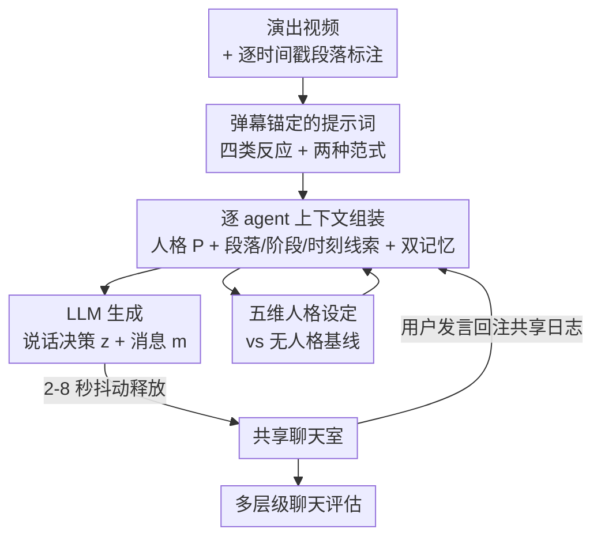

# Does Persona Make LLMs K-pop Fans? A Pilot Study of LLM-Based Online Concert Audience Agents

**会议**: ICML2026  
**arXiv**: [2606.07837](https://arxiv.org/abs/2606.07837)  
**代码**: 待确认  
**领域**: 多智能体 / 人机交互 / 文化 AI 评测  
**关键词**: LLM 智能体, 在线演唱会, 观众模拟, 人格条件化, 集体体验

## 一句话总结
作者搭了一套十个 LLM 智能体实时刷弹幕的"虚拟观众"系统，给录播的 K-pop 演出配上真人感的粉丝聊天，并通过一次 N=11 的被试内试点实验发现：给每个智能体加上独立人格能显著提升模型输出层面的多样性和"自然度"，但**并不能**转化为更强的社交连接感、参与度或情感共鸣——因为 K-pop 弹幕本质上是"集体独白"而非人际对话。

## 研究背景与动机

**领域现状**：演唱会的核心不只是音画质量，而是观众同步反应（欢呼、应援、刷屏）所共同构成的"在场感"。线上演唱会扩大了可及性，但录播视频通常是一个人孤独地看，剥离了这种集体临场。已有研究让"集体感"回到异步视频的做法主要是**回放历史观众数据**：弹幕（danmaku）把过去观众的评论按时间轴叠到画面上，或把历史聊天数据转成 VR 场景里虚拟化身的行为。

**现有痛点**：这些"回放"方案天生受限——必须先攒够足量的真实观众反应才能用，对冷门视频、冷门艺人就失灵了。几乎没人尝试用 AI **动态生成**新的观众反应。

**核心矛盾**：能不能让 LLM 现编出可信的 K-pop 粉丝弹幕，从而摆脱对历史数据的依赖？而 K-pop 粉丝文化高度"个体化"——粉丝有各自的本命成员、参与热度、聊天风格，所以作者押注：给每个智能体注入**独立人格**，应该能产出更多样、更可信的 AI 观众。

**本文目标**：构建一套多智能体 LLM 观众系统，并严谨地检验"人格条件化"这个设计假设到底有没有用——既看模型输出质量，也看真实用户的主观体验。

**切入角度**：作者没有止步于"输出更像人了"，而是用被试内实验把**模型层面的差异**和**用户层面的体验**拆开测量，正是这个拆分暴露了二者之间的鸿沟。

**核心 idea**：人格条件化（persona conditioning）能让 AI 观众"看起来"更自然，但文化上有意义的集体体验，需要的是人格、群体行为、粉圈身份与用户期待之间更深层的对齐，而不只是单个智能体更像真人。

## 方法详解

### 整体框架

系统是一个部署成实时 Web 应用的多智能体框架：用户一边看 K-pop 演出视频，一边和十个 LLM 驱动的观众智能体同处一个聊天室，可以自由发言。本研究的目标视频是 LOONA《Butterfly》舞台（约 4 分钟），由人工逐时间戳标注了音乐结构、当前主唱、关键编舞事件。

整条流水线每 8 秒触发一次生成：系统先取出当前时刻的**段落标注** $S_t=\{\text{section}, \text{vocals}, \text{description}\}$，配上**阶段引导** $G_t\in\{\text{preshow}, \text{performance}, \text{postshow}\}$ 和**时刻线索** $M_{i,t}$（高亮副歌、关键编舞、收尾等显著事件）。每个智能体再各自带上两块对话记忆，连同人格设定一起组装成专属上下文，喂给 LLM 产出"是否发言 + 发什么"，最后带随机抖动地把消息释放到共享聊天里。

### 关键设计

**1. 基于真实弹幕的提示词设计：让 AI 的话锚在真实粉丝文化里**

如果直接让 LLM 凭空"扮演 K-pop 粉丝"，产出的弹幕容易飘、不像行话。作者先抓取了一段真实 YouTube K-pop 演出直播的弹幕日志，沿用音乐受众评论的编码体系，归纳出四类主要行为：① 互动（与艺人或其他观众交流，如喊话、夸赞）、② 集体反应（线下演唱会式的鼓掌、欢呼）、③ 个人想法（自言自语式的偏好、怀旧）、④ 情感（emoji 或短促爆发式的情绪）。此外还专门把两种高频范式当作设计要点：重复刷本命名字的应援、以及第一人称提问。这些观察被写进**共享全局提示词**里，作为少样本（few-shot）锚定材料，确保不论有没有人格，所有智能体的输出风格都站在真实弹幕惯例上——这也是后面控制变量的关键。

**2. 上下文条件化的逐 agent 生成：双记忆缓冲驱动同步反应**

系统把观众行为建模成"逐智能体、上下文条件化"的生成过程。对每个智能体 $i$，在时刻 $t$ 组装出专属上下文

$$X_{i,t}=\{P_i, S_t, G_t, M_{i,t}, \mathcal{H}_{i,t}, \mathcal{C}_t\}$$

其中 $P_i$ 是该智能体的人格说明，$\mathcal{H}_{i,t}$ 是它自己最近 6 条消息的**个人历史缓冲**（用来抑制自我重复），$\mathcal{C}_t$ 是含全部智能体与真人参与者最近 10 条消息的**共享聊天日志**（让智能体之间、智能体与用户之间能互相接话）。LLM 把上下文映射为结构化输出 $f_\theta(X_{i,t})=\{z_{i,t}, m_{i,t}\}$，其中 $z_{i,t}\in\{0,1\}$ 是二元的说话决策，$m_{i,t}$ 是候选消息——也就是说，**"这一轮要不要开口"本身也由模型决定**，而不是强制每个智能体每轮都说话。十个智能体被打包进单次调用，消息生成后再叠加 2–8 秒均匀随机抖动才释放，并提前 8 秒于会话时钟启动生成，以掩盖推理延迟、模拟真实打字节奏。后端用支持 WebSocket 的 FastAPI 实现，用户发言会注入共享上下文 $\mathcal{C}_t$，在下一轮被智能体看到并回应。

**3. 五维人格设定与无人格基线：用身份差异制造行为多样性**

作者沿五个维度定义十个观众智能体：年龄、性别、地区、本命（最喜欢的成员 bias）、聊天风格，覆盖从"高频刷本命的死忠"到"无本命的初次观看者"等不同参与模式。每个智能体的人格文本拼接到共享全局提示词后面，全局提示词负责任务框架、输出格式约束和人格一致性规则。为了干净地评估人格的贡献，作者设了**无人格基线**：把十个智能体的人格文本全置空、昵称只剩光秃秃的名字，但保留同一套全局提示词和同样的少样本弹幕范例——这样响应质量的差异只能归因于"人格条件化"本身，而非示例材料不均。一个重要细节是：无人格基线下采样温度从 0.7 上调到 1.2，否则模型会**输出坍缩**到几乎雷同的句子。

**4. 多层级聊天评估指标：把"模型输出"和"用户体验"分开量化**

这套指标是论文能得出反直觉结论的工具。在**输出层面**，把每场会话的弹幕当成一份语料：用 Distinct-2（二元组占比）和 Self-BLEU-2（越低越多样）测词汇多样性，用逐字重复率测坍缩，用平均消息长度测产量。在**逐智能体 profile spread** 层面，对每个逐智能体指标（重复率、平均长度、每条 emoji 数、全大写率、消息条数）计算十个智能体间的极差（max − min）——极差大说明智能体被人格区分得开，极差小说明它们坍缩成近乎同一个 profile。主观侧则在每个条件后让被试填 IOS（社交连接感）、UES-SF（参与度）、SAM（情感效价/唤醒/支配）和一项 1–7 的"自然度"李克特量表。鉴于样本只有 11 人，作者强调被试内的 Cohen's $d_z$ 效应量与 Mann–Whitney 检验，而非单纯看显著性。

## 实验关键数据

### 主实验：模型层面的差异极其显著

人格条件化在**模型输出层面**带来了戏剧性的分化：多样性大涨、逐字重复大降、十个智能体的行为被彻底拉开。最极端的是说话频率的极差——无人格条件下十个智能体几乎都顶着每轮一条（约 32 条/场）的天花板说个不停，加了人格后则变成"设计对齐的签名"，从最安静的 9.2 条到最活跃的 31.8 条不等。

| 指标（模型层面） | 效应量 $d_z$ | 含义 |
|------|------|------|
| Distinct-2（词汇多样性） | +5.63 | 人格条件多样性大幅提升 |
| Self-BLEU-2（越低越多样） | −3.48 | 输出更不重复 |
| 逐字重复率 | −1.41 | 消除了"十人齐刷同一句"的坍缩 |
| 平均消息长度 | +2.65 | 消息更长 |
| 说话频率极差 | +13.64 | 最响/最静智能体差 23 条（无人格仅差 1 条）|
| emoji 极差 / 全大写极差 | +3.92 / +3.66 | 各行为维度同时被拉开 |

一个生动的坍缩例子：无人格条件下十个智能体在开场前同时刷出 "orbits assemble"（直接照抄提示词示例），整场反复出现这种"复制级联"。人格条件化则彻底消除了这种行为。

### 关键发现：主观体验并不跟着走

| 主观指标 | 结果 | 是否区分两条件 |
|------|------|------|
| 感知自然度 | $M_{\text{persona}}=5.45$ vs $M_{\text{no-persona}}=4.00$，$p=.045$，$r=.43$ | ✅ 唯一显著 |
| IOS（社交连接感） | $\lvert r\rvert<0.15$，不显著 | ❌ |
| UES-SF（参与度） | $\lvert r\rvert<0.15$，不显著 | ❌ |
| SAM（情感效价/唤醒/支配） | $\lvert r\rvert<0.15$，不显著 | ❌ |

也就是说，被试**察觉到了**人格条件更自然，但这种察觉没有转化成任何其他维度的体验差异。访谈给出了解释：① 多数被试（N=8）根本分不清单个智能体，他们关注的是聊天的"整体氛围与趋势"，realism 来自重复刷屏、同步反应这类**集体动态**，而非个体人格——K-pop 弹幕更像"集体独白"而非人际对话；② 共享文化语境决定参与意愿，被试因不熟悉 LOONA 这个具体艺人和粉圈（"对不上成员的名字和脸"）而难以投入。值得注意的是，连无人格条件也足以唤起基本的"一起看"的共在感（N=6 报告"像和别人一起看"），这与社交连接感无显著差异的定量结果一致。

人格签名与设计意图也并非处处对齐：**身份锚定**的潜水提示（"只为本命破例"的 Gowon-only 粉、"她不在镜头时就安静"的 Yves-only 粉）强烈压低了发言（均值 9.2、11.7 条），但**行为指令式**提示（"很少打字""不刷屏"）几乎压不住——被要求"很少打字"的新人智能体平均仍刷了 30.8/32 条。

## 亮点与洞察
- **把"输出质量"和"用户体验"硬拆开测**，是这篇试点研究最有价值的方法论贡献：它用 $d_z=+13.64$ 这种夸张的模型层面效应，对照出主观侧几乎全军覆没，干净地证伪了"输出更自然就等于体验更好"的隐含假设。
- **"集体独白 vs 人际对话"**这个文化洞察很有迁移价值：在弹幕、直播这类场景里，用户消费的是群体氛围而非个体，盲目堆砌单个智能体的拟真度可能投错了资源——该优化的是群体级交互模式。
- **身份锚定 vs 行为指令**的对比是个可复用的提示词工程经验：想让 LLM 智能体"少说话"，给它一个会自然导致沉默的身份（"潜水党、只为本命破例"）远比直接命令"少打字"有效。

## 局限与展望
- **样本极小且非目标粉圈**：N=11，且无人是 LOONA 的粉丝（Orbits），被试因不认识具体艺人而难以投入，这很可能压低了所有条件下的体验分。作者自己也指出，需要找**目标艺人的真实粉丝**重做，才能检验"粉圈对齐后自然度能否转化为社交/情感体验"。
- **单视频、单群体**：只测了一个 4 分钟的 LOONA 舞台，结论能否推广到其他艺人、其他长度、其他音乐文化未知。
- **语言与文化错位**：系统跑英文、被试是说英文的韩国粉丝，语言障碍和不熟悉的粉圈黑话本身就限制了参与。
- **改进方向**：作者计划研究"披露 AI 中介"如何影响参与（有人觉得知道是 AI 反而降低了社交压力），以及如何把个体粉丝特质聚合成群体级交互模式——这才是真正能撬动"集体动态"的杠杆。

## 相关工作与启发
- **vs 弹幕 / VR 化身回放（Chen et al., 2017; Lee et al., 2025）**：他们回放历史观众数据，必须先攒够真实反应；本文用 LLM 动态生成新反应，摆脱对历史数据的依赖，代价是真人感和文化贴合度仍是难题。
- **vs 人格化 LLM 做人群模拟（Argyle et al., 2023; Manning et al., 2024）**：那条线用人格逼近总体级反馈，且近期工作发现更丰富的人格不一定更真实、反而可能放大刻板印象；本文同样观察到"人格更丰富 ≠ 体验更好"，并把原因归到文化语境而非建模精度。
- **vs 生成式智能体的社会涌现（Park et al., 2023）**：那类工作让人格智能体在沙盒里长期互动、涌现社会轨迹；本文借鉴"把弹幕当作多智能体涌现的群体级反应"的视角，但场景是实时、与真人同处的演唱会聊天。

## 评分
- 新颖性: ⭐⭐⭐⭐ 首个用 LLM 多智能体动态生成 K-pop 演唱会观众弹幕的系统，且问题切入（拆模型/体验）有巧思。
- 实验充分度: ⭐⭐⭐ 模型层面指标扎实，但用户研究 N=11 且非目标粉圈，只能算 pilot。
- 写作质量: ⭐⭐⭐⭐ 结构清晰，反直觉结论讲得很有说服力，访谈与定量互证。
- 价值: ⭐⭐⭐⭐ "集体独白""文化对齐"的洞察对文化 AI 智能体与社交化产品有启发。

<!-- RELATED:START -->

## 相关论文

- [\[ACL 2026\] HACHIMI: Scalable and Controllable Student Persona Generation via Orchestrated Agents](../../ACL2026/multi_agent/hachimi_scalable_and_controllable_student_persona_generation_via_orchestrated_ag.md)
- [\[AAAI 2026\] Scalable and Accurate Graph Reasoning with LLM-Based Multi-Agents](../../AAAI2026/multi_agent/scalable_and_accurate_graph_reasoning_with_llm-based_multi-agents.md)
- [\[ICML 2026\] EngiAgent: Fully Connected Coordination of LLM Agents for Solving Open-ended Engineering Problems with Feasible Solutions](engiagent_fully_connected_coordination_of_llm_agents_for_solving_open-ended_engi.md)
- [\[ICML 2026\] When Cloud Agents Meet Device Agents: Lessons from Hybrid Multi-Agent Systems](when_cloud_agents_meet_device_agents_lessons_from_hybrid_multi-agent_systems.md)
- [\[ICML 2026\] Toward Culturally Aligned LLMs through Ontology-Guided Multi-Agent Reasoning](toward_culturally_aligned_llms_through_ontology-guided_multi-agent_reasoning.md)

<!-- RELATED:END -->
