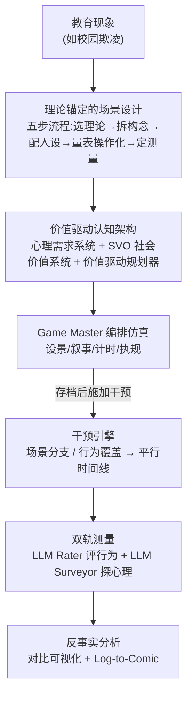

# EduMirror: Modeling Educational Social Dynamics with Value-driven Multi-agent Simulation

**会议**: ICML2026  
**arXiv**: [2606.07948](https://arxiv.org/abs/2606.07948)  
**代码**: 项目页 https://edumirror.net  
**领域**: 多智能体模拟 / 计算社会科学 / LLM Agent  
**关键词**: 教育社会动态, 价值驱动智能体, 多智能体模拟, 心理需求, 反事实干预

## 一句话总结
EduMirror 把"校园欺凌""同伴合作"这类教育社会现象搬进一个由 LLM 驱动的多智能体沙盒：用基于马斯洛需求层次和社会价值取向（SVO）的"价值驱动智能体"扮演学生/老师，再配一套"双轨测量"协议把可观测行为和潜在心理状态都量化出来，从而在伦理安全的数字环境里做"如果换一种干预会怎样"的反事实实验。

## 研究背景与动机

**领域现状**：教育社会动态（学生之间、师生之间、家校之间的持续互动）决定了孩子的发展轨迹，是教育政策的核心关切。研究它的传统手段有两类——问卷/观察性研究，以及随机对照实验（RCT）。

**现有痛点**：问卷和观察只能抓到静态相关，且在敏感话题（欺凌、自尊）上自我报告严重失真（社会期望偏差、自我认知有限）；而真正能做因果推断的 RCT，在教育场景里往往不道德也不可行——你不能为了实验真的去操纵谁被孤立、谁被剥夺帮助。结果是：**没有一个系统化框架能把教育社会动态的"生成机制"操作化并模拟出来**，反事实干预测试无从谈起。

**核心矛盾**：传统基于规则的智能体建模（ABM，如 BDI 模型）虽然可解释，但靠手写规则，刻画不了人类心理的细腻和非理性（保真度与可定制性困境）；反过来，直接拿 LLM 当社会智能体虽然"像人"，却卡在**测量难题**——自尊、同伴压力这些驱动行为的潜在心理状态在行为里是看不见的，怎么量化？

**本文目标**：构建一个既有心理学理论根基、又能借 LLM 生成能力产出真实/可解释/可测量行为的认知计算框架，专门服务教育研究。

**切入角度**：作者认为教育场景的智能体不能用通用 agent 架构，必须把行为约束在一个**面向教育的认知架构**里——把行为显式地锚定到"社会价值取向 + 基本心理需求"上。

**核心 idea**：用"价值驱动智能体（心理需求 + SVO）"替代手写规则智能体来获得保真度，再用"双轨测量协议（LLM Rater + LLM Surveyor）"把潜在心理状态抽出来解决测量难题，两者合起来支撑反事实干预分析。

## 方法详解

### 整体框架
EduMirror 建立在 Concordia（一个以自然语言为媒介的多智能体仿真后端）之上，用自然语言而非预定义动作集来驱动智能体，换来开放式响应（flexibility）和角色/环境的可扩展（scalability）。整个平台由四大模块组成：**智能体模型库**、**理论锚定的场景设计**、**由 Game Master 编排的仿真引擎**、**用户工具包**。一次完整研究的流程是：先把抽象的教育现象（如"社会比较理论"）翻译成可计算场景 → 实例化价值驱动智能体在共享环境里自主互动 → 在关键节点存档并施加干预生成平行分支 → 用双轨测量把交互日志变成可分析的数据。

### 关键设计

**1. 五步理论锚定的场景构造：把"现象"翻译成"可计算实验"**

教育现象是模糊的，直接让 LLM 演容易跑飞，也无法和理论对话。EduMirror 用一套固定五步把抽象现象变成可复现场景：(1) 选一个奠基理论（如社会比较理论）作科学锚点；(2) 把理论拆解成核心构念（fundamental constructs）；(3) 据此配置智能体人设——初始化 traits、goals、formative memories；(4) 用经过验证的心理量表把构念操作化；(5) 建立由 LLM Rater 和 LLM Surveyor 组成的双轨测量协议。这样实验输出始终能回连到具体的理论构念，而不是"看起来像那么回事"。当前场景库有 20 个预设场景，覆盖同伴/群体动态、个体社会认知、课堂文化、家校动态四大主题，落在课堂、宿舍、操场、食堂、家、教师办公室等 8 个预配置虚拟环境里；同一套智能体配置在不同环境里会因情境规范不同而表现出情境依赖的行为。

**2. 价值驱动认知架构：用"心理需求 + SVO"给行为找内在动机**

这是保真度的来源。每个智能体含两个核心模块——**价值系统**和**价值驱动规划器**。价值系统又分两层。个体价值系统（Psychological Needs）把内在动机锚定到马斯洛需求层次和积极心理学 PERMA 模型，形式化为 5 大类（安全、心理健康、自尊、社会归属、意义与成长）共 13 个子维度，每个用 0–10 的 Likert 量表表示，初始值和期望值从人格特质映射而来。对每个需求维度 $d$，定义未满足缺口 $\Delta_t(d)=\mathrm{clip}(v^*(d)-v_t(d),0,S_{\max})$，其中 $v^*(d)$ 是期望值、$v_t(d)$ 是当前值，这个非负缺口度量"现状离理想还差多远"，是后续行动评估的基本目标。社会价值系统（Personality Orientation）则引入社会价值取向理论：每个智能体有稳定的目标取向（利他/亲社会/个人主义/竞争），但每一步的有效取向由当前动机状态和对他人的推断影响动态决定。它聚合出两个被裁剪的非负信号 $S_{\text{self}}(t)$（自己未满足缺口）和 $S_{\text{other}}(t)$（行为对他人需求满足的推断影响），用一个连续取向信号表示社会偏好：

$$\theta_t=\arctan\!\left(\frac{S_{\text{other}}(t)+\varepsilon}{S_{\text{self}}(t)+\varepsilon}\right),\quad \varepsilon=10^{-6}$$

由于两信号都被裁剪为非负，$\theta_t\in[0,\pi/2]$，越小越自利、越大越利他。$\theta_t$ 作为提示级的社会取向条件传给规划器，约束它如何在"自我需求削减/对他人影响/与 SVO 人设一致性"三者间权衡候选动作。这套设计的关键在于：它不靠手写 if-else，而是把人格通过需求缺口和取向角连续地调制进每一步决策，所以才能产出"高初始自尊更抗压、低自尊更易崩"这类心理学上说得通的动态。

**3. 价值驱动规划器：把需求动力学和社会推理拧成一次动作选择**

规划器是连接个体需求与 SVO 社会推理的决策模块。给定交互历史 $\mathcal{H}_{<t}$、人设 $P$、环境 $e$、定制信息 $I$、需求缺口 $\Delta_t$ 和 SVO 条件 $\theta_t$，它先生成一组候选动作 $\mathcal{A}_t=\mathrm{Gen}_\phi(\mathcal{H}_{<t},P,e,I,\Delta_t,\theta_t)$，再给每个候选打一个提示条件化的比较分 $q_a=E_\phi(a\mid\Delta_t,\theta_t)$（综合需求缺口削减、对他人影响、SVO 一致性），最后选最高分 $a_t=\arg\max_{a\in\mathcal{A}_t}q_a$。这里 $E_\phi$ 是结构化的 LLM 判断而非手写数值效用函数——这正是相比传统 ABM 的区别：评估标准是语义化的、随情境演化的，而不是固定权重。整套行为生成被形式化为条件序列建模 $a_t\sim\mathrm{Agent}_\phi(\cdot\mid\mathcal{H}_{<t},I,P,e)$，价值驱动只是其中一种实例化。

**4. 双轨测量协议：让看不见的心理状态变成可统计的数字**

这是测量难题的解法，也是反事实分析的前提。两个 LLM 评估器分工：**LLM Rater** 作用于已完成的交互轨迹，给可观测行为打分，抓的是"外显动作"；**LLM Surveyor** 则探查智能体的内部心理状态——仿真时把内部状态记录下来，事后对这些状态施加心理测量问卷（如自尊量表 RSES、SVO 滑块问卷）。关键是两者分离：Surveyor 是 post-hoc 的，不打断正在进行的互动，从而既不污染仿真动力学，又能定量访问"内置价值变量之外"的心理构念。配套的干预引擎支持两类干预——场景分支（改环境/叙事轨迹）和行为控制（单步覆盖某个体的动作），在匹配的初始条件下生成平行时间线；再加对比可视化和把日志渲染成连环画的 Log-to-Comic 做定性审阅。

## 实验关键数据

实验分三块：系统级真实性验证 + 两个案例研究（校园欺凌、同伴互动），并与五个代表性基线对比：迭代推理类（ReAct、BabyAGI）、情境条件类（LLMob、JAG-Concordia）、以及最接近的欲望驱动智能体 D2A。

### 主实验：可扩展性（幼儿园场景）
在一个含 1 名教师 + 多名儿童智能体、横跨大门/教室/操场/走廊/午睡室的幼儿园场景里，把智能体数量从 5 扩到 15、30，用自然度/连贯性/合理性/发展典型性四指标的均分评估。EduMirror 在所有规模下都拿最高分。

| 智能体数 | EduMirror | LLMob | BabyAGI | D2A | ReAct |
|---------|-----------|-------|---------|-----|-------|
| 5 | **4.80** | 4.25 | 4.10 | 3.35 | 2.35 |
| 15 | **4.18** | 3.60 | 3.57 | 3.53 | 2.93 |
| 30 | **4.03** | 3.83 | 3.86 | 3.12 | 2.41 |

系统级上，跨 17 个教育场景的成对胜率热力图（LLM 事后评估）中，EduMirror 取得最强的平均胜率，说明优势是跨场景稳定的而非个例。

### 案例研究与干预分析

| 实验 | 设置 | 关键发现 |
|------|------|---------|
| 欺凌真实性 | 10 真实案例 vs 10 模拟案例，152 份问卷盲测 | 参与者难以区分真假，6 组识别率低于 30%，部分组 >52% 选"难以分辨" |
| 心理动态对比 | 15 个欺凌场景，模拟受害者，GPT-4o 评自然度/连贯性/合理性 | EduMirror 全面超五基线；高初始值更抗压，低初始值更易崩，与 RSES 量表分下滑一致 |
| 教师干预（欺凌） | 无干预 / 权威惩戒 / 支持个体 / 合作支持 | 有效性递增，**合作支持型**在全部心理需求维度改善最大 |
| SVO 消融（同伴互动） | 去掉 SVO 机制 | 不同人格画像之间的区分被削弱，合作–竞争模式趋同 |
| 班级选举干预 | 团队竞争 / 教师提醒 / 预先教育 | 团队制和公平导向教育产出最稳定（方差最小），无干预时恶性竞争波动最大 |

### 关键发现
- **SVO 是人格区分度的关键**：消融去掉它后，利他/竞争等画像彼此趋同，证明社会价值取向才是"演出不同性格"的核心机制。
- **干预效果排序有教育学意义**：从忽视 → 权威惩戒 → 支持个体 → 合作支持，效果单调递增，且合作支持对自尊和意义两个高阶需求改善最显著——这给现实教育干预提供了可检验的模板。
- **盲测难辨真假**说明价值驱动叙事的真实性已逼近真实案例，是该框架"能当计算实验室用"的直接证据。

## 亮点与洞察
- **把心理学理论"编译"进 agent**：13 维需求缺口 + SVO 取向角 $\theta_t$ 这套形式化，是用连续标量把抽象心理需求接进 LLM 决策的可复用范式，可迁移到任何需要"内在动机驱动"的社会模拟。
- **双轨测量解决了 LLM 社会模拟的老大难**：把"评行为（Rater）"和"探心理（Surveyor，post-hoc 不干扰仿真）"拆开，既要可量化又不污染动力学，这个分离思路值得借鉴到任何需要测量 agent 内部状态的研究。
- **反事实分支 + Log-to-Comic**：在关键节点存档生成平行时间线，把"如果老师当时这样做"变成可对比实验，再用连环画做定性审阅，定量定性两条腿走路。

## 局限与展望
- 作者明确承认：平台是"增强人类专家"而非替代纵向实证研究，模拟行为与复杂人类现实之间存在固有 gap。
- 真实性评估高度依赖 LLM 评估器（GPT-4o 当裁判），虽然报告与人评高度一致，但 LLM 裁判本身的偏好可能系统性影响胜率结论。
- 心理需求初始值由人格特质映射而来（Table 9），这层映射的有效性本身是个假设；13 维需求和 SVO 四类取向是否足以覆盖教育场景的心理复杂度，仍待更大规模验证。
- 反事实结论的外部效度存疑：模拟出"合作支持最有效"与既有教育文献一致是好事，但也意味着它可能只是在复述训练语料里的共识，能否发现真正新颖的反事实规律有待考察。

## 相关工作与启发
- **vs 传统 ABM（BDI 模型）**：它们用手写逻辑规则，可解释但心理保真度低、刻画不了非理性行为；EduMirror 用 LLM 生成 + 价值约束，换来真实性，代价是可解释性和可控性需靠测量协议补回来。
- **vs 通用 LLM 社会智能体（Generative Agents、D2A 等）**：通用架构缺乏教育场景特定的心理建模（青少年发展需求、社会等级、情感脆弱性）；EduMirror 把生成约束在面向教育的认知架构里，显式锚定 SVO 和心理需求。论文实验中 D2A 是最接近的价值类基线，EduMirror 在各场景持续胜出。
- **vs 欲望驱动 D2A / 社会动机 Lin et al. 2026**：EduMirror 复用 D2A 的智能体库框架并沿用其 SVO 思路，但把它专门适配到教育社会动态，并补上双轨测量与干预引擎这套"研究工具链"。

## 评分
- 新颖性: ⭐⭐⭐⭐ 把心理学理论形式化进价值驱动 agent + 双轨测量，组合新颖且针对教育场景定制，但单点技术多为已有思路（Concordia/D2A/SVO）的适配整合。
- 实验充分度: ⭐⭐⭐⭐ 系统级 + 两案例 + 多种干预 + 盲测 + 量表验证，覆盖面广；但核心评估依赖 LLM 裁判，缺真正的纵向外部效度检验。
- 写作质量: ⭐⭐⭐⭐ 动机—测量难题—方法的逻辑链清晰，形式化与理论锚定讲得到位。
- 价值: ⭐⭐⭐⭐ 为伦理受限的教育因果研究提供了可用的"计算实验室"，工具链完整、面向落地，对计算社会科学有实际推动力。

<!-- RELATED:START -->

## 相关论文

- [\[ACL 2026\] Social Dynamics as Critical Vulnerabilities that Undermine Objective Decision-Making in LLM Collectives](../../ACL2026/multi_agent/social_dynamics_as_critical_vulnerabilities_that_undermine_objective_decision-ma.md)
- [\[NeurIPS 2025\] MetaMind: Modeling Human Social Thoughts with Metacognitive Multi-Agent Systems](../../NeurIPS2025/multi_agent/metamind_modeling_human_social_thoughts_with_metacognitive_multi-agent_systems.md)
- [\[ACL 2026\] Preference Estimation via Opponent Modeling in Multi-Agent Negotiation](../../ACL2026/multi_agent/preference_estimation_via_opponent_modeling_in_multi-agent_negotiation.md)
- [\[AAAI 2026\] MedLA: A Logic-Driven Multi-Agent Framework for Complex Medical Reasoning with Large Language Models](../../AAAI2026/multi_agent/medla_a_logic-driven_multi-agent_framework_for_complex_medic.md)
- [\[ACL 2025\] CoMet: Metaphor-Driven Covert Communication for Multi-Agent Language Games](../../ACL2025/multi_agent/comet_metaphor-driven_covert_communication_for_multi-agent_language_games.md)

<!-- RELATED:END -->
