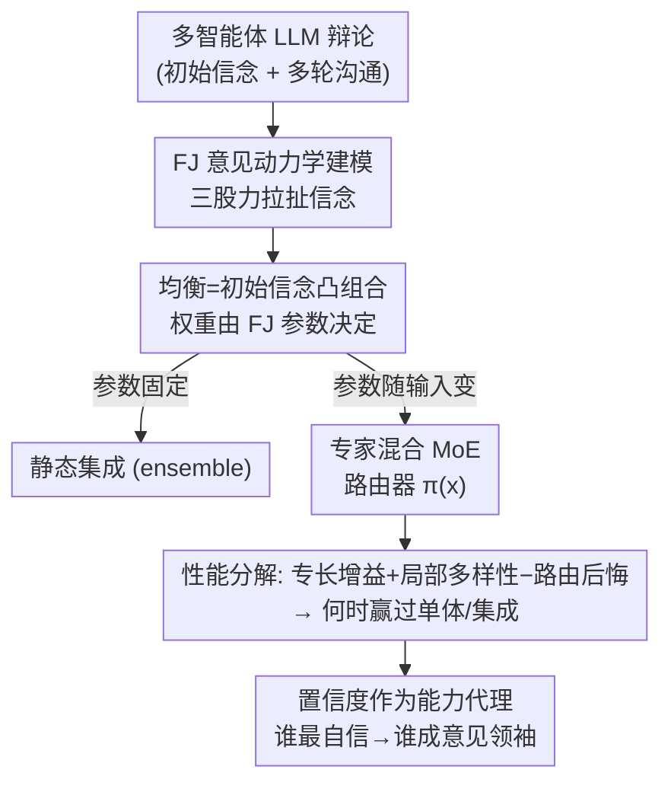

# Multi-Agent Systems are Mixtures of Experts: Who Becomes an Influencer?

**会议**: ICML 2026  
**arXiv**: [2605.25929](https://arxiv.org/abs/2605.25929)  
**代码**: 待确认  
**领域**: 多智能体 / 多智能体LLM / 理论分析  
**关键词**: 多智能体LLM, 意见动力学, 专家混合, 路由, 影响力

## 一句话总结
本文用社会学里的 **Friedkin-Johnsen（FJ）意见动力学**给"多个 LLM 智能体辩论"建模，证明 FJ 参数是**随输入变化**的——这等价于让多智能体系统（MAS）实现了一个**专家混合（MoE）+ 隐式路由**；进而从理论上刻画 MAS 何时能赢过单智能体和静态集成，并通过实验揭示"谁会成为意见领袖"主要由**置信度（尤其是相对置信度）**决定。

## 研究背景与动机
**领域现状**：把多个 LLM 组成多智能体系统（MAS）让它们迭代辩论、互相修正，被寄望于"不同智能体贡献互补专长、提升决策质量"，在策略推理、协商、生成式设计上很受关注。

**现有痛点**：可现实里 MAS 相比单智能体或静态集成（static ensemble）的收益时有时无、参差不齐。大家缺一个**原理性框架**来回答：辩论过程中意见到底怎么演化？影响力怎么分配？为什么有的智能体更有说服力？没有这个框架，MAS 设计基本靠拍脑袋堆智能体。

**核心矛盾**：MAS 的成败取决于"影响力有没有流向当下最有能力的智能体"。但真正的**能力（competence）是隐变量**——它依赖具体问题、无法直接观测。于是矛盾就成了：路由该信什么信号？只能信那些**可观测的代理变量**（置信度、同伴影响、初始意见对齐度），但这些代理和真实能力之间的对应关系并不可靠。

**本文目标**：（1）给 LLM 辩论一个可解析的信念传播模型；（2）说清这套机制和 MoE 的等价性；（3）找出影响力到底由哪些可观测信号驱动，以及这种"隐式路由"什么时候靠谱、什么时候会把信任错配给说错话的智能体。

**切入角度**：作者注意到 FJ 模型（一个被广泛用于社交网络信念传播的线性动力学模型）能很好地拟合 LLM 辩论的轨迹，而且它的参数（顽固度、保留度、影响矩阵）**会随输入问题变化**。一旦参数随输入变，这套系统就不再是固定权重的集成，而是一个会随输入切换专家权重的 MoE。

**核心 idea**：用一句话概括——**把"多智能体辩论收敛"看成 FJ 动力学，其输入相关的均衡权重 $\pi_j(x)$ 就是 MoE 的路由器**；于是 MAS = 隐式 MoE，影响力的涌现 = 路由的形成。

## 方法详解

### 整体框架
这是一篇理论分析 + 实证驱动的论文，"方法"指的是一套分析框架，逻辑链是：**先用 FJ 模型刻画辩论**（每个智能体的信念随时间被三股力拉扯并收敛到均衡），**再证明均衡其实是初始信念的凸组合**——若 FJ 参数固定，整个系统等价于一个静态集成；**关键转折是 FJ 参数随输入变化**，这让系统升级成 MoE，影响力权重 $\pi_j(x)$ 就是随输入切换的路由器；**有了 MoE 视角就能借力 MoE 理论**，把 MAS 性能分解成"专长增益 + 局部多样性 − 路由后悔"，推出 MAS 何时赢过单智能体/集成；**最后落到可操作信号**——既然真实能力不可观测，就分析置信度等代理变量能否近似它、近似得好不好。

### 关键设计

**1. 用 FJ 意见动力学刻画辩论：信念被三股力拉扯到均衡**

痛点是辩论缺一个可解析的信念演化模型。FJ 模型把每个智能体 $i$ 的信念 $b_i(t)$（一个在答案集合上的概率分布，比如多选题各选项的概率）的更新写成三项之和：

$$b_i(t+1)=\underbrace{\gamma_i s_i}_{\text{对初始信念的固守}}+\underbrace{(1-\gamma_i)\alpha_i b_i(t)}_{\text{对上一刻的保留}}+\underbrace{(1-\gamma_i)(1-\alpha_i)\sum_{j}w_{ij}b_j(t)}_{\text{同伴影响拉力}}$$

其中 $\gamma_i$ 是**顽固度**（attachment to innate belief），$\alpha_i$ 是对上一状态的保留权重，$W=[w_{ij}]$ 是行随机的影响矩阵（$\sum_j w_{ij}=1$、$w_{ii}=0$）。写成矩阵形式 $B(t+1)=\Gamma S + H B(t)$，当谱半径 $\rho(H)<1$ 时收敛到唯一均衡，且每个智能体的均衡信念是所有初始信念的**凸组合** $b_i^\star=\sum_j m_{ij}s_j$（Prop 2.1）。这一步的意义在于：辩论的最终结果可以被一个解析的、非负行随机的混合矩阵 $M=(I-H)^{-1}\Gamma$ 完全描述。作者实测这个简单线性模型就足以拟合 LLM 辩论（无需更复杂的级联过程）。

**2. 输入相关参数 = MoE：辩论其实是隐式路由**

如果 FJ 参数 $(\Gamma, A, W)$ 是固定的，那 MAS 就退化成一个静态集成——把多样智能体的意见按固定权重平均，这已经能靠方差缩减比单智能体强一点。但本文的核心观察是：FJ 参数**随输入问题 $x$ 变化**，即 $(\Gamma(x), A(x), W(x))$，于是聚合权重也随输入变 $\pi_j(x)$。这正好是 MoE 的定义（Hypothesis 2.2）：

$$b^\star(x)=\sum_{j=1}^{n}\pi_j(x)\,s_j(x)$$

路由器 $\pi_j(x)$ 依赖输入。换句话说，MAS 隐式实现了一套**自适应路由**——它的好坏取决于影响力有没有被导向对当前输入最有能力的智能体。而且作者发现，路由主要依赖各智能体的**初始信念 $s_i(x)$**（虽然这些信念并没被显式说出来，但它们定义了智能体的置信、能力和初始对齐度）。

**3. 性能分解：MAS 何时赢过单智能体与集成**

有了 MoE 视角就能用 MoE 理论分析。作者把性能（用 Brier loss $\ell(y,p)=\|p-e_y\|_2^2$ 衡量）做"局部歧义分解"（Lemma 2.3）：在给定可观测信念 $S$ 下，混合预测的期望损失 $=\sum_j a_j(S) r_j(S) - D_{a(S)}(S)$，第一项奖励"把权重放到局部能力强（$r_j$ 小）的智能体上"，第二项奖励"平均多样的信念"。由此得到 MAS 赢过最优单智能体的条件（Theorem 2.4）：

$$\underbrace{\mathbb{E}[r_{j^*}(S)-\min_j r_j(S)]}_{\text{专长增益}}+\underbrace{\mathbb{E}[D_{\pi(S)}(S)]}_{\text{局部多样性}}>\underbrace{\mathbb{E}[\delta_\pi(S)]}_{\text{路由后悔}}$$

即"没有哪个智能体处处最优带来的专长空间 + 保留下来的多样性收益，必须盖过路由不完美的代价"。类似地（Theorem 2.5），MAS 赢过静态集成的条件是"把权重移向局部能力强者的收益 > 偏离固定集成损失的多样性"。结论很关键：**单纯堆智能体不会变好**——智能体必须局部能力强、互补，且路由能从可观测信号识别出他们。

**4. 置信度作为能力的代理：谁最自信谁就成意见领袖**

真实能力 $r_j(S)$ 不可观测，路由器只能用代理。最自然的代理是**置信度**，作者用初始信念的熵来定义：

$$C_j(S)=1-\frac{1}{\log d}\mathcal{H}(s_j)$$

熵越低（信念越尖锐）置信度越高。一个置信度路由器形如 $\pi_j(S)\propto \exp(\beta C_j(S))$。但只有当**置信度与能力校准良好**时（存在递减函数使 $r_j\approx\phi(C_j)$，即越自信确实越对）这种路由才有益；若智能体"自信地犯错"（overconfident when wrong），路由后悔 $\delta_C(S)$ 会很大，反而不如静态集成。作者还区分绝对置信度和**相对置信度** $R_j(S)=C_j(S)/C_{(n-1)}(S)$（与第二自信的智能体相比），并用理论案例证明：在能力互斥、置信校准良好时，硬路由到最自信者能严格优于最优固定集成（Prop 2.6/2.7）；但路由错误率 $\delta$ 一旦超过某个阈值，优势就被抹掉。这条线把"影响力涌现"落到了一个可检验的社会信号上。

### 一个例子：最自信者带偏多数
论文 Fig. 3 给了一个典型场景：5 个智能体里多数一开始持有**错误**答案，按固定集成（取平均）会被多数带偏、给出错解；但有一个**初始最自信**的智能体持正确答案，在 FJ 辩论中它顽固地坚持、并把影响力（$\pi$）集中到自己身上，最终说服多数改口、系统输出正确。这正是 MoE 路由相对集成的优势所在——它能利用"局部专长 + 自信信号"绕过多数表决的陷阱；反过来，如果那个最自信的智能体恰好是自信地错了，同样的机制就会把全系统带沟里。

## 实验关键数据

### 设置与 FJ 拟合质量
实验用 MMLU-Pro（采 300 题，类别均衡）、BBQ（300 题）、CSQA（沿用 100 题子集）；3 个模型 GPT-5.4 Mini、Qwen2.5-14B-Instruct、Qwen2.5-72B-Instruct-GPTQ-Int8；5 个智能体在完全图上辩论 5 轮，跑 3 个种子。通过角色提示（医生 / 数学家 / 粗心学生）和沟通风格（简洁 / 平衡 / 情绪化）制造智能体多样性。FJ 模型对辩论动力学拟合得很好：

| 拟合指标 | 均值 ± 95% CI |
|----------|---------------|
| KL 散度 | 0.0470 ± 0.0034 |
| MSE | 0.00198 ± 0.00026 |

FJ 参数在不同样本间**变异性很高**（Fig. 1a），直接证明参数随输入变化、聚合权重 $\pi$ 随输入变化，实证确认了"MAS = MoE"的 Hypothesis 2.2。

### 影响力由什么驱动（路由可解释性）
用随机森林把各可观测变量回归/分类到"谁成为最有影响力的智能体"，再用逻辑回归看各变量相对权重：

| 分析 | 结果 |
|------|------|
| 随机森林回归 influence | 测试 $R^2 \approx 0.7$ |
| 随机森林分类"最有影响力者" | 准确率 $\approx 0.9$ |
| 逻辑回归最强正预测因子 | 置信度（绝对 + 相对）、能力 |
| 次要但显著的因子 | 提示风格（perceived confidence）、初始对齐度 |
| 影响力 vs 顽固度 $\gamma$ | 强正相关（顽固者更有影响力） |

### 关键发现
- **MAS 常优于集成**：附录 Table 3 显示，智能体系统比"取最大初始信念平均"基线和"拟合固定 FJ 参数的集成"都更好，印证路由是输入相关的、即 MoE。
- **趋向共识但影响力高度集中**：尽管初始意见多样，最后一轮往往收敛到共识，且影响力集中在少数智能体身上——这种"强路由决策"正是需要被理解的对象。
- **相对置信度比绝对置信度更能预测影响力**：凸显影响力涌现的"社会性"——不是你多自信，而是你比别人多自信。
- **置信者更顽固**：自信的智能体倾向更固守初始信念（无论是否与多数对齐），而这种自信不一定有能力支撑——这正是路由可能错配信任的风险点。
- **角色会改变影响力**：换个角色提示（如"专家"）就能改变一个智能体的影响力，说明"感知到的置信度（perceived confidence）"也参与了 FJ 动力学。

## 亮点与洞察
- **"MAS = MoE"这层等价是全文最漂亮的一跳**：它把一个混沌的、靠 prompt 拼凑的多智能体辩论，对应到机器学习里成熟的 MoE 理论框架，于是"何时该用 MAS""怎么设计 MAS"立刻有了可分析的抓手——专长增益、局部多样性、路由后悔三项分解直接给出设计原则。
- **把"影响力"还原成可观测代理**：真实能力不可观测，但置信度（熵）、相对置信度、对齐度都能从初始信念里算出来，于是"谁成意见领袖"从玄学变成可回归、可预测（$R^2{=}0.7$、分类准确率 0.9）的问题。
- **诚实地点出失败模式**：自信地犯错 + 多数共享偏见会让路由把信任导给错的智能体，这对实际 MAS 设计是直接的警告——不能只追求智能体多样，必须保证置信度校准。这套"校准决定路由可信度"的洞察可迁移到任何依赖自评信号做聚合的系统。

## 局限与展望
- **任务局限在多选 QA**：FJ 用的信念是答案集合上的概率分布，目前只在 MMLU-Pro/BBQ/CSQA 这类有明确标签的选择题上验证，开放式生成、工具调用等场景能否套用这套凸组合刻画仍是开放问题（作者也把它列为未来方向）。
- **路由器只是"读出"而非"优化"**：本文是解释 deliberation 涌现出的路由，而非设计更好的路由；作者建议用图神经网络（置换不变、可跨通信拓扑泛化）学更精确的路由，但也承认复杂通信未必是高性能的必要条件。
- **线性 FJ 可能掩盖非线性交互**：简单线性动力学拟合得好（KL 0.047）固然优雅，但是否在更长辩论、更强 LLM 上仍成立、会不会漏掉非线性的说服机制，证据有限。
- **"能力"的度量本身存疑**：用"对正确答案的信念大小"当能力代理，在标签未知或模糊的真实任务里无法计算，这让整套校准分析的可操作性打折扣。

## 相关工作与启发
- **vs FJ 安全框架（Abedini et al., 2026）**：前作用 FJ 评估"顽固智能体"带来的系统性安全风险，本文复用同一 FJ 建模，但把视角转到"参数随输入变 → MoE 路由"，关注的是性能何时提升而非安全风险。
- **vs 经典 MoE（Jacobs et al., 1991）**：标准 MoE 的路由器是监督训练出来、能看到标签预测特征的；本文的 MAS 没有显式训练路由器、也拿不到标签，路由是辩论隐式实现的——这是两者本质区别，也让"无监督下能否识别局部能力"成为核心难题。
- **vs 自一致性（Self-Consistency）**：作者指出 SC 那种"从采样里挑好答案"也能实现类似路由的效果，且蒸馏出的单一强模型可能比复杂 MAS 交互更高效；但这类强单模型若与互补专家组合，仍可成为 MAS 里有价值的一员。

## 评分
- 新颖性: ⭐⭐⭐⭐⭐ "多智能体辩论 = 隐式 MoE"的等价刻画视角新颖且统一了一堆零散现象。
- 实验充分度: ⭐⭐⭐⭐ 3 数据集 × 3 模型 × 3 种子 + 随机森林/逻辑回归归因，但仅限多选 QA、缺开放式任务验证。
- 写作质量: ⭐⭐⭐⭐ 理论推导层层递进、定理动机清楚，但大量结果图表在附录、定理证明偏简。
- 价值: ⭐⭐⭐⭐ 给 MAS 设计提供了可分析的理论原则（局部能力 + 校准 + 路由），对"何时该上多智能体"有直接指导意义。

<!-- RELATED:START -->

## 相关论文

- [\[ICML 2026\] MASPO: Joint Prompt Optimization for LLM-based Multi-Agent Systems](maspo_joint_prompt_optimization_for_llm-based_multi-agent_systems.md)
- [\[ICLR 2026\] Stochastic Self-Organization in Multi-Agent Systems](../../ICLR2026/multi_agent/stochastic_self-organization_in_multi-agent_systems.md)
- [\[ICML 2026\] Securing Multi-Agent Systems Against Corruptions via Node Contribution Backpropagation](securing_multi-agent_systems_against_corruptions_via_node_contribution_backpropa.md)
- [\[ICML 2026\] Voting Protocols as Coordination Mechanisms for Role-Constrained Multi-Agent Tutoring Systems](voting_protocols_as_coordination_mechanisms_for_role-constrained_multi-agent_tut.md)
- [\[ACL 2026\] Conjunctive Prompt Attacks in Multi-Agent LLM Systems](../../ACL2026/multi_agent/conjunctive_prompt_attacks_in_multi-agent_llm_systems.md)

<!-- RELATED:END -->
