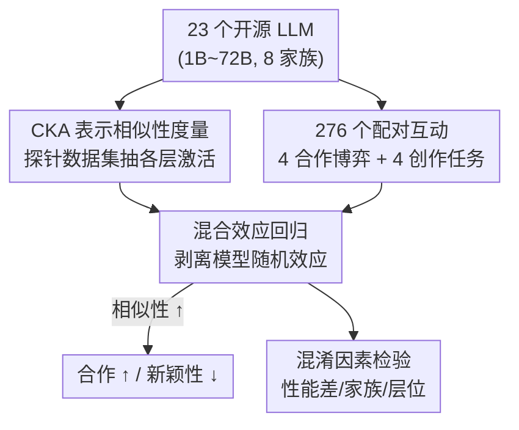

# Representational Similarity and Model Behavior in Multi-Agent Interaction

**会议**: ICML2026  
**arXiv**: [2606.07818](https://arxiv.org/abs/2606.07818)  
**代码**: 待确认  
**领域**: 多智能体 / LLM 交互分析  
**关键词**: 表示相似性, 多智能体, 合作, 新颖性, CKA

## 一句话总结
这篇论文把 276 个 LLM 配对放进 8 个游戏里互动，发现一个稳健规律：内部表示越相似（用 CKA 量化）的两个模型越能合作，但联手产出的内容越缺乏新颖性——合作与创造力之间存在一条由表示相似性驱动的权衡线。

## 研究背景与动机
**领域现状**：多智能体 LLM 系统已经从概念走向落地，被用于社会模拟、协同写代码、头脑风暴和科研创意生成。主流认知是「多智能体优于单智能体」，所以很多系统直接堆模型；但绝大多数部署是把同一个模型复制多份，几乎没人认真研究「该把哪些模型组合在一起」。

**现有痛点**：已有研究几乎只盯着多智能体的**输出层行为**（谁合作了、谁搭便车），而对「为什么会这样、内部机制是什么」缺乏刻画。同时，神经科学早就发现人类之间「神经相似性」能预测社交亲密度和合作，而创新往往来自**异质个体**的碰撞——但没人验证这套规律是否迁移到 AI。

**核心矛盾**：合作需要双方「想到一块去」（对齐），而创新需要双方「想得不一样」（多样）。如果表示相似性同时影响这两端，那它就可能是一条同时拉高合作、压低新颖性的隐形杠杆——这正是多智能体系统设计里被忽视的核心张力。

**本文目标**：回答一个明确的实证问题——两个模型的**表示相似性**与它们**交互行为**（合作 / 新颖性）之间到底是什么关系？并排除「这只是性能差距/模型大小/同家族」等混淆因素后，相似性是否仍是独立的强预测因子。

**切入角度**：借用神经科学的「相似神经响应预测合作、异质激发创新」假说，把它平移到 LLM：用 CKA 度量两个模型内部表示的相似度，再让它们在大量博弈和创作任务里互动，回归分析相似性对结果的影响。

**核心 idea**：用「表示相似性」这一个可计算的内部指标，去预测多智能体交互的两类宏观行为——合作与新颖性，并证明它是独立、稳健、且主要来自**早期层**的预测因子。

## 方法详解

### 整体框架
这是一篇**实证分析**论文，不提出新模型，而是搭建一条「测相似性 → 让模型互动 → 回归分析」的流水线，去检验一个假设。整体分三步：先用探针数据集抽取每个模型各层的表示，用 CKA 算出 276 个配对的相似度分数；再让这 23 个开源模型两两配对，跑 4 个合作博弈和 4 个创作任务；最后用混合效应回归把相似性对结果的影响从模型自身能力差异中剥离出来。

### 关键设计

**1. CKA 表示相似性度量：把「两个模型有多像」压成一个可比分数**

要验证假设，第一步得有个能跨架构、跨层数比较两个模型内部表示的指标。论文用线性 **CKA**（Centered Kernel Alignment）：对每个模型，用探针数据集 $\mathcal{D}=\{x_i\}_{i=1}^m$（如 WikiText 采样 1000 条 prompt）抽取第 $k$ 层最后一个 token 的激活，堆成矩阵 $R_\theta^k \in \mathbb{R}^{m\times n}$；然后对两个模型的每一对层 $(i,j)$ 算 CKA，得到一个 $l_1\times l_2$ 的分数网格。汇总成单一分数有两种方式：**全局平均**（对所有层对取均值，相同模型配对也可能 <1，因为非对角层对 <1）和**最大对齐平均**：

$$\frac{1}{2}\Bigg(\frac{\sum_i \max_j \text{CKA}(R_{\theta_1}^i, R_{\theta_2}^j)}{l_1} + \frac{\sum_j \max_i \text{CKA}(R_{\theta_1}^i, R_{\theta_2}^j)}{l_2}\Bigg)$$

后者让相同模型配对得满分 1。CKA 范围 $[0,1]$，越高越像。CKA 的好处是不依赖架构和层数，因此 23 个不同家族、1B 到 72B 的模型都能两两比较。实测相似性跨度很大：gemma-3-4b 对 gemma-3-12b 只有 0.106，而 phi-4 对自己高达 0.92。

**2. 双轴交互任务：把「合作」和「新颖性」各拆成 4 个可量化的游戏**

光有相似性还不够，得让模型真的互动并量出行为。论文设计了对称的「双轴」任务集。**合作轴**用 4 个经济/语言博弈：猜词（一方给线索、一方猜目标词，跨 26 个字母算正确数）、公共品博弈（5 轮，每轮投入公共池增值 30% 再均分，看是否搭便车）、分美元（双方各要一份，总和超 1 则双方归零）、凯恩斯选美竞赛 KBC（猜「平均数的 2/3」，得分 $100-|\text{自己的数}-2/3\times\text{平均}|$，考验递归推理）。**新颖性轴**改造自 NoveltyBench 的 4 个创作任务（故事、虚构传记、俳句、度假好处头脑风暴），扩展成多智能体版：两个模型先各自头脑风暴，再基于合并后的风暴各自产出终稿。这样合作看「对齐与互利」，新颖性看「联手后还剩多少独创」。

**3. 混合效应回归：把相似性的效应从「模型本身强不强」里抠出来**

每个模型出现在多个配对里、每个配对又有多次采样，数据点不独立，直接做 Pearson 相关或普通线性回归会出错。论文用混合效应回归：

$$Y_{ij} = \alpha + \beta\cdot\text{CKA}_{ij} + u_i + v_j + \epsilon_{ij}$$

其中 $Y_{ij}$ 是交互结果，$u_i,v_j$ 是模型 $i,j$ 的随机效应，专门吸收「某个模型天生能力强/弱」这类异质性。真正关心的是斜率 $\beta$ 及其 $p$ 值——它干净地衡量「相似性每变一个单位、结果变多少」。正是这一步让结论从「相关」升级为「控制了能力差异后仍成立」。论文进一步用它做了一连串混淆检验：控制行为差异、控制 MMLU 性能差距、控制是否同家族/同 tokenizer/尺寸差，相似性在合作和新颖性上都仍是最强预测因子。

**4. 分层归因：定位到底是哪部分表示在驱动这条规律**

为了回答「为什么」，论文把每个模型的层切成早/中/晚三段，分别只用该段的 CKA 重跑回归。结果是**早期 1/3 层**对合作和新颖性的预测效应始终最强。这指向一个机制解释：驱动合作上升、新颖性下降的核心，可能是两个模型在**底层词法-语义接地**（lexical-semantic grounding）上的共享程度——底层共享得多就更容易「对齐」，底层分化才带来集体新颖。

### 损失函数 / 训练策略
本文无训练。实验设置：温度 0.7（0.3 复现一致），合作博弈每配对至少 4 次独立采样，因猜词不对称改用有序配对得到 529 组；创作任务每配对采 10 次。探针数据集用 4 个：WikiText（通用语言）、GSM8K、MATH（数学）、TruthfulQA（真实性），以检验结论是否依赖探针选择。

## 实验关键数据

### 主实验：相似性对合作/新颖性的回归系数
所有合作博弈中相似性系数显著为正，所有创作任务的「响应独特性」显著为负，且换探针数据集结论不变。

| 任务（轴） | 指标 | 相似性效应（WikiText） | 显著性 |
|-----------|------|----------------------|--------|
| 猜词（合作） | 正确数相对变化 | +88.2%（0→1） | 显著 |
| 公共品（合作） | 总资产相对变化 | +34.8% | 显著 |
| 分美元（合作） | 总资产相对变化 | +29.9% | 显著 |
| KBC（合作） | 总分相对变化 | +4.5%（最弱） | 显著 |
| 俳句（新颖性） | 响应独特性系数 | −3.425（最强） | $p<.001$ |
| 俳句（新颖性） | 互信息系数 | +1.310（越大越不新） | $p<.001$ |

KBC 效应最弱符合预期：它有唯一纳什均衡（双方都选 0），最优策略固定、与相似性无关（如 GPT-OSS-20B 永远选 0），但趋势仍显著向上。新颖性侧除了「独特性」（NoveltyBench 聚类数）还用「互信息」衡量：联合头脑风暴后的产出 $S_A$ 与单独产出 $S_I$ 的互信息 $I(S_A;S_I)=H_\theta(S_A)-H_\theta(S_A\mid S_I)$，相似性越高互信息越大，说明联手后产出偏离单独产出越少——越不新。值得注意：响应**质量**对相似性无系统性趋势，即和异质模型互动能提升多样性而不牺牲质量。

### 混淆因素与机制分析

| 检验 | 结论 |
|------|------|
| 控制行为差异 | 公共品/分美元中相似性仍显著（$p<.001$），行为差异不显著；仅 KBC 因均衡结构由行为差异主导 |
| 控制 MMLU 性能差距 | 主趋势稳健，不能用「谁更强」解释 |
| 控制 同家族/同 tokenizer/尺寸/是否同模型 | 相似性仍是最强预测因子（合作 coeff=0.060, $p=.001$；独特性 coeff=−0.087, $p=.026$） |
| 分层归因 | 早期 1/3 层效应最强 → 底层词法-语义接地是核心驱动 |

### 关键发现
- **合作-新颖性权衡是稳健的**：跨 4 个探针数据集、4 个 CKA 变体、两种汇总方式都成立，且和先前「相似性-行为对应依赖数据集」的结论相反（本文发现效应大小不随数据集变）。
- **不是混淆出来的**：控制掉行为相似、性能差距、家族、tokenizer、尺寸后，相似性依然独立显著——它像是在指代一堆「训练数据重叠」等无法直接测量的潜在属性。
- **机制定位在底层**：早期层共享得多 → 合作好；底层分化 → 集体新颖，暗示共享的词法-语义接地是开关。

## 亮点与洞察
- **把神经科学假说做成可证伪的 AI 实验**：「相似促合作、异质促创新」原本是人类研究的结论，本文用 CKA + 博弈 + 混合效应回归把它在 LLM 上严格检验，发现它确实迁移——这种跨学科平移本身就很漂亮。
- **CKA 作为「不可测属性的代理指标」**：论文最深的洞察是，相似性即使控制掉所有可测因素仍显著，说明它捕捉到了训练数据重叠等无法直接量化的深层属性，是个实用的「免费探针」。
- **可迁移的系统设计准则**：「想要稳合作就配相似模型，想要创意就故意配异质模型」是个能直接落到多智能体系统选型的可操作结论，而非纯学术发现。
- **分层归因把「为什么」落到底层接地**：用三段切层定位到早期层，给出了机制层面的可检验解释，而不止停在相关性。

## 局限与展望
- **CKA 的表达力有限**：作者承认 CKA 只捕捉表示空间的局部侧面，难以精确指出是哪些特征在驱动趋势；未来可下沉到神经元级别（哪些神经元在遇到高相似伙伴时被激活）甚至做激活引导。
- **关系可能是情境依赖的**：KBC 因纳什均衡使趋势变弱就是例子；另有研究显示多样性也能促合作、相似也能提原创——所以不存在普适关系，何时成立/消失/反转仍待研究。
- **只测两两配对**：实验是 2 个模型互动，真实多智能体系统常是 3 个以上、带角色分工，结论能否外推到更大群体未验证。
- **任务覆盖有限**：合作用经济博弈、创新用 NoveltyBench，都是受控小任务，离真实协同写代码/科研等复杂场景还有距离。

## 相关工作与启发
- **vs 输出层多智能体研究（Lai et al. 2024 等）**：他们看互动后行为如何变（如公共品里变得更合作），本文则把内部表示相似性当自变量去**预测**这些行为，从「观察现象」进到「找可计算的预测因子」。
- **vs 神经相似性的人类研究（Parkinson et al. 2018）**：他们用 fMRI 发现神经相似预测友谊，本文是其 AI 版对应物，用 CKA 替代 fMRI、用博弈替代社交。
- **vs CKA 用于预测性能（Moschella et al. 2022）**：先前 CKA 主要预测单模型分类性能，本文首次把它用于预测**两个模型互动**的合作与新颖性。

## 评分
- 新颖性: ⭐⭐⭐⭐⭐ 首次把「神经相似性-合作/创新」假说严格迁移到 LLM 多智能体，并定位到底层表示。
- 实验充分度: ⭐⭐⭐⭐⭐ 276 配对 × 8 任务 × 4 探针 × 多重混淆控制，规模和严谨度都到位。
- 写作质量: ⭐⭐⭐⭐ 逻辑清晰、图表充分，跨学科动机讲得透。
- 价值: ⭐⭐⭐⭐⭐ 给多智能体系统「该配哪些模型」提供了可操作的设计准则。

<!-- RELATED:START -->

## 相关论文

- [\[ACL 2026\] LLM-Based Human-Agent Collaboration and Interaction Systems: A Survey](../../ACL2026/multi_agent/llm-based_human-agent_collaboration_and_interaction_systems_a_survey.md)
- [\[AAAI 2026\] AgentODRL: A Large Language Model-based Multi-agent System for ODRL Generation](../../AAAI2026/multi_agent/agentodrl_a_large_language_model-based_multi-agent_system_fo.md)
- [\[NeurIPS 2025\] R&D-Agent-Quant: A Multi-Agent Framework for Data-Centric Factors and Model Joint Optimization](../../NeurIPS2025/multi_agent/rd-agent-quant_a_multi-agent_framework_for_data-centric_factors_and_model_joint_.md)
- [\[ICML 2026\] E-mem: Multi-Agent Based Episodic Context Reconstruction for LLM Agent Memory](e-mem_multi-agent_based_episodic_context_reconstruction_for_llm_agent_memory.md)
- [\[ICML 2026\] MASPO: Joint Prompt Optimization for LLM-based Multi-Agent Systems](maspo_joint_prompt_optimization_for_llm-based_multi-agent_systems.md)

<!-- RELATED:END -->
