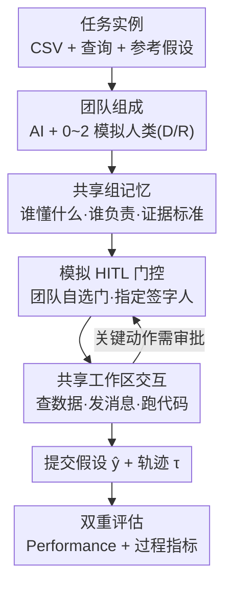

# Searching for Synergy in Shared Workspace Human-AI Collaboration

**会议**: ICML 2026 (Workshop on Human-AI Co-Creativity)  
**arXiv**: [2606.18413](https://arxiv.org/abs/2606.18413)  
**代码**: 论文称随 reference workflow graph 一同发布（见原文 Appendix B）  
**领域**: 多智能体 / 人机协作  
**关键词**: 人机协作, 共享工作区, 过程损失, 组记忆, Human-in-the-loop 门控

## 一句话总结
这篇论文在共享工作区（shared-workspace）的人–AI 协作环境里发现一个反直觉现象——给 AI 智能体**加上有相关专长的（模拟）人类协作者反而会拉低成绩**，根因是团队缺乏协调结构导致"过程损失"（process loss）；作者借用群体心理学的两个机制（共享组记忆 + 模拟 HITL 审批门控）做脚手架，在三人队上把平均成绩从 0.63 拉回到 0.76。

## 研究背景与动机
**领域现状**：当下绝大多数 AI 智能体评测问的是"一个自主智能体能不能独立完成任务"。但真实的科研与专业工作往往需要人的判断和领域知识，于是出现了"人–AI 协作"这一更难的问题——它问的不是单体能力，而是"一个团队能不能把互补的专长拧成一个更好的联合结果"。

**现有痛点**：协作会引入单体不会有的新失败模式。在数据分析任务里，一个有领域专长的协作者也许一眼就认出关键变量、或发现证据薄弱，但这份专长要起作用，团队必须**在对的时间把它暴露出来、路由到对的决策、再带进最终产物**。一旦这条链断了，加进来的协作者只会增加互动量，却不改善结果——甚至变成纯粹的协调开销。

**核心矛盾**：群体心理学早就把这叫做**过程损失**（process loss，Steiner 1972）：当协调无效时，团队无法把成员的资源转化为产出。协调理论进一步指出，协作的本质是管理活动之间的依赖（Malone & Crowston 1994），而团队常常**低估**整合互依贡献所需的工作量（coordination neglect）。人–AI 团队也呈现同样的病：加专长不一定平均有益，人还会过度依赖或误读 AI 的建议。

**本文目标**：用群体心理学当设计透镜，回答两件事——(1) 在没有协调结构时，加协作者到底会发生什么；(2) 两种来自群体研究的协调结构能不能把性能救回来、它们到底改变了过程中的什么。

**切入角度**：作者认为失败往往**先出现在互动过程里、后才反映到最终答案上**，因此评测必须同时看"提交的假设 $\hat{y}$"和"交互轨迹 $\tau$"——很多有用的中间工作可能根本没走到最终答案。

**核心 idea**：把"谁懂什么、谁负责什么、需要哪些证据检查"显式化——用**共享组记忆**externalize 专长与责任，用**模拟 HITL 审批门控**把责任落成"某些动作必须经指定人签字"，从而压低过程损失。

## 方法详解

### 整体框架
研究建在 Collaborative Gym 这个共享工作区环境上，任务取自 DiscoveryBench 的 38 个考古学数据分析任务。每个任务实例是三元组 $x=(\mathcal{D},q,y^{\star})$：$\mathcal{D}$ 是一组 CSV 文件，$q$ 是自然语言查询，$y^{\star}$ 是基准参考假设。一个团队（1 个 AI 智能体 + 0~2 个模拟人类协作者）在共享工作区里查看数据、互发消息、跑分析代码，最终通过结果编辑器提交假设 $\hat{y}$。一次会话产出有序轨迹 $\tau=((u_t,a_t,o_t))_{t=1}^{T}$，其中 $u_t$ 是第 $t$ 步行动的参与者、$a_t$ 是动作、$o_t$ 是观测。每个参与者 $u$ 有固定的私有引导 $\pi_u$ 定义其"画像"（数据分析画像 D / 研究者画像 R），动作由 $a_t=f_u(x,o_{t-1},M_{<t},A^u_{<t},\pi_u)$ 给出——注意 AI 智能体能看到团队级动作历史，而模拟人类只能看到自己的动作历史。

整套实验比较两类协作结构：**Default**（原始共享工作区，无额外协调机制）与 **Scaffolded**（共享组记忆 + 模拟 HITL 门控）。其中 Scaffolded 是先建一份共享记录（专长 / 责任 / 工作计划 / 证据标准），再用它决定哪些动作需要审批、由谁审批。流程如下：

### 关键设计

**1. 共享组记忆：把"谁懂什么、要满足什么证据"摊到台面上**

针对的痛点是过程损失里最典型的"分散知识没人会用"——群体研究发现团队倾向于讨论**共享信息**而冷落**未共享信息**（biased information sampling），于是分散的专长被浪费。作者据此在任务开始前加一个 build 阶段，基于交互记忆系统（transactive memory systems）理论让团队共同记录四样东西：谁懂什么、谁该被信任做什么、工作如何协调、最终答案必须满足哪些证据标准。它和每个参与者的私有记忆不同，是**单一、对所有人可见的团队状态**——一张专长与责任地图。build 阶段结束后这份记忆冻结为固定参照，参与者只读不改。它单独使用时主要抬高的是 initiative 分布（让发起更均匀），但实验显示"沟通多 + 发起均匀"并不足以救性能。

**2. 模拟 HITL 门控：把责任落成"这个动作必须谁签字"**

光有地图不够，责任得变成有约束力的东西。门控机制把选定的动作标记为"生效前必须经某个指定参与者审批"。关键在于**不是所有动作都要审批**：在 Scaffolded 设置里，团队根据自己映射出的专长与责任，**自行决定哪些动作需要门、由谁来当门主**，没指定门主的动作照常进行。这模仿了真实协作里 code review、临床签字、AI 编程助手把"高后果操作"路由给指定审批人、而让日常工作自由流动的模式。作者还设了一个诊断变体——**预分配门控**（preassigned gates），门主按动作类型外部配置而非团队自选，用来拆解"团队自主选门"这一步的贡献。

**3. 两个脚手架的互补协同：组记忆给"凭什么分责"，门控给"分了就得执行"**

两个机制设计成协同工作：组记忆的 build 阶段正是团队决定"哪些动作要审批、谁负责"的地方（且会留一部分动作不设门），门控则在任务中强制执行这些决定。当一个被指定的动作被提出时，选定的门主必须先批准或拒绝才能生效，而事先商定的专长地图和证据标准为这个决策提供上下文。实验表明二者缺一不可——单独的组记忆能抬高发起均匀度却可能让 R 队性能反降，单独的预分配门控更直接对齐 Hypothesis Support，唯有合在一起才在三人队拿到最大改善。

### 损失函数 / 训练策略
本文不训练模型——所有参与者共用同一个 DeepSeek V3.2，配 Collaborative Gym 的 ReAct 式动作循环与私有 scratchpad；变体之间唯一变化的是画像引导 $\pi_u$ 与协作结构，因此性能差异只反映"团队组成与协调结构"，而非模型或界面差异。评估用一组指标把"提交假设的性质"与"轨迹的性质"分开（见下）。

## 实验关键数据

### 主实验
每个团队变体在 38 个任务上跑 3 个独立种子，报均值与标准误。核心指标：Performance（归一化任务分，越高越好）、$H_{\mathrm{init,norm}}$（归一化发起熵，越高越均匀）、$A_{\mathrm{profile}}$（画像对齐）、$C_{\mathrm{wf}}$（工作流覆盖）、$S_{\mathrm{hyp}}$（假设支持度）。其中发起熵定义为 $H_{\mathrm{init,norm}}=\dfrac{-\sum_{u\in\mathcal{U}}p_u\log p_u}{\log|\mathcal{U}|}$，$p_u$ 是发起事件归到参与者 $u$ 的比例。

| 结构 / 画像 | $H_{\mathrm{init,norm}}$ | $S_{\mathrm{hyp}}$ | Performance |
|------|------|------|------|
| 单体（Single-agent） | – | 0.28 | **0.71** |
| Default-D | 0.31 | 0.18 | 0.69 |
| Default-R | 0.37 | 0.18 | 0.68 |
| Default-DR（三人） | 0.54 | 0.19 | **0.63**（最差） |
| Scaffolded-D | 0.74 | 0.23 | 0.72 |
| Scaffolded-R | 0.77 | 0.18 | 0.73 |
| Scaffolded-DR（三人） | 0.85 | 0.23 | **0.76** |

可见：Default 队**全都没能超过单体基线**，且三人 Default-DR 最差；而 Scaffolded 在每种组成上都高于对应 Default，增益集中在 DR（+0.13），D 和 R 的增益（+0.03 / +0.05）相对标准误很小。

### 消融实验（诊断变体）
作者拆出两个诊断变体——只加共享组记忆、或只加预分配门控（注：因都缺少"团队自选门主"这一步，应读作诊断分解而非对称消融）。

| 配置（以 D 画像为例锚定） | $H_{\mathrm{init,norm}}$ | $S_{\mathrm{hyp}}$ | 说明 |
|------|---------|------|------|
| Default | 0.31 | 0.18 | 无协调机制 |
| + 仅共享组记忆 | 大幅↑（+0.27~+0.40 across profiles） | 改善有限 | 抬发起/沟通，但 R 队性能反从 0.68 降到 0.64 |
| + 仅预分配门控 | 一般 | 三画像全↑（D/R 最大） | 更直接对齐 Hypothesis Support |
| Scaffolded（完整） | 0.74 | 0.23 | 二者协同，三人队增益最大 |

### 关键发现
- **加专长反而掉分**：最大跌幅恰好出现在两个画像都在场的 Default-DR（0.63），且不是因为活动少——它的人类工作量与团队消息都比单画像 Default 更多，互动更频繁却产出更不被支持的假设；$S_{\mathrm{hyp}}$ 从单体的 0.28 跌到 Default 队的 0.18~0.19，说明问题出在"证据交接"而非缺能力。
- **脚手架主要改的是"发起怎么分配"**：从 Default-DR 到 Scaffolded-DR，$W_{\mathrm{total}}$ 几乎没变（7.6→7.9），但人类工作 $W_{\mathrm{human}}$ 从 1.6 升到 2.2，$H_{\mathrm{init,norm}}$ across profiles 升 +0.31~+0.43——总工作量不变，只是分配方式变了。
- **两个组件互补**：组记忆给团队"凭什么分责"的依据，门控把责任变成有约束力的审批要求；在三人 DR 队里单独任一组件都达不到完整 Scaffolded 的性能均值。

## 亮点与洞察
- **反直觉发现本身就是贡献**：把"加人加专长一定更好"这个朴素假设证伪，并用轨迹级诊断指出根因是"责任未分配 + 证据交接弱"，而非缺能力——这把人–AI 协作的研究焦点从"模型多强"拉到"团队怎么协调"。
- **同时评 $\hat{y}$ 和 $\tau$ 的双轨评估很关键**：很多有用的中间工作根本走不到最终答案，只看最终答案会漏掉过程失败的信号。这个"看过程不只看结果"的评测姿态可迁移到任何多智能体协作评测。
- **门控的"团队自选 vs 外部预配"对比很巧**：它干净地分离出"谁来决定路由"这一变量，呼应了 AutoResearchClaw 的结论——人介入的**路由**比频率更重要，密集逐步监督反而不如有针对性的介入。

## 局限与展望
- **协作者是模拟人类不是真人**：虽然作者引用 Shao et al. (2024) 称这些模拟协作者能复现真实参与者的关键行为模式，但结论是否迁移到真人团队仍待验证。
- **单一领域、规模偏小**：只用 DiscoveryBench 的 38 个考古学任务，作者解释是为了让任务语义、数据约定、评估期望在不同团队组成间可比；但泛化性受限，D/R 单画像的增益又落在标准误内，强结论主要立在三人 DR 这一格。
- **作为 workshop 短文，机制偏"结构设计 + 现象观测"**：组记忆冻结后只读不更新、门控由 LLM judge 标注事件等设定都较简化，留有继续做大、做真人在环的空间。

## 相关工作与启发
- **vs Collaborative Gym（Shao et al. 2024）**：本文直接建在它之上，但把团队规模变成可控变量、给模拟协作者注入不同私有引导，并新增组记忆 + 门控两个脚手架，问的是"团队能否把分散证据拧成一个被支持的科学假设"。
- **vs 交互式智能体 benchmark（社会模拟 / 主动协助 / 工作流编排）**：那些大多研究轮流制或任务编排，本文聚焦**开放共享工作区**的非轮流协调，更贴近真实联合工作里的 workspace awareness。
- **vs AutoResearchClaw 的 HITL 消融（Liu et al. 2026）**：那篇发现有针对性的介入优于密集逐步监督，本文把门控模式改造成"团队自己决定哪些动作要签字、找谁签"，进一步验证了"路由比频率重要"。

## 评分
- 新颖性: ⭐⭐⭐⭐ 把群体心理学的 process loss / transactive memory 落地成可测的协作脚手架，反直觉发现扎实
- 实验充分度: ⭐⭐⭐ 1482 次会话 + 双轨指标 + 诊断变体到位，但单领域 38 任务、模拟人类、部分增益落在标准误内
- 写作质量: ⭐⭐⭐⭐ 逻辑链清晰，理论透镜与实验现象对得很紧
- 价值: ⭐⭐⭐⭐ 把人–AI 协作研究从"单体能力"扳向"协调结构"，评测姿态可迁移

<!-- RELATED:START -->

## 相关论文

- [\[ACL 2026\] PaperMentor: A Human-Centered Multi-Agent Writing Tutor for AI Research Papers on Overleaf](../../ACL2026/multi_agent/papermentor_a_human-centered_multi-agent_writing_tutor_for_ai_research_papers_on.md)
- [\[ACL 2026\] LLM-Based Human-Agent Collaboration and Interaction Systems: A Survey](../../ACL2026/multi_agent/llm-based_human-agent_collaboration_and_interaction_systems_a_survey.md)
- [\[NeurIPS 2025\] GauDP: Reinventing Multi-Agent Collaboration through Gaussian-Image Synergy in Diffusion Policies](../../NeurIPS2025/multi_agent/gaudp_reinventing_multi-agent_collaboration_through_gaussian-image_synergy_in_di.md)
- [\[CVPR 2026\] AgentDet: A Shared-Blackboard Multi-Agent Framework for Zero-/Few-Shot Object Detection](../../CVPR2026/multi_agent/agentdet_a_shared-blackboard_multi-agent_framework_for_zero-few-shot_object_dete.md)
- [\[ACL 2026\] AutoReproduce: Automatic AI Experiment Reproduction with Paper Lineage](../../ACL2026/multi_agent/autoreproduce_automatic_ai_experiment_reproduction_with_paper_lineage.md)

<!-- RELATED:END -->
