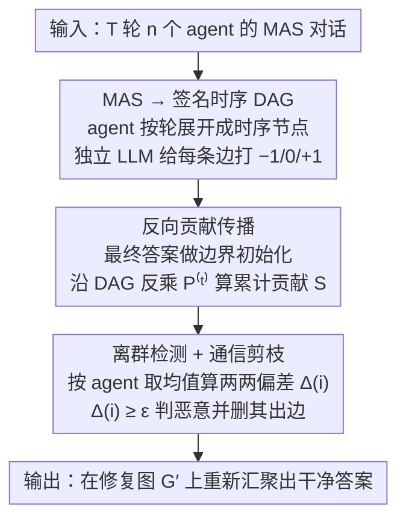

# Securing Multi-Agent Systems Against Corruptions via Node Contribution Backpropagation

**会议**: ICML 2026  
**arXiv**: [2510.19420](https://arxiv.org/abs/2510.19420)  
**代码**: https://github.com/ChengcanWu/BPD  
**领域**: 多智能体系统安全 / LLM Agent 防御  
**关键词**: Multi-Agent System, 腐蚀攻击, 签名 DAG, 反向传播, PageRank

## 一句话总结
BPD 把 LLM 多智能体系统的多轮交互重构成 "带符号有向无环图"，把每条消息打成 $\{-1, 0, 1\}$ 的同意 / 漠视 / 反对分数，再用 PageRank 式的一次反向拓扑传播算出每个 agent 对最终答案的贡献分，分数离群者直接判定为恶意 agent 并切掉其出边——免训练、单次查询即用、对动态拓扑天然鲁棒。

## 研究背景与动机
**领域现状**：LLM Agent 已经从单体走向 Multi-Agent System (MAS)，应用在软件工程、市场分析、网页自动化等域；常见拓扑包括 Flat（平等讨论）与 Hierarchical（回答者 + 评审者）。

**现有痛点**：MAS 比单 LLM 更脆弱，因为信息是 "传染式" 流动的——一个被劫持的 agent 输出的有害内容可以沿对话拓扑级联污染所有下游 agent (corruption attack)。已有防御主要有三类，每类都各有死穴：
- 输出监督式 (BlockAgents、AgentForest)：靠多轮辩论或相似度对比，但对细微文本扰动 / 直接攻击评估器无能为力；
- 静态图式 (Huang 等比拓扑鲁棒性)：把 MAS 当固定 GNN 算配置，但拓扑一变就失效；
- 动态训练式 (G-Safeguard)：训分类器读 agent 内部状态，但只看局部信号，看不到 "腐蚀信息如何流到最终决策"。

**核心矛盾**：现有防御要么 "全局但静态"，要么 "动态但只看局部"——没有一种方法能在不重训的前提下，每次查询都做一次 "全局影响溯源"，把 agent 对最终答案的真实贡献量化出来。

**本文目标**：(i) 给 MAS 通信建一个能描述任意拓扑、任意 agent 数、任意轮数的统一图表示；(ii) 设计一个无需训练、单次反向传播即可完成的影响力评估算子，把 "每个 agent 对最终决策贡献多少" 变成可计算量；(iii) 用统计离群检测一键揪出恶意 agent 并修复图，整套流程对动态拓扑 / 攻击者身份切换免疫。

**切入角度**：注意到 MAS 多轮对话按 "时间 + agent" 展开后天然是 DAG——边只跨相邻轮、没有环；这给反向递归提供了完美闭式解。再借鉴 PageRank 的 "影响力靠下游聚合" 思想，把 $-1/0/+1$ 的同意符号当成 "带符号的转移概率"，从最终答案反向走一遍就把每个节点的累计签名影响读出来。

**核心 idea**：MAS = signed temporal DAG；agent 贡献 = 签名 PageRank 反向单次拓扑传播；恶意 agent = 贡献分组内偏差离群点；防御 = 删掉离群 agent 的所有出边。

## 方法详解

### 整体框架
BPD 要解决的是：一个被劫持的 agent 会沿对话拓扑把有害内容级联污染给所有下游 agent，而现有防御要么只看局部信号、要么拓扑一变就失效。它的做法是把整场 MAS 对话当成一张"带符号的计算图"来做影响溯源——先把 $T$ 轮、$n$ 个 agent 的会话重构成签名 DAG，让一个独立 LLM 给每条消息打 $\{-1, 0, +1\}$ 的反对 / 漠视 / 赞同分，再从最终答案反向一次拓扑传播算出每个 agent 对决策的累计贡献，分数离群者判为恶意并切掉其出边。整套流程发生在每次查询的回答阶段，免训练、单次反向 pass、可解释。

### 关键设计

**1. MAS → 签名时序 DAG：把任意拓扑的多轮对话拍成一张无环图**

MAS 拓扑五花八门（Flat 平等讨论、Hierarchy 回答+评审），轮数和 agent 数都不固定，没法直接套一个传播公式。BPD 的处理是把 agent $A(i)$ 在第 $t$ 轮的实例展开成一个时序节点 $A_t(i)$，节点集 $V = \{A_t(i) \mid t=1..T,\, i=1..n\}$ 规模 $N = nT$，第 $t$ 轮 $A(i) \to A(j)$ 的消息记作有向边 $e_t(i,j): A_t(i) \to A_{t+1}(j)$。关键在于所有边都只跨相邻时刻、永远从 $t$ 指向 $t{+}1$，所以图天然无环——这正是后面能用闭式解一次算完、不必迭代到收敛的前提。光有结构还不够，还要给边赋"立场"：让一个不属于 MAS 的独立 LLM 评判每条边，接收者 $C_j$ 拿到 $C_i$ 的消息 $s_i$ 后输出 $s_j$，评分器算 $g_{ij} = f(s_i, s_j) \in \{-1, 0, +1\}$，正号是同意 / 采纳、零是低贡献、负号是反对 / 反驳。签名机制是为了让"成功的攻击"（正号分被放大）和"被识破的攻击"（负号分被放大）都在图上留下可计算痕迹，双向都能触发后续的离群信号。

**2. 反向贡献传播算子：从最终答案倒推每个节点的影响力**

知道了图和每条边的立场，还要把"某个 agent 对最终答案到底贡献了多少"变成一个可比较的数。BPD 借 PageRank 的思路——影响力靠下游聚合——但反过来用：定义签名邻接矩阵 $\mathbf{G} \in \mathbb{R}^{N \times N}$ 与出度矩阵 $\mathbf{D} = \text{diag}(k_1, \ldots, k_N)$，得到行归一化的签名传播算子 $\mathbf{B} = \mathbf{D}^{-1}\mathbf{G}$。终端层用最终答案做边界初始化：若 $A(i)$ 的答案与 MAS 最终答 $y_{\text{final}}$ 一致则 $S(A_T(i)) = +1$，否则 $-1$。反向递归为

$$S(C_i) = \frac{1}{k_i} \sum_{C_j \in \mathcal{N}^+(C_i)} g_{ij}\, S(C_j) = \sum_j B_{ij}\, S(C_j),$$

向量形式即 $\mathbf{S}^{(t)} = \mathbf{P}^{(t)} \mathbf{S}^{(t+1)}$，其中 $\mathbf{P}^{(t)}_{ij} = g_{t,i \to j} / k_{t,i}$。因为 $G$ 是 DAG，单次反向乘法就给出唯一闭式解 $\mathbf{S}^{(t)} = \mathbf{P}^{(t)} \mathbf{P}^{(t+1)} \cdots \mathbf{P}^{(T-1)} \mathbf{S}^{(T)}$，不用像普通 PageRank 那样 power iteration 迭代到稳态。这其实就是经典 PageRank $\mathbf{r}^{(\ell+1)} = (1-d)\mathbf{1}/N + d\,\mathbf{W}^\top \mathbf{r}^{(\ell)}$ 的 signed / layer-wise / DAG 推广：$\mathbf{P}^{(t)}$ 替代 $\mathbf{W}^\top$ 并引入 $\{-1, 0, +1\}$ 符号，边界初始化替代 damping/teleport，一次拓扑 pass 替代 power iteration。MAS 是有限轮 DAG 反而比一般强连通图更友好，复杂度只与边数线性相关，整体效率开销不到 10%。

**3. 离群检测 + 通信剪枝：揪出偏离群体的 agent 并把它静音**

有了每个时序节点的贡献分，还要汇总到 agent 级别并判定谁是恶意的。BPD 先按 agent 取均值 $\hat{S}(A(i)) = \frac{1}{|\mathcal{T}(i)|} \sum_{t \in \mathcal{T}(i)} S(A_t(i))$，再算它与其余所有 agent 的平均绝对差 $\Delta(i) = \frac{1}{n-1} \sum_{j \ne i} |\hat{S}(A(i)) - \hat{S}(A(j))|$，把 $\Delta(i) \ge \epsilon$ 的归入恶意集合 $\mathcal{M}$（论文经验取 $\epsilon = 1.5$）。之所以用"两两差的平均"而不是 z-score 或固定阈值，是因为 MAS 群体小（$n \le 5$）、正态假设不成立，pairwise 偏差对小样本更鲁棒。剪枝阶段删掉恶意 agent 的所有出边 $E_\mathcal{M} = \{e_{t,i\to j} \mid A(i) \in \mathcal{M}\}$，得到修复图 $G' = (V, E \setminus E_\mathcal{M})$——相当于把它从决策路径上"静音"，但保留节点角色防止拓扑结构崩溃。这一招对攻击形态不敏感的原因在于：攻击成功时恶意 agent 的正向贡献被传染性放大，攻击失败时它的消息被周围 agent 反驳而形成显著负向，两种情形都会让 $\Delta(i)$ 异常。

### 一个完整示例
拿 5 个 agent 的 Flat 讨论、agent #3 被劫持为例。第一步展开成签名 DAG 后，独立评分器逐条打分：#3 在攻击成功的情形下说服了 #1、#4，对应边拿到 $g = +1$；但 #2、#5 识破并反驳了它，对应边是 $g = -1$。第二步反向传播：终端层先标 $S(A_T(i)) = \pm1$（与最终答一致为 $+1$），再沿 DAG 一层层往前乘 $\mathbf{P}^{(t)}$，把这些正负号累计回每个节点。第三步汇总到 agent 级算 $\hat{S}$ 与 $\Delta(i)$：正常 agent 彼此分数接近、$\Delta$ 小，而 #3 无论被采纳（正向被放大）还是被反驳（负向被放大）都和群体显著拉开，$\Delta(3) \ge 1.5$ 触发离群。第四步把 #3 的所有出边删掉，MAS 在 $G'$ 上重新汇聚出干净答案。整条链没有任何训练，只是一次评分 + 一次矩阵反乘 + 一次阈值判定。

### 损失函数 / 训练策略
BPD 是 **训练自由** 的：评分器 $f$ 可以是任意第三方 LLM（prompt 见 Appendix A.3），反向传播只是矩阵乘法，没有任何参数要学。唯一超参是离群阈值 $\epsilon$，作者基于消融取 $\epsilon = 1.5$（太小如 $1.0$ 误杀正常 agent，太大如 $2.0$ 漏放潜伏攻击）。复杂度上，一次反向 pass 是 $O(|E|)$，签名打分是 $O(|E|)$ 次 LLM 调用，整体时间开销不到 10%。

## 实验关键数据

### 主实验
GPT-4o 作为基础 LLM，5 个 agent 的 Flat / Hierarchy 拓扑，MMLU 五个子领域评测，默认攻击为 Amayuelas 等 (2024) 的腐蚀攻击。结果均为 3 次实验均值 $\pm$ 1 std。

| 结构 | 方法 | Algebra | Math | Chemistry | Computer | Security | Avg |
|------|------|---------|------|-----------|----------|----------|-----|
| Flat | No Attack | 95.0 | 94.7 | 75.3 | 92.0 | 85.0 | 88.4 |
| Flat | Attack (无防御) | 78.7 | 74.7 | 64.7 | 82.3 | 81.0 | 76.3 |
| Flat | G-Safeguard | 88.3 | 88.7 | 71.0 | 87.7 | 83.0 | 83.7 |
| Flat | AGENTXPOSED | 90.0 | 79.0 | 67.0 | 89.0 | 87.3 | 82.5 |
| Flat | Challenger | 88.7 | 87.3 | 68.3 | 84.0 | 75.3 | 80.7 |
| Flat | Inspector | 84.0 | 89.0 | 65.7 | 80.7 | 75.7 | 79.0 |
| Flat | **BPD (Ours)** | 92.3 | 93.0 | 73.3 | 87.3 | 81.0 | **85.4** |
| Hier | Attack (无防御) | 81.7 | 81.7 | 66.7 | 84.7 | 78.0 | 78.6 |
| Hier | G-Safeguard | 92.0 | 91.7 | 71.3 | 90.3 | 82.3 | 85.5 |
| Hier | **BPD (Ours)** | 93.3 | 95.7 | 73.7 | 91.0 | 83.7 | **87.5** |

BPD 相对无防御涨 9–10 个百分点，比最强 baseline G-Safeguard 在 Flat 上多 1.7%、Hier 上多 2%；监测准确率 (Monitor ACC) 在 Flat 上 90.7% vs G-Safeguard 88.3%，Hier 上更突出。

### 消融实验
按论文报告的趋势整理：

| 配置 | 监测 ACC | 任务 ACC | 关键发现 |
|------|----------|----------|----------|
| BPD 全量 | 90%+ | 85–88% | 完整 signed DAG + 反向传播 + 离群剪枝 |
| 不用签名 (仅 $\{0, 1\}$) | ↓↓ | ↓↓ | 失去 "反驳信号"，攻击失败的恶意 agent 检不出 |
| 不做反向传播 (仅看本地 $g_{ij}$) | ↓↓ | ↓ | 退化成 G-Safeguard 式局部信号，对深层传染失效 |
| $\epsilon = 1.0$ | 高召回低精度 | ↓ | 误杀正常 agent |
| $\epsilon = 1.5$ (默认) | 平衡最优 | 最优 | 论文采用 |
| $\epsilon = 2.0$ | 低召回 | ↓ | 漏放潜伏攻击 |
| 动态拓扑场景 | 保持静态水平 | -0% | 其他 baseline 平均掉 3% |
| 语义微扰攻击 | 优势扩大 | +约 10% | 输出监督式方法基本失守 |

### 关键发现
- 反向传播带来的全局视角比任何局部信号都强：在传染深度大的 Flat 拓扑下，BPD 比 G-Safeguard 多涨 ~1.7%，在 Hierarchy（评审 + 回答两层级联）上多涨 ~2%，传染链越长收益越明显。
- 动态 MAS 场景（图结构与攻击者身份按查询切换）是 BPD 最大主场：竞品平均掉 3%，BPD 几乎零损失，验证了 "免训练 + 单次查询计算" 的设计回报。
- 对语义微扰攻击优势最大（约 +10%），因为这类攻击恰恰能骗过输出监督，却骗不过 "贡献分偏差" ——传染必然在反向传播路径上留痕。
- 时间开销 <10%，主要来自评分器 LLM 调用，反向乘法本身可忽略。

## 亮点与洞察
- "MAS 多轮对话 = 时序 DAG" 这个抽象非常干净——任何 MAS 拓扑都能套用，DAG 又保证反向传播有闭式解，避免 PageRank 那种需要迭代到收敛的繁琐；这套抽象可以直接迁移到其他多轮多 agent 系统（如 multi-tool agent、debate-based reasoning）。
- 签名 $\{-1, 0, +1\}$ 是关键——单纯正分 PageRank 只能识别 "被多数同意的影响力"，加了负号才能让 "被反驳" 也成为可观测信号，等于把检测扩展到 "攻击失败" 的场景，避免攻击者通过故意暴露来逃避。
- 用 "差异的平均" $\Delta(i)$ 而不是 z-score 或固定阈值做离群检测，对小群体 ($n \le 5$) 仍鲁棒，因为不依赖正态假设；这种 pairwise 偏差度量值得在其他小样本异常检测里复用。
- 反向 PageRank 与神经网络反向传播形式上同构——"误差信号沿计算图反传" 的思想被搬到 MAS 安全场景，是一种漂亮的跨域类比。

## 局限与展望
- 评分器 $f$ 是外部 LLM，其质量直接决定 $g_{ij}$ 可靠性；若评分器本身被攻击者操纵（如 prompt injection 评分提示），BPD 会失效。
- DAG 假设要求严格 "按轮推进"，对异步 / 任意循环对话的 MAS（如长记忆 agent 之间互相调用工具）不直接适用，需要先做时序展开。
- 离群阈值 $\epsilon = 1.5$ 是经验值，跨任务 / 跨拓扑可能需要重新调；缺乏自适应机制。
- 当恶意 agent 占多数（>50%）时，"群体偏差" 的离群假设崩溃，BPD 会反向识别正常 agent 为恶意，这种 "拜占庭" 极端情形未在论文中实验。
- 若多个攻击者协调出 "看似一致但全错" 的方案，签名打分会全部正号，反向传播无法把它们与正常多数区分——需要引入答案正确性的外部仲裁。

## 相关工作与启发
- **vs G-Safeguard**：都是动态防御，但 G-Safeguard 训练 GNN 分类器读 agent 内部状态 + 局部通信，只看局部；BPD 反向传播看全局，且免训练。两者在 Flat 上 BPD 多 1.7%，Hier 上多 2%。
- **vs BlockAgents / AgentForest (输出监督)**：靠多轮辩论或输出相似度，对细微文本扰动失守；BPD 不依赖输出形态，靠贡献分偏差检测，对语义微扰攻击大幅领先 (~+10%)。
- **vs Huang et al. 2025 (静态拓扑)**：他们靠搜索鲁棒拓扑，环境一变就废；BPD 对任意拓扑都现算现用，动态场景几乎零退化。
- **vs Challenger / Inspector (协同防御)**：靠加专属审查 agent，一旦审查者被攻破即失守；BPD 没有 "可被攻击的中心点"，攻击面更小。

## 评分
- 新颖性: ⭐⭐⭐⭐ 把 PageRank 这一经典图算法以 "signed + layer-wise + DAG" 的形式注入 MAS 安全，思想优雅且充分利用了 MAS 多轮结构。
- 实验充分度: ⭐⭐⭐⭐ 覆盖 2 种拓扑、2 种主流 LLM、4 个任务域、5 种攻击与 4 个 baseline，并测了动态场景与时间开销。
- 写作质量: ⭐⭐⭐⭐ 从 MAS → DAG → 反向传播 → 离群检测 一步步推导清晰，与 PageRank 的连接讨论到位。
- 价值: ⭐⭐⭐⭐ 提供了首个 "训练自由 + 全局视角 + 动态适配" 的 MAS 防御方案，对部署中的 agent 系统直接可用。

<!-- RELATED:START -->

## 相关论文

- [\[ICLR 2026\] Breaking and Fixing Defenses Against Control Flow Hijacking in Multi-Agent Systems](../../ICLR2026/multi_agent/breaking_and_fixing_defenses_against_control_flow_hijacking_in_multi-agent_syste.md)
- [\[ICML 2026\] MASPO: Joint Prompt Optimization for LLM-based Multi-Agent Systems](maspo_joint_prompt_optimization_for_llm-based_multi-agent_systems.md)
- [\[ICML 2026\] When Cloud Agents Meet Device Agents: Lessons from Hybrid Multi-Agent Systems](when_cloud_agents_meet_device_agents_lessons_from_hybrid_multi-agent_systems.md)
- [\[ICLR 2026\] Stochastic Self-Organization in Multi-Agent Systems](../../ICLR2026/multi_agent/stochastic_self-organization_in_multi-agent_systems.md)
- [\[ICML 2026\] Multi-Agent Systems are Mixtures of Experts: Who Becomes an Influencer?](multi-agent_systems_are_mixtures_of_experts_who_becomes_an_influencer.md)

<!-- RELATED:END -->
