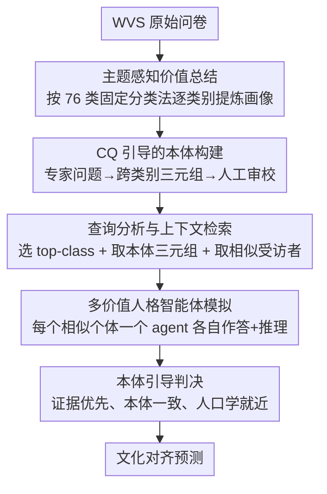

# Toward Culturally Aligned LLMs through Ontology-Guided Multi-Agent Reasoning

**会议**: ICML2026  
**arXiv**: [2601.21700](https://arxiv.org/abs/2601.21700)  
**代码**: 待确认  
**领域**: 多智能体 / 文化对齐 / 检索增强  
**关键词**: 文化对齐, 本体引导, 多智能体推理, 世界价值观调查, 价值人格模拟

## 一句话总结
OG-MAR 把世界价值观调查（WVS）的原始问卷整理成「带结构关系的文化本体 + 个体价值画像」，推理时检索出与目标人群相关的本体三元组和人口学相似的真实受访者，实例化多个「价值人格智能体」各自作答，再由一个判决智能体按「证据优先、本体一致」的协议综合出最终答案，从而在六个地区社会调查基准上提升文化对齐度并给出可解释的推理轨迹。

## 研究背景与动机
**领域现状**：LLM 越来越多地被用于涉及社会规范、价值判断的文化敏感任务，但预训练语料在地域和语言上严重失衡，模型往往把「西方高资源视角」当成默认值，对非主流文化的价值体系系统性地误判。为缓解这一点，已有工作尝试了角色扮演（给模型设定一个有文化背景的 persona）、少样本文化范例提示、检索增强（如 ValuesRAG 从外部问卷里取证据）以及多智能体辩论（让多个 agent 互相批判迭代）。

**现有痛点**：作者把这些方法的毛病归结为三条。其一，很多方法依赖「隐式的文化假设」，并没有扎根在真实的价值分布上，导致输出对提示措辞极其敏感、很脆。其二，即便引入了外部证据，文化价值也被当成一条条**互相独立、无结构的信号**，丢掉了「不同议题之间的依赖关系」（比如对宗教的态度往往和对家庭、性别角色的态度相关）。其三，多智能体聚合虽然能提升鲁棒性和多样性，但在缺乏具体价值结构和落地依据的情况下堆 agent，反而降低了可解释性——你看不出某个观点究竟是怎么冒出来的。

**核心矛盾**：根本问题在于「价值知识的表示形式」。现有方法要么没把价值落到经验分布上（缺 grounding），要么把价值拍平成离散片段（缺结构），所以既不稳也不透明。

**本文目标**：构造一种既有**经验落地**（来自真实问卷的价值分布）、又有**显式结构**（议题之间的关系网络）、还能**可解释聚合**（看得见每个观点的来源）的文化推理框架，并在跨地区基准上验证对齐度、鲁棒性和可解释性。

**切入角度**：作者从本体工程（ontology engineering）借力——本体本来就是「领域概念 + 概念之间关系」的形式化规范，天生适合表达「价值类别之间的跨议题依赖」。把它和 WVS 的真实受访者画像、多智能体模拟拼起来，正好补上 grounding、结构、可解释三块短板。

**核心 idea**：用「固定分类法上的本体三元组 + 人口学相似画像」替代「无结构的价值片段」，再用「证据优先的判决智能体」替代「简单多数投票」，让文化推理既扎根又结构化还可追溯。

## 方法详解

### 整体框架
OG-MAR 分两大块：**离线的数据预处理与本体构建**，以及**在线的多智能体推理流水线**。离线阶段把 WVS 的原始问卷转成两样东西——每个受访者的「结构化价值画像」（按一套固定分类法逐类别总结），以及一张刻画价值类别之间关系的「全局文化本体」。在线阶段，给定一个查询 $q$（一道价值问卷题及选项）和目标人群的人口学描述 $d_q$，系统先做主题识别与上下文检索，取出与查询相关的本体三元组 $O_q$ 和人口学相似的真实受访者 $R_q$ 及其价值画像，然后为每个被检索到的个体实例化一个价值人格智能体各自作答，最后由判决智能体综合所有 persona 的答案与理由，输出文化对齐的最终预测。

### 关键设计

**1. 主题感知价值总结：把噪声满满的原始问卷压成按类别对齐的结构化画像**

大规模问卷的题型、量表、答案格式五花八门，直接拿原始答案做检索或推理，很容易把不相关的信号混在一起、放大噪声。OG-MAR 先定义一套**固定的本体类集** $C$（$|C|=76$，含 12 个顶层类 $c_1,\dots,c_{12}$ 与它们的 64 个子类 $c_{i,j}$），再用一个总结智能体 $G_{\text{sum}}$ 在每个类别的语义范围内对受访者作答做一段简短综述：对个体 $i$ 的原始答案集合 $\mathcal{R}_i$ 和某个类别 $c$，得到类别条件下的综述 $s_i(c)=G_{\text{sum}}(\mathcal{R}_i\mid c)$，聚合所有类别就是个体的结构化价值画像 $V_i=\{s_i(c)\mid c\in C\}$。关键约束是「只总结与该类别相关的信息、不引入新概念」，这样每个个体都被表示成一份和分类法严格对齐的画像，为后续的人口学落地和人格模拟提供干净的输入。

**2. CQ 引导的本体关系构建：用专家问题把「价值之间的跨议题关系」显式编织成网络**

光有逐类别画像还不够，价值之间的依赖关系（哪个议题影响哪个议题）才是现有方法丢掉的结构。OG-MAR 采用基于**能力问题（Competency Questions, CQ）**的人工引导构建：领域专家针对「两个顶层类的子类之间可能存在什么有意义的互动」设计 CQ，对每个 CQ 让 LLM 描述子类级别的关系，并强约束模型（i）只能用预定义分类法里的类、（ii）不许新增类、（iii）只聊给定两个顶层类的子类之间的关系。为了注入文化多样性，构建时还会用来自六大地区、每地区 20 人共 120 人的价值画像去 condition LLM。每条候选关系表示成一个有序三元组 $t_{a,b}=(c_a, p_{a,b}, c_b)$，其中 $c_a, c_b$ 是子类的名词短语、$p_{a,b}$ 是自然语言的关系动词短语（用自然语言而非符号 ID，是为了保持人类可读、和 CQ 措辞一致）。随后专家做合并审校：校验文化合理性、润色关系描述、删除虚假或不一致的关系；**分类法本身保持固定**（不合并、不拆分、不新增类），只对关系做人工裁定，最终得到一套约 150 条 object-property 关系的本体三元组集合 $T=\{t_h\}$。

**3. 查询分析与三路上下文检索：给每个查询同时取出「相关议题—本体关系—相似真人」**

推理时面对查询 $q$ 和目标人口学 $d_q$，OG-MAR 检索三样东西并拼成下游模拟的上下文。第一步是**主题识别**：用一个在 WVS 上按 12 个顶层类标注微调过的文本编码器 $G_{\text{topic}}$ 给每个顶层类 $c_u$ 打分 $\ell_u$，取 top-$k$ 顶层类构成 $D_q$，从而限定后续要看哪些子类。第二步是**本体三元组检索**：在 $D_q$ 的子类范围内算节点相关度 $\alpha(c)=\mathrm{sim}(\mathbf{e}_q,\mathbf{e}_c)$，再把每条三元组按两端点相关度取大值打分 $\alpha_{\text{triple}}(t_h)=\max(\alpha(c_a),\alpha(c_b))$，选 top-$M$ 条形成本体上下文 $O_q$（实现中每个类别取 top-3 三元组，单查询通常 3–9 条）。第三步是**相似个体检索**：用稠密向量把目标人口学描述和每个受访者的人口学画像编码、按相似度排序，取 top-$K$ 个真人构成 $R_q$（默认 $K=5$），它们的价值画像即 $\mathcal{V}_q=\{V_i\mid i\in R_q\}$。这一步保证了推理同时有「相关议题边界」「结构化关系」「真实人群证据」三重落地。

**4. 多人格模拟 + 证据优先判决：让真人画像各自发声，再用本体一致性裁决而非投票**

拿到 $\mathcal{V}_q$ 后，OG-MAR 为每个被检索到的个体 $i$ 实例化一个价值人格智能体 $G_{\text{persona}}$。每个 agent 的条件上下文是 $z_i=\mathrm{Concat}(O_q, V_{i,q}, d_i)$——本体三元组 $O_q$、把该个体画像限制在三元组所引用子类上的过滤画像 $V_{i,q}=\{s_i(c)\mid c\in C_q\}$、以及人口学属性 $d_i$；agent 输出一个答案和一条显式推理轨迹 $G_{\text{persona}}(q,z_i)=(\hat{y}_i,\rho_i)$，所有个体的输出汇成集合 $A$。最后由判决智能体 $G_{\text{judge}}$ 做**受约束的元裁决** $\hat{y}_q=G_{\text{judge}}(A,q)$。和多数投票不同，它走的是「证据优先」协议：先给每条 $(\hat{y}_i,\rho_i)$ 的论证扎实度与本体合规性打分、按选项聚合；只有当领先选项证据强度相当时才把「投票汇总」当**次要**信号参考；若仍打平，则选「由与 $d_q$ 更相关的 persona 支持」的选项做 tie-break。值得注意的是判决在**单次 LLM 调用**内完成、上述准则只是引导其内部推理，而且判决智能体并不直接拿到 $O_q$ 或 $\mathcal{V}_q$——本体与画像的落地完全通过 persona 的输出携带进来，从而把「为什么得出这个观点」的链路留在可追溯的推理轨迹里。

### 一个完整示例
设查询是一道关于「家庭义务 vs 个人自由」的中国（CGSS）受访者价值题。主题识别先从 12 个顶层类里选出与「家庭/社会规范/个人价值」相关的 top-$k$ 类；本体检索在这些子类里取出约 5 条三元组（例如「家庭责任—强化—对长辈的服从」这类关系）；相似个体检索按目标人口学（如中年、已婚、特定教育水平）取出 5 个 WVS 里人口学相近的真实受访者。于是系统起 5 个人格 agent，每个 agent 只看「过滤后落在这些子类上的那个人的画像 + 本体三元组 + 人口学」，各自给出倾向「重家庭义务」或「重个人自由」的答案与理由——其中可能 3 个偏义务、2 个偏自由。判决 agent 不简单数票，而是先看哪一方的理由真的被本体关系和画像证据支撑：如果偏义务的理由都能挂到「家庭责任—服从」这类三元组上，而偏自由的理由更多是泛泛而谈，就给义务方更高证据分；只有在两边证据相当时才参考 3:2 的票数，最终输出更贴合该文化语境的预测。这条链路里每一步「取了什么证据、谁支持、为什么判这边」都是可读的。

## 实验关键数据

### 主实验
在六个地区社会调查基准（EVS 欧洲、GSS 美国、CGSS 中国、ISD 印度、AFRO 非洲、LAPOP 拉美）上、跨四个 LLM 骨干评测二元准确率。OG-MAR 在四个骨干上的平均准确率均领先竞争基线，尤其在「偏离主流预训练先验」的文化挑战场景（CGSS、ISD）上提升最大。

| 骨干 / 方法 | EVS | GSS | CGSS | ISD | AFRO | LAPOP | Avg. |
|------|------|------|------|------|------|------|------|
| GPT-4o-mini · ValuesRAG | 0.6127 | 0.5589 | 0.5889 | 0.6420 | 0.5654 | 0.6085 | 0.5961 |
| GPT-4o-mini · **OG-MAR** | 0.6206 | 0.5480 | 0.6509 | 0.6192 | 0.5389 | 0.6268 | **0.6007** |
| Gemini 2.5 · ValuesRAG | 0.6075 | 0.5376 | 0.6084 | 0.6041 | 0.5472 | 0.5339 | 0.5731 |
| Gemini 2.5 · **OG-MAR** | 0.6249 | 0.5489 | 0.7017 | 0.7007 | 0.5701 | 0.6385 | **0.6308** |
| Qwen 2.5 · ValuesRAG | 0.5538 | 0.5215 | 0.4697 | 0.6591 | 0.4724 | 0.5268 | 0.5339 |
| Qwen 2.5 · **OG-MAR** | 0.5898 | 0.5325 | 0.5220 | 0.6599 | 0.5180 | 0.6005 | **0.5705** |
| EXAONE 3.5 · ValuesRAG | 0.5172 | 0.5520 | 0.5833 | 0.6446 | 0.4794 | 0.5913 | 0.5613 |
| EXAONE 3.5 · **OG-MAR** | 0.6080 | 0.5636 | 0.6307 | 0.7810 | 0.5045 | 0.7022 | **0.6317** |

在 Gemini 上 CGSS 从 0.6084（ValuesRAG）拉到 0.7017、ISD 从 0.6041 拉到 0.7007，幅度接近 +0.10；这印证了「结构化文化关系 + 人口学落地的 persona」在目标分布远离西方默认先验时最有价值（平均提升带 $\ast$，paired $t$-test + Holm–Bonferroni 校正，$p<0.05$）。

### 消融实验

| 配置 | 关键指标（四骨干平均准确率） | 说明 |
|------|------|------|
| OG-MAR（完整） | 0.6007 / 0.6308 / 0.5705 / 0.6317 | 多人格 + 判决 |
| w/o 多人格（Single-Judge） | 0.5987 / 0.6022 / 0.5311 / 0.5627 | 跳过 persona 模拟，判决 agent 直接出答案 |
| 检索深度 $K$ | $K{=}5$ 全员最佳 | $K{\in}\{1,3,5,10\}$，$K{=}10$ 反降 0.02–0.07 |

去掉多人格模拟的 single-judge 变体在全部四个骨干上都掉点：GPT-4o-mini 仅 +0.002，但 Gemini +0.03、Qwen +0.04、EXAONE +0.07，说明人格模拟在「需要调和多个相互竞争的价值考量」时贡献明显；同时 single-judge 仍有竞争力，意味着收益不全来自模拟层，本体落地检索与价值总结管线本身也提供了结构化、问卷背书的证据。

### 关键发现
- 检索深度存在清晰权衡：$K{=}1$ 信号太窄、$K{=}10$ 引入噪声反而掉点，$K{=}5$ 在「丰富」与「稳定」间最优，因此被设为默认。
- 跨骨干一致性强：四个差异很大的 LLM（含两个开源模型）都被 OG-MAR 提升，说明收益来自框架而非某个模型的特性。
- 可解释性获人评佐证：九位专家在 5 点 Likert 上评分，OG-MAR 在 CGSS（中国）的 Grounding 得分 4.02 甚至略高于 GSS（美国）的 3.97，提示本体引导的价值注入能缓解「文化默认」倾向、鼓励基于证据的推理。
- 代价是 token：OG-MAR 的 token 预算最高，作者明确把它定位为「结构化推理框架」而非轻量提示的省钱替代品，额外算力换来更扎实、可解释的文化推理。

## 亮点与洞察
- **把「价值之间的关系」显式建成本体**是最核心的差异点：相比把价值当离散片段检索，固定分类法上的三元组让「跨议题依赖」可被检索、可被约束、可被审校——这也是可解释性的来源。
- **判决用「证据优先」而非多数投票**很巧妙：先按论证扎实度和本体合规性打分、把票数降级为次要信号，避免了多智能体方法常见的「majority bias」和 drift；而且判决在单次调用内完成，工程上轻。
- **判决 agent 故意不直接看本体和画像**，强制所有落地证据通过 persona 输出携带，等于把「证据—观点—结论」的链路逼成可追溯形态，这个设计思路可迁移到任何需要审计推理来源的多智能体系统。
- **固定分类法、只人工裁关系**的本体构建范式，在「LLM 容易乱造新概念」的现实下是个务实折中：用 CQ + 强约束把 LLM 关在分类法笼子里，再用专家审校兜底。

## 局限与展望
- 作者承认剩余失败多源于**本体覆盖稀疏**或**人口学检索不准**——即便判决逻辑自洽，证据不足时 grounding 仍会受限。
- 框架**token 成本最高**，对成本敏感或低延迟场景不友好；它定位为「质量优先」的结构化推理而非轻量替代。
- 本体构建重度依赖**专家人工审校**（设计 CQ、裁关系），可扩展性和跨领域迁移成本高；分类法固定虽稳但也限制了对新兴价值维度的覆盖。
- 评测以 WVS 及六个 WVS-comparable 的地区调查为锚，价值「金标」本身来自问卷分布，文化对齐被操作化为「匹配问卷多数」，对个体差异和少数派立场的刻画仍有限。

## 相关工作与启发
- **vs 角色扮演 / 文化提示（Role, Tao et al. 2024）**：它们靠设定 persona 的提示来 steer，但弱落地、对措辞敏感；OG-MAR 用真实受访者画像 + 本体关系做硬证据，鲁棒性更强。
- **vs ValuesRAG（Seo et al. 2025）**：同样检索问卷证据，但 ValuesRAG 把价值当无结构片段，缺对「关系」的控制；OG-MAR 把价值结构化成本体三元组，能表达跨议题依赖，在偏离西方先验的基准上优势明显。
- **vs 多智能体辩论（Debate, Ki et al. 2025）**：辩论靠迭代批判，但无显式证据约束易 drift、且抓不到跨议题价值依赖；OG-MAR 用本体约束 + 证据优先判决，既稳又可解释。

## 评分
- 新颖性: ⭐⭐⭐⭐ 把本体工程、问卷落地与多智能体模拟三者拼起来解决文化对齐，结构化价值表示是有辨识度的切入。
- 实验充分度: ⭐⭐⭐⭐ 六地区 × 四骨干 + 检索深度/多人格/单判决多组消融 + 九专家人评，覆盖较全；但全靠 WVS 系问卷做金标。
- 写作质量: ⭐⭐⭐⭐ 流程与符号清晰，本体构建和判决协议讲得明白；细节较多依赖附录。
- 价值: ⭐⭐⭐⭐ 给「文化对齐 + 可解释多智能体」提供了可落地范式，代价是高 token 与重人工本体构建。

<!-- RELATED:START -->

## 相关论文

- [\[ICML 2026\] Systematic Failures in Collective Reasoning under Distributed Information in Multi-Agent LLMs](systematic_failures_in_collective_reasoning_under_distributed_information_in_mul.md)
- [\[ICML 2026\] MAS-Orchestra: Understanding and Improving Multi-Agent Reasoning Through Holistic Orchestration and Controlled Benchmarks](mas-orchestra_understanding_and_improving_multi-agent_reasoning_through_holistic.md)
- [\[ACL 2025\] GETReason: Enhancing Image Context Extraction through Hierarchical Multi-Agent Reasoning](../../ACL2025/multi_agent/getreason_enhancing_image_context_extraction_through_hierarchical_multi-agent_re.md)
- [\[ICLR 2026\] Aligned Agents, Biased Swarm: Measuring Bias Amplification in Multi-Agent Systems](../../ICLR2026/multi_agent/aligned_agents_biased_swarm_measuring_bias_amplification_in_multi-agent_systems.md)
- [\[ICML 2026\] More Capable, Less Cooperative? When LLMs Fail At Zero-Cost Collaboration](more_capable_less_cooperative_when_llms_fail_at_zero-cost_collaboration.md)

<!-- RELATED:END -->
