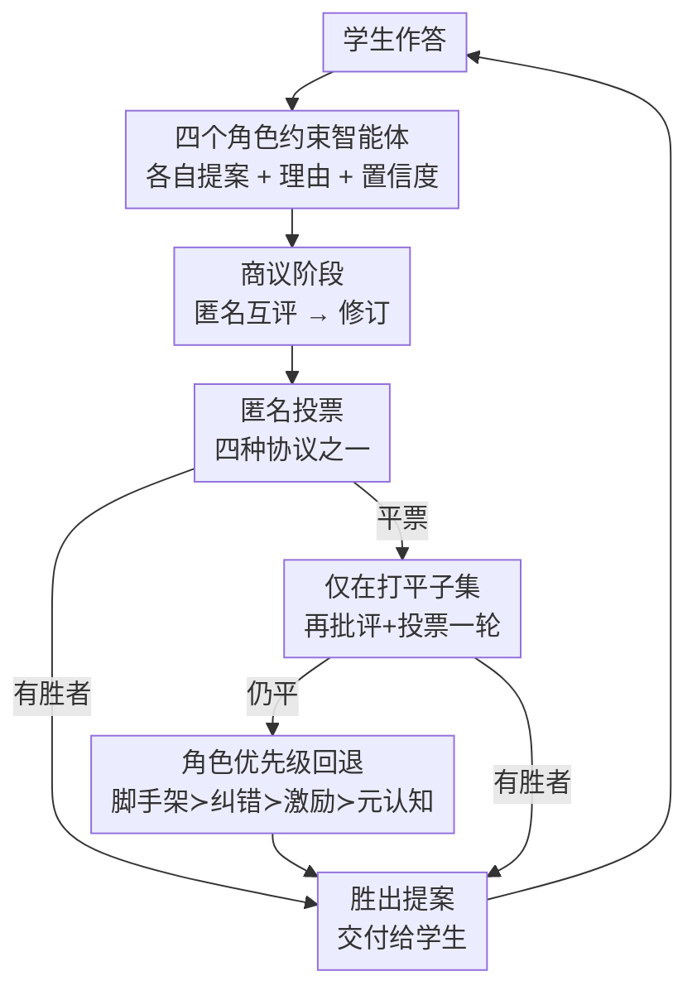

# Voting Protocols as Coordination Mechanisms for Role-Constrained Multi-Agent Tutoring Systems

**会议**: ICML2026  
**arXiv**: [2606.08030](https://arxiv.org/abs/2606.08030)  
**代码**: 待确认  
**领域**: 多智能体协调 / Cooperative AI  
**关键词**: 投票协议, 多智能体协调, 角色约束, 智能辅导系统, 协作 AI  

## 一句话总结
把四个职责互不重叠的"辅导智能体"（脚手架/纠错/激励/元认知）放进同一个辅导回合里，让它们各自提案、互评、修订，再用四种不同的投票协议（简单多数 / 排序 / 累积 / 赞同）把分歧收敛成一个最终答复；论文不是想证明"投票让辅导更好"，而是把辅导当成一个**目标部分对齐但局部冲突**的协调实验场，系统地刻画不同投票规则会诱导出怎样不同的协调行为。

## 研究背景与动机
**领域现状**：Cooperative AI 关心一类特殊场景——多个智能体的目标"方向一致但不完全相同"。辅导恰好是这种场景的天然样本：一个好老师要同时兼顾讲清概念、纠正误解、维持动机、引导反思这几件事。

**现有痛点**：这几个教学目标虽然都服务于"帮学生学会"，但在"下一句该说什么"这个层面经常打架。比如一句维护学生情绪的话可能把底层的概念误解留着不管；一句直接纠错的话又可能打击信心。把所有目标压进一个模型里，分歧就被藏起来了，无法观察也无法分析。

**核心矛盾**：辅导本质上不是单目标优化，而是**在相互竞争的教学优先级之间做集体决策**。问题的根本是：当多个局部偏好的智能体必须给出唯一动作时，"用什么规则聚合"本身会塑造协调结果，而这一步长期被当成无关紧要的聚合细节。

**本文目标**：拆成三个研究问题——不同投票协议如何塑造角色约束智能体之间的协调？"互评+修订"这个商议阶段如何改变最终被选中的动作？这些协调差异如何反映到不同任务、不同学习者画像下的辅导结果上？

**切入角度**：作者刻意把教学功能**拆散**到四个最小重叠的角色里，让分歧显式暴露出来，而不是塞进单一辅导策略里掩盖。只有当四个角色真的会倾向不同的辅导动作时，"协调"才有东西可观察。

**核心 idea**：把投票从"求答案的聚合步骤"重新定位成"暴露并解析教学冲突的协调显微镜"——用四种投票规则当探针，去看集体决策规则如何结构化群体行为。

## 方法详解

### 整体框架
系统由四个**角色约束的教学智能体** + 一个被模拟的学生 + 一个独立裁判组成。一个辅导回合（turn）走五个阶段：学生先尝试任务给出回答 → 四个角色各自生成提案（含简短理由和置信度）→ 匿名互评（每个智能体给每条提案指出一个优点一个缺点）→ 各自修订自己的提案 → 匿名投票选出最终答复交给学生。若投票打平，只在打平子集上再跑一轮"批评+投票"；仍平则用固定的角色优先级回退规则裁决。整个流程对下一个学生回合重复。

### 关键设计

**1. 四个最小重叠的角色约束智能体：让教学分歧显式可见**

这是全文协调能被观察的前提。痛点是单一辅导模型会把教学目标的冲突藏起来，于是作者把四件教学职责拆给四个互不重叠的智能体：**脚手架**（认知支持，把任务拆成子问题、给提示、铺下一步推理）、**纠错**（认识论修正，识别并指出学生回答里的错误信念）、**激励**（情感支持，肯定努力、维护信心、降低挫败）、**元认知**（自我调节支持，促学生说出自己的推理、规划下一步、评估自己的知识）。关键是这四个角色被设计成"最小重叠"——如果四个智能体行为雷同，就没有有意义的分歧留给协调协议去解析；正因为不同角色天然偏好不同的辅导动作，"合作"和"协调"才变成可测量的现象。这种被强制施加的专业分工，本身就是实验的自变量。

**2. 商议阶段（匿名互评 + 修订）：把分歧转成可追踪的偏好迁移**

光有不同提案还不够，作者插入了一个"商议"环节来捕捉智能体如何互相影响。所有提案先被匿名化（重贴随机标签 A/B/C/D、隐藏作者身份），每个智能体读完匿名提案集后给每条标出一个优点和一个缺点，然后在看过同行评审后修订自己的提案。匿名化是为了压制"自我偏袒"，让跨角色的采纳更可解释为同行影响而非自我识别。更妙的是，作者在互评后、修订前额外记录一次"初始投票"，这票**不用于选动作**，纯粹当诊断：对比初始票和最终票的分布，就能量化批评与修订到底把智能体偏好挪动了多少。这把抽象的"协调"落成了可测的量。

**3. 四种投票协议：用不同的票制当探针，看协调行为如何分化**

这是论文的核心自变量。同一套提案，换四种聚合规则会得到截然不同的协调动态：**简单多数**——每人投一票，得票最多者胜；**排序投票**——每人对全部提案排序，四个候选下第一名得 3 分、依次 2/1/0 分，总分最高者胜；**累积投票**——每个智能体把 25 分自由分配到提案集上，总分最高者胜；**赞同投票**——每个智能体标出所有"可接受"的提案，赞同数最多者胜。这些规则的差异不是表面的——比如累积投票把分摊开，商议很难撼动分布（最稳）；简单多数一人一票，改一票就挪动四分之一的支持向量（最易波动）。论文用一个量 $\Delta_{\text{vote}}=\tfrac{1}{2}\sum_i |p^{\text{init}}_i - p^{\text{final}}_i|$（初始票与最终票归一化分布的半 L1 距离，0=没动、1=完全重分配）来刻画每种协议下商议引起的偏好迁移幅度。

**4. 平票回退规则：把"协议选出的胜者"和"分歧没解决"分开**

投票协议有时根本分不开提案，作者用一个确定性的角色优先级回退来兜底：先在打平子集上再跑一轮批评+投票，若仍平则按固定优先级 $\text{脚手架} \succ \text{纠错} \succ \text{激励} \succ \text{元认知}$ 裁决。这个排序把"认识论纠错"置于"情感支持"之上、把"直接脚手架"置于两者之上，呼应经典 ITS 的常见优先级。作者诚实承认这是个会影响结果的设计选择——换个排序会在高回退条件下重分配胜场。所以论文专门报告每种协议的**回退率（Fallback）**，这样"由回退驱动的结果"才能和"由投票协议驱动的结果"分开解读——一个角色赢 70 次，在回退率 0.14 的赞同投票下有相当部分是回退在起作用，而在回退率 0.03 的累积投票下几乎全是投票者真实偏好。

### 一个完整示例
论文给了一个 SciQ、低信心新手学生、第 1 回合、累积投票的真实运行日志。学生在"altitude vs elevation"上同时提了两个相关术语。四个角色初始提案差异明显：脚手架给出两词区分并以"你选哪个"逼问结尾；纠错直接点明 elevation 最精确；激励一味肯定"两个都对，相信自己"；元认知则反问"在我告诉你之前，你能想想自己已经知道什么吗"。初始票为 [脚手架=28, 纠错=34, 激励=7, 元认知=31]，**纠错领先**。经过互评和修订——脚手架把逼问结尾换成更软的理解检查、激励在保留情感框架的同时补了一句澄清、元认知把提问重构得更协作——最终票变成 [脚手架=24, 纠错=25, 激励=16, 元认知=35]，**元认知逆转胜出**。这个例子直观展示了商议带来的"胜者翻转"：修订不是改措辞，而是改变了每条提案在"直接性、正确性、对学生支持"之间的平衡。

## 实验关键数据

实验在两个模拟辅导环境上做：**SciQ**（开放回答形式的概念辅导，让学生用自然语言解释答案）和 **HumanEval**（算法辅导，学生既要给自然语言推理又要给最终 Python 代码块）。每个任务跑五种条件（单智能体基线 + 四种投票），40 个任务 × 6 个学习者画像 × 5 种条件 = **1200 次模拟交互**，每次最多三轮，裁判分到 0.75 或达上限即结束（HumanEval 还要求代码过单元测试）。

### 主实验：协调诊断（每种协议跨 240 次交互）

| 协议 | $\Delta_{\text{vote}}$ | 翻转率 Flip | 回退率 | 胜出回合 | 脚手架/纠错/激励/元认知 |
|------|------|------|------|------|------|
| 简单多数 | 0.41 | 0.70 | 0.10 | 222 | 61 / 42 / 30 / 89 |
| 排序 | 0.20 | 0.59 | 0.05 | 223 | 77 / 70 / 33 / 43 |
| 累积 | 0.08 | 0.56 | 0.03 | 236 | 54 / 42 / 27 / 113 |
| 赞同 | 0.36 | 0.64 | 0.14 | 234 | 69 / 56 / 39 / 70 |

读法：累积投票最稳（$\Delta_{\text{vote}}=0.08$，分摊机制让商议难以撼动）、简单多数最易波动（0.41）；但**翻转率全都很高（0.56–0.70）**——也就是说商议前领先的提案在过半回合里最终落选，说明"互评+修订"这一步实质性地改变了结果。回退率上赞同最高（0.14）、累积最低（0.03），说明累积/排序的投票层更能可靠区分竞争提案。胜出角色分布也各异：累积把胜场集中到元认知（113），排序在脚手架/纠错间分（77/70），赞同看似均匀但因高回退率，很多其实是回退在选而非协议在选。

### 学生结果：按协调设定分开看

| 基准 | 条件 | Initial | Final | Gain |
|------|------|------|------|------|
| SciQ | 基线 | 0.55 | 0.50 | −0.04 |
| SciQ | 简单 | 0.54 | 0.60 | +0.06 |
| SciQ | 赞同 | 0.55 | 0.64 | **+0.10** |
| HumanEval 文字 | 基线 | 0.69 | 0.83 | +0.14 |
| HumanEval 文字 | 排序 | 0.68 | 0.89 | **+0.21** |
| HumanEval 代码 | 排序 | 0.54 | 0.84 | **+0.30** |
| HumanEval 代码 | 赞同 | 0.50 | 0.72 | +0.22 |

### 关键发现
- **没有"全场最优"的协议**：SciQ 概念辅导上赞同投票收益最大（+0.10），但同一个赞同投票在 HumanEval 上反而垫底（文字 +0.13、代码 +0.22）；HumanEval 上排序投票最强（文字 +0.21、代码 +0.30）。协调设定不同，最优规则也不同。
- **单智能体基线在代码任务上意外有竞争力**（代码 gain +0.29，仅次于排序的 +0.30），但在 SciQ 概念辅导上反而掉分（−0.04）。作者推测代码任务有更清晰的成功信号，通用辅导即便不显式分离情感/元认知支持也能给出有用脚手架。
- **回退率必须和胜出角色一起读**：角色胜场数单看会误导——同样赢 70 次，高回退（赞同 0.14）下是回退在firing，低回退（累积 0.03）下才是真实投票偏好。
- **辅导回合很短也有可测增益**：490 个辅导 episode 平均仅 2.38 轮（SciQ 2.53、HumanEval 2.14），即便如此模拟学生也显示出可测量的学习提升。

## 亮点与洞察
- **把投票从"聚合工具"重定义为"协调显微镜"**：大多数多智能体工作用投票提最终任务准确率，本文反过来用投票当探针去看协调动态本身，研究问题从"答案对不对"换成"集体决策规则如何结构化群体行为"，是个清爽的视角切换。
- **初始票当诊断而不参与决策**——这个设计很巧妙：用一票"虚拟投票"做基线，对比初始/最终分布就把抽象的"商议改变了多少偏好"变成了 $\Delta_{\text{vote}}$ 这个可比的标量，可直接迁移到任何"多轮商议+投票"的多智能体系统去量化"讨论到底有没有用"。
- **匿名化 + 回退率分离**这套方法论值得借鉴：匿名化压制自我偏袒让跨角色采纳可解释为同行影响；显式报告回退率把"协议选的"和"兜底选的"分开，避免把回退驱动的结果误读成协议优劣。
- **最小重叠的角色设计**是把"协调"变可观测的关键——可迁移到任何想研究多智能体分歧的场景：先确保智能体真的会分歧，分歧才有研究价值。

## 局限与展望
- **作者明确不主张"投票改善辅导"或"模拟能证明教育有效性"**：模拟学生只是研究协调机制的方法论起点，绝对学习增益不在论断范围内，结论的外部效度受限于模拟设定。
- 回退优先级排序（脚手架≻纠错≻激励≻元认知）是个会影响结果的设计选择，换个排序会在高回退条件下重分配胜场；论文靠报告回退率来缓解，但没有系统扫描不同排序的影响。
- 四个角色虽"最小重叠"但并非穷尽，六个学习者画像也不追求心理学真实性，只为制造系统性异质让"没有普适最优动作"成立——所以结论是关于协调模式的，不能直接外推到真人辅导。
- 跨基准比较要小心：SciQ 与 HumanEval 任务难度/成功信号不同，gain 不能直接比大小（这也是作者刻意分开报告的原因）。
- 可改进方向：把真人小样本试验接上来验证模拟结论、系统扫描回退排序、扩展到更多角色或动态角色权重。

## 相关工作与启发
- **vs Multi-Agent Debate (Liang/Du et al.)**: 他们用对抗式讨论鼓励发散推理来提升**最终任务准确率**；本文的分歧是由"目标高层对齐、局部冲突"的教学角色刻意诱导出来的，关注点是协调动态而非答案正确性。
- **vs 投票聚合工作 (Kaesberg et al.)**: 他们证明了"决策规则本身会影响结果"，本文承接这一洞见但把焦点从"最终答案准确率"移到"投票协议让哪些协调动态变得可见"。
- **vs CAMEL 角色扮演 (Li et al.)**: 借用了"给智能体分配不同角色让交互更结构化、可解释"的思路，但用途是制造可观测的教学分歧。
- **vs 经典 ITS (VanLehn) / LLM 辅导 (Puech et al.)**: 经典 ITS 早就指出辅导有效性靠脚手架、错误诊断、因材施教而非只给正确答案；本文与这条线的区别在于把教学功能**分布到专门智能体**上，而非优化单一辅导策略。

## 评分
- 新颖性: ⭐⭐⭐⭐ 把投票重定义为协调显微镜、用 $\Delta_{\text{vote}}$+回退率分离方法论刻画协调动态，视角清新。
- 实验充分度: ⭐⭐⭐ 1200 次交互、两基准、四协议、六画像覆盖面够，但全是模拟、无真人验证。
- 写作质量: ⭐⭐⭐⭐ 研究问题清晰、对自身局限和设计选择非常诚实，诊断指标定义到位。
- 价值: ⭐⭐⭐⭐ 为"多智能体商议+投票"系统提供了一套可复用的协调分析框架，方法论价值高于具体辅导结论。

<!-- RELATED:START -->

## 相关论文

- [\[ICML 2026\] Beyond Majority Voting: LLM Aggregation by Leveraging Higher-Order Information](beyond_majority_voting_llm_aggregation_by_leveraging_higher-order_information.md)
- [\[AAAI 2026\] Hierarchical Pedagogical Oversight: A Multi-Agent Adversarial Framework for Reliable AI Tutoring](../../AAAI2026/multi_agent/hierarchical_pedagogical_oversight_a_multi-agent_adversarial_framework_for_relia.md)
- [\[ACL 2026\] Debating the Unspoken: Role-Anchored Multi-Agent Reasoning for Half-Truth Detection](../../ACL2026/multi_agent/debating_the_unspoken_role-anchored_multi-agent_reasoning_for_half-truth_detecti.md)
- [\[ACL 2026\] A Multi-Agent Framework for Feature-Constrained Difficulty Control in Reading Comprehension Item Generation](../../ACL2026/multi_agent/a_multi-agent_framework_for_feature-constrained_difficulty_control_in_reading_co.md)
- [\[ACL 2026\] SILO-BENCH: A Scalable Environment for Evaluating Distributed Coordination in Multi-Agent LLM Systems](../../ACL2026/multi_agent/silo-bench_a_scalable_environment_for_evaluating_distributed_coordination_in_mul.md)

<!-- RELATED:END -->
