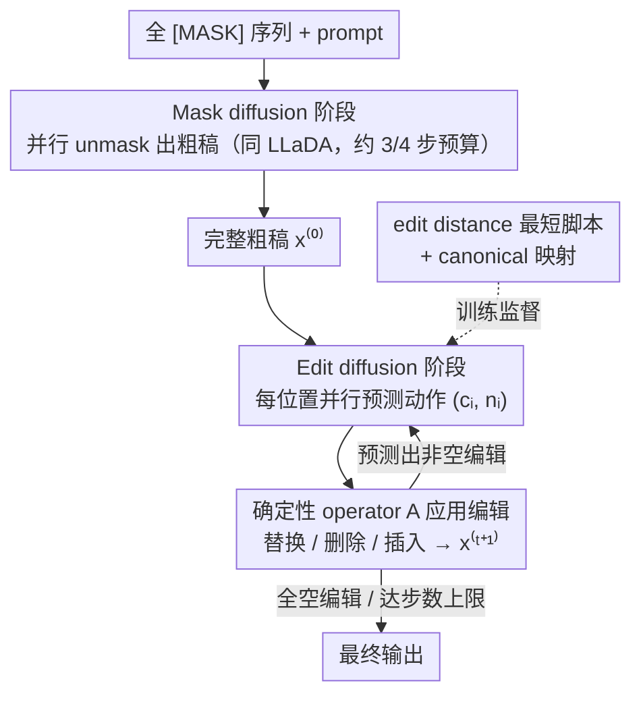

# Edit-Based Refinement for Parallel Masked Diffusion Language Models

**会议**: ICML 2026  
**arXiv**: [2605.09603](https://arxiv.org/abs/2605.09603)  
**代码**: https://github.com/renhouxing/ME-DLM  
**领域**: 扩散语言模型 / 并行解码 / LLaDA / 文本生成  
**关键词**: Masked Diffusion、edit-based refinement、edit distance 监督、parallel decoding

## 一句话总结
ME-DLM 给 masked diffusion 语言模型（如 LLaDA）加一个"解码完再编辑修补"的轻量阶段：第一阶段照常 unmask 出粗稿，第二阶段用替换/删除/插入三种 token 级编辑做并行修正，监督信号来自 edit distance 的最短编辑脚本，在只用 1/8 扩散步数的情况下 HumanEval +11.6 / GSM8K +33.6 点反超 LLaDA-Instruct。

## 研究背景与动机

**领域现状**：Masked Diffusion Language Models (MDLM) 如 LLaDA、Dream 在 billion 级别已能匹配自回归 LLM，最大卖点是**并行解码**——一步同时填多个 mask token，比自回归省时。

**现有痛点**：当真的把每步并行预测的 token 数从 1 拉到 4、8 甚至 16 时，生成质量**断崖式下跌**。论文给的极端例子很直观：训练集只有 "2+2=4"、"2+3=5"、"3+2=5"，模型按 token 边际概率独立采样，居然能生出 "2+2=5"——每个 token 单看都最大概率，组合起来违反算术。

**核心矛盾**：MDLM 训练目标是 token 级的 cross-entropy ℒ ∝ E[−log pθ(x0,i|xt)]，只对每个位置的**边际分布**建模；但并行 decoding 时模型在 $\mathcal{S}$ 集合上同时取 argmax，相当于隐式假设各位置条件独立 $p_\theta(x_{0,\mathcal{S}}|x_t)\approx\prod_{i\in\mathcal{S}}p_\theta(x_{0,i}|x_t)$。**边际优 ≠ 联合优**，这就是并行多 token 失败的根源。

**本文目标**：在不动 LLaDA 整套训练范式、不增加扩散总步数的前提下，弥补这个"联合一致性缺失"。

**切入角度**：作者注意到——并行 decoding 出来的粗稿其实已经接近正确，只是有零星结构错误（多/少/错 token）。如果第一阶段保留并行 unmask 拿到粗稿，再加一个**轻量的编辑修补阶段**做局部修正，就能既享受并行的速度，又获得联合一致性。

**核心 idea**：把扩散过程拆成 "mask diffusion（生成粗稿）+ edit diffusion（局部修正）" 两阶段；edit 阶段用替换/删除/插入三种 token 级编辑动作，监督信号是从粗稿到目标的**最短编辑脚本（edit distance）**。

## 方法详解

### 整体框架
两阶段扩散，全程共享同一组参数（LLaDA-8B），训练时是三个阶段累进：

- **Mask diffusion 阶段**：从全 mask 序列开始，按 $\{t_K>\dots>t_0=0\}$ 调度反复 unmask，每步并行填若干 mask token，得到完整粗稿 $x^{(0)}$。这部分完全等同于 LLaDA。
- **Edit diffusion 阶段**：从 $x^{(0)}$ 开始，每步模型对每个 token 位置预测一对动作 $(c_i,n_i)$——$c_i\in\mathcal{V}\cup\{\text{[DEL]}\}$ 表示当前位置 replace/delete/keep，$n_i\in\mathcal{V}$ 表示在当前位置后面插入什么（如果 $n_i=c_{i+1}$ 则不插入）。一个确定性 operator $A$ 把这些动作应用到序列上：$x^{(t+1)}=A(x^{(t)},\{(c_i,n_i)\})$。所有位置的动作**并行预测**，但应用时整序列共同变化，相当于在 application 层耦合了 token 间的依赖。
- **终止**：当模型对所有位置都预测"空编辑"（$c_i=x_i$ 且不插入）或达到最大轮数时停止。

### 关键设计

**1. Token 级 $(c_i,n_i)$ 编辑动作 + 确定性应用：并行预测、串行耦合**

要保留 MDLM 的并行优势，预测端就必须 factorized；可解决"边际优≠联合优"又要求位置间能互相牵制——这是个看似两难的矛盾。作者的切口是把"耦合"从预测端移到应用端。每个位置并行输出一对动作：$c_i \in \mathcal{V}\cup\{\text{[DEL]}\}$ 决定当前 token 是替换 / 删除 / 保留，$n_i \in \mathcal{V}$ 决定在它后面插什么；transition 在预测层完全独立 $p_\theta(x^{(t+1)}|x^{(t)}) \equiv \prod_{i=1}^{L_t} p_\theta(c_i,n_i|x^{(t)})$。

真正让位置间耦合的是确定性 operator $A$：它从左到右扫一遍，遇 $c_i=\text{[DEL]}$ 就删 $x_i^{(t)}$，否则用 $c_i$ 替换；接着若 $n_i \neq c_{i+1}$ 就在位置 $i$ 后插入 $n_i$。连续重复插入用 canonical 表示（"a a a b" 写成"a b 中间插 a"），prompt 与 generated 的边界也算可插入位置。这样并行性留在 prediction、联合一致性放进 deterministic application，绕过了"并行 + 显式联合建模"的根本冲突——这是全文最巧的工程设计。

**2. Edit distance 监督 + canonical 映射：让模型学"最小修正"而非"重写"**

有了动作空间还得给监督信号，且这个信号要明确指向"只改该改的"。作者训练时先用当前模型自己生成中间状态 $x^{(m)}$（mask diffusion $n$ 步 + edit diffusion $m$ 步），再用经典 edit distance 算法求从 $x^{(m)}$ 到 ground-truth $x^\star$ 的最短编辑脚本，最后用 canonical 规则把脚本映射成每个位置的目标 $(c_i^\star,n_i^\star)$；若同一位置要插多个 token，本步只监督第一个，其余推迟到后续步骤。

用 edit distance 当监督的好处是去歧义：给定 $(x^{(m)},x^\star)$，canonical 下的最短脚本唯一，训练信号不会自相矛盾。而"只学最小修改"会让模型天然倾向保守编辑，序列稳定后就输出空编辑自行终止，正好契合扩散过程的收敛语义。比起用 RL / RLHF 训一个 edit policy，这套确定性监督简单且稳得多。

**3. 三阶段课程式训练 + 推理步数分配：先学好粗稿，再学修补**

直接上来就训 edit 会因初始粗稿太差、编辑负担过重而崩。作者用 curriculum 让能力逐层叠加：Stage 1 在 Nemotron-Pretraining-SFT 上学预测当前 + 下一个 token，给 $(c_i,n_i)$ 的下一 token 预测打底；Stage 2 在 R1-Distilled 数据上只跑标准 masked diffusion fine-tune，先拿到一个强 baseline；Stage 3 在同样数据上交错 mask + edit 训练，$m$ 从 0 起步逐渐拉大。

推理时步数分配的原则是"大头给 mask"：默认 1/4 总预算给 edit、edit 步上限 32，例如 1/8 budget（64 步）切成 48 mask + 16 edit。这是因为粗稿越好需要的修补越少——Table 3 证实 1/1 budget 时实际平均只用 6-9 步 edit 就收敛，说明 edit diffusion 是真正的收敛过程而非开放式重写。

### 损失函数 / 训练策略
- 三阶段累进 fine-tune 同一组 LLaDA-8B 参数；Stage 1 lr=5e-5 batch=2048；Stage 2 lr=5e-5 batch=128；Stage 3 lr=1e-5 batch=128；总 64×H800 GPU 训练 ~213 小时。
- 推理：mask diffusion → edit diffusion，edit 步数上限 32，遇到全空编辑提前停。

## 实验关键数据

### 主实验

数学和代码 6 个基准，不同 budget 下平均增益（Budget = 总步数 × 每步 token 数 / 序列长度）：

| Budget | LLaDA-Instruct | ME-DLM Stage-2 | **ME-DLM Stage-3** | Stage-3 vs Stage-2 |
|--------|----------------|----------------|--------------------|--------------------|
| 1/1 | 45.3 | 55.7 | **60.0** | +4.3 |
| 1/2 | 42.5 | 50.7 | **55.4** | +4.7 |
| 1/4 | 32.3 | 37.7 | **46.4** | +8.7 |
| 1/8 | 20.9 | 19.3 | **32.6** | +13.3 |

具体数据集上，1/8 budget 时（每步并行 8 token，总 64 步）：

| 数据集 | LLaDA-Instruct | ME-DLM Stage-3 | 提升 |
|--------|----------------|----------------|------|
| HumanEval | 12.2 | 25.0 | **+12.8** |
| HumanEval+ | 9.8 | 22.6 | +12.8 |
| MBPP | 17.5 | 26.7 | +9.2 |
| GSM8K | 50.3 | 83.8 (84.8 @ 1/1) | 极显著 |
| MATH-500 | 20.2 | 34.4 | +14.2 |

（论文摘要里说的"+11.6 HumanEval / +33.6 GSM8K"指的是 ME-DLM Stage-3 vs LLaDA-Instruct，在不同 budget 下取的代表性数）

### 消融实验

Step 分配实验（1/8 budget = 64 步总）：

| m/e (mask/edit) | HumanEval | GSM8K | 备注 |
|-----------------|-----------|-------|------|
| 64/0 (only mask) | 大跌 | 大跌 | 验证并行 decoding 的失败 |
| 32/32 | 中等 | 中等 | 平衡但 mask 不够 |
| 48/16（默认） | **最优** | **最优** | mask 多一些粗稿好，edit 16 步够修 |
| 0/64 (only edit) | 在低 budget 有时 ok | - | 灵活但稳定性差 |

Edit 收敛步数：

| Budget | 总 edit 上限 | HumanEval 实际 | MATH-500 实际 |
|--------|-------------|----------------|---------------|
| 1/1 | 32 | 6.2 | 7.4 |
| 1/2 | 32 | 21.6 | 17.8 |
| 1/4 | 32 | 27.6 | 24.1 |
| 1/8 | 16 | 15.2 | 14.7 |

### 关键发现
- **Budget 越小，edit 的收益越大**：1/1 budget 上 Stage-3 vs Stage-2 才 +4.3，到 1/8 直接 +13.3——说明 edit refinement 是为了**补救激进并行 decoding** 而生的。
- **Mask 步数提高时 edit 步数自动减少**（Table 3）：1/1 时实际只用 6-9 步 edit 就达成空编辑，1/4 时要 26-27 步——验证 "粗稿越好，需要的修补越少"的直觉，说明 edit diffusion 是真正的收敛过程而不是 open-ended 重写。
- **GSM8K 上 +33.6 是论文最炸的数字**：从 50.3 跳到 83.8，说明数学推理对 "联合一致性"特别敏感（错一个 token 整道题全错），edit refinement 在这种任务上几乎是必需的。
- **代码任务的提升明显小于数学**：可能因为代码每个 token 都有强约束（语法），并行 decoding 错得不离谱时还能 compile；数学错一个数就全错。

## 亮点与洞察
- **"预测端 factorized + 应用端确定性耦合"是巧妙的解耦设计**：让并行性留在 prediction 里、把联合一致性放到 deterministic application 里，绕过了"并行 + 联合建模"的根本矛盾。这个 trick 完全可以迁移到任何 token-level parallel generation 框架（非 mask 扩散、speculative decoding 等）。
- **Edit distance 作为监督信号是一个被低估的工具**：在 LLM 时代大家都在用 RLHF/DPO，但当目标是"最小修正而非任意改写"时，edit distance 提供的确定性、最短性、可计算性远比 RL 训练 reward model 更稳。
- **"自生成 trajectory 训 self-correction"的训练范式**：Stage 3 用模型自己当前生成的粗稿做 edit 监督，让训练分布 = 推理分布，从根本上避免 exposure bias。
- **方法外延广**：扩散视频生成、扩散语音、并行非自回归 MT 都有同样的"边际优≠联合优"问题，ME-DLM 思路可平移。

## 局限与展望
- **必须做三阶段累进训练**，比直接 fine-tune LLaDA 麻烦得多，且 Stage 1 训 150 小时门槛高。
- **Edit 阶段需要 self-rollout 生成训练数据**，每步训练成本远高于标准 SFT。
- **Budget 接近 1/1 时收益变小**：当并行性不激进时，edit 性价比低，不值得引入这个机制。
- **canonical 映射有歧义性**：同一段 edit distance 对应多个最短脚本，作者只是固定一个，但不一定是最优选择。
- **只验证了 code + math**：开放生成、对话场景是否仍能从 "最小编辑" 中受益没有评估。
- **edit 操作仅 token-level**：无法做 span 级重写（比如"把整个段落顺序调一下"）。
- **改进方向**：(i) 让 edit 步数动态自适应而不是固定上限；(ii) 学一个轻量 edit policy 替换 edit distance 监督；(iii) 把 edit refinement 和 best-of-N sampling 结合做 test-time scaling。

## 相关工作与启发
- **vs Soft Mask / EvoToken**：都在 mask 表示层做软化（让 mask 不再是硬 0），ME-DLM 不动 mask 表示，而是在解码后加 edit 阶段，思路正交。GSM8K 上 1/4 budget ME-DLM 比 Soft Mask +14.3 比 EvoToken +4.3。
- **vs LRD / 自适应停步**：LRD 监控收敛动态调步数，但 budget 不可比；ME-DLM 在 fixed budget 下做对比，结论更清晰。
- **vs Speculative decoding / Medusa**：那是 autoregressive 上的 draft-verify；ME-DLM 是 diffusion 上的 draft-edit，理念相似但落地完全不同。
- **vs CDLM / remasking 方法**：都试图修正错误 token，但 remasking 只能 replace 不能 insert/delete，应对"少一个 token"的错误束手无策；ME-DLM 三种操作齐全。
- **vs Levenshtein Transformer / EditNAR**：edit-based 非自回归 MT 的老路；ME-DLM 把这套思想迁移到 diffusion LM 上，并配合 LLaDA 这种现代基座做出大模型规模的效果。

## 评分
- 新颖性: ⭐⭐⭐⭐ 用 edit refinement 解决并行扩散的联合一致性问题，技术组合简洁有力
- 实验充分度: ⭐⭐⭐⭐ 6 个数学 + 代码 benchmark、4 种 budget、step 分配 + 收敛性消融都有，但缺少开放生成评估
- 写作质量: ⭐⭐⭐⭐⭐ "2+2=5" 的失败例子极具说服力，公式 + 算法表非常清晰
- 价值: ⭐⭐⭐⭐⭐ GSM8K +33.6 是改变 diffusion LM 实用性的关键工作，代码开源

<!-- RELATED:START -->

## 相关论文

- [\[ACL 2025\] Just Go Parallel: Improving the Multilingual Capabilities of Large Language Models](../../ACL2025/multilingual_mt/just_go_parallel_improving_the_multilingual_capabilities_of_large_language_model.md)
- [\[ICML 2026\] Optimizing Language Models for Crosslingual Knowledge Consistency](optimizing_language_models_for_crosslingual_knowledge_consistency.md)
- [\[ACL 2026\] Language Models Entangle Language and Culture](../../ACL2026/multilingual_mt/language_models_entangle_language_and_culture.md)
- [\[AAAI 2026\] ViDia2Std: A Parallel Corpus and Methods for Low-Resource Vietnamese Dialect-to-Standard Translation](../../AAAI2026/multilingual_mt/vidia2std_a_parallel_corpus_and_methods_for_low-resource_vietnamese_dialect-to-s.md)
- [\[ACL 2026\] XQ-MEval: A Dataset with Cross-lingual Parallel Quality for Benchmarking Translation Metrics](../../ACL2026/multilingual_mt/xq-meval_a_dataset_with_cross-lingual_parallel_quality_for_benchmarking_translat.md)

<!-- RELATED:END -->
