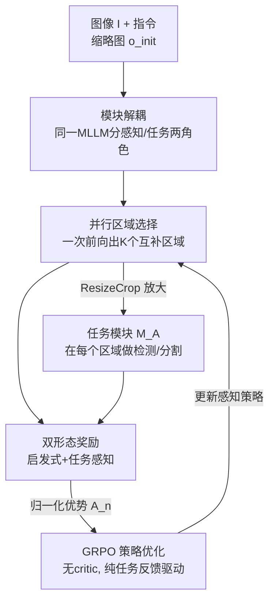

# ACTIVE-o3: Empowering MLLMs with Active Perception via Pure Reinforcement Learning

**会议**: ICML 2026  
**arXiv**: [2505.21457](https://arxiv.org/abs/2505.21457)  
**代码**: 待确认  
**领域**: 多模态VLM / 主动感知 / 强化学习  
**关键词**: 主动感知, MLLM, GRPO, 区域选择, 小目标检测

## 一句话总结
ACTIVE-o3 把"该往哪看、怎么看"这件事交给一个 MLLM 自己学：用纯强化学习（GRPO）训练它把一张图像并行地圈出最多 3 个最值得放大的子区域，靠"任务奖励 + 启发式奖励"双形态奖励解决纯任务奖励太稀疏的问题，在小/密集目标检测、遥感、自动驾驶、交互式分割上一致超过基线，还顺带提升了 RealWorldQA / MME 等通用理解能力。

## 研究背景与动机

**领域现状**：MLLM 正越来越多地被当作机器人/具身系统的"大脑"做规划与决策，但它们对视觉输入基本是**被动消费者**——给一张固定分辨率的全局图，看到什么就处理什么。

**现有痛点**：人和具身智能体的高效感知靠的是**主动感知**（active perception）：主动选择往哪看、怎么看来获取任务相关信息。MLLM 缺这一环。GPT-o3 的 zoom-in 搜索是第一次尝试，但它区域提议低效、目标定位不准，在密集或细粒度场景尤其差，而且是**串行**一个区域一个区域地放大，开销大。

**核心矛盾**：要教 MLLM 选区域，最直接是监督学习，但**根本拿不到监督标签**——一个候选区域 $a^{\text{cam}}$ 的价值只有把它喂给下游任务模型、看任务做得好不好才能揭示，没有现成的"正确该看哪"标注；而且还要模型同时输出多个并行区域提议 + 连贯推理，更没法直接监督。

**本文目标**：(1) 给"基于 MLLM 的主动感知"一个形式化定义；(2) 在可复现的 2D 设定下，不靠区域选择监督、纯用 RL 训出一个高效稳定的感知策略；(3) 建一套覆盖开放世界与领域特定场景的评测基准。

**切入角度**：作者观察到任务奖励虽稀疏却是唯一的"真信号"，而启发式约束（格式、不重叠、面积合理、覆盖率）虽便宜却可能跑偏——把两者**绑在一起**就能既稠密稳定又对齐下游目标。

**核心 idea**：把单个 MLLM 解耦成"感知模块（决定往哪看）+ 任务模块（决定怎么做）"，用 GRPO + 双形态奖励，让感知模块在一次前向里并行选出多个互补区域，端到端由下游任务表现驱动。

## 方法详解

### 整体框架
ACTIVE-o3 把一个共享的 MLLM 当成统一策略 $\pi(y\mid o,\mathcal{I})$，靠两套 prompt 切换成两个角色：感知模块 $\mathcal{M}_O$（用指令 $\mathcal{I}_O$ 提议该放大哪些区域）和任务模块 $\mathcal{M}_A$（用指令 $\mathcal{I}_A$ 在某个区域上做检测/分割）。给定图像 $I$ 和指令 $\mathcal{I}$，先把 $I$ 缩成一张低分辨率全局缩略图 $o_{\text{init}}$ 当粗略先验；$\mathcal{M}_O$ 在一次前向里**并行**吐出 $K$ 个候选区域 $\{a_k^{\text{cam}}\}$（带 `<think>` 推理 + `<answer>` 框）；每个区域经 ResizeCrop 得到放大观测 $o_k$，再交给固定的 $\mathcal{M}_A$ 产出该区域的最终任务输出 $a_k^{\text{env}}$。

作者把这件事建模成 2D 静态图像上的**单步决策**（$T=1$）：因为图像不会被交互动作改变，环境状态恒定，于是固定任务模块 $\mathcal{M}_A$、只学感知策略 $\mathcal{M}_O$，目标是在固定"感知预算" $K$ 下最大化下游任务表现：

$$\max_{\mathcal{M}_O}\ \mathbb{E}_{I,\mathcal{I}}\Big[\sum_{k=1}^{K} R\big(\mathcal{M}_A(o_k),\ \mathcal{I}\big)\Big],\quad \{a_k^{\text{cam}}\}=\mathcal{M}_O(o_{\text{init}},\mathcal{I}),\ o_k=\text{ResizeCrop}(I,a_k^{\text{cam}})$$

训练分两段串起来：先用 prompt 把 MLLM 零样本初始化成一个可用的感知策略，再用 GRPO + 双形态奖励把它磨好。

### 关键设计

**1. 模块解耦：把同一个 MLLM 拆成"感知 $\mathcal{M}_O$ + 任务 $\mathcal{M}_A$"两个角色**

主动感知的本质是"看"和"做"的协同，但用两个专家模型分别担当会丢掉 MLLM 的语言指令跟随和泛化能力。作者用**单个** MLLM 同时兼任两职，靠两套 prompt 区分：$\mathcal{M}_O(o_{\text{init}},\mathcal{I}_O):=\text{Parse}_{\text{cam}}(\pi(y\mid o_{\text{init}},\mathcal{I}_O))$ 从全局缩略图提议 $K$ 个候选区域，$\mathcal{M}_A(o_k,\mathcal{I}_A):=\text{Parse}_{\text{env}}(\pi(y\mid o_k,\mathcal{I}_A))$ 在第 $k$ 个裁剪区域上产出任务输出。这样的好处是：感知与执行职责清晰、各自可单独评估与替换（测试时甚至能把 $\mathcal{M}_A$ 换成更强的专用模型），又复用了同一套 MLLM 权重和它的开放语义理解。注意检测任务里 $a_k^{\text{cam}}$ 和 $a_k^{\text{env}}$ 都是 bbox，但角色不同——前者是"提议去看哪"，后者是"最终定位预测"。

**2. 并行区域选择：一次前向出 $K$ 个互补区域，取代串行 zoom-in**

GPT-o3 那种串行放大要逐个区域反复前向，开销大且容易在错误区域上越走越偏。ACTIVE-o3 把它建成单步决策（$T=1$），让感知策略在**一次前向**里直接吐出 $\{a_k^{\text{cam}}\}_{k=1}^{K}$（实现里 $K$ 最多 3）。并行产出天然鼓励这组区域**多样且互补**——覆盖更全、在固定感知预算下效率更高。对比像 V* 这类搜索方法每张图常需 10+ 次 MLLM 前向，ACTIVE-o3 一次搞定，这是它"在固定算力预算下又快又准"的直接来源。

**3. 双形态奖励：启发式奖励 + 任务感知奖励，治"纯任务奖励太稀疏"**

这是全文核心创新。只用任务奖励的话信号太稀疏、还容易被任务模块主导，感知策略学不出多样合理的选区行为；只用启发式奖励又可能和真正的下游目标脱节。作者把两者加权相加。**启发式奖励**评单条响应、与任务无关，含四项：格式有效（必须是可解析的 JSON、bbox 在 `bbox_2d` 字段、含 `<think>`/`<answer>`）、提议不重叠（两两 IoU 低于阈值才奖、重叠则罚）、面积落在合理范围（如占图 1%–50%，避免过小过大）、覆盖率奖励（有 GT mask/box 时奖励预测区域与任务相关区域的对齐，如覆盖的 GT 像素比例 / 命中的 GT 框比例 / 与参考 mask 的 Dice/IoU）。**任务感知奖励**则真把每个选中区域 $o_k$ 喂给任务模块 $\mathcal{M}_A$ 跑一遍、用任务指标打分：检测任务用预测框与 GT 框的 AP/AR（基于 IoU 匹配），交互式分割任务则让 $\mathcal{M}_A$ 预测正/负交互点喂给本地 SAM、用输出 mask 与 GT 的 mIoU 评。两者合起来既稠密稳定（启发式撑着）又对齐终任务（任务感知拽着）。由于任务感知奖励要额外跑 $\mathcal{M}_A$ 的前向，作者实现了批量推理系统做并行评估。

**4. GRPO 优化：无 critic、纯下游任务反馈端到端磨策略**

区域价值无监督标签可用，只能靠下游任务表现间接揭示，因此作者用 GRPO——一种不需训练 critic 的轻量策略优化，特别适合 LLM。给定 $(o_{\text{init}},\mathcal{I}_O)$，行为策略采 $N$ 条响应，每条解析出 $K$ 个候选区域，目标为

$$\mathcal{J}_{\text{GRPO}}(\theta)=\mathbb{E}\Big[\tfrac{1}{N}\sum_{n=1}^{N}\min\big(w_n A_n,\hat{w}_n A_n\big)-\beta D_{\mathrm{KL}}(\pi_\theta\|\pi_{\text{ref}})\Big]$$

其中 $w_n$ 是新旧策略的重要性比、$\hat{w}_n$ 是其裁剪版，$\pi_{\text{ref}}$ 是冻结的参考策略（如基座 MLLM）做正则。优势用组内奖励的均值方差归一化：$A_n=\frac{r_n-\mathrm{mean}(\{r\})}{\mathrm{std}(\{r\})}$。整个感知策略由双形态奖励 $r_n$ 端到端驱动，不需任何区域选择监督——这正是"pure RL"的含义。

## 实验关键数据

### 主实验
基座为 Qwen2.5-VL-7B。在 LVIS 上构建小目标（实例<100 像素）与密集（>15 实例/图）grounding 基准，对比 GDINO、Qwen2.5-VL、其 CoT 变体、V*+GDINO。

| 数据集 | 指标 | Qwen2.5-VL | ACTIVE-o3 | 提升 |
|--------|------|-----------|-----------|------|
| LVIS_small | AP_s / AR_s | 1.2 / 1.8 | 2.2 / 4.6 | +1.0 / +2.8 |
| LVIS_dense | AP_s / AR_s | 1.6 / 2.0 | 4.3 / 5.5 | +2.7 / +3.5 |
| LVIS_dense | AR_l | 18.7 | 33.3 | +14.6 |
| SODA-A（遥感） | AP_s / AR_s | 0.7 / 1.5 | 9.2 / 10.4 | +8.5 / +8.9 |
| SODA-D（驾驶） | AP_s / AR_s | 2.1 / 4.5 | 15.1 / 22.0 | +13.0 / +17.5 |

把 ACTIVE-o3 的感知策略接到更强的 GDINO 上（ACTIVE-o3+GDINO），LVIS_small 达 7.0 AP_s / 7.9 AR_s，比纯 GDINO +1.3/+1.6——说明学到的 $\mathcal{M}_O$ 是可迁移的通用感知策略，能给专用任务模型也带来增益。

### 交互式分割与通用理解

| 实验 | 配置 | 关键指标 | 说明 |
|------|------|---------|------|
| ThinObjects 分割（zoom 预算 3） | Qwen2.5-VL-CoT | mIoU 0.561 | 预算增大反而退化（往错区域放大、误差累积） |
| ThinObjects 分割（zoom 预算 3） | ACTIVE-o3 | mIoU 0.863 | 预算增大持续提升（学会选难区纠错） |
| 通用理解 RealWorldQA | Qwen2.5-VL-7B-Instruct | 67.9 | 初始化模型 |
| 通用理解 RealWorldQA | ACTIVE-o3 | 69.7 | 不退反升 |
| 通用理解 MME | 初始化 → ACTIVE-o3 | 2308 → 2316 | 维持/略升 |

### 关键发现
- **双形态奖励是稳定性来源**：纯任务奖励太稀疏、易被任务模块主导，启发式分量提供稠密可解释信号把训练稳住（Appendix Table 15 的消融印证）；这是方法能纯 RL 跑通的前提。
- **预算越大越好 vs 越大越糟**：同样给 3 步 zoom 预算，CoT 基线因往错区域放大而退化到 0.561，ACTIVE-o3 却升到 0.863——区别全在"会不会选对该放大的难区域"，凸显学得的感知策略价值。
- **主动感知可当通用 proxy 任务**：尽管完全没在 reasoning/QA 数据上训，ACTIVE-o3 在 MMBench/MME/RealWorldQA 上无一退化、RealWorldQA 还涨——说明用感知标注训主动感知，能间接撬动 MLLM 的视觉理解与推理。
- **遥感/驾驶大域差仍稳**：SODA-A 域差更大却仍 +8.5 AP_s，SODA-D 提升更猛，证明感知策略跨域可迁移而非过拟合 LVIS。

## 亮点与洞察
- **把"无标签的选区问题"重铸成 RL 问题**：区域价值只有下游才知道、天然没监督标签，作者用 GRPO 把这层"延迟、间接"的信号直接当奖励端到端学，绕开了对"该看哪"的人工标注——这是方法成立的关键洞察。
- **双形态奖励是可迁移的配方**：用便宜的启发式（格式/不重叠/面积/覆盖率）做稠密脚手架、用真跑下游的任务指标做对齐拽绳，这套"稀疏真信号 + 稠密代理信号绑定"思路可搬到任何奖励稀疏的 agentic RL 场景。
- **并行 vs 串行的效率账**：一次前向出 $K$ 个互补区域，对比搜索类方法 10+ 次前向，把"主动感知"从昂贵的多步搜索压成单步决策，是落地到机器人实时回路的现实前提。
- **感知策略可拆下来配更强任务模型**：$\mathcal{M}_O$ 能与 GDINO 解耦组合并仍带增益，说明它学到的是"该往哪看"这一通用能力，而非和某个任务模型耦死。

## 局限与展望
- **退化到 2D 静态单步**：作者坦承通用形式化覆盖具身 3D 场景，但为可复现/可公平评测，实际只实例化成 2D 静态图像、单步决策（$T=1$）；真实具身里的序列视点变化、环境随交互改变都被剥离，离"完整主动感知"还有距离。
- **任务感知奖励训练开销大**：每个候选区域都要再跑一遍 $\mathcal{M}_A$ 前向，虽做了批量推理系统，整体训练成本仍显著高于纯启发式奖励。
- **依赖 oracle/外部任务模型**：交互式分割实验因缺强公开任务模型而用 oracle 模拟完美点击反馈来隔离感知策略效果，真实部署里 $\mathcal{M}_A$ 不完美时的端到端表现尚未充分检验。
- **感知预算固定且小（$K\le 3$）**：固定小预算简化了评测，但对超密集场景或需要更多视点的任务是否够用、预算如何自适应，留待后续。

## 相关工作与启发
- **vs GPT-o3 zoom-in**：o3 是串行、启发式、区域提议低效且定位不准；ACTIVE-o3 把它视为特例，改成并行单步 + RL 学策略，效率与准确度都更高。
- **vs Visual CoT / ReFocus / Chain-of-Spot 等**：这些方法在**固定图像**上做 grounded 推理、且默认相关区域已可见、靠 prompting 或 SFT；ACTIVE-o3 针对的是"目标可能根本看不清/没出现"的不确定性下**探索式选区**，做的是 perception-centric（小目标/密集）而非 reasoning-centric 任务，且用 RL 无需区域监督。
- **vs ZoomEye / DeepEyes / V***：ZoomEye 用启发式树搜索缩放、DeepEyes 用 RL 优化视觉思考、V* 是 MLLM 搜索算法但每图 10+ 次前向；它们都没学出一个**通用感知策略**，ACTIVE-o3 学的正是可迁移、单步并行的 $\mathcal{M}_O$。

## 评分
- 新颖性: ⭐⭐⭐⭐⭐ 首个面向 MLLM 主动感知的纯 RL 框架，模块解耦 + 双形态奖励 + 并行单步选区是一套自洽的新配方。
- 实验充分度: ⭐⭐⭐⭐ 覆盖开放世界 grounding、遥感、驾驶、交互分割、通用理解五类，迁移与消融都做了；但部分分割实验依赖 oracle 任务模型。
- 写作质量: ⭐⭐⭐⭐ 形式化定义清晰、奖励设计讲得透；2D 单步的退化与局限也诚实交代。
- 价值: ⭐⭐⭐⭐⭐ 填补 MLLM 主动感知空白，感知策略可迁移、还能当通用 proxy 提升理解能力，对具身/机器人方向有实际拉动。

<!-- RELATED:START -->

## 相关论文

- [\[CVPR 2026\] SaPaVe: Towards Active Perception and Manipulation in Vision-Language-Action Models for Robotics](../../CVPR2026/multimodal_vlm/sapave_active_perception_manipulation_vla_roboti.md)
- [\[CVPR 2026\] Label What Matters: Modality-Balanced and Difficulty-Aware Multimodal Active Learning](../../CVPR2026/multimodal_vlm/label_what_matters_modality-balanced_and_difficulty-aware_multimodal_active_lear.md)
- [\[CVPR 2026\] Similarity-as-Evidence: Calibrating Overconfident VLMs for Interpretable and Label-Efficient Medical Active Learning](../../CVPR2026/multimodal_vlm/similarity-as-evidence_calibrating_overconfident_vlms_for_interpretable_and_labe.md)
- [\[ICML 2026\] Injecting Distributional Awareness into MLLMs via Reinforcement Learning for Deep Imbalanced Regression](injecting_distributional_awareness_into_mllms_via_reinforcement_learning_for_dee.md)
- [\[ICML 2026\] CVSearch: Empowering Multimodal LLMs with Cognitive Visual Search for High-Resolution Image Perception](cvsearch_empowering_multimodal_llms_with_cognitive_visual_search_for_high-resolu.md)

<!-- RELATED:END -->
