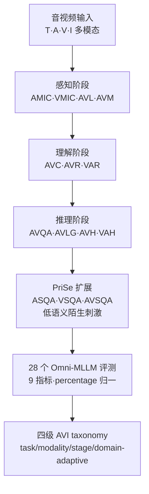

# AVI-Bench: Toward Human-like Audio-Visual Intelligence of Omni-MLLMs

**会议**: ICML2026  
**arXiv**: [2606.07643](https://arxiv.org/abs/2606.07643)  
**代码**: [项目主页](https://fudancvl.github.io/AVI-Bench/)  
**领域**: 多模态VLM / 音视频基准  
**关键词**: 音视频智能, Omni-MLLM, 认知分层基准, 跨模态 grounding, 原始感知

## 一句话总结
AVI-Bench 是一个受人类认知启发的音视频基准：把对 Omni-MLLM 的评测按「感知 → 理解 → 推理」三阶段组织、再补一个测「原始感知」的 PriSe 扩展，用 14 个任务、5,864 个样本、9 个指标系统诊断 28 个开源/闭源 Omni-MLLM 的音视频智能（AVI），并据此提出一个四级 AVI taxonomy。

## 研究背景与动机
**领域现状**：Omni-MLLM（如 GPT-4o、Gemini、Qwen2.5-Omni）能同时处理文本、视觉、音频，被视为迈向类人音视频智能（Audio-Visual Intelligence, AVI）乃至 AGI 的关键一步。要衡量这种进展，就需要严格、结构化的基准。

**现有痛点**：现有基准大多**单模态专精**（MMMU/SEED 管视觉语言、MMAU 管音频语言），无法反映真实跨模态场景；即便是 OmniBench、DailyOmni、AV-Odyssey 这类音视频基准，也只是**堆任务多样性**，缺一个统一、有结构的框架来评估「多层次」的 AVI，导致对模型能力的证据是碎片化的，既难诊断失败模式，也看不清模型与人类音视频认知的对齐程度。更关键的是，**孤立任务上刷高分并不等于通用智能在进步**。

**核心矛盾**：评测需要的是「认知对齐」——像人一样按感知、整合、推理的层次去考模型，而现有基准是平铺的任务集合，既不分层，又普遍忽略两类关键能力：**音视频 grounding**（定位发声物体）和**语言指代的跨模态实体定位**，而这恰恰是检验空间化感知与推理的核心。

**本文目标**：建一个既有广度又有系统性的基准，把任务对齐到人类认知的不同阶段，从而能精细诊断 Omni-MLLM 的能力与失败模式。

**切入角度**：从认知科学的分层视角出发——人类处理音视频是「感知 → 理解 → 推理」逐级递进的；同时追问一个被忽略的基本问题：模型能不能在**陌生、低语义**的刺激下表现出人类轻而易举的「原始感知」（辨色、辨音量、辨纹理），还是只是在拟合训练分布的模式？

**核心 idea**：用认知三阶段（+ 原始感知扩展）重构音视频评测，每个阶段都刻意平衡音频主导、视觉主导与音视频协同任务，并补齐被忽视的 grounding 任务，最终沉淀成一个四级 taxonomy 指导后续研究。

## 方法详解

### 整体框架
AVI-Bench 不是一个模型，而是一套**评测协议 + 数据集 + 分类法**。它把 14 个任务组织进四个阶段：**感知（Perception）→ 理解（Understanding）→ 推理（Reasoning）→ 原始感知（Primitive Sensation, PriSe）**，前三阶段对应人类认知的逐级递进、PriSe 作为测分布外泛化的扩展。每个阶段内部都刻意配平音频主导、视觉主导、音视频协同三类任务，避免某阶段得分被单一模态主导。最终拿 28 个 Omni-MLLM 跑全套任务，把观测结果归纳成一个四级 AVI taxonomy。

### 关键设计

**1. 认知三阶段分层评测：把音视频能力按「感知→理解→推理」逐级拆开**

痛点是现有基准平铺任务、看不出能力层次。AVI-Bench 借人类认知结构把任务分三层：**感知阶段**测对基础语义实体的检测与跨模态对齐，含音/视多实例分类（AMIC/VMIC，单样本里检测多个共现实例）、音视定位（AVL，在画面里定位声源空间位置）、音视匹配（AVM，判断音视输入是否全局对应）；**理解阶段**测对时序/语义依赖的整合，含音视描述（AVC，生成上下文连贯的叙述）和双向跨模态检索（AVR 以音检视、VAR 以视检音）；**推理阶段**测高阶推断，含音视问答（AVQA，粗粒度整体推理）、音视语言 grounding（AVLG，按自然语言精确定位物体/事件）、以及音/视参照幻觉（AVH/VAH，在跨模态冲突下测幻觉抗性）。分层的价值在于：得分不再是一个笼统数字，而能定位模型卡在哪一认知层级。

**2. PriSe 原始感知扩展：用低语义陌生刺激戳穿「模式拟合 vs 真感知」**

大多数 Omni-MLLM 在大规模、富语义数据上训练，但这无法回答它们是否具备人类那种「在几乎没有语义上下文时也能辨色、辨音量、辨纹理、辨几何」的底层感知。PriSe 专门用**朴素、陌生、低语义**的音视频刺激来考三个任务：音频感知问答（ASQA）、视觉感知问答（VSQA，分图像/视频两套）、音视感知问答（AVSQA）。它的设计动机非常具体——把语义捷径抽掉后，模型若仍能答对，说明有接近人类的原始感知；若崩溃，说明此前的高分多半来自训练分布内的模式拟合。这一阶段提供了评估「真 AVI vs 假 AVI」的新视角，也是 2,090 个样本里规模最大的阶段。

**3. 模态配平 + 补齐 grounding 任务：让每阶段得分公平、且覆盖被忽视的空间化能力**

为避免「某阶段分数其实只反映强势模态」，AVI-Bench 在每个阶段都显式配平三类任务：音频主导（AMIC、VAR、AVH、ASQA）、视觉主导（VMIC、AVR、VAH、VSQA）、以及需大量音视协同的任务。同时，它把现有基准普遍忽略的 **grounding 类任务**纳入进来——AVL（声源空间定位）与 AVLG（语言指代的音视实体定位），这两类需要把密集 mask 标注转成归一化宽高的 bounding box（共 708 个样本），是检验空间化感知与精细推理的关键。整套 14 任务里 62% 是**全人工构造**样本（3,657 个），其余通过 mask→bbox 转换（708 个）或把已有数据重整成统一 JSON（1,499 个）得到，兼顾质量与可比性。

### 一个完整示例：一条音视频样本如何走过四阶段诊断
以一段「街头有人弹吉他、旁边有车驶过」的音视频为例：**感知**阶段先问 AMIC/VMIC「画面/声音里有哪些实例」（吉他声、引擎声、人、车），AVL 要求在画面里框出声源（吉他的位置），AVM 判断这段音频是否真的配这段画面；**理解**阶段 AVC 让模型生成连贯叙述、AVR/VAR 做音↔视互检；**推理**阶段 AVQA 问「为什么路人停下脚步」（需整体音视理解），AVLG 要求精确定位「正在发声的那把吉他」，AVH/VAH 故意给音视冲突信号测模型会不会幻觉出不存在的物体；最后 **PriSe** 换成低语义刺激（如纯色块 + 单频音）问 ASQA/VSQA/AVSQA「哪个更亮/更响」。同一条内容被四个层级反复盘问，模型在哪一层掉链子一目了然。

## 实验关键数据

### 主实验
AVI-Bench 评测 **28 个 Omni-MLLM**（含闭源 GPT-4o、Gemini 系列与开源 Qwen2.5-Omni、Ola、Baichuan-Omni-1.5 等，参数从 0.5B 到 7B+），所有任务分数归一到百分制。与现有基准的统计对比凸显其覆盖广度：

| 基准 | 模态 | #任务 | #样本 | #指标 | #阶段 | Grounding |
|------|------|-------|-------|-------|-------|-----------|
| AV-Odyssey | T,A,V,I | 7 | 4,555 | 2 | 1 | ✗ |
| OmniBench | T,A,I | 8 | 1,142 | 1 | 1 | ✗ |
| AVHBench | T,A,V | 4 | 5,302 | 7 | 1 | ✗ |
| **AVI-Bench** | T,A,V,I | **14** | **5,864** | **9** | **4** | **✓** |

代表性模型分阶段得分（节选自原文 Table 3，百分制，越高越好）：

| 模型 | 感知 avg | 理解 avg | 推理 avg | 原始感知 avg | 总 avg |
|------|---------|---------|---------|--------------|--------|
| Gemini-2.5-pro | 54.58 | 68.97 | 69.06 | 36.22 | 57.21 |

> ⚠️ 完整 28 模型榜单与各子任务（AMIC/VMIC/AVL/AVM/VAR/AVR/AVC/AVH/VAH/AVQA/AVLG/ASQA/VSQA/AVSQA）细分以原文 Table 3 为准；此处仅取最强模型示意量级。

### 阶段样本分布
四阶段任务与样本数刻意做了模态平衡，PriSe 规模最大：

| 阶段 | 任务（样本数） | 阶段合计 |
|------|----------------|----------|
| 感知 | AMIC(518)·VMIC(521)·AVL(205)·AVM(250) | 1,494 |
| 理解 | VAR(264)·AVR(264)·AVC(280) | 808 |
| 推理 | AVH(250)·VAH(250)·AVQA(469)·AVLG(503) | 1,472 |
| 原始感知 | ASQA(502)·VSQA-img(620)·VSQA-vid(580)·AVSQA(388) | 2,090 |

### 关键发现
- **原始感知是普遍短板**：即便最强的 Gemini-2.5-pro，PriSe 阶段平均分也只有 36.22，远低于其感知/理解/推理三阶段（54~69），印证了「高分多来自富语义训练分布、低语义陌生刺激下接近崩溃」的猜想。
- **grounding 是被现有基准漏掉的硬骨头**：AVL/AVLG 这类需要空间定位的任务，是当前 Omni-MLLM 的明显弱项，也是 AVI-Bench 相比同类基准的独特贡献。
- **分层诊断能定位失败模式**：把得分拆到认知阶段后，能看清模型是卡在感知、理解还是推理，而非只给一个笼统总分。

## 亮点与洞察
- **认知分层 + 模态配平的双重约束很扎实**：既保证评测顺人类认知层级展开、又防止单模态强势刷分，得到的阶段分数比平铺基准更可解释。
- **PriSe「抽掉语义看真感知」的设问角度新颖**：用低语义刺激把「模式拟合」和「真感知」分离，是检验 AVI 真伪的好探针，可迁移到其他多模态能力的「去捷径」评测。
- **把 grounding 纳入音视频评测**填补了空间化感知/推理的评测空白，mask→bbox 的统一标注方式也便于复用。
- **四级 taxonomy**（task/modality/stage/domain-adaptive 四个适配维度）为后续 Omni-MLLM 的能力诊断提供了结构化坐标系。

## 局限与展望
- **作为基准无法给出改进方法**：AVI-Bench 诊断出短板（尤其原始感知与 grounding），但不提供如何补齐这些能力的训练方案。
- **样本规模相对中等**：5,864 个样本在覆盖 14 任务后，单任务样本量（如 AVL 仅 205）偏少，统计稳健性受限。
- **指标依赖**：开放式任务（AVC、部分 QA）的评分依赖自动指标/裁判，可能与人类判断有偏差，论文未深入讨论评分一致性。

## 相关工作与启发
- **vs OmniBench / DailyOmni / AV-Odyssey**：它们扩展了任务/域/模态多样性但只有单一「阶段」、缺统一结构；AVI-Bench 用认知四阶段组织、补 grounding、加 PriSe，把碎片化证据整合成可诊断的能力图谱。
- **vs AVHBench / AVTrustBench（幻觉类基准）**：它们专注幻觉现象；AVI-Bench 把幻觉（AVH/VAH）只当推理阶段的一个子维度，置于更完整的感知→推理框架里。
- **vs MMMU / SEED / MMAU（单模态基准）**：那些只评视觉语言或音频语言；AVI-Bench 强调音视联合处理与跨模态协同，更贴近真实人类感知。

## 评分
- 新颖性: ⭐⭐⭐⭐ 认知分层 + PriSe 原始感知探针 + grounding 纳入，在音视频基准里有明确结构创新。
- 实验充分度: ⭐⭐⭐⭐ 28 个开源/闭源模型 × 14 任务 × 9 指标，横向覆盖充分。
- 写作质量: ⭐⭐⭐⭐ 动机与阶段定义清晰，认知映射讲得明白。
- 价值: ⭐⭐⭐⭐ 为 Omni-MLLM 的能力诊断提供了结构化、可对齐人类认知的评测框架，社区价值高。

<!-- RELATED:START -->

## 相关论文

- [\[CVPR 2026\] HAVE-Bench: Hierarchical Audio-Visual Evaluation from Perception to Interaction](../../CVPR2026/multimodal_vlm/have-bench_hierarchical_audio-visual_evaluation_from_perception_to_interaction.md)
- [\[CVPR 2026\] A More Word-like Image Tokenization for MLLMs](../../CVPR2026/multimodal_vlm/a_more_word-like_image_tokenization_for_mllms.md)
- [\[ICLR 2026\] On the Generalization Capacities of MLLMs for Spatial Intelligence](../../ICLR2026/multimodal_vlm/on_the_generalization_capacities_of_mllms_for_spatial_intelligence.md)
- [\[AAAI 2026\] When Eyes and Ears Disagree: Can MLLMs Discern Audio-Visual Confusion?](../../AAAI2026/multimodal_vlm/when_eyes_and_ears_disagree_can_mllms_discern_audio-visual_confusion.md)
- [\[CVPR 2026\] EgoAVU: Egocentric Audio-Visual Understanding](../../CVPR2026/multimodal_vlm/egoavu_egocentric_audio-visual_understanding.md)

<!-- RELATED:END -->
