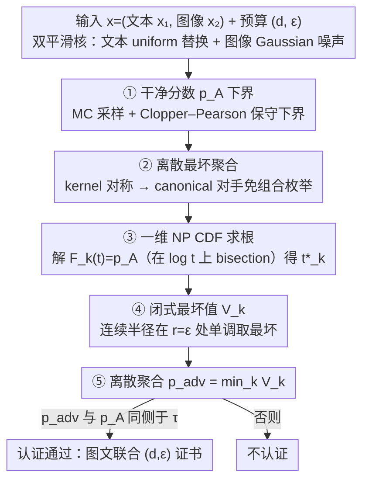

# Certified Robustness under Heterogeneous Perturbations via Hybrid Randomized Smoothing

**会议**: ICML 2026  
**arXiv**: [2605.12876](https://arxiv.org/abs/2605.12876)  
**代码**: 论文未明确公开  
**领域**: 多模态 VLM / 对抗鲁棒 / Certified Robustness  
**关键词**: Randomized Smoothing、Neyman–Pearson、多模态安全过滤、混合扰动认证、prompt injection

## 一句话总结
本文把随机平滑（RS）从"只支持单一连续或离散输入"扩展到"离散 token + 连续图像"的混合扰动场景，通过一个混合 Neyman–Pearson 分析得到一个**一维、连续、可逆**的似然比 CDF，从而把原本组合爆炸的离散 knapsack 问题变成可解的根求解问题，并在 LLaVA-Guard 多模态安全过滤上给出首个针对"图文联合不安全"的 model-agnostic 证书。

## 研究背景与动机
**领域现状**：Randomized Smoothing 是当前最主流的 model-agnostic 鲁棒性认证方法：连续侧（Cohen 2019）有 Gaussian 的闭式 $\ell_2$ 证书；离散侧（Ye 2020、Chen 2025）需要 fractional knapsack 求最坏似然比；二者各自成体系。

**现有痛点**：现代多模态系统（VLM、agent、机器人安全）的攻击是**跨模态的**——单看图安全、单看文本也安全，但图文组合却不安全（典型如 Hateful Memes、prompt injection）。把单模态证书简单拼起来在数学上是错的，没有一个统一的联合似然比框架。

**核心矛盾**：纯离散似然比是原子的（atomic），导致 NP 决策规则不可逆，无法给出闭式半径；纯 Gaussian NP 又只支持连续输入；两者乘起来的联合 NP 最优拒绝域本质上不是"两个单模态阈值的笛卡尔积"（Prop. 4.1 反例直接证伪）。

**本文目标**：(i) 给出离散 + 连续混合扰动下严格的 NP 闭式证书；(ii) 提供 monotone、保守的工程化算法；(iii) 在交互级不安全的多模态安全过滤任务上验证证书的实用性。

**切入角度**：观察到只要联合似然比 $\gamma(z_1,z_2)=\gamma_1(z_1)\cdot\gamma_2(z_2)$ 里包含一个 Gaussian 因子，$\log\gamma$ 在连续坐标上是严格单调的——这相当于"连续噪声把离散似然比的原子结构抹平"，使联合 NP 问题塌缩到一维。

**核心 idea**：用连续 Gaussian 平滑作为"正则化器"把离散 knapsack 问题熔成连续的、可逆的一维 CDF $F(t;r)$，再通过一维 bisection 求解 NP 阈值 $t^\star(r)$，并对离散攻击空间取最坏聚合。

## 方法详解

### 整体框架
输入 $x=(x_1,x_2)$（文本 + 图像），用两个独立平滑核：文本 $Z_1\sim p_1(\cdot\mid x_1)$（uniform/absorbing 替换），图像 $Z_2\sim\mathcal{N}(x_2,\sigma^2 I)$。基分类器 $f$ 通过 $g(x)=\mathbb{E}[f(Z_1,Z_2)]$ 平滑成 smoothed classifier。给定联合扰动预算 $(d,\epsilon)$（$\ell_0$ + $\ell_2$），定义混合 worst-case 概率 $p_{\mathrm{adv}}(d,\epsilon)$。整体算法：① Monte Carlo 估计干净 $p_A$ 的 Clopper-Pearson 下界 → ② 利用 kernel symmetry 枚举/分析最坏离散对手 → ③ 对每个候选 $x_{1,\mathrm{adv}}$ 求一维 NP 阈值 $t^\star$ → ④ 算 $V_k$ → ⑤ 取最小作为最终保守认证值。

### 关键设计

**1. 联合似然比的一维 CDF $F(t;r)$：把混合 NP 的容量约束塌成单变量连续函数**

纯离散 NP 的麻烦在于似然比是原子化的，阈值规则没法刚好匹配 $p_A$，需要 fractional 分配，本质是个组合搜索 + fractional knapsack。这里的关键观察是联合 $\log\gamma(z_1,z_2)=\log\gamma_1(z_1)+rz_2-r^2/2$ 可加分解，对连续维度 $z_2$ 取 Gaussian 期望，离散的原子结构就被连续噪声"抹平"成连续标量。于是容量约束写成 $F(t;r)=\sum_{z_1} p_1(z_1\mid x_1)\,\Phi\!\big(\tfrac{r^2/2+\sigma^2(\log t-\log\gamma_1(z_1))}{\sigma r}\big)$（$\Phi$ 是标准 Gaussian CDF，$r$ 是连续扰动半径），它关于 $t$ 严格单增，因此对每个 $r>0$ 存在唯一 $t^\star(r)$ 使 $F(t^\star;r)=p_A$。原本的"组合搜索 + fractional knapsack"就塌成"对 $u=\log t$ 做 bisection"，CPU 上一秒内解出。

**2. 闭式最坏概率 $V$ + $r=\epsilon$ 单调性：把双层 inf 折叠成"枚举离散 + 解一维方程"**

给定离散对手 $x_{1,\mathrm{adv}}$ 和连续半径 $r$，worst-case smoothed value 有闭式 $V(x_{1,\mathrm{adv}};r)=\sum_{z_1} p_1(z_1\mid x_{1,\mathrm{adv}})\,\Phi\!\big(\tfrac{r^2/2+\sigma^2(\log t^\star(r)-\log\gamma_1(z_1))}{\sigma r}-\tfrac{r}{\sigma}\big)$，并可证 $V$ 关于 $r$ 单调不增，所以连续 worst-case 自动取在 $r=\epsilon$，最终 $p_{\mathrm{adv}}(d,\epsilon)=\min_{D_1(x_1,x_{1,\mathrm{adv}})\le d}V(x_{1,\mathrm{adv}};\epsilon)$。这一步把"对所有 $(x_{1,\mathrm{adv}},x_{2,\mathrm{adv}})$ 取最小"的双层 inf，用单调性折叠成"只对离散攻击枚举 + 解一维方程"，完全不用在 $\mathbb{R}^D$ 连续空间里真搜索；单调性同时给出 monotone in $d$ 的认证不变量，方便制图。

**3. 结构对称的离散 kernel + 一维根求解的保守化实现：让整套算法只比图像-only RS 多约 3 倍时间**

原始 NP 公式涉及 $O(|\mathcal{V}|^d)$ 的离散组合空间，是能否实用的关键瓶颈。这里靠 kernel symmetry 绕开：suffix attack 或 $\ell_0$ attack 下，uniform/absorbing kernel 的 $p_1(\cdot\mid x_{1,\mathrm{adv}})$ 只依赖编辑预算 $d$ 而非具体 token 身份，于是可以用一个 canonical adversarial input 代表整个攻击集合，"对所有离散对手取最坏"就不需要组合枚举。NP 阈值用 monotone bisection 在 $u=\log t$ 上解，clean $p_A$ 用单边 Clopper-Pearson 取保守下界，浮点误差由 Appendix A.7 的数值精度策略压住。作者还特意选 uniform kernel 而非 absorbing——后者在 suffix attack 下退化为两点分布、$\beta^d$ 指数衰减——保证证书既保守又非平凡。

### 损失函数 / 训练策略
这是一个**纯认证算法**，不训练 base classifier，直接套在已有的 LLaVA-Guard、linear SVM 等 frozen 模型上。超参 $\alpha=0.01$（CP 风险）、$n=10^4$（MC 样本数）、$\beta=0.25$（token 替换概率）、$\sigma\in\{0.5,1.0\}$（Gaussian 方差），认证阈值 $\tau=4.6\times 10^{-5}$ 沿用 Chen 2025a。

## 实验关键数据

### 主实验

| Method | Image radius $\bar{r}$ | Text budget $\bar{d}$ |
|--------|----------------------|---------------------|
| Image-only RS | 3.99 | 0 |
| Text-only RS | 0 | 3.26 |
| **Hybrid RS (ours)** | **3.76**（at $d=1$） | **3.07** |

Hybrid 证书在文本预算 $d=1$ 时图像半径只比纯图像证书低 5.8%，文本预算只比纯文本证书低 5.8%，但**同时**给出图文联合保证——而单模态证书在 interaction-only 数据集上是 unsound 的。MM-SafetyBench 外部验证（1680 样本，7.5% 通过 interaction-only filter）上拿到 $\bar{d}=3.62$ / $\bar{r}=3.37$。

### 消融实验

| $\beta$ (corruption rate) | Certified examples (%) | Mean $d_{\max}$ | Mean $r^\star(d_{\max})$ |
|--------------------------|-----------------------|-----------------|--------------------------|
| 0.1 | 82.35 | 2.29 | 4.99 |
| **0.25** | **70.59** | **3.07** | **3.21** |
| 0.5 | 58.82 | 4.00 | 3.24 |
| 1.0 | 41.18 | 8.00 | 4.57 |

| Setting | Time/datapoint | 效果 |
|---------|---------------|------|
| Image-only RS | ≈156s | 单图像半径 |
| Hybrid RS, default | ≈500s | 完整 $(d,\epsilon)$ frontier |
| Hybrid RS + FlashAttention/batching | ≈0.7× | 同证书 |
| One-shot suffix / $\ell_0$, $d_{\max}=8$ | ≈44s | 半径稍降 (2.07→1.55) |

### 关键发现
- $\beta$ 控制 coverage-budget 折中：小 $\beta$ 认证更多样本但只到小 $d$，大 $\beta$ 拓宽文本预算但覆盖率下降，$\beta=0.25$ 是默认平衡点。
- 增大 Gaussian 方差 $\sigma$（0.5→1.0）会牺牲小 $\epsilon$ 下的认证精度，但能把可认证的图像半径上限拉大；对 $d>3$ 的高文本预算 $\sigma=1.0$ 几乎认证失败。
- 自适应攻击实验（Sec 5.3）显示真实经验攻击成功率与理论 $p_{\mathrm{adv}}$ bound 留有差距，证书并不空洞；MMCert-style subsampling 在 interaction-only 数据上**零认证**，进一步说明任务对联合 NP 证书的刚需。

## 亮点与洞察
- **"连续平滑正则化离散 knapsack"是核心 insight**：Gaussian 噪声不仅给 $\ell_2$ 半径，还把离散似然比的原子 ties 抹平，让原本不可逆的 NP 决策规则变成一维可逆 CDF——$\sigma$ 在这里身兼"连续半径控制器 + 离散正则化器"两个角色。
- **联合证书严格泛化两个特例**：$x_{1,\mathrm{adv}}=x_1$ 时退化为经典 Cohen 高斯证书；$\sigma\to\infty$ 时退化为 fractional knapsack 离散证书（Appendix A.3）；这种"无损泛化"在多模态认证文献里很罕见。
- **interaction-only evaluation 设计很到位**：作者在 Hateful Memes 上构造"图安全 + 文本安全但组合不安全"的 400 样本子集，把"单模态证书 unsound"这一定性论断变成了可测的实验事实——单 MMCert 在该子集零认证给出了强对照。

## 局限与展望
- 只支持 binary（safe/unsafe）输出和 $\ell_2$ + $\ell_0$ 两种几何，对多分类、$\ell_\infty$ 或语义级扰动还需重做 NP 分析。
- 文本侧用 uniform kernel（避开 absorbing 的指数退化），但 uniform 替换会显著破坏语义，对长 prompt 的 clean accuracy 损失较大（Appendix A.9 Table 5）。
- 离散 budget 较大（$d\ge 5$ 在 $\sigma=1.0$ 下）时几乎无认证，遇到真实 long-suffix prompt injection 仍乏力；$\bar{d}_{\mathrm{hybrid}}=0.33$ 在 $\ell_0$ 攻击下大幅低于 $\bar{d}_{\mathrm{txt}}=1.02$，提示混合证书在 $\ell_0$ 场景下偏保守。
- 单认证耗时 500s（$10^4$ MC），离线可接受但难以实时部署；作者展望 confidence sequence early stopping + input-adaptive sampling。

## 相关工作与启发
- **vs Cohen 2019 / Salman 2019 (Gaussian RS)**：本文严格泛化其连续证书，当无离散扰动时完全复现 $\Phi^{-1}(p_A)-\Phi^{-1}(\tau)$ 公式。
- **vs Chen 2025a (fractional knapsack for LLM safety)**：他们只解纯离散侧 NP 通过 0-1/fractional knapsack solver；本文证明"加上 Gaussian 后 knapsack 塌成一维方程"，把组合复杂度降到 $O(\log\epsilon^{-1})$。
- **vs MMCert (Wang 2024)**：MMCert 用独立 subsampling 各模态再聚合，本质是 $\ell_0$-跨模态阈值；其在 interaction-only 数据上认证为 0，反衬本文 joint NP 框架的不可替代性。
- **vs COMMIT / CertTA**：这些 ad-hoc 多传感器/网络认证不基于经典 NP 分析；本文给出 first principled joint Neyman-Pearson certificate for heterogeneous discrete-continuous threat。

## 评分
- 新颖性: ⭐⭐⭐⭐⭐ 首次给出离散 + 连续混合扰动的闭式联合 NP 证书，把组合 knapsack 塌成一维方程的洞察非常漂亮。
- 实验充分度: ⭐⭐⭐⭐ 涵盖表格数据 + 多模态安全 + 经验攻击 + 外部 benchmark + 多 $\beta/\sigma$ 消融，可改进的是更大 $d$ 和更多 base model 的覆盖。
- 写作质量: ⭐⭐⭐⭐ 定理、命题、反例严谨且自洽，明确点出每个 limitation（absorbing degeneracy、numerical safety），结构清晰。
- 价值: ⭐⭐⭐⭐ 给多模态安全过滤、prompt injection 提供了第一个理论严格的 model-agnostic 证书，对高 stakes 部署（医疗 VLM、机器人）有直接意义。

<!-- RELATED:START -->

## 相关论文

- [\[ICML 2026\] Smoothing Slot Attention Iterations and Recurrences](smoothing_slot_attention_iterations_and_recurrences.md)
- [\[ICLR 2026\] Directional Embedding Smoothing for Robust Vision Language Models](../../ICLR2026/multimodal_vlm/directional_embedding_smoothing_for_robust_vision_language_models.md)
- [\[ICML 2026\] Hierarchical Synthetic Tabular Data Generation: A Hybrid Top-Down and Bottom-Up Framework](hierarchical_synthetic_tabular_data_generation_a_hybrid_top-down_and_bottom-up_f.md)
- [\[ICML 2026\] Any3D-VLA: Enhancing VLA Robustness via Diverse Point Clouds](any3d-vla_enhancing_vla_robustness_via_diverse_point_clouds.md)
- [\[ICLR 2026\] ICYM2I: The Illusion of Multimodal Informativeness under Missingness](../../ICLR2026/multimodal_vlm/icym2i_the_illusion_of_multimodal_informativeness_under_missingness.md)

<!-- RELATED:END -->
