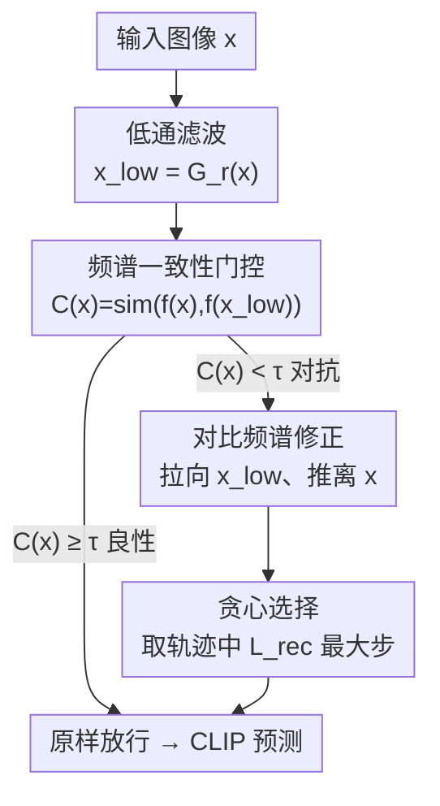

# Contrastive Spectral Rectification: Test-Time Defense towards Zero-shot Adversarial Robustness of CLIP

**会议**: ICML2026  
**arXiv**: [2601.19210](https://arxiv.org/abs/2601.19210)  
**代码**: https://github.com/Summu77/CSR  
**领域**: 多模态VLM / 对抗鲁棒性  
**关键词**: CLIP、对抗样本、测试时防御、频域、对比学习  

## 一句话总结
作者发现对抗样本的特征在「逐步抹掉中高频」时会急剧崩塌（而干净样本不会），据此提出测试时防御 CSR：先用「过滤前后特征是否一致」当门控检测对抗样本，再用一个「拉向低通锚点、推离原始对抗特征」的对比目标在输入上优化一个修正扰动，把图像拽回自然流形；在 16 个分类基准上对强攻击 APGD 平均提升 18.1%，且推理开销很小。

## 研究背景与动机
**领域现状**：CLIP 这类视觉-语言模型靠跨模态对比学习获得了惊人的零样本泛化能力，但对人眼不可见的对抗扰动极其脆弱，一点噪声就能让分类彻底翻车，这在安全攸关的开放场景里是硬伤。

**现有痛点**：现有两条防线都不够好。对抗微调（如 TeCoA、FARE）要在大模型上重训，代价高昂，而且严重拉低干净样本上的性能；测试时防御（如 TTC）虽然不用重训，但在更强的 AutoAttack 下几乎失效，推理延迟也大，很多方法还只针对特定任务，迁不到分割、图像描述、VQA 等更广的视觉任务上。

**核心矛盾**：要同时做到「对强攻击有效 + 推理高效 + 跨任务通用」，三者很难兼得。前人试过给对抗样本加随机噪声来「打散」它，但没能验证对抗扰动天生脆弱这一直觉。

**切入角度**：作者换到频域看问题。用逐步缩小带宽半径 $r$ 的低通滤波，观察滤波前后 CLIP 特征的余弦相似度变化——结果发现干净样本（含加了高斯噪声的）在抹掉中高频后特征几乎不变，而对抗样本的特征则急剧坍塌，即便在 $\ell_\infty=1/255$ 这种极小预算下也如此，且对各种攻击都成立。

**核心 idea**：作者把这种脆弱归因于 CLIP 的「频谱偏置」——模型把过多预测权重压在中高频这类非鲁棒特征上，而攻击者正是顺着这些高梯度的中高频「捷径」做扰动。既然对抗信号寄生在中高频且对滤波极敏感，就用「频谱一致性」来检测、用「对比频谱修正」来净化，做一个不用重训、即插即用的测试时防御 CSR。

## 方法详解

### 整体框架
CSR 是一个套在 CLIP 推理前的、逐样本自适应的净化模块：输入一张可能被攻击的图像 $\boldsymbol{x}$，输出一张「可靠」的修正图像 $\boldsymbol{x}^*$ 再交给原始 CLIP 做零样本预测，全程冻结模型参数、不重训。流程分两段：先用一次低通滤波算出「过滤前后特征是否一致」的分数 $\mathcal{C}(\boldsymbol{x})$ 做门控——一致就判为良性、原样放行（省算力）；不一致就判为对抗，进入第二段，用一个对比目标在输入上跑几步 PGD，优化出一个修正扰动 $\boldsymbol{\delta}$，把特征「拉向」低通锚点、「推离」原始对抗特征，并用贪心选择在优化轨迹里挑出目标值最大的那一步作为最终输出。

### 关键设计

**1. 频谱一致性门控：用「过滤前后特征一不一致」零成本筛出对抗样本**

这一步针对「逐样本盲目修正会拖慢推理、还会误伤良性样本」的痛点。作者用半径为 $r$ 的高斯低通滤波 $G_r(\cdot)$ 把中高频压掉得到平滑版 $\boldsymbol{x}_{low}=G_r(\boldsymbol{x})$，再算原图与平滑版的特征余弦相似度作为一致性分数：

$$\mathcal{C}(\boldsymbol{x})=\text{sim}(f(\boldsymbol{x}),f(\boldsymbol{x}_{low}))=\frac{f(\boldsymbol{x})^{\top}f(\boldsymbol{x}_{low})}{\|f(\boldsymbol{x})\|_2\,\|f(\boldsymbol{x}_{low})\|_2}.$$

良性样本的语义牢牢锚在低频，抹掉中高频后特征几乎不动，$\mathcal{C}(\boldsymbol{x})$ 高；对抗样本依赖脆弱的中高频，一滤波就特征坍塌，$\mathcal{C}(\boldsymbol{x})$ 低。于是当 $\mathcal{C}(\boldsymbol{x})<\tau$ 才判为对抗、触发后续修正，$\tau$ 是平衡检测灵敏度与误报率的阈值。这个门控只需一次额外前向，就让大多数良性样本走「快车道」，是 CSR「高效」的关键。

**2. 对比频谱修正：拉向低频锚点、推离对抗原点，把图像拽回自然流形**

这一步针对「直接用低通滤波结果会过度平滑、抹掉零样本识别必需的细粒度细节」的痛点。CSR 不被动丢弃中高频，而是冻结模型、在输入上主动优化一个修正扰动 $\boldsymbol{\delta}$，得到 $\boldsymbol{x}'=\boldsymbol{x}+\boldsymbol{\delta}$，优化目标是一个对比损失：

$$\mathcal{L}_{rec}(\boldsymbol{\delta})=\underbrace{\text{sim}(f(\boldsymbol{x}+\boldsymbol{\delta}),f(\boldsymbol{x}_{low}))}_{\text{吸引项}}-\lambda\cdot\underbrace{\text{sim}(f(\boldsymbol{x}+\boldsymbol{\delta}),f(\boldsymbol{x}))}_{\text{排斥项}}.$$

吸引项把低频特征 $f(\boldsymbol{x}_{low})$ 当作位于良性流形上的语义锚点，把优化轨迹往鲁棒的自然流形拉回；排斥项把样本从最初的恶意对抗特征 $f(\boldsymbol{x})$ 推开，防止优化卡在对抗子空间里出不来。两项合力把特征朝真值方向修正——这正是相比 TTC 的关键区别：TTC 只「逃离对抗子空间」却没有良性引导，容易把自然语义也带歪，而 CSR 用低频锚点提供了「往哪走」的方向。求解用投影梯度下降跑有限的 $N$ 步，$\lambda$ 权衡吸引与排斥。

**3. 贪心选择：在非凸轨迹里挑「最可靠」的一步而非最后一步**

这一步针对「PGD 在非凸流形上优化会震荡、最后一步未必最好」的痛点。作者在优化过程中逐步监控 $\mathcal{L}_{rec}$，始终保留目标值最大的候选：

$$\boldsymbol{x}^*=\boldsymbol{x}+\underset{\boldsymbol{\delta}_t\in\{\boldsymbol{\delta}_1,\dots,\boldsymbol{\delta}_N\}}{\arg\max}\mathcal{L}_{rec}(\boldsymbol{\delta}_t).$$

这样返回的样本对应「频谱一致性最高、且离对抗状态最远」的状态，给最终推理一个稳定可靠的输入，避免被某一步的震荡毁掉。

### 损失函数 / 训练策略
CSR 完全在测试时进行、不更新任何模型参数，唯一被优化的是输入上的修正扰动 $\boldsymbol{\delta}$，约束在预算 $\epsilon$ 内、步长 $\alpha$、共 $N$ 步。整套超参为：低通半径 $r$、检测阈值 $\tau$、对比权重 $\lambda$、扰动预算 $\epsilon$、步数 $N$、步长 $\alpha$。门控让良性样本只付一次前向的代价，对抗样本才付 $N$ 步优化，因此平均开销很小。

## 实验关键数据

### 主实验
在 16 个零样本分类基准（分 General / Fine-Grained / Scene / Domain 四组）上评测，攻击含标准 PGD（$\epsilon=1/255$）与更强的 AutoAttack/APGD（$\epsilon=4/255$）。CSR 在保住干净精度的同时大幅提升鲁棒精度，对强攻击平均比 SOTA 高 18.1%。

| 数据集 | CLIP 干净/鲁棒 | CSR 干净/鲁棒 | Δ鲁棒 |
|--------|---------------|---------------|-------|
| ImageNet | 63.9 / 0.0 | 62.5 / 58.9 | +58.9 |
| CIFAR10 | 88.1 / 0.5 | 87.2 / 75.0 | +74.5 |
| STL10 | 97.5 / 4.8 | 97.2 / 87.5 | +82.7 |
| SUN397 | 63.6 / 0.2 | 63.0 / 66.3 | +66.1 |
| FGVCAircraft | 23.1 / 0.0 | 22.7 / 31.2 | +31.2 |

（注：上表为 10 步 PGD $\ell_\infty=1/255$ 下的 Top-1 精度；原始 CLIP 在攻击下鲁棒精度几乎归零，CSR 把它拉回到接近甚至超过干净精度。）

### 防御方法对比

| 类别 | 代表方法 | 痛点 |
|------|---------|------|
| 对抗微调 | TeCoA / FARE | 需重训、干净精度掉得多 |
| 测试时·文本 | R-TPT / TAPT | 强攻击下增益有限 |
| 测试时·视觉净化 | TTC | 只逃离对抗子空间、无良性引导，易歪曲语义 |
| 本文 | CSR | 频谱门控 + 对比修正，强攻击 +18.1%、开销小、跨任务通用 |

### 关键发现
- 「频谱一致性」是对抗样本的强判别信号：干净样本（含高斯噪声）在抹中高频后特征稳定，对抗样本则在 $\ell_\infty=1/255$ 就急剧坍塌，这是门控能零成本筛对抗的根基。
- CLIP 的脆弱来自「频谱偏置 + 中高频超敏」：梯度幅值集中在中高频（式 3 的 SGM 热图），限制在低频的攻击需要 $\ell_\infty=16/255$ 才能匹敌高频 $\ell_\infty=2/255$ 的破坏力，且会产生肉眼可见的波纹伪影。
- 良性引导是关键：相比只做排斥的 TTC，CSR 的吸引项（低频锚点）提供了「往哪修」的方向，对强攻击的增益尤其明显。
- 通用性：CSR 不止用于分类，还迁到语义分割、图像描述、VQA 等任务上仍然有效。

## 亮点与洞察
- 「对抗样本对低通滤波极脆弱」这个观察既是检测器又是修正方向的来源——一个频域现象同时撑起了门控和净化两步，设计非常省。
- 把净化写成「吸引-排斥」对比目标，巧妙地用图像自己的低频版本当良性锚点，无需任何外部干净参照或扩散先验就能给出「往哪走」的监督信号。
- 输入自适应门控是可复用的工程 trick：任何「良性样本对某种退化稳定、异常样本不稳定」的场景，都能用「退化前后一致性」做廉价的快/慢车道分流。
- 贪心选择提醒人们：测试时优化在非凸流形上会震荡，盯着目标值留最优步比直接取末步更稳。

## 局限与展望
- 门控阈值 $\tau$ 要在检测灵敏度与误报率之间权衡，过低会漏检强攻击、过高会误伤良性样本拖慢推理，跨数据集是否需要重新校准值得关注。
- 低通半径 $r$、对比权重 $\lambda$、步数 $N$ 等超参直接决定净化质量，论文主表固定一套设置，对更大扰动预算或自适应攻击（针对 CSR 目标本身做攻击）的鲁棒性需进一步验证。
- 方法建立在「CLIP 频谱偏置中高频」这一前提上，对频谱特性不同的其他骨干/架构是否成立，作者称在大规模 VLM 上一致，但仍属经验观察。
- 对抗样本虽走快车道无额外优化，但仍需一次低通前向做门控，纯良性流量下也有常数开销。

## 相关工作与启发
- **vs FARE（对抗微调）**：FARE 重训模型换鲁棒，代价高且干净精度掉得多；CSR 不动参数、测试时净化，干净精度几乎不掉。
- **vs TTC（测试时净化）**：二者最接近，但 TTC 只把样本推离对抗子空间、无良性引导，容易扭曲自然语义、强攻击下崩塌；CSR 加了低频锚点的吸引项给出修正方向，对 APGD 增益显著。
- **vs CLIPure（扩散先验净化）**：CLIPure 靠扩散模型做先验、推理重；CSR 只用 CLIP 自身的低频特征当锚点，无需额外生成模型，更轻量。

## 评分
- 新颖性: ⭐⭐⭐⭐⭐ 「对抗样本频谱脆弱性」的观察既新且把检测与净化统一在一个频域框架里。
- 实验充分度: ⭐⭐⭐⭐ 16 个分类基准 + 多任务泛化 + 多种攻击，但对自适应攻击的评测可再补强。
- 写作质量: ⭐⭐⭐⭐⭐ 从现象观察到机制分析再到方法推导，逻辑链条清晰。
- 价值: ⭐⭐⭐⭐⭐ 即插即用、不重训、跨任务，对部署 CLIP 的安全场景实用价值高。

<!-- RELATED:START -->

## 相关论文

- [\[CVPR 2026\] AGFT: Alignment-Guided Fine-Tuning for Zero-Shot Adversarial Robustness of Vision-Language Models](../../CVPR2026/multimodal_vlm/agft_alignment-guided_fine-tuning_for_zero-shot_adversarial_robustness_of_vision.md)
- [\[NeurIPS 2025\] TOMCAT: Test-time Comprehensive Knowledge Accumulation for Compositional Zero-Shot Learning](../../NeurIPS2025/multimodal_vlm/tomcat_test-time_comprehensive_knowledge_accumulation_for_compositional_zero-sho.md)
- [\[NeurIPS 2025\] Test-Time Spectrum-Aware Latent Steering for Zero-Shot Generalization in Vision-Language Models](../../NeurIPS2025/multimodal_vlm/test-time_spectrum-aware_latent_steering_for_zero-shot_generalization_in_vision-.md)
- [\[CVPR 2026\] Multi-Hierarchical Contrastive Spectral Fusion for Multi-View Clustering](../../CVPR2026/multimodal_vlm/multi-hierarchical_contrastive_spectral_fusion_for_multi-view_clustering.md)
- [\[ICML 2026\] Density-Aware Translation of Spurious Correlations in Zero-Shot VLMs](density-aware_translation_of_spurious_correlations_in_zero-shot_vlms.md)

<!-- RELATED:END -->
