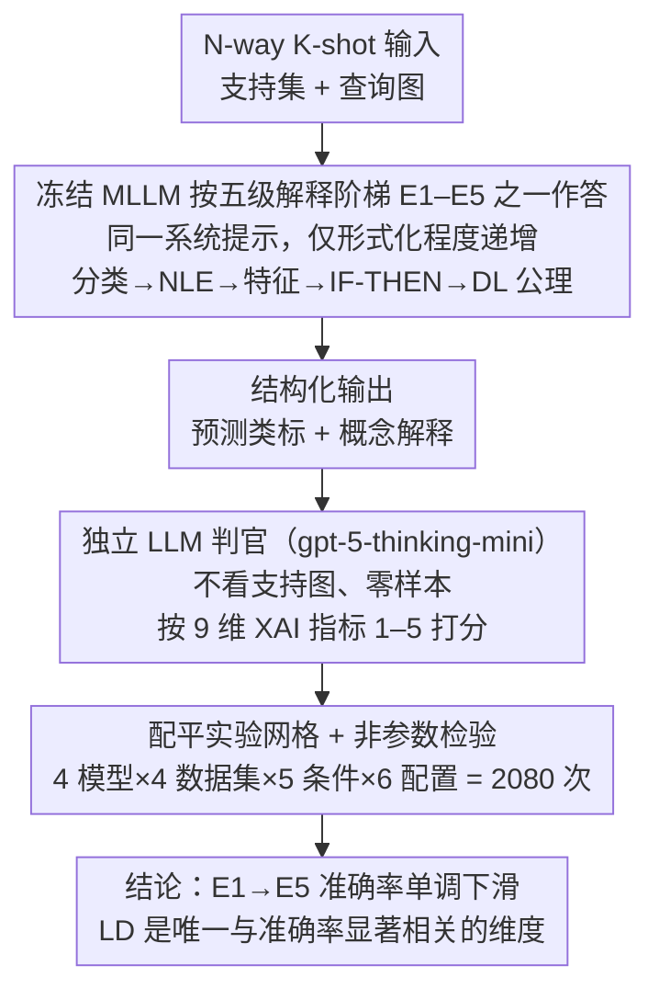

# Explaining Is Harder than Predicting Alone: Evaluating Concept-Based Explanations of MLLMs as ICL Visual Classifiers

**会议**: ICML 2026  
**arXiv**: [2605.28215](https://arxiv.org/abs/2605.28215)  
**代码**: 待确认  
**领域**: 可解释性 / 多模态VLM / In-Context Learning  
**关键词**: 概念解释, 描述逻辑, LLM-as-a-judge, 少样本 ICL, XAI 评测

## 一句话总结
作者用 5 级形式化逐步加严的解释条件（裸分类 → 自然语言解释 → 特征清单 → IF-THEN 知识库 → DL 公理）和一个评 9 个 XAI 指标的 LLM-as-a-judge 流水线，对 4 个 SOTA MLLM 做了 2,080 次 ICL 分类实验，发现"逼模型生成越正式的概念解释，分类准确率反而单调下滑（93.8% → 90.1%）"，但"局部判别性"是唯一与准确率显著相关的解释质量维度。

## 研究背景与动机

**领域现状**：MLLM 配合少样本 In-Context Learning（ICL）可以在不更新权重的情况下做图像分类。主流"解释"手段是 Chain-of-Thought（CoT）提示，让模型自述推理步骤。

**现有痛点**：(1) CoT 文本不等于真实内部推理——Barez et al. (2025) 证明 CoT 轨迹未必反映内部计算，Turpin et al. (2023) 指出模型常给"好听但误导"的事后理由。(2) ICL 文献几乎只看分类准确率，对解释质量没有形式化、可机器验证的评测。(3) 神经符号路径（logic-explained networks 等）依赖监督训练，没法测"冻结的 MLLM 自身能否产生符号化解释"。

**核心矛盾**：解释的"自然语言流畅度"和"概念可验证性"是两件事——后者才是 XAI 真正需要的，但前者占据了几乎所有当前评测。

**本文目标**：在控制良好的少样本图像分类 setting 下，系统回答两个问题：(1) 冻结的 MLLM 能否按概念化、形式化要求自发产出解释？(2) 解释要求会不会反过来损害分类本身？

**切入角度**：用图像分类作为"概念锚定"——视觉特征可以直接对照查询图核验真伪，把"概念"从语言抽象拉回可视证据。把解释要求设计成"五级形式化阶梯"，能在同一套数据上隔离"复杂度逐级加码"带来的边际影响。

**核心 idea**：把"概念解释"重新形式化为 Description Logics 公理这类机器可验证的产物，再用独立判官 + 9 维 XAI 指标量化，定量回答"会不会因为要求解释就把预测拖差"。

## 方法详解

### 整体框架
任务设定：$N$-way $K$-shot 图像分类。给定支持集 $\mathcal{S}=\{(x_i, y_i)\}_{i=1}^{N\times K}$ 与查询图 $x_q$，冻结的 MLLM 直接在上下文里看示例，输出预测类 $\hat{y}_q \in \mathcal{Y}$；同时按某一"解释条件"产出结构化解释。系统提示固化三条约束：(i) 只用查询图中可观察的视觉证据；(ii) 禁止外部世界知识/假设；(iii) 最终类标必须放在 `<response>` XML 标签内、内容逐字摘自候选列表，便于确定性解析。判官（gpt-5-thinking-mini）拿到查询图、候选标签、模型完整输出、解释条件描述、评分手册，按 9 个指标 1–5 打分，**不看支持集图像**，纯零样本评测。整条 pipeline 即论文的"分类-解释-评测"（Classify-Explain-Evaluate）流水线：同一个冻结 MLLM 既当分类器又当解释器，独立判官只在下游打分。

### 关键设计

**1. 五级形式化解释阶梯（E1–E5）：把"解释复杂度"做成可隔离的实验变量**

以往的解释评测要么散落在各种 prompt 风格里彼此不可比，要么只测最末端的自由文本，没法回答"形式化本身要付多大代价"。本文把解释要求做成一条复杂度单调递增的阶梯：E1 只在 `<response>` 标签里输出类标，当准确率基线；E2 加 `<explanation>` 写一段简短自然语言解释（标准 CoT 风格）；E3 在 `<features>` 里只列最小充分的可观察视觉特征（短名词短语）；E4 先列特征、再在 `<kb>` 里从示例归纳 IF-THEN 规则、最后在 `<rule_check>` 指出查询图最佳匹配的规则且禁止引入新证据；E5 直接上 Description Logics 形式——`<tbox>` 用 `hasVisualFeature` 角色写必要/充分/充要的概念公理，`<abox>` 写查询图属性断言，`<dl_explanation>` 推导预测类。因为五级只在"形式化程度"上递增、其它条件全固定，准确率沿阶梯的变化就能干净地归因到"形式化"这一个变量的边际代价。

**2. LLM-as-a-judge + 9 维 XAI 指标：把"解释好坏"从读起来流畅拆成 9 个可独立打分的维度**

一个笼统的"解释质量"分数分不清"啰嗦但准确"和"简短但跑题"两种完全不同的失败，所以作者让判官（gpt-5-thinking-mini）按 1–5 分独立打 9 项：Textual Groundedness（覆盖图中所有显著概念）、Hallucination Free（每条断言图中可验证）、Concept Counting（计数精确）、Comprehensibility（非专家可读）、Conciseness（无冗余）、Specificity（用精确而非泛化的细节）、Local Discriminativeness（突出区分本类与他类的特征）、Instruction Following（遵守格式约束）、Logical Coherence（推理链流畅有效）。判官刻意不看支持集图像、纯零样本打分，对 LD 这类维度依赖自身先验判断。9 维拆开后既能定位"DL 公理类解释到底烂在哪个维度"，又能跑相关性分析找出哪一维真正与准确率挂钩。

**3. 可复现实验网格 + 配平的统计设计：让跨模型/条件/难度的对比经得起非参数检验**

以往 ICL XAI 工作的结论常常分不清差异来自方法还是来自数据，因为样本量小、或者不同模型走了不同支持集。本文把统计设计提到与方法同等重要：4 数据集（CIFAR-10 / DTD / Flowers102 / Pets）× 4 模型 × 5 条件（E1–E5）× 6 个 $(N,K)$ 配置 = 2,080 次运行；查询数固定 $Q=1$ 保证每次实验是独立样本，满足 McNemar / Wilcoxon / Friedman 检验前提；重复次数与 $N$ 配平使 $\text{Reps}\times N=12$，避免小 $N$ 配置被过度采样而虚增可信度；所有支持集用固定种子 42 生成、所有模型与条件共享同一套，消除采样噪声。正是这套配平让"E1→E5 准确率单调下滑"和"LD 是唯一与准确率显著相关的维度"这两个结论能通过 Bonferroni 校正后的并行检验。

### 损失函数 / 训练策略
冻结 MLLM，无梯度更新；所有模型温度 $T=0$ 经 OpenRouter API 访问，确保确定性输出。

## 实验关键数据

### 主实验
按解释条件 × 模型聚合的平均准确率（%，4 数据集 × 6 配置，共 104 个观测/格）：

| XAI 条件 | Gemini 2.5F | Gemma 4 | Qwen3 VL | LLaMA 4 |
|----------|-------------|---------|----------|---------|
| E1 — 仅分类 | **96.9** | 94.4 | 95.1 | 88.5 |
| E2 — NLE | 97.2 | 94.1 | 92.7 | 90.3 |
| E3 — Features | 96.9 | 93.1 | 93.8 | 88.5 |
| E4 — Feature-value pairs | 95.8 | 94.4 | 92.4 | 86.5 |
| E5 — DL Axioms | 96.2 | 92.4 | **83.0** | 88.9 |

总体均值 92.6%，E1→E5 单调下降（93.8% → 90.1%），Qwen3 VL 8B 跌得最狠（−12.1 pp），Gemini 2.5 Flash 几乎不掉。

### 消融实验
9 个解释质量指标在 4 个解释条件上的判官打分（均值，最佳加粗）：

| 条件 | TG | HF | CC | CP | Cn | S | LD | IF | LC |
|------|----|----|----|----|----|----|----|----|----|
| NLE | 3.62 | 4.46 | **4.68** | 4.95 | 4.81 | 3.73 | 3.69 | 4.70 | 4.84 |
| Features | 3.62 | **4.81** | **4.68** | **4.99** | **4.97** | 3.81 | 3.62 | **4.82** | **4.89** |
| Feature-value pairs | **3.70** | 4.77 | 4.37 | 4.92 | 4.95 | **4.14** | **3.91** | 4.43 | 4.72 |
| DL Axioms | 2.31 | 4.40 | 4.20 | 3.97 | 4.94 | 2.85 | 3.10 | 3.05 | 2.97 |

### 关键发现
- **要求形式化越严，分类越差**：E5 的 DL 公理把整体均值从 93.8% 拉到 90.1%；这反驳了"显式推理普遍有益"的默认假设。
- **DL 公理在 5 个维度上明显塌方**：TG（2.31）、Specificity（2.85）、LD（3.10）、IF（3.05）、LC（2.97）都明显低于其他条件——说明 MLLM 能写出语法合规的公理（HF=4.40, Cn=4.94 不差）但很难把公理锚到真正区分类的视觉证据上。
- **支持图从 $K=1$ 到 $K=5$ 提升 7.0 pp 准确率（$p=2.0\times 10^{-13}$）**，9 个指标里只有 LD 显著上升（$\Delta=+0.26$），说明"看更多例子"主要帮助找到区分性特征，对其他维度几乎无影响。
- **增加类数 $N$ 单调降准确率**，9 个指标里只有 LD 显著下滑（$N=2$ 的 3.86 → $N=4$ 的 3.40），再次锁定 LD 为压力测试中最敏感的维度。
- **LD 是唯一与准确率显著相关的解释质量指标**（Spearman, Bonferroni 校正后 36 个并行检验）——其他 8 维都不能预测分类是否正确。

## 亮点与洞察
- **"解释成本"被定量化**：以往大家默认 CoT/解释要么免费要么有益，本文给出"E1→E5 准确率单调下滑 3.7 pp"这种可复制的代价数字，提醒部署侧不要为了好看的解释牺牲预测能力。
- **DL 公理失败的诊断**：失败不是"语法错"（IF=3.05 在 5 分制里仍不算崩、HF/Cn 都很高），而是"语义空"——能写对结构却写不出 *区分性* 内容。这把改进方向精准指向了"针对 DL 公理生成的指令微调"，而不是更高算力或更大模型。
- **LD 作为"解释可用性"的代理指标**：在 9 维里唯一与准确率相关，意味着以后做 XAI 评测时，与其堆砌指标，不如把 LD 当核心 KPI。
- **任务设计本身可迁移**：把"用 ICL + 多 prompt 探查冻结模型能力"的范式推广到其他可验证任务（计数、空间关系、属性归因）应该都能复制，这套实验骨架是结构化贡献。

## 局限与展望
- 判官（gpt-5-thinking-mini）拿不到支持图，对 LD 的判断依赖判官自己的先验；如果候选类是判官也不熟的细粒度类目（例如稀有花种），LD 评分可能偏噪。
- 只评估 4 个相对常规的视觉数据集（CIFAR-10/DTD/Flowers/Pets），未覆盖医学、卫星等真正需要正式可验证解释的高风险领域。
- 5 个解释条件的 prompt 是固定模板，"DL 公理"的低分可能部分来自 prompt 工程不到位，未来需要做 prompt 鲁棒性消融。
- 实验全部在 $Q=1$ 下做以满足统计独立性，没回答"同一支持集多查询时解释一致性如何"这一实用问题。
- 没有人类评测对照，无法判断判官 9 维分数是否系统性偏离人类直觉，尤其是 Comprehensibility 这种主观维度。

## 相关工作与启发
- **vs Barez et al. (2025) 关于 CoT 不可信**：本文给出量化补充——CoT 风格的 E2 在 9 维评测里其实在 LD 上并不差（3.69），真正崩的是更形式化的 E5。
- **vs 神经符号 / logic-explained networks**：那条路依赖监督训练学公理，本文证明冻结 MLLM 直接生成公理 *语法合格但语义弱*，所以微调而非纯 prompting 才是正路。
- **vs Liu et al. (2025) "CoT 降准确率"**：本文是同一现象在多模态 + 形式化阶梯上的更强证据——不只是 CoT，越正式的概念解释要求降幅越大。
- **vs Polignano et al. (2024) XAI 综述**：本文响应了综述呼吁的"系统化评测框架"，把 9 维指标 + 判官管道作为可复用模板。

## 评分
- 新颖性: ⭐⭐⭐⭐ "解释成本"被首次在多模态 ICL 上系统量化，5 级阶梯 + 9 维指标的组合是结构化贡献。
- 实验充分度: ⭐⭐⭐⭐⭐ 2,080 次运行、4 模型 × 4 数据集 × 5 条件 × 6 配置、配平统计设计 + 非参数检验，少见的严谨。
- 写作质量: ⭐⭐⭐⭐ 任务定义、五级条件、9 维指标都讲得清晰，附录承担了大量细节。
- 价值: ⭐⭐⭐⭐ 给 XAI 社区扎实地"打脸"了"解释 = 好"的默认假设，并锁定 LD 作为后续评测核心 KPI。

<!-- RELATED:START -->

## 相关论文

- [\[ICML 2026\] Hyper-ICL: Attention Calibration with Hyperbolic Anchor Distillation for Multimodal ICL](hyper-icl_attention_calibration_with_hyperbolic_anchor_distillation_for_multimod.md)
- [\[CVPR 2026\] Where MLLMs Attend and What They Rely On: Explaining Autoregressive Token Generation](../../CVPR2026/multimodal_vlm/where_mllms_attend_and_what_they_rely_on_explaining_autoregressive_token_generat.md)
- [\[ICCV 2025\] SparseMM: Head Sparsity Emerges from Visual Concept Responses in MLLMs](../../ICCV2025/multimodal_vlm/sparsemm_head_sparsity_emerges_from_visual_concept_responses_in_mllms.md)
- [\[ICML 2026\] 通用骨架理解：可微渲染与 MLLMs](universal_skeleton_understanding_via_differentiable_rendering_and_mllms.md)
- [\[CVPR 2026\] ENC-Bench: A Benchmark for Evaluating MLLMs in Electronic Navigational Chart Understanding](../../CVPR2026/multimodal_vlm/enc-bench_a_benchmark_for_evaluating_multimodal_large_language_models_in_electro.md)

<!-- RELATED:END -->
