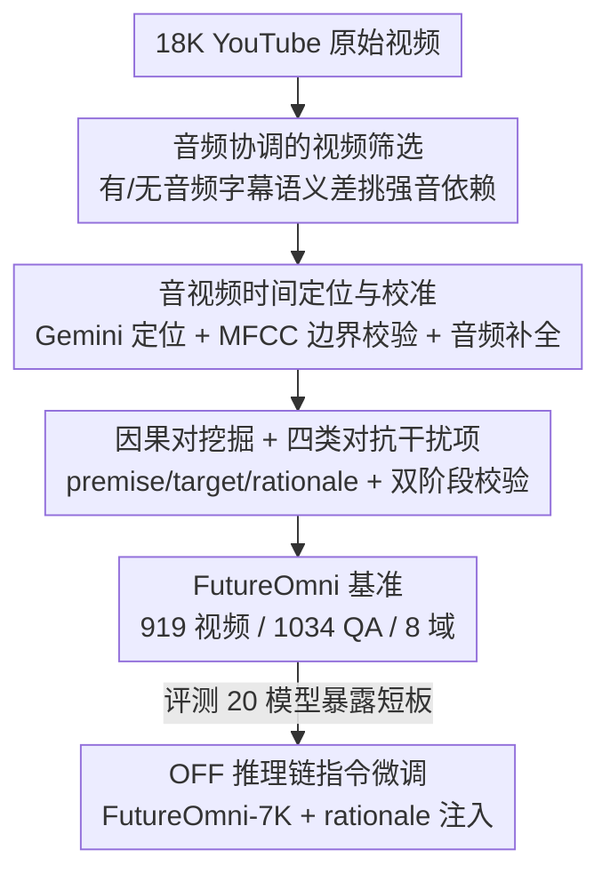

# FutureOmni: Evaluating Future Forecasting from Omni-Modal Context for Multimodal LLMs

**会议**: ICML2026  
**arXiv**: [2601.13836](https://arxiv.org/abs/2601.13836)  
**代码**: https://github.com/OpenMOSS/FutureOmni  
**领域**: 多模态VLM  
**关键词**: 音视频理解, 未来预测, 全模态基准, 因果推理, 指令微调

## 一句话总结
提出首个评测多模态大模型「从音视频上下文预测未来事件」能力的基准 FutureOmni（919 视频 / 1034 道选择题），发现连最强模型 Gemini 3 Flash 也只有 64.8% 准确率，并用一套带推理链的指令微调方法 OFF 把开源模型的预测与泛化能力同时拉高。

## 研究背景与动机

**领域现状**：多模态大模型（MLLM）的音视频理解近年进展很快，社区也建了一批全模态基准（WorldSense、DailyOmni 等），但它们几乎都在测**回溯式理解**——让模型描述、定位「视频里已经发生了什么」。

**现有痛点**：现实应用（自动驾驶、安防）真正需要的是**预判未来**：听到旁车鸣笛、看到行人位置，要据此预测下一刻的世界状态并及时决策。可现有的未来预测基准要么只看文本（FutureBench、ForecastBench），要么只看视觉（VLEP、IntentQA、MM-Forecast），把**听觉模态整体丢掉了**——而声音常常恰恰是未来事件的「先兆」（先尖叫后惊动他人）。

**核心矛盾**：同时要求「全模态感知」+「因果式未来推理」的评测数据是空白的；现有视觉中心的预测数据集往往直接静音或忽略音轨，根本测不出「声音作为因」的场景。

**本文目标**：构造一个专门评测「音视频联合 → 未来事件」的基准，并定位当前模型究竟差在感知还是推理；进而给出可落地的提升方法。

**切入角度**：作者把任务定义成「给定过去+当前的音视频观测，从候选项里选出正确的未来事件」，并刻意设计**对抗式干扰项**，逼模型必须真正做跨模态因果推理、而不是靠单模态捷径蒙对。

**核心 idea**：用「音频协调的视频筛选 + 音视频时间定位 + 因果对挖掘 + 四类对抗干扰项」搭出 FutureOmni 基准，再用「把数据构造时产出的推理链 rationale 喂回训练」的指令微调（OFF）教会模型预测的逻辑。

## 方法详解

### 整体框架
FutureOmni 的核心是一条**可扩展、AI 辅助 + 人在环**的数据流水线：从约 18K 条 YouTube 视频出发，先用音频协调策略筛掉「静态/装饰性音轨」的低质视频，再用 Gemini 2.5 Flash 做密集事件的时间定位与校准，最后从相邻事件里挖出「前提→未来」的因果对、配上四类对抗干扰项构成选择题。建好基准、评完 20 个模型暴露短板后，作者再用筛出的 rationale 构造 7K 指令微调集，提出 OFF 训练法把开源模型补强。

### 关键设计

**1. 音频协调的视频筛选：挑出「声音真的有信息量」的视频**

未来预测基准的第一道坎是：大量视频的音轨只是背景音乐之类的装饰，留着只会让「音视频任务」退化成纯视觉任务。作者先用帧间视觉相似度过滤场景几乎不变的片段（相邻帧平均相似度高于 70% 即丢弃），再提出**音频干预（audio intervention）筛选**：对同一视频分别生成「带音频」和「不带音频」的字幕，计算两者的语义相似度差距，差距越大说明视频对音频的依赖越强。只保留音频依赖最强的 top-50% 视频，最终得到约 9K 候选。这一步直接保证了基准不会被「忽略音频」的模型轻松刷分。

**2. 音视频时间定位与校准：给每个事件钉上可信的时间戳与声学标注**

要做因果对，先得知道视频里发生了哪些事、各自起止于何时。开源 grounding 模型要么对密集字幕不够精准、要么忽略音频，于是作者改用 Gemini 2.5 Flash 做定位：先扫一遍视频识别「与情节相关」的事件、忽略琐碎背景，并要求输出 MM:SS 精度的紧致时间边界。为防止时间边界乱标，借鉴 LongVALE 在事件起止点计算 **MFCC（梅尔频率倒谱系数）**，利用「有效事件转换通常伴随声学突变」的先验，只有 MFCC 差异超过阈值 2.0 才认可该边界。最后再做一次 **Audio Fulfilling**：让模型把对话、音效、背景音乐等与画面同步的声学线索补标进时间段，确保音频事件和视觉动作被对齐记录。

**3. 因果对挖掘 + 四类对抗干扰项：把「能预测的未来」做成真考推理的选择题**

时间线建好后，关键是只保留「未来能从过去逻辑推出」的事件对，而非单纯时间先后。作者用 DeepSeek-V3.2 分析相邻事件段，硬性限制前提与未来事件的时间间隔不超过 30 秒，并要求模型显式输出 **Premise（前提）/ Target（未来）/ Rationale（桥接二者的逻辑解释）** 三件套；同时给每个候选对的「音频因果度」打 0–2 分（0 无影响、1 装饰、2 因果），并把音频因子分成 Speech / Sound / Music 三类，专门挖出由声音驱动的预测。真正拉开难度的是**四类新型干扰项**：i) Visual-only Perception——视觉看着合理但被音频明确否定，专坑不融合听觉的模型；ii) Audio-only Perception——语义对得上音频但视觉里根本没发生，坑过度依赖音频转写的模型；iii) Delayed——描述前提之前发生过的真实往事，考时间精度；iv) Reverse-Causal——描述前提的「因」而非「果」，考模型对时间箭头方向的理解。候选题再经 GPT-4o 自动逻辑校验 + 人工复核的**双阶段验证**才入库。

**4. OFF 推理链指令微调：从「会答」升级到「会推」并能泛化**

评测暴露出开源全模态模型的预测能力明显落后后，作者并不是简单堆数据，而是把数据构造阶段产出的 **rationale 推理链注入每条训练样本**——不只教模型预测结果，更暴露「为什么这个未来跟在这个音视频前提之后」的推理逻辑。基于此构造 7K 指令集 FutureOmni-7K，对 Qwen2.5-Omni-7B、Ola-7B、video-SALMONN 2-7B 三个开源模型做 LoRA 微调：冻结视觉与音频编码器、只更新文本主干，学习率 1e-5、训练 1 epoch。这种「轻量改文本主干 + 喂推理链」的设计既省算力，又让模型把预测能力内化为可迁移的推理习惯，从而在域外基准上也涨点。

### 损失函数 / 训练策略
OFF 采用标准指令微调（监督学习），不引入额外损失项；核心在于训练样本里显式拼入 rationale 推理链，并通过 LoRA 仅更新文本主干、冻结音视频编码器，以单 epoch、1e-5 学习率完成低成本对齐。

## 实验关键数据

### 主实验
在 FutureOmni 上评测 20 个模型（含开源全模态、开源纯视频、闭源），核心结论是「连最强模型也远未及格」，且纯视频模型因拿不到音频普遍弱于全模态模型。

| 模型 | 类型 | 规模 | FutureOmni Avg(%) |
|--------|------|------|------|
| Gemini 3 Flash | 闭源全模态 | - | **64.80** |
| Gemini 2.5 Pro | 闭源全模态 | - | 57.93 |
| Gemini 2.5 Flash | 闭源全模态 | - | 55.61 |
| Qwen3-Omni | 开源全模态 | 30B | 53.05 |
| GPT-4o | 闭源纯视频 | - | 49.70 |
| AVicuna | 开源全模态 | 7B | 30.37 |

### 模态消融与 OFF 提升
模态消融证明任务确实需要音视频协同：去掉任一模态都明显掉点，且用字幕/字幕文本替代原始音频仍不如真音频；OFF 微调后三个开源模型全部稳定上涨。

| 配置 | 关键指标 | 说明 |
|------|---------|------|
| Qwen2.5-Omni A+V | 47.48 | 全模态完整输入 |
| └ 仅 V / 仅 A | 42.50 / 42.50 | 去掉任一模态各掉约 5%，且 A 与 V 单独得分相近，无单模态捷径 |
| └ V+字幕 | 43.85 | 文本替代音频仍逊于真音频（缺非语言信息） |
| video-SALMONN 2 + OFF | 46.03 → **49.90 (+3.87)** | OFF 增益最大 |
| Qwen2.5-Omni + OFF（Speech 类） | 37.83 → 47.75 (≈+10) | 最难的语音场景提升最显著 |

### 关键发现
- **视觉感知才是主要瓶颈**：对 Gemini 3 Flash 的 318 个失败样本归因，51.6% 是视频感知错误、30.8% 是音视频联合推理失败、15.1% 音频感知错误，而知识缺失仅 2.5%——说明差距来自动态感知与因果推理，而非缺知识。
- **语音是最难的音频类型**：Qwen3-Omni 在 Music(57.54%) 与 Speech(47.99%) 间约有 10% 差距，语音需要更高层的语言解码与跨模态语义对齐。
- **「上下文冷启动」现象**：所有全模态模型在最短时长区间得分最低，性能在中等时长（2–4 分钟）见顶——未来预测需要足够的历史叙事铺垫。
- **OFF 能泛化**：仅在未来预测上微调，却在 WorldSense、DailyOmni 等域外音视频基准乃至 Video-MME 上同时小幅涨点；注意力可视化显示 OFF 让模型更会锁定关键帧。

## 亮点与洞察
- **音频干预筛选**很巧：用「有/无音频时字幕的语义差」当作「音频信息量」的代理指标，低成本地把装饰性音轨的视频剔掉，从源头保证基准不被纯视觉模型刷分。
- **四类对抗干扰项**是基准的灵魂：Visual-only / Audio-only 逼模型双向验证、Delayed / Reverse-Causal 专门测时间箭头方向，把「单模态捷径」和「方向混淆」两类捷径同时堵死。
- **把 rationale 喂回训练**而不是只喂答案，这个「数据构造副产物即监督信号」的思路可迁移到任何带推理链标注的基准——预测任务上让模型学「为什么」往往比学「是什么」更能泛化。
- 误差归因结论很有价值：当代 MLLM 的世界知识已基本够用（知识缺失仅 2.5%），瓶颈在动态视觉感知与跨模态因果合成。

## 局限与展望
- 数据构造重度依赖 Gemini 2.5 Flash、DeepSeek-V3.2、GPT-4o 等闭源模型做定位/挖掘/校验，标注质量与可复现性受这些黑盒能力约束。
- MFCC 阈值 2.0、相似度 70%、top-50% 等关键阈值均为经验设定，跨数据域是否稳健未充分讨论（⚠️ 具体阈值以原文为准）。
- 规模相对有限（1034 道题），且全为多选题形式，未覆盖开放式未来生成；OFF 仅冻结编码器调文本主干，能否解决「视觉感知瓶颈」这一主因存疑——毕竟瓶颈在视觉感知，而训练却没动视觉编码器。
- OFF 在部分纯视频基准上出现轻微负迁移（如 video-SALMONN 2 在 Video-MME -0.15），说明专项微调与通用能力间仍有张力。

## 相关工作与启发
- **vs WorldSense / DailyOmni**：同为带音频的全模态基准，但它们聚焦回溯式感知/字幕，FutureOmni 把 100% 样本投向未来预测，并新增视频（平均 163.5s，远长于传统预测集）。
- **vs VLEP / IntentQA**：同做未来/意图预测，但二者视觉中心、常静音音轨；FutureOmni 显式建模「声音作为因」并设计音频驱动的因果对。
- **vs FutureBench / ForecastBench**：它们预测真实世界事件但仅用文本模态、需周期性更新防泄漏；FutureOmni 用新采集视频做音视频联合预测。

## 评分
- 新颖性: ⭐⭐⭐⭐⭐ 首个音视频联合未来预测基准，对抗干扰项设计补上了「声音作为因」的评测空白。
- 实验充分度: ⭐⭐⭐⭐⭐ 20 模型 + 模态消融 + 误差归因 + OFF 跨基准泛化，链条完整。
- 写作质量: ⭐⭐⭐⭐ 流水线与发现清晰，部分阈值与表格数字略显仓促。
- 价值: ⭐⭐⭐⭐⭐ 为全模态时序因果推理提供了可扩展基准与可落地的训练范式。

<!-- RELATED:START -->

## 相关论文

- [\[CVPR 2026\] Multimodal RewardBench 2: Evaluating Omni Reward Models for Interleaved Text and Image](../../CVPR2026/multimodal_vlm/multimodal_rewardbench_2_evaluating_omni_reward_models_for_interleaved_text_and_.md)
- [\[ICML 2025\] Context is Key: A Benchmark for Forecasting with Essential Textual Information](../../ICML2025/multimodal_vlm/context_is_key_a_benchmark_for_forecasting_with_essential_textual_information.md)
- [\[ICML 2026\] Task-Aware Structured Memory for Dynamic Multi-modal In-Context Learning](task-aware_structured_memory_for_dynamic_multi-modal_in-context_learning.md)
- [\[ICML 2026\] WeatherSyn: An Instruction Tuning MLLM For Weather Forecasting Report Generation](weathersyn_an_instruction_tuning_mllm_for_weather_forecasting_report_generation.md)
- [\[CVPR 2026\] AutoTraces: Autoregressive Trajectory Forecasting via Multimodal Large Language Models](../../CVPR2026/multimodal_vlm/autotraces_autoregressive_trajectory_forecasting_via_multimodal_large_language_m.md)

<!-- RELATED:END -->
