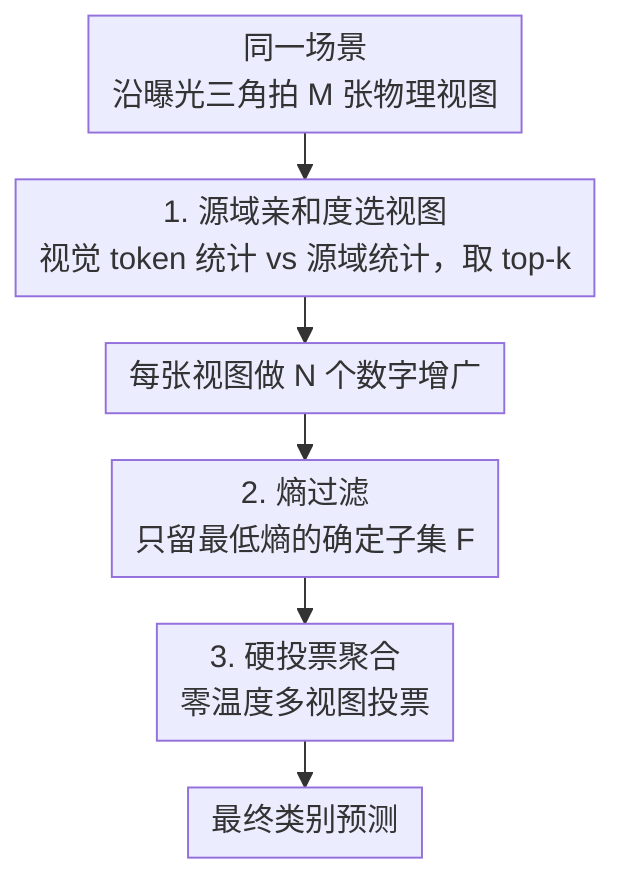

# Measurement Plasticity: Sensor-Level Adaptation for Vision–Language Models

**会议**: ICML2026  
**arXiv**: [2512.12571](https://arxiv.org/abs/2512.12571)  
**代码**: 待确认  
**领域**: 多模态VLM（测试时自适应 / 传感器级适应）  
**关键词**: 视觉语言模型, 测试时自适应, 物理提示, 曝光三角, 源域亲和度

## 一句话总结
这篇论文把视觉语言模型（VLM）的测试时自适应（TTA）从"调模型/调 token"搬到了"调相机/调光子"——把相机的曝光三角（ISO、快门、光圈）当作可控的"物理提示"，在拍摄阶段就用源域亲和度选出多个物理视图、再经熵过滤和硬投票聚合，无需任何梯度或改模型，就在传感器级分布偏移下显著超过只在数字域做适应的 TTA 方法。

## 研究背景与动机

**领域现状**：基础模型（尤其 VLM 如 CLIP）越来越多地被部署到与训练语料分布不同的真实环境，催生了"测试时持续自适应"。现有 TTA 几乎都在模型内部动手脚——更新权重、加 adapter、调 prompt、或检索记忆（TPT、PromptAlign、TDA 等），本质都是在"图像已经拍好之后"调整模型怎么解读这张固定的图。

**现有痛点**：在传感器中介的真实环境里，VLM 拿到的不是网上的干净图，而是相机现拍的图；ISO、快门、光圈这些设置决定了哪些光子能到达编码器。当场景欠曝、过曝或噪声大时，信息在**测量阶段就已经不可逆地丢了**——后续不管模型怎么自适应，都只能在一张已经退化的测量结果上操作。已有的 ImageNet-ES 基准已经证明，纯数字域适应填不平这种"传感器级鲁棒性鸿沟"。

**核心矛盾**：因果链是"场景 → 测量 → 表征"。现有 TTA 全卡在"测量 → 表征"这一段，而真正的信息损失发生在"场景 → 测量"这一段——一旦光子没被测到，下游怎么补都补不回来。这就是 Auto-Exposure（AE，相机自动曝光，为人眼优化而非为模型优化）下数字 TTA 的硬性上界。

**本文目标**：把自适应的"可塑性位置"从模型内部挪到传感器–模型接口，问一个互补的问题——与其把模型适配到输入，不如适配"输入是怎么被测量出来的"。具体要做到：无梯度、不改模型、可在拍摄阶段控制采集。

**切入角度**：已有的传感器控制工作 Lens（Baek 2025）已经会"按模型置信度逐场景选传感器设置"，但作者观察到"只看置信度的单视图选择"容易**过度自信地选错**——一张偏移的拍摄可能给出很高置信度却诱导出不可靠的 VLM 特征。于是改用"源域亲和度"来选视图，并用多视图投票替代单视图豪赌。

**核心 idea**：把曝光三角当成物理提示（physical prompt），对同一场景拍多张不同设置的"物理视图"，用源域亲和度选出最像源域分布的几张，再对其数字增广做熵过滤、最后硬投票——用"选视图再投票"替代"优化 prompt"，把可塑性放到传感器层。

## 方法详解

### 整体框架

MVP（Multi-View Physical-prompt for TTA）是一个**纯前向**框架：给定一个静态场景，先沿曝光三角（ISO、快门、光圈）用不同相机参数拍出 $M$ 张物理视图，把它们当作可控的物理提示；然后三步走——(1) 用**源域亲和度**给每张物理视图打分，选出最像源域统计的 top-$k$ 张；(2) 对选中视图的数字增广做**熵过滤**，只留最确定的一小撮；(3) 用零温度**硬投票**聚合这些视图的预测得最终类别。整个流程不需要梯度、不改 CLIP 权重，只改"呈现给冻结模型的测量分布"，把输入推回到模型表征可靠的区域。它特别适合静态、精度敏感的场景，如 CCTV 监控、自动巡检、计算机辅助手术。

### 关键设计

**1. 源域亲和度选视图：用"像不像源域"代替"置信度高不高"来选传感器设置**

针对的痛点是 Lens 那种"只看置信度选单张"会被过度自信的错误拍摄带偏。作者借鉴 PromptAlign 的思路：好视图应该是其视觉 token 统计**最接近源域统计**的那张，而不是模型最自信的那张。具体地，每张物理视图 $v_i$ 先扩出 $N$ 个数字增广，按置信度取 top-$\alpha$ 比例得到 $N'$ 个增广，再从冻结视觉编码器逐层 $l$ 抽取图像 token embedding 的均值方差 $\mu_{i,l}, \sigma^2_{i,l}$，与预先算好的源域统计 $(\mu_{s,l}, \sigma^2_{s,l})$ 比距离。源域亲和度分定义为：

$$S_i=-\frac{1}{L}\sum_{l=1}^{L}\Big(\|\mu_{i,l}-\mu_{s,l}\|_2^2+\|\sigma^2_{i,l}-\sigma^2_{s,l}\|_2^2\Big)$$

其中 $L$ 是视觉编码器层数。选 $S_i$ 最大的 top-$k$ 个设置，即最"源域对齐"的物理视图。因为 CLIP 预训练数据不公开，作者用 ImageNet 当代理源域（附录另测 LAION 统计）。这一步用"无梯度的物理提示选择"替代了"prompt 优化"，保留灰盒兼容性、计算量低；直观上就是让模型透过"源域般的视觉证据"去看场景——可视化也显示源域亲和度选出的视图，其注意力图比 AE 或置信度选出的更接近源域。

**2. 熵过滤 + 硬投票：先剔除不确定增广，再用零温度投票避开过度自信**

即便选中了 top-$k$ 物理参数，其数字增广里仍可能有因局部光照/视觉上下文波动而不确定、有噪声的样本。作者先用熵 $H_{i,n}=-\sum_c p_{i,n}(c)\log p_{i,n}(c)$ 衡量每个增广的不确定度（$p_{i,n}(c)$ 是第 $i$ 张物理视图第 $n$ 个增广对类别 $c$ 的预测概率），在全部 $k\times N$ 个增广里只保留熵最低的 $\gamma\%$ 作为最确定子集 $\mathcal{F}$。然后对 $\mathcal{F}$ 做**硬投票**：

$$\hat{y}=\arg\max_{y\in\mathcal{C}}\sum_{(i,n)\in\mathcal{F}}\mathbf{1}\Big[\arg\max_{c\in\mathcal{C}}p_{i,n}(c)=y\Big]$$

这里 $\mathcal{C}$ 是类别集合。之所以用硬投票而非"对 softmax 概率平均"，是因为多视图平均会被某个过度自信的视图主导、放大 overconfidence；硬投票则一视图一票，既缓解过度自信，又保住多物理视图带来的鲁棒性。

**3. 物理多视图作为不可替代的增广轴：传感器变化提供数字增广模拟不出的自由度**

这是 MVP 区别于普通多视图 TTA 的根基。作者强调：与其把传感器控制塌缩成单张拍摄，不如对 top-$k$ 源域亲和度视图投票——因为 ISO、快门、光圈改变的是**测量本身**，这条"物理增广轴"是事后的裁剪、翻转、光度扰动（如 Albumentations 那套）**无法完全模拟**的。后处理只能在已测到的光子上变换，而改传感器参数能真正改变"哪些光子被测到"，于是同一场景能透过有意义地不同的测量被观察，硬投票预测也因此更鲁棒（附录用 LDA 诊断支撑这一区分）。

## 实验关键数据

### 主实验

在 ImageNet-ES 与 ImageNet-ES-Diverse（均基于 Tiny-ImageNet、含受控光照–传感器变化）上，ViT-B/16 backbone，三种传感器控制协议（AE / AE+光度增广 / Lens 选择后再 TTA）。MVP 在 AE 下大幅超过所有数字 TTA，并在 Lens 管线上再涨一截。

| 方法 | 类别 | ImageNet-ES (AE) | ImageNet-ES-Diverse (AE) |
|------|------|------------------|--------------------------|
| CLIP（零样本） | 预训练 | 48.98 | 37.65 |
| TPT | prompt-TTA | 55.66 | 41.20 |
| PromptAlign | prompt-TTA | 55.45 | 41.51 |
| MTA | 训练free TTA | 56.56 | 41.70 |
| TDA | 训练free TTA | 58.17 | 40.78 |
| ZERO | 训练free TTA | 57.05 | 39.91 |
| **MVP（本文）** | 物理多视图 | **87.85** | **67.28** |

MVP 相比 AE 下最好的数字 TTA，在 ImageNet-ES / ES-Diverse 上分别至少提升约 29.68 / 25.58 个百分点；相比"Lens + TTA"组合管线也再涨最多约 3.4 个百分点，说明多物理参数比单视图传感器控制更有效。数字光度增广几乎无效，印证"数字扰动复现不了传感器变化的物理效果"。

### 消融实验（不同采集预算 CSA）

候选选择算法（CSA）作为预选策略把传感器参数空间压到更小的 $M$ 个离散网格，以降低采集延迟。无 CSA 时每场景 27 张视图、约 2.41 秒；CSA1/2/3 分别为 12/6/21 张。

| 配置 | 采集延迟 | IN-ES | IN-ES-Diverse | 说明 |
|------|---------|-------|---------------|------|
| Lens（CSA1） | 1.06 s | 84.75 | 61.79 | 单视图传感器控制基线 |
| Lens+ZERO（CSA1） | 1.06 s | 85.43 | 61.49 | Lens 上叠最佳数字 TTA |
| **MVP（CSA1）** | 1.06 s | **87.27** | **63.79** | 12 张视图 |
| **MVP（CSA2）** | 0.37 s | **86.65** | **63.79** | 仅 6 张视图，延迟接近 AE |
| **MVP（CSA3）** | 0.91 s | **87.87** | **64.41** | 21 张视图 |

### 关键发现
- **信息损失发生在测量阶段、不可后补**：AE 下 CLIP 严重退化、各种数字 TTA 只有边际增益，数字光度增广也无效——这从反面证明必须在拍摄阶段引入传感器级多样性。
- **源域亲和度优于置信度**：用"像不像源域"选视图避开了 Lens"过度自信选错"的失败模式，注意力图也更贴近源域。
- **减少采集仍鲁棒**：即便用 CSA 把视图压到 6 张（CSA2，延迟≈AE），MVP 仍保持高精度，说明它在低采集预算下也实用，可落地到采集成本敏感的真实部署。
- **延迟–精度权衡更优**：无 CSA 时 MVP/Lens 以约 4× 延迟换 ≥23.3 pp 精度；加 CSA 后 MVP 在低延迟下仍领先所有 Lens+TTA 基线。

## 亮点与洞察
- **把 TTA 从"token 搬到光子"是真正新颖的视角**：第一个把"测量过程"本身作为持续自适应的一等可塑性位置，提出"测量可塑性（measurement plasticity）"这一概念，给传感器–模型接口开了一类新方法。
- **源域亲和度 + 硬投票的组合很对症**：前者修正了置信度选择的过度自信，后者避免 softmax 平均被过度自信视图主导，两个简单设计精准打在"单视图豪赌"的痛点上。
- **"物理增广轴"论证有说服力**：明确指出改传感器参数能改变"哪些光子被测到"，是数字增广在数学上无法等价复现的——这把 MVP 与普通多视图 TTA 划清了界限。
- **无梯度、不改模型、灰盒兼容**：对部署友好，CCTV/巡检/手术等静态精度敏感场景可直接用。

## 局限与展望
- 作者明示 MVP 适用于**静态、精度敏感**场景（CCTV、自动巡检、计算机辅助手术），对快速运动/单帧实时场景这种"对同一场景拍多张"的前提可能不成立。
- 自己发现的局限：源域统计用 ImageNet 当 CLIP 的代理源（预训练数据不公开），代理与真实源域的差距可能影响亲和度选择；评估基准都基于 Tiny-ImageNet 的受控光照–传感器变化，真实户外复杂光照下的泛化仍需验证；多视图采集即使加 CSA 也比纯 AE 贵（延迟更高）。
- 改进思路：作者提出未来应让自适应方法**联合**作用于模型、prompt、记忆与"产生输入的可控过程"，把传感器控制和模型侧 TTA 协同起来，而非二选一。

## 相关工作与启发
- **vs Lens（Baek 2025，传感器控制基线）**：Lens 按模型置信度逐场景选**单张**最自信的物理拍摄；MVP 改用源域亲和度选 top-$k$ 多视图并硬投票，规避了 Lens"过度自信选错"的失败模式，主实验上稳定超过 Lens+TTA 组合。
- **vs PromptAlign**：PromptAlign 在数字域把测试视觉 token 统计对齐到源域统计；MVP 借用同一"源域对齐"思想，但把它用在**拍摄前的物理视图选择**上，而非事后调 prompt。
- **vs 前向式 TTA（TDA、ZERO、MTA 等）**：它们都无需反传、降低测试开销，但仍是"拍完之后"对 prompt/特征/缓存/预测动手；MVP 的差异在于把适应推到"拍摄阶段"，去改变到达编码器的视觉证据本身。

## 评分
- 新颖性: ⭐⭐⭐⭐⭐ "测量可塑性 / 把曝光三角当物理提示"是 TTA 领域全新的可塑性位置。
- 实验充分度: ⭐⭐⭐⭐ 跨两个传感器偏移基准、多类基线、CSA 预算与延迟分析完整，但仅 Tiny-ImageNet 派生、静态场景。
- 写作质量: ⭐⭐⭐⭐ 因果链"场景→测量→表征"叙事清晰，物理增广 vs 数字增广论证到位。
- 价值: ⭐⭐⭐⭐ 对 CCTV/巡检/手术等传感器中介的精度敏感部署有直接实用价值。

<!-- RELATED:START -->

## 相关论文

- [\[CVPR 2026\] Decoupling Stability and Plasticity for Multi-Modal Test-Time Adaptation](../../CVPR2026/multimodal_vlm/decoupling_stability_and_plasticity_for_multi-modal_test-time_adaptation.md)
- [\[CVPR 2026\] Do Vision-Language Models Measure Up? Benchmarking Visual Measurement Reading with MeasureBench](../../CVPR2026/multimodal_vlm/do_vision-language_models_measure_up_benchmarking_visual_measurement_reading_wit.md)
- [\[CVPR 2026\] PointAlign: Feature-Level Alignment Regularization for 3D Vision-Language Models](../../CVPR2026/multimodal_vlm/pointalign_feature-level_alignment_regularization_for_3d_vision-language_models.md)
- [\[ICLR 2026\] Bilateral Information-aware Test-time Adaptation for Vision-Language Models](../../ICLR2026/multimodal_vlm/bilateral_information-aware_test-time_adaptation_for_vision-language_models.md)
- [\[ACL 2026\] Cross-Cultural Expert-Level Art Critique Evaluation with Vision-Language Models](../../ACL2026/multimodal_vlm/cross-cultural_expert-level_art_critique_evaluation_with_vision-language_models.md)

<!-- RELATED:END -->
