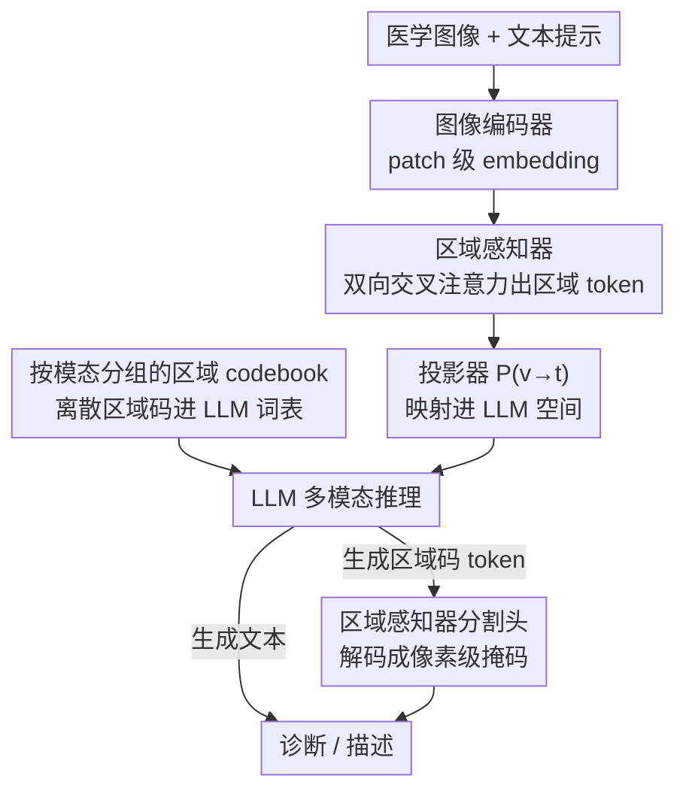

# MedSIGHT: Towards Grounded Visual Comprehension in Medical Large Vision-Language Models

**会议**: ICML2026  
**arXiv**: [2606.06760](https://arxiv.org/abs/2606.06760)  
**代码**: 公开（论文称 Code and model available at GitHub，具体链接 ⚠️ 以原文为准）  
**领域**: 多模态VLM / 医学图像  
**关键词**: 医学大视觉语言模型, 像素级 grounding, 区域 codebook, 统一分割与理解, 渐进式训练

## 一句话总结
MedSIGHT 把"区域感知器"和一套"按模态分组的区域 codebook"塞进医学 LVLM，让同一个生成式模型既能做诊断推理、又能直接吐出离散区域码并解码成分割掩码，仅用 72K 指令样本就在理解与分割两类任务上同时达到 SOTA。

## 研究背景与动机
**领域现状**：医学大视觉语言模型（Med-LVLM）已经能做不错的图文理解和医学图像分割，但理解和分割往往是两条分开的能力。为了让模型既能"说出诊断"又能"圈出病灶"，主流做法（如 MedPLIB，沿用 LISA 的思路）是在 LLM 外面挂一个大分割模型（SAM-Med2D），让 LLM 输出一个特殊 `[SEG]` token 去触发分割。

**现有痛点**：这种"外挂分割器 + 单 token 触发"的设计有两个硬伤。其一在输入侧——现有模型只用 CLIP 抽出的 patch 级特征，而 CLIP 高层 patch token 主要编码高层语义、把病灶边界、器官轮廓、组织纹理这类精细空间信息丢掉了，导致诊断推理和分割结果常常对不上图像证据。其二在输出侧——把所有要分割的区域都压缩成同一个 `[SEG]` token，等于让模型用一个符号表达千差万别的解剖结构和病变，表达能力被严重限死，没法产出区域特异的多样输出。

**核心矛盾**：一个真正"接地气"（grounded）的 Med-LVLM 需要同时在**输入端看清细节**、在**输出端用语言表达多样的区域级理解**，但 patch 特征看不清、单 token 表达不了，二者都被现有架构卡住。

**本文目标**：在**单个生成式框架内**统一视觉理解、grounding 与分割，既增强输入感知，又增强输出表达。

**核心 idea**：用"区域感知器"把 patch 特征升采样并提炼成富含空间信息的区域 token 喂给 LLM（补输入），再用"按模态分组的区域 codebook"把这些连续区域 embedding 离散化、塞进 LLM 词表，让 LLM 像生成普通词一样生成多个语义化区域码、再解码回掩码（补输出）。

## 方法详解

### 整体框架
MedSIGHT 接收一张医学图像 $I$ 和文本提示 $T$。图像先经预训练图像编码器 $\mathcal{E}$ 得到 patch 级 embedding $\mathbf{I}$；再交给**区域感知器** $\mathcal{R}$ 提炼出区域级 embedding $\mathbf{Q}_r$。$[\mathbf{I};\mathbf{Q}_r]$ 经投影器 $\mathcal{P}_{v\to t}$ 映射进 LLM 空间得到视觉 embedding $\mathbf{V}$。与此同时，LLM 词表被追加了一组**按模态分组的区域 codebook** $\mathbf{C}$。$\mathbf{V}$、文本 embedding $\mathbf{T}$、codebook embedding $\mathbf{C}$ 一起喂给 LLM 做多模态推理。当模型在回答里生成区域码 token 时，其隐状态被投影回视觉空间、由区域感知器的分割头解码成像素级掩码——从而在**同一个端到端生成框架**里完成"描述—定位—分割"闭环。三大模块（感知器、codebook、LLM）所处的表示空间不同、维度和语义都可能错位，因此整套东西靠一条**渐进式四阶段训练管线**逐步对齐。

### 关键设计

**1. 区域感知器：把 patch 特征提炼成看得清细节的区域 token**

针对"CLIP patch 特征丢空间细节"的输入侧痛点，区域感知器引入一组可学习的区域查询 token $\mathbf{Q}\in\mathbb{R}^{N\times d}$ 当作"自适应锚点"，其中 $N$ 是区域数、$d$ 是隐维。$\mathcal{R}$ 由 $L$ 个迭代层堆叠，每层先用一个轻量卷积适配器把低分辨率 patch embedding 升采样成更精细的视觉特征 $\mathbf{E}^{l-1}=\text{ConvAdapter}(\mathbf{I}^{l-1})$，再用一个**双向交叉注意力**让区域查询和视觉特征互相精炼：区域→图像注意力让区域查询从精细特征里聚合空间信息 $\mathbf{Q}^{l}=\text{FFN}_r(\text{CrossAtt}_{r\to i}(\mathbf{Q}^{l-1},\mathbf{E}^{l-1}))$，反过来图像→区域注意力又让图像表示在区域级语义监督下更新 $\mathbf{I}^{l}=\text{FFN}_i(\text{CrossAtt}_{i\to r}(\mathbf{E}^{l-1},\mathbf{Q}^{l}))$。经 $L$ 层后输出区域 embedding $\mathbf{Q}_r$ 和高分辨率图像特征 $\mathbf{I}_r$，由分割头和分类头监督。与固定尺度的 CLIP 编码器和 Q-Former 式 perceiver 不同，这种渐进升采样 + 双向精炼让每个区域 token 同时握有全局语义和细粒度细节，又只用很少的 token 喂给 LLM、保持效率。

**2. 按模态分组的区域 codebook：让 LLM 用多个离散码表达区域，而不是一个 `[SEG]`**

针对"单 token 表达不了多样区域"的输出侧痛点，作者把连续区域 embedding $\mathbf{Q}_r$ 离散化成可解释的视觉概念码。考虑到 CT/MRI/X-ray 等模态差异巨大，codebook 被设计成按模态分组 $\hat{\mathbf{C}}=\{\mathbf{c}_{k,m}\}$，每个模态 $k$ 维护 $M$ 个区域码。对每个区域 embedding，先用 $\mathbf{W}_q$ 投到量化空间再就近分配 $\{k^*,m^*\}=\arg\min_{k,m}\|\mathbf{W}_q\mathbf{Q}_r^i-\mathbf{c}_{k,m}\|_2^2$，再用 $\mathbf{W}_m$ 映回视觉空间。codebook 用向量量化损失 $\mathcal{L}_\text{VQ}$、$\ell_2$ 重建损失 $\mathcal{L}_\text{recon}=\|\tilde{\mathbf{Q}}_r-\mathbf{Q}_r\|_2^2$ 加上区域感知器预训练损失 $\mathcal{L}_\mathcal{R}$ 一起优化，以保留空间 grounding。学好的离散码被映回视觉空间、再经 $\mathcal{P}_{v\to t}$ 投到 LLM embedding 空间作为新 token 的初始化，正式追加进 LLM 词表。这样 LLM 就能像生成普通词一样生成多个对应不同解剖/病理概念的区域码（如 `[C2_16]`），表达力远超单 `[SEG]`；论文可视化显示每个码确实学到了清晰的解剖语义（如 `[C1_16]` 主要关注腹部 CT 的肝脏区域）。

**3. 渐进式四阶段训练管线：把三个异构模块稳定对齐起来**

三大模块表示空间不同，直接联合训练容易崩，作者用一条从感知到表达逐步打通的管线。① **区域感知器预训练**：在 BiomedParse 整理的分割/检测数据 $\mathcal{D}_\text{seg}$ 上训 $\mathcal{R}$，分割监督 $\mathcal{L}_\text{seg}$ 用 BCE + Dice、分类用交叉熵，并用匈牙利匹配建立预测区域与真值的一一对应。② **视觉到文本对齐**：冻结 LLM、图像编码器和 $\mathcal{R}$，只训投影器 $\mathcal{P}_{v\to t}$，把 $[\mathbf{I};\mathbf{Q}_r]$ 对齐到语言空间。③ **codebook 学习 + 文本到视觉对齐**：学好 codebook 并并入词表后，把区域码当作 LLM 回答里的"触发器"——当 LLM 生成区域码、其隐状态 $\mathbf{H}_t$ 经 $\mathcal{P}_{t\to v}$ 投回视觉空间、由分割头解码成掩码，用 $\mathcal{L}_\text{seg}$ 监督，这一步只更新 $\mathcal{P}_{t\to v}$ 和新 token embedding。④ **统一 grounded 指令微调**：解冻 LLM，联合微调 LLM、codebook、两个投影器（冻结 $\mathcal{R}$ 和编码器），目标 $\mathcal{L}_\text{final}=\mathcal{L}_\text{LLM}+\mathcal{L}_\text{seg}$，用普通医学指令数据 $\mathcal{D}_\text{inst}^r$ 和带区域码的 grounding 指令数据 $\mathcal{D}_\text{inst}^g$ 一起训，形成"描述—定位—分割"的闭环推理-grounding。

### 损失函数 / 训练策略
- 区域感知器预训练：$\mathcal{L}_\mathcal{R}=\mathcal{L}_\text{seg}+\mathcal{L}_\text{ce}$，其中 $\mathcal{L}_\text{seg}=\lambda_1\mathcal{L}_\text{BCE}+\lambda_2\mathcal{L}_\text{Dice}$。
- codebook：$\mathcal{L}_\text{codebook}=\mathcal{L}_\text{VQ}+\mathcal{L}_\text{recon}+\mathcal{L}_\mathcal{R}$。
- 统一微调：$\mathcal{L}_\text{final}=\mathcal{L}_\text{LLM}+\mathcal{L}_\text{seg}$。
- 骨干：LLM 用 Qwen3-8B，视觉编码器用 Unimed-CLIP（ViT-L-14）；理解侧仅用 72K 指令样本微调。

## 实验关键数据

### 主实验
理解任务（Table 2，6 个医学 VQA benchmark 的平均分；闭式题用 Accuracy、开放题用 Recall）：

| 模型 | 基座参数 | 微调数据量 | 平均分 ↑ |
|------|--------|-----------|---------|
| HuatuoGPT-Vision | 7B | 647K | 58.3 |
| InternVL2 | 8B | 7.3M | 51.4 |
| LLaVA-Med | 7B | 60K | 46.2 |
| **MedSIGHT** | 8B | **72K** | **62.3** |

MedSIGHT 用最少的微调数据（72K vs HuatuoGPT-Vision 647K）拿到最高均分，在统一模型里优势更明显。

诊断分割任务（Table 3，自建 DiagSeg，8 个模态平均）：

| 模型 | 参数 | DiagSeg-诊断 Recall ↑ | DiagSeg-分割 Dice ↑ |
|------|------|----------------------|--------------------|
| MedPLIB | 14B/7B | 13.1 | 31.8 |
| OMG-LLaVA | 7B | 18.3 | 11.1 |
| LISA | 7B | 14.1 | 31.8 |
| **MedSIGHT** | 8B | **58.9** | **69.9** |

文本提示分割（Table 4，MeCoVQA-G 跨模态平均 Dice）：MedSIGHT 42.8 > MedPLIB 40.1（且 MedPLIB 部分在 MeCoVQA-G 训练集上训过）、BiomedParse 40.3。

### 消融实验
（Table 5，关键列：DiagSeg-VQA Recall / DiagSeg-Seg Dice / MeCoVQA-G Dice）

| 配置 | DiagSeg-VQA | DiagSeg-Seg | MeCo | 说明 |
|------|-------------|-------------|------|------|
| 完整 MedSIGHT | 58.9 | 69.9 | 42.8 | 全部模块 |
| w/o 区域 embedding $\mathbf{Q}_r$ | 54.4 | 59.2 | 37.6 | 去掉细粒度感知，全面掉点 |
| w/o 统一指令微调 | 45.1 | — | — | 理解能力直接崩，证明端到端微调不可省 |
| w/o codebook（换单 `[SEG]`） | — | 显著下降 | — | 分割尤其受损，证实多样区域码的必要性 |

### 关键发现
- **统一指令微调是命门**：去掉后理解类指标（DiagSeg-VQA 从 58.9 跌到 45.1）整体崩塌，分割无法评测，说明前面几阶段只是把模块对齐、真正"会用"还得靠端到端联合微调。
- **区域感知器和 codebook 一头一尾各管一段**：去掉区域 embedding 主要伤"看清细节"，分割 Dice 从 69.9 掉到 59.2；把 codebook 换回单 `[SEG]` 主要伤"多样表达"，分割受损最重。
- **可解释性**：每个学到的区域码对应清晰解剖语义（如某码专注肝脏区域），让 codebook 的有效性可视化、可解释。

## 亮点与洞察
- **把"分割"内化进 LLM 的词表**，而不是外挂一个分割大模型——区域码就是普通可生成 token，整套推理-grounding 在一个生成框架里闭环，省掉了 SAM-Med2D 之类的重型外部依赖。
- **按模态分组的 codebook** 是个很贴医学场景的设计：CT/MRI/X-ray 的解剖语义差异大，给每个模态独立码本避免了跨模态量化互相干扰，这个"按数据子域分组离散表示"的思路可迁移到其他多域生成任务。
- **数据效率惊人**：72K 指令样本就压过用 647K 训练的 HuatuoGPT-Vision，说明输入/输出两端的结构化增强比单纯堆数据更划算。
- 自建 **DiagSeg** 把"先诊断再分割"的临床流程显式化，比"直接告诉你分割什么"的旧设定更接近真实工作流。

## 局限与展望
- 论文承认在 US（超声）模态上落后于 MedPLIB，少数 OOD 数据集上文本提示分割也偏弱，跨模态泛化仍有缺口。
- codebook 大小、码本是否随新模态扩展、对罕见病变的覆盖等只在附录略有探讨，长尾解剖/病理概念能否被离散码充分表达存疑。
- 渐进式四阶段管线工程上较重，复现成本和各阶段超参敏感性需要关注；区域数 $N$、每模态码数 $M$ 等关键超参的取值依据在正文中交代有限（⚠️ 以原文/附录为准）。

## 相关工作与启发
- **vs MedPLIB / LISA 路线**：他们靠 LLM 输出单 `[SEG]` 触发外挂 SAM-Med2D，本文把分割能力离散成多区域码内化进 LLM 词表，区别在于"外挂触发 vs 词表内生成"，本文在诊断分割上 Dice 69.9 远超 MedPLIB 31.8，但代价是更复杂的多阶段训练。
- **vs CLIP / Q-Former 式 perceiver**：他们依赖固定尺度图像特征，本文的区域感知器靠卷积升采样 + 双向交叉注意力做多尺度精炼，专门补回 patch 特征丢掉的空间细节。
- **vs BiomedParse 等纯分割基座**：本文复用其训练数据做预训练，但目标是统一理解-分割而非单纯分割，因而能在"先诊断后分割"的 DiagSeg 上整体领先。

## 评分
- 新颖性: ⭐⭐⭐⭐⭐ 把区域码内化进 LLM 词表、按模态分组 codebook，统一理解-分割路线很有想法
- 实验充分度: ⭐⭐⭐⭐⭐ 覆盖理解/诊断分割/文本提示分割 + 多模态 + 消融 + 可视化，自建 DiagSeg benchmark
- 写作质量: ⭐⭐⭐⭐ 结构清晰、公式完整，部分超参依据需查附录
- 价值: ⭐⭐⭐⭐⭐ 数据效率高、临床流程贴合度好，对医学多模态落地有实际意义

<!-- RELATED:START -->

## 相关论文

- [\[ICML 2026\] TGV-KV: Text-Grounded KV Eviction for Vision-Language Models](tgv-kv_text-grounded_kv_eviction_for_vision-language_models.md)
- [\[ACL 2026\] MedLayBench-V: A Large-Scale Benchmark for Expert-Lay Semantic Alignment in Medical Vision Language Models](../../ACL2026/multimodal_vlm/medlaybench-v_a_large-scale_benchmark_for_expert-lay_semantic_alignment_in_medic.md)
- [\[ICML 2026\] Layer-Specific Fine-Tuning for Improved Negation Handling in Medical Vision-Language Models](layer-specific_fine-tuning_for_improved_negation_handling_in_medical_vision-lang.md)
- [\[ACL 2025\] Improving Medical Large Vision-Language Models with Abnormal-Aware Feedback](../../ACL2025/multimodal_vlm/improving_medical_large_vision-language_models_with_abnormal-aware_feedback.md)
- [\[ICML 2026\] Focusing Where Vision Matters: Selective Training for Large Vision Language Models via Visual Information Gain](focusing_where_vision_matters_selective_training_for_large_vision_language_model.md)

<!-- RELATED:END -->
