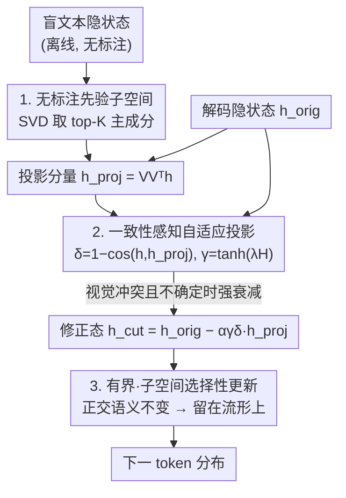

# Mitigating Manifold Departure: Uncertainty-Aware Subspace Rectification for Trustworthy MLLM Decoding

**会议**: ICML2026  
**arXiv**: [2606.09859](https://arxiv.org/abs/2606.09859)  
**代码**: 待确认  
**领域**: 多模态VLM  
**关键词**: 幻觉抑制, 训练无关解码, 语言先验子空间, 表示几何, 流形偏离

## 一句话总结
针对训练无关解码方法"无差别压制语言先验"会把隐状态推离正常解码流形（manifold departure）从而损害正常生成的问题，MGAP 用 SVD 从盲文本隐状态中估出一个低秩"语言先验子空间"，解码时只把隐状态在该子空间上的投影分量按"视觉冲突程度 + 预测不确定度"自适应衰减，在 POPE / CHAIR 上同时拿到更强的幻觉抑制和更稳的生成保真。

## 研究背景与动机
**领域现状**：多模态大模型（MLLM）会产生"物体幻觉"——说出图里根本没有的东西。主流的训练无关缓解思路（VCD、ICD、OPERA 等）都把矛头指向预训练学到的"语言先验"，在解码 logits 里减掉一个偏置项（盲分支 / 对比上下文），即 $\text{Logits}_{\text{final}}=\text{Logits}_{\text{main}}-\rho\cdot\text{Logits}_{\text{bias}}$，企图把语言先验压下去。

**现有痛点**：作者指出语言先验有"双重身份"——当它和视觉证据一致时（论文里的"黄香蕉"例子），先验是置信锚点，能让生成更锐利更稳定；只有当它和图像冲突时（"蓝香蕉"）才会盖过图像、诱发幻觉。可现有方法不分青红皂白地按同一个方向、同一个强度做全局线性平移，结果在那些"先验本来是帮手"的正常样本上反而掉点。论文用 LLaVA-1.5-7B 在 POPE 上实测：VCD 相对 vanilla 在所有 split 上都掉，包括视觉与先验天然对齐的标准样本。

**核心矛盾**：这个掉点有一个几何根因。把最后一层隐状态 $h_t\in\mathbb{R}^d$ 投到表示空间看，正常解码的合法轨迹高度集中在一个低维流形 $\mathcal{M}$（语义流形）周围；而线性压制是一个"全局、不顾局部几何"的平移，会把隐状态推到正常解码几乎不会经过的低密度尾部区域，解码器进入支撑不良的状态，token 分布变得不稳。作者把这个失败模式命名为 **Manifold Departure（流形偏离）**。

**本文目标**：在不重训、不改参数的前提下，做到"只在该压的时候压、只压该压的方向"，既抑制幻觉又不破坏语义流形结构。

**切入角度**：既然语言先验在表示空间里是一组主导方向，那就显式地把它建模成一个**低秩子空间**，干预时只动隐状态落在这个子空间里的分量，正交的语义分量原封不动——这样就不会发生全局平移导致的流形偏离。

**核心 idea**：用 SVD 从盲文本隐状态里估出语言先验子空间，解码时把隐状态投影到该子空间，并用"先验-后验不一致度 × 预测不确定度"做门控，自适应地只衰减投影分量，得到一个有界、子空间选择性的更新。

## 方法详解

### 整体框架
MGAP（Manifold-Guided Adaptive Projection）分两段：**离线**用一批无标注的盲文本输入构造语言先验子空间 $V_{\mathrm{prior}}$（只需 query，不需要图像、不需要标签、不需要更新参数）；**在线**解码时，对每一步产生的隐状态 $h_{\mathrm{orig}}$ 做几何感知的自适应投影——先把它分解为"先验子空间投影分量 $h_{\mathrm{proj}}$"和正交语义分量，再根据当前视觉-先验是否冲突（不一致度 $\delta$）和模型是否心虚（熵 $H$ 决定的门控 $\gamma$）决定衰减多少 $h_{\mathrm{proj}}$，正交分量完全不动。当视觉与先验一致时 $\gamma,\delta$ 都很小，整个操作退化成近似恒等映射，从而避开了导致流形偏离的全局平移。

### 关键设计

**1. 无标注语言先验子空间构造：把"先验"显式建成一个低秩 SVD 子空间**

现有方法把"语言先验"当成一个要减掉的标量偏置，作者认为这丢掉了先验的几何结构。MGAP 改为：给一批 prompt $\{x^{(i)}\}_{i=1}^N$，跑模型拿到最后一层的**盲文本隐状态** $\{h_{\mathrm{blind}}^{(i)}\}$（不喂图像，只让语言先验起作用），中心化后堆成矩阵 $\tilde{H}_{\mathrm{blind}}\in\mathbb{R}^{N\times d}$，取其 top-$K$ 主成分作为先验子空间基：$\tilde{H}_{\mathrm{blind}}=U\Sigma V^\top$，$V_{\mathrm{prior}}\triangleq V_{[:,1:K]}\in\mathbb{R}^{d\times K}$。这一步只用 query、零标签、零图像、零参数更新，纯离线。关键观念是：$V_{\mathrm{prior}}$ 捕捉的是语言规律带来的主导变化方向，但**不预设它有害**——正因为它可能有害也可能有用，才需要后面的自适应而非一刀切压制。

**2. 一致性感知 + 不确定度门控的自适应投影：只在"该压"时压、只压"该压"的方向**

这是 MGAP 的核心干预。对解码隐状态 $h_{\mathrm{orig}}$，先算它在先验子空间上的投影 $h_{\mathrm{proj}}=V_{\mathrm{prior}}V_{\mathrm{prior}}^\top h_{\mathrm{orig}}$。直接整块减掉 $h_{\mathrm{proj}}$ 仍可能造成流形偏离，所以作者用两个自适应标量去调制衰减强度：

其一是**先验-后验不一致度** $\delta=1-\cos(h_{\mathrm{orig}},h_{\mathrm{proj}})$。$\delta$ 小说明当前状态和先验子空间高度一致（先验大概率是帮手），不需要额外压制；$\delta$ 大说明二者错位（很可能视觉-先验冲突），该加大衰减。

其二是**不确定度门控** $\gamma=\tanh(\lambda H)$，其中 $H=-\sum_y p(y)\log p(y)$ 是 token 分布的香农熵。幻觉往往伴随更高的预测不确定度，所以熵高时放大干预、模型自信时收手。

最终修正态为

$$h_{\mathrm{cut}}=h_{\mathrm{orig}}-\alpha\cdot\gamma\cdot\delta\cdot h_{\mathrm{proj}},$$

记 $\beta=\alpha\gamma\delta$ 即 $h_{\mathrm{cut}}=h_{\mathrm{orig}}-\beta h_{\mathrm{proj}}$。当视觉与先验一致时 $\gamma,\delta\to$ 小，$\beta\to 0$，退化为恒等映射——这正是它不会像 VCD 那样在正常样本上掉点的原因：旧方法是固定方向 $\rho(h_{\mathrm{joint}}-h_{\mathrm{blind}})$ 的全局外推，而 MGAP 的衰减方向被限制在先验子空间内、强度被两个上下文相关的标量动态压住。

**3. 有界、子空间选择性的更新：理论保证留在语义流形上**

作者给了三条性质（证明在附录）来解释为什么 MGAP 不会重蹈流形偏离。其一（Thm 4.2 有界步长）：由于 $\gamma=\tanh(\lambda H)\in[0,1)$、$\delta\in[0,2]$ 共同缩放，有 $0\le\beta<\alpha$，更新幅度被 $\|h_{\mathrm{cut}}-h_{\mathrm{orig}}\|\le\alpha\|h_{\mathrm{orig}}\|$ 严格上界，避免过大修正。其二（Thm 4.3 子空间选择性）：MGAP 只改先验分量、完全保留正交分量，形式化为 $h_{\mathrm{cut}}-V_{\mathrm{prior}}V_{\mathrm{prior}}^\top h_{\mathrm{cut}}=h_{\mathrm{orig}}-V_{\mathrm{prior}}V_{\mathrm{prior}}^\top h_{\mathrm{orig}}$——即没有任何全局平移。其三（Thm 4.1 误差下降）：当当前误差分量正好沿着先验投影方向（$\langle h_{\mathrm{orig}}-h_{\mathrm{gt}},h_{\mathrm{proj}}\rangle>0$）时，减掉适量 $h_{\mathrm{proj}}$ 可证明地把隐状态拉近真值对齐态，$\|h_{\mathrm{cut}}-h_{\mathrm{gt}}\|^2<\|h_{\mathrm{orig}}-h_{\mathrm{gt}}\|^2$（此分析是说明性的，推理时不需要访问 $h_{\mathrm{gt}}$）。三条合起来：有界 + 只动先验方向 + 误差沿先验时还能纠偏，这就是"几何感知"相对"全局线性压制"的根本区别。

## 实验关键数据

### 主实验
在 POPE（判别式，三种 split）和 CHAIR（描述式，统计幻觉物体）两个 benchmark、两个 backbone（LLaVA-1.5-7B 与 Qwen3-VL-8B）上对比 VCD / ICD / HalTrapper / DeCo / MoD / CODE 等训练无关解码方法。

POPE 上 LLaVA-1.5-7B 的准确率（Acc.，%）：

| 方法 | Random | Popular | Adversarial |
|------|--------|---------|-------------|
| Vanilla | 88.88 | 86.23 | 80.16 |
| VCD | 87.57 | 84.23 | 78.56 |
| DeCo | 89.86 | 87.72 | 83.18 |
| MoD | 89.24 | 87.03 | 82.51 |
| **MGAP (Ours)** | **90.63** | **88.10** | **84.59** |

注意 VCD 在三个 split 上都比 Vanilla 还低，印证了"无差别压制反而伤正常样本"的核心论点；MGAP 则全面超过 Vanilla 与所有基线。

CHAIR 上的幻觉率（越低越好）：

| 指标 | Vanilla | VCD | ICD | CODE | **Ours** |
|------|---------|-----|-----|------|----------|
| CHAIRs↓ (LLaVA-7B) | 47.4 | 52.8 | 51.8 | 49.8 | **26.2** |
| CHAIRi↓ (LLaVA-7B) | 23.5 | 15.8 | 14.7 | 13.8 | **7.6** |
| Precision (LLaVA-7B) | 70.8 | 72.6 | 73.7 | 76.0 | **85.9** |

CHAIRs 从 47.4 砍到 26.2、CHAIRi 从 23.5 砍到 7.6，同时 Precision 不降反升到 85.9，说明它在"少说幻觉物体"的同时没有牺牲描述完整度。Qwen3-VL-8B 上趋势一致。

### 消融实验

| 配置 | POPE Acc.(Random) | 说明 |
|------|------|------|
| Full (Ours) | 90.13 | 完整模型 |
| w/o Prot（去一致性保护 $\delta$） | 87.70 | Precision 飙到 97.24 但 F1 掉到 86.32，过度压制 |
| w/o Gate（去不确定度门控 $\gamma$） | 86.57 | Precision 98.41、F1 仅 84.69，trade-off 失衡 |

### 关键发现
- 去掉一致性保护或不确定度门控后，模型会变成"过度保守"——Precision 异常高（97~98%）但 Acc./F1 反而崩，说明它退回了"无差别压制"的老路，把有用的先验也压没了。两个自适应标量缺一不可，正是它们把"何时压、压多少"动态卡住。
- MGAP 最大的反差在 CHAIR：旧的对比解码方法（VCD/ICD/CODE）虽然降了 CHAIRi 却普遍把 CHAIRs 推高（甚至超过 Vanilla），而 MGAP 两个 CHAIR 指标同时大幅下降且 Precision 升到 85.9，体现"子空间选择性"带来的全面更优 trade-off。

## 亮点与洞察
- **把"流形偏离"从经验现象做成可度量的几何判据**：作者用参考库的 kNN 平均距离 $d_k(h;\mathcal{S})=\frac1k\sum_{s\in\mathrm{NN}_k}\|h-s\|_2$ 当"离流形度"代理，并以参考分布的 $(1-\delta)$ 分位数 $\tau$ 当阈值，给出 $d_k(\tilde h_t;\mathcal{S})>\tau$ 即"发生流形偏离"的可计算定义，让"线性压制为何掉点"有了量化抓手——这套诊断工具本身就能迁移去分析其他解码干预。
- **"先验有害还是有益取决于上下文"这个观察很关键**：它把幻觉缓解从"压制 vs 不压制"的二元对立，升级成"按对齐程度自适应调节"，$\delta$ 和 $\gamma$ 两个标量是这一思想的精炼落地。
- **子空间选择性 + 有界步长的组合可复用**：把任意"要减掉某种成分"的解码干预改成"只在低秩子空间内动、正交分量不动、步长被 tanh 门控住"，是一个通用且即插即用的稳定化范式，可迁移到对比解码、风格控制等场景。

## 局限与展望
- 先验子空间维度 $K$、缩放系数 $\alpha$、门控温度 $\lambda$ 都是需要选的超参，论文正文未充分展示其敏感性分析，跨 backbone 是否需要重调不明确。
- 子空间由"盲文本隐状态"估出，依赖一批代表性 prompt；若部署域的语言分布与构造集差异大，先验方向是否仍准确存疑。
- 评测集中在 POPE / CHAIR 这类物体级幻觉，对属性幻觉、关系幻觉、长文档描述等更复杂幻觉类型的效果未验证。
- 改进方向：把 $\delta,\gamma$ 的标量门控扩成逐方向（子空间内不同主成分不同强度）的细粒度调制，可能进一步提升 trade-off。

## 相关工作与启发
- **vs VCD（视觉对比解码）**：VCD 在 logits 层做 $h_{\mathrm{joint}}+\rho(h_{\mathrm{joint}}-h_{\mathrm{blind}})$ 的全局线性外推，方向固定、不顾局部几何，会把状态推离流形并在正常样本上掉点；MGAP 在隐状态层做子空间内的有界选择性衰减，正交语义不动，故不掉点。
- **vs OPERA**：OPERA 靠惩罚项 + 回溯分配来抑制过度自信，仍是 logit/注意力层的启发式调节；MGAP 给出的是表示空间的几何化、带理论性质（有界、子空间选择、误差下降）的干预。
- **vs DeCo / MoD**：同为近期训练无关解码基线，MGAP 在两个 backbone、POPE 与 CHAIR 上都取得"幻觉抑制 ↔ 生成保真"的整体最优 trade-off。

## 评分
- 新颖性: ⭐⭐⭐⭐⭐ 把"流形偏离"做成可度量判据，并提出子空间选择性的几何化解码干预，角度新且自洽
- 实验充分度: ⭐⭐⭐⭐ 两 backbone × 两 benchmark + 消融，CHAIR 提升显著；但缺超参敏感性与更多幻觉类型
- 写作质量: ⭐⭐⭐⭐⭐ 诊断—机制—理论—实验的逻辑链清晰，几何图示有说服力
- 价值: ⭐⭐⭐⭐ 即插即用、零训练、零参数更新，幻觉抑制 trade-off 全面更优，工程落地性强

<!-- RELATED:START -->

## 相关论文

- [\[ICML 2026\] TUR-DPO: Topology- and Uncertainty-Aware Direct Preference Optimization](tur-dpo_topology-_and_uncertainty-aware_direct_preference_optimization.md)
- [\[NeurIPS 2025\] Enhancing Vision-Language Model Reliability with Uncertainty-Guided Dropout Decoding](../../NeurIPS2025/multimodal_vlm/enhancing_visionlanguage_model_reliability_with_uncertaintyg.md)
- [\[CVPR 2026\] Uncertainty-Aware Knowledge Distillation for Multimodal Large Language Models](../../CVPR2026/multimodal_vlm/uncertainty-aware_knowledge_distillation_for_multimodal_large_language_models.md)
- [\[ACL 2026\] VAUQ: Vision-Aware Uncertainty Quantification for LVLM Self-Evaluation](../../ACL2026/multimodal_vlm/vauq_vision-aware_uncertainty_quantification_for_lvlm_self-evaluation.md)
- [\[ICLR 2026\] Capacity-Aware Inference: Mitigating the Straggler Effect in Mixture of Experts](../../ICLR2026/multimodal_vlm/capacity-aware_inference_mitigating_the_straggler_effect_in_mixture_of_experts.md)

<!-- RELATED:END -->
