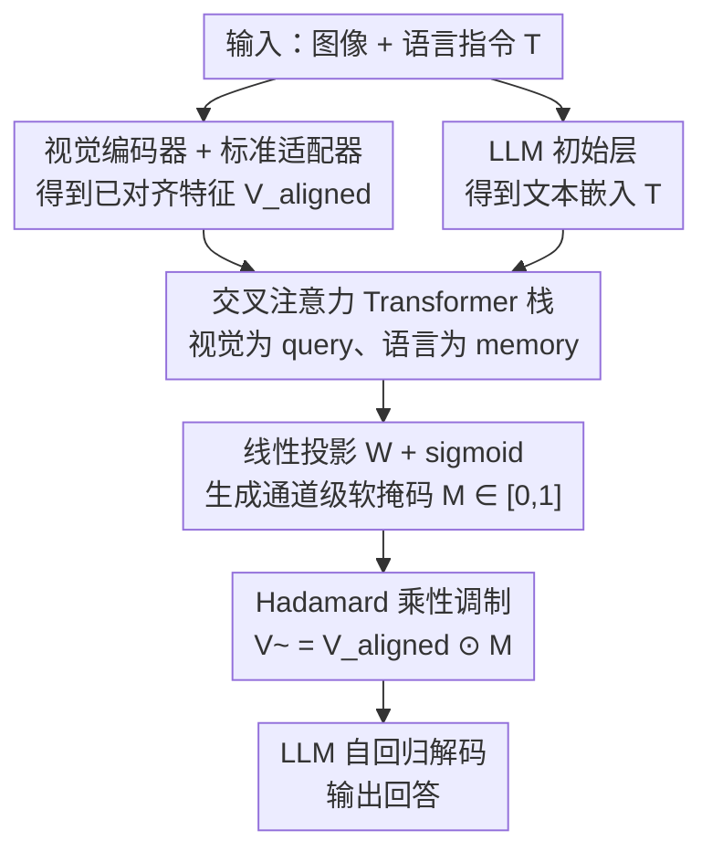

# MoDA: Modulation Adapter for Fine-Grained Visual Grounding in Instructional MLLMs

**会议**: ICML2026  
**arXiv**: [2506.01850](https://arxiv.org/abs/2506.01850)  
**代码**: https://github.com/waybarrios/MoDA  
**领域**: 多模态VLM / 视觉定位 / 指令微调  
**关键词**: 多模态大模型, 通道级调制, 交叉注意力, 视觉定位, 适配器

## 一句话总结
针对 MLLM 因 ViT patch 表示里"多种视觉语义纠缠在一起"而难以做细粒度视觉定位的问题，本文提出轻量模块 MoDA——在已对齐的视觉特征上、由语言指令通过交叉注意力生成一个 $[0,1]$ 的**通道级软掩码**，用 Hadamard 乘法逐通道地放大与指令相关的特征维度、抑制无关维度；它即插即用、不改 MLLM 架构、不需额外监督，在 12 个基准、3 个 MLLM 架构上一致涨点（LLaVA-1.5 上 MMVP +12.0），而开销不到 1% FLOPs。

## 研究背景与动机

**领域现状**：主流 MLLM（如 LLaVA 系列）的范式是"预训练视觉编码器（多为 CLIP）+ 轻量适配器把视觉特征投影进语言空间 + LLM"，靠两阶段指令微调获得跨任务泛化能力。

**现有痛点**：这类模型在**细粒度视觉理解**上频频翻车——需要精确定位、对具体视觉元素细致推理的查询常常答错，表现为幻觉（输出与图像内容矛盾）。前人已把 CLIP 视觉编码器指认为瓶颈：它把图像切成固定 patch，**单个 patch 内常常混入多种语义元素**。文中用一只睡着的法国斗牛犬配毛绒玩具的 3×3 网格举例：patch 5 同时混了狗的躯干、玩具和狗窝，patch 6 混了狗头、耳朵和木地板——于是每个特征维度都编码了多个不相关含义。当遇到"狗的耳朵是什么颜色？""玩具是在床上还是地上？"这类查询时，模型必须从纠缠的表示里把相关信号拆出来，往往失败。

**核心矛盾**：现有缓解手段要么引入多个专用视觉编码器、要么重训 CLIP 以更好保留局部结构，都带来**巨大计算开销或大规模重训**；而从 NLP 借来的注意力掩码方法多是 **token 级稀疏**（选/丢整个 token），或逐层自适应掩码（随网络深度开销暴涨），且**缺乏指令引导的条件化**——没法根据具体语言查询动态调整视觉注意力。

**本文目标**：在**不改 MLLM 架构、不加计算开销**的前提下，让模型能按指令动态聚焦到相关的视觉细节。

**核心 idea**：与其在 token 层面"加性地"选特征（如 Q-Former），不如在**通道层面"乘性地"调制**已对齐的特征——用语言指令通过交叉注意力算出一个逐通道的软掩码，与视觉特征做 Hadamard 乘法，从而精确控制"哪些嵌入维度对当前指令是相关的"。

## 方法详解

### 整体框架

MoDA 是一个插在"预训练适配器之后、LLM 之前"的轻量后处理模块。MLLM 照常用视觉编码器抽 patch 特征、用标准适配器把它投影进语言空间，得到已对齐的视觉特征 $V_{\text{aligned}}$；MoDA 接过 $V_{\text{aligned}}$，以语言查询为条件估出一组逐通道的调制权重，把重加权后的特征再送进 LLM 自回归解码。核心运算只有一行：

$$\widetilde{V}_{\text{aligned}}=V_{\text{aligned}}\odot\sigma\!\left(W\cdot F(T,V_{\text{aligned}})\right)$$

其中 $\odot$ 是沿嵌入维度的 Hadamard 积，$F(\cdot)$ 是依赖文本提示 $T$ 的调制函数，$\sigma$ 是 sigmoid，把掩码值约束到 $[0,1]$。这个掩码因文本而异，于是不同指令会让模型把注意力调向不同的、更有信息量的嵌入维度。

整条流水线本质是"标准 LLaVA 通路 + 一个由指令驱动的通道门"，多模块串行、定位清晰：

### 关键设计

**1. 通道级乘性调制：用 Hadamard 软掩码逐维抑制无关语义**

这是 MoDA 与 Q-Former / InstructBLIP 等方法的本质区别。后者是 **token 级 + 加性**：选择或重加权整个视觉 token（残差式相加）。MoDA 则在**每个 token 内部的嵌入维度（通道）上**操作，用 $[0,1]$ 软掩码做**乘性**调制（$\widetilde{V}=V\odot M$）。为什么乘性 + 通道级能治"语义纠缠"？因为纠缠发生在单个 patch 的特征维度内部——一个 token 的不同通道编码了狗、玩具、地板等不同含义；token 级方法只能整体保留或丢弃这个 token，没法把"狗"留下、"地板"压掉，而逐通道的乘性掩码恰好能**独立地抑制无关维度、放大相关维度**，且乘 0~1 的掩码天然实现"选择性压制"而非"叠加新信息"。同时它作用在已投影特征上，保留了视觉表示的空间结构。

**2. 指令引导的交叉注意力生成掩码：让语言决定看哪些通道**

掩码不是固定的，而是由当前指令算出来的。$F(\cdot)$ 由一**栈交叉注意力 Transformer 层**实现：以已对齐视觉特征 $V_{\text{aligned}}\in\mathbb{R}^{B\times N\times E}$ 作为 target/query 序列，以来自 LLM 初始层的语言 token 嵌入 $T\in\mathbb{R}^{B\times M\times E}$ 作为 memory 输入，每层含多头交叉注意力（让每个视觉 token 去 attend 相关的语言部分）、前馈网络、残差 + LayerNorm。栈输出经线性投影 $W\in\mathbb{R}^{E\times E}$ 与 sigmoid，得到最终的通道掩码 $\mathcal{M}$。正是"视觉去 attend 语言"这一步，把"当前问的是耳朵颜色还是玩具位置"的信息注入掩码，使同一张图在不同问题下被强调的通道不同——这就是"指令条件化"的来源，也是 token 级稀疏方法所缺的。

**3. 即插即用的后对齐定位 + 两阶段训练：零额外监督、极低开销**

MoDA 刻意放在**适配器之后、LLM 之前**这个位置：它假设视觉-语言已经对齐好，只做"指令条件化的精修"，因此**补充而非替换**现有适配器，与标准 MLLM 设计完全兼容。训练沿用 LLaVA 两阶段协议：**阶段一**只训原始视觉适配器（视觉编码器与 LLM 冻结），用自回归语言建模目标做对齐；**阶段二**引入 MoDA（Xavier 初始化），适配器保留阶段一权重，联合微调 MoDA 与 LLM。整个过程**不需要任何额外监督或训练数据**，两阶段学习目标始终是同一个交叉熵：

$$\mathcal{L}_{\text{CE}}=-\sum_{t=1}^{|y|}\log P(y_t\mid y_{<t},\widetilde{V}_{\text{aligned}},T)$$

代价极低——仅增加 $<1\%$ FLOPs、$3.7\%$ 参数，却能稳定涨点，印证"收益来自架构设计而非参数堆叠"。

### 损失函数 / 训练策略

两阶段共用标准自回归交叉熵 $\mathcal{L}_{\text{CE}}$（见上式），不引入任何辅助损失。消融显示加 $L_1$ 辅助损失反而有害（见下表），故 MoDA 默认无辅助监督。阶段一冻结视觉编码器与 LLM、只训适配器；阶段二联合微调 MoDA + LLM，沿用 LLaVA-1.5 同款超参与训练数据以保证公平对比。

## 实验关键数据

在 12 个基准（VQA：GQA / ScienceQA / MMBench / RealWorldQA / ChartQA；视觉中心：LLaVA-Wild / MM-Vet / MMStar / V*Bench / CV-Bench；幻觉：POPE / MMVP）、3 个 MLLM 架构（LLaVA-1.5、LLaVA-MoRE、Qwen3-VL）上评测，指标均为百分比、越高越好。

### 主实验

| 基座 + 编码器 | 基准 | 基线 | +MoDA | 提升 |
|------|------|------|------|------|
| LLaVA-1.5 (Vicuna-7B) | MMVP | 24.0 | **36.0** | **+12.0** |
| LLaVA-1.5 (Vicuna-7B) | POPE | 85.6 | 87.1 | +1.5 |
| LLaVA-1.5 (Vicuna-7B) | RealWorldQA | 44.3 | 53.4 | +9.1 |
| LLaVA-MoRE (SigLIP-S2) | ScienceQA | 77.1 | **81.9** | **+4.8** |
| LLaVA-MoRE (SigLIP-S2) | MMVP | 39.3 | 42.7 | +3.4 |
| Qwen3-VL-2B | ScienceQA | 79.3 | **84.2** | **+4.9** |
| Qwen3-VL-2B | RealWorldQA | 64.7 | 68.8 | +4.1 |
| Qwen3-VL-2B | GQA | 59.4 | 63.2 | +3.8 |

三个家族都一致受益，且**收益随编码器质量放大**：用更强的 SigLIP-S2 时增益最明显（ScienceQA +4.8），说明更丰富的表示给了 MoDA 更多"可被选择性强调"的余地。在非 CLIP 的 Qwen3-VL 上仍稳定涨点（GQA +3.8、ScienceQA +4.9），证明机制是通用的后对齐精修，而非 CLIP 专属补丁。

### 消融实验

表 4 系统对比了 MoDA 的结构（线性 MLP / 交叉注意力 / 自注意力）与是否加辅助 $L_1$ 损失（LLaMA 3.1-8B 基座）：

| MoDA 结构 | 辅助损失 | 视觉编码器 | POPE | GQA | SQA | MMVP | Avg. |
|------|------|------|------|------|------|------|------|
| 无 MoDA（基线） | - | CLIP | 85.1 | 63.6 | 76.3 | 27.3 | 63.1 |
| 线性 MLP | $L_1$ | CLIP | 87.2 | 64.3 | 76.7 | 28.7 | 64.2 |
| 线性 MLP | 无 | CLIP | 86.6 | 64.4 | 77.8 | 28.1 | 64.2 |
| 交叉注意力 | $L_1$ | CLIP | 87.6 | 64.2 | 76.8 | **20.2** | 62.2 |
| 自注意力 | 无 | CLIP | 86.5 | 64.2 | 77.3 | 27.9 | 64.0 |
| **交叉注意力** | **无** | CLIP | 86.3 | 64.4 | 77.8 | 28.7 | **64.3** |
| 无 MoDA（基线） | - | SigLIP-S2 | 86.0 | 64.9 | 77.1 | 39.3 | 66.8 |

### 关键发现
- **交叉注意力 + 无辅助损失最优**：交叉注意力（视觉 attend 语言）优于自注意力与线性 MLP，因为只有交叉注意力真正引入了"指令条件化"。
- **加 $L_1$ 辅助损失有害**：交叉注意力 + $L_1$ 时 MMVP 从 28.7 暴跌到 20.2，说明额外约束会干扰掩码学习，MoDA 默认不加辅助监督是正确选择。
- **增益来自设计而非容量**：仅加 $<1\%$ FLOPs、$3.7\%$ 参数；8B 级 + MoDA 在多项指标上能追平/超过 13B LLaVA-1.5，证明"引导信息流向"比"堆参数"更划算。
- **何时不灵**：Qwen3-VL 上 ChartQA（80.0→79.0）与 V*Bench（77.0→74.9）反而略降——这些编码器已为图表阅读/高分辨率搜索专门优化，留给通道精修的余地很小，与"MoDA 在编码器未充分利用相关通道时收益最大"的机制一致。

## 亮点与洞察
- **把"语义纠缠"精确定位到通道层面**：最大的"啊哈"是想清楚了——纠缠发生在单 token 的特征维度内部，所以解法必须落到通道而非 token；这个诊断直接决定了"乘性 + 通道级 + 后对齐"三选项。
- **乘性 vs 加性的取舍很关键**：用 $[0,1]$ 掩码做 Hadamard 乘法天然实现"选择性压制"，比 Q-Former 的加性残差更适合"去掉无关语义"这一目标，思路可迁移到任何需要"抑制而非叠加"的特征精修。
- **即插即用、零额外监督**：不改架构、不加数据、复用 LLaVA 超参，工程友好度极高，几乎可无痛接到任意两阶段 MLLM 上。
- **收益随编码器变强而放大**：这是个反直觉但很有价值的结论——更强的编码器不是让 MoDA 失业，反而给它更多可调制的"表示余量"。

## 局限与展望
- **对已专门优化的编码器收益有限**：ChartQA、V*Bench 上出现回退，说明当编码器已充分利用相关通道时，MoDA 几乎无用武之地甚至略有干扰。
- **依赖良好的初始对齐**：MoDA 假设适配器输出已对齐，只做精修；若对齐本身很差，通道调制的上限也会受限。
- **掩码可解释性未深挖**：论文给了机制叙事，但对"掩码到底压住了哪些通道、是否对应可解释的语义"缺少定量分析。
- **辅助监督敏感**：加 $L_1$ 即崩，说明掩码训练对额外约束较脆弱，鲁棒训练策略仍有探索空间。

## 相关工作与启发
- **vs Q-Former / InstructBLIP**：它们在 **token 级**注入语言查询做**加性**选择/重加权；MoDA 在**通道级**做**乘性**调制、且**后对齐**插入（补充而非替换适配器），三点都不同。
- **vs LAM（逐层自适应掩码）**：LAM 每层重算掩码、开销随深度暴涨；MoDA 只在适配器后**单次**调制，避免了深度缩放问题。
- **vs EAGLE（重训 CLIP）/ 多编码器融合**：那些方法靠重训或加编码器换取局部结构，开销大；MoDA 不动编码器，用轻量后处理拿到类似收益，且与它们正交可叠加（更好的编码器特征能喂给 MoDA 做更好的通道精修）。

## 评分
- 新颖性: ⭐⭐⭐⭐ 把视觉精修从 token 级加性推进到通道级乘性 + 指令条件化，角度清晰且有诊断支撑。
- 实验充分度: ⭐⭐⭐⭐⭐ 12 基准 × 3 架构（含非 CLIP）+ 结构/损失消融，覆盖全面、含失败案例分析。
- 写作质量: ⭐⭐⭐⭐⭐ 用斗牛犬例子把"语义纠缠"讲得很直观，动机到方法一气呵成。
- 价值: ⭐⭐⭐⭐ 即插即用、低开销、跨架构通用，对细粒度定位/抗幻觉有实用价值。

<!-- RELATED:START -->

## 相关论文

- [\[CVPR 2026\] Hugging Visual Prompt and Segmentation Tokens: Consistency Learning for Fine-Grained Visual Understanding in MLLMs](../../CVPR2026/multimodal_vlm/hugging_visual_prompt_and_segmentation_tokens_consistency_learning_for_fine-grai.md)
- [\[CVPR 2026\] DiG: Differential Grounding for Enhancing Fine-Grained Perception in Multimodal Large Language Models](../../CVPR2026/multimodal_vlm/dig_differential_grounding_for_enhancing_fine-grained_perception_in_multimodal_l.md)
- [\[CVPR 2026\] Beyond Graph Model: Reliable VLM Fine-Tuning via Random Graph Adapter](../../CVPR2026/multimodal_vlm/beyond_graph_model_reliable_vlm_fine-tuning_via_random_graph_adapter.md)
- [\[CVPR 2026\] FAVE: A Structured Benchmark for Fine-Grained Audio-Visual Temporal Evaluation in Multimodal LLMs](../../CVPR2026/multimodal_vlm/fave_a_structured_benchmark_for_fine-grained_audio-visual_temporal_evaluation_in.md)
- [\[CVPR 2026\] OddGridBench: Exposing the Lack of Fine-Grained Visual Discrepancy Sensitivity in Multimodal Large Language Models](../../CVPR2026/multimodal_vlm/oddgridbench_exposing_the_lack_of_fine-grained_visual_discrepancy_sensitivity_in.md)

<!-- RELATED:END -->
