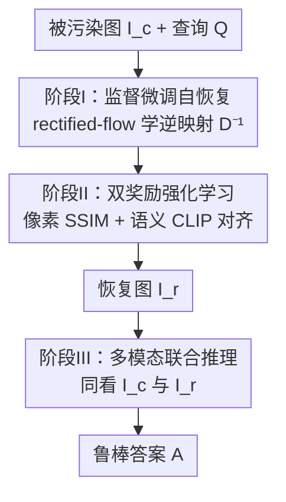

# Robust-U1: Can MLLMs Self-Recover Corrupted Visual Content for Robust Understanding?

**会议**: ICML2026  
**arXiv**: [2606.08063](https://arxiv.org/abs/2606.08063)  
**代码**: https://github.com/jqtangust/Robust-U1  
**领域**: 多模态VLM  
**关键词**: 多模态大模型, 视觉鲁棒性, 自恢复, 统一模型, 强化学习对齐

## 一句话总结
Robust-U1 让统一架构的多模态大模型（MLLM）先把被污染的图像在像素级"自我修复"成干净图、再对照原图和恢复图联合推理，从而在真实退化与对抗退化下都拿到鲁棒理解的 SOTA。

## 研究背景与动机
**领域现状**：MLLM 在视觉理解上表现惊艳，但部署到真实世界时会遇到系统噪声、压缩伪影、恶劣天气等各种**视觉退化（corruption）**，这些退化严重扰乱视觉特征，导致下游任务性能大幅跳水。

**现有痛点**：现有抗退化方法分两派，各有死穴。一派是**黑盒特征对齐**（TeCoA、Robust CLIP、Robust LLaVA 等）——在视觉编码器里用对抗微调把"被污染图"和"干净图"的特征拉近；它能涨点，但缺乏可解释性、也不显式建模退化过程，且依赖有限对抗数据集、泛化差。另一派是**白盒文本推理**（Robust-R1）——用一条显式的文字推理链描述退化类型及其语义影响来增强可解释性；但它被困在**文本模态**里，文字根本无法表示像素级细节，丢失的视觉信息补不回来。

**核心矛盾**：被污染图像真正丢失的是**像素级视觉信息**，而现有方法要么在特征空间隐式对齐（说不清做了什么）、要么用文字描述（补不回像素）——都没有"把丢失的画面真正还原出来"。

**本文目标**：回答一个根本问题——**MLLM 能不能自己把被污染的视觉内容恢复出来？** 若能，就能建立一种更内在的鲁棒性：模型主动还原信息，而不是事后用文字打补丁。

**核心 idea**：用一个**视觉自恢复模块** $\mathcal{D}^{-1}$ 近似退化过程的逆映射，把被污染图 $\mathbf{I}_c$ 还原成恢复图 $\mathbf{I}_r$，再让 MLLM 同时看 $\mathbf{I}_c$ 和 $\mathbf{I}_r$ 做联合推理。

## 方法详解

### 整体框架
形式上，标准理解流程是 $\mathbf{A}_o=\mathcal{F}_{\text{MLLM}}(\mathbf{I}_o,\mathbf{Q};\Theta)$，但真实图像被退化函数污染成 $\mathbf{I}_c=\mathcal{D}(\mathbf{I}_o)$。Robust-U1 的鲁棒模型把流程改写为先恢复、再联合推理：

$$\mathbf{A}=\mathcal{F}_{\text{MLLM}}^{\text{(Robust)}}(\mathbf{I}_c,\mathbf{Q};\Theta)=\mathcal{F}_{\text{MLLM}}\big(\underbrace{\mathcal{D}^{-1}(\mathbf{I}_c)}_{\mathbf{I}_r},\,\mathbf{I}_c,\,\mathbf{Q};\Theta\big),$$

其中 $\mathcal{D}^{-1}$ 是自恢复模块。整套方法建在统一架构 MLLM **BAGEL**（天然兼具理解与生成能力）之上，分三阶段串行训练：阶段 I 用监督微调把 BAGEL 的通用生成能力**专化**成自恢复模块；阶段 II 用带双奖励的强化学习进一步**对齐恢复质量**；阶段 III 训练模型对照污染图和恢复图做**多模态联合推理**。

### 关键设计

**1. 监督微调把统一模型专化成视觉自恢复模块**

针对"现有方法补不回像素"的痛点，本文不另起炉灶训一个修复网络，而是借 BAGEL 已有的生成能力，用一条恢复提示词 $\mathbf{P}_{\text{rec}}$（如"Recover the clean version of this corrupted image."）把它**条件化**成专用的逆退化模块。具体用 **rectified flow** 形式化：图像先编码成隐表示 $\mathbf{Z}_c$，模型学着在 $\mathbf{Z}_c$ 和 $\mathbf{P}_{\text{rec}}$ 条件下，对干净隐表示 $\mathbf{Z}_o$ 的含噪版本去噪，目标为

$$\mathcal{L}_{\text{SFT}}=\mathbb{E}_{t\sim\mathcal{U}(0,1),\,\epsilon\sim\mathcal{N}(0,\mathbf{I})}\big[\|\epsilon-\epsilon_\Theta(\mathbf{Z}_c,\mathbf{Z}_o(t),t,\mathbf{P}_{\text{rec}})\|^2\big],$$

其中 $\mathbf{Z}_o(t)=(1-t)\mathbf{Z}_o+t\epsilon$ 是 $t$ 时刻的含噪隐表示。这个目标直接让模型在隐空间里逆转退化、学到逆映射 $\mathcal{D}^{-1}$；训练数据用大规模真实图像重建集 ImageNet-C。这一阶段把"通用图像生成"变成"专用视觉自恢复"，是整条管线的地基。

**2. 像素—语义双奖励强化学习对齐恢复质量**

只靠监督微调，恢复图在结构和语义保真度上还不够准。本文用 **Flow-GRPO** 做强化学习，把去噪过程建模成马尔可夫决策过程、用组相对策略优化，并设计**两路互补奖励**。一路是**像素级结构奖励**：用 SSIM 在局部 patch 上比较恢复图 $\mathbf{I}_r$ 与真值 $\mathbf{I}_o$ 的亮度、对比度、结构三项，$\mathcal{R}_{\text{pix}}=\text{SSIM}(\mathbf{I}_r,\mathbf{I}_o)\in[0,1]$，值越高结构保真越好。另一路是**语义一致性奖励**：用冻结的 TinyCLIP 抽图像嵌入，先算恢复图与干净图嵌入的余弦相似度 $\text{Sim}$，再转成

$$\mathcal{R}_{\text{sem}}(\mathbf{I}_r,\mathbf{I}_o)=\exp\big(-\alpha\cdot(1-\text{Sim}(\mathcal{M}_{\text{CLIP}}(\mathbf{I}_r),\mathcal{M}_{\text{CLIP}}(\mathbf{I}_o)))\big),$$

相似度为 1 时奖励取最大值 1、随相似度下降指数衰减，$\alpha$ 控制敏感度。优化时对每张污染图采样 $G$ 条轨迹（把确定性 ODE 转成 SDE 引入随机性）、用组归一化算优势，并加 KL 惩罚防止 reward hacking。两路奖励互补——只用像素奖励会过度追求像素完美而牺牲语义丰富度，只用语义奖励像素细节又不够，二者合用才取得最佳整体平衡。

**3. 多模态联合推理：同看污染图与恢复图**

恢复图再好也不是真值，可能引入伪影或语义偏差，因此最后一阶段并不丢掉原始污染图。本文把两张图交错排成序列、后接文本查询 $\mathbf{Q}$，训练模型在二者条件下生成带推理链的答案，最大化目标 token 的似然：

$$\mathcal{L}_{\text{MLLM}}=-\mathbb{E}_{(\mathbf{I}_c,\mathbf{I}_r,\mathbf{Q},\mathbf{A}^*)}\sum_{t=1}^{L}\log P_\Theta(a_t^*\mid a_{<t}^*,\mathbf{I}_c,\mathbf{I}_r,\mathbf{Q}).$$

这样模型学会以恢复图为主理解内容、同时回看污染图来消解歧义——闭合了"感知→修复→推理"的回路，使其在退化下更可靠。消融显示去掉这一联合推理（不看恢复图）overall 从 0.7398 掉到 0.6623，证明联合推理而非单看任一图才是鲁棒理解的关键。

### 损失函数 / 训练策略
三阶段分别用：阶段 I 的 rectified-flow 去噪损失 $\mathcal{L}_{\text{SFT}}$（在 ImageNet-C 上）；阶段 II 的 Flow-GRPO + 复合奖励 $\mathcal{R}_{\text{pix}}+\mathcal{R}_{\text{sem}}$（在 Robust-R1 训练数据上）；阶段 III 的多模态自回归似然 $\mathcal{L}_{\text{MLLM}}$（用 Robust-R1 的推理链数据）。底座 MLLM 为 BAGEL，恢复奖励里的 CLIP 与 SSIM 均冻结/无参。

## 实验关键数据

### 主实验
在真实退化基准 R-Bench（MCQ/VQA/CAP 三类任务、三档退化强度）上，Robust-U1 在所有任务和强度下都取得 SOTA，且退化越严重优势越明显。

| 类别 | 方法 | Overall（R-Bench） |
|------|------|---------|
| 通用 MLLM | Qwen2.5-VL-3B | 0.4845 |
| 通用 MLLM | InternVL-4B | 0.4706 |
| 通用 MLLM | BAGEL（底座） | 0.5770 |
| 鲁棒 MLLM | Robust CLIP | 0.3718 |
| 鲁棒 MLLM | Robust-R1（前 SOTA） | 0.5017 |
| **本文** | **Robust-U1** | **0.7398** |

在对抗退化（对标准 VQA 基准合成多级退化）下，Robust-U1 同样全面领先，且**退化下掉点极小**：MMMB 上从 clean 到 100% 退化仅掉 1.57 分，而 BAGEL 掉 3.44、Robust-R1 掉 6.06。

| 基准 | clean | 100% 退化 | 掉点 |
|------|-------|---------|------|
| Robust-U1 @ MMMB | 84.75 | 83.18 | 1.57 |
| BAGEL @ MMMB | 81.92 | 78.48 | 3.44 |
| Robust-R1 @ MMMB | 81.41 | 75.35 | 6.06 |

### 消融实验
R-Bench overall 上逐组件消融：

| 配置 | Overall | 说明 |
|------|---------|------|
| Baseline（BAGEL） | 0.5770 | 不恢复、不联合推理 |
| **Robust-U1（完整）** | **0.7398** | 全部组件 |
| w/o 多模态联合推理 | 0.6623 | 不看恢复图，掉 7.8 点 |
| w/o $\mathcal{R}_{\text{pix}}$ | 0.7257 | 去像素奖励，结构保真下降 |
| w/o $\mathcal{R}_{\text{sem}}$ | 0.7236 | 去语义奖励，高退化下掉最狠 |

恢复质量（在 Robust-R1 验证集上，PSNR↑/SSIM↑/LPIPS↓）逐阶段递进：BAGEL 14.37/0.4722/0.5092 → +SFT 20.88/0.6135/0.3444 → +$\mathcal{R}_{\text{pix}}$ 21.45/0.6311/0.3299 → 完整 21.49/0.6314/0.3223。

### 关键发现
- **多模态联合推理贡献最大**：去掉后 overall 掉 7.8 点，远超去掉任一奖励，证明"看恢复图推理"是性能主来源。
- **两路奖励分工明确**：$\mathcal{R}_{\text{pix}}$ 主要拉高 PSNR/SSIM（锐化边缘和文字），$\mathcal{R}_{\text{sem}}$ 拿到最佳 LPIPS（保自然纹理与色彩），在高退化下去掉 $\mathcal{R}_{\text{sem}}$ 掉点最严重——退化越重语义正确性越关键。
- **恢复质量直接驱动推理性能**：高保真恢复与更好推理强相关，验证了"自恢复"是鲁棒视觉理解的核心机制。

## 亮点与洞察
- **第一个让 MLLM 显式"自恢复"视觉内容的框架**：跳出"隐式特征对齐 / 纯文本推理"两派，把丢失的像素真正还原出来，是抗退化范式上的质变。
- **复用统一模型的生成能力做修复**：不另训修复网络，而是用提示词把 BAGEL 的生成能力专化成 $\mathcal{D}^{-1}$，思路简洁且省事，可迁移到任何统一理解-生成模型。
- **"保留污染图 + 恢复图"双视图推理**：恢复图不完美时回看原图消歧，这种"主参考 + 兜底校验"的双视图设计可迁移到任何"先增强再理解"的任务。

## 局限与展望
- **依赖统一架构底座**：方法建在 BAGEL 这种兼具理解与生成的统一模型上，纯理解型 MLLM 不能直接套用。
- **三阶段训练管线较重**：SFT + Flow-GRPO RL + 多模态推理三段，外加多套数据集（ImageNet-C、Robust-R1），训练成本与工程复杂度都不低。
- **恢复图可能引入新偏差**：作者也承认像素完美与语义丰富存在权衡，恢复模块在极端退化或分布外退化类型下的可靠性仍待验证。

## 相关工作与启发
- **vs 黑盒特征对齐（TeCoA / Robust CLIP / Robust LLaVA）**：它们在视觉编码器里隐式拉近污染/干净特征，缺可解释性且泛化差；本文显式还原像素，R-Bench overall 0.7398 远超它们的 0.18–0.37。
- **vs 白盒文本推理（Robust-R1）**：Robust-R1 用文字链描述退化、补不回像素，是前 SOTA（0.5017）；本文直接修复视觉内容，全面超越且退化下掉点更小。
- **vs Thinking with Generated Images**：同样涉及生成辅助视觉，但那条线生成的是增强推理的辅助表示，本文专注于**逆转退化、还原被污染内容**，目标不同。

## 评分
- 新颖性: ⭐⭐⭐⭐⭐ 首次提出 MLLM 视觉自恢复范式，跳出隐式对齐与纯文本推理两派
- 实验充分度: ⭐⭐⭐⭐⭐ 真实+对抗两类退化、三类任务、恢复质量与消融齐全
- 写作质量: ⭐⭐⭐⭐ 三阶段动机清晰、公式完整，图文对照到位
- 价值: ⭐⭐⭐⭐⭐ 为安全攸关场景下的鲁棒多模态理解提供了可落地的新机制

<!-- RELATED:START -->

## 相关论文

- [\[ICML 2026\] Self-Captioning Multimodal Interaction Tuning: Amplifying Exploitable Redundancies for Robust Vision Language Models](self-captioning_multimodal_interaction_tuning_amplifying_exploitable_redundancie.md)
- [\[CVPR 2026\] ChartNet: A Million-Scale, High-Quality Multimodal Dataset for Robust Chart Understanding](../../CVPR2026/multimodal_vlm/chartnet_a_million-scale_high-quality_multimodal_dataset_for_robust_chart_unders.md)
- [\[ICML 2026\] DCER: Robust Multimodal Fusion via Dual-Stage Compression and Energy-Based Reconstruction](dcer_dual-stage_compression_and_energy-based_reconstruction.md)
- [\[ICCV 2025\] Synergistic Prompting for Robust Visual Recognition with Missing Modalities](../../ICCV2025/multimodal_vlm/synergistic_prompting_for_robust_visual_recognition_with_missing_modalities.md)
- [\[ICLR 2026\] Directional Embedding Smoothing for Robust Vision Language Models](../../ICLR2026/multimodal_vlm/directional_embedding_smoothing_for_robust_vision_language_models.md)

<!-- RELATED:END -->
