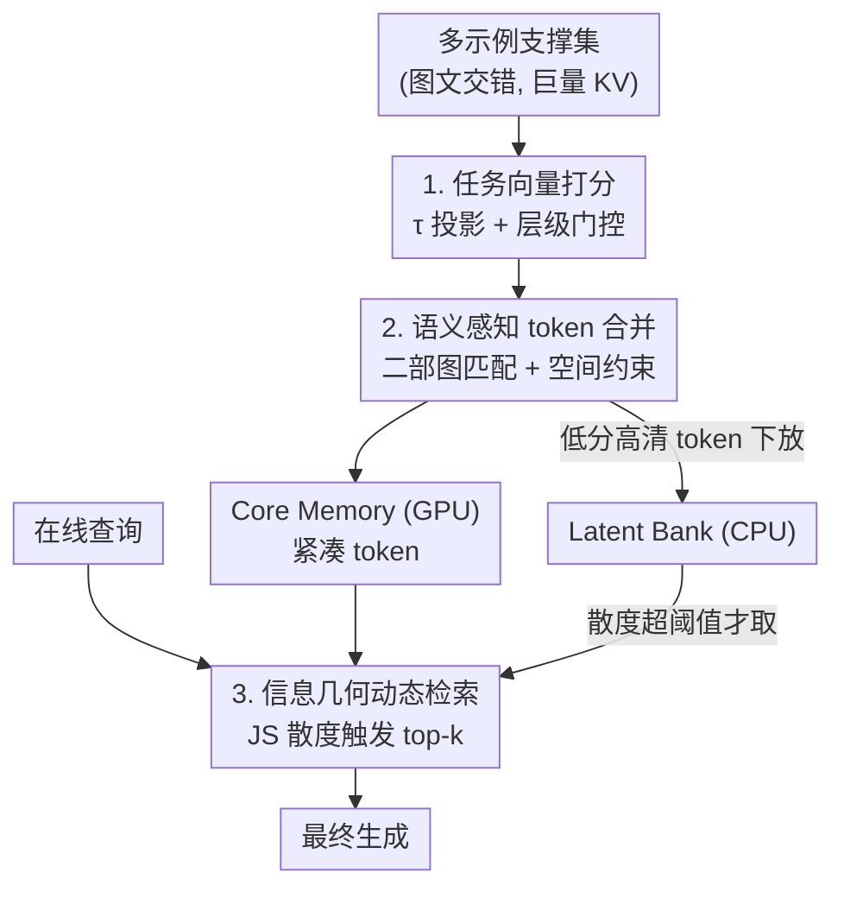

# Task-Aware Structured Memory for Dynamic Multi-modal In-Context Learning

**会议**: ICML 2026  
**arXiv**: [2606.11853](https://arxiv.org/abs/2606.11853)  
**代码**: 待确认  
**领域**: 多模态VLM / KV Cache 压缩 / 多模态上下文学习  
**关键词**: 多模态ICL, KV cache压缩, 任务向量, token合并, 动态检索

## 一句话总结
针对多模态多示例上下文学习里 KV cache 爆炸的问题，TASM 提出一个免训练框架：用"任务向量"而非样本特定注意力来打分（去样本偏差），用二部图匹配做语义感知的 token 合并而非硬剪枝（保住视觉拓扑），再用 JS 散度触发的分层动态检索（让被压掉的细节在需要时还能召回），在压掉最多 80% 显存的同时把性能拉到接近全上下文。

## 研究背景与动机
**领域现状**：多模态大模型（MLLM）靠上下文学习（ICL）快速适配新任务，且性能随示例数呈对数线性增长，"多示例（Many-Shot）"成了替代微调的有力路线，尤其适合数据稀缺任务。

**现有痛点**：多示例 ICL 要处理成千上万张图，产生的 KV cache 把 GPU 显存撑爆、延迟飙升。文本域的 cache 压缩（H2O、SnapKV、PyramidKV）靠"丢掉低注意力 token"的硬剪枝，搬到多模态就翻车——如图文实验所示，EMLoC 这类方法虽省显存，但在空间定位和时序推理任务上掉得厉害。

**核心矛盾**：现有多模态压缩有三个结构性缺陷。① **样本特定偏差**：用某个示例答案的注意力打分会过拟合到那个示例，常把"对该示例没用、但对测试查询关键"的上下文删掉。② **拓扑破坏**：视觉 token 有内在的二维空间/语义结构，Top-K 硬剪枝会撕碎这个信息流形，毁掉定位等任务所需的空间关系。③ **静态记忆僵化**：一旦压完，cache 就定死了，遇到需要细粒度细节的复杂查询时再也无法把丢掉的信息找回来。

**本文目标**：把 KV cache 从"被动缓冲区"重新理解成"任务的结构化表示"，做到任务感知（去样本偏差）、结构保持（不破坏流形）、动态可达（压掉的能召回）。

**切入角度**：重要性是任务相关的，不该由某个示例答案的注意力决定，而该由"任务本身的变换方向"决定；压缩也不该是丢弃，而该是"在保持空间局部性的前提下把信息合并到一起"。

**核心 idea**：任务向量打分 + 语义感知 token 合并 + 信息几何动态检索，三件套全程免训练（training-free）。

## 方法详解

### 整体框架
TASM 是一个免训练框架，分**离线压缩**和**在线推理**两段。离线阶段：冻结的 MLLM 处理支撑集，先从少样本示例里抽出一个全局任务向量 $\boldsymbol{\tau}$，用它给每个缓存 token 打重要性分；高分 token 经语义感知合并（在隐空间 KV 上、不是像素空间）压成紧凑 token 放进常驻 GPU 的 Core Memory，低分的高分辨率 token 则下放到 CPU 上的 Latent Bank。在线阶段：新查询来时，用基于 JS 散度的动态门判断它是否在"看向新的子空间"，是则从 Latent Bank 检索补充上下文再做最终生成。整个过程不更新任何参数。形式上，目标是找一个压缩算子 $\Phi_t:\mathcal{C}_t\to\hat{\mathcal{C}}_t$，在预算约束 $|\hat{\mathcal{C}}_t|\le B\ll T$ 下最小化全上下文与压缩上下文预测分布之间的 KL 散度。

### 关键设计

**1. 任务向量引导的重要性估计：用任务方向而非示例注意力打分**

基于注意力的重要性度量（H2O、EMLoC）容易被"注意力 sink"骗——标点这种注意力高但语义空的 token 会被保留。TASM 主张真正的语义重要性由"与任务变换方向的对齐度"决定。它利用 ICL 上下文里的少样本问答对 $\mathcal{S}_{\text{few}}=\{(\mathbf{Q}^{(n)},\mathbf{A}^{(n)})\}$，在第 $l$ 层算问题和答案表示的语义质心 $\boldsymbol{\mu}_{\mathbf{Q},l}$、$\boldsymbol{\mu}_{\mathbf{A},l}$，把归一化的差向量当作任务向量，它编码了"从问题到答案"的推理方向：

$$\boldsymbol{\tau}_l=\frac{\boldsymbol{\mu}_{\mathbf{A},l}-\boldsymbol{\mu}_{\mathbf{Q},l}}{\|\boldsymbol{\mu}_{\mathbf{A},l}-\boldsymbol{\mu}_{\mathbf{Q},l}\|_2}$$

token 的任务分由它的 key 向任务向量投影得到，再叠一个 value 范数项捕捉信息量：$s_{i,l}^{\text{task}}=\text{ReLU}(\frac{\mathbf{k}_{i,l}^{\top}\boldsymbol{\tau}_l}{\|\mathbf{k}_{i,l}\|})+\gamma\frac{\|\mathbf{v}_{i,l}\|_2}{\max_j\|\mathbf{v}_{j,l}\|_2}$，ReLU 保证只优先与任务正对齐的 token。但浅层处理的是局部高频特征（句法、边缘），只靠任务向量会丢局部上下文，所以再用一个层自适应门 $\lambda(l)$ 在局部注意力分和全局任务分之间插值：$\mathcal{S}_{i,l}=\lambda(l)\cdot s_{i,l}^{\text{task}}+(1-\lambda(l))\cdot s_{i,l}^{\text{attn}}$，其中 $\lambda(l)=\alpha+\beta\cdot\sigma(\kappa(\frac{l}{L}-0.5))$ 是一个平移 sigmoid，让权重从浅层"注意力主导"（$\lambda\approx0.1$）平滑过渡到深层"任务向量主导"（$\lambda\approx0.9$，取 $\alpha{=}0.1,\beta{=}0.8,\kappa{=}10$）。这套打分把"重要性"从单个示例答案解绑，转成捕捉通用推理模式，从根上治样本偏差。

**2. 语义感知 token 合并：把硬剪枝换成保拓扑的图匹配**

传统硬 Top-K 剪枝 $\hat{\mathcal{C}}=\{c_i\mid\text{rank}(S_i)\le K\}$ 对视觉表示是毁灭性的——信息分散在相邻 patch 上，删"冗余"背景 patch 会撕碎卷积式注意力头依赖的二维流形。TASM 把压缩当成图匹配：把 token 分成要保留的高分 Sink 节点 $\mathcal{U}_{\text{sink}}$ 和要合并的低分 Source 节点 $\mathcal{U}_{\text{src}}$，构二部图求最优指派矩阵 $\mathbf{M}$，目标是 $\max_{\mathbf{M}}\sum_{i,j}M_{ij}w_{ij}$ 且每个 source 至多并入一个 sink。关键在边权要带空间约束：对带时空坐标 $\mathbf{p}=(t,h,w)$ 的视觉 token，加一个空间正则 $\Psi(i,j)$，当 $\|\mathbf{p}_i-\mathbf{p}_j\|_1\le\Delta_{\text{win}}$ 时为 0、否则为 $-\infty$，于是统一兼容度 $w_{ij}=\cos(\mathbf{k}_i,\mathbf{k}_j)+\Psi(i,j)\cdot\mathbb{I}(i,j\in\mathcal{V}_{\text{visual}})$ 强制视觉 token 只能和空间邻居合并，保住局部几何。合并不是丢弃而是加权聚合：sink token 更新成其簇的加权质心 $\hat{\mathbf{k}}_j=\frac{1}{Z_j}(\mathbf{k}_j+\sum_{i}M_{ij}e^{w_{ij}}\mathbf{k}_i)$，相当于一个动态池化层，把信息浓缩而非删掉。

**3. 信息几何动态检索：用 JS 散度按需把压掉的细节召回**

为在固定预算 $B$ 下应对近乎无限的上下文，TASM 搭了分层记忆：高带宽的 Core Memory $\mathcal{M}_{\text{core}}$（GPU 常驻）+ 高容量的 Latent Bank $\mathcal{M}_{\text{latent}}$（CPU 下放）。静态/周期检索很浪费，TASM 改用注意力分布的稳定性当触发器：设 $P_{\text{ref}}$ 是 $t-1$ 步对 Core Memory 的注意力分布、$P_t$ 是 $t$ 步的，用对称的 JS 散度 $D_{\text{JS}}(P_t\|P_{\text{ref}})=\frac{1}{2}D_{\text{KL}}(P_t\|\mathcal{D})+\frac{1}{2}D_{\text{KL}}(P_{\text{ref}}\|\mathcal{D})$（$\mathcal{D}$ 是两者的混合分布）衡量分布漂移。散度高意味着当前查询在看向一个新子空间、需要去 Latent Bank 取料。于是定义二值检索门 $g_t=\mathbb{I}(D_{\text{JS}}>\epsilon)$，触发时对 Latent Bank 做 top-$k$ 检索取回相关历史 token，把当步有效 cache 动态扩展成 $\mathcal{C}_t=\mathcal{M}_{\text{core}}\cup\mathcal{K}_{\text{retrieved}}$。这样只在语义上确有必要时才访问长期历史，大多数生成步维持 $\mathcal{O}(1)$ 平均复杂度，整体注意力复杂度从 $\mathcal{O}(T^2)$ 降到 $\mathcal{O}(T\cdot(N_{\text{core}}+N_{\text{ret}}))$，由于预算有界即准线性扩展。

### 一个完整示例
设一次多示例图像分类用了 200 个示例：离线时，MLLM 先从这 200 个问答对算出"视觉提取→类别判定"方向的任务向量 $\boldsymbol{\tau}$；每个视觉 token 按对 $\boldsymbol{\tau}$ 的投影 + value 范数打分，浅层还掺入局部注意力分。打完分后做语义合并——背景 patch 不再被删，而是和它 $3\times3$ 邻域内的高分 patch 合并成质心 token 进 Core Memory（预算 20%），高分辨率原 token 下放 Latent Bank（40%）。在线时来一个"图里左上角小物体是什么"的查询：若它的注意力分布相对上一步 JS 散度超过 $\delta{=}0.002$，门触发，从 Latent Bank top-96 召回那块被压掉的高清细节拼回 cache，再生成答案；若是常规查询则只用 Core Memory，省去检索。整条链上没有任何参数被更新。

## 实验关键数据

### 主实验
以 Qwen2-VL-7B-Instruct 为基座（也在 LLaVA-NeXT-Video、InternVL3 上验证泛化），在 4×A800（80GB）上跑，覆盖九个视觉-语言基准。关键超参：组合式任务向量抽取插值权重 $\alpha{=}0.3$；语义合并空间窗 $3\times3$、相似度阈 0.5；分层记忆 Core 20% / Latent Bank 40%；JS 散度超 $\delta{=}0.002$ 时取 top-96。对比 Full-Context、EMLoC、SnapKV、FastV、SparseVLM。

| 任务（200示例） | MLoC(全上下文) | EMLoC | TASM(本文) |
|------|------|-------|------|
| ImageNet100 | 62.6 | 63.6 | **65.0** |
| ScreenSpot(空间) | 18.2 | 18.3 | **19.5** |
| MME-RealWorld | 41.1 | 42.2 | **43.5** |
| IllusionVQA | 40.9 | 40.9 | **42.0** |
| OK-VQA | 58.6 | 58.7 | **60.1** |
| YouCook2(时序) | 108.8 | 102.0 | **109.5** |
| 平均上下文长(ImageNet100) | 16264 | 3643 | 3485 |

在 ImageNet100 上 TASM 把平均上下文从 16264 压到 3485（**降 78.6%**）。EMLoC 在时序任务 YouCook2 上掉到 102.0，TASM 不仅补回还反超全上下文到 109.5，且显存更低（6060 vs EMLoC 6218 token）——说明动态检索召回细粒度时序细节比静态剪枝更高效。空间敏感的 ScreenSpot 上 19.5 vs 18.3 的明显优势，印证了硬剪枝破坏视觉流形、而语义合并保住拓扑的假设。

### 消融实验（V-NIAH 长上下文压力测试）
Visual Needle-in-a-Haystack 用来压力测"从海量上下文里检索细粒度视觉细节"的能力：

| 方法 | 10图 | 50图 | 100图 | 200图 | 平均 |
|------|------|------|-------|-------|------|
| Full Context | 96.5 | 94.2 | OOM | OOM | - |
| SparseVLM | 85.2 | 42.1 | 15.6 | 8.4 | 37.8 |
| FastV | 82.4 | 38.5 | 12.3 | 7.1 | 35.1 |
| EMLoC | 91.0 | 68.3 | 35.2 | 18.9 | 53.4 |
| TASM(本文) | **95.8** | **80.4** | **49.1** | **45.5** | **67.7** |

全上下文在 100 图就 OOM，硬剪枝类（SparseVLM/FastV）在 haystack 变大时崩盘（200 图掉到个位数），EMLoC 也掉到 18.9，而 TASM 在 200 图还有 45.5，平均 67.7 远超所有基线——动态检索 + 保拓扑合并在极长上下文下优势被进一步放大。

### 关键发现
- 多示例缩放律（ImageNet-100，0→300 示例）：EMLoC 在 200→300 示例时饱和甚至下滑（63.7%→62.6%），说明硬剪枝在超长上下文会误删关键语义；TASM 维持对数线性增长，300 示例达峰值 66.8%。
- 三件套各司其职：任务向量治样本偏差、语义合并保空间拓扑（ScreenSpot 受益最明显）、动态检索救时序细节（YouCook2 反超全上下文）。
- 免训练 + 主用消费级/常见硬件即可跑长上下文适配，是很强的工程实用点。

## 亮点与洞察
- **"任务方向"取代"示例注意力"**：用问答质心差向量当任务向量来打 KV 重要性，从根上避开注意力 sink 和样本过拟合，这个视角把任务向量从"steering 权重"挪到"管理记忆"是个新颖且自然的迁移。
- **压缩=合并而非删除**：把硬剪枝改写成带空间约束的二部图匹配，强制视觉 token 只和空间邻居合并、再做加权质心聚合，既省显存又保住二维流形——这是它在空间/时序任务上不掉点的关键。
- **JS 散度当检索触发器**：用注意力分布的漂移来判断"该不该去翻长期记忆"，把检索从周期式变成按需式，让多数生成步保持 $\mathcal{O}(1)$，思路很信息几何、也很省。
- **全程免训练**：三个模块都不动参数，可直接套在任意冻结 MLLM 上，落地门槛低，可迁移到其他长上下文多模态推理场景。

## 局限与展望
- 任务向量靠少样本问答质心估计，依赖上下文里存在清晰的 Q/A 划分；对没有明确问答结构或任务方向漂移大的场景，质心差向量的代表性存疑。
- 一堆超参（$\alpha,\gamma,\kappa$、空间窗 $\Delta_{\text{win}}$、相似度阈、Core/Bank 比例、JS 阈 $\delta$、top-$k$）由经验消融定，跨任务/跨基座的鲁棒性和调参成本论文未充分展开。
- Latent Bank 放在 CPU，触发检索时的 CPU↔GPU 搬运延迟在高频触发场景可能成为新瓶颈，论文主要报上下文长/显存，端到端 wall-clock 延迟的细化分析较少。
- 改进方向：让任务向量随生成在线更新以适配任务漂移；或把 JS 触发阈值做成自适应而非固定，平衡召回质量与搬运开销。

## 相关工作与启发
- **vs EMLoC（多模态主基线）**: EMLoC 用"答案感知注意力"检索 + 硬剪枝，带样本偏差且会切断视觉依赖；TASM 用任务向量（去偏差）+ 语义合并（保拓扑）+ 动态召回，全面占优，尤其在空间/时序/超长上下文。
- **vs H2O / SnapKV / PyramidKV（文本 KV 剪枝）**: 它们靠丢低注意力 token 在纯文本有效，但硬剪枝破坏视觉二维拓扑，搬到多模态翻车；TASM 针对视觉流形专门设计空间约束合并。
- **vs Huang et al.（任务向量）**: 对方用任务向量在推理时 steering 模型权重，TASM 首次把同一概念用于记忆管理——拿任务向量估计 KV 重要性来压缩 cache，而不改参数。

## 评分
- 新颖性: ⭐⭐⭐⭐⭐ 任务向量管记忆 + 保拓扑合并 + JS 触发检索三个角度都新且自洽
- 实验充分度: ⭐⭐⭐⭐ 九基准 + V-NIAH 压力测 + 缩放律 + 多基座泛化，较全面，wall-clock 延迟分析偏少
- 写作质量: ⭐⭐⭐⭐ 三缺陷→三创新的逻辑清晰，公式完整，图文对照好
- 价值: ⭐⭐⭐⭐⭐ 免训练、压 80% 显存接近全上下文，对落地多示例多模态 ICL 很实用

<!-- RELATED:START -->

## 相关论文

- [\[CVPR 2026\] TempR1: Improving Temporal Understanding of MLLMs via Temporal-Aware Multi-Task Reinforcement Learning](../../CVPR2026/multimodal_vlm/tempr1_improving_temporal_understanding_of_mllms_via_temporal-aware_multi-task_r.md)
- [\[ICLR 2026\] TableDART: Dynamic Adaptive Multi-Modal Routing for Table Understanding](../../ICLR2026/multimodal_vlm/tabledart_dynamic_adaptive_multi-modal_routing_for_table_understanding.md)
- [\[ICML 2026\] CyberJurors: A Multi-Agent Simulation Task for E-Commerce Disputes Verdict](cyberjurors_a_multi-agent_simulation_task_for_e-commerce_disputes_verdict.md)
- [\[CVPR 2026\] Cluster-aware Anchor Learning for Multi-View Clustering](../../CVPR2026/multimodal_vlm/cluster-aware_anchor_learning_for_multi-view_clustering.md)
- [\[ICLR 2026\] Multi-modal Data Spectrum: Multi-modal Datasets are Multi-dimensional](../../ICLR2026/multimodal_vlm/multi-modal_data_spectrum_multi-modal_datasets_are_multi-dimensional.md)

<!-- RELATED:END -->
