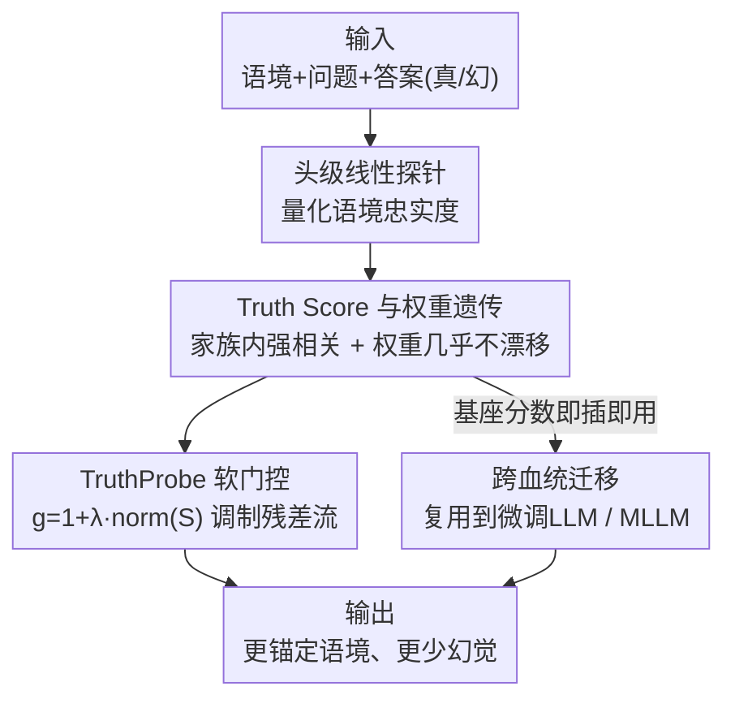

# The Truth Stays in the Family: Enhancing Contextual Truthfulness via Inherited Heads in Model Lineages

**会议**: ICML2026  
**arXiv**: [2606.15821](https://arxiv.org/abs/2606.15821)  
**代码**: https://github.com/miso-choi/TruthProbe  
**领域**: 多模态VLM  
**关键词**: 幻觉缓解, 注意力头探针, 模型血统, 软门控, 语境忠实度

## 一句话总结
作者发现「编码语境忠实度的注意力头」在同一基座衍生出来的 LLM/MLLM 之间会被**遗传**下来，于是提出 TruthProbe——一种用头级 Truth Score 做软门控的即插即用机制，从基座 LLM 探出的分数可以直接迁移给它的微调 LLM 和多模态后代，在 HaluEval / POPE / CHAIR 上同时降低幻觉。

## 研究背景与动机
**领域现状**：现在的多模态大模型（MLLM）几乎都不是从零训的，而是在一个共享的基座 LLM（Vicuna、Qwen2.5、LLaMA2、Mistral 等）上做指令微调或多模态扩展得到的，于是形成了一棵棵「模型血统树」（LLaVA-1.5 / LLaVA-NeXT 都源自 Vicuna-7B，Qwen2.5-VL-Instruct / Omni 都源自 Qwen2.5）。

**现有痛点**：幻觉——生成与语境不符或事实错误的内容——是这些模型落地的最大瓶颈。已有的缓解方法（对比解码、表示干预、ITI 等）几乎都把每个模型当成**孤立个体**单独去修，需要对每个后代模型重新分析、重新调参，既贵又不成体系。

**核心矛盾**：没人去问一个更根本的问题——基座 LLM 和它的下游变体之间，是否存在一种**持续的、可继承的行为联系**？如果某些注意力头在基座里就负责「把答案锚定在语境上」，那这种功能在微调后会不会被保留下来？如果会，就能从基座一次性解决整个家族的可靠性，而不是一个一个打补丁。

**切入角度**：作者假设——存在一批专门编码「语境忠实信息」的注意力头，且这种「忠实特质」在血统内被保留。验证手段是借鉴 ITI 的线性探针思路，量化每个头的语境忠实度。

**核心 idea**：先用线性探针给每个头打一个 Truth Score，证明这个分数在家族内强相关（遗传性）、并由参数权重几乎不漂移来解释；再把 Truth Score 当软门控放大忠实头、抑制不可靠头，且基座的分数可「即插即用」迁移给后代。

## 方法详解

### 整体框架
整个工作分三步走：**先量化、再发现遗传、最后用遗传做干预**。第一步用线性探针给每个注意力头打 Truth Score（衡量这个头有没有把答案锚定在给定语境上）；第二步在多个家族里对比这些分数，发现它们在血统内高度相关、并用「权重几乎不漂移」给出机制解释；第三步提出 TruthProbe——把 Truth Score 变成残差流上的软门控系数，放大忠实头、压低不可靠头，而且基座 LLM 探出的分数可以直接拿去门控它的微调 LLM 和 MLLM 后代，不必对每个后代重新探针。

### 关键设计

**1. Truth Score：用线性探针量化每个注意力头的语境忠实度**

痛点是「哪些头在负责语境忠实」此前没有可量化的抓手。作者把输入结构化为 $x=\{x_{\text{context}}, x_{\text{question}}, x_{\text{answer}}\}$，其中 $x_{\text{context}}$ 可以是文本世界知识或真实图像，$x_{\text{answer}}$ 则成对地给出**真实答案**和**幻觉答案**。在自回归模型里，最后一个答案 token 的位置积累了前文所有信息，于是作者在每个头的这个位置上抽取激活，训练一个二分类线性探针去判断「这个头到底是可靠地吸收了语境、还是给出误导信息」，把探针的验证准确率定义为该头的 Truth Score。分数高意味着该头输出里**线性可解码**地携带了区分真假答案的信号。这个度量和 ITI 等只看「参数知识检索」的工作不同——它专门衡量头有没有 grounding 在**给定语境**上，这对 MLLM 尤其关键，因为真实答案常常依赖图里的视觉证据。

**2. 真实头的家族遗传性，且由权重几乎不漂移来解释**

这是全文最核心的发现。作者在 Vicuna 家族（Vicuna-7B → LLaVA-1.5 / LLaVA-NeXT）和 Qwen2.5 家族里对比头级 Truth Score 分布，结论是：同一血统内分数高度相关。单数据集探针下基座与多模态后代的相关性约 $0.77$–$0.98$；即便用**完全不同的数据源和模态**做跨数据集探针，家族内相关性仍有约 $0.51$–$0.64$，而无关家族（Vicuna vs Mistral-7B）几乎为零（$0.04$–$0.08$）。这说明忠实头不是所有预训练模型共享的普适结构，而是**血统特异**的。为什么会被保留？作者用层级权重漂移（Frobenius 范数）给出机制解释：家族内微调的平均权重漂移极小（$\approx 0.03$），跨家族则大得多（$\approx 1.01$）；而且漂移主要集中在浅层，忠实头偏偏位于中深层（LLaVA-1.5 中 Top-20 忠实头有 80% 落在第 10–31 层）——它们恰好待在「微调几乎不动」的区域，所以分数被原样继承。这和 LoRA、BitFit 等「微调是低秩、局部更新」的既有发现一致。

**3. TruthProbe 软门控 + 跨血统迁移**

有了 Truth Score，怎么用它降幻觉？作者不做硬掩码（直接丢弃不可信头的信息会损失多头注意力的表达力），而是软门控：在第 $l$ 层把注意力输出 $o_l$ 拆成头级分量 $o_l^h \in \mathbb{R}^{n_h \times d_h}$，每个分量乘上门控系数后再拼接加回残差流，

$$x_{l+1} = x_l + \text{Concat}_{h=1}^{H}\left(g_l^h \cdot o_l^h\right), \qquad g_l^h = 1 + \lambda \cdot \text{norm}(S)$$

其中 $S$ 是归一化后的 Truth Score，$\lambda$ 控制强度。分数越高的头被放大到基线（系数 1）以上，越低的头被相对压低，但**所有头都保持激活**，只是按忠实度成比例调制贡献，从而保留表示多样性的同时把残差流推向语境忠实的信号。关键的「迁移」在于：因为分数被遗传，所以从基座 LLM（Vicuna-7B / Qwen2.5）探出的 Truth Score 可以当成即插即用的软门，直接拿去门控它的微调后代——实验里 $\text{TruthProbe}_{\text{LLM}}$（用基座分数）的效果与 $\text{TruthProbe}_{\text{MLLM}}$（直接探后代）相当，意味着一套基座分数能服务多个衍生 MLLM。

### 损失函数 / 训练策略
TruthProbe 本身**无需训练模型参数**：Truth Score 来自轻量线性探针（仅需小样本——LLM 用 292 条 HaluEval、MLLM 用 2726 条 RLHF-V 的 QA 子集，全部 5 折交叉验证），门控只是一个推理期的乘性缩放。归一化方式按基准选：HaluEval/CHAIR 用中心化归一，POPE 用 min-max 归一；所有输出用贪心解码。

## 实验关键数据

### 主实验
LLM 自门控（把模型自己的 Truth Score 加回自己）验证分数确实抓住了忠实度；HaluEval F1 大幅提升：

| 模型 | 指标 | Baseline | + TruthProbe$_{\text{LLM}}$ |
|------|------|----------|------------------------------|
| Vicuna-7B | F1 | 13.37 | 29.15 |
| Vicuna-7B | Recall | 9.44 | 25.30 |
| Qwen2.5 | F1 | 36.69 | 46.54 |
| Qwen2.5 | Recall | 41.96 | 56.59 |

MLLM 上把**基座分数**迁移过去（POPE 看 Acc/Recall、CHAIR 看幻觉率，越低越好）：

| 模型 | 基准 | 指标 | Baseline | + TruthProbe$_{\text{LLM}}$（基座迁移） |
|------|------|------|----------|------------------------------------------|
| LLaVA-1.5 | POPE(COCO) | Recall | 79.1 | 80.1 |
| LLaVA-1.5 | CHAIR | CHAIR$_I$ ↓ | 6.99 | 5.36 |
| LLaVA-1.5 | CHAIR | CHAIR$_S$ ↓ | 23.00 | 17.40 |
| LLaVA-NeXT | POPE(COCO) | Acc | 87.7 | 88.3 |
| LLaVA-NeXT | CHAIR | CHAIR$_I$ ↓ | 6.91 | 4.94 |
| Qwen2.5-VL-Omni | POPE(COCO) | Acc | 85.1 | 87.3 |

### 消融与分析

| 配置 | 关键观察 | 说明 |
|------|---------|------|
| 软门控 vs 硬掩码 | 软门控更优 | 硬掩码丢信息、损多头表达力，软门控保留全部头 |
| TruthProbe$_{\text{LLM}}$ vs TruthProbe$_{\text{MLLM}}$ | 二者相当 | 证明基座分数可迁移，无需逐后代探针 |
| 跨家族相关性 | 近零（0.04–0.08） | 忠实头是血统特异、非普适共享 |
| 权重漂移 | 家族内 0.03 / 跨家族 1.01 | 用参数保留解释分数为何被遗传 |

### 关键发现
- POPE 上的提升主要体现在 **Recall**：软门控放大了语境忠实头，让模型更愿意承认图中存在的物体，而非保守地否认。
- 遗传性 + 权重不漂移给出了一条干净的因果链：忠实头位于中深层 → 微调几乎不动这些层 → 分数被原样继承 → 基座分数能直接复用。
- 注意力叠加可视化显示，高 Truth Score 的头会关注**与查询相关的视觉证据**，低分头则呈现弱语义注意，说明分数捕捉的是有功能意义的 grounding 行为，而非统计假象。

## 亮点与洞察
- **把「血统」当成一等公民**：以往幻觉缓解都按单模型来，这篇第一次系统论证「可靠性机制可以沿模型家族遗传」，从而把逐模型打补丁变成家族级一次到位——这个视角本身比具体方法更有价值。
- **遗传性有机制证据而非只看相关性**：用层级 Frobenius 权重漂移 + 忠实头层位分布，给「为什么能继承」补上了参数层面的解释，不是只甩一张相关性热图。
- **即插即用、零额外训练**：只需小样本线性探针 + 推理期乘性门控，$g_l^h = 1+\lambda\cdot\text{norm}(S)$ 极轻量，可直接套到任何同血统的后代上，工程上很友好。

## 局限与展望
- 软门控的强度 $\lambda$ 和归一化方式需按基准手工选（HaluEval/CHAIR 用中心化、POPE 用 min-max），跨任务自动定标尚未解决。
- 遗传性的结论建立在「微调是低秩/局部更新」这一前提上；若后代经历了大幅度的继续预训练或架构改动，权重漂移变大，分数是否还能迁移存疑。
- 主要在 7B 规模、几个代表性家族上验证；HaluEval 上的绝对 Acc 仍不高（Vicuna 仅 ~38），说明软门控是「相对改善」而非彻底解决幻觉。
- 改进方向：把探针扩展到 MLP / 残差流而不止注意力头；探索一次探针、多代复用的标准化流程。

## 相关工作与启发
- **vs ITI（Inference-Time Intervention）**：ITI 也用线性探针找「真实方向」并干预，但关注的是参数知识检索、且按单模型做；本文专门探「语境忠实」、并把发现升级为「分数可沿血统迁移」的软门控。
- **vs 对比解码 / 视觉对比类幻觉缓解**：那些方法在解码阶段调整 logits、需逐模型适配；TruthProbe 在残差流做头级软门控，且基座一次探针即可服务整个家族。
- **vs LoRA / BitFit 等高效微调**：本文复用了它们「微调只动低秩、局部参数」的结论，反过来用它解释忠实头为何被保留——是把高效微调的观察用到了可解释性/可靠性上。

## 评分
- 新颖性: ⭐⭐⭐⭐⭐ 「忠实头沿模型血统遗传」是一个全新且被验证的视角
- 实验充分度: ⭐⭐⭐⭐ 覆盖多家族 + 三基准 + 权重机制证据，但绝对幻觉指标仍有限
- 写作质量: ⭐⭐⭐⭐ 「量化→发现遗传→用遗传干预」三步逻辑清晰
- 价值: ⭐⭐⭐⭐⭐ 即插即用、零训练、可家族级复用，落地价值高

<!-- RELATED:START -->

## 相关论文

- [\[ICML 2026\] Referring Multiple Regions with Large Multimodal Models via Contextual Latent Steering](referring_multiple_regions_with_large_multimodal_models_via_contextual_latent_st.md)
- [\[CVPR 2025\] Your Large Vision-Language Model Only Needs a Few Attention Heads for Visual Grounding](../../CVPR2025/multimodal_vlm/your_large_vision-language_model_only_needs_a_few_attention_heads_for_visual_gro.md)
- [\[ECCV 2024\] The Hard Positive Truth About Vision-Language Compositionality](../../ECCV2024/multimodal_vlm/the_hard_positive_truth_about_visionlanguage_compositionalit.md)
- [\[ACL 2026\] From Heads to Neurons: Causal Attribution and Steering in Multi-Task Vision-Language Models](../../ACL2026/multimodal_vlm/from_heads_to_neurons_causal_attribution_and_steering_in_multi-task_vision-langu.md)
- [\[CVPR 2026\] VLM4RSDet: Collaborative Optimization with Vision-Language Model for Enhancing Remote Sensing Object Detection](../../CVPR2026/multimodal_vlm/vlm4rsdet_collaborative_optimization_with_vision-language_model_for_enhancing_re.md)

<!-- RELATED:END -->
