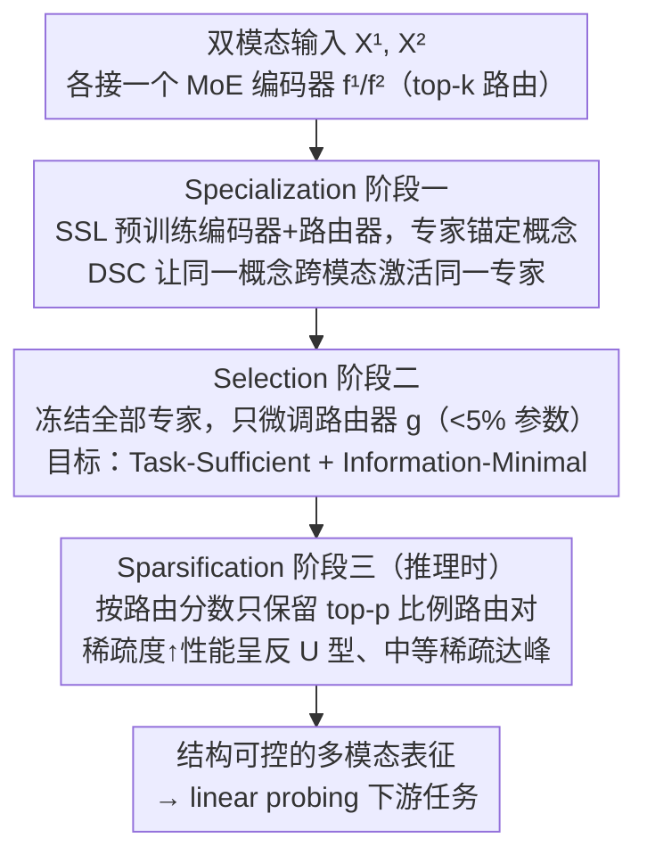

# Toward Structural Multimodal Representations: Specialization, Selection, and Sparsification via Mixture-of-Experts

**会议**: ICML 2026  
**arXiv**: [2605.03348](https://arxiv.org/abs/2605.03348)  
**代码**: 无  
**领域**: 多模态VLM / MoE / 表示学习  
**关键词**: 多模态表示, MoE, 任务充分性, 信息最小性, 推理时剪枝

## 一句话总结
本文提出 S3 框架，用 MoE 把多模态表征分解为概念级专家（Specialization）、按任务路由激活相关专家（Selection）、并在推理时按路由分数剪枝低贡献路径（Sparsification），在四个 MultiBench 基准上揭示了一条"性能在中间稀疏度达峰"的反 U 型曲线，给出对比学习/InfoMax 之外第三种多模态表征范式。

## 研究背景与动机

**领域现状**：多模态表征学习两大主流范式——对比学习（CLIP/AudioCLIP 等）把配对模态映射到共享空间最大化跨模态互信息；InfoMax 风格方法（FOCAL、DisentangledSSL、JointOpt）则希望同时保留共享 + 模态独有信息。两者目标都是"学一个固定 embedding"。

**现有痛点**：对比学习有理论上限——其最优解的互信息只与共享因子 $X_S$ 的熵 $H(X_S)$ 有关（命题 2.3），任务一旦依赖模态独有因子 $X_U^m$，对比表征就达不到 Bayes 最优；InfoMax 虽然可以做到 task-sufficient，但同时也最大化了 $I(Z^m;X^m|Y)$，把大量任务无关信息也留下来，违反 InfoMin 原则、在下游分类反而拖后腿。

**核心矛盾**：单一 monolithic embedding 同时承担"对齐 + 保留差异 + 适应任务变化"这三种相互冲突的需求；样本与任务的相关因子组合多变，但表征却是固定的，无法按需取舍。

**本文目标**：构造既 **Task-Sufficient**（$I(Z_Y^{1*},Z_Y^{2*};Y)=I(X^1,X^2;Y)$）又 **Information-Minimal**（$I(Z_Y^{1*},Z_Y^{2*};X^1,X^2|Y)=0$）的多模态表征，并在样本/任务级别可调可控。

**切入角度**：把目光从"调优目标函数"转向"加结构归纳偏置"——把表征空间显式拆成一组概念子空间 $\mathcal{Z}=\bigoplus_{c\in\mathcal{C}}\mathcal{Z}_c$，每个子空间由一个 MoE expert 实现；同一个潜在概念在不同模态下应该激活相同的专家（提出 Distributional Semantic Coherence），从而实现"概念级"而非"实例级"的跨模态对齐。

**核心 idea**：把 MoE 重新解读为语义专精化的工具（而非单纯参数扩容），用三阶段流水线 Specialization → Selection → Sparsification 分别解决"如何构造语义专家空间"、"如何按任务激活相关专家"、"如何在推理时剪枝冗余路径"，达到结构上可控的 Task-Sufficient + Information-Minimal 多模态表征。

## 方法详解

### 整体框架
对两个模态分别用 MoE encoder $f^1,f^2$，每个 MoE 层有 $N_{\mathrm{expert}}=\chi\cdot\rho$ 个专家（粒度 $\chi$ + 扩展比 $\rho$），路由器 $g$ 用 top-$k$ softmax 决定每个 token 走哪些专家：$g(\mathbf{x})=\mathrm{TOP}_k(\mathrm{softmax}(\mathbf{W}_g\mathbf{x}))$，输出 $\mathrm{MoE}(\mathbf{x})=\sum_i g(\mathbf{x})_i e_i(\mathbf{x})$。三阶段串联：阶段一 SSL 预训练 encoder + router；阶段二只 fine-tune router；阶段三推理时剪枝。

### 关键设计

**1. Specialization：先把表征空间预训练成一组"概念专家"，并让跨模态对齐发生在专家级**

单一 monolithic embedding 要同时对齐、保留差异、适应任务变化，本就冲突；这里先用 MoE 把表征空间显式拆成概念子空间，让每个 expert 锚定一个语义概念。训练目标是 $\max_{f^1,f^2}[I(Z^1;X^1)+I(Z^2;X^2)]$ 并受 DSC 约束（命题 3.4：对所有可共享概念 $c$，$p(\pi_c(Z^1)|c\in C^1)=p(\pi_c(Z^2)|c\in C^2)$），互信息用 InfoNCE 下界估计。loss 分三块：模态内 $\mathcal{L}_{\mathrm{rep}}=\tfrac12(\mathcal{L}_{\mathrm{InfoNCE}}^{[1\to1]}+\mathcal{L}_{\mathrm{InfoNCE}}^{[2\to2]})$ 保多样性，跨模态 $\mathcal{L}_{\mathrm{dsc}}=\tfrac12(\mathcal{L}_{\mathrm{InfoNCE}}^{[1\to2]}+\mathcal{L}_{\mathrm{InfoNCE}}^{[2\to1]})$ 隐式对齐概念激活模式，辅助路由损失 $\mathcal{L}_{\mathrm{aux}}$ 防 expert collapse、鼓励均衡且自信的激活。InfoNCE 本是 instance-level，但它的对比信号会隐式塑造 expert 激活分布、把同义概念聚到同一 expert；显式概念分解 + DSC 让对齐发生在"专家级"而非"特征向量级"，模态独有部分自然走该模态独占的 expert。

**2. Selection：冻住所有 expert，只 fine-tune 路由器做任务自适应**

常规 fine-tune 会把 encoder 也动了，破坏阶段一辛苦学到的语义专家结构。这里只调占总参数极小份额（<5%）的 router $g$，目标 $\max_g[I(Z_Y^1,Z_Y^2;Y)-\alpha\cdot I(Z_Y^1,Z_Y^2;X^1,X^2|Y)]$ 同时追求 Task-Sufficiency 和 Information-Minimality。第一项（充分性）用 SupCon loss 近似——同 label 样本互相拉近，命题 E.2 证它是 task-conditioned MI 的有效下界：$\mathcal{L}_{\mathrm{SupCon}}^{[m\to\bar m]}=-\mathbb{E}_{i,s\in\mathcal{S}_{y_i}}\log\frac{\exp(\langle z_i^m,z_s^{\bar m}\rangle/\tau)}{\sum_j\exp(\langle z_i^m,z_j^{\bar m}\rangle/\tau)}$；第二项（最小性）$I(Z;X|Y)=\mathbb{E}_{p(x,y)}[D_{KL}(p(z|x)\|p(z|y))]$ 在 InfoNCE 后特征落在球面上时用 vMF 近似，化简成内积型 compactness loss $\mathcal{L}_{\mathrm{Comp}}^{[m\to\bar m]}=-\mathbb{E}[\langle\mu_x^m,\hat\mu_y^{\bar m}\rangle]$，把样本拉向所属类的球面 mean。这样"学到什么"（fixed semantic basis）和"任务上用什么"（task-dependent selector）被严格解耦，效果类似 prompt tuning 但目标更结构化。

**3. Sparsification：推理时按路由分数剪枝，把信息最小化做成一个旋钮**

阶段二训完后，router 分数本身就是"input-expert 对任务的贡献度估计"，而常规 MoE 固定 top-$k$ 无视实际效用、会激活不必要的 expert。这里在不再训练的前提下，把每个 batch 内 top-$k$ 路由对按分数排序，只保留 top-$p$ 比例、剩下剪掉。剪枝过程会呈现反 U 型曲线：$p$ 从 1 缓降时先剪掉无关路径（性能上升或持平），到 sweet spot 达到最小充分表征（性能峰值），$p$ 过小开始误剪关键路径（性能下降）。由于残差连接还在，单条 routing path 被剪不会切断信息流。这把"信息最小化"从训练延伸到推理，等于给 efficiency-accuracy 权衡装了个无需训练的实时旋钮，还顺带提供了"task-relevant routes 究竟有几条"的可视化诊断。

### 损失函数 / 训练策略
- Stage 1：$\mathcal{L}_{\mathrm{special}}=\lambda_{\mathrm{rep}}\mathcal{L}_{\mathrm{rep}}+\lambda_{\mathrm{dsc}}\mathcal{L}_{\mathrm{dsc}}+\lambda_{\mathrm{aux}}\mathcal{L}_{\mathrm{aux}}$（含 expert 均衡正则）。
- Stage 2：$\mathcal{L}_{\mathrm{select}}=\lambda_{\mathrm{suff}}\mathcal{L}_{\mathrm{suff}}+\lambda_{\mathrm{min}}\mathcal{L}_{\mathrm{min}}$（不带均衡正则，因为目标就是不均衡地激活相关专家）。
- 公平比较：设 $k=\chi$ 保证每 token 激活的专家参数等价于 dense FFN（不靠总参数量取胜）。

## 实验关键数据

### 主实验
四个 MultiBench 基准（MOSEI / MOSI / UR-FUNNY / MUStARD），linear probing accuracy。下表展示 MOSEI 上 S3 在不同粒度 $\chi$ 下的最佳结果与同等 active-param 基线对比（数据从原文 MOSEI 详表中提取最佳 $p$）：

| 数据集 | 方法 | 最佳准确率 (%) | 备注 |
|--------|------|----------------|------|
| MOSEI | CLIP（对比） | ~74.5 | shared-only |
| MOSEI | FactorCL / DisentSSL（InfoMax 系） | 74-76 | 保留全部信息 |
| MOSEI | **S3 (χ=8, sweet spot)** | **77.95** | $p\approx 0.3$ |
| MOSI | InfoMax 基线 | ~63 | |
| MOSI | **S3 (χ=8)** | **66.13** | $p\approx 0.6$ |
| UR-FUNNY | InfoMax 基线 | ~63 | |
| UR-FUNNY | **S3 (χ=4)** | **64.74** | $p\approx 0.4$ |

S3 在四个 benchmark 上一致超越对比 + InfoMax 基线，且峰值发生在中等稀疏度而非 $p=1$。

### 消融实验

| 配置 | MOSEI 精度 (%) | 趋势形态 |
|------|----------------|----------|
| χ=2 (粗粒度) | 77.25 (峰在 $p=0.1$) | 延迟 U 型——路由模糊先掉再升 |
| χ=4 (中粒度) | 77.18 (峰在 $p=0.1$) | 平滑过渡 |
| χ=8 (细粒度) | **77.95** (峰在 $p=0.3$) | 经典反 U 型 |
| χ=8, p=1.0 (不剪枝) | 75.78 | 比剪枝峰值低 2 个点 |
| 只 Specialization (跳过 Selection) | < 75 | router 未适配任务 |

### 关键发现
- **粒度决定剪枝曲线形状**：低粒度（$\chi=2$）下每个 expert 装多个概念，路由模糊，初期剪枝会误伤——只有狠剪到 $p=0.1$ 才好转（延迟 U 型）；高粒度（$\chi=8$）下每个 expert 专精一个概念，路由置信度高，剪枝从 $p=0.9$ 起立即受益，sweet spot 在 $p=0.3$ 左右。这条规律跨四个 benchmark 一致。
- **反 U 型 = InfoMin 的实证体现**：性能峰值出现在中等稀疏度，强证据支持"task-irrelevant info 确实拖累下游"——这是对 InfoMin 原则在多模态场景的直接实验验证。
- **router 占总参数 < 5%**（附录 H.3），却撑起了任务自适应——说明结构化潜空间一旦建好，"用哪部分"比"学什么"更关键。
- **跨 batch size 鲁棒**：64-512 batch 下趋势形态不变，说明剪枝行为由结构属性决定而非训练细节。

## 亮点与洞察
- **从"调 loss"到"加结构"的范式转换**：作者明确指出对比学习和 InfoMax 的失败不只是 loss 选错，而是缺结构归纳偏置——这种从"目标函数中心论"跳出来的视角对整个表征学习都有启发，对 SSL 之外的领域（few-shot、迁移学习）也适用。
- **MoE 的语义解读**：把 MoE 从"参数扩容工具"重新解读为"概念专家"是个有理论支撑的新视角，配合 DSC 概念给跨模态对齐提供了新的数学语言（"专家激活分布对齐"取代传统的"特征对齐"）。
- **推理时剪枝旋钮**：把 Information-Minimality 做成一个无需训练的 inference-time hyperparameter，用反 U 曲线直接读出 sweet spot，工程上极有用——同一模型可以根据下游需求实时切换 efficiency/accuracy 权衡。
- **理论 + 实证闭环**：先证明对比学习在 task 依赖独有因子时严格次优（命题 2.5），再用 InfoMax 决定的 task-irrelevant 信息分解（公式 12）刻画其局限，再用 S3 实验里反 U 曲线呼应理论预测——三段论结构完整，少见。

## 局限与展望
- 实验全在 MultiBench 这类相对小规模、双模态（多为文本-音频/视觉特征向量）任务上；扩展到大规模图文（COCO/LAION）或三模态以上场景（如 video-audio-text）的稳定性、训练成本、收敛性都未知。
- DSC 假设 "shareable 概念在两模态下激活同一 expert"，但实际中模态间表征空间未必能找到这种自然对齐——比如音频中的"音色"和视觉中的"质感"是否真能映到同一 expert？缺乏可解释性分析或可视化证据。
- 阶段二的 vMF 近似要求特征在单位球面上（InfoNCE 后是的），但若 backbone 改成非归一化输出，KL 推导整个失效。
- Sparsification 的 sweet spot $p$ 目前要在验证集上扫，没有理论指导；不同任务/不同数据规模下能否自动确定 $p$ 缺乏方法。
- 与 FFN 同 active-param 公平比较虽然合理，但 MoE 多出的总参数仍意味着更大的存储与加载成本，部署到 edge device 受限。

## 相关工作与启发
- **vs CLIP/ImageBind（对比学习）**：CLIP 把所有信息压成单一 embedding，理论上限受 $H(X_S)$ 限制；S3 用 expert 子空间分别承载共享 + 独有，理论上能达到 task-sufficient。
- **vs FOCAL/JointOpt/DisentangledSSL（InfoMax 系）**：这些方法用 $Z_S+Z_U^m$ 显式拆分但仍是固定向量，无法按任务取舍；S3 把"取舍"显式交给可训 router，且可在推理时进一步剪枝。
- **vs FactorCL（增强对比学习）**：FactorCL 用 augmentation 间接扩展共享因子，仍受对比目标本质限制；S3 从结构上跳出对比 vs InfoMax 二元对立。
- **vs prompt tuning / LoRA**：都是"轻量微调适配下游"的思路，但 prompt/LoRA 调的是 backbone 输入或低秩增量，S3 调的是路由——路由器选 expert 的语义更接近"控制器"，不需要任何额外参数除了原本就在的 MoE router。
- **vs Switch Transformer/MoE 类工作**：传统 MoE 关注计算扩容和负载均衡，S3 反过来用 MoE 表达"概念分解"这一语义结构，二者目的根本不同——给 MoE 研究指出了"语义专精化"这一新方向。

## 评分
- 新颖性: ⭐⭐⭐⭐⭐ "结构性归纳偏置 + MoE 概念专家 + 推理时剪枝旋钮"三件套组合度高、与对比/InfoMax 范式形成清晰对照；DSC 形式化也是新贡献。
- 实验充分度: ⭐⭐⭐⭐ 四 benchmark + 三粒度 + 三 batch size + 完整剪枝曲线，结构性结论清晰；但场景规模偏小、缺大规模图文验证。
- 写作质量: ⭐⭐⭐⭐⭐ 理论推导（命题 2.3/2.5、Def 3.1/3.2、Def 3.3/3.4）干净自洽，每个理论命题都有对应的实验呼应，整体逻辑链非常工整。
- 价值: ⭐⭐⭐⭐ 给多模态表征学习指出了第三条道路；推理时剪枝旋钮工程价值高；但模型部署成本和大规模可扩展性还需进一步验证。

<!-- RELATED:START -->

## 相关论文

- [\[ICML 2026\] SAME: Stabilized Mixture-of-Experts for Multimodal Continual Instruction Tuning](same_stabilized_mixture-of-experts_for_multimodal_continual_instruction_tuning.md)
- [\[ICLR 2026\] Capacity-Aware Inference: Mitigating the Straggler Effect in Mixture of Experts](../../ICLR2026/multimodal_vlm/capacity-aware_inference_mitigating_the_straggler_effect_in_mixture_of_experts.md)
- [\[AAAI 2026\] MCMoE: Completing Missing Modalities with Mixture of Experts for Incomplete Multimodal Action Quality Assessment](../../AAAI2026/multimodal_vlm/mcmoe_completing_missing_modalities_with_mixture_of_experts_for_incomplete_multi.md)
- [\[ICML 2025\] Dynamic Mixture of Curriculum LoRA Experts for Continual Multimodal Instruction Tuning](../../ICML2025/multimodal_vlm/dynamic_mixture_of_curriculum_lora_experts_for_continual_multimodal_instruction_.md)
- [\[ICCV 2025\] A Quality-Guided Mixture of Score-Fusion Experts Framework for Human Recognition](../../ICCV2025/multimodal_vlm/a_qualityguided_mixture_of_scorefusion_experts_framework_for.md)

<!-- RELATED:END -->
