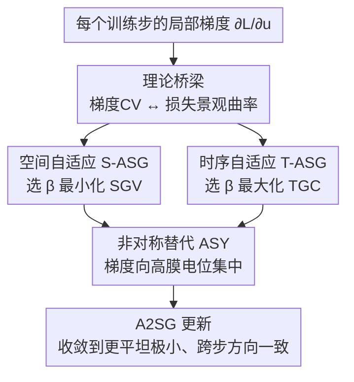

# A2SG: Adaptive and Asymmetric Surrogate Gradients for Training Deep Spiking Neural Networks

**会议**: ICML2026  
**arXiv**: [2606.11236](https://arxiv.org/abs/2606.11236)  
**代码**: https://github.com/KIST-NCL/A2SG.git  
**领域**: 优化 / 脉冲神经网络 / 替代梯度训练  
**关键词**: 脉冲神经网络, 替代梯度, 平坦极小, 损失曲率, 时序梯度一致性

## 一句话总结
针对深度脉冲神经网络（SNN）用替代梯度训练时「损失景观尖锐 + 跨时间步梯度互相打架」两大顽疾，这篇论文提出统一框架 A2SG，一方面用自适应有效窗宽（按空间梯度变异 SGV 和时序梯度一致性 TGC 自动调 $\beta$）压低梯度变异、对齐时间步方向，另一方面把对称替代函数改成「按膜电位高低分配梯度」的非对称形状，并从理论上证明非对称比对称变异更低、局部梯度变异越小损失景观越平坦，从而在 CNN 和 Transformer 型 SNN 上一致提升精度与能效。

## 研究背景与动机
**领域现状**：脉冲神经网络靠脉冲（spike）运算，天生低功耗，被视为下一代节能神经网络；把它做深之后已经用到图像分类、分割、目标检测、语言建模乃至 Transformer 架构上。这些进展几乎都靠「基于替代梯度的直接训练」（STBP，时空反向传播）撑起来——因为脉冲发放函数不可导，必须用一个平滑的替代梯度 $\partial s/\partial u$ 来近似那个本该是 Dirac delta 的导数。

**现有痛点**：替代梯度虽然让深度 SNN 能训了，但和真实梯度之间天然失配。现有改进要么死磕「梯度稀疏性」当作训练质量的间接指标（Lian、Lin 等调有效窗宽控稀疏），要么计算开销极大难落地（Dspike 用有限差分对齐真实梯度但代价高）。更关键的是，几乎没人研究**替代梯度函数的形状本身**对泛化的影响。

**核心矛盾**：作者把问题挖到了优化层面——深度 SNN 用替代梯度训练后，会收敛到比 DNN 尖锐得多的损失景观区域。论文从二阶导链式法则推出：对称、定面积的替代函数下，SNN 的 Hessian 量级是 $\Omega(x^2/\beta^2)$，而 DNN 只是 $\mathcal{O}(x^2)$。由于大家习惯用窄窗（$\beta<1$）去逼近 Dirac delta，这等于把 Hessian 放大了 $1/\beta^2$ 倍，硬把优化推向尖锐区。再加上脉冲二值且时间稀疏，梯度被高度集中、变异加大，进一步偏向尖锐区。

**另一重矛盾**：STBP 里参数更新是把所有时间步的梯度贡献加起来，如果各时间步的局部梯度方向不一致，就会产生互相冲突的信号——作者称之为**时序梯度混淆（temporal gradient confusion）**，它让优化不稳、拖累性能，却长期没被显式处理。

**本文目标**：同时治这两个病——把损失景观从尖锐拉向平坦、把跨时间步的梯度方向对齐。

**核心 idea**：用一个统一框架 A2SG，把「自适应（空间 + 时序自适应窗宽）」和「非对称（按膜电位分配梯度）」两个组件结合起来；前者靠在线指标自动选 $\beta$ 压变异、对齐方向，后者靠改函数形状进一步降低梯度变异，两者都被同一条理论主线串起：**局部梯度的变异系数（CV）越小，损失景观越平坦，泛化越好。**

## 方法详解

### 整体框架
A2SG 不改网络结构、不加推理开销，只动训练时那一条替代梯度。它先建立一条理论桥梁——局部梯度 $\partial L/\partial u$ 的变异系数 CV 直接决定 Fisher 信息矩阵最大特征值、也就是损失景观曲率；于是「降 CV = 找平坦极小」。围绕这条主线，框架在每个训练步对替代函数做两件事：**调窗宽 $\beta$**（空间自适应压 SGV、时序自适应升 TGC，分别治尖锐和治时序混淆）和**改窗形**（用非对称 ASY 替代对称 TRI/BOX，把梯度往高膜电位神经元集中）。三者协同：S-ASG+ASY 促平坦、T-ASG+ASY 稳方向，合起来的 A2SG 实现稳健收敛。

### 关键设计

**1. CV–曲率桥梁：把「降梯度变异」证明成「找平坦极小」**

这是全文的理论地基，回答「为什么调梯度变异能改善泛化」。作者在全连接层上把权重梯度向量写成输入与反传误差的克罗内克积 $\mathbf{g}=\mathbf{a}_{\mathrm{in}}\otimes\boldsymbol{\delta}$，于是 Fisher 信息矩阵 $\mathbf{F}=\mathbb{E}[\mathbf{g}\mathbf{g}^\top]$。把误差 $\boldsymbol{\delta}$ 拆成均值加零均扰动 $\boldsymbol{\delta}=\mu\mathbf{1}+\boldsymbol{\epsilon}$ 后，$\mathbf{F}$ 分解为一个秩-1 矩阵 $\mathbf{F_0}$ 加扰动 $\mathbf{R}$，且 $\|\mathbf{R}\|_2 \le c\mu\,\mathrm{CV}(\delta)$。由矩阵扰动理论，FIM 最大特征值满足

$$\lambda_{\max}(\mathbf{F}) \le \mu^2\lambda_{\max}\!\big(\mathbb{E}[(\mathbf{a}_{\mathrm{in}}\otimes\mathbf{1})(\mathbf{a}_{\mathrm{in}}\otimes\mathbf{1})^\top]\big) + c\mu^2\,\mathrm{CV}(\delta).$$

即最大特征值随 $\mathrm{CV}(\delta)$ **线性增长**——降低局部梯度的 CV 直接把损失景观压平。这条桥梁让后面所有「调 $\beta$、改形状」的操作都有了统一目标：压 CV。

**2. 空间-时序自适应窗宽 ST-ASG：用 SGV 和 TGC 在线选 $\beta$**

针对尖锐景观和时序混淆，作者定义两个可观测指标来驱动自适应。**空间梯度变异 SGV**（在最后时间步 $T$、层 $l$ 上）

$$\mathrm{SGV}^{(l)}[T] := \frac{\mathrm{Var}(\boldsymbol{\delta}^l[T])}{\mathrm{Mean}(|\boldsymbol{\delta}^l[T]|)},$$

为算得快用方差而非标准差（与标准 CV 略有差异）；**时序梯度一致性 TGC** 则是相邻时间步局部梯度的余弦相似度 $\mathrm{TGC}^{(l)}[t]:=\cos(\boldsymbol{\delta}^{(l)}[t],\boldsymbol{\delta}^{(l)}[t+1])$。空间自适应在最后时间步（激活与梯度相对稳定）最小化 SGV，给出一个稳定的参考方向；时序自适应再对前面各时间步最大化 TGC，把它们对齐到这个参考方向上。两者的共同旋钮都是有效窗宽 $\beta$——因为 SGV 和 TGC 都能写成 $\beta$ 的函数。但论文发现这俩函数随训练动态变化无常：同一层不同 epoch 形状不同、同一 epoch 不同层也不同，所以无法用固定规则，作者改用**贝叶斯搜索**鲁棒地找当前最优 $\beta$。

**3. 非对称替代函数 ASY：按膜电位高低分配梯度，再降一截变异**

对称函数（TRI、BOX）只按「膜电位离阈值多远」给梯度，完全无视神经元的积分-发放动力学，导致累积膜电位的相对大小没被反映进训练。作者提出非对称替代

$$\frac{\partial s}{\partial u}=f(u,\beta)=\frac{1}{2\beta}(u-V_{\mathrm{th}})+h,\quad u\in[V_{\mathrm{th}}-\beta,\,V_{\mathrm{th}}+\beta],$$

其中 $h$ 是横跨窗的梯度偏置项，控制整体梯度幅度（$h$ 小则压低低电位神经元梯度、更稀疏）。它给膜电位累积更高、更接近发放的神经元分配更大梯度，等于把梯度集中到「真正要发放」的区域、不浪费在低活跃区，从而进一步压低梯度变异、缓解尖锐。作者还从理论上为这个直觉背书：**定理 4.1** 证明在面积/边界约束下，对称函数里 CV 最小的是三角函数（给对称族定了 CV 下界）；**定理 4.2** 进一步证明在高斯线性近似下，只要 $L\kappa>\sigma^2$（$L=b-a$ 为窗宽、$\kappa=a-\mu$），就有 $\mathrm{CV}_{\mathrm{asy}}<\mathrm{CV}_{\mathrm{sym}}$。实验里这个条件随训练推进在各层逐渐被满足，ASY 的梯度方差确实持续低于 TRI。⚠️ 定理细节以原文附录为准。

### 损失函数 / 训练策略
A2SG 不改任务损失，只替换 STBP 中的替代梯度。每个训练步：先在最后时间步贝叶斯搜索使 SGV 最小的 $\beta$ 作为参考；再为前面各时间步搜索使 TGC 最大的 $\beta$；替代函数统一用非对称 ASY 形状。组合后即 A2SG，既稳定优化又导向平坦极小。实验跨 CIFAR10/100、ImageNet、CIFAR10-DVS、ADE20K，覆盖 CNN 与 Transformer 型 SNN。

## 实验关键数据

### 主实验
A2SG 在多种架构上对比现有自适应替代梯度方法，时间步普遍只用 4 步。

| 数据集 | 架构 | 方法 | 时间步 | 准确率(%) |
|--------|------|------|--------|----------|
| CIFAR10 | ResNet18 | Dspike | 4 | 93.66 |
| CIFAR10 | ResNet19 | CPNG | 6 | 94.10 |
| CIFAR10 | ResNet19 | LSG | 4 | 95.17 |
| CIFAR10 | ResNet19 | ST-ASG (本文) | 4 | 96.41 |
| CIFAR10 | ResNet19 | **A2SG (本文)** | 4 | **96.74** |
| CIFAR100 | ResNet18 | Dspike | 4 | 73.35 |
| CIFAR100 | ResNet19 | CPNG | 6 | 75.37 |
| CIFAR100 | ResNet19 | LSG | 4 | 76.85 |
| CIFAR100 | ResNet19 | ST-ASG (本文) | 4 | 80.46 |
| CIFAR100 | ResNet19 | **A2SG (本文)** | 4 | **81.05** |

### 消融实验

| 配置 | 作用 | 效果 |
|------|---------|------|
| 仅 ST-ASG（自适应窗宽） | 空间+时序自适应 | CIFAR100 已达 80.46%，单组件即超已有 SOTA |
| 仅 ASY（非对称形状） | 改窗形降 CV | 梯度方差持续低于 TRI，验证定理 4.2 |
| 完整 A2SG | 两组件协同 | CIFAR100 81.05%、CIFAR10 96.74%，最优 |

### 关键发现
- **降 CV 真的换来平坦极小**：A2SG 全程维持低 SGV、高 TGC，且各层 FIM 最大特征值一致低于对照，从经验上印证了「CV 越小 → 曲率越小」的理论。
- **窄窗是把双刃剑**：Hessian 量级 $\Omega(x^2/\beta^2)$ 说明大家为逼近 Dirac delta 用的窄窗，恰恰把 SNN 推向比 DNN 尖锐得多的区域——这是 SNN 难训的一个被忽视的根因。
- **TRI 比 BOX 更尖锐**：在面积归一下，三角函数更陡的斜率意味着更大曲率，所以收敛到比 BOX 更尖锐的区域，与可视化的损失景观一致。
- **形状本身有用**：把对称改成非对称、按膜电位分配梯度，在不加推理成本的前提下既反映神经元动力学又降变异，是过去几乎没被探索的维度。

## 亮点与洞察
- **从「调稀疏」升级到「调曲率」**：以往自适应替代梯度大多盯着梯度稀疏这个间接指标，本文把目标换成有理论支撑的「局部梯度 CV ↔ 损失曲率」，动机一下子具体且可证明——这是方法的灵魂。
- **非对称替代函数是个轻巧而新颖的切入点**：只改训练时那条平滑函数的形状、不动结构不加推理开销，却能同时反映膜电位动力学并降变异，且有定理 4.1/4.2 兜底，trick 很干净。
- **显式命名并治理「时序梯度混淆」**：用 TGC（相邻步余弦相似度）把跨时间步梯度打架这件事量化出来，再用时序自适应对齐，思路可迁移到任何多时间步聚合梯度的训练（如 BPTT 类时序模型）。
- **统一框架、广覆盖**：从 CNN 到 Transformer SNN、从静态到神经形态数据、再到 ADE20K 分割都验证，说明这套替代梯度改进是通用的而非某架构专属。

## 局限与展望
- 自适应 $\beta$ 依赖贝叶斯搜索，引入了训练时的搜索开销，论文虽强调比 Dspike 便宜，但相对纯固定窗仍有额外成本，超大模型上的可扩展性待考。
- 理论分析（CV–曲率桥梁、定理 4.1/4.2）建立在全连接层、高斯膜电位、线性近似等假设上，能否严格覆盖 Transformer attention 等结构需进一步确认（⚠️ 以原文附录推导为准）。
- SGV 用方差而非标准差是为算得快的近似，与严格 CV 有偏差；这种近似在极端梯度分布下是否仍稳健没有充分讨论。
- 主要展示分类/分割精度与能效，缺少在更大规模语言建模型 SNN 上的验证。

## 相关工作与启发
- **vs Dspike**：Dspike 用有限差分按余弦相似度把替代对齐真实梯度，但计算成本高难扩展；A2SG 用可观测的 SGV/TGC + 贝叶斯搜索调窗，开销小且目标是曲率而非梯度匹配。
- **vs LSG / CPNG（调窗控稀疏）**：它们把梯度稀疏当成学习质量的间接指标来调有效窗宽；A2SG 直接把目标定成降低局部梯度 CV、导向平坦极小，动机更本质，实测也更高（CIFAR100 81.05 vs LSG 76.85）。
- **vs 调膜电位分布的方法（IM、RMP、KL loss）**：它们改的是膜电位分布、没动替代梯度本身的根本缺陷；A2SG 直接重塑替代函数形状与窗宽。
- **vs 平坦极小训练（SAM 类、FIM-aware 更新）**：那些方法在通用 DNN 上显式优化平坦度；本文把平坦极小思想专门接到 SNN 替代梯度的设计上，并给出 CV–曲率的解析联系。

## 评分
- 新颖性: ⭐⭐⭐⭐⭐ 把替代梯度从「调稀疏」推进到「调曲率」，并引入非对称形状这一未被探索的维度
- 实验充分度: ⭐⭐⭐⭐ 覆盖 CNN/Transformer、静态/神经形态、分类/分割，但缺大规模语言 SNN
- 写作质量: ⭐⭐⭐⭐ 理论主线清晰、图证充分，部分定理需翻附录才能跟全
- 价值: ⭐⭐⭐⭐⭐ 给深度 SNN 训练提供了有理论支撑、即插即用、跨架构通用的替代梯度方案

<!-- RELATED:START -->

## 相关论文

- [\[NeurIPS 2025\] Training Robust Graph Neural Networks by Modeling Noise Dependencies](../../NeurIPS2025/optimization/training_robust_graph_neural_networks_by_modeling_noise_dependencies.md)
- [\[ICML 2026\] Asymmetric Perturbation in Solving Bilinear Saddle-Point Optimization](asymmetric_perturbation_in_solving_bilinear_saddle-point_optimization.md)
- [\[ICML 2026\] The Implicit Bias of Adam and Muon on Smooth Homogeneous Neural Networks](the_implicit_bias_of_adam_and_muon_on_smooth_homogeneous_neural_networks.md)
- [\[ICML 2026\] Gradient Descent with Large Step Size Restores Symmetry in Deep Linear Networks with Multi-Pathway](gradient_descent_with_large_step_size_restores_symmetry_in_deep_linear_networks_.md)
- [\[ICLR 2026\] Rapid Training of Hamiltonian Graph Networks using Random Features](../../ICLR2026/optimization/rapid_training_of_hamiltonian_graph_networks_using_random_features.md)

<!-- RELATED:END -->
