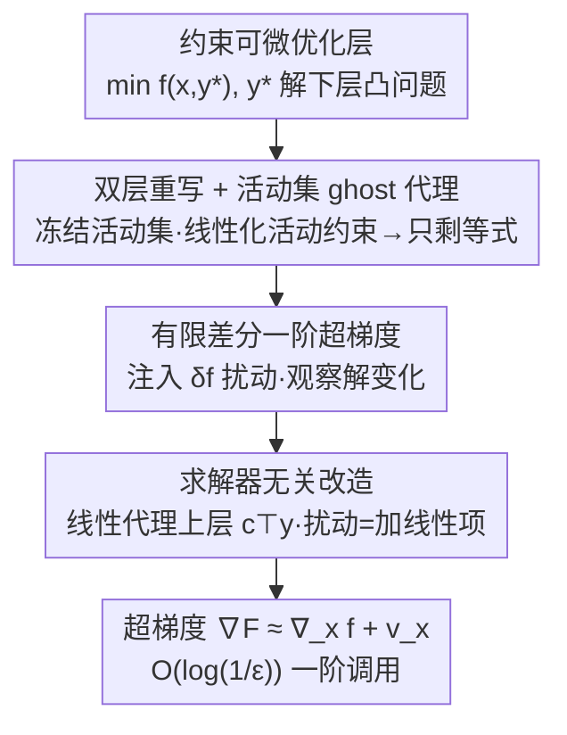

# A Fully First-Order Layer for Differentiable Optimization

**会议**: ICML2026  
**arXiv**: [2512.02494](https://arxiv.org/abs/2512.02494)  
**代码**: https://github.com/GT-KOALA/FFOLayer  
**领域**: 优化 / 可微优化层  
**关键词**: 可微优化, 双层优化, 一阶方法, 超梯度, 求解器无关  

## 一句话总结
可微优化层的主流做法是对 KKT 条件做隐式微分，必须算 Hessian、解大型 KKT 线性系统，难以扩展到大规模问题；本文把可微优化重写成**双层优化**，构造"固定活动集 + 线性化活动约束"的 ghost 代理问题把不等式约束局部化简为等式约束，再用**有限差分**只靠一阶信息在近常数 $\mathcal{O}(\log(1/\epsilon))$ 次调用内估出超梯度，并做成一个与任意凸求解器（含 GUROBI/MOSEK）即插即用的 PyTorch 库 FFOLayer——收敛与精确法相当，但计算时间和峰值显存随问题规模近乎亚线性增长。

## 研究背景与动机
**领域现状**：把一个数学规划当作可微层嵌进神经网络（OptNet、CvxpyLayer 等），让模型的输出由求解一个内嵌优化问题得到、梯度再回传穿过求解器做端到端训练，已广泛用于决策聚焦学习、控制、元学习等。

**现有痛点**：可微优化层最大的瓶颈是**可扩展性**——算超梯度极其昂贵。标准做法是对 KKT 条件做隐式微分（CvxpyLayer），把反传化简为对 KKT 系统的若干次线性求解。但对大型问题，分解并求解 KKT 系统在时间和显存上都很重，约束了能处理的问题规模；更糟的是 KKT 系统的 Jacobian 里通常含下层目标的 Hessian $\nabla_{yy}^2 g(x,y)$，这是扩展可微层的主要拦路虎。

**核心矛盾**：隐式微分要"形成并求逆一个含 Hessian 的大 KKT 矩阵"，这与"想把可微层用到大规模问题"直接冲突。而双层优化领域虽已有一波"避开 Hessian"的纯一阶算法，却卡在不等式约束上：现有工作多用罚项（如活动约束的 $\ell_2$ 范数）来处理不等式，求一个 $\epsilon$-精度超梯度要 $\mathcal{O}(1/\epsilon)$ 次迭代；而只有等式约束时却能享受快得多的 $\mathcal{O}(\log(1/\epsilon))$。

**本文目标**：为可微优化层设计一个**只用一阶信息**、能处理一般凸约束（不止线性不等式）、还能套用任意先进求解器的超梯度算法，并补齐"不等式约束下也能拿到 $\mathcal{O}(\log(1/\epsilon))$ 近常数超梯度"这一空白。

**切入角度**：作者的关键观察是——优化解 $y^*(x)$ 对输入 $x$ 的依赖天然是一个双层结构；而在最优点附近，只有**活动约束**才影响一阶行为，非活动约束是松弛的、不影响局部梯度。于是可以"冻结活动集、把活动不等式线性化成等式"，把一般凸约束局部地化简为只含等式约束的代理问题，从而搬用等式情形的近常数算法。

**核心 idea**：用"双层重写 + 活动集 ghost 代理（线性化活动约束→等式）+ 有限差分一阶超梯度"三步，把含 Hessian 的隐式微分替换成只需两次黑箱求解 + 一次有限差分的纯一阶流程。

## 方法详解

### 整体框架
给定下游损失 $f(x,y)$ 和参数化的下层凸优化 $y^*(x)\in\arg\min_{y}\,g(x,y)\ \text{s.t.}\ h(x,y)\le 0,\ e(x,y)=0$，训练目标是 $F(x):=f(x,y^*(x))$，难点在算超梯度时的敏感度项 $dy^*(x)/dx$。隐式微分需要 $-(\nabla G)^{-1}\nabla_x G$，含 Hessian、要解大 KKT 系统。本文把它改写成双层问题后分三步走：**先固定下层最优点的活动集、把活动不等式线性化**，构造只含线性等式约束的 ghost 代理（在 $\bar x$ 处与原问题超梯度严格相等）；**再对 ghost 下层注入一个 $\delta f$ 扰动**，通过观察解的变化做有限差分，得到 $\mathcal{O}(\delta)$ 精度的一阶超梯度；**最后用一个线性代理上层目标 $c^\top y$ 把扰动改造成"加一个线性项"**，使整个反传与具体求解器解耦。前向解原问题、后向解一个扰动问题，两次黑箱求解 + 有限差分即得梯度。

### 关键设计

**1. 双层重写 + 活动集 ghost 代理：把一般凸约束局部化简为等式约束**

直接处理不等式约束会让超梯度复杂度退化到 $\mathcal{O}(1/\epsilon)$。作者先把可微优化写成双层实例（上层 $f$、下层 $\arg\min_y g$ s.t. 约束），再构造一个 **ghost 双层问题**：取参考点 $\bar x$ 及其下层原始-对偶最优解 $(y^*,\lambda^*,\nu^*)$，定义活动集 $\mathcal{I}:=\{i\mid h_i(\bar x,y^*)=0,\ \lambda_i^*>0\}$，把活动不等式和等式约束用 Lagrange 项并入目标、并对活动约束做一阶线性化：

$$\tilde g(x,y)=g(x,y)+\langle\lambda^*,h(x,y)\rangle+\langle\nu^*,e(x,y)\rangle$$

$$\tilde h(x,y)=\begin{bmatrix}e(x,y)\\ \nabla_x h_{\mathcal{I}}(\bar x,y^*)(x-\bar x)+\nabla_y h_{\mathcal{I}}(\bar x,y^*)(y-y^*)\end{bmatrix}$$

其中对偶变量 $\lambda^*,\nu^*$ 被当作**冻结常数**。直觉上，非活动约束在 $(\bar x,y^*)$ 邻域内松弛、不影响一阶行为，而活动约束像等式一样可被其一阶展开捕获。**Theorem 4.5（活动集等价）**保证：在 LICQ 成立、$F$ 可微、活动集局部不变的条件下，$\nabla F(\bar x)=\nabla\tilde F(\bar x)$——即这种化简**不损失超梯度精度**。代价是只需处理少数活动约束、而非全局处理所有不等式，省下大量计算；化简后 $\tilde h$ 只含线性等式，于是能搬用等式情形的近常数算法。

**2. 有限差分一阶超梯度：注入扰动观察解的变化，避开 Hessian 与逆 Jacobian**

化简成等式约束后，仍要避免显式算 $dy^*(x)/dx$。本文用**有限差分**：给 ghost 下层目标注入一个上层目标的小扰动 $\delta f(x,y)$（$\delta>0$ 很小），解出扰动后的原始-对偶解 $(y_\delta^*,\lambda_\delta^*)$，再用扰动 Lagrangian 的差商估计敏感度项

$$v_x:=\frac{1}{\delta}\Big(\nabla_x[\tilde g(x,y_\delta^*)+\langle\lambda_\delta^*,\tilde h(x,y^*)\rangle]-\nabla_x[\tilde g(x,y^*)]\Big)$$

可证 $\|v_x-(dy^*/dx)^\top\nabla_y f(x,y^*)\|\le\mathcal{O}(\delta)$，完整超梯度组装为 $\tilde\nabla F(x)=\nabla_x f+v_x$。整个过程只用到 $f,g,h$ 的一阶导数。**Theorem 4.6** 给出：在标准假设下，算法在 $\mathcal{O}(\log(1/\epsilon))$ 次梯度 oracle 调用内输出满足 $\|\tilde\nabla F-\nabla F\|\le\epsilon$ 的超梯度——相比 Kornowski et al.(2024) 需要精确对偶解、代价 $\tilde{\mathcal{O}}(\epsilon^{-1})$，本文只需正确识别活动集就把复杂度降到对数级。把它接进 meta-algorithm 后，**Corollary 4.7** 进一步给出整体 $\tilde{\mathcal{O}}(\delta^{-1}\epsilon^{-3})$ 次 oracle 调用收敛到 $(\delta,\epsilon)$-Goldstein 稳定点，匹配非凸非光滑优化的已知最优率，并从线性约束推广到一般凸约束。

**3. 求解器无关改造：用线性代理上层目标让反传与具体求解器解耦**

Algorithm 1 第 3 步要解的扰动下层目标 $\tilde g+\delta f$ 显式依赖上层 $f$，但在"黑箱求解器"接口下（只给求解器 $x$ 和 $(g,h,e)$、它返回 $y^*$），求解器并不知道 $f$ 的显式形式，这一步无法直接即插即用。作者的解法是构造一个**线性代理上层目标**

$$\hat f(x,y):=c^\top y,\quad c:=\texttt{detach}(\nabla_y f(x,y^*(x)))$$

由于 $\nabla_y f=c=\nabla_y\hat f$，这个替换不改变要求的超梯度。于是扰动下层只需"加一个线性项"即可实现：$\hat y_\delta^*\in\arg\min_{y:\tilde h(x,y)=0}\tilde g(x,y)+\delta c^\top y$。具体流程：先用任意求解器解原下层得 $y^*$，再用自动微分算 $c=\nabla_y f(x,y^*)$ 并 stop-gradient，最后解扰动问题得 $\hat y_\delta^*$ 代入有限差分。这样**反传不需要任何求解器特定的后向实现**，只要把进来的梯度信号 $c$ 喂给扰动求解 + 有限差分即可，从而能直接套用 GUROBI、MOSEK 等先进凸求解器——这是大多数现有可微层做不到的。作者据此提供两个变体：FFOCP（通用凸问题）与 FFOQP（针对 QP 结构特化，利用 QP 闭式解）。

### 损失函数 / 训练策略
方法本身不引入新损失，而是为任意上层损失 $F(x)=f(x,y^*(x))$ 提供超梯度 oracle，可直接接入标准端到端训练。算法每次反传：① 用任意求解器解原下层得 $(y^*,\lambda^*)$；② 解扰动 ghost 下层得 $(y_\delta^*,\lambda_\delta^*)$（$\delta=\mathcal{O}(\epsilon)$）；③ 算有限差分 $v_x$；④ 输出 $\tilde\nabla F=\nabla_x f+v_x$。整体配 meta-algorithm 后达 $\tilde{\mathcal{O}}(\delta^{-1}\epsilon^{-3})$ 收敛到 Goldstein 稳定点。

## 实验关键数据

### 主实验
在三类任务上对比可微优化层基线（CPU，因缺支持 batch 的 GPU 求解器）：

| 任务 | 下层问题类型 | 考察点 |
|------|------------|--------|
| 合成决策聚焦学习 DFL | QP（$Gy\le h$） | 标准带不等式 QP 层 |
| Sudoku | LP（学约束 $A(\theta),b(\theta)$） | 稠密、病态 KKT 矩阵 |
| SOCP | 二阶锥（$\|y\|_2\le c$） | 非线性/一般凸约束 |

基线含 KKT 系：CvxpyLayer、QPTH；优化系：LPGD、BPQP、dQP。能力对比（摘自论文 Table 1）：

| 方法 | 一般凸约束 | 仅一阶 | 求解器无关 |
|------|:--:|:--:|:--:|
| CvxpyLayer | ✓ | ✗ | ✗ |
| QPTH (OptNet) | ✗ | ✗ | ✗ |
| Alt-Diff | ✗ | ✗ | ✗ |
| LPGD | ✓ | ✓ | ✓ |
| BPQP | ✓ | ✗ | ✗ |
| dQP | ✗ | ✗ | ✓ |
| **FFOLayer（本文）** | **✓** | **✓** | **✓** |

FFOLayer 是首个同时满足"一般凸约束 + 仅一阶 + 求解器无关 + 有限时间超梯度保证"的方法（代价是超梯度为 $\epsilon$-近似而非精确）。

### 消融实验
随下层决策变量维度 $d_y$ 增长的可扩展性消融（DFL/QP 与 SOCP）：

| 配置 | 计算时间随 $d_y$ | 峰值显存 | 现象 |
|------|----------------|---------|------|
| FFOCP / FFOQP（本文） | 亚线性增长 | 近常数 | 大规模仍快且省显存 |
| CvxpyLayer | 超线性增长 | 急剧上升 | $d_y{=}1000$ 时 OOM |
| LPGD | 慢（依赖 diffcp 规范化） | 高 | $d_y{=}1000$ OOM |
| BPQP / dQP | 转 QP 引入开销 | 较高 | 后向解维度被放大 |

### 关键发现
- **收敛不掉点**：在 DFL、Sudoku、SOCP 三任务上，FFOCP/FFOQP 的训练损失下降曲线与精确法（CvxpyLayer、QPTH）基本一致——用近似一阶超梯度替换隐式微分不损害优化性能。
- **对病态最稳**：Sudoku 产生稠密、病态的 KKT 矩阵，CvxpyLayer 的后向极慢且不稳定，而 FFOCP 因避开显式 KKT、只靠两次求解 + 有限差分，后向又快又稳。
- **扩展性最好**：消融证实本文方法计算时间随维度增长远慢于基线，且显存近乎恒定；CvxpyLayer 在 $d_y{=}1000$ 直接 OOM——印证了"消去 Hessian 求逆使反传成本随规模亚线性"的复杂度分析。
- **QP 特化更强**：即便不利用 QP 结构，FFOCP 在 QP 任务上已可比甚至优于 QPTH；特化的 FFOQP 在 QP 任务上超过所有 KKT 系与优化系基线。
- **比此前一阶法更稳**：LPGD 论文报告的容差 $\epsilon{=}10^{-4}$ 在合成/Sudoku 上不足以收敛；同容差下本文方法因有非渐近超梯度保证而对求解器容差更不敏感。

## 亮点与洞察
- **"活动集冻结 + 线性化"把一般凸约束降成等式**很关键：它正是补齐"不等式约束下也能拿 $\mathcal{O}(\log(1/\epsilon))$ 近常数超梯度"的那块拼图，且 Theorem 4.5 证明这种局部化简不丢精度，而非靠罚项近似。
- **线性代理上层 $c^\top y$ 这一招很工程也很漂亮**：因为 $\nabla_y f=c$，把扰动改写成"加一个线性项"，反传就和求解器彻底解耦，从而能白嫖 GUROBI/MOSEK 等商用求解器——这是大多数可微层的硬伤。
- **drop-in 接口降低落地门槛**：和 CvxpyLayer 同款 API（`FFOLayer(prob, parameters=..., variables=...)`），现有代码改一行即可替换，适合决策聚焦学习/控制/元学习里大规模优化层的提速。
- **"只用一阶 + 有限差分估超梯度"的范式可迁移**：任何需要对黑箱求解器/迭代过程反传、又算不起 Hessian 的场景，都可借鉴"注入小扰动观察解变化"的有限差分超梯度思路。

## 局限与展望
- **超梯度是 $\epsilon$-近似而非精确**：换来了一阶与求解器无关，但 Table 1 里它是唯一不提供精确超梯度的方法，强病态/高精度需求场景需权衡。
- **依赖活动集正确识别（Assumption 4.3）**：理论保证建立在能正确识别活动约束之上；作者在 Appendix F 给了无此假设时的较弱保证，但实际中活动集误判的影响仍需关注。
- **依赖强凸 + LICQ 等标准假设**：下层目标需 $\mu_g$-强凸、LICQ 在每个 $x$ 及其解处成立，退化/约束相关的情形不在覆盖范围内。
- **实验全在 CPU**：因缺支持 batch 的 GPU 求解器，未展示 GPU 大规模加速，与 GPU 友好的 QPTH 的对比可能不完整。
- **扰动因子 $\delta$ 的取舍**：$\delta$ 太大引入 $\mathcal{O}(\delta)$ 偏差、太小数值不稳，论文取 $\delta=\mathcal{O}(\epsilon)$，但对极端条件数问题的鲁棒性还需更多验证。

## 相关工作与启发
- **vs CvxpyLayer / OptNet(QPTH)**：它们对 KKT 系统做隐式微分、要形成并求逆含 Hessian 的大矩阵，KKT 系且非一阶；本文只用一阶 + 有限差分，避开 Hessian，对病态与大规模更稳更省。
- **vs Alt-Diff**：用交替微分算精确超梯度，但不支持一般凸约束、也非一阶；本文支持一般凸约束且仅一阶。
- **vs LPGD**：同为一阶、求解器无关，但只有渐近保证、对容差敏感（$10^{-4}$ 不够收敛）；本文有非渐近有限时间超梯度保证，更稳。
- **vs BPQP / dQP**：靠把一般凸/QP 问题转成 QP 来用高效 QP 求解器，但转换会放大问题维度、BPQP 还要算二阶信息构造等价 QP；本文在原问题形式上工作、只用一阶，实测更快。
- **vs 一阶双层优化（Kornowski et al. 2024 等）**：等式约束下他们已有 $\mathcal{O}(\log(1/\epsilon))$，但不等式用罚项要 $\mathcal{O}(1/\epsilon)$；本文用活动集 Lagrangian 把一般凸约束局部化简为等式，把不等式情形也拉回到对数级，并推广到一般凸约束（其开放问题之一）。

## 评分
- 新颖性: ⭐⭐⭐⭐⭐ "活动集 ghost 代理 + 有限差分一阶超梯度 + 线性代理上层"组合，首个集齐"一般凸约束/仅一阶/求解器无关/有限时间保证"的可微层
- 实验充分度: ⭐⭐⭐⭐ QP/LP/SOCP 三任务 + 5 基线 + 时间/显存/收敛多维消融；但全 CPU、缺 GPU 大规模与真实下游任务
- 写作质量: ⭐⭐⭐⭐ 理论推导（活动集等价、复杂度）与工程实现（drop-in、求解器无关）都讲得清楚
- 价值: ⭐⭐⭐⭐⭐ 直击可微优化层的可扩展性瓶颈，给出可即插替换、能套商用求解器的实用库，理论与工程兼备

<!-- RELATED:START -->

## 相关论文

- [\[ICML 2026\] Lower Complexity Bounds for Nonconvex-Strongly-Convex Bilevel Optimization with First-Order Oracles](lower_complexity_bounds_for_nonconvex-strongly-convex_bilevel_optimization_with_.md)
- [\[NeurIPS 2025\] A Single-Loop First-Order Algorithm for Linearly Constrained Bilevel Optimization](../../NeurIPS2025/optimization/a_single-loop_first-order_algorithm_for_linearly_constrained_bilevel_optimizatio.md)
- [\[ICLR 2026\] Gradient-Based Diversity Optimization with Differentiable Top-$k$ Objective](../../ICLR2026/optimization/gradient-based_diversity_optimization_with_differentiable_top-k_objective.md)
- [\[ICML 2026\] Learning Dynamics of Zeroth-Order Optimization: A Kernel Perspective](learning_dynamics_of_zeroth-order_optimization_a_kernel_perspective.md)
- [\[ICML 2026\] Neural QAOA$^2$: Differentiable Joint Graph Partitioning and Parameter Initialization for Quantum Combinatorial Optimization](neural_qaoa2_differentiable_joint_graph_partitioning_and_parameter_initializatio.md)

<!-- RELATED:END -->
