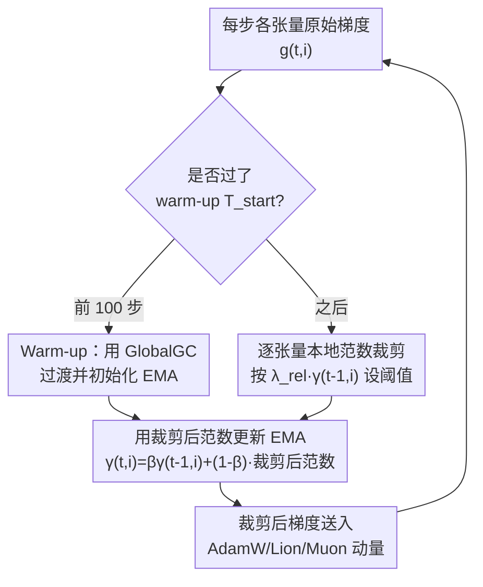

# AdaGC: Enhancing LLM Pretraining Stability via Adaptive Gradient Clipping

**会议**: ICML 2026  
**arXiv**: [2502.11034](https://arxiv.org/abs/2502.11034)  
**代码**: PaddlePaddle/PaddleFleet（Research/AdaGC）  
**领域**: LLM效率 / 优化器与训练稳定性  
**关键词**: 梯度裁剪, loss spike, 逐张量自适应, EMA, LLM 预训练

## 一句话总结
针对大模型预训练里反复出现的 loss spike，AdaGC 把"全局一刀切"的梯度裁剪换成"每个参数张量按自己历史梯度范数的 EMA 自适应裁剪"，在异常梯度污染优化器一阶/二阶动量之前就把它压下去，在 Llama-2 7B / Mixtral 8×1B / ERNIE 10B-A1.4B 上把 spike score 全部压到 0，同时下游精度比全局裁剪（GlobalGC）分别提升 +1.32% / +1.27% / +2.48%。

## 研究背景与动机
**领域现状**：大模型预训练动辄上千 GPU、跑几周，训练曲线必须平滑收敛。业界稳定训练的标配是**全局梯度裁剪（GlobalGC）**——把所有参数梯度拼成一个大向量，算它的全局 $\ell_2$ 范数，超过固定阈值 $\lambda_{abs}$ 就整体等比缩放。

**现有痛点**：即便开了 GlobalGC，loss spike（损失突然飙升甚至发散）依然频繁发生。论文做了一组复现实验发现：调大 AdamW 的 $\beta_2$、调小 $\epsilon$、把 RMSNorm 精度从 BF16 降到 FP32 以下，都能触发 spike；更诡异的是，**保持随机种子和数据不变、仅仅中断后 resume，也能"碰运气"绕过一次 spike**——原因只是 FlashAttention 反向里 $dQ/dK/dV$ 的微小随机性。这说明 spike 的触发极其敏感，靠反复重启来续命代价高昂。

**核心矛盾**：spike 的上游成因五花八门（数据噪声、硬件瞬时故障、数值精度、超参），但作者观察到它们**最终都收敛到同一个表现：某个时刻出现异常大的梯度，被吸进优化器的一阶/二阶动量累加器，污染后续所有更新**。既然如此，与其去逐一定位根因，不如在梯度进入动量之前就拦住它。而 GlobalGC 拦不住，因为它有两个错配：① **时间错配**——最优裁剪阈值会随训练推进逐渐变小，固定阈值在后期会"裁不动"；② **空间错配**——不同参数张量的梯度统计和 spike 出现时机各不相同、彼此异步，单一全局阈值要么保护了这个张量、要么过度约束了那个张量。

**本文目标**：设计一个能同时具备**时间自适应**和**空间针对性**的裁剪规则，且要在异常梯度进入动量累加器之前生效。

**切入角度 / 核心 idea**：抛弃全局范数，改用**每个张量自己的历史梯度范数 EMA 作为参照**，谁超了就把谁单独压回参照线附近——locality（逐张量）+ adaptivity（EMA 动态阈值）两条原则一句话概括了整篇方法。

## 方法详解

### 整体框架
AdaGC 是一个**优化器无关的预处理步骤**：在每一步把梯度交给优化器（AdamW / Lion / Muon）之前，先对每个参数张量 $i$ 单独做一次自适应裁剪。输入是当前步各张量的原始梯度 $\boldsymbol{g}_{t,i}$，输出是裁剪后的梯度，再正常喂给优化器更新动量与参数。整条流程只多维护一个标量——每张量的梯度范数 EMA $\gamma_{t,i}$。训练分两段：前 $T_{start}$ 步（默认 100）用传统 GlobalGC 过渡并初始化 EMA，之后切换到逐张量 AdaGC。

### 关键设计

**1. 逐张量本地范数裁剪：让每个张量按自己的尺度被约束**

这针对的是 GlobalGC 的"空间错配"。AdaGC 不再算全局范数，而是对第 $i$ 个张量在第 $t$ 步单独裁剪：

$$\boldsymbol{g}_{t,i}\leftarrow h_{t,i}\cdot\boldsymbol{g}_{t,i},\quad h_{t,i}=\min\left\{\lambda_{rel}\frac{\gamma_{t-1,i}}{\|\boldsymbol{g}_{t,i}\|},\,1.0\right\}$$

其中 $\gamma_{t-1,i}$ 是该张量历史梯度范数的 EMA，$\lambda_{rel}$ 是相对阈值（默认 1.04）。直观理解：只要某张量当前范数 $\|\boldsymbol{g}_{t,i}\|$ 超过它自己最近平均水平的 $\lambda_{rel}$ 倍，就把它缩放回 $\lambda_{rel}\cdot\gamma_{t-1,i}$；没超就原样放行（$h_{t,i}=1$）。因为阈值是"相对自己"的，不同张量的量纲差异天然被归一化，一个张量的局部 spike 不会被全局范数稀释掉、也不会反过来误伤其他正常张量。和 GlobalGC（全局、固定 $\lambda_{abs}$）、ZClip（全局、EMA z-score）相比，AdaGC 是表 2 里唯一做到**张量粒度 + EMA 自适应阈值**的 norm-based 方法。

**2. 历史范数 EMA 作为动态阈值：让裁剪线随训练自己往下走**

这针对 GlobalGC 的"时间错配"。参照线 $\gamma_{t,i}$ 用指数滑动平均维护：

$$\gamma_{t,i}=\beta\gamma_{t-1,i}+(1-\beta)\|\boldsymbol{g}_{t,i}\|$$

$\beta$（默认 0.99）是平滑系数。随着训练推进梯度范数整体下降，EMA 会自动跟着下移，于是裁剪阈值 $\lambda_{rel}\cdot\gamma_{t-1,i}$ 也随之收紧，后期不会像固定阈值那样"裁不动"。一个关键细节是：**写回 EMA 的是裁剪后的范数，而不是裁剪前的原始范数**。这样做避免了一次异常大梯度把 EMA 自身抬高、进而放松后续阈值形成"破窗效应"——异常值既被压下去，也不会污染历史统计。

**3. Warm-up 过渡：避开训练初期的大梯度陷阱**

这解决一个冷启动问题：训练最初的几十上百步梯度范数本来就大、波动剧烈、整体呈快速下降趋势。如果一上来就用 AdaGC，会有两个毛病——其一，早期的大范数被错误地累进 EMA，形成复合误差；其二，相比 GlobalGC 反而可能延迟裁剪、拖慢初期 loss 下降。AdaGC 引入超参 $T_{start}$（默认 100），在这段 warm-up 内退回用传统 GlobalGC，同时拿这段把每张量的 EMA 初始化好，过了 100 步再切到逐张量自适应裁剪。

### 损失函数 / 训练策略
AdaGC 不改 loss、不改模型结构，只在梯度进优化器前插一步裁剪，因此**优化器无关**——论文给出了与 AdamW 集成的算法（附录），并验证它能直接套在 Lion、Muon 上。关键超参经 Llama-2 7B 网格搜索定为 $\lambda_{rel}=1.04$、$\beta=0.99$，且在 $\lambda_{rel}\in[1.03,1.05]$、$\beta\in[0.98,0.999]$ 范围内精度波动很小，对超参不敏感。

## 实验关键数据

### 主实验
评测覆盖 dense（Llama-2 1.3B/7B、Qwen3-1.7B）与 MoE（Mixtral 8×1B、ERNIE 10B-A1.4B）两类架构，预训练语料为 C4-en。稳定性用 **spike score**（时间序列中偏离前 1000 步滚动均值 ≥10 个标准差的取值百分比）衡量，质量用零样本/两样本基准平均精度衡量。

| 模型 | 指标 | GlobalGC | AdaGC | 提升 |
|------|------|----------|-------|------|
| Llama-2 7B | 零样本均值 | 49.69 | 51.01 | +1.32% |
| Mixtral 8×1B | 零样本均值 | 47.74 | 49.01 | +1.27% |
| Qwen3-1.7B | 零样本均值 | 48.42 | 50.37 | +1.95% |
| ERNIE 10B-A1.4B（1T tokens） | 通用能力验证集 | — | — | +2.48% |

### spike score 对比（核心稳定性证据）

| 模型 | 方法 | 步数 | spike 次数 | spike score(%) |
|------|------|------|-----------|----------------|
| Llama-2 7B | GlobalGC | 9K | 3 | 0.0333 |
| Llama-2 7B | ClipByValue | 9K | 9 | 0.1000 |
| Llama-2 7B | AdaGC | 9K | **0** | **0.0000** |
| Qwen3-1.7B | GlobalGC | 19K | 54 | 0.2842 |
| Qwen3-1.7B | ZClip | 19K | 8 | 0.0421 |
| Qwen3-1.7B | AdaGC | 19K | **1** | **0.0053** |
| Mixtral 8×1B | GlobalGC | 36K | 52 | 0.0144 |
| Mixtral 8×1B | AdaGC | 36K | **0** | **0.0000** |
| ERNIE 10B-A1.4B | GlobalGC | 21K | 2 | 0.0100 |
| ERNIE 10B-A1.4B | AdaGC | 21K | **0** | **0.0000** |

### 关键发现
- **spike 几乎被清零**：四个模型上 AdaGC 把 spike score 压到 0 或近 0（Qwen3 仅剩 0.0053），而 Qwen3 已经自带 QK-Norm 做架构稳定，说明 AdaGC 的稳定收益是**叠加在已有手段之上**的互补增益。
- **稳定即质量**：spike 被消除后下游精度系统性提升，论文据此论证"训练稳定性与最终模型质量强相关"。在 ERNIE 上还借助 AdaGC 才敢用更小的 $\epsilon=1\mathrm{e}{-15}$（让更多参数吃满 AdamW 自适应学习率），换来 +2.48% 的提升。
- **超参鲁棒**：$\lambda_{rel}$、$\beta$ 网格内精度抖动很小，最优点 (1.04, 0.99) 附近平台宽。
- **系统开销几乎可忽略**：每张量只多存一个 4 字节 float（ERNIE 上额外内存复杂度 $\mathcal{O}((9+3E)\times L+3)$，$L$ 为层数、$E$ 为专家数）；计算量与 GlobalGC 相当；通信上更省——GlobalGC 需要跨 DP/TP/PP 全组 all-reduce 聚合全局范数，AdaGC 只需 **TP 组内** all-reduce 算本地范数，模型/集群越大省得越多。

## 亮点与洞察
- **"不查根因、只堵咽喉"的视角很务实**：spike 成因发散但终点统一（异常梯度污染动量），论文不纠缠于定位每个 trigger，而是在公共瓶颈处一次性拦截——这是把工程难题转成可解问题的好范例。
- **写回裁剪后范数而非原始范数**是个容易忽略却关键的细节：它防止异常值抬高自己的参照线形成正反馈，本质是让统计量"自洽防污染"，可迁移到任何用历史统计做异常检测的场景。
- **逐张量相对阈值天然做了量纲归一化**：不同模块（embedding、attention、expert、RMSNorm）梯度尺度差异大，相对 EMA 让一个全局超参 $\lambda_{rel}$ 就能统管所有张量，省去逐层调参。
- **通信更省是分布式训练里的实打实红利**：把全局 all-reduce 降级为 TP 组内 all-reduce，在大集群上是可观的吞吐收益，且与 spike 抑制是"白拿"的副产品。

## 局限与展望
- **作者主动声明不追极致精度**：为多跑实验，预训练步数/token 量被压缩（如 Llama-2 7B 仅 9K 步 / 36B tokens），spike score 的绝对数值依赖这种短跑设定，更长训练下的表现需进一步验证（ERNIE 1T tokens 是其长程验证尝试）。
- **新增超参 $T_{start}$、$\lambda_{rel}$、$\beta$**：虽然论文论证了鲁棒性，但 warm-up 长度与不同架构/优化器的最优 $\lambda_{rel}$ 是否通用仍待更广验证。
- **逐张量裁剪可能放过"协同型"异常**：若多个张量同时小幅异常、但叠加起来才致命，逐张量阈值可能各自判为正常——这类跨张量耦合的 spike 不在本文显式建模范围内。
- **改进思路**：可探索把 EMA 参照与二阶动量统计联动（类似 ZClip 的 z-score 但落到张量级），或对 MoE 路由专家这类稀疏激活张量用专门的 EMA 更新节奏。

## 相关工作与启发
- **vs GlobalGC**: 都是 norm-based、只裁梯度不裁更新，但 GlobalGC 是全局 + 固定阈值，AdaGC 是逐张量 + EMA 自适应阈值；AdaGC 同时修了时间和空间两个错配，且通信更省。
- **vs ZClip**: ZClip 也用 EMA，但跟踪的是**全局**梯度范数并做 z-score 异常检测，仍是全局粒度；AdaGC 下沉到张量粒度，Qwen3 上 spike score 0.0053 vs ZClip 0.0421。
- **vs AGC / Clippy**: 它们用模型权重范数来调阈值、且裁的是**更新量** $\Delta_t$ 而非梯度，导致异常梯度仍会先污染一阶/二阶动量；AdaGC 直接在梯度进动量前拦截，从源头切断污染链路。
- **vs SPAM**: SPAM 靠动量重置 + 基于二阶矩的逐元素裁剪稳训练；AdaGC 在 Llama-2 1.3B/7B 上零样本 46.33%/51.01% 对 SPAM 的 45.58%/48.85% 更优，且机制更简单。

## 评分
- 新颖性: ⭐⭐⭐⭐ 把全局裁剪下沉到逐张量 EMA 自适应是简洁但切中要害的改动，gradient-centric 视角清晰。
- 实验充分度: ⭐⭐⭐⭐ 覆盖 dense/MoE 多架构、多优化器、多基线，spike score 与下游精度双指标，但单次预训练偏短跑。
- 写作质量: ⭐⭐⭐⭐ 动机推导（时间/空间错配）和原则提炼（locality/adaptivity）讲得透彻，表 2 对比一目了然。
- 价值: ⭐⭐⭐⭐⭐ 即插即用、优化器无关、几乎零开销还省通信，对大模型预训练工程落地价值高。

<!-- RELATED:START -->

## 相关论文

- [\[ICML 2026\] Enhancing LLM Training via Spectral Clipping](enhancing_llm_training_via_spectral_clipping.md)
- [\[ICML 2026\] Memory-Efficient LLM Pretraining via Minimalist Optimizer Design](memory-efficient_llm_pretraining_via_minimalist_optimizer_design.md)
- [\[CVPR 2026\] The Power of Decaying Steps: Enhancing Attack Stability and Transferability for Sign-based Optimizers](../../CVPR2026/optimization/the_power_of_decaying_steps_enhancing_attack_stability_and_transferability_for_s.md)
- [\[ICML 2026\] Stability Analysis of Sharpness-Aware Minimization](stability_analysis_of_sharpness-aware_minimization.md)
- [\[ICML 2026\] Can Adaptive Gradient Methods Converge under Heavy-Tailed Noise? A Case Study of AdaGrad](can_adaptive_gradient_methods_converge_under_heavy-tailed_noise_a_case_study_of_.md)

<!-- RELATED:END -->
