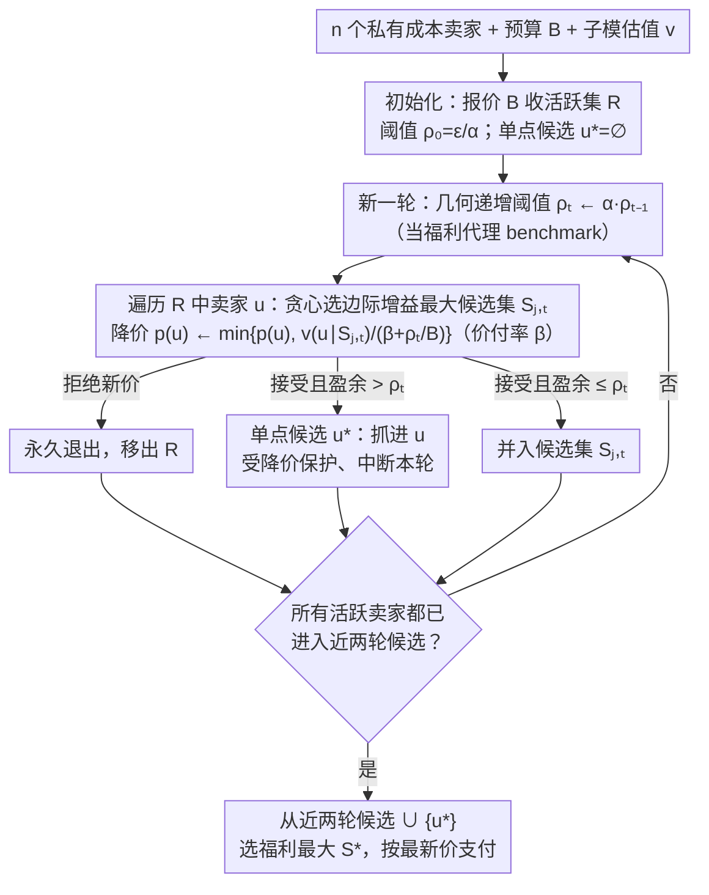

# Budget-Feasible Mechanisms for Submodular Welfare Maximization in Procurement Auctions

**会议**: ICML 2026  
**arXiv**: [2605.00411](https://arxiv.org/abs/2605.00411)  
**代码**: https://anonymous.4open.science/r/BFM-SWM (有, 匿名仓库)  
**领域**: 机制设计 / 算法博弈论 / 子模优化  
**关键词**: 采购拍卖, 预算可行, 子模社会福利, 降序时钟拍卖, 近似比

## 一句话总结
首次给"预算受限 + 私有成本"的子模社会福利最大化采购拍卖给出有近似比保证的真值机制 BFM-SWM——用几何递增阈值的降序时钟拍卖 + 单点保护 + 价/付率参数 $\beta$ 实现非负盈余 + 预算可行，一般子模函数 0.0328-近似、单调子模 0.0877-近似；副产品 BFM-VM 把估值最大化的确定性最佳近似比从 1/64 提升到 $1/(12+4\sqrt{3})\approx 0.0528$，并将运行时间从 $\mathcal{O}(n^2\log n)$ 降到 $\mathcal{O}(n\log n)$。

## 研究背景与动机

**领域现状**：采购拍卖 (一个有预算 $B$ 的买家从 $n$ 个有私有成本 $c(u)$ 的卖家处采购物品) 在众包、影响力最大化、工业采购、数据采购等 AI 市场被广泛应用。Singer (2010) 开创预算可行机制 (budget-feasible mechanism) 后，主流目标是子模估值最大化 $\max_S v(S)$ s.t. $p(S)\le B$，目前一般子模最佳随机近似比 0.0856 (Han 2025)、确定性 1/64 (Balkanski SODA 2022)。

**现有痛点**：(1) Deng et al. 2025 (ICML) 第一次把目标换成更经济意义上正确的"社会福利" $v(S)-c(S)$（净社会价值，类似双边贸易里的 gains-from-trade），但他们的机制**直接放弃了预算可行性**——卖家会拿到超过买家预算的总付款，这在现实采购里根本无法落地。(2) Balkanski 2022 给的最强确定性 1/64 估值最大化机制需要 $\mathcal{O}(n^2\log n)$ 时间，依赖贪心和无约束子模最大化子例程，工程复杂。

**核心矛盾**：福利目标 $v(\cdot)-c(\cdot)$ 既可能为负，又因为 $c(\cdot)$ 是私有信息而**无法被机制直接 query**——这两条让所有现有预算可行机制 (它们都假设目标函数非负、可观测) 直接失效。Nikolakaki 2021 已经证明：即便成本公开，多项式时间下也无法得到福利的常数乘性近似，所以必须采用弱近似 $v(S)-c(S)\ge\gamma_w\cdot v(O)-c(O)$。

**本文目标**：填上"福利最大化 + 预算可行"这块空白——设计一个机制同时满足真值、个体理性、非负卖家盈余、预算可行四条经济性质，并给出有可证近似比的福利下界。

**切入角度**：作者不直接计算候选集合的真实福利（因为成本私有，没法算），而是用一个**几何递增的阈值 $\rho_t$ 作为福利的代理 benchmark**——每轮乘 $\alpha$，价格按 $v(u\mid S)/(\beta+\rho_t/B)$ 下降；同时引入"单点候选 $u^*$"专门保护高价值单个卖家，再用价/付率参数 $\beta$ 强制 $v(S)\ge\beta p(S)$ 来确保非负盈余。

**核心 idea**：把"评估福利"换成"用阈值代理福利"+ "用单点 + 多候选并行"+"用 $\beta$ 强制价付率"，在降序时钟拍卖框架里既绕开私有成本不可观测，又同时锁住预算和盈余两条硬约束。

## 方法详解

### 整体框架
机制 BFM-SWM (Algorithm 1) 是一个**降序时钟拍卖**：先把所有接受报价 $B$ 的卖家收入活跃集 $R$；初始化阈值 $\rho_0=\epsilon/\alpha$ 和单点候选 $u^*=\varnothing$；进入多轮循环——每轮 $t$ 把阈值乘 $\alpha$ ($\alpha>1$)，维护 $\ell\in\{1,2\}$ 条平行候选集 $\{S_{i,t}\}$，遍历 $R$ 中卖家：用贪心找到边际增益最大的候选集 $S_{j,t}$ 并按 $\min\{p(u), v(u\mid S_{j,t})/(\beta+\rho_t/B)\}$ 下调价格；如果加入 $u$ 会让 $S_{j,t}$ 的盈余超过阈值 $\rho_t$，就把 $u$ 抓进单点候选 $u^*$ 并中断；否则把 $u$ 并入 $S_{j,t}$。所有活跃卖家都进入近两轮的候选集后终止，最终从 $\{S_{i,M-1}, S_{i,M}\}\cup\{u^*\}$ 里选福利最大的 $S^*$ 输出。三个关键设计正好嵌在这条流水线的不同环节：每轮抬高的**几何递增阈值**当福利代理、降价分母里的**价付率 $\beta$** 锁非负盈余、盈余越界时启用的**单点候选 $u^*$** 保护高价值卖家。

### 关键设计

**1. 几何递增阈值 $\rho_t=\alpha^t\cdot\rho_0$ 作为福利代理：用一个能单调收紧的门槛替代算不出来的真实福利**

福利目标 $v(\cdot)-c(\cdot)$ 含私有成本 $c(\cdot)$，机制根本 query 不到，所以"直接算候选集福利"这条路堵死了；但 marginal value $v(u\mid S)$ 是可观测的。BFM-SWM 因此引入一个以速率 $\alpha>1$ 几何递增的阈值 $\rho_t$ 当福利的代理 benchmark，让它身兼两职：一是塞进价格分母——价格规则 $p(u)\leftarrow\min\{p(u),\, v(u\mid S_{j,t})/(\beta+\rho_t/B)\}$ 使阈值越高、价格越低、卖家越容易退出；二是当裁剪条件——一旦盈余 $v(S_{j,t}\cup\{u\})-p(\cdots)>\rho_t$ 就停，给候选集的福利封个上界。分析的关键一步（Lemma 4.5）证明 $\rho_M\le 2\alpha(v(S^*)-p(S^*))$，把"最终阈值"反向锚到机制输出的福利上，于是这个可控收紧的门槛既近似了福利、又保证不会漏掉高价值候选。

**2. 单点候选 $u^*$ 的"暂时保护"：给个别极高价值卖家留一个不被降价压死的舱位**

子模性 + 阈值递增 + 多候选并行会带来一个副作用：某个单独特别有价值的卖家，在阈值后期膨胀时会被降价规则压到退出，机制白白丢掉关键物品。$u^*$ 就是为此设的保护舱——当某卖家 $u$ 加入候选集会让盈余越过当前阈值时，它不被吸进 $S_{j,t}$，而是被抓进 $u^*$ 并中断本轮，此后不再受后续降价规则覆盖。最终选福利最大输出时，$\{u^*\}$ 也在候选之列。这一格保护正是 Lemma 4.5 的 $\rho_M$ 上界成立的前提：消融显示去掉 $u^*$ 就会丢掉单点高价值卖家，近似比直接失效。

**3. 价/付率参数 $\beta>1$ 强制非负盈余：把"买家有正盈余"写成机制层面的硬约束**

经典预算可行机制只管 $p(S)\le B$，但福利目标多了一条隐性要求——买家盈余 $v(S)-p(S)$ 必须非负，否则采购无意义。$\beta$ 就是为锁住这条而设：它被直接放进价格分母 $v(u\mid S)/(\beta+\rho_t/B)$，于是每个加入 $S_{i,t}$ 的元素都满足 $v(u\mid S_{i,t}^u)\ge\beta p(u)$，逐元素求和后得到 $v(S_{i,t})\ge\beta p(S_{i,t})$（Lemma 4.6），进而

$$v(S)-p(S)\ge\Big(1-\tfrac{1}{\beta}\Big)v(S)\ge 0.$$

这条不等式把福利、估值与支付绑成 $v(A)\le(v(A)-p(A))/(1-1/\beta)\le(v(A)-c(A))/(1-1/\beta)$，让 $\beta$ 既保证非负盈余、又与阈值耦合一起进入近似比分析——这也是为什么估值最大化的副产品 BFM-VM 取 $\beta=0$（它不需要这条盈余约束）。

### 损失函数 / 训练策略
理论分析挑参数：一般 (非单调) 子模函数取 $\ell=2, \alpha=1+\tfrac{2\sqrt{6}}{3}, \beta=4$ 得 0.0328-近似（Thm 4.8）；单调子模可简化为 $\ell=1, \alpha=1+\tfrac{\sqrt{6}}{2}, \beta=3$ 得 0.0877-近似（Thm 4.10）。运行时间 $\mathcal{O}(n\log(\text{OPT}/\epsilon))$；BFM-VM 副产品取 $\ell=2, \alpha=1+\sqrt{3}, \beta=0$ 得 $1/(12+4\sqrt{3})$-近似的估值最大化机制，$\mathcal{O}(n\log n)$ 时间。

## 实验关键数据

### 主实验
在 SNAP 上跑影响力最大化（Slashdot 77K nodes 905K edges、Email 265K nodes 420K edges、Epinions 131K nodes 841K edges），度量社会福利 $v(S)-c(S)$ 和 oracle 查询次数。

| 应用 / Baseline | 福利相对 BFM-SWM | 查询次数 |
|---|---|---|
| Deng-Distorted / Deng-ROI / Deng-CostScaled (本文 baseline) | 0.04× – 0.82× (各预算 / 数据集差异大) | 通常更多 |
| BFM-SWM (Ours) | **1.00× (基准)** | 通常更少 |
| 平均提升倍数 | **4.49×** | – |
| 最大提升倍数 | **26.41×** | – |
| 最小提升倍数 | **1.22×** | – |

附录 C 还展示 BFM-VM 在众包估值最大化上对 Balkanski 2022 等 SOTA 的优势。

### 消融实验

| 配置 | 关键指标 | 说明 |
|---|---|---|
| 完整 BFM-SWM (一般子模, $\ell=2$) | 0.0328-近似 | 主结果 |
| 单调子模特化 ($\ell=1$) | **0.0877-近似** | 利用单调性可去掉第二条候选序列 |
| BFM-VM (副产品, 估值最大化) | $1/(12+4\sqrt{3})\approx 0.0528$ | 较 Balkanski 2022 (1/64) **提升 3.38×** |
| BFM-VM 时间复杂度 | $\mathcal{O}(n\log n)$ | 较 Balkanski 2022 的 $\mathcal{O}(n^2\log n)$ 降一个 $n$ 因子 |
| 去掉 $u^*$ | 失去 Lemma 4.5 的 $\rho_M$ 上界 | 单点高价值卖家会丢掉，近似比失效 |
| 去掉 $\beta$ (即 $\beta=0$, 仅适用估值最大化) | 失去非负盈余保证 | 福利可能为负 |

### 关键发现
- baseline 即使做了 prefix-truncation 来满足预算，依然没有理论保证，导致它们在很多预算点上福利接近 0 或为负，而 BFM-SWM 始终维持正福利且有 4.49× 平均优势。
- 把阈值 $\rho_M$ 和 $S^*$ 的输出福利绑住 (Lemma 4.5) 是分析里的关键步骤——它把"几何递增的阈值"转换成"对最终福利的上界"。
- BFM-VM 的提速主要来自只用阈值过滤构造不相交候选集，绕开了 Balkanski 那种需要无约束子模最大化的重子例程。

## 亮点与洞察
- 解决了一个早就被提出但被认为"很难"的开放问题——同时满足预算可行 + 福利目标 + 真值 + 个体理性 + 非负盈余的子模机制，给后续 AI 市场场景 (数据采购、众包等) 提供了第一个工程可行的真值机制。
- "几何递增阈值"+"单点保护"+"价/付率参数" 这三件套是一套可复用的 mechanism-design 工具——任何"目标含私有量、又要预算可行"的场景都可以套这个模板。
- 副产品 BFM-VM 把估值最大化的最强确定性近似比从 12 年没动过的 1/64 直接抬到 $1/(12+4\sqrt{3})$，同时砍掉一个 $n$ 因子，是一次相当干净的"顺手做大"。
- 选择降序时钟拍卖 (而非密封投标) 还附带了 obvious strategyproofness，比 Deng 2025 的 sealed-bid 更难被操纵。

## 局限与展望
- 近似比 0.0328 距离非预算受限或非私有成本下的最佳近似 (1−1/e≈0.632) 仍然差很多，这部分是 Nikolakaki 2021 的不可能性结果在挤压，但仍有改进空间。
- 实验只跑了影响力最大化和众包，没覆盖数据市场、定价 API 这种 AI 应用场景；价值函数都是覆盖函数 (coverage)，更复杂的 valuation oracle 性能未知。
- 阈值 $\rho_t$ 几何递增的速率 $\alpha$ 和价付率 $\beta$ 都需要按一般/单调拼凑常数 (如 $1+2\sqrt{6}/3$、$1+\sqrt{6}/2$)，落地时需要小心选择。
- ℓ 仅取 1 或 2，理论分析没扩到一般 $\ell$；如果允许更多候选序列，近似比能否进一步提升是未解。

## 相关工作与启发
- **vs Deng et al. 2025**：他们第一次做福利最大化但放弃预算可行，且采用 sealed-bid；本文给出第一个预算可行 + 福利目标的机制，且改用 descending clock auction 获得 obvious strategyproofness；实验上 BFM-SWM 在福利和效率上都显著好。
- **vs Balkanski et al. 2022 (SODA)**：他们给确定性估值最大化 1/64；本文副产品 BFM-VM 用更简洁的阈值过滤替代贪心 + 无约束子模子例程，达到 $1/(12+4\sqrt{3})$ 且 $\mathcal{O}(n\log n)$。
- **vs Distorted Greedy / Cost-Scaled Greedy / ROI Greedy**：这些是 regularized 子模最大化算法（公开成本），无法直接处理私有成本；本文用阈值机制把它们"机制化"，并给出对应的近似比。

## 评分
- 新颖性: ⭐⭐⭐⭐⭐ 首次同时给出福利目标 + 预算可行的真值机制，并副产品打破 12 年未动的确定性估值最佳近似比记录。
- 实验充分度: ⭐⭐⭐ 三个 SNAP 数据集 + 影响力最大化主实验完整；附录补了估值最大化的众包对比；但只覆盖一两类应用，不算遍历常见 AI 市场。
- 写作质量: ⭐⭐⭐⭐⭐ 难点 (私有 + 非负性) 和技术 (阈值代理 + 单点保护 + $\beta$) 的对应关系讲得非常清楚，定理分析层层递进。
- 价值: ⭐⭐⭐⭐⭐ 对算法博弈论社区是一次明确的进展；对工业界 (数据采购、众包平台) 给出了一个可落地的真值机制。

<!-- RELATED:START -->

## 相关论文

- [\[ICML 2026\] A General Framework for Dynamic Consistent Submodular Maximization](a_general_framework_for_dynamic_consistent_submodular_maximization.md)
- [\[ICML 2026\] Differentially Private Submodular Maximization with a Knapsack Constraint](differentially_private_submodular_maximization_with_a_knapsack_constraint.md)
- [\[NeurIPS 2025\] Online Two-Stage Submodular Maximization](../../NeurIPS2025/optimization/online_two-stage_submodular_maximization.md)
- [\[NeurIPS 2025\] A Unified Approach to Submodular Maximization Under Noise](../../NeurIPS2025/optimization/a_unified_approach_to_submodular_maximization_under_noise.md)
- [\[ICML 2026\] Depth over Fidelity in Fixed-Budget Noisy Evolution Strategies](depth_over_fidelity_in_fixed-budget_noisy_evolution_strategies.md)

<!-- RELATED:END -->
