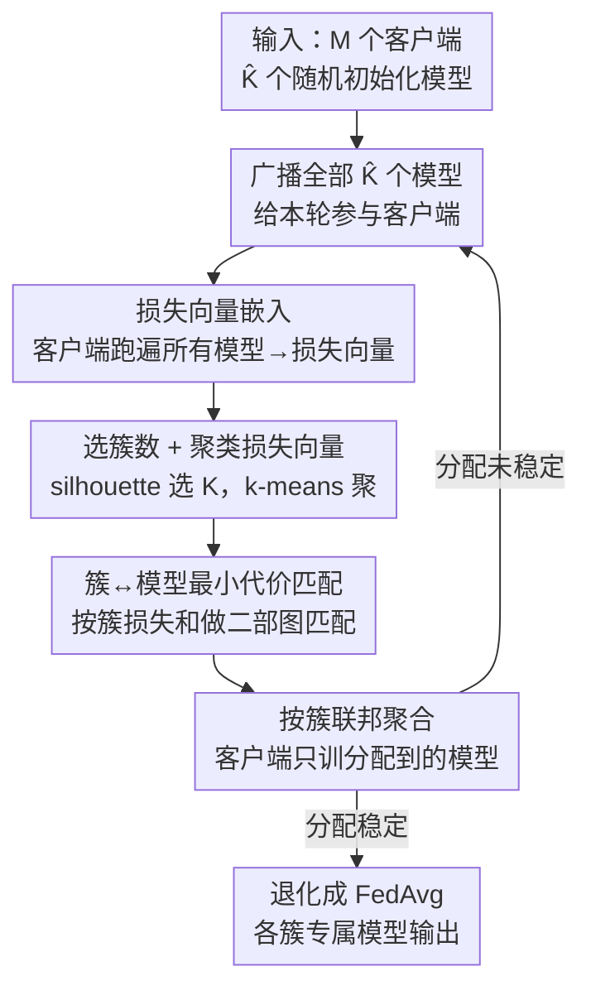

# CLoVE: Personalized Federated Learning through Clustering of Loss Vector Embeddings

**会议**: ICML 2026  
**arXiv**: [2506.22427](https://arxiv.org/abs/2506.22427)  
**代码**: https://github.com/Nokia-Bell-Labs/Loss-Vector-based-Clustered-Federated-Learning  
**领域**: 联邦学习 / 优化  
**关键词**: 聚类联邦学习, 个性化联邦学习, 损失向量嵌入, 客户端聚类, 非IID

## 一句话总结
CLoVE 用「每个客户端在所有候选模型上的损失向量」当作客户端嵌入来做聚类联邦学习，靠「同簇客户端损失模式相近、异簇损失模式迥异」这一观察，在不需要精心初始化模型的前提下，几轮通信内就恢复出正确的客户端簇并训练出各簇专属模型，在大量非 IID 设置下达到 SOTA。

## 研究背景与动机

**领域现状**：联邦学习（FL）把分散在各客户端的数据联合训练而不集中原始数据，但客户端数据分布天然异质（non-IID），单一全局模型（FedAvg）往往照顾不了所有人。个性化联邦学习（PFL）因此兴起，其中一个重要分支是**聚类联邦学习（CFL）**：假设客户端天然属于 $K$ 个簇（簇内同分布），目标是同时**恢复簇划分**并为每个簇训练一个专属模型。

**现有痛点**：难点在于簇标签事先未知。一类经典方法（k-means、k-FED）依赖「不同簇的数据点本身分得很开」这个假设，但现实数据常常违背——即便在中心化设置下 k-means 聚 MNIST 的 ARI 也只有约 50%，因为同一数字的样本方差大、常常离别的簇更近。另一类代表方法 **IFCA** 用「客户端在哪个模型上损失最小就归到哪个簇」来分配，但它对模型初始化极其敏感：要求每个初始模型与其最优模型的距离严格小于「任意两最优模型最小间距的一半」。一旦初始化不够好，多个簇的客户端会在同一个模型上取得最低损失而被一股脑分到同一簇，剩下的模型拿不到更新、损失一直高、再也没人选它，算法就此卡死、退化成单簇。

**核心矛盾**：用「单个标量损失（取 argmin）」做客户端归属，信息太稀薄、对初始化太敏感；而用「原始数据距离」聚类，又会被数据本身的高方差/高重叠击穿。

**切入角度**：作者的关键观察是——即使各簇**原始数据高度重叠**，把客户端在**一组模型上的损失拼成一个向量**后，不同簇的损失向量依然能拉得很开。如图示例：簇 1 客户端的损失向量约为 $[1.0, 5.1]$、簇 2 约为 $[2.1, 3.5]$，虽然两簇在「最小损失」这一维度上都偏向模型 $\theta_1$（会被 IFCA 误并），但作为二维向量它们方向迥异、可被聚类清晰分开。

**核心 idea**：用「损失向量（loss vector embedding）」代替「单点 argmin 损失」作客户端嵌入，对这些向量直接聚类来恢复簇，再把簇匹配回模型、各自联邦聚合——既保留了 IFCA 损失驱动的简洁性，又摆脱了它对初始化的苛刻要求。

## 方法详解

### 整体框架
CLoVE 在「服务器维护 $\hat{K}$ 个候选模型」的标准 FL 架构上迭代运行（$\hat{K}$ 是簇数上界，若已知真值 $K$ 则取 $\hat{K}=K$）。每一轮里，服务器把全部候选模型广播给一部分参与客户端；每个客户端把自己的数据跑过**所有**模型，得到一个长度 $\hat{K}$ 的损失向量回传；服务器对这批损失向量聚类、把客户端簇用最小代价匹配回模型、再让各客户端只在自己被分配的那个模型上本地训练并上传更新，服务器按簇聚合。如此「聚类 ↔ 训练」交替，直到客户端到簇/模型的分配**稳定**；稳定后服务器不再算损失向量、退化成普通 FedAvg，开销极小。

### 关键设计

**1. 损失向量嵌入：用一整条损失曲线而非单点损失刻画客户端**

针对 IFCA「只取 argmin 损失、信息稀薄、卡死退化」的痛点，CLoVE 把客户端 $i$ 在全部 $\hat{K}$ 个模型上的经验损失拼成一个向量 $L_{i,(t)} = [L_i(\theta_1^{(t)}), \dots, L_i(\theta_{\hat{K}}^{(t)})]$ 作为该客户端的嵌入。经验损失定义为 $L_i(\theta; Z_i) \triangleq \frac{1}{|Z_i|}\sum_{z\in Z_i} f(\theta; z)$。直觉上，同簇客户端因数据同分布、在每个模型上的损失都接近，向量也接近；异簇客户端则在不同模型上呈现不同的损失高低模式，向量被拉开。这一步把「谁该归谁」的判据从一维 argmin 升维成 $\hat{K}$ 维的几何关系，即便两簇都偏好同一个模型（argmin 相同），它们的完整损失向量仍可分。理论分析里作者进一步用**损失平方根向量（SLV）** $a^i_k(\theta)=[\sqrt{L^i_k(\theta_1)}, \dots]$，因为在线性回归下 $\sqrt{L^i_k(\theta)} \sim \frac{\alpha(\theta,\theta^*_k)}{\sqrt{n_k}}\chi(n_k)$ 服从（缩放的）卡方分布，便于刻画簇间均值分离度。

**2. 聚类 + 最小代价簇-模型匹配：把无标签的簇对齐到具体模型**

拿到一批损失向量后，服务器先用 `selectBestK`（在候选 $K$ 范围内扫一遍、取 **silhouette 分数**最高者，或用肘部法）确定本轮簇数 $K^{(t+1)}$，再用 k-means 之类算法把损失向量聚成 $K^{(t+1)}$ 个客户端簇。但「第 3 个客户端簇」和「第 3 个模型」之间没有天然对应，所以要做一次**最小代价二部图匹配**：左边节点是客户端簇、右边是模型，边权取「该簇所有客户端在该模型上的损失之和」，用 max-flow / 匈牙利算法求最小代价匹配，从而把每个簇分配到「整体损失最低」的模型上。这一步保证了聚类结果能正确落到对应的专属模型，而不是随机对齐。

**3. 按簇联邦聚合 + 稳定性判定：交替细化并优雅收尾**

匹配完成后，每个客户端只在自己被分配的模型 $\kappa_i$ 上本地训练 $\tau$ 个 epoch（Option I 上传模型参数做模型平均，Option II 上传梯度做梯度平均），服务器对每个模型 $j$ 只聚合归属它的客户端集合 $C^{(t)}_j$ 的更新，如 $\theta_j^{(t+1)}=\frac{\sum_{i\in C^{(t)}_j} n_i \tilde{\theta}_i}{\sum_{i\in C^{(t)}_j} n_i}$。由于每个模型主要被本簇客户端更新，模型越训越「专」、损失向量越分越开，下一轮聚类更准——形成正反馈。**稳定性**靠客户端本地记账实现：每个客户端记录自己历轮的模型分配，一旦连续若干轮不变就向服务器声明「已稳定」，服务器发现全部（或设定比例）客户端都稳定即宣告整体收敛，此后只给每个客户端发其单一模型（新客户端按「质心最近」分配），服务器无需保存任何客户端级状态。

### 损失函数 / 训练策略
分类任务用交叉熵、无监督重建任务用自编码重建误差；理论分析用平方误差 $f(\theta;x,y)=(\langle\theta,x\rangle-y)^2$。两个理论结论支撑其有效性：**(i) 一次性簇恢复**——在正交初始化或 $\Delta$-proximal 模型下，对 SLV 做 k-means 能以高概率 $\xi=1-\delta-\frac{1}{\text{polylog}(M)}$ 单轮恢复正确聚类（证明归约到 Kumar & Kannan 的 proximity 条件）；**(ii) 指数收敛**——$T$ 轮后每个模型满足 $\|\theta_k-\theta^*_k\|\le \frac{\Delta}{c_1^T}$，即以常数因子 $c_1$ 指数逼近最优。值得注意：CLoVE 仅假设最优模型间分离 $\Delta$，**不对初始模型分离做任何假设**（这正是相对 IFCA 的关键松绑）。

## 实验关键数据

### 主实验
在图像分类、文本分类、图像重建三类任务、6 个数据集（MNIST / FMNIST / CIFAR-10 / FEMNIST / Amazon / AG News）、多种 label skew / feature skew / concept shift 非 IID 划分下，对比 FedAvg、Local-only、Per-FedAvg、FedProto、FedALA、FedPAC、CFL-S、FeSEM、FlexCFL、PACFL、IFCA。下表摘录监督测试精度（%），CLoVE 在绝大多数配置取得最高或并列最高：

| 配置 | 数据集 | CLoVE | IFCA | 最强基线 | 说明 |
|------|--------|-------|------|----------|------|
| Label skew 1 | MNIST | **99.8** | 99.1 | FlexCFL 99.4 | 几乎满分 |
| Label skew 1 | CIFAR-10 | **90.5** | 85.7 | CFL-S 87.4 | 领先约 3-5 个点 |
| Concept shift | CIFAR-10 | **58.4** | 52.7 | FedAvg 63.1* | 高难度下仍居前列 |
| Label skew 2 | CIFAR-10 | **66.8** | 63.4 | CFL-S 62.1 | 超过 IFCA |
| Feature skew | MNIST | **97.7** | 95.9 | FlexCFL 96.7 | 稳居榜首 |
| Label skew 2 | AG News | 55.1 | 51.3 | FlexCFL 60.2 | 文本上略逊 FlexCFL |

（标 * 处个别基线偶有更高，但整体上 CLoVE 综合最优；FeSEM 因 EM 易陷局部最优表现明显偏弱，如 CIFAR-10 仅 11–15%。）

### 消融 / 分析

| 维度 | CLoVE 表现 | 对比 |
|------|-----------|------|
| 初始化鲁棒性 | 随机/非特定初始化即可恢复簇 | IFCA 需初始模型落在最优半径内，否则卡死 |
| 收敛轮数 | < 10 轮完成聚类 | CFL-S 常需数百轮 |
| 动态细化 | 逐轮细化簇分配、质量随时间提升 | FlexCFL 单轮静态聚类、无法纠错 |
| 适用范围 | 监督 + 无监督（重建）皆可 | 多数 PFL 方法仅监督 |
| 局部最优 | 损失向量聚类避免 EM 式陷阱 | FeSEM 易陷局部最优 |

### 关键发现
- **损失向量是关键升维**：原始数据高度重叠（低可分性）时，损失向量仍可分，这是 CLoVE 在高方差/高重叠 non-IID 下超过基于数据距离聚类（k-FED/PACFL）的根因。
- **去掉初始化苛求是最大实用价值**：IFCA 在 MNIST 上常因初始化失败，CLoVE 随机初始化即可——这是它「简单 + 鲁棒」卖点的实证。
- **无监督 CFL 几乎空白，本文首次系统评测**：在自编码重建任务上同样有效，拓展了 CFL 的边界。

## 亮点与洞察
- **「损失即嵌入」的视角很巧**：不引入额外通信或服务器端状态，直接复用训练中本就要算的损失，把它们拼成向量当特征——零额外成本地把判别信息从 1 维升到 $\hat{K}$ 维。这个 trick 可迁移到任何「需要无监督地给客户端/任务分组」的场景。
- **理论与工程双落地**：既给出线性回归下单轮恢复 + 指数收敛的严格界，又开源了在 6 数据集上的完整实现，理论假设（只需最优模型分离、不需初始模型分离）正好对应工程上「随机初始化也能跑」的观察。
- **稳定性靠客户端本地记账**：服务器不存客户端级状态，天然契合隐私与可扩展性，且稳定后无缝退化为 FedAvg。

## 局限与展望
- **理论保证局限于线性回归 / 混合线性模型**：一次性恢复与指数收敛的证明在线性设置下成立，深度网络上只有经验结果，缺乏理论刻画。
- **依赖若干分离假设**：分析假设最优模型单位范数、最小分离 $\Delta$ 接近 1、SNR（$\Delta/\sigma$）不太小、簇数 $K$ 远小于客户端数与维度；当簇中心非常接近或噪声极大时，损失向量的可分性也会退化。
- **每轮需广播全部 $\hat{K}$ 个模型并跑遍所有模型**：聚类阶段的通信与计算随 $\hat{K}$ 线性增长，$\hat{K}$ 估得过大时前期开销不小（稳定后才降下来）。
- **文本任务非全面领先**：AG News 上落后 FlexCFL，说明损失向量在某些模态/任务上的判别力仍有提升空间。

## 相关工作与启发
- **vs IFCA**：两者都用损失驱动归属，但 IFCA 取单点 argmin 损失、要求初始模型落在最优半径内，易因多簇争抢同一模型而卡死；CLoVE 用完整损失向量聚类 + 簇-模型最小代价匹配，摆脱初始化苛求，且能动态纠错。
- **vs CFL-S**：CFL-S 用梯度嵌入迭代成簇但常需数百轮收敛；CLoVE < 10 轮即可，且能处理稀疏参与与掉队者。
- **vs FlexCFL / PACFL**：它们做一次性（静态）聚类、错了无法纠；CLoVE 逐轮细化、质量随时间提升。
- **vs FeSEM**：FeSEM 用 EM 式匹配用户与模型中心，易陷局部最优；CLoVE 基于损失向量聚类规避了这一陷阱。
- **vs k-FED / k-means 类**：依赖数据本身可分；CLoVE 即使原始数据重叠也能靠损失向量分开，对高方差数据更稳。

## 评分
- 新颖性: ⭐⭐⭐⭐ 「损失向量当嵌入」视角简洁有力，松绑了 IFCA 的初始化苛求并统一了监督/无监督 CFL。
- 实验充分度: ⭐⭐⭐⭐⭐ 6 数据集、3 类任务、大量 non-IID 划分、11 个基线，监督+无监督全覆盖。
- 写作质量: ⭐⭐⭐⭐ 动机用图示讲清 IFCA 卡死机制，理论与实验衔接好；理论部分公式较密。
- 价值: ⭐⭐⭐⭐ 简单、鲁棒、少通信、可纠错，工程实用性强，已开源。

<!-- RELATED:START -->

## 相关论文

- [\[CVPR 2026\] Few-for-Many Personalized Federated Learning](../../CVPR2026/optimization/few-for-many_personalized_federated_learning.md)
- [\[CVPR 2025\] SCOPE: Semantic Coreset with Orthogonal Projection Embeddings for Federated Learning](../../CVPR2025/optimization/scope_semantic_coreset_with_orthogonal_projection_embeddings_for_federated_learn.md)
- [\[AAAI 2026\] Personalized Federated Learning with Bidirectional Communication Compression via One-Bit Random Sketching](../../AAAI2026/optimization/personalized_federated_learning_with_bidirectional_communication_compression_via.md)
- [\[ICLR 2026\] Learning to Recall with Transformers Beyond Orthogonal Embeddings](../../ICLR2026/optimization/learning_to_recall_with_transformers_beyond_orthogonal_embeddings.md)
- [\[NeurIPS 2025\] Personalized Subgraph Federated Learning with Differentiable Auxiliary Projections](../../NeurIPS2025/optimization/personalized_subgraph_federated_learning_with_differentiable_auxiliary_projectio.md)

<!-- RELATED:END -->
