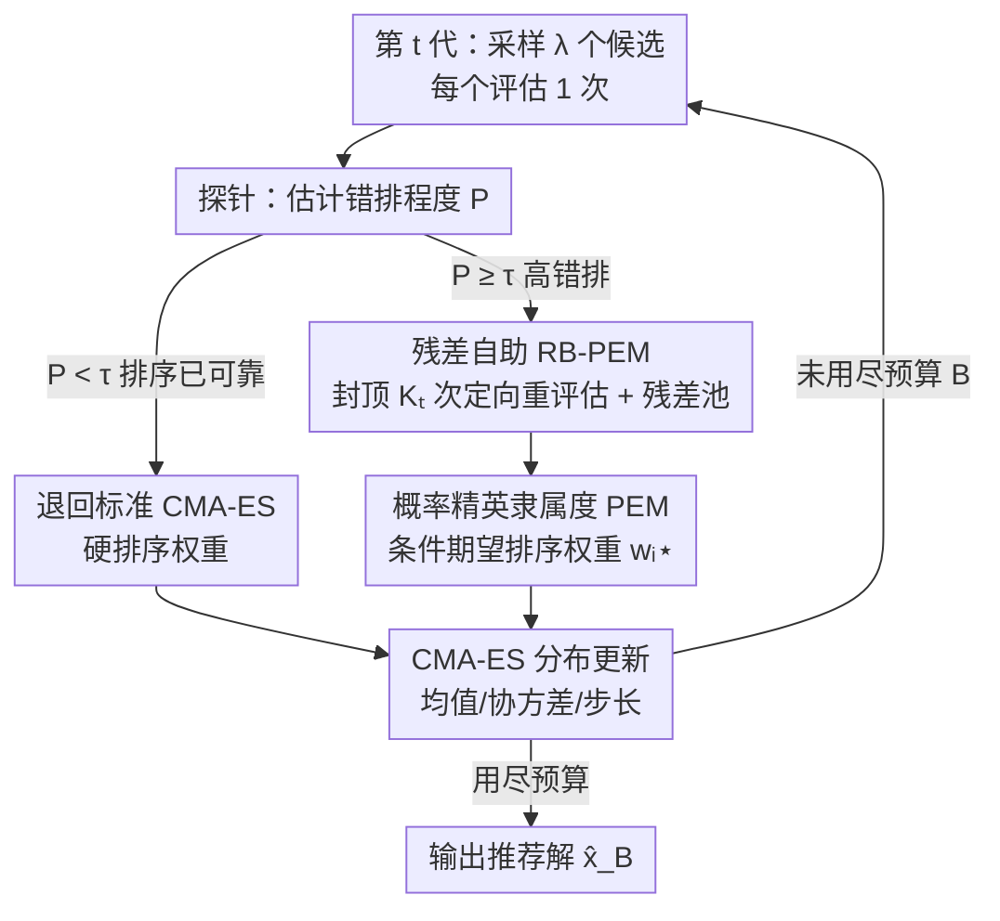

# Depth over Fidelity in Fixed-Budget Noisy Evolution Strategies

**会议**: ICML 2026  
**arXiv**: [2606.06555](https://arxiv.org/abs/2606.06555)  
**代码**: https://github.com/sichen-wang/Depth-over-Fidelity_ICML2026  
**领域**: 黑盒优化 / 演化策略  
**关键词**: 演化策略, 噪声优化, 固定预算, CMA-ES, Rao–Blackwell, 零阶优化

## 一句话总结
在评估次数被严格限死（fixed budget）的噪声黑盒优化里，与其花预算反复测量去"洗干净"代际内排序（fidelity），不如把这些预算省下来多做几代分布更新（depth）；论文用 **PEM（概率精英隶属度）** 把硬排序权重换成"对排序不确定性求期望"的软权重，并用 **残差自助（RB-PEM）** 以接近零的额外开销估计它，在高错排、预算受限的场景上稳定跑赢"先去噪再排序"的主流做法。

## 研究背景与动机
**领域现状**：很多机器学习场景的目标函数只能通过**带噪声的函数评估**访问——策略搜索里的随机 rollout、仿真控制、硬件在环调参、训练-验证带内在随机性的超参优化。这类问题最硬的约束往往是 oracle 查询次数被严格封顶，即**固定预算协议**。在黑盒优化器里，基于排序的演化策略（尤其 CMA-ES）很受欢迎，因为它只需要候选之间的**相对比较**，对问题尺度变换天然不变、鲁棒。

**现有痛点**：正因为 CMA-ES 只依赖代际内排序，它对评估噪声格外敏感。一旦一批采样候选的目标值被扰动，诱导出的排序排列就会变，于是优化器拿着被"错排的精英"去更新分布——评估噪声直接变成了**选择噪声**，污染更新方向。

**核心矛盾**：主流降噪做法是给每个候选多评估几次再聚合（uniform resampling、racing、UH-CMA-ES 等），把代际内排序逼近无噪声排序后再做标准更新——这是一种 **fidelity 优先**的立场。但在固定预算下，fidelity 是有代价的：每个候选评估 $k$ 次，能完成的代数就反比缩水 $T \le \lfloor B/(k\lambda)\rfloor$。而 CMA-ES 的威力恰恰来自**多代累积**的分布学习（均值、协方差、步长自适应）。更糟的是，对截断选择最关键的比较发生在精英阈值 $r\approx\mu$ 附近，那里候选目标值几乎难以区分，靠重复评估把它们分清楚需要的 $k$ 由 $k=\Omega\!\big((\sigma_i^2+\sigma_j^2)/\Delta_{ij}^2 \cdot \log(1/\delta)\big)$ 给出——间隔 $\Delta_{ij}$ 越小，代价越爆炸，depth 崩得越狠。

**本文目标 / 切入角度**：作者提出一个与主流互补的**固定预算原则——depth over fidelity**：当排序不确定性高时，保持每代评估成本接近"一候选一次"，把省下的预算用于多做几代更新；同时把不确定性**直接吃进选择权重**里，而不是花预算先把排序洗干净。

**核心 idea**：用"条件期望排序权重"$\mathbb{E}[w(r_i)\mid x_{1:\lambda}]$ 代替"单次噪声排序得到的硬权重"$w(r_i)$，从选择阶段而非评估阶段消化不确定性——这一步可被理解为对噪声排序更新做 **Rao–Blackwell 方差缩减**。

## 方法详解

### 整体框架
方法叫 **PEM + RB-PEM + Probe-and-Switch**，目标是在固定预算 $B$ 下最大化优化 depth。整体思路是：每代仍按 CMA-ES 采样 $\lambda$ 个候选，但**每个候选只评估一次**作为基准，再花一个被严格封顶的小额外预算 $K_t \le K_{\max} \ll \lambda$ 做定向重评估，用来标定本地噪声模型；随后用残差自助在"零评估成本"下模拟大量伪排序，估出每个候选的**软权重**，喂回 CMA-ES 的均值/协方差/步长更新。由于额外开销很小，每代成本 $C_t=\lambda+K_t$，depth 保持在 $T\approx B/(\lambda+\mathbb{E}[K_t])\approx B/\lambda$。最后用一个低成本探针决定到底跑 RB-PEM 还是退回标准 CMA-ES，避免在低噪声场景白白付平滑开销。

### 关键设计

**1. 概率精英隶属度 PEM：把硬排序权重换成对不确定性求期望的软权重**

标准 CMA-ES 用确定性权重 $w(r_{t,i})$ 作用在单次噪声排序 $r_{t,i}$ 上，于是即便条件在候选集 $x_{1:\lambda}$ 上、更新方向仍是随机的——这正是错排污染更新的根源。PEM 把每个候选的权重定义为它在排序不确定性下的**条件期望**：

$$w_{t,i}^{\star} := \mathbb{E}\!\left[w(r_{t,i})\mid x_{t,1:\lambda}\right].$$

对经典的 top-$\mu$ 截断权重 $w(r)=\frac{1}{\mu}\mathbf{1}\{r\le\mu\}$，它有干净的概率解释 $w_{t,i}^{\star}=\frac{1}{\mu}\Pr(r_{t,i}\le\mu\mid x_{1:\lambda})$：阈值附近的候选拿到的是**分数隶属度**，正比于它"被选中"的概率，而不是硬的 0/1。更一般地，记 $\delta_k=w_k-w_{k+1}$、$p_{t,i,k}=\Pr(r_{t,i}\le k\mid x_{1:\lambda})$，则 $w_{t,i}^{\star}=w_\lambda+\sum_{k=1}^{\lambda-1}\delta_k\,p_{t,i,k}$，即把各档 top-$k$ 隶属概率叠加起来。

PEM 的关键性质（Lemma 1）是它**保持条件均值更新不变**：$\mathbb{E}[\Delta m_t(y)\mid x_{1:\lambda}]=\Delta m_{\text{PEM},t}$，但把条件方差（更新弥散度）压下去——这就是对噪声排序更新的 **Rao–Blackwellization**。理论上（Theorem 1）在局部 $\alpha$-强凸区域，更新弥散会带来一个不可避免的期望目标损失 $\frac{\alpha}{2}\mathbb{E}[\lVert X-\bar X\rVert^2\mid x_{1:\lambda}]$；PEM 直接打掉这个弥散项，因此即使两种策略条件均值相同，PEM 仍更优。

**2. 残差自助 RB-PEM：用封顶开销 + 跨代共享残差池，几乎零成本估出 PEM**

精确算 $w_{t,i}^{\star}$ 需要对每个候选大量重评估，会让 depth 崩塌。RB-PEM 是它的可落地估计器：每代每个候选评估一次，外加一个**封顶且可加性**的小重评估集 $K_t\le K_{\max}\ll\lambda$ 来标定本地噪声模型，从中抽取**标准化噪声残差**并塞进一个**跨代复用的残差池**。有了这个被摊销的残差池，就能从中重采样、模拟大量自助排序——这一步几乎不消耗 oracle 评估，于是可以准确估计期望权重，同时把每代成本压在 $C_t=\lambda+K_t$、$\mathbb{E}[K_t]\ll\lambda$，depth 仍 $\approx B/\lambda$。

相比参数化贝叶斯（要先假设一个似然再采样隐变量），残差自助走**非参数**路线：直接从经验残差池抽样，免于为非高斯、异方差、状态相关的噪声指定似然，还能让同一批自助排序服务于任意权重映射 $w(\cdot)$。代价是残差池可能与目标分布失配（有限池、非平稳漂移、协变量相关的形状变化、中心/尺度标准化误设）。论文用 Wasserstein-1 距离 $W_1(\widehat D_t, D_t)$ 量化失配，并把它分解成有限池项 + 三个偏置项，作为**可在线测量的运行时诊断**，从而把"池失配 → 期望权重误差"打通成可检查的链条。

**3. Probe-and-Switch：低成本探针决定该平滑还是退回标准 CMA-ES**

depth-over-fidelity 不是万能的：当排序本来就可靠时，平滑反而会削弱选择压力，而那点重评估预算 $K_t$ 就纯属浪费。论文因此引入一个**低成本探针**，用很小的 probing 预算估计当前任务的错排程度统计量 $P$（归一化排序分歧），并据此在标准 CMA-ES 与 RB-PEM 之间动态切换。决策依据是条件优势 $\Delta(p)=\mathbb{E}[L_{\text{CMA}}-L_{\text{RB-PEM}}\mid P=p]$：实验显示 $\Delta(p)$ 近似**单次穿零**——小 $P$（排序稳定）时为负、超过阈值后为正，于是"$P\ge\tau$ 走 RB-PEM、否则走 CMA-ES"是单调穿越下的贝叶斯最优规则（Proposition 5），在 COCO 上标定出 $\tau=0.12$（激进）与 $\tau=0.22$（保守）两个稳健工作点。

### 一个完整示例
设维度 $d=40$、预算 $B=100d=4000$、默认 $\lambda=15$、$\mu=7$，噪声很大导致阈值 $r\approx\mu=7$ 附近候选难以区分。**主流 Res.(10)** 给每候选评估 10 次，每代花 $10\times15=150$ 次评估，于是只能跑约 $4000/150\approx 26$ 代——排序是干净了，但分布只学了 26 步。**RB-PEM** 每候选评估 1 次、外加封顶 $K_{\max}=1$ 的定向重评估，每代约 $15+\!\le\!15$ 次（实际 $\mathbb{E}[K_t]\ll15$），depth 接近 $4000/15\approx 266$ 代；阈值附近那几个分不清的候选不再被强行二选一，而是按"被选中概率"拿分数权重，更新方向方差更小。多出近 10 倍的代数让均值/协方差/步长充分自适应，最终 simple regret 更低——这正是 depth 压过 fidelity 的具体画面。

## 实验关键数据

### 主实验
评测基准为 COCO **bbob-noisy** 套件（30 函数 × 15 实例 × 3 维度 $d\in\{10,20,40\}$，每维 450 个实例），外加 6 个外部任务（LQR 控制、乳腺癌分类、Digits 识别、CartPole-HT 重尾、标准 CartPole、Pendulum，各 50 个随机种子）。RB-PEM 全程用 bootstrap 规模 $B_{\text{boot}}=32$、重评估上限 $K_{\max}=1$。性能以 $\log_{10}(f(\hat x_B)-f^\star)$ 衡量，越小越好。下表为 **Probe-and-Switch** 对各基线在 $B=200d$ 下的成对胜/负计数（COCO，30 函数 × 15 实例）：

| 对手 | $d{=}10$ 胜/负 | $d{=}20$ 胜/负 | $d{=}40$ 胜/负 | 说明 |
|------|------|------|------|------|
| vs Res.(10) | 390/60*** | 373/77*** | 363/87*** | 碾压评估阶段降噪 |
| vs Res.(5)  | 364/86*** | 356/94*** | 347/103*** | 同上 |
| vs UH-CMA-ES | 359/91*** | 368/82*** | 359/91*** | 胜过不确定性处理变体 |
| vs CMA-ES | 230/210 | 239/195* | 257/170** | 优势随维度增强 |
| vs RB-PEM | 281/169*** | 269/181*** | 270/180*** | 切换比纯 RB-PEM 稳 |

可见 Probe-and-Switch 对所有评估阶段降噪基线胜率均 >77%；对纯 CMA-ES 的显著性随维度上升（高维错排更严重）；对其组成算法 RB-PEM 也保持中等优势，说明切换机制能可靠激活有益模式而不付多余开销。

### 消融 / 分析
高错排子集（15 个 bbob-noisy 函数，$d{=}40$，$B{=}100d$）与外部任务上的任务级排名（1=最佳）揭示了核心规律：

| 场景 | RB-PEM 表现 | 机制解释 |
|------|------------|----------|
| 高错排（f110/113/116/125、LQR、噪声 HPO） | 多数排第 1 | depth 保住 + 选择阶段消化不确定性 |
| 低错排（CartPole、Pendulum） | 略低于 vanilla CMA-ES | 平滑 + 重评估变成纯开销 |
| depth–fidelity 平面 | 占据低成本/高 depth 角落且 regret 最低 | 预算约束 depth×cost≈B/λ 的双曲线上最优点 |

### 关键发现
- **depth 与最终性能强相关**：高错排场景下，保住 depth 的方法（CMA-ES、RB-PEM）final regret 普遍更低，而牺牲 depth 换 fidelity 的 Resample/UH-CMA-ES 即便代际内排序更干净，最终 regret 反而更高——直接支撑 depth-over-fidelity 主张。
- **高错排子集非事后挑选**：把 30 个函数按探针统计量 $P$ 排序呈现尖锐**双峰**结构（14 个低错排函数 $P\in[0,0.15]$、15 个高错排 $P\in[0.30,0.35]$，间隔 0.145 ≈ 任一簇宽度的 3 倍），任意阈值 $\tau_{\text{cluster}}\in[0.16,0.29]$ 都给出同一划分，说明探针确实能预测"何时该消化不确定性"。
- **阈值可迁移**：COCO 标定的 $\tau\in\{0.12,0.22\}$ 无需逐任务重调即可较好迁移到外部任务，激进阈值在高错排任务（LQR、MLP）收益更大，保守阈值在低错排任务（HPO、Pendulum）抑制负迁移。

## 亮点与洞察
- **把"评估阶段降噪"挪到"选择阶段消化不确定性"**——这是最巧的视角切换：主流文献几十年都在评估阶段做文章（多评估、racing、UH），论文指出单目标噪声 ES 的选择阶段一直无人触碰，而那里恰恰能用 Rao–Blackwell 免费拿方差缩减。
- **残差池是真正的工程关键**：它把噪声信息跨代摊销，让"模拟大量自助排序"几乎零成本，从而绕开了"精确算 PEM 要海量重评估→depth 崩塌"的死结。这种"采一次、残差复用"的思路可迁移到任何排序敏感、预算受限的随机优化。
- **probe-and-switch 给出可证的单穿越切换规则**：把"何时该用我的方法"本身做成一个有理论保证（单穿越→贝叶斯最优）的决策问题，避免了 depth-over-fidelity 在低噪声场景的负迁移，这点比单纯提算法更诚实。
- **理论与实证闭环**：Theorem 1 把"排序噪声"翻译成每代显式损失项 $\frac{\alpha}{2}\mathbb{E}[\lVert X-\bar X\rVert^2]$，再用 depth 账本 $T\propto 1/k$ 解释为何固定预算下"每次评估的弥散缩减"才是关键效率指标。

## 局限与展望
- **依赖噪声为代际内 i.i.d. 的假设**：残差池标准化与自助重采样建立在"同点重复评估给出 i.i.d. 样本、条件独立"之上；强状态相关或非平稳噪声下池失配风险上升，虽有 $W_1$ 诊断但需运行时监控。
- **低错排场景无增益甚至负迁移**：方法本质上只在高错排、预算受限区间占优，低噪声时退回 CMA-ES——价值高度依赖任务的错排程度，探针阈值跨全新领域可能仍需重调。
- **探针/重评估预算虽小仍占用总预算**：probing 与 $K_t$ 都计入固定预算 $B$（式 (3)），在极小预算下这部分固定开销的相对占比会变大。
- **可改进方向**：把残差池做成协变量自适应（按 $x$ 局部估计噪声形状）以缓解协变量相关失配；把 probe-and-switch 从二选一扩展为连续插值（按 $P$ 在硬权重与软权重间混合）。

## 相关工作与启发
- **vs 评估阶段降噪（uniform resampling / racing / UH-CMA-ES / RA-CMA-ES）**：它们都在"观测候选前"花额外评估稳排序，本文则在"选择阶段"用概率权重替代硬排序，二者互补；固定预算下前者牺牲 depth、后者保 depth，实验中本文成对胜率 >77%。
- **vs LRA-CMA-ES**：它通过衰减学习率维持信噪比、保住代数，但实验中会把有效均值学习率压到约 0.04（过度保守）；本文不动学习率，直接在权重上消化不确定性。
- **vs 代理辅助 ES / 噪声贝叶斯优化（DTS-CMA-ES、qNEI/LogEI）**：它们用全局 GP 代理或蒙特卡洛采集函数整合不确定性，本文不建全局代理，直接作用在基于排序的 ES 更新上，更轻量、更贴合 CMA-ES 的不变性。
- **vs Ranking & Selection（R&S）**：R&S 在固定备选集内追求"正确选择"，而 CMA-ES 把种群当作自适应分布学习步；RB-PEM 把 R&S 式的不确定性思想引到 ES 的选择阶段，填补了噪声单目标 ES 文献此前的空白。

## 评分
- 新颖性: ⭐⭐⭐⭐⭐ 把噪声 ES 的着力点从评估阶段挪到无人触碰的选择阶段，并用 Rao–Blackwell 给出干净解释。
- 实验充分度: ⭐⭐⭐⭐ COCO bbob-noisy 全套 + 6 个外部任务 + 探针双峰验证，较完整；但多为单次运行的胜负计数。
- 写作质量: ⭐⭐⭐⭐ 理论-实证闭环清晰，depth/fidelity 账本直观；公式与诊断略多需对照附录。
- 价值: ⭐⭐⭐⭐ 对预算受限的策略搜索/噪声 HPO 有直接实用价值，思路可迁移到其他排序敏感的随机优化。

<!-- RELATED:START -->

## 相关论文

- [\[ICML 2026\] Budget-Feasible Mechanisms for Submodular Welfare Maximization in Procurement Auctions](budget-feasible_mechanisms_for_submodular_welfare_maximization_in_procurement_au.md)
- [\[ICML 2026\] Learning Locally, Revising Globally: Global Reviser for Federated Learning with Noisy Labels](learning_locally_revising_globally_global_reviser_for_federated_learning_with_no.md)
- [\[ICLR 2026\] CALM: Co-evolution of Algorithms and Language Model for Automatic Heuristic Design](../../ICLR2026/optimization/calm_co-evolution_of_algorithms_and_language_model_for_automatic_heuristic_desig.md)
- [\[ICML 2026\] Taming the Loss Landscape of PINNs with Noisy Feynman-Kac Supervision: Operator Preconditioning and Non-Asymptotic Error Bounds](taming_the_loss_landscape_of_pinns_with_noisy_feynman-kac_supervision_operator_p.md)
- [\[ICLR 2026\] Minor First, Major Last: A Depth-Induced Implicit Bias of Sharpness-Aware Minimization](../../ICLR2026/optimization/minor_first_major_last_a_depth-induced_implicit_bias_of_sharpness-aware_minimiza.md)

<!-- RELATED:END -->
