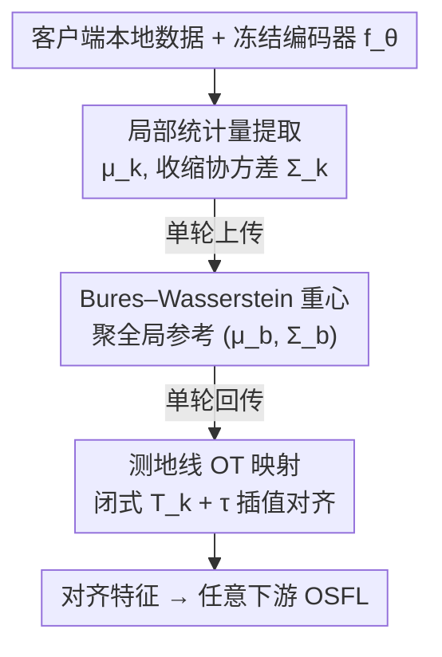

# Distribution Alignment for One-Shot Federated Learning via Optimal Transport

**会议**: ICML2026  
**arXiv**: [2606.16655](https://arxiv.org/abs/2606.16655)  
**代码**: https://github.com/daniebera/SLOT-Align  
**领域**: 联邦学习 / 最优传输 / 分布对齐  
**关键词**: 单轮联邦学习, 分布对齐, 域偏移, 标签偏移, 最优传输

## 一句话总结
本文提出 SLOT-Align，一个免训练、单轮的联邦特征对齐框架：各客户端用共享冻结编码器算出特征的一二阶统计量，服务器用 Bures–Wasserstein 重心聚成全局参考，客户端再用高斯间的闭式最优传输映射把本地特征对齐到该参考，在域偏移叠加标签偏移的极端 one-shot 联邦场景下稳定提升精度。

## 研究背景与动机

**领域现状**：联邦学习（FL）让多客户端在不共享原始数据的前提下协同训练。当通信预算极紧时演化出 One-Shot 联邦学习（OSFL）——每个客户端只和服务器通信一次。近期 OSFL 主流是用共享的冻结预训练编码器，客户端只传轻量的特征统计量或参数化摘要（如 FedCGS、FedPFT），通信极省。

**现有痛点**：现实里异质性沿多个轴出现——客户端 $k$ 的输入边缘分布 $\mathbb{P}_k(x)$ 不同（域偏移），标签边缘 $\mathbb{P}_k(y)$ 也不同（标签偏移）。两者共同诱导出客户端特异的后验 $\mathbb{P}_k(y\mid x)$，使各客户端学到的特征表示彼此错位。多轮 FL 能靠反复迭代逐步纠正，但 OSFL 只有一次交互，**这种错位无法在学习中被纠正**。

**核心矛盾**：现有 OSFL 方法（蒸馏 / 服务器端生成 / 集成聚合 / 统计量聚合）要么假设客户端特征表示**已经对齐**，要么把域偏移和标签偏移**分开**处理。而真正难的恰恰是两者交互：标签偏移会让类别比例失衡，从而以非均匀的方式扭曲每个客户端贡献的经验特征矩（均值、协方差），统计量聚合类方法默认"客户端特征摘要可直接比较"在此直接失效。

**本文目标**：把 OSFL 形式化为异质客户端分布 $\mathbb{P}_k(x,y)$ 下的**分布对齐问题**，设计一个能在单轮、免训练的约束下显式纠正一二阶特征结构错位的预处理步骤，且不改下游 OSFL 的优化流程。

**切入角度**：既然所有客户端共享同一冻结编码器，本地输入都被映到 $\mathbb{R}^m$ 同一个潜在度量空间，那么客户端间的差异就可以看成这个空间里的"质量位移"，对齐 = 把各客户端特征分布往一个公共参考搬运。最优传输（OT）正是带几何感知的分布对齐工具，且高斯测度下 $W_2$ 几何有闭式传输映射和测地线。

**核心 idea**：用高斯代理 + Bures–Wasserstein 重心 + 闭式 OT 映射，把"对齐异质特征分布"变成只靠一二阶统计量、单轮可解的闭式计算。

## 方法详解

### 整体框架

SLOT-Align 是一个插在下游 OSFL 之前的**免训练预处理层**，整条管线是三步加一次单轮通信：① 每个客户端用共享冻结编码器 $f_\theta$ 抽特征，估计本地特征分布的均值 $\mu_k$ 和（收缩正则后的）协方差 $\Sigma_k$，得到一个高斯代理 $\mathcal{N}(\mu_k,\Sigma_k)$；② 客户端把这对紧凑统计量传给服务器，服务器用加权平均聚均值、用 **Bures–Wasserstein 重心**聚协方差，得到全局参考 $\mathcal{N}(\mu_b,\Sigma_b)$，再传回客户端（这一来一回就是 OSFL 允许的唯一一次交互）；③ 每个客户端构造从自己高斯到参考高斯的**闭式仿射 OT 映射** $T_k$，再用插值参数 $\tau$ 沿 $W_2$ 测地线控制对齐强度，把本地所有特征搬到对齐位置，最后把对齐后的特征喂给任意依赖冻结编码器的下游 OSFL 算法。整个过程无学习、无数据合成、不改下游优化目标。

### 关键设计

**1. 高斯代理 + 收缩协方差：把"对齐分布"压成只靠一二阶矩可算**

直接对齐一般的（非高斯）深度特征分布在单轮、免训练约束下不可行。SLOT-Align 的关键简化是：在 2-Wasserstein 空间 $(\mathcal{P}_2(\mathbb{R}^m),W_2)$ 里，**高斯测度构成一个全测地子流形**，且高斯间的 $W_2$ 有闭式 OT 映射和测地线。于是每个客户端只估计均值 $\mu_k=\mathbb{E}[f_\theta(x)]$ 和样本协方差 $\widehat\Sigma_k$，把 $\mathcal{N}(\mu_k,\Sigma_k)$ 当作真实特征分布 $Q_k=(f_\theta)_\#P_k$ 的可处理代理——不要求 $Q_k$ 真是高斯，只要保留其一二阶结构（位置和铺展）即可，而域偏移（变 $\mathbb{P}_k(x)$）和标签偏移（重加权类条件特征分布）恰恰主要扭曲这两阶矩。高维或本地样本少时样本协方差会病态，故用 Ledoit–Wolf 收缩：

$$\Sigma_k=\lambda_k\widehat\Sigma_k+(1-\lambda_k)\sigma_k^2\,\mathrm{Id},\qquad \sigma_k^2=\tfrac1m\mathrm{tr}(\widehat\Sigma_k)$$

这保证 $\Sigma_k$ 落在对称正定锥 $\mathcal{S}_{++}^m$ 里——后续 Bures–Wasserstein 几何要求协方差正定，这一步是必需的数值前提。

**2. Bures–Wasserstein 重心：单轮聚成几何感知的全局参考**

把各客户端高斯聚成全局参考时，简单平均协方差不尊重协方差流形的几何。SLOT-Align 用 Bures–Wasserstein 重心：均值取加权平均 $\mu_b=\sum_k w_k\mu_k$（权重 $w_k=n_k/N$ 按样本数），协方差取

$$\Sigma_b=\arg\min_{\Sigma\in\mathcal{S}_{++}^m}\sum_{k=1}^K w_k\,B^2(\Sigma,\Sigma_k)$$

其中 Bures 距离 $B^2(\Sigma_1,\Sigma_2)=\mathrm{tr}\!\big(\Sigma_1+\Sigma_2-2(\Sigma_1^{1/2}\Sigma_2\Sigma_1^{1/2})^{1/2}\big)$ 正是高斯间二次 OT 代价、在 $\mathcal{S}_{++}^m$ 上诱导黎曼几何。$\Sigma_b$ 由不动点迭代 $\Sigma^{(t+1)}=\sum_k w_k\big((\Sigma^{(t)})^{1/2}\Sigma_k(\Sigma^{(t)})^{1/2}\big)^{1/2}$ 求解，对收缩正则后的协方差实践中可靠收敛。这个重心在平衡客户端各自变异性与全局一致性之间给出一个"几何中心"，作为所有客户端对齐的公共锚点；服务器把 $(\mu_b,\Sigma_b)$ 传回，单轮通信至此结束。

**3. 闭式测地线 OT 映射 + $\tau$ 插值：可控强度地把本地特征搬到参考**

收到全局参考后，每个客户端构造从 $\mathcal{N}(\mu_k,\Sigma_k)$ 到 $\mathcal{N}(\mu_b,\Sigma_b)$ 的最优传输映射。二次代价下高斯间 OT 是仿射的、有闭式解：

$$A_k=\Sigma_b^{1/2}\big(\Sigma_b^{1/2}\Sigma_k\Sigma_b^{1/2}\big)^{-1/2}\Sigma_b^{1/2},\quad b_k=\mu_b-A_k\mu_k,\quad T_k(z)=A_kz+b_k$$

它精确把源高斯搬到目标高斯，同时纠正均值和协方差的错位。但因为 $(\mu_k,\Sigma_k)$ 只是有限样本估的、对真实非高斯 $Q_k$ 是近似，完整传输可能**过度纠正**。SLOT-Align 因此引入插值参数 $\tau\in[0,1]$，取恒等映射与 $T_k$ 的位移插值 $T_k^{(\tau)}=(1-\tau)\,\mathrm{Id}+\tau\,T_k$。它对应 $W_2$ 空间里从源到重心的**常速测地线**（高斯子流形是全测地的，中间分布仍是高斯），并满足显式收缩性质：

$$W_2(G_k^{(\tau)},G_b)=(1-\tau)\,W_2(G_k,G_b)$$

即 $\tau$ 直接控制"移除多少代理层面的差异"——$\tau=0$ 不对齐、$\tau=1$ 完整传输。全程对所有客户端和数据集用**单一** $\tau$，不依赖任何异质性估计或问题特定先验，保住了非迭代、免训练的本性，又给了一个简单可控的对齐强度旋钮。

### 损失函数 / 训练策略

SLOT-Align 本身没有任何可训练参数和损失——它是纯几何的免学习变换，只在本地特征空间操作，不改下游 OSFL 的结构、目标和优化流程。对齐后的特征 $z'=T_k^{(\tau)}(z)$ 直接喂给任意依赖冻结编码器的下游 OSFL 算法（如 O-FedAvg、FedCGS、FedPFT），计算开销可忽略。

## 实验关键数据

### 主实验

在 Office-Home、Digits、DomainNet 三个 benchmark、多种预训练 backbone、多种 SOTA OSFL 方法上，评估域偏移叠加标签偏移（Dirichlet $\alpha$ 控制标签偏移强度）下的 Top-1 精度（按域报告 + 跨域宏平均）。把 SLOT-Align 作为预处理插到各 OSFL 方法前。

| 设置 ($\alpha=0.1$) | Office-Home mean | Digits mean | DomainNet mean |
|------|------|------|------|
| O-FedAvg | 64.19 | 64.70 | 37.69 |
| O-FedAvg + SLOT | **72.05 (+7.86)** | **72.61 (+7.91)** | **40.26 (+2.57)** |
| FedCGS | 84.37 | 67.12 | 51.40 |
| FedCGS + SLOT | **85.05 (+0.68)** | **70.11 (+2.99)** | **56.63 (+5.23)** |
| FedPFT | 74.19 | 73.36 | 48.04 |
| FedPFT + SLOT | **80.74 (+6.55)** | **75.50 (+2.14)** | **51.57 (+3.53)** |

SLOT-Align 在所有 backbone × 下游方法组合上一致提升宏平均精度，对最简单的 O-FedAvg 增益最大（Office-Home/Digits 都接近 +8），对已较强的统计量方法 FedCGS/FedPFT 也能在 DomainNet 等难 benchmark 上加 +3~+5。

### 消融与鲁棒性

| 配置 | 关键发现 | 说明 |
|------|---------|------|
| 不同标签偏移强度（$\alpha=0.1$ → $0.05$） | 偏移越强 SLOT 越有用 | $\alpha=0.05$ 是更严苛的联合偏移，对齐价值更突出 |
| 跨多种冻结 backbone | 一致提升 | 验证对编码器架构的鲁棒性 |
| 跨多种下游 OSFL 方法 | 即插即用 | 不改各方法优化流程即可叠加 |
| 插值强度 $\tau$ | 单一全局值即可 | 不需按客户端调，保住非迭代本性 |

### 关键发现
- **对齐价值随偏移加剧上升**：从 $\alpha=0.1$ 到更严苛的 $\alpha=0.05$，联合域+标签偏移更强，SLOT-Align 的增益更明显——印证了"标签偏移会非均匀扭曲特征矩、必须显式纠正"这一动机。
- **越弱的下游方法受益越大**：O-FedAvg 这类假设特征已对齐的简单聚合，加上 SLOT 后提升最大（接近 +8）；说明很多 OSFL 方法的性能瓶颈正是被忽视的特征错位。
- **几何感知是关键**：用 Bures–Wasserstein 重心（尊重协方差流形几何）而非简单矩平均，才能在单轮内正确聚出可对齐的全局参考。

## 亮点与洞察
- 把"OSFL 在异质分布下的失效"重新框成一个**分布对齐**问题，且精准点出现有统计量类方法的隐藏假设（"客户端特征摘要可直接比较"）在域+标签联合偏移下不成立——这个问题定位本身就很有价值。
- 全程闭式、免训练、单轮：高斯代理把对齐压成一二阶矩，Bures–Wasserstein 重心闭式聚参考，高斯间 OT 闭式给仿射映射，$\tau$ 沿测地线线性控制强度（$W_2(G_k^{(\tau)},G_b)=(1-\tau)W_2(G_k,G_b)$）。每一步都有解析解、几乎零计算开销，完美契合 one-shot 约束。
- 即插即用：作为预处理层不碰下游优化，能和任何依赖冻结编码器的 OSFL 方法叠加。这个"在特征空间做几何对齐、与下游正交"的思路可迁移到其他需要跨源特征对齐的免训练场景（多源域适应、特征级集成）。

## 局限与展望
- 高斯代理只保留一二阶矩，深度特征分布一般非高斯——当客户端间的差异主要体现在高阶结构（多模态、重尾）时，只对齐均值协方差可能不够，作者也用 $\tau$ 插值来缓解"过度纠正"，但这是个全局超参、未必对所有客户端最优。
- 依赖一个**共享冻结预训练编码器**把所有客户端映到公共潜在空间——若客户端域与预训练分布差异过大、编码器本身表达不充分，对齐的前提（差异只来自统计偏移而非架构发散）就会松动。
- 实验集中在视觉 benchmark 和分类任务；对其他模态、检测/分割等任务，以及 $\tau$ 与隐私（传协方差是否泄露信息）的权衡，文中讨论较少。

## 相关工作与启发
- **vs FedCGS / FedPFT（统计量类 OSFL）**：它们聚合全局特征统计量或参数化建模客户端分布，但默认客户端特征摘要可直接比较、不显式纠正错位；SLOT-Align 正是补上这一步显式 OT 对齐，且能作为预处理叠加在它们之上。
- **vs 蒸馏 / 生成类 OSFL（FedKT、FedDEO、FEDCVAE 等）**：这些方法靠服务器端蒸馏或生成代理数据，需额外服务器端优化、计算内存开销大、生成数据还可能引入隐私顾虑；SLOT-Align 直接在紧凑特征统计量上操作，无学习、无数据合成。
- **vs FedOT / FedDaDiL（联邦中的 OT）**：现有把 OT 用进联邦的工作本质都是**多轮迭代**的（反复学传输映射或算 Wasserstein 重心）；SLOT-Align 是据作者所知把 OT 原理用进**非迭代 one-shot** 设置的尝试，单轮交换紧凑统计量即完成对齐。

## 评分
- 新颖性: ⭐⭐⭐⭐ 把多轮 OT 对齐压成单轮闭式、并精准定位 OSFL 统计量方法的隐藏对齐假设
- 实验充分度: ⭐⭐⭐⭐ 三 benchmark × 多 backbone × 多下游方法 + 两档偏移强度，一致正增益
- 写作质量: ⭐⭐⭐⭐ 几何推导清晰、动机扣得紧，每步都给闭式解和性质
- 价值: ⭐⭐⭐⭐ 免训练、即插即用、零额外通信，对极端通信受限的联邦部署很实用

<!-- RELATED:START -->

## 相关论文

- [\[CVPR 2026\] HFedATM: Hierarchical Federated Domain Generalization via Optimal Transport and Regularized Mean Aggregation](../../CVPR2026/optimization/hfedatm_hierarchical_federated_domain_generalization_via_optimal_transport_and_r.md)
- [\[ICML 2026\] Rethinking the Flow-Based Gradual Domain Adaptation: A Semi-Dual Optimal Transport Perspective](rethinking_the_flow-based_gradual_domain_adaptation_a_semi-dual_optimal_transpor.md)
- [\[ICLR 2026\] A Scalable Constant-Factor Approximation Algorithm for $W_p$ Optimal Transport](../../ICLR2026/optimization/a_scalable_constant-factor_approximation_algorithm_for_w_p_optimal_transport.md)
- [\[AAAI 2026\] PEOAT: Personalization-Guided Evolutionary Question Assembly for One-Shot Adaptive Testing](../../AAAI2026/optimization/peoat_personalization-guided_evolutionary_question_assembly_for_one-shot_adaptiv.md)
- [\[CVPR 2026\] Fed-ADE: Adaptive Learning Rate for Federated Post-adaptation under Distribution Shift](../../CVPR2026/optimization/fed-ade_adaptive_learning_rate_for_federated_post-adaptation_under_distribution_.md)

<!-- RELATED:END -->
