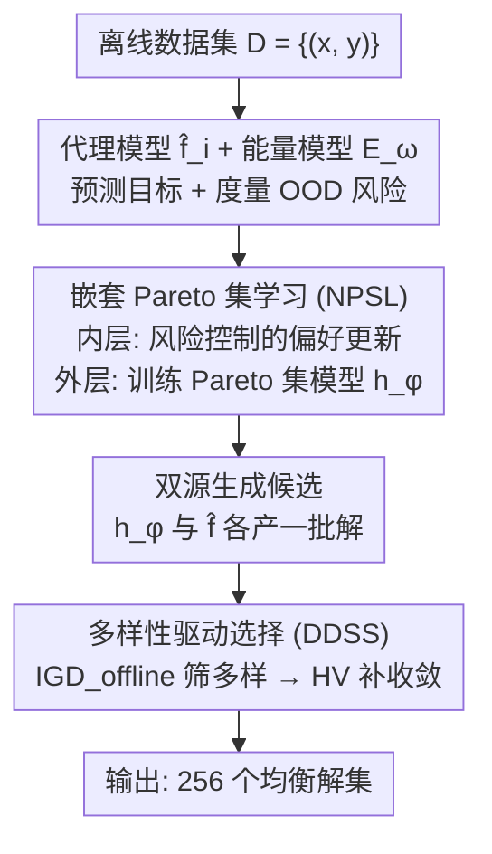

# Diversity-Driven Offline Multi-Objective Optimization via Nested Pareto Set Learning

**会议**: ICML 2026  
**arXiv**: [2606.15115](https://arxiv.org/abs/2606.15115)  
**代码**: https://github.com/YaolinWen/DOMOO  
**领域**: 优化 / 黑盒优化  
**关键词**: 离线优化, 多目标优化, Pareto集学习, 分布外风险, 多样性  

## 一句话总结
针对"只能用固定离线数据集、不能再查询真目标函数"的离线多目标优化（offline MOO），本文提出 DOMOO：用嵌套 Pareto 集学习联合更新偏好与模型、并把分布外（OOD）风险抑制因子塞进偏好梯度，再配一个专为离线设计的 $\text{IGD}_{\text{offline}}$ 指标做多样性筛选，从而同时拿到收敛性和多样性都更好的解集。

## 研究背景与动机
**领域现状**：多目标优化（MOO）要在多个冲突目标间找一整组 Pareto 最优解（如药效高且毒性低）。很多方法靠代理模型（surrogate）逼近真目标，但为保代理精度，通常需要训练时**主动查询真目标函数**。

**现有痛点**：在蛋白质工程、分子设计等场景，评估真目标函数极其昂贵甚至危险，根本没法在线查询——只能用历史数据（离线数据集）。这就催生了 **offline MOO**：仅凭一份固定的 $\{(\bm{x}_i,\bm{y}_i)\}$ 数据，推荐一组代表最佳权衡的解，全程不再评估真函数。

**核心矛盾**：离线代理模型逃不开**分布外（OOD）问题**——对远离训练分布的设计预测不可靠。在单目标里这表现为高估某个远点；到了多目标更糟：代理一旦**低估了少数几个解**，这几个解就会在 Pareto 支配关系下错误地"支配"掉大量其他解，导致 Pareto 前沿严重失衡——解全挤在高密度区，多样性和收敛性双双崩塌。单目标的保守化方法（如对 OOD 解压低预测）因为 Pareto 支配结构复杂，无法直接搬到多目标；在线 MOO 方法（贝叶斯优化、进化算法）一旦没了主动查询也会被 OOD 误差拖垮。

**本文目标**：在纯离线、不能再评估的约束下，找到一组**既多样又高质量**的解，专门治 OOD 引起的前沿失衡。

**切入角度**：作者观察到，OOD 风险不是均匀作用在解空间的——它随目标而异、还会和偏好梯度耦合。所以与其简单地给标量化误差加界，不如把风险直接耦合进"偏好怎么更新"这件事里，再换一个不被 OOD"虚假宽前沿"忽悠的评价指标。

**核心 idea**：用"嵌套 Pareto 集学习 + 累积风险控制"把风险抑制嵌入偏好更新，再用一个离线专属的 $\text{IGD}_{\text{offline}}$ 指标做多样性优先的解筛选。

## 方法详解

### 整体框架
DOMOO 的输入是一份离线数据集 $\mathcal{D}=\{(\bm{x}_i,\bm{y}_i)\}_{i=1}^N$（解及其真目标值），输出是 256 个兼顾收敛与多样的最终解。它分三步走：先为每个目标各训一个代理模型 $\hat{f}_i$、再训一个能量模型 $E_{\bm{\omega}}$ 做风险度量；然后在代理引导下做**嵌套 Pareto 集学习（NPSL）**——内层带风险控制地更新偏好向量、外层用更新后的偏好训练 Pareto 集模型 $h_{\bm{\phi}}$；最后用 Pareto 集模型和代理模型各生成一批候选解，经**多样性驱动选择策略**（先 $\text{IGD}_{\text{offline}}$ 保多样、再 HV 补收敛）输出最终解集。

### 关键设计

**1. 累积风险控制（ARC）：把 OOD 风险因子塞进偏好梯度**

这一步治"代理低估 → 假支配 → 前沿坍塌"的病根。作者沿用 ARCOO 的能量模型 $E_{\bm{\omega}}$：用对比散度 + Langevin 动力学负采样训练，给每个解 $\bm{x}$ 打一个能量分，再算出风险抑制因子

$$R(\bm{x})=\frac{c\,(E_{\tilde{Q}}-E_{\bm{\omega}}(\bm{x}))}{E_{\tilde{Q}}-E_{\tilde{P}}}$$

其中 $\tilde{P}$ 是离线数据里高质量解的经验分布、$\tilde{Q}$ 是从 $\tilde{P}$ 出发用 Langevin 采到的高风险分布，$c$ 是初始动量。关键创新在于：单目标的 ARCOO 只管压低 OOD 解的预测，作者把 $R(\bm{x})$ 直接乘进**偏好梯度更新**里（见下式 Eq.2），这样朝着不可靠 OOD 区域的优化步会被自动衰减、而朝着有数据支撑的可靠权衡区的梯度流被保留——解决了"风险在多目标里随目标而异、还和偏好梯度耦合"的难题。

**2. 嵌套 Pareto 集学习（NPSL）：内层更新偏好、外层训模型，联合保多样与质量**

针对"OOD 会误导 Pareto 集模型去追虚假高分解、造成假多样性"的问题，作者把 PSL 改成内外双层嵌套。Pareto 集学习本身是学一个从偏好 $\bm{\lambda}$ 到 Pareto 解的映射 $h_{\bm{\phi}}(\bm{\lambda})$，用增广 Tchebycheff 标量化把多目标转成单目标。NPSL 分三阶段：**预训练**用离线 Pareto 前沿初始化（按 $\bm{\lambda}_{\text{off}}^{(i)} \propto (1/(y^{(i)}_{\text{off},1}-z^*_1),\dots)$ 采偏好，让模型一开始就靠近最优解分布）；**探索**从 $\text{Dirichlet}(\bm{1}_M)$ 在单纯形上均匀采偏好，覆盖整个偏好空间防过拟合；**偏好梯度更新**带风险控制地调偏好：

$$\bm{\lambda}_{t}^{(b)}=\bm{\lambda}_{t-1}^{(b)}-\eta_{\text{pref}}\,R\!\left(h_{\bm{\phi}}(\bm{\lambda}_{t-1}^{(b)})\right)\cdot\nabla_{\bm{\lambda}}\hat{g}_{\text{tch\_aug}}(h_{\bm{\phi}}(\bm{\lambda})\mid\bm{\lambda})\Big|_{\bm{\lambda}_{t-1}^{(b)}}$$

它的巧妙之处：梯度是在当前模型生成的解 $\bm{x}=h_{\bm{\phi}}(\bm{\lambda})$ 上算的，于是**导致差解的偏好会产生更大梯度、被更新得更多**，从而隐式地把探索推向前沿里"代表性不足"的区域。外层再用更新后的偏好训练 $h_{\bm{\phi}}$ 提升解质量：$\bm{\phi}=\bm{\phi}-\frac{\eta_{\text{psl}}}{B}\sum_b\nabla_{\bm{\phi}}\hat{g}_{\text{tch\_aug}}(\cdot)$。内外交替，多样性与收敛性一起兼顾。

**3. $\text{IGD}_{\text{offline}}$ 指标 + 多样性驱动选择（DDSS）：先保多样再补收敛**

传统 IGD 需要真 Pareto 前沿，离线场景拿不到；而 HV 指标在离线下有个致命缺陷——代理常在 OOD 区外推出一个比真前沿更宽的"虚假前沿"，HV 的边际体积机制就会沿这条假前沿均匀挑解，结果挑出一堆扎堆、低质量的解。作者因此设计离线专属指标：

$$\text{IGD}_{\text{offline}}=\frac{1}{n}\sum_{i=1}^{n}\min_{j}\left\|\bm{y}_{\text{off}}^{(i)}-\beta y'\bm{1}_M-\hat{\bm{y}}_{\text{cand}}^{(j)}\right\|_2$$

它用"离线前沿 + 一个朝理想点的平移量 $y'$"替代真前沿构造更严格的参考（$y'=\max_i\min_m y^{(i)}_{\text{off},m}$，并做 min-max 归一化保证尺度无关）；这个平移让参考前沿偏向理想点，反而鼓励探索和广覆盖、不奖励保守贴着离线数据的解。最终的 DDSS 是两段式：先用 $\text{IGD}_{\text{offline}}$ 贪心选出最多 128 个解（保多样、覆盖前沿不同区域），再用 HV 把剩下的位置填满（保收敛、最大化目标空间体积），凑齐 256 个解。128 这个预算是超参分析里 0→256 扫出来的稳定峰值，不是拍脑袋定的。

### 损失函数 / 训练策略
代理模型在离线数据上对每个目标各自回归拟合；能量模型按 ARCOO 用对比散度训练。标量化用增广 Tchebycheff $\hat{g}_{\text{tch\_aug}}(\bm{x}\mid\bm{\lambda})=\max_i\{\lambda_i(\hat{f}_i(\bm{x})-(z^*_i-\varepsilon))\}+\rho\sum_i\lambda_i\hat{f}_i(\bm{x})$，其中 $z^*_i=\min_{\bm{x}\in\mathcal{D}}f_i(\bm{x})$ 为理想向量、$\varepsilon,\rho$ 为小正标量。偏好/模型分别用学习率 $\eta_{\text{pref}},\eta_{\text{psl}}$ 交替优化。

## 实验关键数据

### 主实验（Off-MOO-Bench，5 类任务的平均排名，越低越好）
DOMOO 在 HV 和 $\text{IGD}_{\text{offline}}$ 两个指标的总平均排名上都拿到第一。

| 指标 | DOMOO | 次优代表 | 说明 |
|------|-------|----------|------|
| HV 平均排名 | **4.63 ± 0.38** | Multiple Models 6.67 / End-to-End 6.81 | 收敛性总排名第一 |
| $\text{IGD}_{\text{offline}}$ 平均排名 | **6.27 ± 0.23** | Multiple Models+IOM 6.63 / End-to-End 7.12 | 多样性总排名第一 |
| HV·Synthetic | **3.89 ± 0.56** | Multiple Models 6.24 | 合成函数子集领先明显 |
| HV·RE | **3.26 ± 0.53** | Multiple Models 6.37 | 真实工程任务也最好 |

### 消融实验（Table 3，去掉各模块后的指标）

| 配置 | HV·Regex | $\text{IGD}_{\text{offline}}$·MO-Hopper | 说明 |
|------|----------|------------------|------|
| Full（DOMOO） | **6.52 ± 0.11** | 最优 | 完整模型 |
| w/o ARC | 5.72 ± 0.27 | 变差 | 去累积风险控制 |
| w/o NPSL | 4.98 ± 0.33 | 变差 | 去嵌套 Pareto 集学习 |
| w/o DDSS | 5.25 ± 0.35 | 变差 | 去多样性驱动选择 |
| w/o SMG | 6.11 ± 0.33 | — | 去解模型梯度项 |

### 关键发现
- **三大模块都有贡献**：去掉 ARC、NPSL、DDSS 中任意一个，HV 或 $\text{IGD}_{\text{offline}}$ 都会下滑——风险控制管"别追 OOD 假解"、嵌套学习管"覆盖代表性不足区域"、多样性选择管"别被虚假宽前沿骗"。
- **HV 在离线下会自欺**：作者明确指出 HV 沿代理外推的虚假前沿均匀挑解、选出扎堆低质量解，这是引入 $\text{IGD}_{\text{offline}}$ 的直接动机。
- **嵌套更新隐式探索**：差解偏好产生更大梯度被更新得更多，自动把采样推向前沿稀疏区，可视化显示偏好更新后解分布明显更均匀。

## 亮点与洞察
- **把 OOD 风险耦合进偏好动力学**，而非简单给标量化误差加界——这是从单目标 ARCOO 迁移到多目标的关键非平凡步骤，抓住了"风险随目标而异、与偏好梯度耦合"的本质。
- **$\text{IGD}_{\text{offline}}$ 的"平移参考前沿"很巧**：用一个朝理想点的 shift 把离线前沿改造成更严格的参考，既不需要真前沿、又避免奖励保守贴数据的解，可迁移到任何缺真前沿的离线评估场景。
- **"先多样后收敛"的两段式筛选**：用互补的两个指标分工（$\text{IGD}_{\text{offline}}$ 保覆盖、HV 保质量），并通过超参扫描把分割点定在 128，工程上干净可复现。

## 局限与展望
- **依赖能量模型估风险**：$R(\bm{x})$ 的可靠性取决于能量模型训得好不好，能量模型本身也可能在极端 OOD 区失准，论文未深究其失败模式。
- **目标维度 $M$ 的可扩展性**：实验集中在 Off-MOO-Bench 常见的 2–3 目标，高维多目标（$M$ 较大）下 Pareto 支配稀疏、偏好单纯形采样和 $\text{IGD}_{\text{offline}}$ 计算开销是否仍可控，未充分验证。
- **嵌套双层带来训练成本**：内外层交替 + 能量模型 Langevin 采样比单层 PSL 更重，论文未给出与基线的运行时/资源对比（有些基线还因 runtime/显存超限标 N/A）。
- **改进方向**：自适应调节 ARC 的风险动量 $c$ 与平移量 $\beta$；把方法推广到混合/离散设计空间；探索更轻量的风险估计替代能量模型。

## 相关工作与启发
- **vs 单目标离线优化（COMs / IOMs / Tri-Mentoring）**：它们靠保守化代理压低 OOD 高估，但 naively 扩到多目标时多样性差；DOMOO 把风险控制嵌入偏好更新并显式优化多样性，专治多目标前沿失衡。
- **vs 在线 MOO（MOBO / 进化算法）**：在线方法靠主动查询免疫 OOD，搬到离线就被 OOD 误差拖垮（表中多处 N/A）；DOMOO 全程不查询、用代理+风险控制顶住。
- **vs PSL 类方法（PSL-MOBO / EPS / CDM-PSL）**：它们多依赖为在线设计的高斯过程代理，离线下严重 OOD；DOMOO 的嵌套 PSL + 风险控制专为离线场景重构，并补上离线专属的多样性指标。

## 评分
- 新颖性: ⭐⭐⭐⭐⭐ "风险耦合进偏好梯度 + 离线专属 IGD"是对离线 MOO 的实质性新解法
- 实验充分度: ⭐⭐⭐⭐ Off-MOO-Bench 5 类任务双指标 + 模块消融较全；缺运行时/高维对比
- 写作质量: ⭐⭐⭐⭐ 动机—机理—方法逻辑清晰，公式完整；部分符号偏密集
- 价值: ⭐⭐⭐⭐⭐ 离线多目标优化（蛋白/分子设计）有现实意义，方法可复用

<!-- RELATED:START -->

## 相关论文

- [\[ICLR 2026\] Gradient-Based Diversity Optimization with Differentiable Top-$k$ Objective](../../ICLR2026/optimization/gradient-based_diversity_optimization_with_differentiable_top-k_objective.md)
- [\[ICML 2026\] Multi-Objective Bayesian Optimization via Adaptive ε-Constraints Decomposition](multi-objective_bayesian_optimization_via_adaptive_varepsilon-constraints_decomp.md)
- [\[ICML 2026\] Accelerated Multiple Wasserstein Gradient Flows for Multi-objective Distributional Optimization](accelerated_multiple_wasserstein_gradient_flows_for_multi-objective_distribution.md)
- [\[AAAI 2026\] Pareto-Grid-Guided Large Language Models for Fast and High-Quality Heuristics Design in Multi-Objective Combinatorial Optimization](../../AAAI2026/optimization/pareto-grid-guided_large_language_models_for_fast_and_high-quality_heuristics_de.md)
- [\[AAAI 2026\] Efficient and Reliable Hitting-Set Computations for the Implicit Hitting Set Approach](../../AAAI2026/optimization/efficient_and_reliable_hitting-set_computations_for_the_implicit_hitting_set_app.md)

<!-- RELATED:END -->
