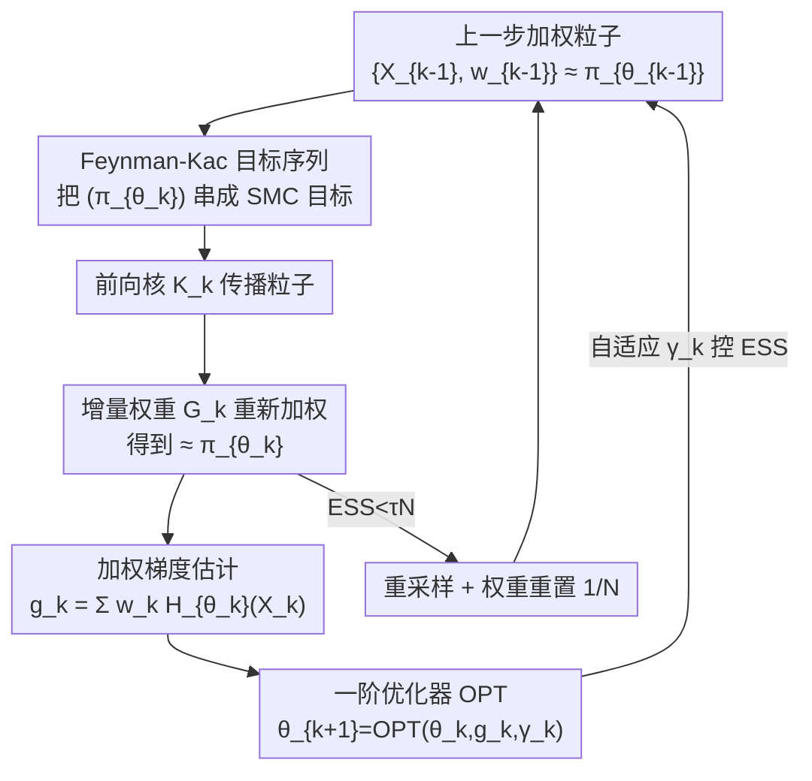

# Efficient Stochastic Optimisation via Sequential Monte Carlo

**会议**: ICML2026  
**arXiv**: [2601.22003](https://arxiv.org/abs/2601.22003)  
**代码**: https://github.com/akyildiz-group/SOSMC  
**领域**: 优化 / 蒙特卡洛采样  
**关键词**: 序列蒙特卡洛, 难解梯度, 随机优化, 能量模型, reward tuning

## 一句话总结
当损失的梯度写成"对一个依赖参数的难解分布 $\pi_\theta$ 求期望"时，传统做法要在每步优化里跑一遍昂贵的 MCMC 内循环采样；本文提出 SOSMC，用序列蒙特卡洛(SMC)采样器把"随参数缓慢演化的一串分布 $(\pi_{\theta_k})_k$"串起来采，**复用上一步的粒子**得到加权梯度估计，从而砍掉内循环，既省算力又有收敛理论保证，并在能量模型 reward tuning、图像去模糊等任务上优于单/双循环基线。

## 研究背景与动机

**领域现状**：机器学习里大量问题的梯度长这样：$\nabla_\theta\ell(\theta)=\mathbb{E}_{X\sim\pi_\theta}[H_\theta(X)]$，即梯度是对一个参数依赖分布 $\pi_\theta(x)=e^{-U_\theta(x)}/Z_\theta$ 的期望，而归一化常数 $Z_\theta$ 难解。这个形式涵盖极大边际似然估计(MMLE)、能量模型(EBM)训练、生成模型的 reward tuning / 对齐等一大类任务。

**现有痛点**：因为 $\pi_\theta$ 依赖当前参数 $\theta$ 且不可直接采样，每次想估这个梯度都得跑 MCMC 内循环（如 Langevin / contrastive divergence）。每走一步外层优化就要重启一轮内层采样，**计算极其昂贵且收敛慢**；持久化对比散度(PCD)等虽用持久粒子省了重启，但维护的是**无权粒子**，当粒子分布滞后于快速变化的 $\pi_{\theta_k}$ 时，梯度估计会有偏。

**核心矛盾**：内循环采样成本与梯度估计质量之间的死结——想省钱就复用旧粒子(滞后→有偏)，想准就每步重采(昂贵)。根因是大家把每个 $\pi_{\theta_k}$ 当成**独立**的采样目标分别去打，没有利用"$\theta$ 是缓慢连续演化的、相邻分布 $\pi_{\theta_{k-1}}$ 和 $\pi_{\theta_k}$ 几乎一样"这个结构。

**本文目标**：把"一串缓慢演化的目标分布序列"整体当成 SMC 采样器的目标序列，让粒子从上一步**带权重地搬运并重新加权**到这一步，而不是每步从头采。

**核心 idea**：用 SMC 采样器(Del Moral et al. 2006)的 Feynman-Kac 框架，把优化迭代 $(\theta_k)$ 诱导的分布序列 $(\pi_{\theta_k})$ 作为 SMC 要顺序逼近的目标；每步只跑**一次** SMC 更新（传播+重新加权+按需重采样）就拿到加权粒子，用它构造梯度估计 $g_k$ 喂给任意一阶优化器。已有的 JALA-EM、Carbone 等方法都成为它的特例。

## 方法详解

### 整体框架
SOSMC（Stochastic Optimisation via SMC）把"优化"和"采样"拧成一条单循环：外层是任意一阶优化器 $\theta_{k+1}=\textsf{OPT}(\theta_k,g_k,\gamma_k)$，内层不再是独立的 MCMC 多步采样，而是**一步 SMC 更新**。其核心观察是——优化轨迹 $(\theta_k)$ 自动定义了一串目标分布 $(\pi_{\theta_k})$，相邻两个因 $\theta$ 只挪了一小步而高度相似，所以可以像标准 SMC 沿"退火路径"采样那样，把粒子从 $\pi_{\theta_{k-1}}$ 顺序搬运到 $\pi_{\theta_k}$：用前向核 $\mathsf{K}_k$ 传播粒子、用 Feynman-Kac 增量权重 $G_k$ 重新加权、ESS 太低时才重采样。重新加权后的加权粒子直接给出难解梯度的估计 $g_k=\sum_i w_k^{(i)}H_{\theta_k}(X_k^{(i)})$，回灌优化器闭环。整个过程每个外层迭代只采样一轮，这正是它比双循环方法省钱的来源。

### 关键设计

**1. Feynman-Kac 流把分布序列串成可顺序采样的目标**

这是把"优化"翻译成"SMC"的桥。作者在乘积空间 $E^{k+1}$ 上定义一串非归一化分布 $\Pi_{\theta_{0:k}}(x_{0:k})=\Pi_{\theta_k}(x_k)\prod_{n=1}^k\mathsf{L}_{n-1}(x_n,x_{n-1})$，其中 $\mathsf{L}$ 是后向核、$\Pi_\theta=e^{-U_\theta}$ 是非归一化密度，可证其 $x_k$-边缘恰好是 $\pi_{\theta_k}$。配上前向核 $\mathsf{K}_n$ 构成的提议分布，重要性权重满足递推 $W_k=W_{k-1}\,G_k(x_{k-1},x_k)$，增量权重

$$G_k(x_{k-1},x_k)=\frac{\Pi_{\theta_k}(x_k)\mathsf{L}_{k-1}(x_k,x_{k-1})}{\Pi_{\theta_{k-1}}(x_{k-1})\mathsf{K}_k(x_{k-1},x_k)}.$$

由 Feynman-Kac 公式（定理 1），令测试函数 $\varphi=H_{\theta_k}$ 就把难解梯度 $\nabla_\theta\ell(\theta_k)=\pi_{\theta_k}(H_{\theta_k})$ 表达成可由加权粒子估计的量。关键在于 $G_k$ 里只出现相邻两步的 $\Pi_{\theta_{k-1}},\Pi_{\theta_k}$，归一化常数 $Z_\theta$ 在比值里相消——这正是能绕过难解 $Z_\theta$ 的原因，也是"复用旧粒子"在数学上合法的依据。

**2. SOSMC 单循环算法：每步一次 SMC 更新即得梯度**

落到算法上(Algorithm 1)：维护 $N$ 个加权粒子 $\{(X_k^{(i)},w_k^{(i)})\}$。每个外层迭代 $k$ 只做一轮——用前向核传播 $\bar X_k^{(i)}\sim\mathsf{K}_k(X_{k-1}^{(i)},\cdot)$，按 $G_k$ 更新权重 $W_k^{(i)}=W_{k-1}^{(i)}G_k(\cdots)$，归一化后形成梯度估计 $g_k=\sum_i w_k^{(i)}H_{\theta_k}(\bar X_k^{(i)})$，喂给 $\textsf{OPT}$ 得 $\theta_{k+1}$。与双循环 MCMC 的本质区别是：那里每个 $\theta_k$ 要跑很多步内采样才得到一个梯度，这里**一步传播+一次加权**就够，因为相邻目标分布几乎重合，旧粒子稍加搬运就近似新目标。和 PCD 这类无权持久粒子相比，SOSMC 用的是**带权**粒子，权重显式补偿了粒子分布与当前 $\pi_{\theta_k}$ 的滞后，因此估计是渐近无偏方向（有限粒子下为自归一化、$\mathcal{O}(1/N)$ 偏置）。

**3. 前向/后向核的灵活选择：统一已有算法为特例**

框架不锁死核的选择，这让它成为一个"母方法"。当前向核取步长 $h$ 的未调整 Langevin(ULA) $\mathsf{K}_k=\mathcal{N}(x_k;x_{k-1}-h\nabla U_{\theta_{k-1}},2hI)$、后向核取对应反向 Langevin 时（Remark 1）：若 $\ell$ 是隐变量模型的负边际对数似然，就恢复出 Cuin 等(2025)的 JALA-EM；若 $\ell$ 是 EBM 的负对数似然(交叉熵)，就恢复出 Carbone 等(2023)的 SMC 采样器。而前向核也可取 $\pi_{\theta_k}$-不变的 MALA(带 Metropolis 校正)，后向核取其时间反演以大幅简化权重(Remark 2)。这种灵活性不是花架子：实验里正是 Metropolis 校正的核变体在多模目标上表现稳健，而单链 SOUL 会卡在模式间无法跳转。

**4. ESS 自适应步长：控制相邻分布的 χ² 散度防权重退化**

SMC 的老问题是权重退化(只剩少数粒子有显著权重)。作者从理论上把有效样本量 $\text{ESS}_k=1/\sum_i (w_k^{(i)})^2$ 和相邻目标的卡方散度联系起来：定义 $\rho_k(\gamma)=N/(1+\chi^2(\pi_{\theta_k}\|\pi_{\theta_{k-1}}))$，当核满足不变性+时间反演时它就等于 ESS。对高斯 $\pi_\theta=\mathcal{N}(\theta,\Sigma)$ 可显式算出

$$\rho_k(\gamma)=N\exp\!\big(-\gamma^2\|\nabla\ell(\theta_{k-1})\|_{\Sigma^{-1}}^2\big),$$

这条式子点明：**步长 $\gamma$ 越大、梯度范数越大，ESS 指数级骤降**(分布跳太远，旧粒子搬不过去)。Proposition 2 把这个直觉推广到一般模型(χ² 散度 $\approx\gamma^2\nabla\ell^\top I_{\theta}\nabla\ell$)。据此作者用一条简单乘法规则自适应步长(Remark 4)：ESS 高于阈值就 $\gamma_k=c\gamma_{k-1}$ 放大，低于阈值就 $\gamma_k=\gamma_{k-1}/c$ 缩小，是个无标度、维持稳定差异度的机制；也可直接用裁剪梯度的现代优化器来压住梯度范数。

### 损失函数 / 训练策略
方法不绑定特定损失——只要梯度能写成 $\mathbb{E}_{\pi_\theta}[H_\theta]$ 即可（MMLE 取 $H_\theta=-\nabla_\theta\log p_\theta(\cdot,y)$；EBM 取 $H_\theta=\nabla_\theta E_\theta(\cdot)-\mathbb{E}_{p_{\text{data}}}[\nabla_\theta E_\theta]$；reward tuning 取 KL 正则目标 $\ell(\theta)=-\mathbb{E}_{\pi_\theta}[R(X)]+\beta_{\text{KL}}\mathrm{KL}$ 的梯度）。理论侧：在理想化(期望精确)方案下，Lemma 1 证明 Feynman-Kac 权重精确恢复真梯度，Proposition 1 进一步在 $\mu$-PŁ + $L$-smooth 假设、步长 $\gamma\le 1/L$ 下给出线性收敛 $\ell(\theta_k)-\inf\ell\le(1-\gamma\mu)^k(\ell(\theta_0)-\inf\ell)$；有限粒子下的偏置/MSE 严格界留待未来工作。

## 实验关键数据

### 主实验
实验全部围绕"难解梯度优化"展开，主要对比单循环 implicit diffusion(ImpDiff)与双循环 SOUL，以及 SOSMC 的不同核变体。在 Langevin reward tuning 这一可解析的受控设定下：

| 设定 | 对比方法 | 收敛速度 | 关键现象 |
|------|----------|----------|----------|
| $V_{\text{dual}}$ & $R_{\text{smooth}}$ | ImpDiff / SOUL / SOSMC | SOSMC、SOUL 显著快于 ImpDiff | SOUL run-to-run 方差大 |
| $V_{\text{tight}}$ & $R_{\text{tight}}$ | 同上 | SOSMC(含 MALA 变体)稳健 | SOUL 单链卡模式无法跨模式转移(失败模式) |

在固定 wall-clock 预算、设备同步计时下，SOSMC 变体相对 ImpDiff 收敛更快；Metropolis 校正核变体在多模 reward 上尤其稳健。

### 消融与多任务验证
作者用一系列任务验证通用性（多为轨迹/快照定性 + MSE/SSIM 定量）：

| 任务 | 对照基线 | SOSMC 变体 | 主要结论 |
|------|----------|------------|----------|
| 2D EBM reward tuning | ImpDiff | SOSMC-ULA | $\beta_{\text{KL}}$ 小时目标等高线更优；加权粒子奖励紧贴 $\mathbb{E}_{\pi_\theta}[R]$，所需评估链更短 |
| MNIST 卷积 EBM reward tuning | ImpDiff | SOSMC-ULA | 高维下同样提升 $\widehat R_{\text{fresh}}$，无 reward hacking，预训练采样器≠调优核仍稳 |
| MMLE 图像去模糊 | MYPGD | SOSMC-MYULA | MSE、SSIM 均改善，重建更锐利 |

### 关键发现
- **加权 vs 无权是分水岭**：ImpDiff 用单步 Langevin 后的**无权**粒子均值，当 $\theta$ 变化快时粒子滞后→ $\widehat R_{\text{particle}}$ 严重偏离真值 $\mathbb{E}_{\pi_\theta}[R]$，被迫跑昂贵的长评估链；SOSMC 的**加权**粒子奖励全程紧贴真值，评估链可短得多——这是"用权重补偿滞后"在实践中的直接收益。
- **多模目标暴露单链缺陷**：SOUL 用单条轨迹时间平均，在 $V_{\text{tight}}$ 设定下单链无法在模式间跳转而失败；SOSMC 用粒子群 + 可选 Metropolis 校正核保持稳健。
- **ESS 理论指导可用**：式(19)预言大步长/大梯度会让 ESS 指数级崩，实验里的自适应步长正基于此，能维持稳定的采样质量。
- **统一性是隐性贡献**：JALA-EM、Carbone 的 SMC-EBM、SMC-EM for state-space 全是 SOSMC 在特定核下的特例，说明框架不是又一个新算法，而是把一类方法收编进同一母框架。

## 亮点与洞察
- **把"优化轨迹"重新解读为"SMC 的退火路径"**：标准 SMC 需要人为设计中间分布序列，这里优化迭代天然产生了一串缓慢演化、相邻几乎重合的目标分布，省去了设计退火路径的麻烦——视角很巧。
- **$Z_\theta$ 在增量权重比值里相消**：难解归一化常数恰好被相邻两步相除消掉，这是整套方法能绕开难解性的关键技术点，可迁移到任何"梯度=对未归一化分布求期望"的场景。
- **加权粒子 = 给持久粒子上保险**：相比 PCD/ImpDiff 的无权持久粒子，多维护一组重要性权重就把"粒子滞后导致的偏差"显式纠正，几乎零额外成本却换来更短评估链，是很实用的工程洞察。
- **ESS↔χ² 散度的桥**：把采样器健康度(ESS)和优化步长/梯度范数用一条解析式连起来，给"该用多大学习率才不让采样退化"提供了原则性答案，可启发自适应优化器设计。

## 局限与展望
- **有限粒子理论尚缺**：作者只证了理想化(期望精确)方案的线性收敛，有限 $N$ 下的偏置 $\mathcal{O}(1/N)$、MSE 界因目标序列依赖于历史粒子近似而需要 mean-field/交互粒子工具，明确留作 future work——当前理论与实际算法之间有缺口。
- **实验偏受控/小规模**：跑在个人电脑 + Colab T4 上，任务以 2D 合成、MNIST、单图去模糊为主，缺少大规模生成模型(扩散/LLM) reward tuning 的真实验证，"省算力"的优势在大模型上能否保持未知。
- **核选择留给用户**：框架灵活的另一面是前向/后向核、$\tau$、$c$ 等需手调；论文给了 ULA/MALA 等具体例子，但没给出在新问题上选核的系统指引。
- **定量对比偏定性**：不少结论靠轨迹/密度快照与等高线图呈现，缺少跨方法的统一标量榜单(如固定预算下最终目标值的表格)，横向强弱有时需读图判断。

## 相关工作与启发
- **vs 双循环 MCMC (SOUL / Atchadé / De Bortoli)**: 它们每步外层优化都重启一轮 MCMC 内采样，昂贵且单链易卡模式；SOSMC 改为单循环、复用上一步加权粒子，每步只一轮 SMC，省算力且粒子群天然抗多模。
- **vs implicit diffusion (ImpDiff, Marion 2025)**: 同为单循环联合更新参数与粒子，但 ImpDiff 用无权粒子、$\theta$ 变快时估计有偏需长评估链；SOSMC 用带权粒子补偿滞后，估计紧贴真值且评估链更短。
- **vs PCD / Carbone(2023) / JALA-EM(Cuin 2025) / SMC-MMLE(Johansen 2008, Crucinio 2025)**: 这些要么是无权持久粒子(PCD)，要么是固定特定核的 SMC 优化方法；SOSMC 把它们统一为"母框架在特定前后向核下的特例"，并放开了核的选择，从而能在同一理论下解释和推广这条线。

## 评分
- 新颖性: ⭐⭐⭐⭐ 把优化轨迹当 SMC 退火路径、用加权粒子砍内循环，视角新且统一了多条已有线
- 实验充分度: ⭐⭐⭐ 任务覆盖 reward tuning/EBM/MMLE 多类，但规模偏小、对比偏定性、缺统一榜单
- 写作质量: ⭐⭐⭐⭐ 理论推导(Feynman-Kac→收敛→ESS)层次清晰，长句略密
- 价值: ⭐⭐⭐⭐ 为"难解梯度优化"提供省算力且有理论的统一框架，对 EBM/对齐社区有实用价值

<!-- RELATED:START -->

## 相关论文

- [\[ICCV 2025\] Memory-Efficient 4-bit Preconditioned Stochastic Optimization](../../ICCV2025/optimization/memory-efficient_4-bit_preconditioned_stochastic_optimization.md)
- [\[NeurIPS 2025\] Sharper Convergence Rates for Nonconvex Optimisation via Reduction Mappings](../../NeurIPS2025/optimization/sharper_convergence_rates_for_nonconvex_optimisation_via_reduction_mappings.md)
- [\[ICML 2026\] On the Provable Suboptimality of Momentum SGD in Nonstationary Stochastic Optimization](on_the_provable_suboptimality_of_momentum_sgd_in_nonstationary_stochastic_optimi.md)
- [\[ICML 2026\] Memory-Efficient LLM Pretraining via Minimalist Optimizer Design](memory-efficient_llm_pretraining_via_minimalist_optimizer_design.md)
- [\[ICML 2026\] SPSsafe: Safeguarded Stochastic Polyak Step Sizes for Non-smooth Optimization](safeguarded_stochastic_polyak_step_sizes_for_non-smooth_optimization_robust_perf.md)

<!-- RELATED:END -->
