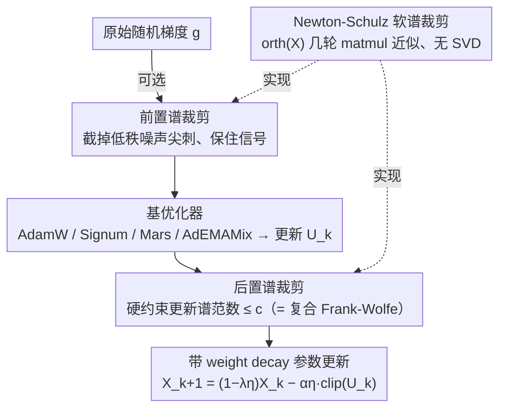

# Enhancing LLM Training via Spectral Clipping

**会议**: ICML 2026  
**arXiv**: [2603.14315](https://arxiv.org/abs/2603.14315)  
**代码**: https://github.com/mlolab/llm-spectral-clipping (有)  
**领域**: LLM效率 / 优化器 / 谱方法  
**关键词**: 谱裁剪, Frank-Wolfe, Newton-Schulz, LLM 预训练, AdamW

## 一句话总结
本文提出 SPECTRA：一个 optimizer-agnostic 的包装层，对更新矩阵做**后置谱裁剪**、对原始梯度做可选的**前置谱裁剪**，在理论上等价于带权重正则的复合 Frank-Wolfe 算法，在 124M–1.5B LLM 预训练上把 AdamW / Signum / Mars / AdEMAMix 的验证损失一致地往下压。

## 研究背景与动机

**领域现状**：LLM 预训练的优化器分两派。第一派是坐标级方法 (AdamW, Signum, AdEMAMix, Mars)，对每个参数独立做自适应缩放；第二派是谱方法 (Shampoo, Muon)，直接对更新矩阵的奇异值动手。最近的 benchmark 显示坐标级方法常常打平甚至超过纯谱方法，但坐标级方法**完全无视权重和梯度的全局谱结构**。

**现有痛点**：忽略谱结构带来两个具体毛病。第一，更新矩阵 $\mathbf{U}_k$ 的谱范数失控——对 Signum 而言 $\|\operatorname{sign}(\mathbf{M}_k)\|_2$ 至少是 $\sqrt{\max(m,n)}$，对 AdamW 在训练早期或 loss spike 之前也常常爆炸；由迭代关系 $\|\mathbf{X}_k\|_2 \le (1-\lambda\eta)^k\|\mathbf{X}_0\|_2 + \frac{1-(1-\lambda\eta)^k}{\lambda}\max_i\|\mathbf{U}_i\|_2$ 可知，更新谱范数大就会把权重谱范数也撑大，进而毁掉训练稳定性与泛化。第二，原始随机梯度的奇异值谱呈现**重尾**——少数奇异值比信号大几个数量级，称为「稀疏谱尖刺」；坐标级裁剪和全局裁剪要么压不住这些尖刺，要么把信号一起按下去。

**核心矛盾**：现有裁剪粒度太粗 (全局) 或太细 (坐标)，没有一个工具能**只敲掉低秩噪声尖刺、同时硬性约束更新谱范数**，又不引入 SVD 这种 GPU 杀手。

**本文目标**：(i) 对任意带 decoupled weight decay 的基优化器加一层谱范数约束；(ii) 把谱裁剪在数学上和某个被广泛研究的算法框架挂上钩，给出收敛保证和正则化解读；(iii) 给谱裁剪做一个不依赖 SVD 的 GPU 高效实现。

**切入角度**：从最简单的更新规则 $\mathbf{X}_{k+1}=(1-\lambda\eta_k)\mathbf{X}_k - \alpha\eta_k\,\mathrm{clip}^{\mathrm{sp}}_{c_k}(\mathbf{U}_k)$ 出发，把 SVD 后对奇异值做标量 clip 当作 atom 操作，再用 momentum 把它包成一个完整的优化器。

**核心 idea**：用 Newton-Schulz 迭代近似实现的「软谱裁剪」替代坐标/全局裁剪，对更新矩阵做硬性谱范数约束、对梯度做谱噪声过滤——本质上是在解一个**谱范数球内的复合 Frank-Wolfe 问题**。

## 方法详解

### 整体框架
SPECTRA 是一个加在基优化器外面的两层封装。给定任意基优化器输出的更新矩阵 $\mathbf{U}_k$（AdamW 的 $\mathbf{M}_k/\sqrt{\mathbf{V}_k}$、Signum 的 $\operatorname{sign}(\mathbf{M}_k)$、Mars / AdEMAMix 的相应输出皆可），SPECTRA 做两件事：

1. **(可选) 前置谱裁剪**：在基优化器拿到梯度之前，对原始随机梯度 $\mathbf{g}$ 先做一次 $\mathrm{clip}^{\mathrm{sp}}_{c_{\mathrm{pre}}}(\mathbf{g})$，把谱尖刺截掉再喂给基优化器；
2. **后置谱裁剪**：把基优化器算出的更新 $\mathbf{U}_k$ 做 $\mathrm{clip}^{\mathrm{sp}}_{c_k}(\mathbf{U}_k)$，再以 $\alpha\eta_k$ 步长更新参数，得到带 decoupled weight decay 的规则 $\mathbf{X}_{k+1}=(1-\lambda\eta_k)\mathbf{X}_k - \alpha\eta_k\,\mathrm{clip}^{\mathrm{sp}}_{c_k}(\mathbf{U}_k)$。

谱裁剪算子定义为对 SVD $\mathbf{X}=\mathbf{U}\mathbf{S}\mathbf{V}^T$ 中每个奇异值 $\mathbf{S}_{ii}$ 应用标量 clip：$\mathrm{clip}^{\mathrm{sp}}_c(\mathbf{X}) = \mathbf{U}\,\mathrm{diag}(\mathrm{clip}_c(\mathbf{S}_{ii}))\,\mathbf{V}^T$，保证输出谱范数 $\le c$。直接 SVD 太贵，关键工程贡献是用 Newton-Schulz 迭代把它替换成几次方阵-方阵乘法——这一个算子同时被前置和后置裁剪复用。

### 关键设计

**1. 后置谱裁剪 = 谱范数球上的复合 Frank-Wolfe：把 heuristic 操作接到成熟理论上**

坐标级方法无视全局谱结构，更新矩阵 $\mathbf{U}_k$ 的谱范数会失控（Signum 下 $\|\operatorname{sign}(\mathbf{M}_k)\|_2$ 至少 $\sqrt{\max(m,n)}$），由迭代关系它又会把权重谱范数撑大、毁掉稳定性。SPECTRA 对更新做硬谱裁剪封口。作者证明带 Polyak momentum 的 SPECTRA 更新

$$\mathbf{X}_{k+1}=(1-\lambda\eta_k)\mathbf{X}_k-\alpha\eta_k\,\mathrm{clip}^{\mathrm{sp}}_{c_k}(\mathbf{M}_k)$$

等价于求解 $\min_{\mathbf{X}\in Q_2}\{f(\mathbf{X})+\psi(\mathbf{X})\}$ 的随机复合 Frank-Wolfe，其中 $Q_2=\{\|\mathbf{X}\|_2\le D_2\}$ 是谱范数球、$\psi(\mathbf{X})=\frac{\lambda}{2\alpha}\|\mathbf{X}\|_F^2$ 是隐式 Frobenius 正则，超参对应 $c_k\equiv\lambda D_2/\alpha$、$\gamma_k=\lambda\eta_k$，凸假设下收敛率 $\mathcal{O}(1/K)+\mathcal{O}(\sigma/\sqrt B)$。这样一来，"SVD 后 clip 奇异值"这个看似拍脑袋的操作立刻拿到收敛保证和可调参数：$c,\alpha,\lambda$ 直接控制谱球半径 $D_2=\alpha c/\lambda$ 与正则强度 $b=\lambda/\alpha$；Muon 则是 $\alpha\to\infty,c=1/\alpha,b=0$ 的无正则特例。换掉 $\psi$ 还能派生核范数、Schatten-$p$、矩阵熵、$\ell_\infty$ 等一族变体。

**2. 前置谱裁剪：选择性敲掉低秩噪声尖刺、保住信号**

LLM 训练中原始梯度的奇异值谱重尾，少数"稀疏谱尖刺"比信号大一两个量级，且方向几乎与信号正交；坐标级或全局裁剪要么压不住尖刺、要么连信号一起按下去。SPECTRA 在梯度进基优化器前先 $\mathrm{clip}^{\mathrm{sp}}_{c_{\mathrm{pre}}}(\mathbf{g})$。设 $\mathbf{g}=\mathbf{G}+\mathbf{N}$、$\mathbf{N}=\ell\mathbf{U}_N\mathbf{V}_N^\top$ 是零均值低秩尖刺、$\ell\gg\|\mathbf{G}\|_2$，Lemma 4.2 证明当各向异性参数 $\kappa\le q/(25r^2)$ 时，对任何 $c\ge\|\mathbf{G}\|_2$ 都有 $\mathbb{E}_{\mathbf{N}}[\langle\mathbf{G},\tilde{\mathbf{g}}\rangle]\ge\frac13\|\mathbf{G}\|_F^2$ 且 $\mathbb{E}_{\mathbf{N}}[\|\tilde{\mathbf{g}}\|_F^2]\le r\min(c,\ell+\|\mathbf{G}\|_2)^2+\|\mathbf{G}\|_F^2$——按矩阵摄动论，$\mathbf{g}$ 的 top-$r$ 奇异值由噪声主导、其余由信号主导，把 top-$r$ 拍平到 $c$ 就近似得到 $\mathbf{G}+c\mathbf{U}_N\mathbf{V}_N^\top$，方差从 $r\ell^2$ 降到 $rc^2$。对照全局裁剪（Lemma 4.3）尖刺严重时只能在"保信号小"和"方差正比 $\ell^2$"间二选一，而配套 SGD 复杂度 $\mathcal{O}(L_F F^0/\epsilon^2+r\min(\sqrt rM,\ell)^2 L_F F^0/\epsilon^4)$ 对噪声水平 $\ell$ 鲁棒，严格优于全局裁剪的 $\mathcal{O}(r\ell^2 L_F F^0/\epsilon^4)$。"尖刺与信号近正交"这条几何观察正是同时压噪声、保信号能成立的前提。

**3. Newton-Schulz 软谱裁剪：抛弃 SVD 的 GPU 友好实现**

硬 SVD 在 $m\times n$ 矩阵上是 $\mathcal{O}(mn\min(m,n))$，对 LLM 巨型权重不可承受，谱裁剪要落地必须绕开它。作者观察到 $\frac1c\mathrm{clip}^{\mathrm{sp}}_c(\mathbf{X})=\operatorname{orth}(\mathbf{X}):=\mathbf{U}_X\mathbf{V}_X^\top$（$c\le\sigma_{\min}(\mathbf{X})$ 时严格成立，否则给出软版本），而 $\operatorname{orth}$ 正是 Muon 已在用的算子，可用几轮 Newton-Schulz 多项式迭代在小方阵上反复做矩阵-矩阵乘法逼近，每轮只两三次 matmul、无 SVD。对超阈值奇异值压到 $c$、对子阈值奇异值近似保持不变，这就是"软"谱裁剪的由来。matmul 友好的结构让 SPECTRA 的 wall-clock 开销控制在基优化器同量级。

### 损失函数 / 训练策略
基优化器自带的目标函数（交叉熵）不动；SPECTRA 只改 update 方向。主要超参数是谱裁剪阈值 $c$（前后置各一份）、scale $\alpha$ 和 weight decay $\lambda$，三者一起决定了等价 Frank-Wolfe 问题的谱球半径 $D_2=\alpha c/\lambda$ 与 Frobenius 正则强度 $b=\lambda/\alpha$，调参时可以直接按这两个物理量去取值。

## 实验关键数据

### 主实验
在 LLaMA 风格 transformer 上做 124M–1.5B 参数预训练，按 Chinchilla optimal token 数训练，比较 base optimizer 与 SPECTRA-base 的最终验证损失。

| 基优化器 | 模型规模 | Vanilla 验证损失 | + SPECTRA | 是否 SOTA |
|--------|---------|-----------------|----------|----------|
| AdamW | 124M–1.5B | 基线 | 一致下降 | 接近 SOTA |
| Signum | 同上 | 较弱 | 大幅下降 | 显著提升 |
| Mars | 同上 | 强基线 | 进一步下降 | 达到 SOTA |
| AdEMAMix | 同上 | 强基线 | 进一步下降 | 达到 SOTA |
| Muon | — | — | SPECTRA 在 $\alpha\to\infty,c=1/\alpha$ 退化为 Muon | 框架包含 |

### 消融实验

| 配置 | 关键指标 | 说明 |
|------|---------|------|
| Vanilla AdamW | 基线验证损失 | 更新谱范数失控 (Fig F.10) |
| + 后置谱裁剪 | 验证损失下降 + 权重范数变小 | 验证「隐式 Frobenius 正则」理论 |
| + 前置谱裁剪 | 在噪声尖刺严重的层进一步降损失 | 验证 Lemma 4.2 的稀疏尖刺去噪 |
| + 全局裁剪 (对照) | 信号被一起压低，无明显增益 | 验证 Lemma 4.3 的局限 |
| 大学习率训练 | Vanilla 易发散；SPECTRA 仍稳定 | 谱约束允许更大 lr |

### 关键发现
- **SPECTRA 一致提升**：对 AdamW / Signum / Mars / AdEMAMix 全部基优化器都降验证损失，最佳组合达到当前 LLM 预训练的 SOTA。
- **隐式正则被实证证实**：训练完的模型权重 Frobenius 范数明显比 vanilla 小，与 Proposition 3.1 中 $\psi(\mathbf{X})=\frac{\lambda}{2\alpha}\|\mathbf{X}\|_F^2$ 的等价 Frank-Wolfe 解读吻合。
- **能用更大学习率**：谱范数硬约束消化掉了大 lr 带来的更新爆炸风险，从而把 warm-up 缩短/学习率上限抬高变得可行。
- **谱尖刺真的存在**：124M LLaMA 训练全程的 layer-wise 奇异值统计 (Fig F.9, F.11, F.14) 显示原始梯度的 top-$r$ 奇异值常常比信号大一个数量级，且方向几乎和信号正交——这是前置裁剪有效的几何前提。

## 亮点与洞察
- **算法 ↔ 理论一一对应**：把一个看起来 heuristic 的「SVD 后 clip 奇异值」翻译成复合 Frank-Wolfe 并给出收敛率，是少见的「能直接拿来调参的理论」——$D_2,b$ 这两个旋钮的几何意义明确，比靠经验调 clip 阈值合理得多。
- **谱裁剪 vs 全局裁剪的几何分离**：Lemma 4.2/4.3 漂亮地说明了，全局裁剪本质上无法在「保信号」和「压方差」之间做出 spike-aware 的权衡，而谱裁剪因为只动 top-$r$ 奇异值（这些方向恰好和信号近正交）可以兼得。这套论证可迁移到任何「低秩异常 + 信号」的设置，例如 federated learning 的 byzantine 鲁棒聚合、训练数据中的对抗样本梯度。
- **Muon 的统一视角**：把 Muon 解释成 $b=0$ 的 SPECTRA 特例，使「谱归一化」与「谱裁剪 + 正则」之间的关系一目了然——Muon 的隐式 bias 由此可以被理解为缺少正则的边界情形。

## 局限与展望
- 论文实验主要在 124M–1.5B 规模做透，更大规模（>10B）尚需验证；谱裁剪在 MoE / GLU 等异构权重结构下的最优粒度也未探讨。
- Newton-Schulz 软裁剪的精度依赖迭代轮数，论文未给出与 vanilla 基优化器的端到端 wall-clock 详细对比（只在附录 F.7 简述），实际工程落地时还需注意 matmul 数量的 trade-off。
- 前置谱裁剪的理论假设要求噪声各向异性参数 $\kappa\le q/(25r^2)$，对于注意力层 KV 投影这种本身就高度结构化的梯度，该假设是否成立缺少更细的层级验证。
- 框架建立在 decoupled weight decay 之上，对耦合 weight decay 或 sharpness-aware 类的优化器（如 SAM）该如何嵌入仍是开放问题。

## 相关工作与启发
- **vs Muon (Jordan et al., 2024)**：Muon 把所有奇异值归一到 1，等价于 $\alpha\to\infty,\,c=1/\alpha,\,b=0$ 的 SPECTRA——即谱约束但无正则；SPECTRA 用有限 $\alpha$ 把 Frobenius 正则补回来，在 LLM 上得到更好的泛化。
- **vs 全局梯度裁剪 (Pascanu, You et al.)**：全局裁剪在尖刺严重时只能二选一（压信号 or 留方差），SPECTRA 用谱裁剪同时拿到。Lemma 4.3 给出了显式的理论分离。
- **vs Shampoo / spectral preconditioner**：Shampoo 用 $(\mathbf{G}\mathbf{G}^T)^{-1/4}$ 做谱预条件，关心曲率；SPECTRA 不做预条件、只对更新做谱范数约束，目的是稳定 + 正则，开销更小且与坐标级方法正交，可叠加使用。
- **vs Mars / AdEMAMix**：这些是新一代坐标级方法，在 benchmark 上已经很强；SPECTRA 把它们当成 base optimizer 直接套，进一步把验证损失拉低，证明谱约束和坐标级自适应是互补而非互斥的两个维度。

## 评分
- 新颖性: ⭐⭐⭐⭐ 把谱裁剪与 Frank-Wolfe 严格等价化是新洞察，Newton-Schulz 软裁剪的工程包装也是实实在在的贡献。
- 实验充分度: ⭐⭐⭐⭐ 124M–1.5B 多基优化器全面对比，附录给了谱分布 / 权重范数 / 噪声-信号分解等丰富诊断。
- 写作质量: ⭐⭐⭐⭐ 现象动机 → 算法 → 理论 → 实验的结构清晰，定理叙述准确，超参对应关系给得很贴心。
- 价值: ⭐⭐⭐⭐⭐ 一个 plug-and-play 包装层就能一致提升 LLM 预训练，与 Muon / Mars 这些 SOTA 工作正交，落地价值很高。

<!-- RELATED:START -->

## 相关论文

- [\[ICML 2026\] AdaGC: Enhancing LLM Pretraining Stability via Adaptive Gradient Clipping](adagc_enhancing_llm_pretraining_stability_via_adaptive_gradient_clipping.md)
- [\[NeurIPS 2025\] MeCeFO: Enhancing LLM Training Robustness via Fault-Tolerant Optimization](../../NeurIPS2025/optimization/mecefo_enhancing_llm_training_robustness_via_fault-tolerant_optimization.md)
- [\[ICML 2026\] Memory-Efficient LLM Pretraining via Minimalist Optimizer Design](memory-efficient_llm_pretraining_via_minimalist_optimizer_design.md)
- [\[ICML 2026\] Test time training enhances in-context learning of nonlinear functions](test_time_training_enhances_in-context_learning_of_nonlinear_functions.md)
- [\[ICML 2026\] RMNP: Row-Momentum Normalized Preconditioning for Scalable Matrix-Based Optimization](rmnp_row-momentum_normalized_preconditioning_for_scalable_matrix-based_optimizat.md)

<!-- RELATED:END -->
