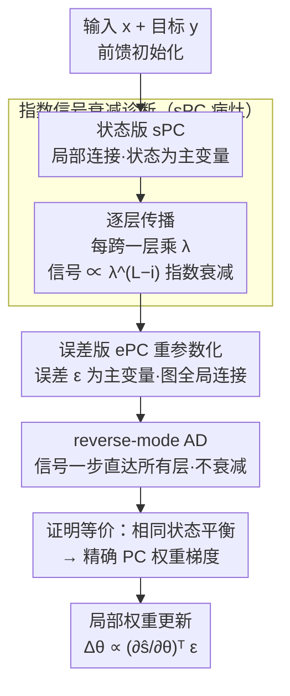

# ePC: Fast and Deep Predictive Coding in Digital Simulation

**会议**: ICML2026  
**arXiv**: [2505.20137](https://arxiv.org/abs/2505.20137)  
**代码**: https://github.com/cgoemaere/error_based_PC  
**领域**: 优化 / 类脑学习算法  
**关键词**: 预测编码, 反向传播替代, 信号衰减, 深度可扩展, 能量最小化

## 一句话总结
本文指出"状态版预测编码（sPC）在数字仿真里会随网络深度指数衰减训练信号、导致深层学不动且收敛极慢"这一被忽视的根因，并提出把优化变量从状态改成误差的等价重参数化 ePC——它能算出与 sPC 完全相同的状态平衡和权重梯度，却用 reverse-mode AD 让信号一步直达所有层，深网收敛快 100 倍以上、并在深层架构上追平反向传播。

## 研究背景与动机
**领域现状**：预测编码（Predictive Coding, PC）源自皮层功能的神经科学理论，近年被重述为一种"先推断后塑性"的机器学习算法，作为反向传播的类脑替代。它分两步产生权重梯度：先把权重 $\theta$ 固定、让神经状态 $s$ 不断调整以最小化能量 $E$（各层局部预测误差之和）；待状态收敛到平衡后，再用局部规则更新一次权重。这种"先把活动推到平衡再改权重"的范式被认为能改善损失景观、减少训练信号干扰，在在线/持续学习里有优势。

**现有痛点**：PC 理论上适配模拟（analog）硬件——像物理系统一样自然演化、极省能。但这种硬件还不存在，于是现实中 PC 几乎全靠**数字仿真**：用数值求解器迭代求状态平衡，需要大量迭代步，相比天然契合数字硬件的反向传播开销巨大。更糟的是 Pinchetti et al. (2025) 观察到的"深度反常"：即便简单监督任务，深层 PC 模型也常比浅层差，和反向传播正相反。已有解法要么改 PC 的梯度公式、要么强加固定预测假设、要么只适用残差结构——标准前馈网络上的通用方案仍是空白。

**核心矛盾**：作者把"计算效率低"和"深度扩展失败"这两个看似无关的问题归到同一个根因——**硬件-算法失配**。PC 为了生物可实现性，刻意把计算图打断成局部连接，让信号一层层传播。这在物理基质上没问题，但在数字仿真里，每跨一层信号就被状态学习率 $\lambda$（为稳定必须 $<1$）衰减一次，逐层相乘就成了**对深度的指数衰减**。

**切入角度**：既然严格局部性只是为模拟硬件服务、对仿真本身并非必需，那就放松这个约束。关键观察是：sPC 只是 PC 的"一种"实例化（这点常被文献忽略），完全可以换一种等价参数化，在不改变 PC 学习本质的前提下，去掉数字仿真里的信号衰减。

**核心 idea**：把 PC 的优化主变量从**状态 $s$** 换成**误差 $\epsilon$**，将局部连接的计算图重连为全局连接，从而能用 reverse-mode AD 让输出损失的信号无衰减地一步直达所有层——这就是 error-based PC（ePC）。

## 方法详解

### 整体框架
理解 ePC 要先看清 sPC 的病灶，再看 ePC 怎么对症。sPC 的能量是各层预测误差与输出损失之和：

$$E(s,\theta)=\tfrac{1}{2}\sum_{i=0}^{L-1}\|s_i-\hat{s}_i\|^2+\mathcal{L}(\hat{y},y),\quad \hat{s}_i:=f_{\theta_i}(s_{i-1}).$$

训练一步含两相：状态相（固定 $\theta$，让状态按 $\partial s_i/\partial t=-\nabla_{s_i}E$ 演化到平衡）和权重相（固定 $s$，按 $\Delta\theta_i\propto -\nabla_{\theta_i}E=(\partial f_{\theta_i}/\partial\theta_i)^\top\epsilon_i$ 更新一次）。注意权重更新只用到**最终平衡状态**，到达平衡的轨迹无关紧要——这给了换求解方式的自由。ePC 保留同一个能量，但把误差 $\epsilon$ 设为主变量，重连计算图后用 AD 求平衡，再由 $s_i:=\hat{s}_i+\epsilon_i$ 还原状态。整体对比如下：

### 关键设计

**1. 指数信号衰减诊断：揭出 sPC 数字仿真慢与深层学不动的共同根因**

这是全文的"病理学"基石。sPC 经前馈初始化后，所有内部能量被置零、只剩输出能量 $E_L$ 非零；状态更新本该驱动一个从输出到输入的反向波前，每步推进一层。但作者实测信号是**不连续地跳跃前进**，在深层停滞、延迟越来越长。逐步追踪发现：当能量梯度从一层传到相邻层，会被状态学习率 $\lambda$ 衰减一次（$\lambda<1$ 是稳定性要求），每多跨一层就再乘一个 $\lambda$，于是首个到达第 $i$ 层状态的非零信号约为

$$\Delta s_i\propto \lambda^{L-i}\,\nabla_{\hat{y}}\mathcal{L},$$

即对深度 $L$ 指数衰减。对典型 $\lambda\in[0.01,0.1]$，信号在 4–8 个更新步内就跌破数值精度（float32 加法只在 8 个数量级内有效，$1+10^{-8}=1$）。这解释了三件事：理论上连续的传播为何表现为离散延迟跳跃、深层为何可能完全未训练（却被状态收敛指标误判为"已平衡"）、以及为何只有产生大输出梯度的难/误标样本才能穿透到深层（造成不同层在不同数据子集上训练的系统性偏置）。作者强调这衰减**不可避免**，连超稳定架构 µPC 也逃不掉——常见补救（调大学习率、提精度、精调初始化、换优化器）都只治标。

**2. 误差版重参数化 ePC：换主变量把局部图重连成全局图**

对症下药。ePC 不再以状态 $s$ 为优化变量，而以误差 $\epsilon$ 为主变量，能量改写为

$$E(\epsilon,\theta)=\tfrac{1}{2}\sum_{i=0}^{L-1}\|\epsilon_i\|^2+\mathcal{L}(\hat{y},y),\quad \hat{y}=f_\theta(x,\epsilon).$$

核心动力学不变：迭代更新 $\epsilon$ 最小化 $E$，再对 $\theta$ 做一步梯度。区别在计算图结构：sPC 刻意打断图以强制局部信息（$\hat{y}=\text{func}(s_{L-1})$），ePC 则把整张网重新连通，让输出直接依赖所有误差变量 $\hat{y}=\text{func}(x,\epsilon_0,\epsilon_1,\dots,\epsilon_{L-1})$。这样误差更新梯度变成 $\nabla_{\epsilon_j}E=\epsilon_j+(\partial\hat{y}/\partial\epsilon_j)^\top\nabla_{\hat{y}}\mathcal{L}$，可由 reverse-mode AD 一次性算遍全网。需要时状态用 $s_i:=\hat{s}_i+\epsilon_i$ 还原——概念上等于从输入做一次前馈、在每层施加扰动 $\epsilon_i$。作者强调这**仍是合法 PC 算法**：AD 只是高效求状态平衡的计算后端，不参与权重更新；权重更新（式 $\Delta\theta_i\propto(\partial\hat{s}_i/\partial\theta_i)^\top\epsilon_i$）依旧时间局部，遵循 PC 原则，因此不能简单说 ePC 是"PC 与反传的混合"。

**3. 等价性证明：ePC 与 sPC 算出完全相同的平衡与精确 PC 梯度**

ePC 敢去掉局部性，底气在于它和 sPC **可证等价**：两者是 PC 的两种合法参数化，收敛到同一个状态平衡，因此产生完全相同（exact）的 PC 权重梯度（附录 C.2 给证明，C.1 验证 ePC 仍是有效 PC）。这条把"快"和"对"分了开来——ePC 不是近似加速，而是精确等价加速。其所以快，是因为它**把稳定性和传播速度解耦**：在 sPC 里两者被 $\lambda$ 纠缠在一起（$\lambda$ 既控稳定又控传播），ePC 则先用 reverse-mode AD 无衰减地把信号送达所有层，**之后**才在误差更新步施加 $\lambda$——$\lambda$ 只影响稳定、不再限制传播触达。于是所有层从第一步起同时开始优化，不论多深，指数衰减被彻底消除。这也顺带给 PC 里"前馈状态初始化为何如此好用"提供了理论解释：它本质上就是在执行 ePC 的第一步。

### 损失函数 / 训练策略
能量函数本身即训练目标，输出损失 $\mathcal{L}$ 可自由选择（实验用 MSE 或交叉熵 CE）。每个权重更新步内：先迭代 $T$ 步求误差/状态平衡（ePC 用 AD、sPC 用 SGD 离散化 $s_i\leftarrow s_i-\lambda\nabla_{s_i}E$），再用平衡误差做一次局部权重更新 $\theta_j\leftarrow\theta_j-\eta\nabla_{\theta_j}E$，整个过程在数据批上重复，与标准深度学习一致。

## 实验关键数据

### 概念验证：20 层线性网络 / MNIST
选 20 层线性网络是因为它够深、又有唯一可解析求出的平衡解可当 ground truth。两法用同一组（反传得到的）权重，超参按收敛速度调优。结果：sPC 与 ePC 都收敛到解析最优（再次印证等价），但 **ePC 比 sPC 快 100 倍以上**。信号传播直观可见：sPC 约 30 步才推进 9 层到达 $s_9$、近 100 步才走完 20 层到 $s_0$；ePC 那时早已收敛，全层从第一步同时优化。深层非线性 MLP 上 sPC 甚至需 >100,000 步才真正收敛，凸显 ePC 的必要性。

### 主实验：四数据集 × 多深度架构
沿用 Pinchetti et al. (2025) 的基准，以反传为金标准。测试精度（%，5 seeds，加粗为置信区间内最优）：

| 架构 / 数据集 (CE loss) | ePC | sPC | Backprop |
|------|------|------|------|
| VGG-5 / CIFAR-10 | **88.27** | 84.66 | **87.95** |
| VGG-5 / CIFAR-100 Top-1 | **63.39** | 56.85 | **63.83** |
| VGG-7 / CIFAR-10 | 88.84 | 77.98 | **89.60** |
| VGG-9 / CIFAR-100 Top-1 | 60.65 | 54.19 | 61.11 |
| ResNet-18 / CIFAR-10 | **91.73** | "43.19" | **91.85** |
| ResNet-18 / CIFAR-100 Top-1 | 69.47 | "16.01" | **71.46** |

（"…"：ResNet-18 上 sPC 在作者实现里不稳定，数值引自 Pinchetti et al. 2025。）

### 深度扩展对比（消融视角）

| 训练算法 | 随深度变化 | ResNet-18 表现 | 与反传差距 |
|------|------|------|------|
| sPC | 随深度**退化** | 不稳定（CIFAR-100 Top-1 仅 ~16–23%） | 显著落后 |
| ePC | 随深度**稳步提升** | 接近反传（91–69%） | 多数落在置信区间内 |
| Backprop | 随深度提升 | 金标准 | — |

### 关键发现
- **ePC 能向深扩展、sPC 不能**：最明显的是 ResNet-18——ePC 拿到接近反传的成绩，sPC 则因不稳定崩到几十个百分点，直接验证了"消除信号衰减→解锁深度"。
- **ePC 在多数数据集/架构上追平反传**，常落在统计置信区间内；两种损失（MSE/CE）下趋势一致，但 CE 下 ePC 与 sPC 对超参都更敏感。
- **VGG-7 上 ePC 的 MSE 版甚至略超反传**（CIFAR-100 Top-1 66.55 vs 66.23），说明 ePC 不只是"勉强追上"，在部分配置有自身优势。

## 亮点与洞察
- **把两个孤立问题归一根因**：计算效率低和深度扩展失败在文献里被分别研究，本文用"指数信号衰减 + 硬件-算法失配"一并解释，这种"找到共同病灶"的洞察比任何单点 trick 都更有价值。
- **精确等价的加速，不是近似**：ePC 可证算出与 sPC 相同的平衡与权重梯度，因此 100 倍加速是"免费的"——这区别于大量"用近似换速度"的工作。
- **解耦稳定性与传播速度**：sPC 把两者绑在 $\lambda$ 上才出问题，ePC 先 AD 传播再施加 $\lambda$，这个"先到达、后稳定"的拆解思路可迁移到其他迭代式平衡求解（如平衡模型 DEQ、Hopfield 类网络）。
- **顺手解释了一个民间偏方**：前馈状态初始化为何好用——它就是 ePC 的第一步，本文给了它理论背书。

## 局限与展望
- **放弃了模拟可实现性**：ePC 用全局连接和 reverse-mode AD，不再能直接映射到模拟硬件——它定位是"加速 sPC 数字验证的仿真工具"，为模拟芯片开发铺路，而非终极的类脑实现。
- **作用域限于"先推断后塑性"的第一步**：本文只攻状态/误差推断这一步，PC 的权重更新规则、与反传在泛化层面的差异（附录 C.3/C.4 讨论）仍未充分展开。
- **CE 下超参敏感**：交叉熵损失下 ePC 与 sPC 对超参都更敏感，ResNet-18 的 CE 结果与反传仍有可见差距（69.47 vs 71.46）。
- **sPC 基线的实现不稳定**：ResNet-18 的 sPC 数值因作者实现不稳定而借用他人结果，使该处对比的可比性打折。

## 相关工作与启发
- **vs 标准 sPC**：两者能量与权重更新规则一致、可证等价；sPC 为生物可实现性强制局部图，数字仿真下信号指数衰减、深层学不动、慢；ePC 重连全局图用 AD 求平衡，无衰减、快 100 倍、可向深扩展，代价是不再模拟可实现。
- **vs 改梯度公式 / 固定预测假设 / µPC 等深度修复方案**：这些要么改 PC 梯度、要么加约束、要么只限残差结构；ePC 用统一的精确重参数化覆盖标准前馈网络，且不改 PC 学习本质。
- **vs 反向传播**：ePC 借 reverse-mode AD 作计算后端，但权重更新保持时间局部、遵循 PC 原则，本质仍是 PC 而非反传；实验上多数配置追平反传，部分（VGG-7 MSE）略胜。
- **vs ODE 求解器 / 动量优化器 / 一步近似等加速尝试**：这些在 sPC 框架内调求解方式，治标不治本（衰减仍在）；ePC 直接换参数化消掉病根，从原理上解决。

## 评分
- 新颖性: ⭐⭐⭐⭐⭐ 指出被忽视的指数信号衰减根因，并用精确等价的误差重参数化一举解决
- 实验充分度: ⭐⭐⭐⭐ 四数据集多深度架构系统对比 + 20 层线性网解析验证，ResNet sPC 基线略有可比性瑕疵
- 写作质量: ⭐⭐⭐⭐⭐ 病灶诊断→重参数化→等价证明逻辑环环相扣，算法对照清晰
- 价值: ⭐⭐⭐⭐⭐ 解锁 PC 向深扩展，为类脑学习的数字验证与模拟硬件路线扫清核心障碍

<!-- RELATED:START -->

## 相关论文

- [\[ICML 2026\] $α$-PFN: Fast Entropy Search via In-Context Learning](α-pfn_fast_entropy_search_via_in-context_learning.md)
- [\[ICML 2026\] LiMuon: Light and Fast Muon Optimizer for Large Models](limuon_light_and_fast_muon_optimizer_for_large_models.md)
- [\[ICLR 2026\] DeepAFL: Deep Analytic Federated Learning](../../ICLR2026/optimization/deepafl_deep_analytic_federated_learning.md)
- [\[AAAI 2026\] ECPv2: Fast, Efficient, and Scalable Global Optimization of Lipschitz Functions](../../AAAI2026/optimization/ecpv2_fast_efficient_and_scalable_global_optimization_of_lipschitz_functions.md)
- [\[ICML 2025\] AdvPrompter: Fast Adaptive Adversarial Prompting for LLMs](../../ICML2025/optimization/advprompter_fast_adaptive_adversarial_prompting_for_llms.md)

<!-- RELATED:END -->
