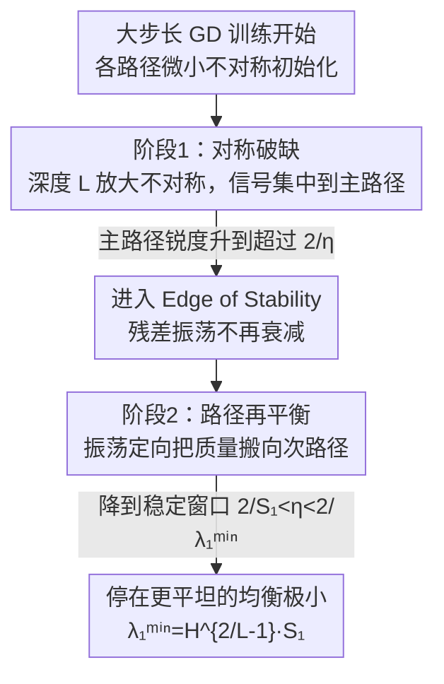

# Gradient Descent with Large Step Size Restores Symmetry in Deep Linear Networks with Multi-Pathway

**会议**: ICML 2026  
**arXiv**: [2606.05219](https://arxiv.org/abs/2606.05219)  
**代码**: 待确认  
**领域**: 优化理论 / 深度线性网络 / 隐式偏置 / Edge of Stability  
**关键词**: 多路径深度线性网络、大学习率、对称破缺、Edge of Stability、锐度

## 一句话总结
此前用梯度流（GF）分析多路径深度线性网络得出"赢者通吃"——信号会集中到单条路径、对称破缺；本文证明大步长的离散梯度下降（GD）讲的是另一个故事：单路径解是尖锐极小、把信号分摊到多条路径会按 $H^{2/L-1}$ 的因子降低锐度，于是训练在 Edge of Stability 的振荡会推翻早期的对称破缺、进入"路径再平衡"阶段，最终偏好共享而非单路径独占的表示。

## 研究背景与动机

**领域现状**：理解深度网络的训练动力学、刻画优化器的"隐式偏置"（在众多全局极小里选哪个）是深度学习理论的核心问题。深度线性网络（DLN）因为可解析、又保留过参数化与表示学习的本质，成为研究这类问题的标准试验台。近年多分支/多路径 DLN 受到关注：Shi et al. (2022) 用梯度流证明并行路径会"赢者通吃"——某条路径主导特征学习、其余冗余，对称发生破缺。

**现有痛点**：梯度流假设学习率无穷小，是连续时间近似，它**忽略了实际训练中大学习率 GD 的离散动力学**。而真实训练常常工作在 Edge of Stability（EoS）：GD 会主动与损失曲率互动、躲开尖锐极小。于是一个关键问题被悬置：GF 预言的对称破缺，在大学习率 GD 下还成立吗？

**核心矛盾**：这里有两股相反的力。一是 GF 的**架构偏置**——深度 $L$ 把初始化的微小不对称按 $L-1$ 次幂放大，逼着系统走向单路径独占；二是大步长 GD 的**隐式偏置**——倾向于平坦极小。小学习率让前者主导、复现对称破缺；可一旦学习率大到能让尖锐的单路径极小失稳，后者就该反过来把网络推向平坦的、跨路径均衡的配置。两者究竟谁赢、何时切换，是本文要回答的。

**本文目标**：把多路径 DLN 的训练拆成"几何 + 动力学"两层来回答——(1) 单路径解和均衡解，哪个在损失景观上更尖锐？(2) 大步长 GD 的振荡会不会、以及如何把网络从单路径推回均衡？(3) 学习率能开多大而不让轨迹崩掉？

**切入角度**：在目标对齐的 SVS（奇异向量平稳）流形上把动力学按模式解耦成标量递推，于是锐度、相位、稳定性都能闭式刻画。

**核心 idea**：用"离散 GD 在 EoS 的定向振荡"代替"连续 GF 的渐近"来重判多路径竞争——证明均衡解更平坦、振荡是把质量从主路径搬向次路径的定向漂移，而非噪声。

## 方法详解

### 整体框架

本文是纯理论分析，对象是 $H$ 条并行路径、各自深度 $L_h$ 的深度线性网络：第 $h$ 条路径的端到端映射是权重连乘 $\Omega_h=W_{hL_h}\cdots W_{h1}$，全网映射是各路径之和 $M=\sum_{h=1}^H\Omega_h$，用 Frobenius 损失 $\mathcal L(\Theta)=\tfrac12\|M-M_\star\|_F^2$ 拟合目标矩阵。分析分三块递进：先在 SVS 流形上把损失按目标奇异模式解耦、算出每个全局极小的锐度（第 4 节）；再刻画大步长 GD 的两阶段动力学——早期对称破缺、后期再平衡（第 5 节）；最后从"深线性链"导出学习率的上界，保证轨迹挺过振荡不崩（第 6 节）。整条逻辑的关键转折是"锐度 = 由学习率筛选极小的标尺"。

### 关键设计

**1. SVS 解耦：把多路径动力学约化成逐模式的标量递推**

直接分析权重连乘的非凸动力学很难。作者沿用目标对齐参数化：设目标 SVD 为 $M_\star=U_\star\Sigma_\star V_\star^\top$，让每条路径的端到端奇异向量与目标对齐——SVS 集要求每层 $W_{h\ell}=Q_{h\ell+1}\Sigma_{h\ell}Q_{h\ell}^\top$，首尾正交矩阵固定为 $V_\star,U_\star$。这样相邻正交矩阵在连乘里互相抵消，路径映射 $\Omega_h=U_\star(\prod_\ell\Sigma_{h\ell})V_\star^\top$ 在目标基下是对角的。GD 保持 SVS 集不变，于是只需追踪标量模式系数 $\sigma_{hi}=u_{\star i}^\top\Omega_h v_{\star i}$、$\sigma_i=\sum_h\sigma_{hi}$，损失整齐解耦成 $\mathcal L=\sum_i \tfrac12(\sum_h\sigma_{hi}-\sigma_{\star i})^2$。再配深度平衡初始化 $W_{h\ell}(0)=\alpha_h^{1/L_h}I_d$，把轨迹钉在"深度平衡流形"上（层内奇异值满足 $\sigma_{hi}^{(\ell)}=\sigma_{hi}^{1/L_h}$），后续锐度和动力学都能在这条流形上闭式算。这是后面一切结论的脚手架。

**2. 锐度—并行性定理：把信号分摊到 H 条路径，锐度按 $H^{2/L-1}$ 下降**

痛点是要判断"单路径 vs 均衡"哪个更易被大学习率筛掉，需要量化锐度。锐度 = 全局极小处 Hessian 最大特征值。在 SVS 深度平衡流形上 Hessian 按模式块对角、每块秩一，模式 $i$ 的非零特征值为

$$\lambda_i=L\sum_{h=1}^H \sigma_{hi}^{2-\frac{2}{L}}$$

当 $L>2$ 时，在约束 $\sum_h\sigma_{hi}=\sigma_{\star i}$ 下，$\lambda_i$ 在**等分**（$\sigma_{1i}=\cdots=\sigma_{Hi}=\sigma_{\star i}/H$）时最小，最小锐度 $\lambda_i^{\min}=L\,H^{2/L-1}\sigma_{\star i}^{2-2/L}$。与单路径相比，约化因子是

$$\frac{\lambda_i^{\min}}{\lambda_i^{\min}(H=1)}=H^{\frac{2}{L}-1}<1$$

因为 $2/L-1<0$，路径数 $H$ 或深度 $L$ 越大，比值越小、均衡解越平坦。这条定理是全文骨架：它说明**稀疏单路径解恰恰是深度平衡流形上最尖锐的配置，而均衡解最平坦**——于是大学习率自然会嫌弃前者。

**3. 两阶段再平衡动力学：EoS 的振荡是定向漂移而非噪声**

有了锐度排序，第 5 节刻画大学习率（$\eta>2/S_1$，$S_1=L\sigma_{\star1}^{2-2/L}$ 是单路径解锐度）下的轨迹。**阶段一·对称破缺**：训练初期奇异值小、局部锐度低于 $2/\eta$，动力学贴近 GF，相对增长率 $\dot\sigma_{hi}/\dot\sigma_{ki}=(\sigma_{hi}/\sigma_{ki})^{L-1}$ 把初始微小不对称按深度 $L$ 指数放大，信号集中到主路径。**阶段二·再平衡**：当主路径 $\sigma_{11}$ 逼近 $\sigma_{\star1}$、锐度升过 $2/\eta$，GD 再也落不进这个尖锐极小，进入 EoS，残差不再衰减而是振荡。作者在附录用守恒量分析点明机制：GF 下有守恒量固定"路径失衡坐标" $z$、零损失点锐度随 $\|z\|$ 平方增长；大步长 GD 在 EoS 打破守恒律——自稳定下残差正负交替、$\|z\|$ 每两步衰减一点，于是振荡变成**朝平坦/均衡极小的定向漂移**。漂移只在锐度超 $2/\eta$ 时发生，把 $\sigma_{hi}$ 摊到进入稳定窗口 $2/S_1<\eta<2/\lambda_1^{\min}$ 为止。异质深度（$L_h$ 不同）下结论更强：GF 偏好"动力学上更快"的浅路径、大步长 GD 偏好"更平坦"的分布式配置，两股力冲突，最终 GD 覆盖结构性不对称、把信号摊到由式 (18) 拉格朗日条件决定的均衡点。

**4. 最坏情形返回阈值（WCR）：深度越深，可容忍的大步长窗口越宽**

再平衡要求 $\eta>2/S_1$，但 $\eta$ 也有上限：再平衡要先穿过一段瞬态单路径相位，步子过大会把主路径奇异值推过零、发生符号翻转、破坏 SVS 描述、再平衡夭折。最坏情形发生在信号全集中于一条路径时——此时退化成一维"深线性链"映射 $w_{t+1}=w_t-\eta\,w_t^{L-1}(w_t^L-\sigma_{\star1})$，不动点 $w_\star=\sigma_{\star1}^{1/L}$。定义"两步返回安全"：任何从 $(0,w_\star)$ 的过冲都要在再走一步后回到 $(0,w_\star)$ 内。由此得最坏情形返回阈值 $\eta_{\mathrm{WCR}}(L,\sigma_{\star1})=\gamma_{\mathrm{WCR}}(L)/S_1$，其中 $\gamma_{\mathrm{WCR}}(L)>2$ 只依赖深度、是单个标量方程的根（可二分求解）。关键结论：$\gamma_{\mathrm{WCR}}(L)=\Theta(\log L)$ 随深度无界增长，所以**深网络容许更大的"过冲但能返回"学习率窗口**——这也解释了 learning-rate warm-up 为何有用：锐度在主路径成形早期最高，过早开大步会超过 $\eta_{\mathrm{WCR}}$ 触发符号翻转，warm-up 把大步推迟到轨迹挺过最脆弱的单路径瓶颈之后。

### 损失函数 / 训练策略
训练目标就是式 (3) 的 Frobenius 平方损失，优化是普通离散 GD（式 4），步长 $\eta$ 固定。理论结论全部围绕"$\eta$ 落在哪个区间"展开：$\eta<2/S_1$ 复现 GF 的对称破缺；$2/S_1<\eta<\min\{2/\lambda_1^{\min},\eta_{\mathrm{WCR}}\}$ 触发再平衡并稳定；更一般地，落在 $2/S_p<\eta<\min\{2/S_{p+1},\eta_{\max}\}$ 会再平衡前 $p$ 个模式（rank-$p$ 平衡）。验证用 $L=20,H=2$ 的线性网络数值实验（图 1–2、4）和 Tanh 激活的两路径 MLP（图 3）观察同样的相变。

## 实验关键数据

本文是理论论文，"实验"是验证理论的数值/可视化，不含基准对比表。下表汇总核心理论结论与对应学习率区间：

### 主结论（理论 + 数值验证）

| 学习率区间 | 动力学行为 | 终态 | 验证 |
|--------|------|------|------|
| $\eta<2/S_1$（小步长） | 贴近 GF | 单路径独占（赢者通吃） | 图 1 第一行 |
| $2/S_1<\eta<2/\lambda_1^{\min}$（大步长） | 对称破缺 → EoS 振荡 → 再平衡 | 跨路径均衡（更平坦） | 图 1–2 |
| $\eta=2/\lambda_1^{\min}$ | 停界恰为完全均衡 | 完全均衡极小 | 图 1 |
| $\eta>\eta_{\mathrm{WCR}}$ | 瞬态单路径过冲跨零 | 符号翻转、再平衡失败 | 图 5 |

### 关键定量关系

| 量 | 表达式 | 含义 |
|------|---------|------|
| 模式锐度 | $\lambda_i=L\sum_h\sigma_{hi}^{2-2/L}$ | 全局极小处 Hessian 主特征值 |
| 均衡最小锐度 | $\lambda_i^{\min}=L\,H^{2/L-1}\sigma_{\star i}^{2-2/L}$ | 等分时取得 |
| 并行约化因子 | $H^{2/L-1}<1$ | 相对单路径锐度的下降倍数 |
| WCR 比值 | $\gamma_{\mathrm{WCR}}(L)=\Theta(\log L)$ | 安全大步窗口随深度增长 |

### 关键发现
- **GD 与 GF 给出定性相反的预测**：同一架构，小步长复现 GF 的赢者通吃、大步长却走向均衡——隐式偏置不只取决于架构，更取决于离散步长。
- **振荡是"特征"不是"bug"**：EoS 的剧烈振荡不是数值噪声，而是把质量从主路径搬向次路径的定向力，主动把网络拉向平坦极小。
- **深度有双重作用**：既通过 $L-1$ 次幂放大不对称、加剧早期对称破缺，又通过 $\Theta(\log L)$ 扩大可再平衡的学习率窗口——深度让对称破缺更强，也让 GD 更容易把它扳回来。
- **非线性也成立**：Tanh 两路径 MLP 在大学习率下同样从赢者通吃转为 $K_{11}\approx K_{21}$ 的均衡（图 3），只是通常需要比线性网络略大的学习率。

## 亮点与洞察
- **"锐度排序决定隐式偏置"这条主线很干净**：先证单路径=最尖锐、均衡=最平坦，再让大步长 GD 天然筛掉尖锐解——把一个动力学问题化成了几何问题，逻辑闭环。
- **把 EoS 振荡解释成定向漂移**，并用守恒律被打破 + 自稳定给出机制，而不是停在"振荡导致平坦"的现象描述，这是比经验观察更进一步的地方。
- **WCR 阈值顺手解释了 warm-up**：深度越深安全窗口越宽、但早期锐度峰会顶破上界，所以要先小步穿过脆弱瞬态再放大——这个对实践调参的启发可迁移到一般深网。
- **对一类 GF 结论的"祛魅"**：彩票假设、稀疏子网络、结构性不对称偏好浅路径等基于连续时间的结论，都可能在大步长离散动力学下被改写，提示这类分析需要重审。

## 局限与展望
- 理论严格成立于深度**线性**网络 + SVS 深度平衡流形 + 方阵 $d\times d$ + 对齐目标这套强假设；非线性只在 Tanh MLP 上经验观察到同款相变，缺乏严格证明。
- 结论依赖深度平衡初始化（$W_{h\ell}(0)=\alpha_h^{1/L_h}I$）和对称目标 $M_\star=V_\star\Sigma_\star V_\star^\top$ 等条件，一般初始化/非对称目标下轨迹是否仍留在流形上未完全覆盖。
- 锐度—再平衡的刻画聚焦最大模式/有限路径数与深度范围（数值实验多在 $L\le20,H=2$、异质深度 $\{3,5,7\}$），对超深、超多路径、真实大模型的外推仍是开放问题。
- 作者自陈的下一步：把分析推广到 Mixture-of-Experts、多头注意力等模块化架构——这些都可视作"多路径"，但带非线性与门控，难度更高。

## 相关工作与启发
- **vs Shi et al. (2022)（GF 多路径）**: 他们用梯度流证明赢者通吃；本文证明一旦放掉无穷小学习率假设、改用大步长 GD，赢者通吃不再持久，反被再平衡覆盖——是对其结论适用边界的直接修正。
- **vs Ghosh et al. (2025)（深度矩阵分解越界分析）**: 他们研究单路径越过稳定阈值后的振荡与收敛、关注"层间平衡差"（依赖不对称初始化才显现）；本文把场景推到多路径，且强调路径失衡是 GF 的**自发吸引子**、不依赖特定初始化，GD 的离散失稳是主动对抗这种内禀偏置。
- **vs Damian et al. (2023) / Cohen et al. (2021, 2025)（EoS / 自稳定 / central flow）**: 这些工作刻画 GD 如何躲开最尖锐方向、走向平坦极小；本文把同款机制具体化到多路径竞争里，给出"振荡=路径间质量定向转移"的可解析图景。

## 评分
- 新颖性: ⭐⭐⭐⭐⭐ 用离散大步长 GD 推翻 GF 的赢者通吃，并给出锐度—再平衡—WCR 三段闭环理论
- 实验充分度: ⭐⭐⭐⭐ 理论自洽且有线性/非线性数值验证，但无大规模实证（受限于理论设定）
- 写作质量: ⭐⭐⭐⭐ 三段递进清晰，符号偏密、需要一定优化理论背景
- 价值: ⭐⭐⭐⭐ 提醒整类 GF 架构偏置结论需在离散动力学下重审，并顺带解释 warm-up

<!-- RELATED:START -->

## 相关论文

- [\[ICML 2026\] Flatland: The Adventures of Gradient Descent with Large Step Sizes](flatland_the_adventures_of_gradient_descent_with_large_step_sizes.md)
- [\[NeurIPS 2025\] Multi-head Transformers Provably Learn Symbolic Multi-step Reasoning via Gradient Descent](../../NeurIPS2025/optimization/multi-head_transformers_provably_learn_symbolic_multi-step_reasoning_via_gradien.md)
- [\[ICML 2026\] Adaptive Sharpness-Aware Minimization with a Polyak-type Step size: A Theory-Grounded Scheduler](adaptive_sharpness-aware_minimization_with_a_polyak-type_step_size_a_theory-grou.md)
- [\[ICML 2026\] Balancing Learning Rates Across Layers: Exact Two-Step Dynamics and Optimal Scaling in Linear Neural Networks](balancing_learning_rates_across_layers_exact_two-step_dynamics_and_optimal_scali.md)
- [\[ICML 2026\] Dynamics and Representation Structure of Local Approximations to Gradient-Based Learning in Linear Recurrent Neural Networks](dynamics_and_representation_structure_of_local_approximations_to_gradient-based_.md)

<!-- RELATED:END -->
