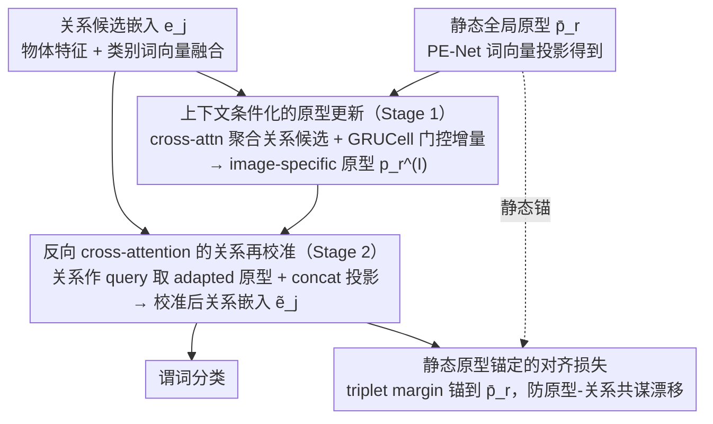

# Learning Context-Conditioned Predicate Semantics via Prototype Feedback

**会议**: ICML 2026  
**arXiv**: [2605.29610](https://arxiv.org/abs/2605.29610)  
**代码**: https://github.com/Namgyu97/AlignG-SGG.pytorch  
**领域**: 多模态VLM / 场景图生成  
**关键词**: 场景图生成、关系推理、原型学习、上下文条件化、谓词消歧  

## 一句话总结
AlignG 把 PE-Net 的静态谓词原型改造成"图像条件化"的动态原型：先用关系候选给原型做 GRU 增量更新拿到 image-specific prototype，再反向用它去 recalibrate 关系特征，并把对齐损失锚定在静态全局原型上以防漂移，在 VG-150 / GQA-200 的 SGDet 设置上 F@100 分别涨 1.4 / 2.7。

## 研究背景与动机

**领域现状**：场景图生成（SGG）要把图像表示成"物体 + pairwise 谓词"的图，是结构化场景理解的核心任务。主流路线之一是原型学习：PE-Net 给每个谓词类别配一个由词向量投影出来的静态原型 $\bar{\mathbf{p}}_r = \mathbf{W}_p \mathbf{t}_r$，再让关系嵌入 $\mathbf{e}_j$ 向自己对应的原型对齐。后续的 C-SGG、UP-Net、MCL 进一步把一个谓词拆成多个子原型来涵盖语义多样性，RA-SGG 则引入检索增强的外部样例。

**现有痛点**：谓词天然多义。"on" 既能表示空间接触也能表示功能性使用；"riding" 和 "standing on" 在静态图像里几乎共享一样的视觉特征，区别只在动作意图。无论是单原型、多原型还是检索原型，**只要原型在训练后就不再变动**，模型就没法用"这张图里到底有哪些关系候选"这种 image-specific evidence 去重新组织谓词语义，结果就是模糊场景下系统性混淆 + 长尾谓词被高频谓词吞掉。

**核心矛盾**：原型既要保持**数据集层面的语义稳定性**（不能因为单张图就漂移），又要具备**单张图级别的语义灵活性**（要能区分滑雪行进 vs. 站在雪板上）。这两个诉求在"静态原型"框架里互斥。

**本文目标**：把谓词学习从"image-agnostic 的静态匹配"重写成"image-conditioned 的自适应"，同时给出一种不破坏全局拓扑的更新机制。

**切入角度**：作者发现一张图里的 $N$ 个关系候选 $\{\mathbf{e}_j\}_{j=1}^N$ 本身就是天然的上下文证据，可以反过来"喂"给原型；而 GRU 这种带门控的增量更新天生适合"在不丢稳态的前提下吸收新信息"。

**核心 idea**：建立"原型 ↔ 关系候选"的双向交互——先把关系候选聚合成 image-conditioned 原型，再让原型 feedback 回去 recalibrate 关系特征；并刻意把对齐损失算到**静态原型**而不是 adapted 原型上，强制模型把图像证据用在"调整 representation"而不是"同流合污地一起改 prototype 和 relation"。

## 方法详解

### 整体框架
输入：Faster R-CNN 抽出的物体特征 $\mathbf{x}_s, \mathbf{x}_o$ 与类别词向量 $\mathbf{t}_s, \mathbf{t}_o$，融合得到关系嵌入 $\mathbf{e}_j = F(\mathbf{v}_s, \mathbf{v}_o) \in \mathbb{R}^d$；以及 PE-Net 风格的全局静态原型 $\bar{\mathbf{p}}_r$。

AlignG 在这之上加两个串联模块：

1. **Stage 1：原型上下文化**——用 cross-attention（query=原型，key/value=关系候选）+ GRUCell 把 $\bar{\mathbf{p}}_r$ 增量更新为 image-specific 原型 $\mathbf{p}_r^{(I)}$。
2. **Stage 2：关系再校准**——反向 cross-attention（query=关系，key/value=adapted 原型）拿到 prototype-informed 反馈 $\mathbf{u}_j$，与 $\mathbf{e}_j$ concat 后过投影网络得到 $\tilde{\mathbf{e}}_j$。

最终 $\tilde{\mathbf{e}}_j$ 用于谓词分类，**对齐损失却算到静态 $\bar{\mathbf{p}}_r$ 上**——这是整个框架的稳定锚。

### 关键设计

**1. 上下文条件化的原型更新（Stage 1）：把"这张图有哪些关系候选"注入原型**

痛点是原型一旦训练完就冻结，模型没法用 image-specific 证据去重新组织谓词语义。AlignG 注意到一张图里的 $N$ 个关系候选本身就是天然的上下文，于是反过来用它们去更新原型。对每个原型 $r$，先用 compatibility-weighted cross-attention（query 是原型、key/value 是关系候选）聚合出上下文向量 $\mathbf{u}_r = \sum_j \alpha_{rj} \mathbf{W}_v \mathbf{e}_j$，注意力权重 $\alpha_{rj} \propto \exp((\mathbf{W}_q \bar{\mathbf{p}}_r)^\top (\mathbf{W}_k \mathbf{e}_j) / \sqrt{d})$。但更新不能粗暴地拿 $\mathbf{u}_r$ 覆盖 $\bar{\mathbf{p}}_r$——那会冲掉全局语义拓扑。这里换成 GRUCell 做门控增量：$\mathbf{p}_r^{(I)} = \mathrm{GRUCell}(\mathbf{u}_r, \mathrm{LayerNorm}(\bar{\mathbf{p}}_r))$，reset/update gate 提供了"选择性吸收"——场景证据强烈一致时大幅调整，证据微弱时保持原状。这一步的本质是把原型从"训练完冻结的常量"变成"per-image 变量"，但漂移幅度始终被门控约束着。

**2. 反向 cross-attention 的关系再校准（Stage 2）：让 adapted 原型回头 reshape 关系特征**

原型动起来之后，还得让它反过来作用到关系嵌入上，否则分类用的还是没吸收全局语义的旧特征。对每个关系 $j$，用反向 cross-attention（query 换成关系、key/value 换成 adapted 原型）算出 prototype-informed 反馈 $\mathbf{u}_j = \sum_r \beta_{jr} \mathbf{W}_v' \mathbf{p}_r^{(I)}$，权重 $\beta_{jr} \propto \exp((\mathbf{W}_q' \mathbf{e}_j)^\top (\mathbf{W}_k' \mathbf{p}_r^{(I)}) / \sqrt{d})$，最终 $\tilde{\mathbf{e}}_j = f_{\mathrm{proj}}([\mathrm{LayerNorm}(\mathbf{e}_j); \mathbf{u}_j])$。这里刻意用单步 concat-projection 而不是迭代更新——因为关系嵌入是 transient 的，只在当前图里存在、跨样本不持续，适合"一次成型"的强校准，不像原型那样需要门控保稳态。复杂度上也讨了便宜：只对固定的 $R$ 个原型与 $P$ 个候选做 cross-attention，注意力图是 $R \times P$，把传统 self-attention 的 $\mathcal{O}(P^2)$ 降到 $\mathcal{O}(RP)$，dense scene 下尤其划算。

**3. 静态原型锚定的对齐损失：给"原型可以变"装一个防共谋的稳态约束**

原型能动了，新风险随之而来——如果对齐目标也用 adapted 原型 $\mathbf{p}_r^{(I)}$，那么 relation 和 prototype 会在同一张图里互相迁就、双双被推到一个 image-specific 的局部解，分类器就过拟合到这张图的偏置上。AlignG 的关键选择是把对齐损失锚回静态全局原型：

$$\mathcal{L}_{\mathrm{align}} = \max\{0, \|\tilde{\mathbf{e}}_j - \bar{\mathbf{p}}^+\|_2^2 - \|\tilde{\mathbf{e}}_j - \bar{\mathbf{p}}^-\|_2^2 + \gamma\}$$

triplet-margin 里的 $\bar{\mathbf{p}}^+, \bar{\mathbf{p}}^-$ 都取静态原型而非 adapted 原型，再叠加原型正则 $\mathcal{L}_{\mathrm{reg}}$（相似度惩罚 + 多样性 margin $\gamma_{\mathrm{div}}$）和分类损失，总目标 $\mathcal{L} = \mathcal{L}_{\mathrm{cls}} + \mathcal{L}_{\mathrm{reg}} + \mathcal{L}_{\mathrm{align}}$。这相当于强制 image-conditioned adaptation 只能在全局原型的"邻域"里调——既保住数据集层面的稳定性，又允许单张图级别的局部偏移；梯度仍能通过 $\tilde{\mathbf{e}}_j$ 反传回 adaptation 模块。它的作用很像自蒸馏里的 EMA teacher，只是用在了 prototype 上。

### 训练策略
继承 PE-Net 的损失结构，不引入额外的频率/共现先验；可选的 long-tail 加权用 † 标注。优化器 SGD（lr $1\times 10^{-3}$、momentum 0.9、weight decay $1\times 10^{-4}$），batch size 8，60k iters，RTX 4090。原型维度 $d$ 来自 GloVe 300-d 投影，diversity margin $\gamma_{\mathrm{div}}=3.0$、alignment margin $\gamma=20.0$。

## 实验关键数据

### 主实验（VG-150 + GQA-200，三个 setting）

| 数据集 / Setting | 指标 | PE-Net (backbone) | MCL†（前 SOTA） | RA-SGG†（前 SOTA） | AlignG†（本文） |
|---|---|---|---|---|---|
| VG-150 / SGDet | mR@100 | 14.5 | 17.3 | 17.1 | **19.7** |
| VG-150 / SGDet | F@100 | 20.4 | 22.4 | 21.9 | **23.8 (+1.4)** |
| VG-150 / SGCls | F@100 | 25.8 | 29.9 | 28.6 | **30.2** |
| GQA-200 / SGDet | mR@100 | 11.9 | – | 15.0 | **15.5** |
| GQA-200 / SGDet | F@100 | 15.7 | – | 16.8 | **19.5 (+2.7)** |
| GQA-200 / PredCls | F@100 | 36.5 | – | 42.4 | **43.4 (+1.0)** |

相对 PE-Net，AlignG† 在 VG-150 三 setting 上的 mR@100 分别拉了 +8.8 / +7.2 / +5.2，说明增益来自 prototype feedback 机制而不是概念扩张或外部检索。

### 消融实验（VG-150，逐步加组件）

| 配置 | PredCls F@100 | SGCls F@100 | SGDet F@100 | 说明 |
|---|---|---|---|---|
| PE-Net baseline | 45.0 | 25.8 | 20.4 | 静态原型 |
| + Edge update | 46.5 | 25.4 | 21.0 | 只加关系级建模 |
| + Edge + Proto (concat) | 46.7 | 27.0 | 20.8 | concat 形式的原型更新 |
| + Edge + Proto (GRU) | **47.5** | **27.2** | **21.3** | GRU 门控更新 |
| 加 † 频率加权 | 50.3 | 30.2 | 23.8 | long-tail 加权 |

GRU 相比 concat 在三 setting 都涨（+0.8/+0.2/+0.5 F@100），印证"带门控的增量更新"对原型这种需要稳态的变量是关键。

### 计算开销与混淆分析
- **开销**：相比 PE-Net 只多 +7.05G FLOPs、+0.03 s/iter，推理 30.14 FPS（PE-Net 30.84 FPS），SGDet 上 F@100 +0.9。$\mathcal{O}(RP)$ 的复杂度让 dense scene 不爆炸。
- **混淆缓解**：在 PredCls 的五类 hard-negative 中，AlignG 把 PE-Net 的错误解决了 11.5%–42.6%。其中 "lying on → laying on" 这种近义词解决率最高（42.6%），而 "riding → standing on" 这种动作意图类最难（11.5%），符合"静态图像难推断运动/意图"的直觉。

### 关键发现
- **GRU > concat**：消融里把 GRU 换成 concat 会一致掉点，说明"门控增量"是 prototype adaptation 不退化的核心。
- **静态锚定 > adapted 锚定**：作者明确把对齐损失算到 $\bar{\mathbf{p}}_r$ 而不是 $\mathbf{p}_r^{(I)}$，这是防止 relation 和 prototype 在同一张图里"共谋"的关键设计选择。
- **GQA-200 提升比 VG-150 更大**：在更细粒度、组合性更强的 GQA-200 上 F@100 涨幅更显著（+2.7 vs +1.4），暗示 context-conditioning 在语义结构更丰富的场景里收益更高。

## 亮点与洞察
- **双向交互**而非单向"原型 → 关系"：AlignG 把"原型 ← 关系候选"也建模出来，把上下文从分类器内部的隐式变量提升为显式的更新信号。
- **可迁移的设计原则**："状态变量用门控增量更新，瞬态变量用单步强校准"——这种区分对其他需要 global+local 平衡的任务（如 prompt learning、retrieval-augmented embedding）都有借鉴价值。
- **静态锚 + 动态偏移的范式**：把对齐损失锚定在静态原型上是一种很巧的"防共谋"机制，类似于 EMA teacher 在自蒸馏里的角色，但用在了 prototype 上。可以推广到任何"基础语义 + 实例自适应"的双层结构。

## 局限与展望
- **静态图像难推断意图**：从混淆分析看，"riding ↔ standing on" 这种语义分歧需要时序/动作线索，单帧 SGG 框架本身解决不了，AlignG 也只能在已有视觉证据上做相对优化。
- **依赖预训练检测器**：Faster R-CNN 冻结使用，object proposal 质量是上限；如果检测器漏掉关键对象，prototype feedback 也无米下锅。
- **原型数量固定**：$R$ 是数据集预设的谓词类别数（VG-150 是 50，GQA-200 是 100），open-vocabulary 场景下需要扩展原型生成机制。
- **改进方向**：把 Stage 1 改成多步迭代式 EM-like 优化、引入视频时序证据消解动作意图、把原型替换成 LLM 生成的动态概念库。

## 相关工作与启发
- **vs PE-Net (CVPR'23)**：PE-Net 是直接的 backbone，AlignG 在它上面把"单个静态原型"升级成"全局静态原型 + per-image GRU 更新"，对齐损失仍用静态原型保持兼容；本质上是给 PE-Net 加了一个"双向 cross-attention + 门控更新"插件。
- **vs MCL (TIP'25)**：MCL 用 multi-concept 把谓词拆成多个固定子原型来覆盖语义多样性；AlignG 走"少而活"的路线——原型数量不变，但允许在每张图里重新组织，证明"自适应 > 多样静态"。
- **vs RA-SGG (AAAI'25)**：RA-SGG 用外部检索的样例做增强，本质是 image-agnostic 的；AlignG 的增强信号完全来自当前图自己的关系候选，省了检索成本也避免了外部噪声。
- **vs LLM4SGG (CVPR'24)**：用 LLM 做外部常识消歧 vs. 用 image-conditioned prototype 内部消歧；AlignG 不依赖外部模型，部署更轻。
- **启发**：双向 cross-attention + 静态锚的设计可以迁移到 VQA 的 question/answer prototype、open-set detection 的 class prompt、retrieval-augmented LLM 的 demonstration adaptation 等场景。

## 评分
- 新颖性: ⭐⭐⭐⭐ — "静态原型 → 动态原型"在 SGG 里是清晰的范式转变，但底层组件（cross-attn + GRU）都很经典。
- 实验充分度: ⭐⭐⭐⭐ — 两个标准基准三 setting 全面覆盖，消融 + 计算开销 + 混淆分析都有，缺一个 prototype 漂移幅度的定量分析。
- 写作质量: ⭐⭐⭐⭐ — 动机推导和设计选择讲得很清楚，附 prototype similarity 可视化，公式与流程图配合得当。
- 价值: ⭐⭐⭐⭐ — 在 SGG 这个相对成熟的任务上给出有解释力的提升，"双向 + 静态锚 + 门控"组合可迁移到其它原型类方法。

<!-- RELATED:START -->

## 相关论文

- [\[CVPR 2026\] Enhancing Visual Representation with Textual Semantics: Textual Semantics-Powered Prototypes for Heterogeneous Federated Learning](../../CVPR2026/optimization/enhancing_visual_representation_with_textual_semantics_textual_semantics_powered_p.md)
- [\[ICML 2026\] Test time training enhances in-context learning of nonlinear functions](test_time_training_enhances_in-context_learning_of_nonlinear_functions.md)
- [\[ICLR 2026\] Conditioned Initialization for Attention](../../ICLR2026/optimization/conditioned_initialization_for_attention.md)
- [\[ICML 2026\] $α$-PFN: Fast Entropy Search via In-Context Learning](α-pfn_fast_entropy_search_via_in-context_learning.md)
- [\[NeurIPS 2025\] Deep Taxonomic Networks for Unsupervised Hierarchical Prototype Discovery](../../NeurIPS2025/optimization/deep_taxonomic_networks_for_unsupervised_hierarchical_prototype_discovery.md)

<!-- RELATED:END -->
