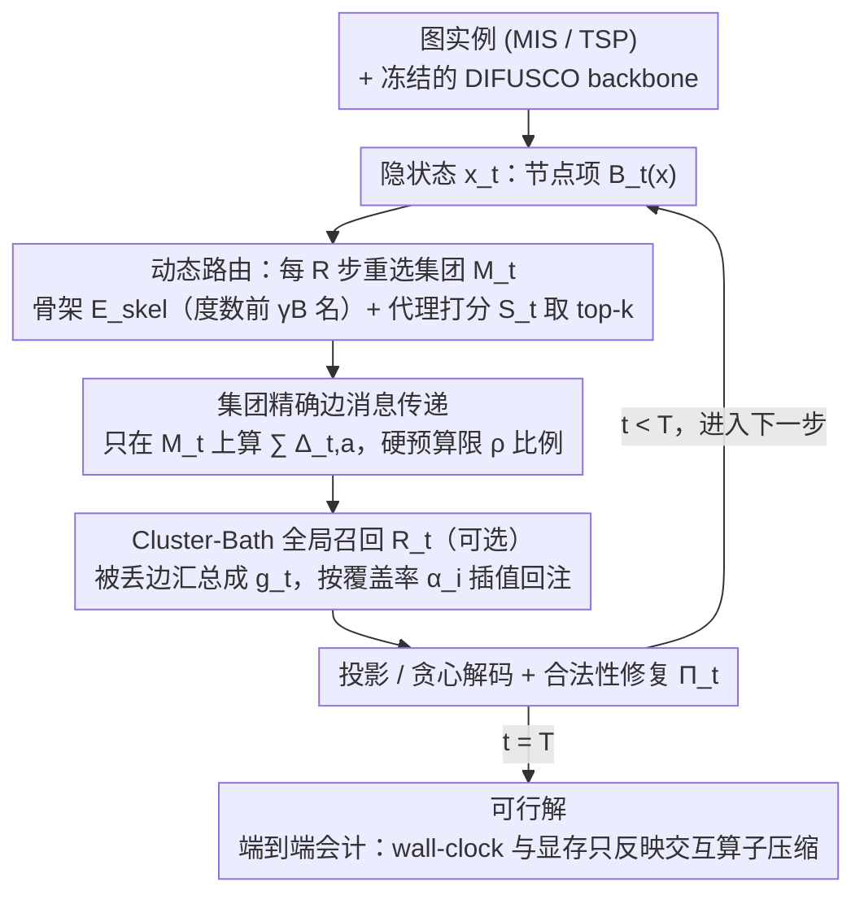

# LoRe: Adaptive Interaction-Evaluation Routing with Per-Step Interaction Budgets for Iterative Graph Solvers

**会议**: ICML 2026  
**arXiv**: [2605.29005](https://arxiv.org/abs/2605.29005)  
**代码**: 待确认  
**领域**: 组合优化 / 扩散式神经求解器 / 推理加速  
**关键词**: 每步交互预算、动态路由、Cluster-Bath 分解、训练免修、MIS/TSP

## 一句话总结
LoRe 把凝聚态物理里的「集团 + 浴场」分解搬到扩散式图组合优化求解器，做成训练免修的推理时包装器，在每一步只评估固定比例的高冲突边并用一个 $\mathcal{O}(N)$ 的全局召回项补偿被丢弃的部分，让 MIS 求解突破 baseline OOM 上限 $3\times$、单卡跑 $n=50\mathrm{k}$ 实例，TSP $n=1000$ 上拿到 $\sim 15\times$ 加速和 $44\times$ 显存压缩。

## 研究背景与动机

**领域现状**：DIFUSCO、DiffUCO、T2TCO、COExpander 等扩散式 / GNN 式神经求解器把 CO（Maximum Independent Set、TSP 等）当作图上的迭代去噪过程，反复在密集交互集 $\mathcal{A}$（MIS 的所有边、TSP 的候选移动）上做消息传递来消解冲突，是当前可学习 CO 求解器的主流路线。

**现有痛点**：这类求解器的代价是 $\mathcal{O}(T|\mathcal{A}|)$，且 **每一步的峰值显存与 $|\mathcal{A}|$ 线性相关**。在工业级实例（$n \ge 20\mathrm{k}$ 的 ER 图，或 $n \ge 500$ 的稠密 TSP）上，单步密集消息传递直接撞 GPU 上限，要么 OOM、要么延迟不可接受；而调度、网络分配这种"anytime"场景要的是按延迟和显存预算挤出可行解。

**核心矛盾**：降步数（蒸馏、Fast-T2T）只动 $T$，**不降单步峰值显存**；静态空间稀疏化（固定 kNN 候选图、固定 mask）能压单步开销，但 CO 求解的「冲突热点」会随轨迹漂移——一旦某条本轮关键的边被永久剪掉，截断误差就会逐步累积、轨迹彻底跑偏。换言之，**单步预算约束**和**支撑集随时间漂移**这两件事必须一起处理。

**本文目标**：把"每一步只算 $|\mathcal{A}|$ 的固定比例 $\rho$"作为硬约束写进求解器循环，同时保证：(a) 不重训 backbone、(b) 解的质量不掉、(c) 全程端到端 wall-clock 可审计。

**切入角度**：作者注意到这个困境结构上和强关联凝聚态的多体问题同构——Cluster Dynamical Mean-Field Theory（C-DMFT）把无限格点的相互作用拆成一个"精确求解的局部集团"和一个"近似补偿的均场浴场"。CO 求解里也存在天然的集团（高冲突邻域）和浴场（稳定的背景关系），可以照搬这个算法蓝图。

**核心 idea**：用一个时变子集 $M_t \subseteq \mathcal{A}$ 当作集团做精确边消息传递，用一个 $\mathcal{O}(N)$ 的覆盖率加权全局信号当作浴场补偿被丢弃的边，**靠每 $R$ 步刷新一次的代理打分动态追踪漂移的热点**。

## 方法详解

### 整体框架
作者把迭代求解器形式化为离散动力系统 $x^{t+1} = \Pi_t\big(\mathcal{T}_t(x^t; \mathcal{A})\big)$，其中 $x^t \in \mathbb{R}^{n \times d}$ 是 $n$ 个变量的隐状态，$\Pi_t$ 是轻量的投影/修复/解码，$\mathcal{T}_t$ 是消息传递主算子，可拆成节点项 $\mathcal{B}_t(x)$ 和边交互项 $\sum_{a \in \mathcal{A}} \Delta_{t,a}(x)$。LoRe 不改 backbone 参数和总步数 $T$，只把第二项替换为预算受限的版本 $\tilde{\mathcal{T}}_t(x; M_t, g_t) = \mathcal{B}_t(x) + \sum_{a \in M_t} \Delta_{t,a}(x) + \mathcal{R}_t(x; g_t)$，约束 $|M_t| \le B = \lfloor \rho |\mathcal{A}| \rfloor$。整条 pipeline 三件套：动态路由选 $M_t$、可选全局召回 $\mathcal{R}_t$、共享的投影/贪心解码 $\Pi_t$。所有对比变体共用同一份 DIFUSCO checkpoint 和同一套 $\Pi_t$，因此报告的端到端加速完全来自单步交互算子被压缩。

### 关键设计

**1. 动态路由（集团选择）：用每 $R$ 步刷新的代理打分追着漂移的冲突热点走**

静态 kNN 或固定 mask 的致命伤是把支撑集焊死，而 CO 求解的冲突热点会沿扩散轨迹漂移，一旦本轮关键的边被永久剪掉，截断误差就累积、轨迹跑偏。LoRe 的集团 $M_t$ 因此分两块来选：一个固定小骨架 $E_{\mathrm{skel}}$ 按度数 $\deg(i)+\deg(j)$ 取前 $\lfloor\gamma B\rfloor$ 名，保证结构性关键边一直在场；剩下的预算交给代理打分 $S_t$ 在 $E\setminus E_{\mathrm{skel}}$ 上取 top-$(B-|E_{\mathrm{skel}}|)$。MIS 的打分把"端点不确定"和"时间不稳定"两件事合到一起：

$$S_t\big((i,j); x^t, x_{\text{prev}}\big)=u_i u_j+\lambda_{\mathrm{stab}}\big(|x^t_i-x_{\text{prev},i}|+|x^t_j-x_{\text{prev},j}|\big),$$

其中节点不确定性 $u_i=1-|2x^t_i-1|$ 在 $x^t_i=1/2$（最举棋不定）时最大、在已决定的节点上趋近 0。为了摊薄打分开销，$M_t$ 每 $R$ 步才重选一次。这样既锁住"还没收敛的麻烦区域"、又给已稳定的边放假，把硬预算 $B=\lfloor\rho|\mathcal{A}|\rfloor$ 用在刀刃上——这也正是论文论证"动态 > 静态"的关键机制。

**2. Cluster-Bath 全局召回（可选稳定项）：用一个 $\mathcal{O}(N)$ 的背景场补偿被丢弃的边**

纯路由在超低预算下会"丢上下文"：被剔除的 $\mathcal{A}\setminus M_t$ 上的交互一概不算，集团子图就被孤立、轨迹漂移。LoRe 借 C-DMFT 里"浴场"的思路加一个廉价补偿项——先从被剔除的交互汇总出全局信号 $g_t=\text{Pool}_t(x^t;\mathcal{A}\setminus M_t)$，再用覆盖率插值把它注回每个节点：$U_t([x^t,g_t])_i=\alpha_i x^t_i+(1-\alpha_i)g_{t,i}$，其中 $\alpha_i=d_i(M_t)/d_i(\mathcal{A})$ 是节点 $i$ 被精确评估的邻边占比——精确覆盖越高就越信自己、否则越倾向背景场。它不需训练、只多缓存一张张量，可关可开；在 $\rho$ 很小时能把误差界里的浴场残差 $\|r_t\|$ 压下去而不引入任何额外算子评估。论文主表特意关掉它以隔离纯路由的贡献，但在 ultra-low 预算下推荐打开。

**3. 可审计的端到端会计协议：把加速比锁死在"交互算子被压缩"这一项上**

CO 加速论文常见的注水手法是"压了 GNN 算子却放任后处理膨胀"，导致加速比不可比。LoRe 干脆把会计协议本身当成一个设计：所有变体（baseline、静态稀疏、LoRe）共享同一份 DIFUSCO 实现、同一套贪心解码 + 任务级合法性修复（TSP 还含标准 2-opt），LoRe 只改单步活跃交互集 $M_t$，于是 wall-clock 比和显存比 = base/LoRe 直接、且仅仅反映交互算子被压缩的收益。配套给出 informal 误差界 $e_{t+1}\le L_t e_t+\|\delta_t\|$、$\|\delta_t\|\le\epsilon_t(\rho)+\|r_t\|$：因为高影响边都被装进集团，路由保证 $\epsilon_t(\rho)$ 是小量，实测累计误差不爆炸。统一会计 + 共享 $\Pi_t$ 让对比 apples-to-apples，也让"加速完全来自交互预算"这个 claim 真正可证伪。

### 损失函数 / 训练策略
LoRe 是 inference-time wrapper，**完全不改训练流程**：backbone 用原始 DIFUSCO/COExpander 的预训练权重，超参只有预算比 $\rho$、骨架占比 $\gamma$、刷新间隔 $R$、稳定项系数 $\lambda_{\mathrm{stab}}$，论文用一组未调的默认配置就跑遍全部实验。

## 实验关键数据

### 主实验
硬件 NVIDIA RTX PRO 6000（96 GB），全部计时含解码 + 修复。ER 图 MIS（$p=0.05$）规模扩展见下表（base = DIFUSCO，LoRe/base 越小越好；Retention 是解质量比，$\ge 1$ 表示不输 baseline）：

| 任务 | 规模 $n$ | 时间 LoRe/base (s) | 显存 LoRe/base (GB) | 显存压缩 | 加速 $\times$ | 解质量保持 |
|------|--------|--------------------|---------------------|----------|---------------|------------|
| MIS  | 1k     | 7.9 / 17.3         | 0.07 / 0.42         | 5.7$\times$ | 2.19±0.03    | 0.815±0.048 |
| MIS  | 3k     | 18.6 / 149         | 0.35 / 3.51         | 10.0$\times$ | 8.03±0.03   | 0.835±0.017 |
| MIS  | 8k     | 124 / 1030         | 2.15 / 24.7         | 11.5$\times$ | 8.28±0.12   | 1.019±0.014 |
| MIS  | 15k    | 442 / 3604         | 7.32 / 86.7         | 11.9$\times$ | 8.16±0.04   | 1.010±0.013 |
| MIS  | 20k    | 767 / **OOM**      | 12.9 / **OOM**      | –           | –             | – |
| MIS  | 50k    | 4949 / **OOM**     | 79.5 / **OOM**      | –           | –             | – |
| TSP  | 500    | 0.72 / 3.61        | 0.05 / 1.23         | 24.6$\times$ | 5.10±0.39   | 0.953±0.014 |

baseline 在 $n=20\mathrm{k}$ 就 OOM，LoRe 一路扛到 $n=50\mathrm{k}$ 且峰值显存仅 79.5 GB，相当于把可行推理边界推远 $\ge 3\times$。在 $n \ge 5\mathrm{k}$ 区间解质量保持比反超 1，说明动态预算并不只是省，反而稳定了大规模轨迹。

### 消融与机理实验

| 配置 | 关键观察 | 解释 |
|------|---------|------|
| LoRe vs static kNN（相同预算 $\rho$） | LoRe 在所有 $n$ 上严格更好 | 静态支撑漏掉漂移热点，截断误差累积 |
| LoRe vs static + greedy refresh | LoRe 仍占优 | 仅靠贪心刷新而不带不确定/不稳定打分不够 |
| 关掉全局召回（默认配置） | 主表性能稳 | 纯路由本身已足够，召回是 ultra-low $\rho$ 的额外保险 |
| TSP 拓扑迁移（不同图分布、零样本） | tour 质量与 baseline 相当 | 路由按 state 选边，对训练-测试拓扑漂移天然鲁棒 |

### 关键发现
- **动态 > 静态** 在匹配预算下是被严格验证的，而不是直觉宣称——这是论文最硬核的一条 message，也解释了为什么神经 CO 不能照搬 LK 的固定候选边思路。
- **质量比在大 $n$ 反超 1**：大概率是因为 dense 评估在大图上本身就过拟合到噪声，LoRe 的预算约束起到了 implicit regularizer 的作用。
- **超参基本不敏感**：单一未调配置走完 MIS+TSP，配合可关闭的全局召回，说明这条思路对部署友好。

## 亮点与洞察
- **物理类比落地为工程蓝图**：作者明确声明 LoRe 不是和量子系统数学等价，只是借 C-DMFT 的"局部精确 + 全局近似"决策模式，避免了"物理类比当装饰"的常见毛病，类比直接对应到算法的三件套。
- **可审计的端到端会计**是这篇论文最容易被同行复刻 / 借鉴的部分——所有 CO 加速工作都该这样跑，否则加速比都不可比。
- **drop-in wrapper 的工程含义**：不动 checkpoint、不改 horizon 就能把 OOM 边界推远 3 倍，对部署型 CO 服务（实时调度 / 网络分配）几乎是免费午餐。

## 局限与展望
- 加速结论目前主要在 DIFUSCO 系下验证；T2TCO、COExpander 给了 transfer 演示但范围有限，能否扩展到 RL-based 或非扩散 GNN 求解器还需要更多证据。
- 打分函数 $S_t$ 是任务相关的（MIS / TSP 各自手工设计），如果换到 MaxCut、SAT 这种约束结构不同的问题，需要重新调代理。
- 误差界是 informal 的局部 Lipschitz 假设，没给出在何种图族上 $\epsilon_t(\rho)$ 一定可控的形式化定理；这条数学补全是显然的后续。
- 全局召回项 $\mathcal{R}_t$ 在 ultra-low $\rho$ 下的实际增益论文只在 appendix 简略提及，主表未充分凸显。

## 相关工作与启发
- **vs DIFUSCO / DiffUCO / Sanokowski et al.**：本文不替代它们，是把它们当 backbone 套一层运行时路由；这种"模型不动、推理变聪明"的做法比再训一个变体更 deployment-friendly。
- **vs Fast-T2T / 蒸馏类**：那条线压总步数 $T$，本文压单步算子，两条路正交，可叠加。
- **vs 静态空间稀疏（候选图 / 固定 mask / LK 候选边）**：核心区别是 **时变 vs 永久**——静态的「永久剪掉」会丢漂移的热点，本文用预算约束 + 动态打分把决策推迟到运行时。
- **vs LNS / destroy-repair 外循环**：那类工作把"重优化邻域"作为外层 procedure，本文把预算约束塞进求解器内循环每一步，整合点更深、不引入额外外层。

## 评分
- 新颖性: ⭐⭐⭐⭐ 把 C-DMFT 思路系统化到神经 CO 求解器是首次，技术拼装本身（动态 top-k + 覆盖率插值）不算激进，但组合 + 落地角度新。
- 实验充分度: ⭐⭐⭐⭐ MIS 全规模扫到 OOM 边界、TSP 跨规模 + 拓扑迁移、消融对比静态/贪心都到位；缺其他求解器 backbone（如非扩散）的 transfer 证据。
- 写作质量: ⭐⭐⭐⭐ 误差界、会计协议、物理类比的边界都清楚地区分了 claim 和直觉，少见的严谨。
- 价值: ⭐⭐⭐⭐ 对部署型神经 CO 是接近免费午餐的工程红利；学术上把"预算约束放在解算子层"这件事彻底形式化了。

<!-- RELATED:START -->

## 相关论文

- [\[ICML 2026\] On the Interaction of Batch Noise, Adaptivity, and Compression, under $(L_0,L_1)$-Smoothness: An SDE Approach](on_the_interaction_of_batch_noise_adaptivity_and_compression_under_l_0l_1-smooth.md)
- [\[ICML 2026\] Adaptive Sharpness-Aware Minimization with a Polyak-type Step size: A Theory-Grounded Scheduler](adaptive_sharpness-aware_minimization_with_a_polyak-type_step_size_a_theory-grou.md)
- [\[ICLR 2026\] FrontierCO: Real-World and Large-Scale Evaluation of Machine Learning Solvers for Combinatorial Optimization](../../ICLR2026/optimization/frontierco_real-world_and_large-scale_evaluation_of_machine_learning_solvers_for.md)
- [\[ICLR 2026\] Beyond the Heatmap: A Rigorous Evaluation of Component Impact in MCTS-Based TSP Solvers](../../ICLR2026/optimization/beyond_the_heatmap_a_rigorous_evaluation_of_component_impact_in_mcts-based_tsp_s.md)
- [\[ICML 2026\] Distribution-Free Uncertainty Quantification for Continuous AI Agent Evaluation](distribution-free_uncertainty_quantification_for_continuous_ai_agent_evaluation.md)

<!-- RELATED:END -->
