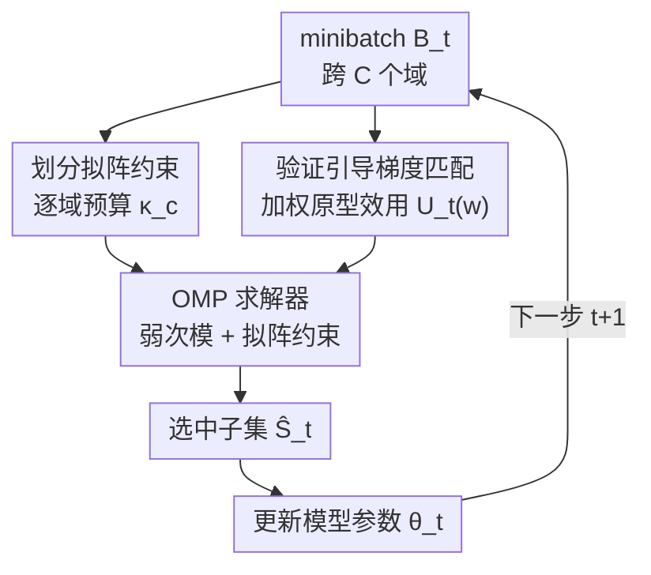

# Minibatch Selection via Partition Matroid Constrained Gradient Matching

**会议**: ICML2026  
**arXiv**: [2606.07954](https://arxiv.org/abs/2606.07954)  
**代码**: 已开源（论文 "Code is available here"，链接以原文为准）  
**领域**: 优化 / 数据选择  
**关键词**: minibatch 选择, 划分拟阵, 梯度匹配, 弱次模, 数据混合

## 一句话总结
PartitionSel 把「跨域 minibatch 选择」建模成在**划分拟阵约束**（逐域预算）下最大化一个**验证引导的加权梯度匹配效用**，证明该目标单调且弱次模、可用正交匹配追踪（OMP）求解并带近似保证，从而在不训练任何代理模型的前提下，于每一步训练在 batch 级诱导出隐式的数据混合，减少跨域冗余与梯度冲突。

## 研究背景与动机
**领域现状**：用更大的 minibatch 训练 LLM 能加快收敛、提升性能，但显存开销巨大。于是近年流行「在每个 minibatch 内只选一小撮有价值的样本来训」，省显存。选样本通常靠影响函数、梯度匹配（CRAIG、GradMatch、GREATS）或分布匹配。

**现有痛点**：当训练数据跨多个异构域（如数学 + 分子指令）时问题更难。现有做法两条路都不理想：一是**逐域独立选**——在每个域内各选各的，忽略了跨域样本之间的冗余；二是**连续域权重**法（DoReMi、RegMix、CLIMB）——学一组连续的域混合权重，但往往要**训练昂贵的代理模型**来预测下游表现，还得保证代理模型忠实镜像主模型的优化轨迹，工程上既贵又不可靠。

**核心矛盾**：「逐域独立选」简单但产生跨域冗余、batch 内梯度互相冲突；「连续混合权重」表达力强但要额外代理模型与优化回路。两者之间缺一个**既能跨域耦合、又不需代理模型**的中间方案。

**本文目标**：在 batch 级、用离散组合的视角做域感知的样本选择——把逐域容量直接编码成约束，让不同域的样本在**同一个效用**下联合竞争，既奖励「与本域信号对齐」，也奖励「与其它域已选样本不冗余」。

**切入角度**：作者观察到 GREATS 的选择规则虽是贪心，但其目标**非单调**（加入一个元素可能让目标变小）、且作者自己也只是猜测它「可能」是弱次模——缺乏近似保证。给每个样本配一个**非负重要性权重**就能补上这个缺口。

**核心 idea**：用**划分拟阵约束**编码逐域预算 + **加权原型梯度匹配效用**，把问题变成一个**单调、弱次模**的最大化问题，从而能用 OMP 高效求解并享有近似保证；GREATS 恰是它把权重限制为二值时的特例。

## 方法详解

### 整体框架
标准训练里，每步 $t$ 模型收到一个 minibatch $B_t \subseteq D_{tr}$，并能访问一个小验证集 $D_{val}$。数据跨 $C$ 个域，$B_t = \biguplus_{c=1}^{C} B_t^c$。PartitionSel 不学全局域权重，而是在 batch 级局部地优化数据混合：在每步从 $B_t$ 里选一个子集 $S_t$，在**逐域预算** $\{\kappa_t^c\}$（满足 $\sum_c \kappa_t^c = \kappa$）下最大化一个时变效用 $U_t(S)$：

$$\max_{S \subseteq B_t} U_t(S) \quad \text{s.t.} \quad |S \cap B_t^c| \le \kappa_t^c \;\; \forall c$$

这个约束**正是一个划分拟阵**——把地面集按域划成不相交块、每块带容量。整条 pipeline 是一个每步循环：收 minibatch → 按域设预算、建划分拟阵 → 形成聚合效用 → 用 OMP 在拟阵约束下选支撑集 → 用所选子集更新模型。

### 关键设计

**1. 划分拟阵约束：把逐域预算变成天然的组合约束，让跨域样本在同一效用下竞争**

直接对着「逐域独立选会跨域冗余」这个痛点。作者把每个域的容量 $\kappa_t^c$ 编码成地面集 $B_t$ 上的一个划分拟阵 $M_t = (B_t, I_t)$，其独立集恰好是 $\{S : |S \cap B_t^c| \le \kappa_t^c \,\forall c\}$。妙处在于：**预算完全由拟阵独立性强制**，无需在权重 $w$ 上再加显式稀疏约束——因为 $S \in I(M_t)$ 配上 $\text{supp}(w) \subseteq \bar{A}$ 已经逼出 $\|w_{B_t^c}\|_0 \le \kappa_t^c$。这样组合结构只留在外层的拟阵选择上，内层求权重是个干净的凸问题。预算可按域大小比例分配 $\kappa_t^c = \lfloor \kappa |B_t^c| / |B_t| \rceil$，相当于在 batch 级诱导出一个数据混合，却完全不用代理模型或连续权重优化。

**2. 验证引导的加权原型效用：给样本配非负权重，把目标从「非单调」修成「单调弱次模」**

这是全文的理论支点，对着 GREATS 目标「非单调、近似保证缺失」的痛点。效用衡量的是「用所选子集做一步 SGD 后，验证损失能降多少」。对单个验证样本，边际增益经两次一阶 Taylor 展开近似为：

$$\Delta U_t(z_i | S) \approx \eta_t \langle g_{\theta_t}(z_i), g_{\theta_t}(z_{val})\rangle - \eta_t^2 \langle g_{\theta_t}(z_i), H_{z_{val}}(\theta_t)\textstyle\sum_{z\in S} g_{\theta_t}(z)\rangle$$

第一项是样本对验证信号的「重要性分」（与验证梯度对齐越好越高），第二项是 Hessian 加权的与已选样本相似度（被减掉，促进多样性、抑制冗余）。GREATS 直接用这个边际增益做贪心，但它**可能为负**（候选梯度近正交于验证梯度、却高度相关于已选集时），导致目标非单调。PartitionSel 的关键改造是引入非负权重 $w$，把效用写成加权原型形式：

$$U_t(w) = \langle w, \mu_{\theta_t}\rangle - \tfrac{\eta_t}{2}\langle w, K_{\theta_t} w\rangle, \quad K_{\theta_t} = G_{\theta_t} G_{\theta_t}^\top$$

其中 $G_{\theta_t}$ 是 batch 内逐样本梯度矩阵、$\mu_{\theta_t}$ 含验证梯度项。集合效用 $f(S)$ 定义为在 $\text{supp}(w)\subseteq S$ 上对 $w \ge 0$ 取最大。由于 LLM 梯度维度远高于 batch 大小（$d \gg |B_t|$），Gram 矩阵 $K_{\theta_t} \succ 0$，内层是严格凹的凸问题、有唯一解。作者证明 $f_M(\cdot)$ **单调**（Lemma 5.1，任意元素边际增益非负）且 **$\gamma$-弱次模**（Lemma 5.4，$\gamma>0$ 直接来自 $K_{\theta_t}\succ 0$ 逼出正的受限强凹常数）。GREATS 则恰是把权重限制为二值 $w\in\{0,1\}$ 时的特例（Remark 4.1）。

**3. 拟阵约束下的 OMP 求解器：弱次模 + 拟阵带来可证近似保证**

有了单调弱次模目标 + 划分拟阵约束，就能用正交匹配追踪（OMP，Algorithm 2）高效求解。从空支撑集出发，每轮：算当前梯度 $g=\nabla_w U_t$，在**收缩拟阵** $M_t/\Re_{i-1}$ 里找一个最大独立集 $M_i$ 使正梯度质量 $\sum_{x\in M_i}\max(0,[g]_x)$ 最大，从中均匀采一个元素加入支撑，再用加速投影梯度上升（APGA）重解权重 $w_{\Re_i}=\arg\max_{w\ge0}U_t(w)$ 并刷新梯度，跑 $\kappa$ 轮。单轮成本 $O(N+\tau M)$，总成本 $O(\kappa(N+\tau M))$。理论保证（Theorem 5.5）：

$$\mathbb{E}[f_M(\hat{S}_t)] \ge (1+\widetilde{C}_1/c_{2\kappa})^{-2} f_M(S^*)$$

其中 $c_{2\kappa}$ 是 $2\kappa$-稀疏域上的受限强凹常数、$\widetilde{C}_1$ 是受限光滑常数；近似因子对学习率 $\eta_t$ 不变（两常数都随 $\eta_t$ 线性缩放、相消）。这正是 GREATS 缺的那块——一个对所选子集质量的可证下界。

**4. 离散选择到连续数据混合的桥梁：PartitionSel 是 DoReMi 的离散代理**

作者进一步指出 PartitionSel 在每步选中的子集 $\hat{S}_t$ 本身就**诱导出一个隐式域混合**：定义 $\alpha^{\text{DOMW}}_{c,t} = |\hat{S}_t \cap V_c| / |\hat{S}_t|$，即所选样本里各域的经验占比。DoReMi 用 group-DRO 代理模型解一个 minimax 把高超额损失的域上调权得到连续混合 $\bar\alpha$；PartitionSel 则用纯离散的样本级选择逼近这同一信息，无需任何代理模型。这给「离散子集选择」与「连续重加权」之间架了一座原理性的桥，把两条原本割裂的技术路线统一在 batch 级。

## 实验关键数据

### 主实验
在 Qwen2.5-3B 上微调（MetaMathQA 子集占比 50%），数学推理 benchmark 平均准确率（Avg）对比：

| 方法 | NumGLUE | MMLU-Math | GSM8K | SimulEq | AQuA | SAT | Avg |
|------|---------|-----------|-------|---------|------|-----|-----|
| Random | 0.5704 | 0.5332 | 0.7771 | 0.5027 | 0.6086 | 0.6594 | 0.6014 |
| COLM | 0.5988 | 0.5503 | 0.7627 | 0.5156 | 0.5827 | 0.6864 | 0.6119 |
| GREATS | 0.5873 | 0.6109 | 0.7892 | 0.5000 | 0.6142 | 0.6727 | 0.6240 |
| ID（独立选） | 0.5960 | 0.5965 | 0.7771 | 0.5117 | 0.5866 | 0.7182 | 0.6263 |
| IWD（独立软权重） | 0.6115 | 0.5795 | 0.7699 | 0.5218 | 0.5980 | 0.6818 | 0.6225 |
| **PartitionSel** | 0.5998 | 0.6099 | 0.7665 | **0.5467** | **0.6220** | **0.7545** | **0.6363** |

PartitionSel 平均 0.6363，超过 GREATS（0.6240）、ID（0.6263）、COLM（0.6119）等强基线，尤其在 SimulEq、AQuA、SAT 等需要跨域协同的子任务上领先明显。

### 域内任务（Mol-Instructions）与梯度冲突分析
在 Mol-Instructions（$|\hat{S}_t|=128$，BLEU↑ / Edit-distance↓）上，PartitionSel 在多数子任务与平均上同样领先：

| 方法 | 子集 12.5% Avg (BLEU/Edit) | 子集 25% Avg (BLEU/Edit) | 说明 |
|------|---------------------------|--------------------------|------|
| GREATS | 0.61 / 31.63 | 0.62 / 30.84 | 单效用、非单调 |
| ID | 0.62 / 31.04 | 0.61 / 30.95 | 逐域独立硬选 |
| IWD | 0.62 / 31.32 | 0.63 / 31.07 | 逐域独立软权重 |
| **PartitionSel** | **0.63 / 31.02** | **0.66 / 29.71** | 跨域耦合 + 拟阵约束 |

### 关键发现
- **跨域耦合 > 逐域独立选**：PartitionSel 一致优于 ID / IWD（两种逐域独立基线），说明把不同域样本放进**同一个效用**下联合竞争、惩罚跨域冗余，确实比各域各选各的更优。
- **减少 batch 内梯度冲突**：作者用「梯度夹角余弦为负」定义冲突对（$\langle g_i, g_j\rangle < 0$）。PartitionSel 降低了每个 batch 内的冲突梯度对数量，表明跨域耦合转化成了**更兼容的训练更新**——这是性能增益的机理性证据，而非只是分数好看。
- **离散选择可逼近连续混合**：PartitionSel 诱导的域占比 $\alpha^{\text{DOMW}}$ 与 DoReMi 的连续混合 $\bar\alpha$ 行为相近，log-pplx 曲线显示它能在不训代理模型的情况下达到与 DoReMi 可比的效果。
- **GREATS 是二值特例**：把权重限制为 0/1 即退回 GREATS 的选择规则，但失去单调性与近似保证；引入非负权重后两者皆补齐。

## 亮点与洞察
- **用「划分拟阵」给逐域预算找到了恰当的数学外衣**：拟阵独立性天然蕴含逐域容量约束，省去了在权重上加显式稀疏约束的麻烦，把组合难度全压到外层、内层留成干净凸问题——这是个很优雅的建模选择。
- **「加权原型」一招同时解决两个问题**：非负权重既把 GREATS 的非单调目标修成单调弱次模（带来近似保证），又把硬子集选择松弛成软加权（表达力更强），一举两得。
- **梯度冲突计数是很有说服力的机理证据**：不止比终点分数，还直接量化「跨域耦合是否真的让更新更兼容」，把「为什么有效」落到了可观测的梯度几何上。
- **在离散选择与连续混合之间架桥**：把 GREATS（离散）与 DoReMi（连续）统一在 batch 级，给「要不要训代理模型」这个长期权衡提供了一个无代理的折中点，思路可迁移到任何域感知数据配比场景。

## 局限与展望
- **效用基于一阶 Taylor 近似**：边际增益的推导用了两次一阶展开并把 Hessian 近似为单位阵（沿用 GREATS），在大学习率或强非线性区间近似误差可能放大，论文未深入刻画。
- **每步要算逐样本梯度 + 解内层凸问题**：虽然有 memory-efficient 的梯度特征构造，OMP 每轮还要跑 APGA，单步开销 $O(\kappa(N+\tau M))$ 仍高于朴素随机采样，超大 batch 下的实际吞吐代价值得关注。
- **域划分需预先给定**：方法假设数据已按 $C$ 个域划好、预算按域大小比例分配，对「域边界模糊」或「最优配比远偏离域大小比例」的场景，固定的比例分配可能不是最优。
- **实验规模相对有限**：主要在 Qwen2.5-3B / Llama-3 + MetaMathQA / Mol-Instructions 上验证，更大模型、更多域、预训练（而非微调）场景下的表现仍待检验。

## 相关工作与启发
- **vs GREATS**：GREATS 是单一整体效用的贪心选择，但目标非单调、只猜测「可能弱次模」、无近似保证；PartitionSel 引入非负权重后证明单调 + 弱次模 + 带近似界，并把 GREATS 收为二值特例。
- **vs ID / IWD（逐域独立选）**：这两者在每个域内各自选（硬/软），忽略跨域冗余；PartitionSel 用同一效用跨域耦合，减少冗余与梯度冲突，实验上一致更优。
- **vs DoReMi / RegMix / CLIMB（连续混合）**：这类方法学连续域权重但需训代理模型或额外优化回路；PartitionSel 在 batch 级诱导隐式离散混合，无代理模型，且被证明可逼近 DoReMi 的连续混合。
- **vs CoLM / GradMatch / CRAIG（梯度匹配 coreset）**：共享梯度匹配哲学，但 PartitionSel 把逐域选择通过单一验证引导效用 + 划分拟阵约束耦合起来，是把 coreset 思想搬到「跨域 batch 级」并补上理论保证。

## 评分
- 新颖性: ⭐⭐⭐⭐ 划分拟阵编码逐域预算 + 加权原型把 GREATS 修成单调弱次模，是干净且有理论支撑的新建模角度。
- 实验充分度: ⭐⭐⭐⭐ 两模型两数据集、对比多类强基线，并用梯度冲突计数佐证机理；但规模偏小、未覆盖预训练。
- 写作质量: ⭐⭐⭐⭐ 形式化严谨、引理定理链完整，把离散/连续两条线讲清；符号偏密，工程细节多在附录。
- 价值: ⭐⭐⭐⭐ 给「无代理模型的域感知数据选择」提供了带保证的实用方案，对异构数据 LLM 微调有直接参考价值。

<!-- RELATED:START -->

## 相关论文

- [\[ICML 2026\] Automatic Unsupervised Ensemble Outlier Model Selection–Extended Version](automatic_unsupervised_ensemble_outlier_model_selection--extended_version.md)
- [\[ICML 2026\] Utility-Diversity Aware Online Batch Selection for LLM Supervised Fine-tuning](utility-diversity_aware_online_batch_selection_for_llm_supervised_fine-tuning.md)
- [\[CVPR 2025\] Towards Stable and Storage-efficient Dataset Distillation: Matching Convexified Trajectory](../../CVPR2025/optimization/towards_stable_and_storage-efficient_dataset_distillation_matching_convexified_t.md)
- [\[ICLR 2026\] Adaptive Acquisition Selection for Bayesian Optimization with Large Language Models](../../ICLR2026/optimization/adaptive_acquisition_selection_for_bayesian_optimization_with_large_language_mod.md)
- [\[ICLR 2026\] Πnet: Optimizing Hard-Constrained Neural Networks with Orthogonal Projection Layers](../../ICLR2026/optimization/pinet_optimizing_hard-constrained_neural_networks_with_orthogonal_projection_lay.md)

<!-- RELATED:END -->
