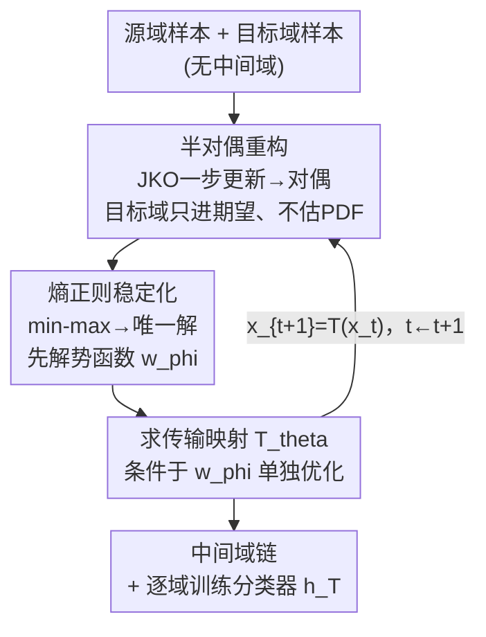

# Rethinking the Flow-Based Gradual Domain Adaptation: A Semi-Dual Optimal Transport Perspective

**会议**: ICML2026  
**arXiv**: [2602.01179](https://arxiv.org/abs/2602.01179)  
**代码**: 待确认  
**领域**: 优化 / 最优传输 / 渐进域适应  
**关键词**: 渐进域适应, 半对偶最优传输, 梯度流, 熵正则, 对抗训练稳定性

## 一句话总结
把"用流模型造中间域"的渐进域适应（GDA）重写成熵正则化的半对偶非平衡最优传输（E-SUOT）问题，**绕开对目标域概率密度（PDF）的显式估计**，直接学一串把源域样本逐步推到目标域的传输映射，在 Portraits / MNIST-rot / Office-Home 上稳定超过现有 GDA/UDA 方法。

## 研究背景与动机

**领域现状**：无监督域适应（UDA）要把源域知识迁到无标签目标域；当源-目标分布差距很大时，一次性对齐（one-shot alignment）容易把可分性搞坏、还会在自训练里放大伪标签错误。于是有了**渐进域适应（GDA）**：在源域和目标域之间插入一串中间域 $p_0,p_1,\dots,p_T$，让分类器顺着这条路一小步一小步迁过去。GDA 的核心子问题是**怎么造中间域**，主流是流（flow）方法——沿一条连续路径演化分布、保持概率质量不丢，天然适合做插值。

**现有痛点**：标准流方法（梯度流）要造速度场 $v_t=-\nabla\frac{\delta\mathbb{D}[p(x_t),p_T]}{\delta p}$ 来驱动样本，而这个速度场依赖**目标域 PDF 的显式估计**。例如 Zhuang 等用 score matching 估出目标密度再跑 Langevin 动力学。但从有限样本估 PDF 是个**病态（ill-posed）问题**：一旦估歪，流会把样本推进低密度区，生成的"中间域"和真实目标对不上，下游分类直接遭殃。作者用一个对照实验把这点摆明：EstTrans（先估密度再传输）到真实目标的 2-Wasserstein 距离 $\mathcal{W}_2^2\approx 9.7$，而直接学传输映射的 DirTrans 只有 $\approx 7.8\times10^{-4}$，差了四个数量级。

**核心矛盾**：流方法要"造中间域"，却被卡在"先得估准目标密度"这一步上——而密度估计恰恰是最不可靠的环节。

**本文目标**：(1) 不估目标 PDF 也能造中间域；(2) 造出来的中间域要鲁棒、稳定；(3) 真能提升 GDA 精度。

**切入角度**：作者注意到一个已知等价关系——对 $f$-散度梯度流做前向 Euler 离散，等价于解一个**以 Wasserstein 距离为正则项的优化问题**（式 4 的 JKO 型一步更新）。既然如此，与其"估密度→算速度场→演化"，不如**直接解这个优化问题**，让样本被优化目标拉向目标域。

**核心 idea**：把流式 GDA 重写成**半对偶最优传输**——通过对偶把目标分布 $p_T$ 只以期望形式出现（可用蒙特卡洛近似，无需密度），再加**熵正则**把不稳定的 min–max 对抗变成可唯一求解、可顺序优化的稳定问题。

## 方法详解

### 整体框架
E-SUOT 的输入是带标签的源域样本和无标签的目标域样本，输出是一串传输映射 $\mathcal{T}=\{\boldsymbol{T}_{\theta,t}\}_{t=0}^{T-1}$，把当前域样本 $x_t$ 推到下一个中间域 $x_{t+1}=\boldsymbol{T}_{\theta,t}(x_t)$，最后分类器顺着这条路被逐域训练过去。

整条管线分三步走：先把"JKO 一步更新"这个原问题做对偶，得到**只含期望、不含密度**的半对偶目标（解决"要估 PDF"的痛点）；但半对偶天生是 $\sup$–$\inf$ 对抗结构、不稳定且解不唯一，于是加**熵正则**把它压成一个对势函数 $w$ 唯一可解、且可"先解 $w_\phi$ 再解 $\boldsymbol{T}_\theta$"的顺序优化（解决"对抗不稳"的痛点）；最后把这套单步过程沿 $t=0\to T-1$ 迭代，造出整条中间域链并训练分类器。

### 关键设计

**1. 半对偶重构：把"估目标密度"换成"算期望"**

GDA 流方法最致命的依赖是目标 PDF 的显式估计。作者从 JKO 型一步更新出发（式 4）：

$$p(x_{t+\eta})=\arg\min_{\rho\in\mathcal{P}_2}\frac{1}{2\eta}\mathcal{W}_2^2(\rho,p(x_t))+\mathbb{D}_f[\rho,p_T],$$

这是一个原问题（primal），既要算 Wasserstein 距离又含 $f$-散度，仍然要碰目标密度。Proposition 3.1 把它转成**半对偶**形式（式 7）：

$$\mathcal{L}^{\text{SemiDual}}=\sup_w\,\mathbb{E}_{p(x_t)}\!\Big[\inf_{\boldsymbol{T}}\tfrac{1}{2\eta}\|\boldsymbol{T}(x_t)-x_t\|_2^2-w(\boldsymbol{T}(x_t))\Big]-\mathbb{E}_{p_T(x)}[f^\star(-w(x))],$$

其中 $w$ 是对偶势函数、$\boldsymbol{T}$ 是传输映射、$f^\star$ 是 $f$ 的凸共轭。这一步的妙处在于：**$p(x_t)$ 和 $p_T$ 都只通过期望算子 $\mathbb{E}$ 出现**，不再需要密度值本身。于是可以用蒙特卡洛直接拿样本估这些积分，把 $w$、$\boldsymbol{T}$ 各用一个神经网络 $w_\phi$、$\boldsymbol{T}_\theta$ 参数化即可——彻底甩掉病态的密度估计。

**2. 熵正则化：把不稳定的 min–max 压成有唯一解的顺序优化**

半对偶虽然甩掉了密度，但 $\sup$–$\inf$ 是个对抗目标，训练不稳；更糟的是 Proposition 3.2 证明它**本身解就不唯一**：当目标是两个等距高斯的混合、源在中点时，内层 $c$-变换 $\arg\min_x\{c(x_t,x)-w^\star(x)\}$ 不是单点，传输映射 $\boldsymbol{T}^\star$ 病态。作者的对策是给原问题加一项**熵正则**（相对参考联合分布 $\kappa(x_t,x)=p(x_t)p_T(x)$ 的 KL，式 8），得到熵正则半对偶（式 9）：

$$\mathcal{L}^{\text{E-SemiDual}}=\inf_w\,\mathbb{E}_{p_T}[f^\star(-w(x))]+\epsilon\,\mathbb{E}_{p(x_t)}\Big[\log\mathbb{E}_{p_T}\exp\big(\tfrac{w(x)-\frac{1}{2\eta}\|x-x_t\|_2^2}{\epsilon}\big)\Big].$$

熵正则带来两个质变：一是把内层的 $\inf$ 替换成一个 **log-sum-exp 软最小**，$\sup$–$\inf$ 对抗消失，目标**只依赖单个势 $w$**（Proposition 3.4 保证唯一最优解），训练负担和不稳定性同时下降；二是它把训练拆成**顺序两步**——先单独优化 $w_\phi$（式 9），再**条件于 $w_\phi$** 优化映射 $\boldsymbol{T}_\theta$：

$$\arg\min_\theta\ \tfrac{1}{2\eta}\|x_t-\boldsymbol{T}_\theta(x_t)\|_2^2-w_\phi(\boldsymbol{T}_\theta(x_t)).$$

这正是 E-SUOT 名字的来源（Entropy-regularized Semi-dual Unbalanced OT）。$\epsilon$ 越大越稳但越偏离原解，是稳定性-保真度的旋钮。

**3. 逐域迭代 + 沿路训练分类器：把单步过程串成完整 GDA**

单步只给出 $t\to t+1$ 的一张传输映射，要造整条中间域链得迭代（Algorithm 1）：对每个 $t$，先跑 $\mathcal{E}$ 轮更新 $w_{\phi,t}$（用 mini-batch 的 log-sum-exp 估计式 9），再跑 $\mathcal{E}$ 轮更新 $\boldsymbol{T}_{\theta,t}$，然后用 $x_{t+1}^{(i)}=\boldsymbol{T}_{\theta,t}(x_t^{(i)})$ 把整批样本推进下一域、并存下这张映射；如此 $t=0\to T-1$ 得到映射序列 $\mathcal{T}$。拿到 $\mathcal{T}$ 后，分类器 $h$ 以**阶段式**沿路训练：在每个中间步把 $x_t$ 映到 $x_{t+1}$，用映射后的数据更新 $h_t$，逐步把源分类器 $q_0$ 适配到目标分类器 $h_T$。这一步把"造中间域"和"迁分类器"两件事接成闭环，是 GDA 真正落地的部分。

### 损失函数 / 训练策略
势函数 $w_\phi$ 用式 9 的熵正则半对偶目标优化（含 $f^\star$ 项 + log-sum-exp 项）；映射 $\boldsymbol{T}_\theta$ 用式 10、在 $w_\phi$ 固定下最小化"传输代价 − 势"。$f$-散度默认取 KL（$f(u)=u\log u$，对应 $f^\star$ 为指数型），并理论上讨论了步长 $\eta$ 的选取。理论侧给出两条保证：Proposition 3.5——当 $\mathcal{W}_2(p(x_t),p_T)\le 2\eta$ 时 $\mathbb{D}_f[\rho^\star,p_T]\le\mathcal{W}_2(p(x_t),p_T)$，即随 $t$ 增大传输分布逐步逼近目标；Proposition 3.6——目标域泛化误差被源误差、参考假设逼近差、累积传输/标签连续性代价 $\iota\zeta\mathcal{C}$ 与统计误差 $\mathcal{S}_{\text{stat}}$ 之和上界。

## 实验关键数据

### 主实验
GDA 任务在 Portraits、MNIST 45°、MNIST 60° 上（统一用 Zhuang 等提供的 UMAP 嵌入做公平比较），E-SUOT 全面最优，尤其在旋转更大、难度更高的 MNIST 60° 上拉开差距：

| 数据集 | Source | GGF（流，旧SOTA之一） | STDW | E-SUOT | 相对 Source 提升 |
|--------|--------|------|------|--------|------|
| Portraits | 71.2 | 83.4 | 84.3 | **86.4** | ↑21.5% |
| MNIST 45° | 58.4 | 57.7 | 60.3 | **72.1** | ↑23.4% |
| MNIST 60° | 36.8 | 40.8 | 43.9 | **51.0** | ↑38.6% |

值得注意的是：流方法 CNF、GGF 在 MNIST 45°/60° 上**偶尔还不如 source-only**（如 GGF 在 45° 掉 1.2%），作者认为这正是密度估计不准导致的——与动机分析一致，反向印证 E-SUOT 绕开密度估计的价值。UDA 任务（Office-Home，12 个迁移方向，用 CoVi 做特征 backbone）上 E-SUOT 平均 73.5%，是所有 UDA/GDA baseline 里最高的（CoVi 73.1、CST 72.9、GGF 72.9），且在多数方向拿到最高或次高，作者强调其优势是"跨任务稳定"而非个别方向爆表。

| 方法 | Office-Home Avg. |
|------|------|
| GVB-GD | 70.4 |
| CST | 72.9 |
| GGF | 72.9 |
| CoVi | 73.1 |
| **E-SUOT** | **73.5** |

### 消融实验
在三个 GDA 数据集上，从**训练策略**和 **$f^\star$ 函数选择**两个角度消融（指标为精度%，括号为相对完整模型的相对降幅）：

| 配置 | Portraits | MNIST 45° | MNIST 60° | 说明 |
|------|-----------|-----------|-----------|------|
| **Entropy + KL（完整）** | **86.4** | **72.1** | **51.0** | E-SUOT 本体 |
| Adversarial + KL | 74.8 (↓13.4%) | 52.0 (↓27.8%) | 34.9 (↓31.5%) | 去掉熵正则、退回式7对抗 |
| Barycentric + KL | 83.9 (↓3.0%) | 62.5 (↓13.3%) | 38.3 (↓24.8%) | 先估传输计划再投影 |
| Entropy + SftPls | 80.1 | 59.7 | 38.2 | 换 softplus 共轭 |
| Entropy + χ² | 79.8 | 60.2 | 42.4 | 换 χ² 散度 |
| Entropy + Identity | 81.2 | 59.6 | 39.6 | 换恒等函数 |

### 关键发现
- **熵正则是稳定性的命根子**：去掉它退回对抗训练（Adversarial+KL），三个数据集分别掉 13.4%/27.8%/31.5%，难度越大掉得越狠——实证支持 Proposition 3.2/3.4 关于"对抗解不唯一、熵正则恢复唯一性"的理论。
- **直接学传输 > 先估计划再投影**：Barycentric 投影法虽优于对抗，但仍系统性落后完整模型（MNIST 60° 掉 24.8%），说明端到端学映射比"两步走"更省损耗。
- **$f$-散度选 KL 最稳**：SftPls / χ² / Identity 三种 $f^\star$ 都明显逊于 KL，KL 的指数型共轭与 log-sum-exp 结构最匹配。
- **越难的迁移收益越大**：MNIST 60°（旋转最大、shift 最强）相对 source 提升 38.6%，正是 GDA 渐进策略 + 鲁棒中间域最该发挥作用的场景。

## 亮点与洞察
- **把"造中间域"从估计问题改写成优化问题**：核心洞察是 JKO 一步更新 ≡ Wasserstein 正则优化，于是可以跳过病态的密度估计直接优化，$\mathcal{W}_2^2$ 从 9.7 降到 $7.8\times10^{-4}$ 的对照实验把动机讲得很硬。
- **熵正则一箭三雕**：同时（i）消掉 $\sup$–$\inf$ 对抗、（ii）保证解唯一、（iii）把训练拆成"先 $w$ 后 $T$"的顺序优化降低负担——一个正则项解决了对抗训练的稳定性、可辨识性、计算量三个问题。
- **理论与实验对得上**：Proposition 3.2 预言的"解不唯一"在消融里以"去熵正则即崩"的形式被验证，理论不是摆设。
- **可迁移思路**：凡是"流/扩散里要估目标密度才能算 driving force"的任务（生成、采样、分布插值），都可以试试用半对偶 OT 把密度需求换成期望需求。

## 局限与展望
- **依赖 GDA 标准假设**：作者明确声明继承 GDA 通行假设（如标签函数光滑、域间渐变），不讨论这些假设何时成立；强 shift 但非渐变的场景未覆盖。
- **中间域数目 $T$ 等超参靠预设**：算法把 $T-1$、$\eta$、$\epsilon$ 当输入，论文未系统给出自动选 $T$ 的方法，旋钮调参成本仍在。
- **UDA 上优势偏小**：Office-Home 平均仅比次优高 0.4，多数方向是次优而非最优，规模化到大数据集上的增益空间有待进一步验证。
- **熵正则的偏置**：$\epsilon$ 越大越稳但越偏离原 OT 解，稳定性与保真度之间的 trade-off 如何最优选择，论文给的是经验取值。

## 相关工作与启发
- **vs GGF / CNF（流式 GDA）**: 他们显式估目标密度（score / 归一化流）再驱动样本，本文证明这条路在密度估不准时会崩（甚至不如 source-only）；E-SUOT 用半对偶把密度需求换成期望，绕开估计、更鲁棒。
- **vs GOAT / STDW / AST（其他 GDA）**: 这些方法各有中间域构造/自训练策略，但跨数据集不稳定（在某些任务上次优、某些上退化）；E-SUOT 的卖点是"跨任务一致最优"。
- **vs 经典/神经 OT（半对偶、对抗 OT）**: 本文沿用神经网络参数化对偶势 $w_\phi$ 和映射 $\boldsymbol{T}_\theta$ 的思路，但针对对抗 OT 的不稳定性给出"熵正则→唯一解→顺序优化"的专门修法，并把它嵌进 GDA 的逐域迭代里。

## 评分
- 新颖性: ⭐⭐⭐⭐⭐ 把流式 GDA 重写为半对偶 OT、用熵正则一并解决密度估计与对抗稳定，视角干净且有理论支撑。
- 实验充分度: ⭐⭐⭐⭐ GDA + UDA 双任务、消融覆盖训练策略与 $f^\star$ 选择，但数据集规模偏小、UDA 增益有限。
- 写作质量: ⭐⭐⭐⭐ 动机—理论—算法—实验链条清晰，命题与消融互相印证；公式较密集。
- 价值: ⭐⭐⭐⭐ "绕开密度估计"的半对偶 OT 思路对流/扩散类分布迁移任务有较强可迁移性。

<!-- RELATED:START -->

## 相关论文

- [\[CVPR 2026\] HFedATM: Hierarchical Federated Domain Generalization via Optimal Transport and Regularized Mean Aggregation](../../CVPR2026/optimization/hfedatm_hierarchical_federated_domain_generalization_via_optimal_transport_and_r.md)
- [\[ICML 2026\] Distribution Alignment for One-Shot Federated Learning via Optimal Transport](distribution_alignment_for_one-shot_federated_learning_via_optimal_transport.md)
- [\[ICLR 2026\] A Scalable Constant-Factor Approximation Algorithm for $W_p$ Optimal Transport](../../ICLR2026/optimization/a_scalable_constant-factor_approximation_algorithm_for_w_p_optimal_transport.md)
- [\[ICML 2026\] Learning Dynamics of Zeroth-Order Optimization: A Kernel Perspective](learning_dynamics_of_zeroth-order_optimization_a_kernel_perspective.md)
- [\[ICML 2025\] Sparse Causal Discovery with Generative Intervention for Unsupervised Graph Domain Adaptation](../../ICML2025/optimization/sparse_causal_discovery_with_generative_intervention_for_unsupervised_graph_doma.md)

<!-- RELATED:END -->
