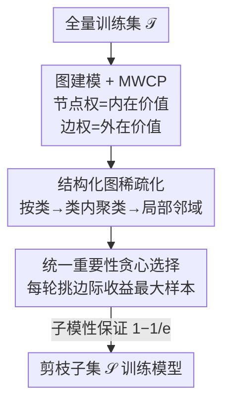

# Selecting Samples on Graphs: A Unified Dataset Pruning Framework for Lossless Training Acceleration

**会议**: ICML2026  
**arXiv**: [2606.12913](https://arxiv.org/abs/2606.12913)  
**代码**: 待确认  
**领域**: 数据剪枝 / 子集选择 / 优化  
**关键词**: 数据集剪枝, 最大权团, 子模优化, 贪心算法, 训练加速

## 一句话总结
把数据集剪枝重新建模成一张带权图上的「最大权团问题」（节点权 = 样本自身价值、边权 = 样本间冗余/多样性关系），证明在温和条件下该统一目标是子模的，于是用一个带逼近保证的贪心算法求解，在 ImageNet-1k + ResNet-50 上把训练时间砍掉 40%+ 而精度不掉。

## 研究背景与动机
**领域现状**：现代数据集越来越大，训练一个模型动辄几周。数据集剪枝（dataset pruning, DP）想只保留一个「信息量高」的真实样本子集来省算力——它比数据蒸馏更安全（保留真实样本、决策可解释）。主流 DP 的套路高度一致：给每个样本算一个 importance 分，留下分最高的那批。

**现有痛点**：分数怎么定义决定了一切，而现有定义分成两个互不相容的阵营。**内在（intrinsic）准则**独立地看每个样本——用 loss、梯度、遗忘次数、不确定性等衡量「这个样本本身有多难学」，但完全不管样本之间的冗余，激进剪枝时会选进一堆长得差不多的难样本。**外在（extrinsic）准则**通过样本间关系来选——K-center、herding、聚类等鼓励覆盖与多样性，但又忽略了单个样本到底有没有信息量。

**核心矛盾**：样本价值本质上是「多面」的，既取决于自身学习潜力、又取决于它和已选子集的相互作用，而任何单一阵营只抓住了一面。已有的混合方法（D²-pruning、InfoMax）虽然试图结合两者，但都**写死成某一个固定的启发式度量**，既看不清剪枝问题的底层结构，也无法随剪枝比例/数据集灵活调整，更没有优化保证。

**本文目标**：要一个统一框架，同时容纳内在与外在两类价值、允许灵活替换具体度量、还能高效优化并保留理论保证。

**切入角度**：如果把样本当节点、把样本对的关系当边，那么「选一个既有信息量又不冗余的子集」天然就是在图上「选一个高质量子图」。

**核心 idea**：把数据集剪枝**精确等价**地写成图论里经典的「最大权团问题（MWCP）」——节点权编码内在价值、边权编码外在价值；虽然 MWCP 是 NP-hard，但它的局部结构允许一个有逼近保证的贪心解。作者把这套框架叫 **UGIES**（Unified Graph-based Importance Evaluation System）。

## 方法详解

### 整体框架
UGIES 的输入是全量训练集 $\mathcal{T}=\{x_i\}_{i=1}^N$ 和剪枝比例 $p$，输出是一个保留子集 $\mathcal{S}$（$|\mathcal{S}|=(1-p)N$）用于训练目标模型。整条管线的关键转换是：**先把剪枝问题翻译成一张带权图上的 MWCP，再用贪心+稀疏化高效求解**。

具体分四步走：① 把每个样本算一个内在重要性 $\mathcal{I}^{\mathrm{in}}(x_i)$ 当节点权；② 对样本对算一个基于距离的外在交互当边权，并通过「按类 + 类内聚类」把全连接图稀疏成局部邻域图（否则 $O(N^2)$ 的边算不动）；③ 从空集出发，每轮挑「边际收益」最大的样本加入子集，直到选满；④ 理论上证明这个统一目标在温和条件下是子模的，于是贪心解享有 $(1-\tfrac1e)$ 的最坏情况逼近保证。

### 关键设计

**1. 图建模 + 最大权团等价：把剪枝问题写成可优化的目标，而不是又一个启发式分数**

这是全文的地基。作者把训练集建成无向带权图 $G=(V,E)$，节点 $v_i$ 对应样本 $x_i$，节点权 $w_i=\alpha\,\mathcal{I}^{\mathrm{in}}(x_i)$ 编码内在价值，边权 $a_{ij}=g(D(x_i,x_j))$ 编码样本对同时被保留时产生的外在交互（$D$ 是某种距离/相似度，$g$ 把它映射到合适尺度，$\alpha$ 平衡两项）。这样一来，「选一个总效用最大的子集」就精确等于「选一个让节点权之和 + 内部边权之和最大的固定大小子图」，也就是 MWCP：

$$\max_{C\subseteq V}\Big[\sum_{v_i\in C} w_i + \sum_{\{v_i,v_j\}\subseteq C} a_{ij}\Big],\quad \text{s.t. } |C|=b.$$

关键在于这是一个**精确等价**而非近似类比（Remark 3.2）：节点权 = 内在重要性、边权 = 成对外在交互，所以剪枝 = 在构造图上解 MWCP。为便于设计算法，作者又把集合形式改写成等价的样本级形式 $f(\mathcal{S})=\sum_{x_i\in\mathcal{S}}[\alpha\mathcal{I}^{\mathrm{in}}(x_i)+\mathcal{I}^{\mathrm{ex}}(x_i\mid\mathcal{S})]$，其中外在项 $\mathcal{I}^{\mathrm{ex}}(x_i\mid\mathcal{S})=\sum_{x_j\in\mathcal{S}\setminus\{x_i\}} g(D(x_i,x_j))$。相比写死一个度量，这个目标把「内在 + 外在」抽象成可替换的零件，谁来填都行。

**2. 统一重要性 + 贪心选择：从「删一个点」的精确解里推出边际增益准则**

MWCP 整体 NP-hard，但作者发现一个救命的局部性质：当只删一个点（$b=N-1$）时，最优删除是**精确可解**的——删掉节点 $v_i$ 让团权下降 $\Delta^-(v_i\mid G)=w_i+\sum_{v_j\in C\setminus\{v_i\}} a_{ij}$，于是只要删「下降代价最小」那个点即可。这个量只依赖 $v_i$ 的邻域，天然就是一个**边际贡献**。由此对称地定义统一重要性 $\mathcal{I}(x_i\mid\mathcal{S})=\alpha\mathcal{I}^{\mathrm{in}}(x_i)+\mathcal{I}^{\mathrm{ex}}(x_i\mid\mathcal{S})$——即把 $x_i$ 加入当前子集带来的边际增益。

贪心策略据此从空集增量构造子集：每轮选 $x^\star=\arg\max_{x_i\in\mathcal{T}\setminus\mathcal{S}_t}\mathcal{I}(x_i\mid\mathcal{S}_t)$，加入后只需对落在 $x^\star$ 邻域内的样本增量更新外在项即可（Algorithm 1 第 7–13 行），选择复杂度对子集大小是线性的，避开了精确求解器的组合爆炸。这个准则的精妙之处在于：它**不是拍脑袋设的启发式**，而是从局部约束 MWCP 的精确解里推导出来的边际增益。对超大数据集还提供一个把归一化重要性当采样概率的 Stochastic Selection 变体。

**3. 结构化图稀疏化：用「冗余主要是局部的」把 $O(N^2)$ 的边算量压下来**

全连接图要算所有样本对，$O(N^2)$ 根本算不动。作者用一个两级结构定义每个样本的邻域 $\mathcal{N}(x_i)$：先按**类标签**分块，类内再按**特征聚类**，$\mathcal{N}(x_i)$ 就是 $x_i$ 所在的簇（无标签数据则只聚类）。外在项只在邻域内累加 $\mathcal{I}^{\mathrm{ex}}(x_i\mid\mathcal{S})=\sum_{x_j\in\mathcal{S}\cap\mathcal{N}(x_i)} g(D(x_i,x_j))$。

这背后的假设是「冗余主要是局部的」——邻域外的样本对外在影响可忽略。妙的是稀疏化没有破坏问题结构：缺失的边等价于权为 0 的边，所以稀疏图在形式上仍是带零权边的全连接图，前面所有 MWCP 推导和贪心解器**无需任何改动**照样成立。这让框架在工程上真正可扩展到 ImageNet 量级。

**4. 子模性证明 + 度量设计准则：给「灵活替换度量」配上理论护栏**

灵活性如果没有保证就只是另一个调参玩具。作者证明（Lemma 3.4）：只要距离 $D(\cdot,\cdot)\ge 0$ 非负、映射 $g:\mathbb{R}_{\ge0}\to\mathbb{R}_{\le0}$ 非正，统一目标 $f(\mathcal{S})$ 就是**子模**的——满足边际收益递减 $\Delta(x\mid\mathcal{A})\ge\Delta(x\mid\mathcal{B})$（$\mathcal{A}\subseteq\mathcal{B}$）。证明很干净：两者之差等于 $-\sum_{y\in\mathcal{B}\setminus\mathcal{A}} g(D(x,y))$，每一项都非负。子模 + 基数约束下，贪心解就有 $(1-\tfrac1e)$ 的最坏情况逼近保证。

更重要的是，这两个条件本身**就是设计度量的准则**：一大类内在度量（loss、不确定性、遗忘分）配上任意「非正成对交互」都自动满足。文中给的一个实例是内在项用预测分布的熵 $\mathcal{I}^{\mathrm{in}}(x_i)=H(\mathbf{p}_i)=-\sum_c p_i^c\log p_i^c$、外在项用 $\sum_{x_j\in\mathcal{S}}[\phi(D^{cos}(x_i,x_j))-1]$（$\phi$ 是 sigmoid，所以方括号项非正），直观上就是选「信息量大且彼此多样」的子集。这把 UGIES 和 CRAIG/GLISTER 等只为自家目标证子模的工作区分开来——它把子模当成**统一度量家族的设计原则**，而非单个目标的副产品。

### 损失函数 / 训练策略
UGIES 本身不引入新损失：它是一个数据选择前处理，选完子集后用标准训练流程（如 ResNet-50 在 ImageNet 上 90 epoch、Swin-T 300 epoch）训练目标模型。核心超参是平衡内在/外在的 $\alpha$、剪枝比例 $p$，以及稀疏化时的聚类粒度。

## 实验关键数据

### 主实验
在 CIFAR-10/100（ResNet-18）和 ImageNet-1k（ResNet-50 / Swin-T）上对比十余种 DP 基线。下表摘录 CIFAR 上的代表结果（Top-1 %）：

| 数据集 | 剪枝比例 | Random | InfoBatch | DivBS | 本文(UGIES) | Full Data |
|--------|---------|--------|-----------|-------|------------|-----------|
| CIFAR-10 | 30% | 94.6 | 95.6 | 95.4 | **95.9** | 95.6±0.1 |
| CIFAR-10 | 50% | 93.3 | 95.1 | 95.2 | **95.4** | 95.6±0.1 |
| CIFAR-100 | 30% | 73.8 | 78.2 | 78.5 | **78.9** | 78.2±0.1 |
| CIFAR-100 | 50% | 72.1 | 78.1 | 78.2 | **78.6** | 78.2±0.1 |

CIFAR-10 在 30% 剪枝下 95.9 反超全量训练的 95.6（↑0.3），CIFAR-100 在 30%/50% 下 78.9/78.6 也都超过全量 78.2，体现了「lossless 甚至 better」的卖点。ImageNet-1k 上同样在多个剪枝比例下领先 Random/Herding/Forgetting/EL2N 等基线，作者报告训练时间减少 40%+ 而精度不降。

### 消融与稀疏化分析

| 配置 | 作用 | 结论 |
|------|------|------|
| 仅内在项（去掉边权） | 退化为传统打分式剪枝 | 激进剪枝下冗余失控、掉点 |
| 仅外在项（去掉节点权） | 退化为纯多样性/覆盖 | 忽略样本信息量、次优 |
| 内在+外在统一目标 | 完整 UGIES | 两类价值互补，最优 |
| 全连接图 → 结构化稀疏化 | 把 $O(N^2)$ 降为局部邻域 | 形式等价、结果几乎不变但可扩展 |

### 关键发现
- **统一才是关键**：单独用内在或外在准则都只在各自擅长的剪枝比例/分布下有效，统一目标在不同剪枝比例与数据分布上都更稳健——印证了「样本价值是多面的」这一出发点。
- **理论条件即设计指南**：只要满足「非负距离 + 非正映射」，换任意内在度量都保持子模性与贪心保证，框架对度量选择不敏感。
- **稀疏化几乎无损**：基于「冗余主要是局部」的两级邻域稀疏化在形式上与全连接图等价（缺边 = 零权边），让方法真正能跑 ImageNet 量级。

## 亮点与洞察
- **把剪枝写成 MWCP 是真正的「降维打击」**：它不是又造一个分数，而是给整个 DP 领域一个统一的优化语言——内在/外在两派只是这张图上「只用节点权」或「只用边权」的特例。
- **从「删一个点的精确解」反推贪心准则**很优雅：边际增益不是启发式硬塞的，而是局部约束 MWCP 的精确最优，理论上站得住。
- **子模条件同时充当度量设计准则**这一手最值得迁移：很多领域的「重要性打分」都可以套这个壳——只要保证成对交互非正，就能白拿一个 $(1-1/e)$ 保证，把「灵活换度量」和「有保证」这对常见矛盾一并解决。
- 稀疏化里「缺失边 = 零权边、形式不变」的论证干净利落，省去了为稀疏图重写一套理论的麻烦。

## 局限与展望
- **依赖类标签做第一级邻域划分**：无标签场景退化为纯聚类，邻域质量受聚类好坏影响，作者未充分讨论聚类失败时外在项被低估的风险。
- **子模性条件偏强**：要求成对交互严格非正，这把「鼓励某些样本对共现」（正交互）的度量排除在保证之外，框架的「灵活」其实有边界。
- **$\alpha$ 与剪枝比例的耦合**：内在/外在平衡系数 $\alpha$ 在不同剪枝比例下的最优取值如何选，正文给的是经验设定，缺一个自适应机制。
- 主战场是图像分类（CIFAR/ImageNet），在 LLM/多模态预训练这类更贴近「数据爆炸」痛点的大规模场景上还未验证。

## 相关工作与启发
- **vs InfoBatch / DivBS（单阵营 DP）**：InfoBatch 偏内在（高 loss 优先）、DivBS 偏外在（去冗余梯度方向），各自只抓一面；UGIES 用一个目标统一两者，跨剪枝比例更稳健。
- **vs D²-pruning / InfoMax（已有混合方法）**：它们也结合内在+外在，但写死成一个固定启发式度量；UGIES 把度量抽象成可替换零件并保证子模，提供「设计准则」而非「单一公式」。
- **vs CRAIG / GLISTER / GRAD-MATCH（子模数据选择）**：这些方法只为自家特定目标函数证子模；UGIES 把子模当成统一内在-外在度量家族的设计原则，在温和条件下让一整族目标都可贪心优化。

## 评分
- 新颖性: ⭐⭐⭐⭐⭐ 把数据剪枝精确等价为 MWCP 并给出统一可证框架，视角层面的统一而非又一个分数。
- 实验充分度: ⭐⭐⭐⭐ CIFAR/ImageNet、CNN/Transformer、多剪枝比例对比十余基线，但缺 LLM/多模态大规模验证。
- 写作质量: ⭐⭐⭐⭐⭐ 从动机到等价、到贪心、到子模证明逻辑链完整清晰。
- 价值: ⭐⭐⭐⭐ 训练时间减 40%+ 且 lossless，且统一框架对后续 DP 研究有方法论价值。

<!-- RELATED:START -->

## 相关论文

- [\[NeurIPS 2025\] AutoOpt: A Dataset and a Unified Framework for Automating Optimization Problem Solving](../../NeurIPS2025/optimization/autoopt_a_dataset_and_a_unified_framework_for_automating_optimization_problem_so.md)
- [\[CVPR 2026\] UniFusion: A Unified Image Fusion Framework with Robust Representation and Source-Aware Preservation](../../CVPR2026/optimization/unifusion_a_unified_image_fusion_framework_with_robust_representation_and_source.md)
- [\[ICML 2026\] A General Framework for Dynamic Consistent Submodular Maximization](a_general_framework_for_dynamic_consistent_submodular_maximization.md)
- [\[ICML 2026\] Enhancing LLM Training via Spectral Clipping](enhancing_llm_training_via_spectral_clipping.md)
- [\[CVPR 2025\] Automatic Joint Structured Pruning and Quantization for Efficient Neural Network Training and Compression](../../CVPR2025/optimization/automatic_joint_structured_pruning_and_quantization_for_efficient_neural_network.md)

<!-- RELATED:END -->
