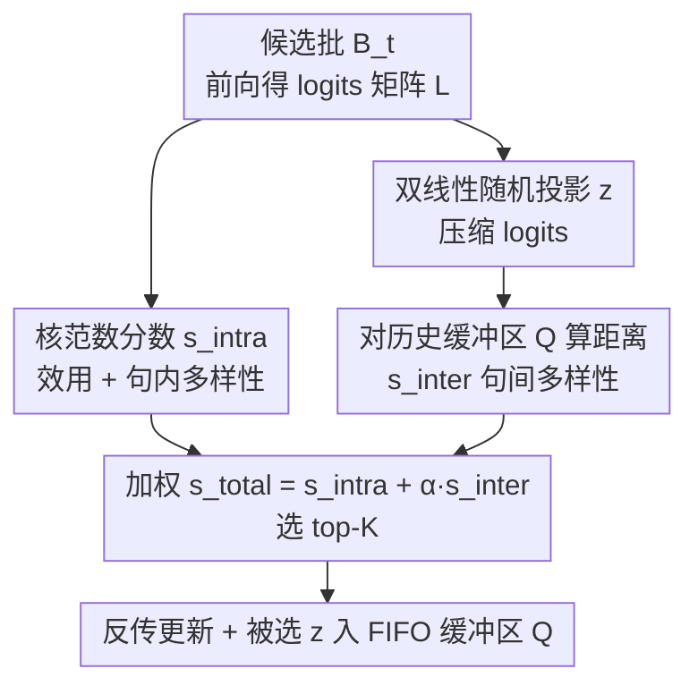

# Utility-Diversity Aware Online Batch Selection for LLM Supervised Fine-tuning

**会议**: ICML 2026  
**arXiv**: [2510.16882](https://arxiv.org/abs/2510.16882)  
**代码**: https://github.com/gfyddha/UDS  
**领域**: 在线批选择 / 数据筛选 / 高效 SFT  
**关键词**: 在线批选择, 监督微调, logits 核范数, 多样性, 内存缓冲区

## 一句话总结
UDS 提出一种用于 LLM 监督微调（SFT）的高效在线批选择框架：仅靠前向传播得到的 **logits 矩阵核范数**同时刻画样本的「优化效用 + 句内多样性」，再用 logits 的**低维双线性随机投影**与历史样本内存缓冲区做相似度匹配来度量「句间多样性」，两者加权后选 top-K 训练——既不依赖参考模型/验证集等外部资源，也不做额外反传，因此比全量 SFT 更快、且在多个基准上稳定超过现有在线批选择 SOTA。

## 研究背景与动机
**领域现状**：SFT 是把 LLM 适配到下游任务的主流后训练范式，但在全量数据上微调既贵又常常过拟合或放大偏差。于是「数据筛选」兴起，其中**在线批选择（online batch selection）**这一支在训练过程中动态打分、即时过滤样本：每个迭代抽一个候选大批 $\mathcal{B}_t$，只挑子集 $\widehat{\mathcal{B}}_t$ 参与参数更新，从而随模型状态实时自适应。

**现有痛点**：作者把现有方法的毛病归纳成三类。其一，**只看效用、不看多样性**——MaxLoss 挑高 loss 样本、MaxGrad 挑大梯度样本，视角单一，既不管句内 token 是否重复、也不管句间是否冗余近重复。其二，**依赖外部资源**——RHO-Loss 要参考模型、GREATS 等要留出验证集，而测试分布往往未知、参考模型现实中也不实用。其三，**额外开销大**——不少方法（要算逐样本梯度的、要跑参考模型的）训练时间甚至超过全量训练，违背了「省算力」的初衷。

**核心矛盾**：在线批选择要在「每个候选样本都得在当前模型下评估」与「评估必须便宜到不拖慢训练」之间取得平衡。要准确评估就得至少一次前向（捕捉模型当下如何理解该样本），但若再为每个样本算梯度或跑参考模型，开销立刻爆炸。

**本文目标**：作者把理想方法形式化为三条 desiderata——**D1** 联合考虑数据效用、句内多样性、句间多样性；**D2** 不访问参考模型/验证集等外部资源；**D3** 整体流水线训练时间低于全量 SFT。

**切入角度**：既然前向传播本就会产生 **logits 矩阵** $\bm{L}(\bm{x}_t^i;\bm{\theta}_t)\in\mathbb{R}^{N\times V}$（$N$ 序列长、$V$ 词表大），它天然编码了样本的效用与多样性信息，那就**只用 logits**——避免昂贵的逐样本梯度（满足 D3）、也无需外部资源（满足 D2）。

**核心 idea**：用 logits 矩阵的**核范数**一举捕捉「优化效用 + 句内多样性」，再用 logits 的**低维投影 + 历史缓冲区距离**捕捉「句间多样性」，两个分数线性加权后选 top-K（满足 D1）。

## 方法详解

### 整体框架
UDS 是一个即插即用的子集选择模块，直接挂在 SFT 流水线上。在每个迭代 $t$ 的前向传播中，对候选批 $\mathcal{B}_t$ 里每个样本 $\bm{x}_t^i$：先由其 logits 矩阵算**句内重要性分数** $s_{\text{intra}}^{t,i}$（核范数），再把 logits 用双线性随机投影压成低维向量 $\bm{z}_t^i$、与历史内存缓冲区 $\bm{Q}$ 里的样本算平均距离得到**句间重要性分数** $s_{\text{inter}}^{t,i}$；两者加权求和 $s_{\text{total}}^{t,i}=s_{\text{intra}}^{t,i}+\alpha\,s_{\text{inter}}^{t,i}$，选 top-K 做参数更新，并把被选样本的 $\bm{z}$ 推入 FIFO 缓冲区。整条链路**只用前向输出，不做额外反传、不依赖外部模型**。

### 关键设计

**1. 核范数当句内分数：一个量同时抓「优化效用」和「句内多样性」**

这是 UDS 的核心观察。logits 矩阵的核范数（迹范数）$s_{\text{intra}}^{t,i}=\|\bm{L}(\bm{x}_t^i;\bm{\theta}_t)\|_*=\sum_{j=1}^r\sigma_j$ 是所有奇异值之和。它为什么能同时刻画效用和多样性？借助 Lemma 3.1 的夹逼界 $\|\bm{L}\|_F\le\|\bm{L}\|_*\le\sqrt{\min(N,V)}\,\|\bm{L}\|_F$：核范数变大有两条途径。

其一是 **Frobenius 范数变大**，对应 logits 整体更大——作者用一阶 Taylor 展开论证，logits 越大、参数更新引起的扰动 $\delta\bm{L}$ 越大，而损失变化 $\delta\ell\approx\langle\bm{\Delta},\delta\bm{L}\rangle$（$\bm{\Delta}=\bm{P}-\bm{Y}$ 是交叉熵对 logits 的梯度、对尺度不敏感），于是 $\|\bm{L}\|_F$、$\|\bm{L}\|_*$ 与可获得的损失下降 $-\delta\ell$ 同向增长，故核范数可当**优化效用**的指标（一个样本能带来越大的 loss 下降，越值得选）。其二是**固定 $\|\bm{L}\|_F$ 下核范数靠近上界**，对应满秩、奇异值均等的「平坦谱」——此时各 token 的 logits 行向量彼此正交、方向分散，模型在序列内预测出丰富多样的词；反之 rank-1（行向量共线）则对应模型反复预测同一个词的退化情形。所以核范数大也意味着**句内多样性**高。Qwen-2.5-7B 在 MMLU 上的相关性分析证实：$-\delta\ell$ 与 $\|\bm{L}\|_*$、$\mathrm{rank}(\bm{L})$ 与 $\|\bm{L}\|_*$ 都强线性相关。⚠️ 核范数与损失下降的线性关系是直觉论证 + 经验观察，并非严格证明，以原文为准。

**2. 低维双线性随机投影：让 logits 能进缓冲区而不爆显存**

要算句间多样性，得把每个样本的表示存进缓冲区，但原始 logits 矩阵 $\bm{L}\in\mathbb{R}^{N\times V}$ 太大（Qwen-2.5-7B 存 1024 个样本约 74GB）。直接用 $\bm{\Gamma}\in\mathbb{R}^{NV\times d}$ 投影又会让投影矩阵本身爆掉（$d=1024$ 时约 74GB）。UDS 把投影**因子化**成两个小矩阵：$\bm{\Gamma}_1\in\mathbb{R}^{d_1\times V}$ 压词表维、$\bm{\Gamma}_2\in\mathbb{R}^{d_2\times N}$ 压序列维，$\bm{z}_t^i=\mathrm{vec}(\bm{\Gamma}_2\,\bm{L}\,\bm{\Gamma}_1^\top)$，等效维度 $d=d_1 d_2$。两个矩阵用 SRFT（子采样随机傅里叶变换）风格构造 $\bm{\Gamma}=\sqrt{\cdot}\,\bm{S}\bm{F}\bm{D}$（$\bm{F}$ 是 DFT 矩阵、$\bm{D}$ 是 $\pm1$ Rademacher 对角阵、$\bm{S}$ 随机选行），既近似满足 Johnson–Lindenstrauss 引理保距 $(1-\epsilon)\|\bm{u}_i-\bm{u}_j\|^2\le\|\bm{v}_i-\bm{v}_j\|^2\le(1+\epsilon)\|\bm{u}_i-\bm{u}_j\|^2$，又**无需显式存储 $NV\times d$ 矩阵**，把计算复杂度从 $\mathcal{O}(NVd)$ 降到 $\mathcal{O}((N+V)d\log(NV))$。这一步是「想用 logits 算全局多样性」从理论落到工程可行的关键。

**3. 历史内存缓冲区度量句间多样性：把视野从「批内」扩到「全局」**

现有方法（如 GREATS）只在候选批内部看多样性，但批容量 $B$ 远小于全局数据集，视野太窄。UDS 维护一个固定容量 $M$ 的 FIFO 缓冲区 $\bm{Q}\in\mathbb{R}^{M\times d}$（$M\gg B$），存最近 $M$ 个被选样本的低维表示，句间分数取候选样本到缓冲区所有表示的平均欧氏距离：

$$s_{\text{inter}}^{t,i}=\frac{1}{|\bm{Q}|}\sum_{\bm{z}_j\in\bm{Q}}\|\bm{z}_t^i-\bm{z}_j\|_2+\underbrace{\frac{1}{|\mathcal{B}_t|}\sum_{\bm{z}_k\in\mathcal{B}_t}\|\bm{z}_t^i-\bm{z}_k\|_2}_{\text{(可选) 批内多样性}}$$

缓冲区为空时 $s_{\text{inter}}^{t,i}=0$；分数越高表示该样本与近期训练历史越「不同」，从而抑制对近重复内容的反复训练。作者论证批内那一项通常可忽略（$B\ll M$ 且数据已打乱，相似样本很少同批却不在缓冲区里），实现中默认省略。最终 $s_{\text{total}}^{t,i}=s_{\text{intra}}^{t,i}+\alpha\,s_{\text{inter}}^{t,i}$ 在「利用高效用样本」与「探索数据分布中少访问区域」之间取得平衡——这正是把 D1 的三要素（效用 + 句内多样性 + 句间多样性）真正合到一个可选 top-K 的分数里。

### 损失函数 / 训练策略
训练目标仍是标准 SFT 的自回归交叉熵（最大化训练序列似然），UDS 只改「每步用哪些样本」。算法每步：① 对候选批每个样本前向得 logits，算 $s_{\text{intra}}$（核范数）与 $\bm{z}$（双线性投影）；② 对缓冲区算 $s_{\text{inter}}$，合成 $s_{\text{total}}$ 选 top-K；③ 更新缓冲区（满了就弹出最旧）并在被选子集上反传更新 $\bm{\theta}_t\to\bm{\theta}_{t+1}$。默认超参：缓冲区 $M=1024$、投影维 $d_1=128,d_2=8$、批大小 $B=8$、LoRA rank=8；权衡因子 $\alpha$ 与数据选择比依 backbone/数据集而定。

## 实验关键数据

### 主实验（4 基准，平均准确率 $\bar{A}$ / HumanEval 用 Pass@1，throughput 越高越快）
对比全量训练（Regular）与多种在线批选择基线，节选 Qwen-2.5-7B：

| 方法 | MMLU $\bar A$ | ScienceQA $\bar A$ | GSM8K $\bar A$ | HumanEval Pass@1 |
|------|------|------|------|------|
| Regular（全量） | 55.32 | 94.56 | 78.23 | 45.82 |
| MaxLoss | 54.51 | 93.05 | 77.78 | 41.34 |
| RHO-Loss | 57.08 | 93.80 | 78.38 | 43.08 |
| GREATS（前 SOTA） | 58.19 | 94.17 | 78.61 | 45.04 |
| **UDS（本文）** | **63.34** | **95.19** | **79.91** | **46.28** |

UDS 在四个基准上全面最优：MMLU 上比 GREATS 高 **+5.15%**，且 Llama-3.1-8B 上同样领先（如 MMLU 40.16 vs GREATS 39.04）。效率上，UDS 在 Qwen-2.5-7B 上 MMLU 吞吐 3.41、HumanEval 6.81 samples/s，均高于全量训练（2.27、6.24）；MaxGrad 虽快但几乎不涨点、且把训练拖慢，GREATS 虽准但一直比 UDS 慢——UDS 拿到了**准确率与效率的最佳折中**。

### 消融实验（Qwen-2.5-7B，$\Delta$ 为相对 Random 基线的提升）

| 配置 | MMLU $\bar A$ | $\Delta$ | GSM8K $\bar A$ | $\Delta$ | HumanEval $\bar A$ | $\Delta$ |
|------|------|------|------|------|------|------|
| Random（基线） | 54.26 | – | 77.69 | – | 40.20 | – |
| 仅核范数（句内） | 58.35 | +4.09 | 79.22 | +1.53 | 44.18 | +3.98 |
| 仅多样性距离（句间） | 57.75 | +3.49 | 78.96 | +0.67 | 43.84 | +3.64 |
| **UDS（完整）** | **63.34** | **+9.08** | **79.91** | **+2.22** | **46.28** | **+6.08** |

### 关键发现
- **两个分量都有效且互补**：仅核范数、仅多样性距离都稳超随机选择，二者合起来在所有基准上达最佳，且 MMLU 上完整 UDS（+9.08）显著大于单分量之和暗示的线性叠加，说明效用与多样性确实在「联合建模」时相互增益。
- **核范数 = 效用 + 句内多样性是经验立得住的**：Qwen-2.5-7B 上 $-\delta\ell$、$\mathrm{rank}(\bm{L})$ 与 $\|\bm{L}\|_*$ 都强线性相关，支撑「挑大核范数样本 ≈ 挑高 loss-下降潜力 + 高句内多样性样本」。
- **双线性投影 + 缓冲区几乎不增显存**：增大 $d_1,d_2,M$ 时准确率上升而峰值显存仅小幅增长，验证了把 logits 压进缓冲区这条工程路线的可行性。
- **跨数据规模稳定领先**：在不同训练数据比例下 UDS 始终最优，并超过全量微调（Llama-3.1-8B / MMLU）。

## 亮点与洞察
- **一个核范数同时回答两个问题**：把「这个样本能带来多少 loss 下降（效用）」和「这个样本句内 token 是否多样」统一到 logits 矩阵的奇异值之和上，是非常经济的设计——用前向就有的量，省掉了逐样本梯度。
- **因子化随机投影解了「logits 太大存不下」的硬约束**：把 $NV\times d$ 投影拆成两个小矩阵 + SRFT 构造，既保距（JL 引理）又把复杂度降到 $\mathcal{O}((N+V)d\log(NV))$，这套技巧可迁移到任何「想用高维中间激活做相似度匹配但显存受限」的场景。
- **全局多样性视角**：用历史缓冲区把多样性从「批内」扩到「跨迭代全局」，比 GREATS 的批内多样性更贴近「整个训练过程不要反复学近重复内容」的真实诉求。
- **三条 desiderata 的工程闭环**：D1/D2/D3 不是口号——UDS 真的做到了联合效用+双重多样性、零外部资源、且比全量更快，这种「先立标准再逐条满足」的论证结构清晰可复用。

## 局限与展望
- **核范数与损失下降的线性关系缺严格证明**：作者坦言因模型复杂性与非线性，只能给直觉论证 + 经验相关，理论上为何成立仍是开放问题。
- **超参敏感**：数据选择比 $\alpha$、权衡因子高度依赖 backbone 与数据集组合（需按表逐一调），$d_1,d_2,M$ 也需权衡准确率与显存，部署时调参成本不低。
- **受硬件约束只测了 LoRA + 7/8B 量级**：批大小固定 $B=8$，全参 SFT、更大批、更大模型的结论主要放在附录，主表覆盖有限。
- **句内/句间多样性都建在 logits 上**：若 logits 本身被校准问题或温度影响，核范数与投影距离的语义可能漂移；对极长序列（$N$ 很大）核范数的计算开销也值得进一步评估。

## 相关工作与启发
- **vs MaxLoss / MaxGrad**: 它们只用单一效用信号（高 loss / 大梯度），既不管多样性，MaxGrad 还要算逐样本梯度而拖慢训练；UDS 用前向 logits 核范数同时拿到效用与句内多样性，且无额外反传。
- **vs RHO-Loss**: 依赖参考模型来估「可降低 holdout loss 的样本」，现实中参考模型/验证集常不可得；UDS 彻底去掉外部资源（D2）。
- **vs GREATS（前 SOTA）**: 同为在线批选择，但 GREATS 只看批内多样性、需验证集、且开销大；UDS 用历史缓冲区做全局句间多样性、零外部资源、训练更快，并在四基准上一致超越（MMLU +5.15%）。

## 评分
- 新颖性: ⭐⭐⭐⭐ 「核范数同时编码效用+句内多样性」的观察 + 因子化随机投影解显存，组合新颖实用。
- 实验充分度: ⭐⭐⭐⭐ 四基准 ×2 backbone + 消融 + 超参/数据规模分析较全，但主表受限于 LoRA/7-8B，理论保证偏弱。
- 写作质量: ⭐⭐⭐⭐ 三条 desiderata 立框架、Lemma 串起核范数双重含义，逻辑清楚；记号偏密。
- 价值: ⭐⭐⭐⭐ 即插即用、无外部资源、比全量更快又更准，对实际 SFT 数据筛选有直接落地价值。

<!-- RELATED:START -->

## 相关论文

- [\[ICLR 2026\] Arbitrary-Order Block SignSGD for Memory-Efficient LLM Fine-Tuning](../../ICLR2026/optimization/arbitrary-order_block_signsgd_for_memory-efficient_llm_fine-tuning.md)
- [\[ICML 2026\] Learning a Zeroth-Order Optimizer for Fine-Tuning LLMs](learning_a_zeroth-order_optimizer_for_fine-tuning_llms.md)
- [\[ICML 2026\] Distilling Linearized Behavior into Non-Linear Fine-Tuning for Effective Task Arithmetic](distilling_linearized_behavior_into_non-linear_fine-tuning_for_effective_task_ar.md)
- [\[ICCV 2025\] Zeroth-Order Fine-Tuning of LLMs in Random Subspaces](../../ICCV2025/optimization/zeroth-order_fine-tuning_of_llms_in_random_subspaces.md)
- [\[NeurIPS 2025\] Optimistic Online-to-Batch Conversions for Accelerated Convergence and Universality](../../NeurIPS2025/optimization/optimistic_online-to-batch_conversions_for_accelerated_convergence_and_universal.md)

<!-- RELATED:END -->
