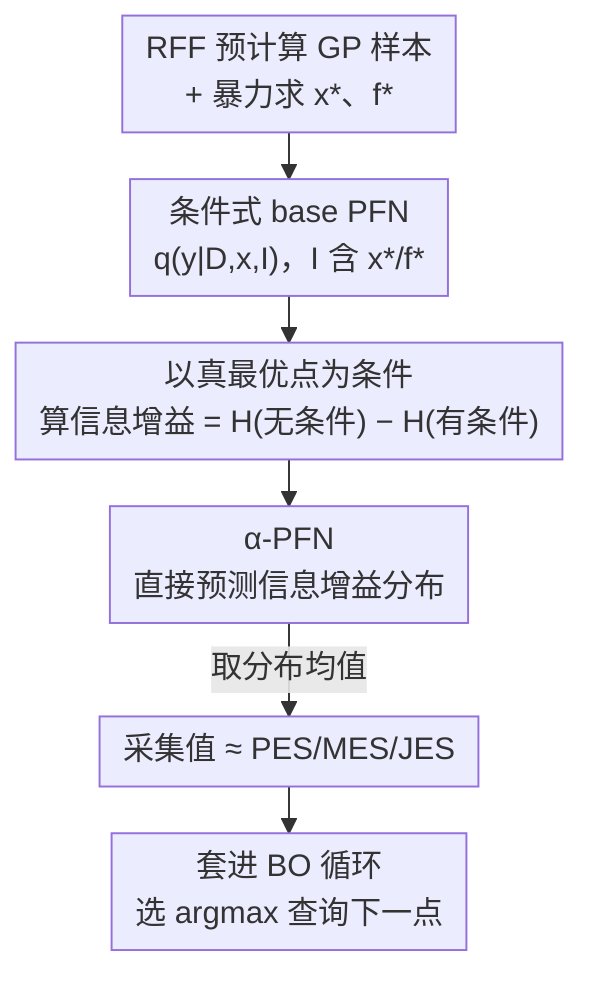

# $α$-PFN: Fast Entropy Search via In-Context Learning

**会议**: ICML 2026  
**arXiv**: [2606.07134](https://arxiv.org/abs/2606.07134)  
**代码**: https://github.com/automl/AlphaPFN  
**领域**: 黑盒优化 / 贝叶斯优化 / 采集函数  
**关键词**: 贝叶斯优化, 熵搜索, Prior-Fitted Networks, 采集函数摊销, in-context learning

## 一句话总结
这篇论文用两阶段的 Prior-data Fitted Networks（PFN）把熵搜索（Entropy Search）这一类信息论采集函数"摊销"成单次前向传播——先训一个能在已知最优点信息条件下做预测的 base PFN，再训一个直接吐出信息增益分布的 $α$-PFN，从而绕过原来又慢又复杂的蒙特卡洛近似，在合成和真实 HPO 基准上性能与 SOTA 熵搜索相当，但提速最高 70 倍以上。

## 研究背景与动机
**领域现状**：贝叶斯优化（BO）用尽量少的试验次数最大化一个昂贵黑盒函数 $f(x)$，每一步靠采集函数（acquisition function）权衡探索与利用。经典的 Expected Improvement（EI）有解析式、跑得快，但天生是"近视"的——只看当前观测值的即时改进，在噪声大或异质的场景里往往找不准最优点。信息论采集函数（熵搜索 ES 及其变体 PES / MES / JES）选择那些能最大程度降低"最优点位置/取值不确定性"的查询点，理论上更优雅、支持非近视、抗噪、感知评估代价。

**现有痛点**：ES 对高斯过程（GP）没有简单的解析定义，所有实用实现都依赖手工设计的、基于采样的近似——比如用蒙特卡洛估计信息增益、用随机傅里叶特征（RFF）逼近 GP 样本路径再求最优、用期望传播或矩匹配近似熵。这些近似既慢又容易引入数值误差，而且每个 ES 变体都要单独写一套精巧的、领域专家级的实现。随着 BO 越来越多被用于"高吞吐"场景（查询本身很快），采集函数本身的运行时间反而成了瓶颈。

**核心矛盾**：ES 框架优雅 vs. 其近似复杂且昂贵——优雅的信息论目标被埋在一堆手工启发式近似里，既拖慢速度又难以扩展到新变体或全贝叶斯设置。

**本文目标**：不再"推导又一个手工近似"，而是让一个神经网络**学会**逼近这些采集函数，把昂贵的推理期采样换成一次前向传播。

**切入角度**：PFN 已被证明能用 transformer 在单次前向中逼近 GP 回归的后验预测分布（in-context learning，无需推理期梯度下降）。作者观察到：ES 的信息增益本质上是"无条件熵"减去"以最优点信息为条件的熵"，如果有一个能在最优点信息条件下做预测的 PFN，就能把这个增益直接学出来。

**核心 idea**：用两阶段摊销——base PFN 学会"条件于 $x^*$/$f^*$ 的后验预测"，$α$-PFN 学会"直接预测信息增益分布"，其分布均值恰好等于 PES/MES/JES 的采集值，从而单次前向出结果。

## 方法详解

### 整体框架
整个方法要解决的是"如何不靠推理期蒙特卡洛采样就算出熵搜索采集值"。pipeline 分两段训练 + 一段使用：第一段训练 **base PFN**，让它能在给定数据集 $D_{trn}$、查询点 $x$ 以及可选的最优点信息 $I$（$x^*$、$f^*$ 或两者）时给出后验预测分布 $q(y\mid D_{trn},x,I)$；第二段用 base PFN 的输出构造训练目标，训练 **$α$-PFN**，让它只看 $D_{trn}$ 和 $x$ 就直接预测信息增益的分布；使用时把 $α$-PFN 套进标准 BO 循环，每个候选点一次前向得到采集值，选最大的去查询。

这里的关键转换是：ES 的采集值 $=\mathbb{E}_{I}[H(q(y\mid D,x)) - H(q(y\mid D,x,I))]$，即"信息增益对最优点不确定性的期望"。原方法要在推理期采样大量 $I$ 才能估这个期望；本文让 $α$-PFN 把整个增益分布学下来，取均值即得采集值，从而把期望"内化"进网络。

### 关键设计

**1. 两阶段摊销：base PFN 打底、$α$-PFN 收口**

针对的痛点是"推理期蒙特卡洛采样既慢又是误差来源"。作者没有去推导第三十个手工近似，而是把"算采集值"这件事拆成两次摊销。第一阶段训一个辅助的 base PFN $q(y\mid x,D_{trn},I)$，它既能给普通后验预测 $q(y\mid D_{trn},x)$，也能在喂入最优点信息 $I$ 时给条件后验；这一步把"GP 推理"摊销掉。第二阶段训 $α$-PFN $a_\theta(\cdot\mid D,x)$，它**直接**输出采集值的分布，把"对最优点的期望"也摊销掉——这正是相对同类工作（如 chang2024amortized 只摊销了 base 这一层、推理期还得 MC 采样算 MES）的额外加速来源。两次 forward 串起来，每个候选点的采集评估就只剩一次前向。

**2. 条件式 base PFN：把最优点信息当成一个特殊 token 喂进上下文**

要让 base PFN 学会"条件于最优点"，作者在 PFN 的上下文里**额外加一个数据点**来携带 $x^*$ 和/或 $f^*$，这个点用一个与普通数据点不同的专用 encoder 编码，使 transformer 学会区别对待它。训练时以 $50\%$ 概率随机传入 $x^*$ 和 $f^*$，于是同一个模型能同时覆盖四种情形：无条件、只给 $x^*$（对应 PES）、只给 $f^*$（对应 MES）、两者都给（对应 JES）。这样一个 base PFN 就服务三种 ES 变体，不必各训一套。架构上用的是 TabPFNv2，它逐 cell 编码、不需要按维度做 zero-padding，因此能在 1–6D 间灵活泛化。

**3. $α$-PFN 学的是信息增益的"分布"而非点估计，其均值即采集值**

$α$-PFN 的训练目标 $\tilde{\alpha}(D,x,I)=H(q(y\mid D,x))-H(q(y\mid D,x,I))$，即用 base PFN 在"真最优点为条件"下算出的一次信息增益（熵在 PFN 的 Riemann 离散分布上解析可算）。关键是：由于不同数据集的最优点位置/取值不同，$\tilde{\alpha}$ 是个随机变量，$α$-PFN 被训练去拟合它的**整个分布** $p(\tilde\alpha\mid D,x)$，损失为 $l_\theta=\mathbb{E}_{D,x,I}[-\log a_\theta(\tilde\alpha\mid x,D)]$。论文证明（命题 4.1）这个损失等价于 $p(\tilde\alpha\mid D,x)$ 与网络输出之间的 KL 散度加常数，因此

$$\mathbb{E}_{\tilde\alpha\sim a_\theta(\cdot\mid x,D)}[\tilde\alpha]\approx\mathbb{E}_{I\sim p(I\mid D,x)}[\tilde\alpha(D,x,I)],$$

而右边正是 PES/MES/JES 的定义。也就是说，$α$-PFN 输出分布的均值就是采集值——推理期再也不用采样 $x^*$、$f^*$。$x^*/f^*$ 只在**训练时**用来定标签，测试时完全不需要。

**4. 全贝叶斯几乎免费 + 模拟 BO 轨迹的采样修正域偏移**

经典 GP-ES 做全贝叶斯（对核超参设先验并积分掉）极其昂贵，通常只能用切片采样近似、每个超参样本各算一次采集再平均。本文只需在训练时"先采核超参再采 GP"，base 模型就自然把超参不确定性积分掉，推理期仍只算**一个**采集函数，几乎零额外开销；而且这个采集函数能主动选点去降低对超参本身的不确定性，理论上比忽略超参不确定性的 GP-ES 更高效。此外作者发现一个隐患：PFN 预训练时 $x$ 是从域内均匀采的，但真实 BO 过程中查询点会**聚集**在局部最优附近，这种域偏移在高维下会拖累 PFN 表现；为此他们用一个快速启发式生成近似 BO 轨迹、模拟这种聚集行为来训练 base 和 $α$-PFN，缓解分布不匹配。

### 损失函数 / 训练策略
base PFN 用标准 PFN 交叉熵目标，额外条件于 $I$；$α$-PFN 用式（6）的负对数似然，等价于拟合信息增益分布的 KL。训练数据为从超先验（1–6D、各维不同长度尺度的 ARD）采的 1 亿个数据集，GP 样本用 500 个 RFF 近似、再用带早停/学习率衰减的 SGD/Adam 集成暴力求 $x^*$、$f^*$。训练成本：base 模型约 13 小时（4×H200），每个 $α$-PFN 约 16 小时（4×L40S），三个 ES 变体各训一个 $α$-PFN。这是一次性预训练，可摊销到之后所有 BO 任务。

## 实验关键数据

实验目的是证明 $α$-PFN 是 GP-ES 的实用高效替代品。为公平对比，PFN 与 GP **共用同一先验**，因此两者性能本就应接近——作者明确表示不追求在这些基准上做 SOTA，而是做"压力测试"：大部分测试函数并不匹配这个受限先验，即在分布外（OOD）评估，并测试外推到更高维（最高 16D）和更长上下文（100 次 BO 迭代）的能力（训练时只到 6D / 上下文 50）。

### 主实验

| 设置 | 评估对象 | $α$-PFN 表现 |
|--------|------|------|
| 合成函数（Branin/Hartmann/Ackley，30 次重复） | 推理 regret（越低越好） | 常与 GP 接近；PES 变体普遍有竞争力或更优；Hartmann 6D 上所有 PFN 变体反而更好 |
| LCBench（真实 HPO，30 次随机初始化） | 预测最佳性能准确率（越高越好） | $α$-PFN 变体常胜过基线（Segment 除外）；JES-$α$-PFN 全任务最稳 |
| HPO-B（5 个搜索空间） | 平均排名（越低越好） | 性能普遍接近；MES-$α$-PFN 在 HPO-B 上偏弱、常被 GP 基线超过 |

基线为 BoTorch 中的 JES、MES-GIBBON、PES，以及作为参照的 EI；因无现成全贝叶斯 ES 实现，GP 侧用 NUTS（HMC）做 MCMC-ES。

### 运行时与消融

| 任务（维度） | 采集 | GP-MCMC（分钟） | $α$-PFN（分钟） | 提速 |
|------|------|------|------|------|
| HPO-B-7609（9D，离散） | PES | 100.2 | 1.4 | 72.4× |
| HPO-B-5891（8D，离散） | MES | 51.8 | 1.7 | 31.3× |
| HPO-B-7609（9D，离散） | MES | 74.5 | 1.1 | 65.0× |
| Car（7D，连续） | JES | 259.7 | 19.9 | 13.1× |
| Segment（7D，连续） | JES | 66.8 | 32.8 | 2.0× |
| Hartmann（6D，连续） | JES | 172.3 | 18.9 | 9.1× |

| 消融 | 设置 | 结论 |
|------|---------|------|
| OOD 噪声 | $\sigma_n=0.5$（训练先验下几乎不会出现）vs 主设置 $\sigma_n=0.316$，Hartmann 4D/6D | 噪声变大时 GP 与 $α$-PFN 性能都下降，但 $α$-PFN **未出现额外失效模式**，退化速率与其逼近的 GP 基线相当 |

### 关键发现
- 提速覆盖所有任务和采集函数，范围 $1.6\times$ 到 $72\times$，HPO-B 上常 $>30\times$、可达 $>70\times$；离散高维任务提速尤其夸张（GP 在这些任务上的采集优化特别慢）。
- 性能与运行时不是 trade-off：$α$-PFN 在匹配 GP-ES 优化质量的同时大幅降本，说明学到的近似比手工近似更高效。
- JES-$α$-PFN 是综合最稳的变体；MES-$α$-PFN 在 HPO-B 上较弱，呼应了 MES 截断正态假设只在无噪场景成立的已知局限。
- OOD 退化温和、无突变失效，是因为 $α$-PFN 本质在模仿它所逼近的 GP，GP 退化它就跟着退化，而非崩溃。

## 亮点与洞察
- **把"对最优点的期望"摊销进网络**：同类工作（chang2024amortized）只摊销了 GP 推理那一层，推理期仍要 MC 采样算采集；本文第二阶段 $α$-PFN 直接学增益分布、取均值即采集值，把最贵的那层期望也吃掉，这是 $>50\times$ 提速的关键来源，思路可迁移到其它蒙特卡洛型采集函数。
- **"加一个特殊 token"统一四种条件**：用一个不同 encoder 的额外上下文点携带 $x^*/f^*$、以 50% 概率随机传入，让单个 base PFN 同时服务无条件 + PES + MES + JES，省去为每个变体单独建模——这种"用特殊 token + 随机 mask 训练多任务条件模型"的技巧很通用。
- **全贝叶斯几乎免费**：经典 GP-ES 做全贝叶斯要切片采样、逐超参样本算采集；这里只需训练时多采一层超参，base 模型自动积分掉超参不确定性，推理期仍只算一个采集函数，把一个昂贵的近似变成训练数据生成的一个采样步。
- **意识到并修复 BO 域偏移**：均匀采 $x$ 训练 vs BO 实际查询点聚集在局部最优——作者用模拟 BO 轨迹的采样修正，这个"让预训练数据分布对齐下游使用分布"的洞察对任何摊销/元学习方法都有借鉴意义。

## 局限与展望
- **OOD 退化**：当测试函数/数据集偏离训练先验（如更大噪声、不匹配的函数族）时性能下降；作者建议用更多样的先验或测试期变换来缓解。
- **每换一个先验就要重训**：$α$-PFN 与先验绑定，换 BNN/集成等先验需重新预训练（虽框架对先验类型不挑剔），可能靠 whittle2025distribution 这类方法解决。
- **维度/上下文规模仍有限**：目前只训到 6D、上下文 50，虽能外推到 16D/100 迭代，但更大规模（已有工作显示 PFN 可上 500D）需要更大投入，留作未来工作。
- **运行时对比有 caveat**：基线的 MC 样本数等超参显著影响其运行时，提速倍数不应被当成精确量；作者称已尽量设到合理值。
- 自己的观察：实验刻意让 PFN 与 GP 共用先验以做公平对比，因此"性能相当"主要说明 PFN 能忠实复现 GP-ES，而非证明 ES 这一类方法本身在这些基准上比 EI 更强（论文也承认 EI 在 HPO-B 上往往很强）。

## 相关工作与启发
- **vs 手工近似的 PES/MES/JES（BoTorch）**：它们靠 RFF 采样最优点 + 期望传播/矩匹配/截断正态等手工启发式近似熵；本文用学习到的单次前向替换整套近似，性能相当但快一到两个数量级，且无需为每个变体写专门实现。
- **vs chang2024amortized（摊销 MES）**：他们用 PFN 条件于 $f^*$ 并预测其后验，但推理期仍要 MC 采样算 MES；本文额外摊销了采集计算本身，并扩展到 PES、JES（PES 需要更高维的 $x^*$、对他们的自回归解码更难）。
- **vs OptFormer / BORE / 端到端元学习 BO（chen2022optformer / tiao2021bore / maraval2023end）**：这些工作多聚焦迁移学习 BO（假设有一族相关函数可学）或直接学采集/代理；本文不做任何迁移学习，专注把信息论采集函数摊销成前向传播。
- **vs igoe2026efficient / hu2024infonet 等并行摊销工作**：都共享"用学习模型替换昂贵推理期计算"的动机，区别在架构、训练先验和针对的具体采集函数；本文的二阶段摊销在"不必推理期对最优点求期望"上更省。

## 评分
- 新颖性: ⭐⭐⭐⭐ 两阶段摊销 + 直接学增益分布、把对最优点的期望内化进网络，是熵搜索摊销上扎实的一步
- 实验充分度: ⭐⭐⭐⭐ 覆盖合成 + 两个真实 HPO 套件、三种 ES 变体、运行时表与 OOD 噪声消融，但刻意共用先验弱化了绝对性能说服力
- 写作质量: ⭐⭐⭐⭐ 动机清晰、理论推导（命题 4.1）干净，pipeline 两图配合到位
- 价值: ⭐⭐⭐⭐ $>50\times$ 提速让信息论采集函数在高吞吐 BO 中变得实用，且框架对先验/变体可扩展

<!-- RELATED:START -->

## 相关论文

- [\[ICML 2026\] Learning Context-Conditioned Predicate Semantics via Prototype Feedback](learning_context-conditioned_predicate_semantics_via_prototype_feedback.md)
- [\[ICML 2026\] Test time training enhances in-context learning of nonlinear functions](test_time_training_enhances_in-context_learning_of_nonlinear_functions.md)
- [\[NeurIPS 2025\] In Search of Adam's Secret Sauce](../../NeurIPS2025/optimization/in_search_of_adams_secret_sauce.md)
- [\[ICML 2026\] ePC: Fast and Deep Predictive Coding in Digital Simulation](epc_fast_and_deep_predictive_coding_in_digital_simulation.md)
- [\[ICML 2026\] LiMuon: Light and Fast Muon Optimizer for Large Models](limuon_light_and_fast_muon_optimizer_for_large_models.md)

<!-- RELATED:END -->
