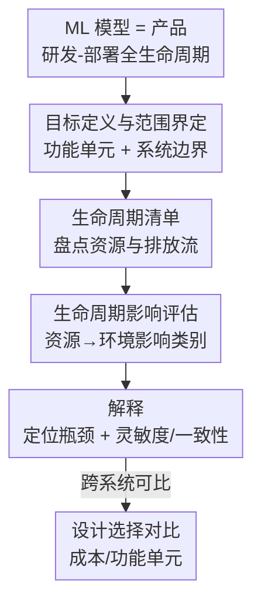

# Position: Evaluation of ML Resource Utilization Requires Model Life Cycle Assessment

**会议**: ICML 2026  
**arXiv**: [2606.07632](https://arxiv.org/abs/2606.07632)  
**代码**: 无（立场论文）  
**领域**: Green AI / ML 资源与环境影响评估  
**关键词**: 生命周期评估, 能耗与碳排, 嵌入式成本, 功能单元, 可持续 AI

## 一句话总结
这是一篇立场（Position）论文，主张评估 ML 模型的资源消耗与环境影响不能再只盯"单次训练"或"单次推理"的边际成本，而应借鉴工业生态学成熟的**生命周期评估（LCA）**，把硬件制造的嵌入式成本到训练/推理的运营成本在整条研发-部署生命周期上聚合归因，并给出了一套 LCA-for-ML 的四阶段方法、成本归因公式与 OLMo2 案例。

## 研究背景与动机

**领域现状**：随着 scaling 范式持续，数据中心被预测到 2030 年将消耗超过美国 10% 的总电力，相关投资以千亿美元计。学界已涌现大量 ML 效率评估与高效方法研究（综述、专门会场都有），这是理解 AI 资源需求的必要第一步。

**现有痛点**：但现有评估方法没有跟上系统复杂度的增长，存在三大缺陷。一是**依赖代理指标**：FLOPs、参数量这类理论代理常与真正关心的延迟、能耗相关性不高，对需要标准化核算的利益相关方没有信息量。二是**只算单一阶段**：现有工作要么算大规模训练的能/水耗、要么算单次推理的边际成本、要么算硬件制造的嵌入式成本，但只盯一个阶段无法度量"决定造一个新模型"的总资源与环境代价——尤其现代 LLM 的研发部署管线已远比经典 train-test 复杂（多阶段预/后训练、合成数据/蒸馏/奖励模型等辅助模型、各种推理时算法、异构硬件部署）。三是**行业级预测脱离真实负载**：数据中心能耗预测靠芯片出货量和能效估算，抽象层级太高，掩盖了单个工作负载，无法评估某个具体模型或某项效率改进的真实影响（年度负载增长预期甚至相差 4 倍以上）。

**核心矛盾**：AI 成本和影响范围在飞速膨胀，但度量方法仍停留在"算某一个边际步骤"的粒度——一个阶段的效率提升可能把成本转移到另一个阶段（如把训练算力挪到推理时计算），单阶段视角根本捕捉不到这种跨阶段的相互作用。

**本文目标**：论证 ML 资源评估"需要"生命周期评估，并把工业生态学里成熟的 LCA（ISO 14040/14044 标准化）落地到 ML 模型上——给出功能单元、系统边界、四阶段流程、成本归因公式，再正面回应若干反对意见，最后提出落地所需的数据与工具缺口。

**切入角度**：作者观察到 LCA 在半导体与计算硬件领域已被成熟用来量化制造/回收/使用的嵌入式与运营碳成本，但系统性地把 LCA 用于 ML 模型本身（而非硬件）还处于萌芽期——这正是空白。

**核心 idea**：把 ML 模型当作一个"产品"，用"从摇篮到坟墓（cradle-to-grave）"的 LCA 框架，按统一的功能单元和系统边界，把嵌入式成本 + 训练/实验运营成本 + 推理成本聚合并随使用摊销，从而做可比、可定位瓶颈的资源评估。

## 方法详解

### 整体框架
论文提出的"评估对象"是 ML 模型的整条生命周期，而非某一个阶段。LCA 把一个产品的资源消耗与排放按制造、使用、处置等阶段分解，并把上游阶段（硬件制造、模型训练）的成本汇总后摊销到使用中。落到 ML：以一个**功能单元（functional unit）**——对所提供服务的定量参照（如"一组语言任务的训练好的基础模型"或"模型处理的一批查询请求"）——为基准，圈定**系统边界**，再走 ISO 标准定义的四个阶段：目标定义与范围界定 → 生命周期清单 → 生命周期影响评估 → 解释。整套流程让"嵌入式成本（硬件制造）+ 运营成本（训练、实验、推理）"能在统一口径下聚合、归因、并定位哪一阶段是资源瓶颈。下图给出这条 LCA-for-ML 流水线：

### 关键设计

**1. 功能单元与系统边界：让原本不可比的能耗数字变得可比**

现有 ML 能耗报告最大的问题是没有统一参照——不同厂商（OpenAI、Google）报的能耗因为服务的工作负载不同而无法直接比，水耗估计甚至因是否计入 Scope 2 离场水耗而相差几个数量级。LCA 的第一阶段强制先定义**功能单元**：它是"所提供价值"的定量参照，随利益相关方而变——基础模型开发方关心的可能是"一族语言任务训练模型"，下游用户关心的是"一批被处理的查询请求"。配套要圈定**系统边界**，明确哪些资源流纳入评估。只有把功能单元和系统边界标准化，跨模型、跨厂商的资源数字才谈得上可比，这是整个方法的前提。

**2. 产品系统建模：把现代 LLM 的复杂研发-部署管线纳入一张账**

经典 ML 只是"小规模同分布数据上训练 + 验证"，而现代 LLM 的研发包含神经架构搜索、AutoML、长上下文预训练、持续重训练等多阶段，推理侧又新增思维链、自我精炼、工具调用、检索增强、上下文学习等范式，还跨异构硬件部署。LCA 把这些都建模为一个"产品系统"，对每个阶段关联输入资源与输出排放/废弃物，使得**一个阶段的效率改进对另一阶段资源的影响**（如把算力从训练挪到推理时计算）能被显式核算——这正是单阶段评估做不到的。同样地，系统边界必须一致，否则评估互不可比。

**3. 清单、影响评估与解释：从资源流量化到瓶颈定位**

第二阶段**生命周期清单**盘点并量化与功能单元相关的环境流——既包括嵌入式成本（稀土、PFAS、CFCs 等），也包括运营使用中的能、水、碳排、空气污染。第三阶段**生命周期影响评估**用标准转换/特征化因子（如 EPA 的 TRACI）把清单里的资源换算成具体影响类别——全球变暖、臭氧损耗、水耗导致的健康影响等；当前 LLM 厂商虽开始报能耗和 CO2e，但下游环境影响基本仍未披露。第四阶段**解释**做三件事：识别清单与评估中的显著问题（即对总结果影响最大的生命周期环节）、评估数据的完整性/灵敏度/一致性、给出结论与建议——从而把资源瓶颈（硬件制造、前期训练、还是边际推理）精确定位出来，指导"哪种模型设计能用最少资源产出该功能单元"。

**4. 成本归因公式：把嵌入式与上游训练成本摊销进单位功能成本**

作者给出一个具体的成本归因例子：以"一批被 LLM 处理的样本"为功能单元，单位功能成本 $C_{\text{FU}}$ 不只是边际推理成本，还要摊上上游训练与硬件制造：

$$C_{\text{FU}} = C_{\text{Per Inference}} + \frac{\text{Hardware Utilization Time}\times C_{\text{Embodied}}}{\text{Hardware Lifespan}} + \frac{C_{\text{Experimentation}}+C_{\text{Training}}}{\text{Total Lifetime Inferences}}$$

其中第二项用"时间分摊（time-share）"法把 GPU 制造的嵌入式成本按工作负载占硬件可用寿命的比例归因（作者明确指出嵌入式成本的归因方法本身仍是开放问题），第三项把训练与实验成本除以全生命周期总推理次数摊销。嵌入式成本可从硬件厂商一方披露（如 NVIDIA）获得，运营成本可用 nvidia-smi/DCGM、Intel VTune 等免费工具在负载中直接测量。该公式让"提升服务批处理效率→提高硬件利用率→固定碳预算下能服务更多请求"这类设计权衡变得可量化对比。

### 一个例子：OLMo2 7b 的全生命周期 CO2e
以 OLMo2 7b 的训练 + 推理为例（推理效率估计基于 ShareGPT 数据、假设 GPU 4 年寿命）：把资源消耗按生命周期阶段分解后能看到几个关键现象——通过离线批处理（offline batching）提升推理效率会降低单位功能成本；嵌入式成本随模型被使用次数增多而摊薄；而**单位推理成本对模型"寿命"（总推理次数）极其敏感**——只有当模型被使用至少数百亿次后，推理成本才开始超过前期训练成本。这个案例直观说明了为何只算单阶段会严重误判：前期固定成本只有在海量使用下才被摊平。

## 实验关键数据

> 立场论文无传统实验，核心证据是 OLMo2 案例分析（Figure 2）与对反对意见的正面回应。

### 案例关键发现

| 现象 | 含义 |
|------|------|
| 提升推理批处理效率 → 单位成本下降 | 服务侧设计选择直接改变 $C_{\text{FU}}$ |
| 嵌入式成本随使用次数摊薄 | 单阶段（只算制造）会高估单位影响 |
| 单位推理成本对总寿命极敏感 | 需数百亿次推理后推理成本才超训练成本 |
| 行业自报：Meta/Google 推理占 AI 用电 70%/60% | 部署侧主导，但研究者场景反由训练/实验主导 |

### 对反对意见的回应

| 反对观点 | 作者回应 |
|----------|---------|
| 效率改进会抵消 AI 成本增长 | 杰文斯悖论（Jevons' paradox）：单位变便宜反而刺激总用量上升，问题转为资源分配而非单纯减量 |
| 硬件 LCA 比模型 LCA 更有用 | 硬件 LCA 服务基建方，但模型跨异构硬件运行，模型 LCA 才对开发者/用户可解释 |
| 资源集中在单一阶段，无需 LCA | 前期固定成本巨大，需数百亿次推理才被摊平；多智能体等新范式还会增阶段 |
| 信息不可得，LCA 不可行 | 可用代表性均值/二级数据、技术报告、披露（NVIDIA 嵌入式成本、EcoInvent、EU AI Act 强制报告）估算 |

### 落地缺口（Call to Action）
- **以用户为中心的指标**：功能单元应锚定真实用例的延迟/成本/能耗约束，而非只测硬件利用或速度。
- **开发方透明披露**：需公开嵌入式成本、推理规模/频率/配置，而非只报最终训练 run。
- **公共机构标准化**：EU AI Act、白宫 AI Action Plan 已要求 GPAI 报告；EU 已要求 2027 年前向监管机构报告含能效的技术细节。
- **更细粒度监测**：能耗不止 GPU，还含 CPU/内存/磁盘/互连；现有工具常只测 GPU、或用 TDP 上界近似，需逐组件直接测量。
- **跨学科协作**：与计算系统、半导体、环境科学、公共健康等领域协作才能评估全谱影响。

## 亮点与洞察
- **方法论迁移而非新算法**：把工业生态学成熟、标准化（ISO 14040/14044）的 LCA 框架引入 ML 评估，给一个本就缺乏统一口径的领域提供了现成的、可被监管直接采用的脚手架。
- **"功能单元 + 系统边界"是点睛之笔**：一针见血指出现有能耗/水耗数字差几个数量级的根因不是测不准，而是没有统一参照；这套语言可立即用于规范厂商报告。
- **跨阶段权衡的可量化**：推理时计算 vs 额外训练、持续预训练 vs 全量重训这类"把成本在阶段间搬来搬去"的设计，只有 LCA 能算清净收益——对 reasoning 模型时代尤其重要。
- **成本归因公式可直接复用**：$C_{\text{FU}}$ 把嵌入式 + 训练 + 实验 + 推理摊到单位功能上，是任何想做 Green AI 核算的研究者的现成模板。

## 局限与展望
- 作为立场论文，缺乏对某个具体模型完整端到端 LCA 的实证落地，案例（OLMo2）也依赖若干假设（4 年硬件寿命、ShareGPT 推理分布）。
- 嵌入式成本的归因方法（作者用简单时间分摊）本身仍是开放问题，不同归因法可能给出差异很大的结论。
- LCA 高度依赖厂商披露的私有数据，在竞争壁垒下数据可得性仍是现实障碍；论文虽给出"用二级数据估算"的退路，但精度与可比性受限。
- 杰文斯悖论意味着即便 LCA 把单位成本算清，也未必能阻止总量增长——评估是必要条件而非充分条件。

## 相关工作与启发
- **vs 单阶段能耗核算（Strubell 训练能耗 / Luccioni 推理边际成本 / 硬件嵌入式成本）**：它们各算一段，本文主张把这些聚合进同一条生命周期账并显式建模阶段间相互作用。
- **vs 硬件/数据中心 LCA（Gupta et al. / NVIDIA 披露）**：硬件 LCA 面向基建方、算物理设施；模型 LCA 面向模型开发者与用户、算"服务一个 LLM 请求或训练一个模型"的 tCO2e，更可解释。
- **vs 行业能耗预测（Shehabi / Green et al.）**：行业级预测抽象到掩盖单个负载，无法评估具体模型或效率改进的真实影响；模型 LCA 锚定真实工作负载补上这一粒度。

## 评分
- 新颖性: ⭐⭐⭐⭐ 非新算法，但首次系统性地把标准化 LCA 框架落到 ML 模型评估，填补方法论空白
- 实验充分度: ⭐⭐⭐ 立场论文，以案例 + 反方回应为主，缺完整端到端实证 LCA
- 写作质量: ⭐⭐⭐⭐⭐ 论证结构清晰，正反两面充分，落地缺口具体可执行
- 价值: ⭐⭐⭐⭐⭐ 对 Green AI 评估与 AI 能耗监管标准制定有直接、及时的指导意义

<!-- RELATED:START -->

## 相关论文

- [\[ICML 2026\] Comprehensive AI Governance Requires Addressing Non-Model Gains](comprehensive_ai_governance_requires_addressing_non-model_gains.md)
- [\[AAAI 2026\] Forest vs Tree: The (N, K) Trade-off in Reproducible ML Evaluation](../../AAAI2026/others/forest_vs_tree_the_n_k_trade-off_in_reproducible_ml_evaluation.md)
- [\[ICML 2025\] Position: AI Evaluation Should Learn from How We Test Humans](../../ICML2025/others/position_ai_evaluation_should_learn_from_how_we_test_humans.md)
- [\[NeurIPS 2025\] Fostering the Ecosystem of AI for Social Impact Requires Expanding and Strengthening Evaluation Standards](../../NeurIPS2025/others/fostering_the_ecosystem_of_ai_for_social_impact_requires_expanding_and_strengthe.md)
- [\[ICML 2026\] nD-RoPE: A Generalized RoPE for n-Dimensional Position Embedding](nd-rope_a_generalized_rope_for_n-dimensional_position_embedding.md)

<!-- RELATED:END -->
