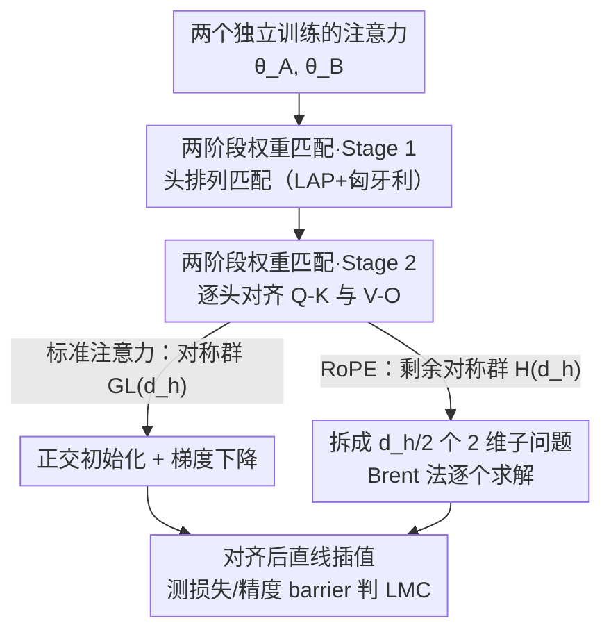

# Functional Equivalence in Attention: A Comprehensive Study with Applications to Linear Mode Connectivity

**会议**: ICML 2026  
**arXiv**: [2606.17830](https://arxiv.org/abs/2606.17830)  
**代码**: 未提及  
**领域**: 神经网络理论 / 参数对称性 / 优化几何  
**关键词**: 函数等价、位置编码、RoPE、线性模式连通性、权重匹配

## 一句话总结
这篇论文从理论上刻画了带位置编码的 Transformer 注意力的「函数等价」对称群——证明正弦位置编码保持原始注意力的对称结构、而 RoPE 把对称群大幅压缩从而提升表达力，并据此设计了一个适配两种位置编码的两阶段权重匹配算法，系统验证了不同设置下的线性模式连通性（LMC）。

## 研究背景与动机
**领域现状**：神经网络的参数空间是「非单射」的——不同的参数配置可以实现完全相同的函数，这就是函数等价（functional equivalence）。最典型的就是置换对称：交换隐藏单元的顺序不改变网络函数。在全连接网络和卷积网络里这套对称结构早已被研究透彻，也是理解损失景观、权重集成、模式连通性的关键工具。

**现有痛点**：到了注意力架构，对称结构要复杂得多。已有工作（Tran et al. 2025）虽然刻画了「原始（vanilla）多头注意力」的完整对称群，但它们都默认没有位置编码——而位置编码恰恰是现代 Transformer 不可或缺的部件。问题在于：位置编码会**改写注意力的内部结构**，因此原始情形下的对称性结论不能直接照搬。没有这套刻画，针对 Transformer 的权重对齐、LMC 分析就缺了地基。

**核心矛盾**：注意力本身是置换不变的，必须靠位置编码注入顺序信息；但不同位置编码注入信息的「方式」不同——绝对位置编码（APE，如正弦）是在输入上做加法，相对位置编码（RPE，如 RoPE）是在 Query-Key 之间插入一个依赖相对位置的旋转。这种结构差异会不会改变参数对称群？没人系统回答过。

**本文目标**：(1) 形式化刻画带位置编码（正弦、RoPE）的多头注意力的函数等价对称群；(2) 把这套刻画落地为一个权重匹配算法；(3) 用它实证研究 Transformer 在各种规模、模态下的线性模式连通性。

**切入角度**：作者抓住「位置编码以何种代数方式介入注意力计算」这个点——加法注入是双射、不改内部结构；旋转注入则阻断了某些群作用的相消，从而压缩对称群。

**核心 idea**：用「位置编码如何改变群作用的相消性」来解释对称群的变化——正弦编码保持对称群不变，RoPE 把 Query-Key 那一支的 $\mathrm{GL}(d_h)$ 对称压缩成一个更小的阿贝尔子群 $H(d_h)$，对称越少意味着表达力越强，这为 RoPE 在实践中胜出提供了一个原理性解释。

## 方法详解

### 整体框架
论文由「理论刻画」和「算法落地」两部分串起来。理论部分先回顾原始多头注意力（MHA）的对称群，再逐个分析正弦位置编码和 RoPE 如何改写注意力的内部结构、进而改写对称群；算法部分则把刻画出来的对称群转化为一个**两阶段权重匹配算法**，用它把两个独立训练的 Transformer 对齐，最后在参数空间做直线插值、量化损失/精度 barrier 来判断是否存在 LMC。

记原始 MHA 为 $\mathrm{MHA}(x;\theta)=\sum_{i=1}^{h}\mathrm{softmax}\big((xW_i^Q)(xW_i^K)^\top\big)\,xW_i^V (W_i^O)^\top$，参数 $\theta=\{W_i^Q,W_i^K,W_i^V,W_i^O\}_{i=1}^h$。已知它的对称群是 $G_{\mathrm{Att}}(d_h,h)=S_h\times(\mathrm{GL}(d_h)\times\mathrm{GL}(d_h))^h$：$S_h$ 是头之间的置换，每个头上还有两组 $\mathrm{GL}(d_h)$ 作用（一组作用在 Q-K 上、一组作用在 V-O 上），这些作用在矩阵乘法里相互抵消，所以不改变函数。本文要回答的是：加了位置编码后，这个群还成立吗？

下图是算法部分（权重匹配）的流水线，理论部分（对称群刻画）是它的代数前提：

### 关键设计

**1. 位置编码如何重塑对称群：加法注入不变、旋转注入压缩**

这是全文的理论核心，直接针对「原始情形的对称结论能否搬到带位置编码的注意力」这个痛点。对正弦编码，位置向量 $p$ 是直接加到输入上的：$\mathrm{MHA}_{\text{Sinusoidal}}(x;\theta)=\mathrm{MHA}(x+p;\theta)$。由于映射 $x\mapsto x+p$ 是一个双射、且完全不触碰注意力的内部权重结构，所以它对参数对称性的分析毫无影响——带正弦编码的函数等价类与无位置编码时**完全一致**，对称群仍是 $G_{\mathrm{Att}}$。

RoPE 则完全不同。它在每个头里把 Query 和 Key 用一个依赖相对位置的块对角旋转矩阵 $R_{m-n}$ 隔开：$\mathrm{MHA}_{\text{RoPE}}(x;\theta)=\sum_i \mathrm{softmax}\big[x_m W_i^Q R_{m-n}(W_i^K)^\top x_n^\top\big]\,xW_i^V(W_i^O)^\top$。关键在于：V-O 那一支仍是纯乘法、结构跟原始情形一致，所以 $\mathrm{GL}(d_h)$ 对 V-O 的作用照样相消；但 Q-K 这一支被 $R_{m-n}$ 插了进来，原本 $W_i^Q U_i^\top$ 与 $(W_i^K U_i^{-1})^\top$ 之间的 $U_i U_i^{-1}$ 相消被旋转矩阵破坏了，于是一般地 $\mathrm{MHA}_{\text{RoPE}}(\cdot;\theta)\neq\mathrm{MHA}_{\text{RoPE}}(\cdot;g\theta)$。这意味着 RoPE 的对称群被压缩了——对称越少，等价的参数配置越少，模型能区分的函数越多，表达力越强。这就把「RoPE 为什么好用」从经验观察提升成了一个对称性层面的解释。

**2. RoPE 的剩余对称群 $H(d_h)$：只剩与旋转可交换的那部分**

承接上一点，作者进一步把 RoPE 下「Q-K 还能保留多少对称」精确刻画出来。能保留的 $U_i$ 必须与所有相对旋转 $R_{m-n}$ 可交换，于是作者构造了块对角矩阵 $P_i$（第 $i$ 个 $2\times2$ 块是单位阵、其余为零）和 $J_i$（第 $i$ 块是 $\begin{psmallmatrix}0&-1\\1&0\end{psmallmatrix}$），定义剩余对称群

$$H(d_h):=\Big\{U=\textstyle\sum_{i=1}^{d_h/2}(a_iP_i+b_iJ_i):(a_i,b_i)\in\mathbb{R}^2\setminus\{(0,0)\}\Big\}.$$

它是 $\mathrm{GL}(d_h)$ 的一个阿贝尔子群，同构于 $(\mathbb{C}^\times)^{d_h/2}$——直观上每个 $2\times2$ 块只剩「复数乘法」那点自由度（缩放 + 旋转），远小于原来整个 $\mathrm{GL}(d_h)$。这个刻画不仅在理论上把 RoPE 的对称群补全（填补了文献空白），也直接决定了后面权重匹配时 Q-K 该在多大的群里优化。

**3. 两阶段权重匹配算法：先离散排列、再连续对齐，按位置编码切换搜索群**

有了对称群刻画，对齐两个注意力 $\theta_A,\theta_B$ 就等价于在对称群里找一个最优群元素 $g$。作者借鉴 Weight Matching，把它拆成两步，做到**数据无关**且同时适配标准注意力与 RoPE。Stage 1 解决头的排列：构造代价矩阵时用 $M_i=W_i^Q(W_i^K)^\top$、$N_i=W_i^V(W_i^O)^\top$，并对 $M_i$ 逐行做中心化 $\bar M_i=M_i-\tfrac1d(M_i\mathbf 1)\mathbf 1^\top$ 以吸收 softmax 的平移不变性，再以 $C_{ij}=\|\bar M_i^A-\bar M_j^B\|_F^2+\|N_i^A-N_j^B\|_F^2$ 为代价，转成线性分配问题（LAP），用匈牙利算法在 $O(h^3)$ 内求最优置换 $\sigma^*$。这个代价矩阵被特意设计成对 Q-K、V-O 上的群作用不变，保证排列匹配本身不受连续对称干扰。

Stage 2 解决头内的连续对齐：重排后逐头分别对齐 Q-K 和 V-O，目标如 $L_{Q,K}(U_i)=\|W_{i,A}^Q-W_{i,B}^Q U_i^\top\|_F^2+\|W_{i,A}^K-W_{i,B}^K U_i^{-1}\|_F^2$。对标准注意力，$U_i$ 在 $\mathrm{GL}(d_h)$ 里用梯度下降优化，并从一个「约束 $U_i$ 为正交」的闭式解出发做初始化；对 RoPE，搜索空间收缩到 $H(d_h)$，恰好**解耦成 $d_h/2$ 个独立的 2 维子问题**，每个再化为一元标量最小化，用 Brent 法高效求解。V-O 的对齐同理。这一步把「对称群的代数结构」直接转化成了「优化问题的可解结构」——RoPE 群越小，优化反而越简单。

### 损失函数 / 训练策略
匹配算法本身不训练网络，而是在两个已训练好的 checkpoint 上求对齐群元素；Stage 1 是组合优化（LAP），Stage 2 是在对应对称群内的连续优化（GL 上梯度下降、H 上 Brent 法）。判定 LMC 用损失 barrier $B(\theta_A,\theta_B)=\sup_{t\in[0,1]}\big[L(t\theta_A+(1-t)\theta_B)-tL(\theta_A)-(1-t)L(\theta_B)\big]$，barrier 近似为 0 即认为两解被一条低损直线连通。

## 实验关键数据

### 主实验
实验覆盖视觉（ViT on MNIST/CIFAR-10/100/ImageNet-1K）、语言建模（GPT-2、Llama on Enwik8/WikiText103/One Billion Word）、文本分类（BERT on AG News/IMDB/DBPedia），并对每个模型用 APE 与 RoPE 两种位置编码。考察四种「重新初始化」范围：首个注意力层、全部注意力层、首个 Transformer 层、整模型；在两个 checkpoint 间取 25 个等距点插值测性能。

| 重新初始化范围 | 小数据集 | 大规模数据集（ImageNet/WikiText103/Enwik8/1B Word） |
|------|------|------|
| 首个注意力层 | 稳定出现 LMC | 稳定出现 LMC |
| 首个 Transformer 层 | 出现 LMC | 出现 LMC（ImageNet 例外） |
| 全部注意力层 | 出现 LMC | 多数出现 LMC |
| 整模型 | 出现 LMC | **不出现 LMC**（大量扫头排列/种子仍无） |

核心结论：LMC 在「只重置注意力相关参数」时可靠出现，且**编码器架构（ViT/BERT）始终表现出 LMC**；但当整模型重置且数据/模型规模变大时，解码器大模型（大规模语言建模）下 LMC 可能消失——暗示规模上去后损失景观复杂到不足以支撑 LMC。

### 消融实验
在 6 层、4 头的 ViT/BERT 上（CIFAR-10/100、IMDB、DBPedia，首层替换），逐个消融匹配算法组件。Stage 1 用「所选头排列在全部 24 种排列中的 rank」和归一化指标 $\hat L=\tfrac{L_{\text{method}}-L_{\text{top1}}}{L_{\text{naive}}-L_{\text{top1}}}\times10^2$ 评估，结果 rank 低、$\hat L$ 近 0，说明排列匹配接近最优。Stage 2 的 barrier 比率（相对 naive 插值，越低越好）如下：

| 配置 | 说明 | 损失 barrier 比率 (%) |
|------|------|------|
| Variant 1 | 完全去掉 Stage 2 | 62–91（高且不稳定）|
| Variant 2 | 仅正交初始化、无梯度下降 | 10–16 |
| Full | 正交初始化 + 梯度下降微调 | **7–12（最低最稳）** |

### 关键发现
- 头排列匹配（Stage 1）几乎能选到最优排列，且可视化显示「选错排列会显著恶化连通性」，说明精确匹配是必要的。
- Stage 2 的两个组件缺一不可：仅正交初始化已把 barrier 从 60–90% 降到 10–16%，再加梯度下降微调进一步压到 7–12%——初始对齐负责「找对盆地」，微调负责「精修」。
- 位置编码类型本身（APE vs RoPE）在 barrier 数值上差异不大，但 RoPE 的对齐在 Stage 2 因群更小而拆成低维子问题、求解更结构化。

## 亮点与洞察
- 把「RoPE 为什么强」从经验叙事提升为对称性解释：旋转注入破坏了 Q-K 上的群相消，压缩对称群、扩大可区分函数集——这是一个很干净的「结构↔表达力」论证。
- $H(d_h)\cong(\mathbb{C}^\times)^{d_h/2}$ 这个刻画很优雅：它既补全了 RoPE 的对称群理论，又恰好让权重匹配的 Stage 2 解耦成一堆 2 维子问题，理论刻画直接换来算法上的可解性。
- 「编码器恒有 LMC、解码器大模型可能失去 LMC」是一个值得继续追的实证现象，提示 LMC 并非普适、规模会改变损失景观的连通性。
- 代价矩阵里对 $M_i$ 做行中心化以吸收 softmax 平移不变性，是个可复用的小 trick——凡是带 softmax 的相似度匹配都可借鉴。

## 局限与展望
- 作者承认：大规模模型下的 LMC 行为仍理解不足，已有工作多集中在中小模型；本文虽观察到 LMC 在某些设置失效，但「证否 LMC」本身很难，因为它依赖对全部对称性的完整刻画与显式权重匹配。
- 理论只覆盖正弦与 RoPE 两类位置编码，其他相对位置编码（如可学习 RPE、ALiBi 等）未刻画；FFN、残差、LayerNorm 等组件的对称性也未纳入完整 Transformer 块的分析。
- 匹配算法 Stage 2 在标准注意力上需在 $\mathrm{GL}(d_h)$ 做梯度下降，可能受初始化与局部极小影响；实验规模上 barrier 仍有 7–12% 的残余，未完全消除。
- 改进方向：把对称刻画扩展到更多位置编码与整块 Transformer、用 $H(d_h)$ 的解耦结构设计更快的对齐器、并系统研究 LMC 失效与模型泛化/规模的定量关系。

## 相关工作与启发
- **vs 原始注意力对称性刻画（Tran et al. 2025）**: 他们刻画无位置编码 MHA 的对称群 $G_{\mathrm{Att}}$，本文把分析推进到带位置编码的现实设置，指出正弦保持、RoPE 压缩，填补了 RoPE 对称群的理论空白。
- **vs Weight Matching / Git Re-Basin（Ainsworth et al. 2023）**: 他们的权重匹配面向通用 MLP/CNN，本文针对注意力的特殊对称结构（头置换 + Q-K/V-O 双 GL，RoPE 下收缩为 $H(d_h)$）定制了两阶段算法，并显式处理 softmax 平移不变性。
- **vs Transformer 匹配（Theus et al. 2025）**: 他们的匹配忽略了 Q-K、K-V 组件中的对称，本文给出更完整的群刻画与对应对齐方法。

## 评分
- 新颖性: ⭐⭐⭐⭐⭐ 首次完整刻画 RoPE 下注意力的对称群，并把它落地为匹配算法。
- 实验充分度: ⭐⭐⭐⭐ 覆盖多模型/多模态/多规模与四种重置范围，但大模型 LMC 失效只给现象未深挖机理。
- 写作质量: ⭐⭐⭐⭐ 理论叙述严谨、结构清晰，符号偏重需要一定背景。
- 价值: ⭐⭐⭐⭐ 为 RoPE 优势提供原理解释，并给 Transformer 的模型对齐/合并提供可用工具。

<!-- RELATED:START -->

## 相关论文

- [\[NeurIPS 2025\] Generalized Linear Mode Connectivity for Transformers](../../NeurIPS2025/others/generalized_linear_mode_connectivity_for_transformers.md)
- [\[ICLR 2026\] Do We Really Need Permutations? Impact of Model Width on Linear Mode Connectivity](../../ICLR2026/others/do_we_really_need_permutations_impact_of_model_width_on_linear_mode_connectivity.md)
- [\[ICML 2026\] Test-Time Training with KV Binding Is Secretly Linear Attention](test-time_training_with_kv_binding_is_secretly_linear_attention.md)
- [\[NeurIPS 2025\] Scalable Inference of Functional Neural Connectivity at Submillisecond Timescales](../../NeurIPS2025/others/scalable_inference_of_functional_neural_connectivity_at_submillisecond_timescale.md)
- [\[ICML 2026\] Connecting Independently Trained Modes via Layer-Wise Connectivity](connecting_independently_trained_modes_via_layer-wise_connectivity.md)

<!-- RELATED:END -->
