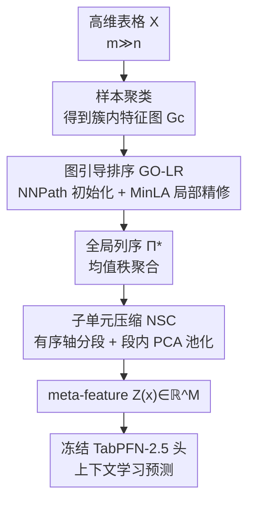

# GOTabPFN: From Feature Ordering to Compact Tokenization for Tabular Foundation Models on High-Dimensional Data

**会议**: ICML 2026  
**arXiv**: [2606.05441](https://arxiv.org/abs/2606.05441)  
**代码**: 待确认  
**领域**: 表格基础模型 / 高维数据 / 特征排序 / 紧凑 tokenization  
**关键词**: TabPFN、HDLSS、特征排序、MinLA、子单元压缩

## 一句话总结
针对"特征远多于样本"（HDLSS）的高维表格任务，本文不动 TabPFN 主干，而是先用图引导的特征排序（GO-LR）把相关特征排到相邻位置，再用神经启发的子单元压缩（NSC）把相邻特征段池化成少量 meta-feature，从而把成千上万维表格塞进 TabPFN 能吃的特征预算里，在 8 个基因/图像类 HDLSS 数据集上取得平均排名第一。

## 研究背景与动机

**领域现状**：TabPFN 这类表格基础模型靠在合成表格上预训练 + 上下文学习（in-context learning），无需逐数据集训练就能给出很强的表格预测。但主流版本（如 TabPFN-2.5）的设计和评测都假设输入特征数大致在 2000 以内。

**现有痛点**：很多真实 HDLSS 场景——基因表达、质谱、图像展平成的表格——特征数 $m$ 动辄上万，而样本数 $n$ 只有几十到几百，即 $m\gg n$。这类输入直接超出 TabPFN 的工作区间，必须先做特征选择或压缩，否则要么跑不动、要么过拟合。而单纯做特征选择往往不够：在 $n\ll m$ 时，连 MLP、Lasso 这种简单模型都可能打败"高级"表格方法，说明缺的不是选特征，而是组织特征。

**核心矛盾**：表格数据天然没有图像/文本那种空间或时序结构，列的顺序是任意的，相关特征散落各处。想做"按相邻段压缩"，前提是相关特征得先聚到一起；可一旦盲目压缩（如全局 PCA），又会得到随子样本和随机种子漂移的潜变量，没有稳定坐标系——而 TabPFN 恰恰假设输入空间是固定、一致参数化的。于是"压缩降维"和"表示可复现"之间存在张力。

**本文目标**：在**不重训、不改 TabPFN 主干**的前提下，把 $m\gg n$ 的高维表格转成一个维度可控（$M\ll m$）、且可复现的紧凑表示，让 TabPFN 风格预测器在真·高维场景重新可用。

**切入角度**：作者把"学一个好的列顺序"形式化为组合优化问题——列排列问题（CPP），并证明它等价于加权最小线性排布（MinLA）。有了好的顺序，就能把"相邻 = 相关"这一结构性约束变成压缩的依据。

**核心 idea**：用"先排序再分段池化"代替"直接选特征/全局降维"来解决 HDLSS 的输入瓶颈——GO-LR 负责把相关特征排到相邻，NSC 负责把相邻段压成稳定 meta-feature。

## 方法详解

### 整体框架

GOTabPFN 是一个**前置压缩接口 + 冻结 TabPFN 头**的串行管线：输入是 $X\in\mathbb{R}^{n\times m}$ 的高维表格，输出是每个样本 $M$ 维（$M\ll m$）的紧凑 token 序列 $Z(x)$，直接喂给冻结的 TabPFN-2.5 做分类/回归。中间分三步：先按样本聚类、为每个簇估计特征相似图并求局部排序，聚合成单一全局列序 $\Pi^{\ast}$（GO-LR）；再沿这个有序轴把特征切成连续段、每段池化成一个标量 meta-feature（NSC）；最后把 meta-feature 序列交给冻结的 TabPFN 头，不做任何反向传播穿过主干。

### 关键设计

**1. GO-LR：把特征排序证成 MinLA，再用 TSP-path 启发式近似求解**

痛点是表格列无序、相关特征散落，没法做"相邻段压缩"。GO-LR 先对样本聚类得到 $k$ 个簇，在每个簇 $c$ 上建加权特征图 $G_c=(V,E,w^{(c)})$，边权 $w_{ij}$ 度量两特征的"不相似度"（如 $1-|\mathrm{corr}|$，也可用 JS/KL/余弦/欧氏）。局部排序 $\pi$ 是一个把特征映射到位置 $\{0,\dots,m-1\}$ 的双射，目标是最小化离散度：

$$D_{G_c}(\pi)=\sum_{(i,j)\in E} w_{ij}\,|\pi(i)-\pi(j)|$$

直觉是：边权越大（越不相似）越要拉开距离，反过来相似特征会被排到相邻。作者证明这个目标**逐字等价于加权 MinLA**（定理 3.1、引理 3.8），因而 NP-hard（引理 3.9），并且**严格泛化 TSP-path**——当把目标限制到"只算相邻位置 $(t,t+1)$ 的边"时，离散度退化成 TSP-path 的路径代价 $\mathrm{PathCost}(\sigma)=\sum_{t}d_{\sigma_t,\sigma_{t+1}}$（定理 3.12）。这套理论给了一个实用解法：用最近邻路径 NNPath 做初始化（这正是 TSP-path 启发式），再做局部精修——先在原序和反序里选离散度更小的方向，然后多趟相邻交换下降（SweepRefine），每次只接受让 $D_{G_c}$ 不增的交换并增量更新代价，保证 $D_{G_c}(\pi_c)\le D_{G_c}(\pi^{(0)})$。各簇的局部秩按簇权 $\alpha_c$（按簇均值离群程度的倒数归一）做均值秩聚合，$\bar r(j)=\sum_c \alpha_c r_c(j)$，再 argsort 得到唯一全局序 $\Pi^{\ast}$。

**2. NSC：神经启发的有序轴分段池化，把 m 维压到 M 维 meta-feature**

即便排好序，仍剩 $m$ 个原始特征要处理，$m\gg n$ 时仍然爆炸。NSC 的灵感来自皮层锥体神经元——一个神经元收 2–3 万个突触输入，却不是线性求和，而是组织成若干树突子单元，每个子单元把局部相关输入非线性地池化成一个子单元级信号。NSC 把这条"局部聚类 → 子单元压缩"原则当成 HDLSS 的归纳偏置：沿 $\Pi^{\ast}$ 把有序特征切成 $M$ 个连续段（子单元），段长 $s=\lceil m/M\rceil$，每段池化成一个标量 token，维度从 $m$ 降到 $M$。分段既可均匀切，也可"自适应切"——复用 GO-LR 已算的相似矩阵，定义相邻位置的转移不相似度 $\delta_t$，再按"最大跳变"或"等质量"（把累积 $\delta$ 当 CDF 切点）在特征轴的突变处下刀，让每个子单元都是被大跳变包住的有序邻域，且不额外引入 $O(m^2)$ 代价。

**3. SegPCA 池化 + 固定符号约定：让压缩结果可复现，配合 TabPFN 的固定输入假设**

朴素压缩会产生随机漂移的潜变量，破坏 TabPFN 对"固定一致输入空间"的假设。本文主用变体 NSC-pSP 解决这点：每段在**训练集上**学一个段专属的第一主成分方向 $v_t=\arg\max_{\|v\|=1}v^\top\Sigma_t v$，meta-feature 取中心化投影 $z_t(x)=(u_t(x)-\mu_t)^\top v_t$，得到一维 token 序列。关键是 $v_t$ 在训练时固定下来、推理时直接复用，并施加确定性的符号约定（如让投影与段内样本均值正相关），这样子空间不变但**跨 run、跨子样本可复现**。每样本复杂度 $O(m)$（用线性时间统计量时）。段数 $M$ 也不是拍脑袋定的，而是绑定到内在维度估计 $\hat d$：用 PCA 累积方差规则在阈值 $\tau$（如 0.90/0.95/0.99）下取 $\hat d_{\mathrm{PCA}}(\tau)=\min\{k:\mathrm{CUM}(k)\ge\tau\}$，再

$$M=\mathrm{clip}\big(\lceil 2\hat d\rceil,\;32,\;\min(512,m)\big)$$

让 meta-feature 数随**内在**维度而非环境维度走——高度冗余时狠压、特征本就紧凑时（如 $m\le 400$）干脆 $M=m$ 绕过压缩。最后把 $Z(x)$ 喂冻结 TabPFN-2.5：每个 train/val 划分上 fit 一次、评测一次，不反传穿过头。

### 损失函数 / 训练策略

整条管线的核心不是端到端反传：GO-LR 是组合优化求解（启发式 + 单调下降的局部精修），NSC 的 PCA 方向和段统计都在训练集上一次性拟合并固定，TabPFN 头是冻结的上下文学习器。可学的只有 NSC 里可选的轻量共享池化网络 $g_\theta$（把段描述子映成 meta-feature 的浅 MLP），其余皆为无学习/确定性步骤——这正是它"不重训大主干"的卖点。评测用 $5\times5$ 交叉验证、按 accuracy（回归用 $R^2$）报告。

## 实验关键数据

### 主实验

在 8 个 HDLSS 数据集（结肠/肺/基因表达/Arcene 等，特征数 2000–22283、样本数仅 62–203）上，GOTabPFN 取得**全部 8 个数据集第一**、平均排名 $1.00$，明显优于第二名 TANDEM（排名 $3.63$）和各 TabPFN 变体：

| 数据集（#特征/#样本） | 指标 | GOTabPFN | 次优 | 备注 |
|--------|------|------|----------|------|
| Colon (2000/62) | Acc | **88.18** | 87.85 (TabPFN-W) | 高维基因 |
| GLI-85 (22283/85) | Acc | **93.82** | 91.53 (TANDEM) | 最高维 |
| SMK (19993/187) | Acc | **74.23** | 72.72 (TANDEM) | 极高维 |
| ALLAML (7129/72) | Acc | **97.54** | 97.16 (TabPFN-W) | — |
| 平均排名（8 数据集） | Rank↓ | **1.00** | 3.63 (TANDEM) | 全胜 |

在 8 个跨域数据集（含图像展平表格 orlraws10P、CIFAR-10、Cell Cycle 42728 维等）上同样大面积领先：orlraws10P 达到 $100.00$、CIFAR-10 表格化 $88.45$、Cell Cycle $79.94$、回归任务 DrivFace $R^2=0.6548$，多数数据集仍是第一。

### 消融实验

NSC 提供四种变体，主方法用 NSC-pSP（自适应 $M$ + SegPCA 池化）：

| 变体 | 段数 $M$ 规则 | 池化方式 | 角色 |
|------|---------|------|------|
| NSC | 均匀分段 | 学习式池化 | 基础版 |
| NSC-P | PCA 内在维度规则 | 学习式池化 | 自适应预算 |
| NSC-SP | 固定 $M$ | SegPCA | 可复现池化 |
| NSC-pSP | PCA 内在维度规则 | SegPCA | **主方法** |

### 关键发现
- **特征数越高、收益越大**：在 GLI-85（22283 维）、SMK（19993 维）这类极端 HDLSS 上，GOTabPFN 相对 TabPFN-Wide 提升最明显（GLI 88.47→93.82），印证"先排序再压缩"对真·高维比单纯加宽窗口更有效。
- **稳定性同样提升**：作者强调在紧特征预算下不仅精度高、方差/稳定性也更好——这正是 SegPCA + 固定符号约定带来的可复现性在起作用。
- **TabPFN 主干不变就能扩到上万维**：把 22283 维压到 ≤512 维 meta-feature，让原本只支持 ~2000 特征的 TabPFN-2.5 直接可用，是工程上最实用的点。

## 亮点与洞察
- **把"列排序"证成 MinLA 并连到 TSP-path**，是少见的把表格预处理做成有理论支撑的组合优化：既给了 NP-hard 的难度界，也给了 NNPath + 局部精修这种可落地的近似算法，理论与实现对得上。
- **NSC 的可复现性设计很关键**：很多人会想"直接 PCA 降维不就行了"，本文点破朴素压缩潜变量会漂移、破坏 TabPFN 的固定输入假设，于是用训练集固定主方向 + 确定符号约定换来跨 run 一致——这个 caveat 可迁移到任何"冻结预训练头 + 前置降维"的范式。
- **把段数绑定到内在维度而非环境维度**，天然实现"该压狠压、不该压不压"，避免了在已经紧凑的数据上硬塞瓶颈。

## 局限与展望
- 方法依赖样本聚类质量与特征相似度度量的选择（corr/JS/KL/余弦…），在样本极少（$n$ 几十）时簇内相似图本身估计噪声大，论文未充分讨论度量敏感性。
- GO-LR 是启发式近似 MinLA，并不保证全局最优；局部交换精修只保证单调不增，最终序列的好坏与 NNPath 初始化强相关。
- 评测集中在生物/图像展平类 HDLSS，类别数普遍较小，对更复杂的多类、强混杂特征场景的泛化还需更多验证；冻结 TabPFN 头也意味着无法针对极端分布做适配。

## 相关工作与启发
- **vs TabPFN-Wide / TabICL**: 它们或加宽特征窗口、或对多种列排列做集成来抗排列敏感；本文不改主干，而是主动**学一个最优列序 + 压缩**，在上万维上更省算力也更准。
- **vs ProtoGate / Lasso（特征选择系）**: 选特征派在 $n\ll m$ 下常输给简单模型，本文论点是"选不如组织"——用可学排序把相关特征聚成可压缩邻域，而非丢弃特征。
- **vs 全局 PCA 降维**: 全局 PCA 潜变量随子样本漂移、无稳定坐标系；NSC 用有序分段 + 段内固定主方向 + 符号约定换来可复现表示，专为冻结 TabPFN 头设计。

## 评分
- 新颖性: ⭐⭐⭐⭐ 把表格列排序证成 MinLA/TSP-path 并配神经启发压缩，角度新颖且自洽
- 实验充分度: ⭐⭐⭐⭐ 16 个 HDLSS/跨域数据集、对比 55 个基线、$5\times5$ CV，主结果全胜
- 写作质量: ⭐⭐⭐⭐ 理论—算法—实验衔接清楚，但符号与变体命名偏密
- 价值: ⭐⭐⭐⭐ 让现成表格基础模型零重训扩到上万维，实用性强

<!-- RELATED:START -->

## 相关论文

- [\[ICML 2026\] TabSwift: An Efficient Tabular Foundation Model with Row-Wise Attention](tabswift_an_efficient_tabular_foundation_model_with_row-wise_attention.md)
- [\[NeurIPS 2025\] Radar: Benchmarking Language Models on Imperfect Tabular Data](../../NeurIPS2025/others/radar_benchmarking_language_models_on_imperfect_tabular_data.md)
- [\[ACL 2025\] Generating Synthetic Relational Tabular Data via Structural Causal Models](../../ACL2025/others/generating_synthetic_relational_tabular_data_via_structural_causal_models.md)
- [\[ICML 2026\] Cascaded Flow Matching for Heterogeneous Tabular Data with Mixed-Type Features](cascaded_flow_matching_for_heterogeneous_tabular_data_with_mixed-type_features.md)
- [\[ICLR 2026\] TabStruct: Measuring Structural Fidelity of Tabular Data](../../ICLR2026/others/tabstruct_measuring_structural_fidelity_of_tabular_data.md)

<!-- RELATED:END -->
