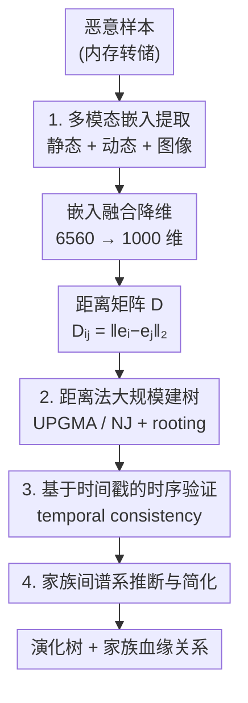

# MalTree: Tracing Malware Evolution from Embeddings at Scale

**会议**: ICML2026  
**arXiv**: [2606.06570](https://arxiv.org/abs/2606.06570)  
**代码**: [github.com/AJ730/MalwareEvolution](https://github.com/AJ730/MalwareEvolution)  
**领域**: 安全 / 表示学习应用  
**关键词**: 恶意软件演化, 系统发育树, 多模态嵌入, 时序验证, 谱系分析

## 一句话总结
MalTree 把生物信息学里的系统发育树技术（UPGMA、Neighbor-Joining）搬到恶意软件分析上：从内存转储里抽取静态+动态+图像三路嵌入，转成距离矩阵后大规模重建恶意软件家族的"演化树"，并首次用 VirusTotal 时间戳做时序验证（87% 时序一致性），在 10 万+ 样本、538 个家族上证明嵌入距离能近似真实演化序，把恶意软件分析从"逐样本分类"推向"谱系感知的演化建模"。

## 研究背景与动机
**领域现状**：恶意软件检测无论是基于签名、特征还是深度学习，本质上都是**被动反应式**的——模型在已知样本上训练，威胁一旦演化（加密、加壳、混淆、变形重编译）就逐渐失效、性能衰减（concept drift）。而 LLM 生成新型规避代码（如 WormGPT）让这场军备竞赛更激烈。

**现有痛点**：这种"逐样本"视角忽略了一个关键事实——恶意软件变种很少凭空出现，它们继承前代代码、共享构建工具包、通过迭代修改形成**谱系**（lineage）。传统逆向工程要揭示这种血缘关系需要数月到数年。

**核心矛盾**：系统发育（phylogenetics）这套从可测量"分歧度"重建祖先关系的方法，与恶意软件通过代码复用、模块化传播而演化的过程天然同构，但它在恶意软件分析里却长期被忽视。已有少量尝试要么只用单一模态、小样本集做树聚类，要么用最小生成树当代理却**不做时序验证**——也就没人回答过一个根本问题：推断出的树到底反映了真实的出现时间线，还是仅仅捕捉了特征相似度？

**本文目标**：① 大规模、自动地从恶意样本构建系统发育树；② 验证这些树是否反映真实演化序；③ 从树中读出可解释的家族级演化关系。

**核心 idea**：用多模态嵌入把每个样本编码成向量、转成距离矩阵，用距离法（UPGMA/NJ）大规模建树；再用 VirusTotal 的首次提交时间戳作为"出现时间"的代理，定义**时序一致性分数**来检验树的方向性是否站得住。

## 方法详解

### 整体框架
MalTree 是一条四阶段流水线：先从每个恶意样本的**内存转储**里抽取三路互补嵌入（伪静态、动态、图像），融合降维成 1000 维；再算两两欧氏距离得到距离矩阵 $D$；用 UPGMA 和 Neighbor-Joining 两种距离法重建系统发育树；最后用 VirusTotal 时间戳做时序验证、并从树里推断家族间的演化方向。之所以分析内存转储而非原始二进制，是因为原始文件常被加壳/混淆，而内存里是解密后的真实代码与运行态。

### 关键设计

**1. 内存转储上的多模态嵌入：用静态+动态+图像三路特征刻画样本**

单一模态（如纯字节图像）对加壳/编译方式敏感，报告的高准确率往往是数据集或标注伪影而非语义。MalTree 在受控虚拟机里执行样本、对**内存转储**抽三路互补嵌入：① **伪静态** $e_s\in\mathbb{R}^{3512}$——用 LIEF 抽 27 类特征（256 维字节直方图、256 维字节熵直方图、字符串表、头信息、节区元数据、导入导出、操作码序列），序列化成 JSON 后过 OpenAI `text-embedding-3-large` 得 3000 维，再拼 512 维直方图；② **动态** $e_d\in\mathbb{R}^{1000}$——从 ANY.RUN 沙箱和 VirusTotal 抽文件/命令/进程/注册表/服务/网络/互斥量等 15 类行为轨迹，过同一文本嵌入模型；③ **图像** $e_i\in\mathbb{R}^{2048}$——用 bin2png 把内存转储映射成 RGB 图、ResNet-50 两阶段训练（先在 MalImg/MaleVis/MalNet 上预训练到 85%，再微调到 $\sim 95\%$）取倒数第二层。三路拼成 6560 维后，经一个两层网络（家族标签上的交叉熵）归一化降到 1000 维、丢掉分类头。三模态互补：$e_s$ 编码句法结构、$e_d$ 捕捉运行行为、$e_i$ 反映字节级模式。

**2. 距离法大规模建树：UPGMA 与 Neighbor-Joining 从嵌入距离重建谱系**

字符法（最大简约/最大似然）需要序列比对，样本上千就扩展不动；MalTree 改用直接吃距离矩阵的距离法。每个样本表示为嵌入 $e_i$，距离矩阵 $D_{ij}=\|e_i-e_j\|_2$ 假定嵌入距离近似演化分歧度。两种算法各有取舍：**UPGMA** 每步合并平均距离最近的两簇，$d(C_i,C_j)=\frac{1}{|C_i||C_j|}\sum_{s_p\in C_i}\sum_{s_q\in C_j}D_{pq}$，产出 $O(n^2)$ 的有根超度量树，但假定**分子钟**（各谱系演化速率恒定）；**Neighbor-Joining** 放松分子钟、允许速率异质，从星形拓扑出发按 Q 矩阵 $Q_{ij}=(r-2)D_{ij}-\sum_k D_{ik}-\sum_k D_{jk}$ 反复合并，用 RapidNJ 达到近 $O(n^2)$，但产出无根树需额外定根（用最早 VirusTotal 时间戳的样本作外群 outgroup，或中点定根）。

**3. 基于 VirusTotal 时间戳的时序验证：用提交时间检验树是否反映真实演化序**

生信里的自助重采样假定位点独立、分子钟定标需要已知分裂时间，二者对"嵌入向量 + 无真值分歧日期"的恶意软件都不成立。MalTree 改用 VirusTotal **首次提交时间戳**（比文件创建时间可靠，后者会出现 1970 年这类错误）作为出现时间代理。核心是一个**路径长度假设**：共享同一直接父节点的兄弟样本，若 $L_i=d_T(s_i,a)<L_j$ 则 $s_i$ 更早出现——它只要求兄弟对内的**局部一致**，不要求全树速率恒定。**时序一致性分数**定义为：对每个叶子找直接父节点、比较所有兄弟对，树推断的先后与时间戳先后一致的对占比（随机排序约 50%）。家族内（intra-family）直接比到 MRCA 的路径长，家族间（inter-family）因共享祖先是深内部节点、噪声大，改用每家族叶子到根的**中位距离**做聚合比较。

**4. 家族间谱系推断与简化：从树中读出家族级的演化方向**

验证之外，MalTree 还用树推断家族间的演化关系：对每对家族找共享 MRCA、算各家族叶子到该祖先的中位路径距离，从距离短（更早分化）的家族向距离长的家族画**有向边**，边权等于源家族到 MRCA 的中位距离。为聚焦主干谱系，只保留每个节点的最小权出边来简化图——边权越低代表谱系关系越近、支持越强。同时做**嵌入漂移分析**：对跨年家族算不同年份样本嵌入间的欧氏距离，若速率均匀则各家族 min/max 漂移应一致，高方差则说明演化非均匀、支持用 NJ 而非 UPGMA。

## 实验关键数据

### 嵌入质量（家族分类，10 折交叉验证）
用逻辑回归线性探针衡量嵌入是否线性可分（高准确率才适合做距离法系统发育）：

| 嵌入 | 准确率 (%) |
|------|-----------|
| 图像 $e_i$ | 94.91 ± 0.16 |
| 融合 $e$ | 93.69 ± 0.19 |
| 伪静态 $e_s$ | 87.51 ± 0.48 |
| 动态 $e_d$ | 87.23 ± 0.19 |
| 随机猜测 | 19.36 ± 0.17 |

融合嵌入（93.69%）优于单独的伪静态/动态，说明融合保留了互补信息；图像嵌入单独最高（94.91%），视觉结构对家族区分力强。

### 树验证（时序一致性，全树 103,883 样本）
对比两种建树算法 × 三种定根策略：

| 方法 | Default | Outgroup | Midpoint |
|------|---------|----------|----------|
| NJ | 0.811 | **0.871** | 0.631 |
| UPGMA | **0.860** | 0.601 | 0.562 |

NJ + 外群定根取得最高 87.1% 时序一致性，确认时间戳元数据能有效定根；UPGMA 在其默认配置（本就产有根树）下最佳 86.0%，额外定根反而破坏结构；中点定根对两者都差，说明"最长路径"启发式不反映恶意软件演化。87% 远高于随机的 50%，证明嵌入距离确实近似演化分歧。

### 关键发现
- **演化速率高度非均匀**：Bashlite、Syslogk 等家族的嵌入漂移比其他家族高 **10 倍以上**，违反 UPGMA 的分子钟假设——这正是 NJ（允许速率异质）在正确定根下优于 UPGMA 的原因。
- **一致性不是过滤伪影**：去掉 5,385 个家族内离群样本（共 103,883）后一致性仅从 87.1% 升到 88.5%（+1.4 点），而非选择偏差会造成的大跳变，说明分数可信。
- **Mirai 案例对齐威胁情报**：在 10 万+ 样本上 NJ 树深 17、平均度 2、最大度 116；案例研究里 MalTree 识别出 Bashlite($w$=9.6)、Okiru($w$=10.0)、MooBot、Gafgyt、RapperBot 五个 Mirai 后代，与公开情报吻合，并用独立于嵌入的导入/导出符号 Jaccard 相似度交叉验证（Mirai–Okiru 高达 0.82，44/49–51 个符号共享）。
- **规模空前**：在 20 核上用 UPGMA 11 小时、NJ 3 天即完成 103,883 样本 / 538 家族的建树，是已知最大规模的恶意软件系统发育分析。

## 亮点与洞察
- **把"逐样本分类"换成"谱系感知建模"**：核心贡献不在嵌入本身，而在用这些嵌入大规模重建并**验证**演化树——这是把防御从被动追赶推向主动预判的思路转变。
- **时序一致性分数填补了验证空白**：在没有真值分歧日期、没有基因序列的设定下，用 VirusTotal 时间戳 + 兄弟对局部一致假设构造可计算的验证指标，是把生信验证范式迁移到嵌入空间的巧妙改造，可复用到任何"有时间戳、无真值演化序"的离散对象演化分析。
- **多模态从内存转储抽取**：在解密后的运行态而非加壳二进制上抽特征，从源头规避混淆，且三模态对"哪些家族演化快"的判断一致，增强了可信度。
- **算法选择由数据驱动**：用嵌入漂移方差实证检验分子钟假设是否成立，再据此选 NJ 而非默认 UPGMA——方法论上把"选哪种树算法"也变成可验证的问题。

## 局限与展望
- 嵌入距离近似演化分歧只是**假设**，没有真正的代码级血缘真值；时序一致性虽达 87%，但 VirusTotal 首次提交时间只是出现时间的代理，可能滞后于真实首发。
- 重度依赖外部服务（VirusTotal、ANY.RUN、OpenAI 文本嵌入），可复现性和成本受限；动态特征需沙箱执行，对反沙箱/环境感知样本可能失效。
- 家族标签由 VirusTotal 厂商共识决定，本身存在噪声与命名不一致；家族大小从 10 到 5000+ 极不平衡，可能影响树拓扑。
- NJ 在 10 万样本上要 3 天，更大规模（百万级）的可扩展性、以及树对嵌入降维维度/距离度量选择的敏感性，论文未充分探讨。

## 相关工作与启发
- **vs Karim et al. (2005)**：他们用序列比对引入系统发育概念，但限于小样本、单模态；MalTree 用多模态嵌入 + 距离法扩展到 10 万+ 样本，并加时序验证。
- **vs Cozzi et al. (2020)**：他们用二进制 diff + 图聚类分析 IoT 恶意软件、用最小生成树作代理；MalTree 建的是有根系统发育树而非代理，且首次做时序验证。
- **vs Li et al. (2025)**：他们从源码做函数级代码复用检测推断血缘，避开反汇编噪声但只能处理 6,032 个 GitHub Windows 样本；MalTree 直接在 103,883 个部署态二进制（PE/ELF/DOS）上工作，能恢复源码语料里缺失的 Mirai/Bashlite/Gafgyt 等 IoT 僵尸网络谱系。

## 评分
- 新颖性: ⭐⭐⭐⭐ 首次大规模、带时序验证地把系统发育树用于恶意软件演化，时序一致性分数是实打实的方法贡献
- 实验充分度: ⭐⭐⭐⭐ 10 万+ 样本、多模态消融、两种算法 × 三种定根、Mirai 案例 + 符号 Jaccard 交叉验证，较扎实
- 写作质量: ⭐⭐⭐⭐ 生信与安全的类比贯穿全文、预备知识铺垫清晰、图表到位
- 价值: ⭐⭐⭐⭐ 为主动式、谱系感知的恶意软件防御提供框架与开源代码/嵌入，应用价值明确

<!-- RELATED:START -->

## 相关论文

- [\[NeurIPS 2025\] Private Evolution Converges](../../NeurIPS2025/others/private_evolution_converges.md)
- [\[ICML 2026\] New Bounds for Kernel Sums via Fast Spherical Embeddings](new_bounds_for_kernel_sums_via_fast_spherical_embeddings.md)
- [\[CVPR 2026\] MSPT: Efficient Large-Scale Physical Modeling via Parallelized Multi-Scale Attention](../../CVPR2026/others/mspt_efficient_large-scale_physical_modeling_via_parallelized_multi-scale_attent.md)
- [\[ICML 2026\] Torus Graphs for Large-Scale Neural Phase Analysis](torus_graphs_for_large_scale_neural_phase_analysis.md)
- [\[ICML 2026\] Polaris: Coupled Orbital Polar Embeddings for Hierarchical Concept Learning](polaris_coupled_orbital_polar_embeddings_for_hierarchical_concept_learning.md)

<!-- RELATED:END -->
