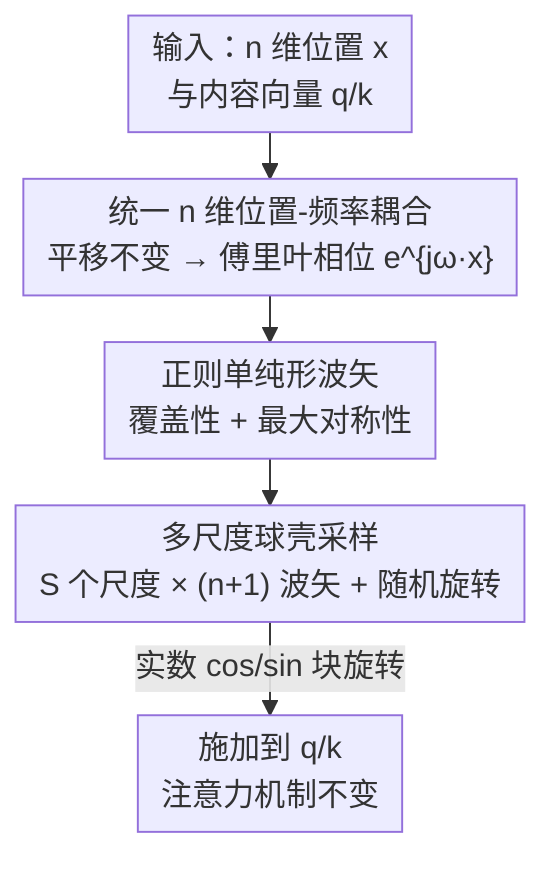

# nD-RoPE: A Generalized RoPE for n-Dimensional Position Embedding

**会议**: ICML 2026  
**arXiv**: [2606.12146](https://arxiv.org/abs/2606.12146)  
**代码**: 待确认  
**领域**: Transformer 架构 / 位置编码  
**关键词**: 旋转位置编码, 各向同性, 正则单纯形, 多尺度频率, 分辨率外推

## 一句话总结
把 RoPE 从「逐轴拆分」改成「把位置和频率都当成完整的 n 维向量、用一次内积旋转 $e^{j\boldsymbol{\omega}^\top\mathbf{x}}$ 编码」，并用正则单纯形波矢保证各向同性，从而在图像、视频、点云上都拿到一致的精度提升和更强的分辨率/密度外推。

## 研究背景与动机

**领域现状**：RoPE 通过给 query/key 施加与位置相关的旋转、让注意力内积只依赖相对位移，在一维语言建模上极其成功，被 LLaMA、Qwen 等模型广泛采用。要把它搬到二维图像、三维点云、时空视频上，主流做法是「Axial RoPE」——把位置向量拆成 $x,y,z$ 各分量，沿每个坐标轴**独立**做一维旋转，再拼起来。

**现有痛点**：逐轴拆分隐含了一个未被审视的假设——多维位移可以无损地分解成相互独立的一维分量。但一个对角方向的位移本是一个**整体**的几何变换，把它拆成「水平旋转 × 垂直旋转」会把这个连贯位移撕碎，破坏跨维度的相互作用，并在注意力里产生方向依赖（direction-dependent）的相对相位。论文用非均匀傅里叶变换（NUFT）重建冲激信号做诊断：逐轴编码重建出的冲激带有明显的沿坐标轴的网格状伪影，说明斜向（对角）频率几乎没被覆盖，大片频谱被浪费。另一类可学习方案 RoPE-Mixed 虽把坐标当整体，但其频率参数在优化中会**坍缩**成不规则的低频簇、分布高度各向异性，泛化不稳。

**核心矛盾**：好的多维位置编码需要同时满足两点——既要能沿**非轴对齐**方向编码相对位置，又要在所有方向上**均匀覆盖**（各向同性）。逐轴方案违反第一点，可学习方案无法保证第二点，而过去缺一个在任意维度都成立、且频率选择有理论依据的统一框架。

**本文目标**：给 RoPE 一个「decomposition-free」的 n 维推广，让同一套公式在 1D/2D/3D/… 上一致成立，并给出一个确定性的、几何对称的波矢构造来消除方向偏置。

**核心 idea**：从连续 Hilbert 空间里的平移不变注意力出发推导，证明位置必须以**整体 n 维向量**进入旋转 $e^{j\boldsymbol{\omega}^\top\mathbf{x}}$（位置与频率耦合），再用**正则单纯形**（regular simplex）选波矢，以最小冗余拿到最大对称性。

## 方法详解

### 整体框架

nD-RoPE 不改注意力机制本身，只换掉位置编码的相位项：把标准 RoPE 里的一维相位 $\omega x$ 换成多维相位 $\boldsymbol{\omega}^\top\mathbf{x}$，其中位置 $\mathbf{x}\in\mathbb{R}^n$ 和波矢 $\boldsymbol{\omega}\in\mathbb{R}^n$ **都是完整的 n 维向量、不做逐轴拆分**。整条逻辑链分三步：先从「平移不变 + 相对位置」的假设出发，在函数空间里推导出位置编码必然取 $e^{j\boldsymbol{\omega}^\top\mathbf{x}}$ 这一傅里叶形式；再回答「有限个波矢怎么选」，用覆盖性和对称性两个条件把答案逼到正则单纯形；最后叠多个尺度形成同心球壳，覆盖多尺度的相对位移。

### 关键设计

**1. 统一 n 维位置–频率耦合：从平移不变性推出一次性旋转**

这一步针对逐轴拆分「撕碎对角位移」的根本病灶。论文沿用 RoPE 的两条假设：query/key 是位置相关函数 $\mathbf{q}_{\mathbf{x}_1}=f(q,\mathbf{x}_1)$，且注意力核只依赖相对位移 $\mathbf{d}=\mathbf{x}_1-\mathbf{x}_2$。把内容 $q$ 提升为 $L^2(\mathbb{R}^n)$ 上的平方可积函数 $\gamma(q,\cdot)$，用平移引入位置，再借 Parseval 等式把内积转到频域，得到 $\langle f(q,\mathbf{x}_1),f(k,\mathbf{x}_2)\rangle=\int e^{j\boldsymbol{\omega}^\top\mathbf{d}}\,\Gamma(q,\boldsymbol{\omega})\Gamma(k,\boldsymbol{\omega})^*\,d\boldsymbol{\omega}$。其中相位因子 $e^{j\boldsymbol{\omega}^\top\mathbf{d}}$ 干净地捕捉相对位置依赖。再施加零位移时应退回内容内积 $q^\top k$ 的初始条件，由 Riesz 表示定理把 $\Gamma(q,\boldsymbol{\omega})$ 写成 $q$ 的频率相关线性投影，逆傅里叶后得到可分解形式 $\gamma(q,\mathbf{x})=q^\top\phi(\mathbf{x})$，最终有限频率近似下特征取 $f(q,\mathbf{x})\approx (Wq)\odot\varphi(\mathbf{x})$，$\varphi(\mathbf{x})=[e^{j\boldsymbol{\omega}_1^\top\mathbf{x}},\dots,e^{j\boldsymbol{\omega}_M^\top\mathbf{x}}]^\top$。关键结论是：$\boldsymbol{\omega}$ 与 $\mathbf{x}$ 在推导里天然作为**整体 n 维向量**耦合出现，逐轴拆分只是它退化、把频率限制在坐标轴上的特例。

**2. 覆盖性 + 最大对称性：把波矢选择逼到正则单纯形**

有了傅里叶形式，剩下唯一的设计自由度是选有限波矢集 $\Omega=\{\boldsymbol{\omega}_i\}$。论文给出两个结构条件。**覆盖性**：每个波矢 $\boldsymbol{\omega}_i^\top x=2\pi k_i$ 定义一族平行等相位超平面，把波矢按行堆成矩阵 $\Omega$，若 $\mathrm{rank}(\Omega)<n$ 就存在某方向 $v$ 让 $\Omega v=0$，相位系统分不清 $x$ 和 $x+tv$，所以必须 $\mathrm{rank}(\Omega)=n$。**最大对称性**：仅满秩还不够——$n$ 个正交波矢虽然能满足二阶平衡 $\sum_i\boldsymbol{\omega}_i\boldsymbol{\omega}_i^\top\propto I_n$，但每个频率仍绑死在一个坐标方向上，实空间是轴对齐方格、保留了轴向偏置。于是把波矢数从 $n$ 提到最小冗余的 $M=n+1$，让所有波矢被等价对待、不偏好任何坐标轴。此时最大对称配置就是**中心化正则单纯形**：$\sum_{i=1}^{n+1}\boldsymbol{\omega}_i=0$、$\|\boldsymbol{\omega}_i\|=r$、$\langle\boldsymbol{\omega}_i,\boldsymbol{\omega}_j\rangle=-r^2/n\;(i\neq j)$。零质心去掉净方向偏置，等内积保证各方向几何同质，从而 $\sum_{i=1}^{n+1}\boldsymbol{\omega}_i\boldsymbol{\omega}_i^\top=\frac{n+1}{n}r^2 I_n$——**每个空间方向的二阶方向能量完全相同**，即各向同性。这是 nD-RoPE 区别于轴向方案的核心：用 $n+1$ 个非轴对齐方向换来真正的方向均衡。

**3. 多尺度球壳 + 随机旋转：避免频率坍缩、覆盖多尺度位移**

单一尺度的单纯形只覆盖一个频率半径，但高维相对位移的幅度跨度很大。论文堆叠 $S$ 个尺度，每个尺度用一组 $n+1$ 个单纯形波矢、并叠加一次随机旋转，最终编码为 $f(q,\mathbf{x})=q\odot[z^{(1)}(\mathbf{x})\,\|\cdots\|\,z^{(S)}(\mathbf{x})]^\top$，其中 $z^{(s)}(\mathbf{x})$ 是第 $s$ 个尺度的所有相位项。这些波矢在频域构成**多尺度同心球壳**，几何规则、覆盖均匀；与 RoPE-Mixed 优化后坍缩成各向异性低频簇形成鲜明对比（论文用频谱可视化佐证）。值得强调的是，整个 nD-RoPE 虽写成复数形式，实现上完全等价于标准 RoPE 的实值块旋转——每个相位 $e^{j\boldsymbol{\omega}^\top\mathbf{x}}$ 落地成一对 $(\cos(\boldsymbol{\omega}^\top\mathbf{x}),\sin(\boldsymbol{\omega}^\top\mathbf{x}))$，只把一维相位换成多维内积，注意力一行代码不改，因此 YaRN 等基于频率缩放/插值的外推技巧可以直接套用。

### 一个完整示例：二维的六边形格子

二维下最直观地看到「单纯形对称」的好处：取两个正交波矢（轴向方案）会在实空间诱导出一个**正方形网格**，相位族绑死在水平/垂直方向；而取三个互成 $120^\circ$ 的波矢（这正是 2D 正则单纯形，$M=n+1=3$）是最小的「闭合非轴对齐」配置，它们叠加出的平面波干涉成一个**六边形格子**——方向上高度对称、没有偏好轴。换句话说，波矢的「个数 + 角度排布」共同决定了实空间图案是「可沿坐标轴分离」还是「方向均衡」，nD-RoPE 选择后者。

## 实验关键数据

三类模态全部「训练在低分辨率/低密度、测试时外推到更高」，nD-RoPE 的优势随外推幅度拉大而急剧扩大。

### 主实验

| 任务 / 骨干 | 设置 | nD-RoPE | RoPE-Axial | RoPE-Mixed |
|------|------|---------|-----------|-----------|
| ImageNet-1K 分辨率外推 (DeiT-S, 训练@224) | 224 (域内) | 81.07 | 80.89 | 80.90 |
| 同上 | 1024 (无 YaRN) | **35.51** | 20.64 | 16.63 |
| 同上 | 1024 (+YaRN) | **68.46** | 48.02 | 43.48* |
| Kinetics-400 视频 (TimeSformer, 训练@224) | 224 (域内) | 75.85 | 73.23 | 73.12 |
| 同上 | 1024 (+YaRN) | **59.23** | 57.94 | 44.16* |
| ModelNet40 点云密度外推 (Point Transformer, 训练 2048 点) | 2048 (域内) | **85.97** | 80.98 | 81.40 |
| 同上 | 256 点 | **55.37** | 48.22 | 40.41 |

*RoPE-Mixed 列在视频/1024 处取的是 RoPE-Mixed+APE+YaRN（44.16），原始 RoPE-Mixed 更低。

### 分析实验

| 现象 | 观察 | 说明 |
|------|------|------|
| NUFT 冲激重建 | nD-RoPE 各向同性、无轴向伪影 | 逐轴方案出现明显坐标轴网格伪影，斜向频率被浪费 |
| 频谱分布 | nD-RoPE 形成多尺度同心球壳 | RoPE-Mixed 学到的频率坍缩成各向异性低频簇 |
| 点云注意力形式 | vector attention (85.97) > 标准点积 (85.07) @2048 | nD-RoPE 在两种注意力下都超过轴向基线 |
| SemanticKITTI 分割 (PTv2) | 0.05 网格域内 71.91 vs 轴向 70.25 | 跨网格分辨率外推同样占优 |

### 关键发现
- **域内打平、外推暴涨**：在训练分辨率上 nD-RoPE 仅微弱领先（ImageNet 224 处 81.07 vs 80.90），但分辨率拉到 1024 时领先从约 0.2 个点扩大到约 19 个点（无 YaRN）/约 25 个点（+YaRN），说明各向同性主要兑现在外推泛化上。
- **轴向方案外推崩得最狠**：RoPE-Axial 在 ImageNet 1024 仅 20.64，验证了「方向偏置导致斜向频率失效」的诊断。
- **即插即用**：因为保持 RoPE 的实值块旋转形式，YaRN 直接叠上去就能再涨一大截（1024 处 35.51 → 68.46）。

## 亮点与洞察
- **「位置不该被拆开」是一句极简却有力的原则**：论文把它从直觉上升为可推导的谱条件——平移不变性 + 相对位置必然导出 n 维耦合的傅里叶相位，逐轴只是退化特例，这把工程经验讲成了理论。
- **用正则单纯形做确定性波矢构造很巧**：$M=n+1$ 是「非轴对齐」所需的最小波矢数，零质心 + 等内积一次性买到满秩覆盖 + 最大对称，避开了随机傅里叶采样的不均匀和可学习频率的坍缩。
- **零侵入可迁移**：保持 cos/sin 块旋转、不动注意力，意味着任何已有 RoPE 代码库和外推技巧（YaRN、频率插值）都能直接复用，落地成本极低，这个「只换相位、不换框架」的设计思路可迁移到任何用 RoPE 的多模态模型。

## 局限与展望
- 波矢用了固定的确定性单纯形（外加随机旋转），论文也指出超过 $n+1$ 个方向能进一步加密角度覆盖但带来冗余和更复杂的干涉；尺度数 $S$、每尺度半径 $r$ 等超参如何最优设置缺少系统性研究。
- 实验集中在视觉/点云的分辨率与密度外推，未在原生战场——长上下文语言建模——上验证 n 维耦合是否同样占优。
- 各向同性在某些天然有方向偏好的任务（如强烈轴对齐结构的数据）上是否反而损失归纳偏置，论文未深入讨论。

## 相关工作与启发
- **vs Axial RoPE**：他们沿各坐标轴独立旋转、只擅长轴对齐依赖，本文用一次 n 维内积旋转保住跨维几何，区别在于是否拆分位置；本文优势是无方向偏置、外推强，代价是需要单纯形波矢构造。
- **vs RoPE-Mixed**：他们也把坐标当整体、做各向同性建模，但频率可学习、缺频率选择的理论依据，优化后会坍缩；本文用确定性单纯形 + 多尺度球壳给出严格构造，稳定性更好。
- **vs FoPE / 随机傅里叶特征**：FoPE 在一维做谱校正提升长度外推、不处理任意维各向同性；随机高斯采样无均匀覆盖保证，本文给出确定且几何对称、可扩展到任意维的方案。

## 评分
- 新颖性: ⭐⭐⭐⭐⭐ 把 RoPE 的多维推广从工程拼凑提升为可推导的统一框架，单纯形波矢构造优雅
- 实验充分度: ⭐⭐⭐⭐ 覆盖图像/视频/点云三模态 + 多种外推与可视化诊断，但缺语言建模验证
- 写作质量: ⭐⭐⭐⭐ 理论推导清晰、动机有诊断实验支撑
- 价值: ⭐⭐⭐⭐⭐ 零侵入可迁移、外推收益大，对所有用 RoPE 的多模态模型有直接价值

<!-- RELATED:START -->

## 相关论文

- [\[ICML 2026\] Amortized Simulation-Based Inference in Generalized Bayes via Neural Posterior Estimation](amortized_simulation-based_inference_in_generalized_bayes_via_neural_posterior_e.md)
- [\[ICML 2026\] Position: Age Estimation Models Do Not Process Biometric Data](position_age_estimation_models_do_not_process_biometric_data.md)
- [\[NeurIPS 2025\] Generalized Linear Mode Connectivity for Transformers](../../NeurIPS2025/others/generalized_linear_mode_connectivity_for_transformers.md)
- [\[ICML 2026\] Position: Evaluation of ML Resource Utilization Requires Model Life Cycle Assessment](evaluation_of_ml_resource_utilization_requires_model_life_cycle_assessment.md)
- [\[AAAI 2026\] DECOR: Deep Embedding Clustering with Orientation Robustness](../../AAAI2026/others/decor_deep_embedding_clustering_with_orientation_robustness.md)

<!-- RELATED:END -->
