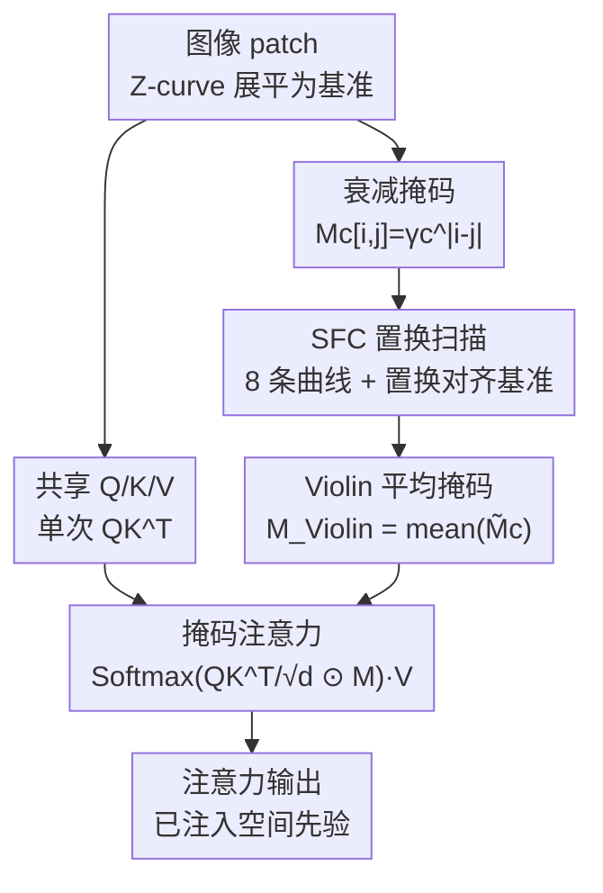

# Spatial Priors via Space Filling Curves for Small and Limited Data Vision Transformers

**会议**: ICML2026  
**arXiv**: [2606.14757](https://arxiv.org/abs/2606.14757)  
**代码**: 有（论文标注 "Violin Code"，仓库以原文为准）  
**领域**: 视觉骨干 / ViT 注意力 / 空间先验  
**关键词**: Vision Transformer, 空间填充曲线, 衰减掩码, 小数据, 归纳偏置

## 一句话总结
针对 ViT 因注意力排列等变而缺乏空间先验、在小模型与小数据场景下吃亏的问题，本文用空间填充曲线（Snake/Zig-zag/Peano/Hilbert 等）构造一组衰减掩码并平均后乘进注意力矩阵，仅增加不到 0.0015% 参数、约 0.64% FLOPs，就在 VTAB-1K 微调上把空间敏感任务最高提升 8.7%。

## 研究背景与动机
**领域现状**：ViT 把图像切成 patch 后当作一串无序 token 用自注意力建模，靠位置编码补回顺序，在大模型大数据下能直接从数据里"学到"局部性。

**现有痛点**：自注意力是排列等变的——把 token 顺序打乱，输出只是同样地被打乱，注意力本身并不知道哪两个 patch 在图像上相邻。这导致 ViT 缺乏 CNN 那种天生的局部性归纳偏置，变得"数据饥渴"，一旦模型容量小（≤30M）或下游数据稀缺（如每任务只有 1000 张），即使大 ViT 也难以专门化。

**核心矛盾**：要么靠堆数据/堆参数让模型自己学局部性，要么人工注入空间先验但往往要改架构（卷积、特殊位置编码）、带来不小开销。本文想要一个几乎零成本、即插即用、不动主干结构的注入方式。

**切入角度**：作者注意到，线性 Transformer / Vision SSM 用"衰减因子"沿扫描顺序对注意力分数施加距离惩罚来编码相对位置，而把 2D patch 拍成 1D 序列这件事本质上就是一条**空间填充曲线（SFC）**。Z-curve（逐行扫描）只是最简单的一种；Snake、Zig-zag、Peano、Hilbert 等曲线以不同方式保持局部性。

**核心 idea**：用多条 SFC 各自构造"按序列距离衰减"的掩码，对齐到统一基准后平均，再逐元素乘进标准注意力矩阵——用一张几乎不花钱的掩码替代结构改动，把多视角的局部性先验注入 ViT。

## 方法详解

### 整体框架
Violin 不改 ViT 主干，只在每个注意力层把标准注意力分数矩阵乘上一张专门设计的掩码 $\mathbf{M}_{\text{Violin}}$。流程是：图像按 Z-curve 展平为基准序列、像普通 ViT 一样算出共享的 $\mathbf{Q},\mathbf{K},\mathbf{V}$ 和单次 $\mathbf{Q}\mathbf{K}^\top$；同时对集合中 8 条 SFC 各自构造一张衰减掩码 $\mathbf{M}_c[i,j]=\gamma_c^{|i-j|}$，通过置换把它们对齐回 Z-curve 基准顺序，再求平均得到 $\mathbf{M}_{\text{Violin}}$；最后把它乘进注意力做 softmax。关键在于：所有曲线共享同一份 $\mathbf{Q}\mathbf{K}^\top$，差异只体现在掩码里，因此几乎零额外计算。

### 关键设计

**1. 衰减掩码注意力：用序列距离惩罚强行打破排列等变**

标准注意力 $\mathbf{Y}=\text{Softmax}(\mathbf{Q}\mathbf{K}^\top/\sqrt{d})\mathbf{V}$ 是排列等变的，所以它对"谁离谁近"一无所知。Violin 借鉴线性 Transformer 的做法，在 softmax 内部逐元素乘一张衰减掩码：$\mathbf{Y}=\text{Softmax}(\frac{\mathbf{Q}\mathbf{K}^\top}{\sqrt d}\odot\mathbf{M})\mathbf{V}$，其中 $\mathbf{M}[i,j]=\gamma^{|i-j|},\ 0<\gamma\le 1$。这张掩码就是 Kac–Murdock–Szegö 矩阵，它把因果衰减掩码推广到了全（非因果）注意力：序列上相距越远的两个 token，注意力分数被压得越狠，从而在展平序列里强行注入局部性、打破排列等变。但问题随之而来——"序列距离 $|i-j|$"完全取决于图像怎么被展平，单一 Z-curve 只能反映一种邻接关系。

**2. SFC 置换扫描：换一条曲线不用重新处理图像，只置换序列**

不同 SFC 以不同方式保持局部性（Hilbert 曲线尤其善于让 2D 邻居在 1D 上也邻近），所以作者想同时用多条曲线。但若每条曲线都重新扫描、重排一遍图像再过一遍编码，代价太大。本文的关键观察是：既然每种展平都是一一映射，那么从曲线 $c_1$ 的序列换到曲线 $c_2$ 的序列，只是一个置换 $\pi_{c_1\mapsto c_2}$，可写成置换矩阵 $\mathbf{P}_{c_1\mapsto c_2}$，且因为是置换矩阵满足 $\mathbf{P}^{-1}=\mathbf{P}^\top$。于是只需把图像用 Z-curve 展平一次，其它曲线的序列（或掩码）都能用一次廉价的索引置换得到，实践中直接用 indexing 实现。

**3. 基准对齐 + Violin 平均掩码：单份 QK^T 融合 8 条曲线**

如果对每条曲线各算一遍掩码注意力 $\mathbf{Y}_c$，会得到顺序互不一致的输出，没法直接相加。作者选 Z-curve 作"基准曲线"，把每条曲线的输出（或等价地把掩码）置换回基准：对掩码做 $\widetilde{\mathbf{M}_c}=\mathbf{P}_c^\top\mathbf{M}_c\mathbf{P}_c$，就能在基准坐标下直接算注意力，从而**所有曲线共享同一份 $\mathbf{Q}\mathbf{K}^\top$**——这是开销近乎为零的根源。Violin 最终用的掩码是 8 条曲线（Snake、Zig-Zag、Peano、Hilbert 及其转置，兼顾行优先与列优先）对齐后掩码的平均，再用一个可学习标量 $\alpha$ 控制掩码影响强度。每条曲线有自己的衰减因子 $\gamma_c=\text{sigmoid}(\beta_c)$（用 sigmoid 参数化以稳定训练），多头注意力下每个头 $k$ 还各有独立的 $\beta_c^k$ 与 $\alpha^k$，让不同头学到不同的局部性偏好。

### 损失函数 / 训练策略
Violin 不引入额外损失，掩码参数（每曲线每头的 $\beta_c^k$ 与强度 $\alpha^k$）随主干一起端到端优化。可即插即用于两种场景：从头预训练（DeiT/DeiT-III/DINO 等），或把新初始化的掩码挂到预训练模型上、微调时与主干联合优化；还能与 LoRA 等参数高效微调方法叠加。

## 实验关键数据

### 主实验
在 VTAB-1K（每任务仅 1000 样本，分 Natural/Specialized/Structured 三组）上做全量微调，Violin 在各骨干、各规模上一致提升，尤其在依赖空间信息的 Structured 组提升最大：

| 模型 | 参数量 | Baseline 均值 | +Violin 均值 | Structured 组提升 |
|------|--------|--------------|--------------|-------------------|
| DeiT-T | 5M | 65.52 | 68.33 (+2.81) | +3.93 |
| DeiT-S | 22M | 67.38 | 70.46 (+3.08) | +4.82 |
| DeiT-III-S | 22M | 67.57 | 72.31 (+4.74) | **+8.69** |
| DeiT-III-B | 86M | 70.63 | 73.94 (+3.31) | +6.32 |
| DINO-B | 86M | 71.23 | 72.79 (+1.56) | +2.37 |

可以看到：越是空间敏感的 Structured 任务、越是中小模型，Violin 收益越大（DeiT-III-S 的 Structured 组单组提升 8.69%）；即便是 632M 的 DeiT-III-H 也仍有正向收益（+1.41 均值）。此外，在 ImageNet-1K 上预训练小模型最高提升 0.9%，在高度依赖位置信息的像素级 CIFAR-100 上最高提升 7.2%。

### 开销分析

| 指标 | 相对 DeiT-B 变化 | 实测（DeiT-S，bs=256） |
|------|------------------|------------------------|
| 参数量 | +0.0015% | — |
| FLOPs | +0.64% | — |
| GPU 显存（224²） | — | 0.80 → 0.81 GB |
| 推理耗时（224²） | — | 206.1 → 233.1 ms/batch |
| 推理耗时（512²） | — | 1739.3 → 1789.7 ms/batch |

### 关键发现
- 收益与"是否需要空间信息"强相关：Structured 组（计数、定位类任务）提升远大于 Natural 组，验证了注入的确实是空间先验而非泛泛的正则。
- 收益与规模反相关：小模型 / 小数据收益最大，符合"大模型能自学局部性、小模型学不动"的假设。
- 多曲线互补：不同 SFC 以不同方式保持局部性，平均融合比单一 Z-curve 更鲁棒；衰减因子 $\gamma_c$ 可学习让每条曲线自适应其影响范围。
- 几乎零成本：参数 +0.0015%、FLOPs +0.64%，显存基本不变，可与 LoRA 叠加，属于"白捡"的提升。

## 亮点与洞察
- 把"图像展平"重新看成空间填充曲线，是个很漂亮的视角统一：Z-curve、Hilbert、Peano 都只是不同的 1D→2D 邻接保持方式，于是"多视角局部性"可以平铺成多张掩码。
- 置换技巧是工程上的点睛之笔：换曲线 = 廉价索引置换，且把掩码而非输出置换到基准，使 8 条曲线共享单份 $\mathbf{Q}\mathbf{K}^\top$，这才换来"近乎零开销"。
- 思路可迁移：任何用全注意力又缺空间/序结构先验的场景（多模态 patch、点云体素、时序网格），都可考虑用 SFC 衰减掩码注入相对位置，而不动主干。

## 局限与展望
- 掩码是基于序列距离 $\gamma^{|i-j|}$ 的各向同性衰减，仍是 1D 距离近似，不能精确表达 2D 中"对角邻居"等关系，靠多曲线平均来弥补。
- 8 条固定曲线是人工选定的，论文未充分探讨曲线集合如何自动选择/裁剪到最优子集。
- 收益随模型增大而递减，对超大模型（数据充足）增益有限，主要价值在小模型与数据稀缺场景。
- 掩码作用于注意力矩阵，分辨率（序列长度 $N$）很大时 $N\times N$ 掩码的内存随之上升（论文显示 512² 下仍可接受）。

## 相关工作与启发
- **vs 卷积注入（如 CvT/早期混合架构）**：它们靠卷积层引入局部性、改动主干结构；Violin 只乘一张掩码、不动主干，开销低一个数量级。
- **vs Vision SSM / 线性 Transformer 的多向扫描**：它们靠递归 + 衰减沿扫描顺序编码顺序、且需多次方向扫描；Violin 借用其衰减思想但放进**全注意力**里，且把多曲线压成一张共享掩码，避免多次扫描。
- **vs 位置编码改进**：位置编码加在 token 上、是绝对/相对的加性偏置；Violin 是乘性的、作用在注意力分数对上，直接调制 patch 间的相互可见度。

## 评分
- 新颖性: ⭐⭐⭐⭐ 把图像展平统一为 SFC、用多曲线衰减掩码注入空间先验，视角清新且实用。
- 实验充分度: ⭐⭐⭐⭐ 覆盖多骨干（DeiT/DeiT-III/DINO）、多规模（5M–632M）、微调/预训练/稠密预测，并附开销实测。
- 写作质量: ⭐⭐⭐⭐ 从衰减掩码到置换对齐的推导清晰，掩码构造讲得透。
- 价值: ⭐⭐⭐⭐ 近乎零成本、即插即用、可叠加 PEFT，对小模型/小数据落地价值高。

<!-- RELATED:START -->

## 相关论文

- [\[ECCV 2024\] SpatialFormer: Towards Generalizable Vision Transformers with Explicit Spatial Understanding](../../ECCV2024/others/spatialformer_towards_generalizable_vision_transformers_with_explicit_spatial_un.md)
- [\[ICML 2026\] Vision Transformer 微调中的非光滑分量优势](vision_transformer_finetuning_benefits_from_non-smooth_components.md)
- [\[ICLR 2026\] Predicting Kernel Regression Learning Curves from Only Raw Data Statistics](../../ICLR2026/others/predicting_kernel_regression_learning_curves_from_only_raw_data_statistics.md)
- [\[ECCV 2024\] AttnZero: Efficient Attention Discovery for Vision Transformers](../../ECCV2024/others/attnzero_efficient_attention_discovery_for_vision_transformers.md)
- [\[CVPR 2026\] Inter-Photon-Limited Videography](../../CVPR2026/others/inter-photon-limited_videography.md)

<!-- RELATED:END -->
