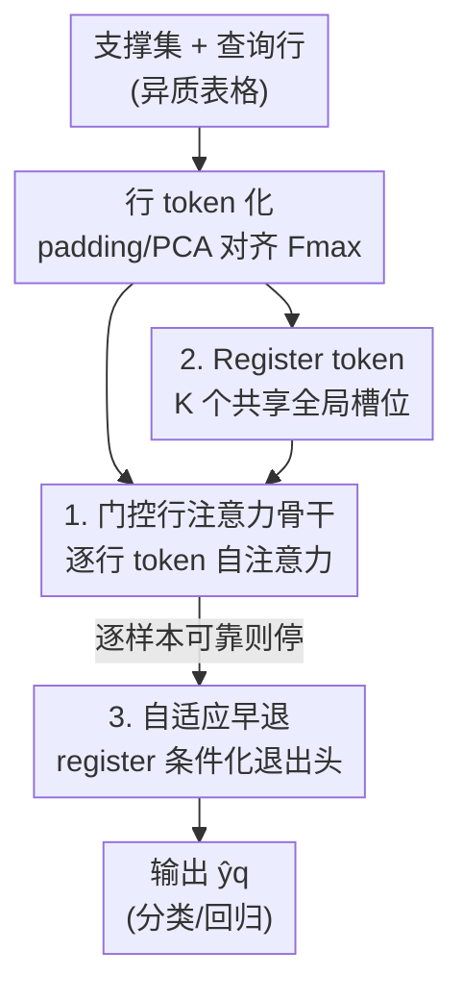

# TabSwift: An Efficient Tabular Foundation Model with Row-Wise Attention

**会议**: ICML 2026  
**arXiv**: [2606.07345](https://arxiv.org/abs/2606.07345)  
**代码**: https://github.com/LAMDA-Tabular/TabSwift  
**领域**: 表格基础模型 / 高效推理 / 上下文学习  
**关键词**: 表格基础模型, 行注意力, 门控注意力, register token, 自适应早退

## 一句话总结
作者证明了 TabPFN 那套"只做行注意力"的极简骨干并没有过时——只要补上门控注意力稳定训练、加一小撮可学习的 register token 聚合全局信息，再配一个逐样本的自适应早退头，就能在精度上追平 TabPFN v2 / TabICL 这些更重的列感知模型，同时推理快得多。

## 研究背景与动机
**领域现状**：表格预测长期被 GBDT（XGBoost、LightGBM）统治，但近两年 PFN（Prior-Fitted Network）范式带来了表格基础模型：在大量合成表格任务上预训练一个 Transformer，推理时把"带标签的支撑集 + 待预测查询"当成 prompt 喂进去，靠上下文学习（ICL）直接出预测，不做任何测试期参数更新。TabPFN 在小数据分类上效果惊人，TabPFN v2 进一步把分类和回归都覆盖了。

**现有痛点**：为了刷精度，新一代表格基础模型架构越堆越重。它们普遍走"行/列交替注意力"路线——把输入看成 $n\times d$ 的 token 网格，既在行（样本）方向做注意力、又在列（特征）方向做注意力。这确实能更好地刻画特征间结构和数据集异质性，但单次前向的代价大幅上升：一个交替块的主导开销是 $\mathcal{O}(d\,n^{2}d_{\text{model}}) + \mathcal{O}(n\,d^{2}d_{\text{model}})$，比 TabPFN v1 那种只做行注意力的 $\mathcal{O}(n^{2}d_{\text{model}})$ 重得多。

**核心矛盾**：很多真实表格场景对延迟和吞吐有硬约束，精度–效率的 trade-off 是第一位的。社区默认"想要强精度就必须上更重的列感知架构"，但这个默认从没被认真质疑过——极简的行注意力骨干，是不是只是因为没用上现代的注意力稳定与预训练技巧，才显得弱？

**本文目标**：在不引入列注意力的前提下，把行注意力骨干训到能跟重型模型掰手腕，并进一步在部署侧把"每个样本都要走完所有层"的浪费砍掉。

**切入角度**：保留 TabPFN v1 的纯行注意力推理结构（这是低成本的根），只往里加两处"几乎不增加计算"的轻量改动来解放它的训练潜力。

**核心 idea**：行注意力骨干 + 门控注意力（稳训练）+ register token（补全局上下文）＝ TabSwift；再叠一个逐样本早退头，把推理深度按样本难度动态分配。

## 方法详解

### 整体框架
TabSwift 是一个 PFN 风格的表格 ICL Transformer：输入是"支撑集 $\mathcal{D}_{\text{sup}}=\{(\mathbf{x}_i,y_i)\}_{i=1}^N$ + 一个待预测查询 $\mathbf{x}_q$"，输出是查询的标签 $\hat{y}_q$（分类或回归共用同一个骨干）。整条流水线分三段：先把每一行编码成一个 token、并在序列前面拼上 $K$ 个 register token；再用一个**只做行注意力**、但在自注意力里加了元素级门控的 Transformer 骨干处理这个 token 序列；最后在末尾若干层挂上预测头与"是否可以停下"的早退头，让简单样本在浅层就出结果。

### 关键设计

**1. 元素级门控行注意力：在不加列注意力的前提下把训练稳住**

纯行注意力骨干本身没什么不对，问题在于它在大规模合成预训练里优化不够稳，导致精度天花板被压低，社区才转去堆更重的列注意力。作者的对策不是改结构、而是改注意力的输出通路：采用 SDPA-output 门控（即 Qiu et al. 的 G1 设计），在自注意力输出 $\mathbf{O}^h$ 投影出去之前，乘上一个由输入算出来的元素级门 $\mathbf{G}^h=\sigma(\mathbf{X}\mathbf{W}_g^h+\mathbf{b}_g^h)\in(0,1)^{S\times d_h}$，得到 $\widetilde{\mathbf{O}}^h=\mathbf{G}^h\odot\mathbf{O}^h$。这个门在 value 投影和 output 投影之间额外引入了一层非线性，并能让注意力更新呈现"输入依赖的稀疏性"，从而在合成预训练中起到稳定优化的作用。代价几乎可以忽略——门控只多了一项线性开销 $\mathcal{O}(Sd_{\text{model}})$，相对于二次的注意力项 $\mathcal{O}(S^2 d_{\text{model}})$ 可以忽略不计，整体仍然比"还要做列注意力"的架构便宜得多。

**2. 可学习 register token：给行注意力补一个全局上下文的"暂存区"**

行注意力只在样本之间混信息，缺少一个能跨深度维护"数据集级别"表示的载体。TabSwift 在行 token 序列前面拼上 $K$ 个可学习的 register token $\mathbf{R}^{(0)}=\{\mathbf{r}_k^{(0)}\}_{k=1}^K$，它们在所有任务间共享、随各层一起更新，充当聚合上下文的隐式槽位（latent slot），让模型更容易在网络深处维护和精炼任务级表示。具体地，行 token 经过对齐与嵌入后得到 $\mathbf{H}_{\text{rows}}^{(0)}$，对支撑行还要把标签嵌入注入进去 $\mathbf{h}_i^{(0)}=\mathbf{e}(\mathbf{x}_i)+\mathbf{e}_y(y_i)$，最终层输入是 $\mathbf{H}^{(0)}=[\mathbf{R}^{(0)};\mathbf{H}_{\text{rows}}^{(0)}]\in\mathbb{R}^{S\times d_{\text{model}}}$，序列长度 $S=K+n$。这跟近期 PFN 变体里"thinking rows"那类任务级隐 token 是同一思路，但 TabSwift 把它和门控注意力组合起来用，作为提升预训练质量的轻量手段。这两个 register 的作用后面还会被早退头复用（见设计 3）。

为处理不同数据集特征维度不一的问题，输入端统一对齐到固定维度 $F_{\max}$：特征数 $F<F_{\max}$ 时零填充、$F>F_{\max}$ 时用 PCA 投影，得到 $\tilde{\mathbf{x}}\in\mathbb{R}^{F_{\max}}$（作者也坦言对超高维特征，PCA 预处理本身会带来额外开销，此时 TabSwift 的提速主要来自轻量骨干和更小的常数，而非渐近复杂度的优势）。

**3. register 条件化的逐样本自适应早退：按样本难度动态分配深度**

即便骨干已经很轻，"每个测试样本都跑满 $L$ 层"在逐样本服务时仍是浪费——延迟被最坏情况的计算深度主导。TabSwift 在末尾 $E$ 层（实现里 $E=L$）各挂一个预测头 $\hat{\mathbf{y}}^{(e)}=h_{\text{pred}}^{(e)}(\mathbf{z}^{(e)})$ 让中间层也能出有效预测，再挂一个学习出来的退出头判断"现在停下靠不靠谱"。关键巧思是退出头不只看当前查询表示 $\mathbf{z}_t^{(e)}$，还把 register token 的池化摘要 $\mathbf{r}^{(e)}=\frac{1}{K}\sum_{k=1}^K\mathbf{R}_k^{(e)}$ 拼进来（它携带了到当前深度为止积累的任务级上下文），算出一个停止打分 $s_t^{(e)}=h_{\text{exit}}^{(e)}([\mathbf{z}_t^{(e)};\mathbf{r}^{(e)}])$。推理时从浅到深扫，选第一个满足 $\sigma(s_t^{(e)})\ge\tau$ 的层退出：

$$e_t^{\star}=\min\{e\in\{1,\dots,E\}:\sigma(s_t^{(e)})\ge\tau\}$$

没有任何层达标就回退到最后一层。阈值 $\tau$ 在验证集上选，直接控制精度–计算的 trade-off。和已有表格 ICL 早退工作（Küken et al.）最大的区别在推理设定：那类方法常用**整个测试集**的层级统计（如逐层平均熵）来定退出深度，本质偏向直推/测试期自适应；TabSwift 严格针对逐查询在线推理，退出决策只用当前样本的中间表示 + register 摘要，在单次前向里完成，不依赖其他测试样本。

### 损失函数 / 训练策略
预训练沿用 TabICL 的合成数据生成协议：离线生成 20,000 个预训练 step 的池子，每个 step 含 512 个独立采样的合成表格任务，每个任务行数上限 2000、特征数上限 100，训练时按 round-robin 循环消费。关键在于"统一目标"——从 SCM 节点采样目标变量时，为每个任务同时存一份离散化得到的分类目标和一份标准化得到的回归目标，于是同一个合成任务能同时监督两个头：分类用交叉熵，回归用 MSE + MAE 组合。骨干是 24 层、$d_{\text{model}}=192$ 的 Transformer，用 AdamW 在 8 张 RTX 5090 上训 150,000 步（约 7 天），之后再在更大任务（行数提到 20,000）上续训 2,000 步增强长上下文鲁棒性。早退是后训练阶段单独加的：冻结骨干，只训新加的预测头和退出头 10,000 步（约 6 小时）。

## 实验关键数据

### 主实验
在 TALENT 大规模公开基准（300 个二分类/多分类/回归数据集）上评测，按 64%/16%/20% 划分、15 个随机种子平均。分类报 AUC（越高越好），回归报 RMSE（越低越好）。结果用临界差异（CD）图 + PAMA（一个方法取得最佳表现的数据集累计占比）汇报。

| 评测维度 | TabSwift 表现 | 含义 |
|----------|---------------|------|
| 分类/回归平均秩 | 与最强基线相当、部分设定更优 | Wilcoxon–Holm 校正下常与 top 方法无显著差异 |
| PAMA（最佳占比） | 分类/回归都较高 | 强平均秩由"在大量数据集上稳定好"支撑，而非少数刷出来 |
| 全深度推理时间 | 显著低于其他 TFM | 按 $N\times d$ 复杂度排序，行注意力骨干常数更小 |

核心结论：一个训得好的纯行注意力表格基础模型，精度上能追平 TabPFN v2 / TabICL 这类更重的列感知模型，同时推理成本明显更低，给出了更优的精度–效率 trade-off。PAMA 还显示不同表格基础模型各擅长不同数据集子集，存在互补性，TabSwift 适合做模型选择或集成的组件。

### 消融实验
从重训的 TabPFN v1 风格纯行注意力骨干（TabS-S1）出发，逐步叠加各组件：

| 配置 | 改动 | 作用 |
|------|------|------|
| TabS-S1 | 纯行注意力骨干（基线） | 复现 TabPFN v1 风格起点 |
| TabS-S1-Gate | + 元素级门控注意力 | 稳定预训练优化 |
| TabS-S1-Register | + 可学习 register token | 补全局上下文 |
| TabS-S1-Gate-Register | 门控 + register 组合 | 两项轻量改动叠加 |
| TabSwift | 再加两阶段预训练 | 完整模型 |

早退部分另做对比：把学习出来的退出头与"逐查询熵停止"基线比，并消融退出头是否拼接 register 摘要（w/ vs w/o registers）。结论是学习退出头比熵停止给出更优的精度–计算 Pareto 前沿，且 register 条件化进一步把前沿往外推。

### 关键发现
- 门控注意力和 register 都是"几乎零额外计算"的改动，但正是它们让纯行注意力骨干从"天花板偏低"变成"能打"——说明行注意力之前的弱不是结构问题，而是训练技巧没跟上。
- 早退的嵌入空间可视化（PCA 投影查询嵌入）显示：随 $\tau$ 增大，更多样本推迟到深层退出，而最深的退出集中在两类在嵌入空间重叠的区域——学到的门确实把额外算力分给了更难、更模糊的样本，让清晰可分的样本提前停下。
- 大部分样本能在浅层被可靠预测，平均计算量大幅下降而性能几乎不掉，实现了"anytime"表格 ICL。

## 亮点与洞察
- **"复古"打败"堆料"**：在大家都往行/列交替注意力堆的时候，作者回头把最简单的行注意力骨干训好，证明很多精度差距来自优化与预训练质量而非架构表达力——这是个很有说服力的反潮流结论。
- **register 一鱼两吃**：register token 既在骨干里当全局上下文的暂存区提升预训练质量，又在早退头里当任务级摘要帮助判断"停不停"，一个组件服务两个目的，设计很经济。
- **早退贴合真实部署**：严格的逐查询（online）退出决策、不偷看测试集统计，这个 setting 比很多偏直推的早退工作更贴近延迟敏感的线上服务，可迁移到任何 PFN 风格 ICL 模型上。
- **统一分类+回归**：一份合成任务存两版目标、同时监督两个头，让单个预训练模型覆盖更广的下游表格任务，省去为回归单独训一套。

## 局限与展望
- 作者自己承认：对超高维特征，PCA 预处理会引入额外开销，此时的提速主要靠轻量骨干的小常数，而非更优的渐近复杂度——也就是说在某些极端宽表上效率优势会被削弱。
- 纯行注意力放弃了显式的特征（列）交互建模，论文也指出在高度异质任务上行注意力可能限制表达力天花板；TabSwift 靠训练技巧把这层差距补上，但是否在所有异质场景都成立仍需更多验证。
- 早退阈值 $\tau$ 需要在验证集上挑，部署时对每个任务/分布漂移可能要重新校准；论文未深入讨论分布漂移下退出头的可靠性。
- 改进方向：把 register 摘要的退出信号用到训练侧做难度感知的课程，或探索行注意力 + 极轻量列交互的混合骨干，进一步抬高异质任务上限。

## 相关工作与启发
- **vs TabPFN v1（纯行注意力）**: 同样的行注意力推理结构，TabSwift 加门控稳训练 + register 补全局上下文 + 两阶段预训练，精度大幅抬升而几乎不增推理成本；本质是"把老骨干训好"而非换骨干。
- **vs TabPFN v2 / TabICL（行/列交替注意力）**: 它们靠列注意力建模特征结构刷精度，但单次前向更重；TabSwift 不做列注意力却精度相当、推理更快，给出更优 trade-off，且与它们在不同数据集上互补。
- **vs Küken et al.（表格 ICL 早退）**: 对方用测试集级统计（逐层平均熵）定退出深度，偏直推/测试期自适应；TabSwift 严格逐查询在线退出，只看当前样本，更贴近延迟敏感服务。

## 评分
- 新颖性: ⭐⭐⭐⭐ "把行注意力训好就够"是有冲击力的反潮流结论，组件本身偏组合现有技术
- 实验充分度: ⭐⭐⭐⭐⭐ TALENT 300 数据集 + 15 种子 + CD/PAMA 显著性 + 早退 Pareto，相当扎实
- 写作质量: ⭐⭐⭐⭐ 动机和复杂度分析清晰，公式规范，框架易懂
- 价值: ⭐⭐⭐⭐ 给延迟敏感的表格部署提供了既快又准的现成方案，早退机制可复用

<!-- RELATED:START -->

## 相关论文

- [\[ICML 2026\] GOTabPFN: From Feature Ordering to Compact Tokenization for Tabular Foundation Models on High-Dimensional Data](gotabpfn_from_feature_ordering_to_compact_tokenization_for_tabular_foundation_mo.md)
- [\[ACL 2025\] HATA: Trainable and Hardware-Efficient Hash-Aware Top-k Attention for Scalable Large Model Inference](../../ACL2025/others/hata_trainable_and_hardware-efficient_hash-aware_top-k_attention_for_scalable_la.md)
- [\[ICML 2026\] Connecting Independently Trained Modes via Layer-Wise Connectivity](connecting_independently_trained_modes_via_layer-wise_connectivity.md)
- [\[ECCV 2024\] AttnZero: Efficient Attention Discovery for Vision Transformers](../../ECCV2024/others/attnzero_efficient_attention_discovery_for_vision_transformers.md)
- [\[CVPR 2026\] MSPT: Efficient Large-Scale Physical Modeling via Parallelized Multi-Scale Attention](../../CVPR2026/others/mspt_efficient_large-scale_physical_modeling_via_parallelized_multi-scale_attent.md)

<!-- RELATED:END -->
