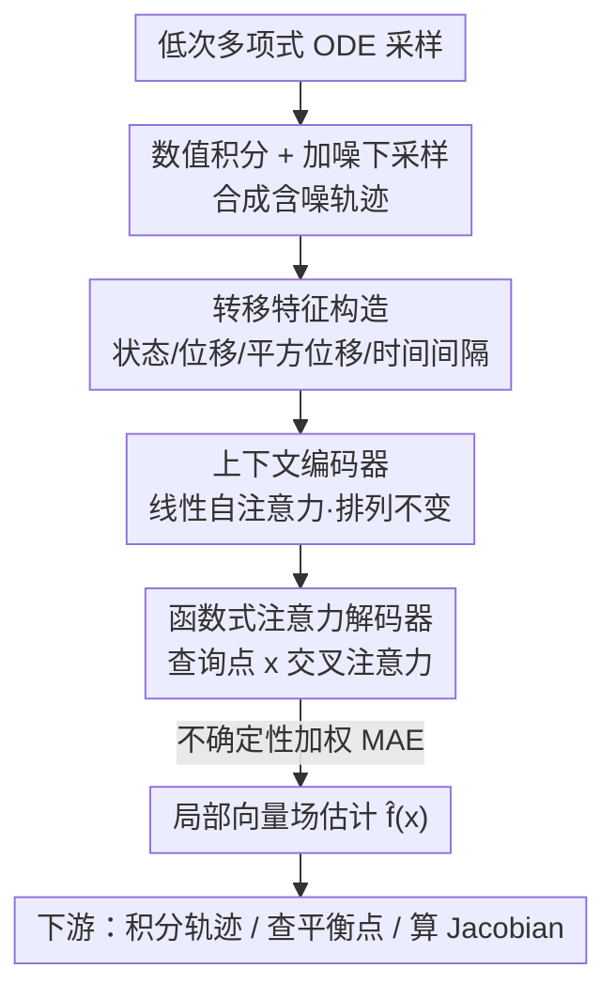

# Foundation Inference Models for Ordinary Differential Equations

**会议**: ICML2026  
**arXiv**: [2602.08733](https://arxiv.org/abs/2602.08733)  
**代码**: https://fim4science.github.io/OpenFIM/intro.html  
**领域**: 科学机器学习 / 动力系统  
**关键词**: ODE 推断, 基础推断模型, 神经算子, 零样本, 向量场

## 一句话总结
FIM-ODE 把"从含噪轨迹反推常微分方程向量场"这件事一次性摊销到预训练里：用一个只在低次多项式 ODE 先验上预训练的 8M 参数 Transformer 神经算子，单次前向就能零样本预测向量场，在 ODEBench 上以约 1/10 的参数、1/80 的训练数据匹配甚至超过符号回归基线 ODEFormer。

## 研究背景与动机
**领域现状**：常微分方程是科学建模的通用语言，从洛伦兹混沌到生态振荡都靠它描述。但反过来——"给一段含噪、稀疏的轨迹观测，反推出背后的向量场 $\mathbf{f}$"——一直很难。主流做法分三类：符号回归（如 SINDy）、高斯过程回归、以及 Neural ODE。

**现有痛点**：这三类方法都遵循"一份数据训一个模型"的经典范式。符号回归要先估时间导数，因此依赖干净且密集采样的轨迹，还高度依赖预设基函数库；GP 回归的效果强烈受先验核选择左右；Neural ODE 要反向传播穿过数值求解器或用慢速 adjoint，训练既贵又不稳。三者共同的代价是复杂的训练管线和大量 ML 调参经验。

**核心矛盾**：能不能把推断成本从"每来一个数据集就重新优化一次"挪到"一次性预训练"？这正是摊销推断（amortised inference）的思路——ODEFormer 已经做了第一步，但它在一个由多项式、三角、有理函数复合而成的复杂先验上预训练了约 5000 万个系统、模型有 86M 参数，目标是恢复向量场的**全局符号表达式**。

**切入角度**：作者提出两个反直觉的押注。其一，"简单规则能生成复杂模式"——也许只用**低次多项式**这一极简先验预训练，就足以泛化到真实系统。其二，向量场只在轨迹经过的区域被数据约束，那么与其追求全局符号式，不如**局部地**用神经算子表示向量场，在数据密集区反而能更准。

**核心 idea**：用"低次多项式先验 + 神经算子局部表示"取代"复杂先验 + 全局符号表达式"，把 ODE 反演变成单次前向的零样本推断，并保留对平衡点、Jacobian、稳定性的可解释查询能力。

## 方法详解

### 整体框架
FIM-ODE 沿用 Foundation Inference Model（FIM）框架，由两块拼成：一个**预训练先验**（决定模型见过哪类动力系统），和一个**神经推断模型**（把含噪观测映回向量场）。预训练时，先从多项式先验采一个向量场 $\mathbf{f}$，数值积分出若干条轨迹，再加噪声和随机下采样模拟真实观测；推断模型则学一个映射 $\mathbf{\hat{f}}_\theta:\mathbb{R}^d\times\mathcal{C}\to\mathbb{R}^d$，给定上下文数据集 $\mathcal{D}$（$K$ 条含噪轨迹）和任意查询点 $\mathbf{x}$，直接吐出该点的向量场估计。整条流水线如下：

### 关键设计

**1. 低次多项式预训练先验：用极简规则覆盖复杂动力学**

ODEFormer 押注于"先验越复杂、覆盖越广"，FIM-ODE 反其道而行：每个分量 $f_i:\mathbb{R}^d\to\mathbb{R}$ 只取**总次数不超过 3 的稀疏多元多项式**，系数独立采自 $\mathcal{N}(0,1)$，再随机屏蔽某些次数和单项式来引入稀疏与结构多样性，维度 $d\in\{1,2,3\}$。这么做有三层考量：很多经典 ODE（洛伦兹、生物振荡子）本就是低次多项式系统；多项式虽简单却能产生不动点、极限环、混沌吸引子等丰富行为；且多项式局部 Lipschitz，由 Picard–Lindelöf 定理保证解的存在唯一。作者还给出一个高斯过程视角：固定单项式 mask 后每个 $f_i$ 是有限维 GP，对 mask 边缘化则得到 GP 混合，方差随 $\|\mathbf{x}\|$ 增长（非平稳），这也解释了为何要丢弃发散轨迹。轨迹合成上：观测窗 $[0,10]$ 取 200 个等距点（$\Delta t=0.05$），用 Euler 法每区间 20 步积分，丢弃幅值超过 $10^2$ 的发散系统；再施加乘性高斯噪声 $y_i=(1+\epsilon)x_i,\ \epsilon\sim\mathcal{N}(0,\sigma^2),\ \sigma\in[0,0.06]$ 和概率 $\rho\in[0,0.5]$ 的 Bernoulli 下采样。

**2. 转移特征输入：把"有限差分即向量场"写进表示里**

直接喂原始轨迹会丢掉局部动力学信息。FIM-ODE 改为对每对相邻观测 $(\mathbf{y}_i,\mathbf{y}_{i+1})$ 构造一个转移元组，抽取四个量：当前状态 $\mathbf{y}_i$、位移 $\Delta\mathbf{y}_i=\mathbf{y}_{i+1}-\mathbf{y}_i$、逐元素平方位移 $\Delta\mathbf{y}_i^2$、以及观测间隔 $\Delta\tau_i$。动机直接来自 ODE 结构：比值 $\Delta\mathbf{y}_i/\Delta\tau_i$ 正是 $\mathbf{y}_i$ 处向量场的有限差分估计，平方位移则提供二阶矩补充。$K$ 条轨迹一共产出 $J=\sum_{k=1}^K(L_k-1)$ 个转移元组，构成与轨迹顺序无关的集合，天然适配后面的排列不变编码。配合"输入归一化"——每个状态维归零均值单位方差、把 $\Delta\tau$ 重心化到目标值，预测再用链式法则映回原坐标——让模型对不同 ODE 的时空尺度具备不变性。

**3. 神经算子编码-解码器：在任意查询点局部估计向量场**

模型是个基于注意力的神经算子，走 encoder-decoder 结构。编码器先把四个特征分量各自线性投影到 $n/4$ 维再拼成 $\mathbf{d}_i\in\mathbb{R}^n$，经两层**线性自注意力**得到排列不变的上下文表示 $\mathbf{C}=\Psi_{enc}(\mathbf{D},\mathbf{D},\mathbf{D})$。解码器是"函数式"的：给一个查询位置 $\mathbf{x}$，用线性映射嵌成 $\phi_\mathbf{x}(\mathbf{x})$ 作初始 query，过 $M$ 个交叉注意力块从 $\mathbf{C}$ 取键值，最后 MLP 映到 $\mathbb{R}^d$ 输出 $\mathbf{\hat{f}}_\theta(\mathbf{x}\mid\tilde{\mathcal{D}})$。关键在于解码器可在状态空间**任意点**求值，不局限于观测过的状态——这正是"局部向量场表示"的载体。架构脱胎于 FIM-SDE，但 ODE 的可辨识性更差：SDE 的随机项有全支撑、轨迹能更广地探索状态空间，而 ODE 轨迹只在所经路径上约束向量场，别处基本欠定，所以多项式先验"该长什么样"的设定在这里格外吃重。

**4. 不确定性加权损失：别让大速度区淹没近零速度区**

训练时按"一半查询点在观测数据空间范围内均匀采、一半沿真实 ODE 轨迹采"的混合策略取 $\mathbf{x}$，基础损失是预测与真值向量场的 MAE。问题在于向量场幅值在状态空间里差异巨大：原点附近 $\|\mathbf{f}(\mathbf{x})\|$ 可能接近 0，别处速度却很大；不加修正，优化会过度偏向高幅值区、忽视近零速度区的精度。作者引入异方差不确定性加权：一个辅助头预测 $U_\theta(\mathbf{x},\tilde{\mathcal{D}})$（解释为对数方差），目标变为

$$\mathcal{L}_\theta=\mathbb{E}_{(\mathbf{x},\tilde{\mathcal{D}},\mathbf{f})}\Big[e^{-U_\theta(\mathbf{x},\tilde{\mathcal{D}})}\,\|\mathbf{\hat{f}}_\theta(\mathbf{x}\mid\tilde{\mathcal{D}})-\mathbf{f}(\mathbf{x})\|+U_\theta(\mathbf{x},\tilde{\mathcal{D}})\Big],$$

对应一个带异方差尺度的 Laplace 似然。第一项按不确定度下调难估区域的权重，第二项防止 $U_\theta$ 退化到无穷大。

## 实验关键数据

### 主实验
预训练单个 13M 参数模型（8M 给 FIM-ODE 本体，5M 给不确定性头），合成 60 万个多项式 ODE 系统（1D 8 万 / 2D 21 万 / 3D 31 万）。在 ODEBench（61 个自治 ODE 系统，约 1/3 是非多项式即对 FIM-ODE 而言 OOD）上零样本对比 ODEFormer。

**轨迹重建**（指标：方差加权 $R^2>0.9$ 的系统占比，越高越好）：

| 方法 | $\rho{=}0,\sigma{=}0$ | $\rho{=}0,\sigma{=}0.05$ | $\rho{=}0.5,\sigma{=}0$ | $\rho{=}0.5,\sigma{=}0.05$ |
|------|------|------|------|------|
| ODEFormer (86M) | 63.1% | 61.5% | 63.9% | 61.5% |
| **FIM-ODE (8M)** | **84.4%** | **75.4%** | **82.8%** | **72.1%** |

FIM-ODE 在所有噪声/下采样配置下都稳定优于 ODEFormer，而它参数约小 10 倍、预训练系统数约少 80 倍（0.6M vs 50M）。轨迹**泛化**（从新初值出发）上两者相当（如 $\rho{=}0,\sigma{=}0.03$：FIM-ODE 32.8% vs ODEFormer 27.9%），FIM-ODE 在更宽松阈值下优势更明显。

### 系统辨识可解释性
作者在三个系统上做了"符号式"的动力学定性分析——通过最小化 $\|\mathbf{\hat{f}}_\theta\|$ 找候选平衡点、算 Jacobian、按谱分类稳定性：

| 系统 | 类型 | FIM-ODE 表现 | ODEFormer 表现 |
|------|------|------|------|
| 无摩擦摆 (ODE 28) | OOD（含 sin） | 失败：把原点附近偏成弱不稳定螺旋，破坏闭轨守恒结构 | 保住守恒结构、恢复中心+鞍点 |
| CDIMA 反应 (ODE 42) | OOD（有理项） | 强：正确识别 $(1.78,4.17)$ 附近不稳定螺旋 | 找到符号平衡点但稳定性判反（误判稳定螺旋） |
| Lotka-Volterra 竞争 (ODE 26) | ID（多项式） | 部分恢复：拟合好、近似出鞍点与稳定结点 | 部分恢复边界结构、未恢复完整共存几何 |

### 关键发现
- **局部 vs 全局的核心权衡**：FIM-ODE 只需在数据约束的区域近似向量场，因此即便全局函数形式 OOD（有理/三角），局部估计仍能迁移；ODEFormer 的全局符号承诺在无数据支撑的区域可能强加错误结构（如 CDIMA 把稳定性判反）。
- **极简先验够用**：把 ODEBench 拆成 ID/OOD 后，FIM-ODE 的优势并非只由 ID 系统驱动，验证了"低次多项式先验也能泛化到 OOD"的押注。
- **低数据 OOD 仍是软肋**：在极短/稀疏上下文（VDP、FHN 振荡子）下，两个预训练模型零样本都弱于经典逐数据集方法，且对噪声实现极敏感（100 次实验标准差很大）；补充更多上下文轨迹（"Large context"设置）能显著缓解，预训练也提供了快速稳定微调的良好初始化。

## 亮点与洞察
- **"简单先验 + 局部表示"是真正的反共识押注**：业界默认"先验越复杂覆盖越广、符号式越可解释"，本文用 8M 模型、低次多项式先验、神经算子局部表示同时打掉这两个假设，参数和数据都省一个量级——这种"少即是多"的反直觉结论最有信息量。
- **可解释性不靠符号式**：通常认为只有符号表达才能查平衡点/Jacobian/稳定性，本文证明神经算子向量场同样可被这样查询，甚至在 CDIMA 上比符号方法更准地保住了"不稳定螺旋"这一定性特征。
- **转移特征把领域归纳偏置写进输入**：$\Delta\mathbf{y}/\Delta\tau$ 即有限差分向量场估计，这个把 ODE 结构直接编进特征的做法，可迁移到任何"从轨迹反推动力学"的摊销推断任务。
- **不确定性加权解决幅值不均**：异方差 Laplace 似然让近零速度区不被高速区淹没，是处理"目标量纲跨区域剧烈变化"回归问题的通用 trick。

## 局限与展望
- **维度受限于数据管线**：架构本身不限维度，但当前数据生成只做到 $d\le 3$，限制了对高维真实系统的直接零样本应用。
- **欠定性是根本障碍**：ODE 轨迹只在所经路径约束向量场，别处欠定；数据驱动 ODE 反演本就 NP 难且存在不可辨识性，无摩擦摆的失败正是局部估计在欠约束区域的代价。
- **低数据零样本不可靠**：短而噪的上下文下零样本对噪声实现极敏感、标准差巨大，必须靠补轨迹或微调才稳——离"拿来即用"还有距离。
- **非平稳先验的副作用**：多项式先验方差随 $\|\mathbf{x}\|$ 增长、被最高次项主导，需要丢弃发散轨迹来稳定训练，作者在局限里也承认这对数据生成有影响。

## 相关工作与启发
- **vs ODEFormer**：同为摊销 ODE 反演，ODEFormer 用复杂先验（多项式+三角+有理）预训练 50M 系统、86M 参数、求全局符号式；本文用低次多项式极简先验、0.6M 系统、8M 参数、求局部神经算子表示，更小更省且在重建上更准，代价是低数据零样本稳定性不如逐数据集方法。
- **vs SINDy / 符号回归**：符号回归要估时间导数、依赖干净密采轨迹和预设基函数库；FIM-ODE 把先验固化进预训练、单次前向出结果，不需逐数据集优化和 ML 调参。
- **vs Neural ODE / GP-ODE**：Neural ODE 要反传穿求解器、训练贵且不稳，GP 方法强依赖核选择；FIM-ODE 零样本即用，且预训练还能当作快速稳定微调的初始化，在 OOD 微调时优于这些现代基线。
- **vs FIM-SDE**：架构同源，但 SDE 随机项全支撑带来更强可辨识性，ODE 的欠定性迫使本文把更多归纳偏置压到先验设计上。

## 评分
- 新颖性: ⭐⭐⭐⭐⭐ "极简先验+局部神经算子"双反共识押注，并把符号式可解释性迁到神经表示上
- 实验充分度: ⭐⭐⭐⭐ ODEBench 全配置对比+定性辨识分析扎实，但低数据/高维场景偏弱且坦诚承认
- 写作质量: ⭐⭐⭐⭐⭐ 动机推导清晰，局部 vs 全局权衡讲得透彻，失败案例不回避
- 价值: ⭐⭐⭐⭐ 为科学 ML 的"基础推断模型"路线提供了小而强的范式，工具与教程开源

<!-- RELATED:START -->

## 相关论文

- [\[AAAI 2026\] Towards a Foundation Model for Partial Differential Equations Across Physics Domains](../../AAAI2026/physics/towards_a_foundation_model_for_partial_differential_equations_across_physics_dom.md)
- [\[ICML 2025\] Finetuning Stellar Spectra Foundation Models with LoRA](../../ICML2025/physics/finetuning_stellar_spectra_foundation_models_with_lora.md)
- [\[ICML 2025\] Closed-form Symbolic Solutions: A New Perspective on Solving Partial Differential Equations](../../ICML2025/physics/closed-form_solutions_a_new_perspective_on_solving_differential_equations.md)
- [\[ICML 2026\] Interpretable Equivariant Marks for Contrastive Cosmological Inference](interpretable_neural_marked_statistics_for_cosmological_inference.md)
- [\[NeurIPS 2025\] The Platonic Universe: Do Foundation Models See the Same Sky?](../../NeurIPS2025/physics/the_platonic_universe_do_foundation_models_see_the_same_sky.md)

<!-- RELATED:END -->
